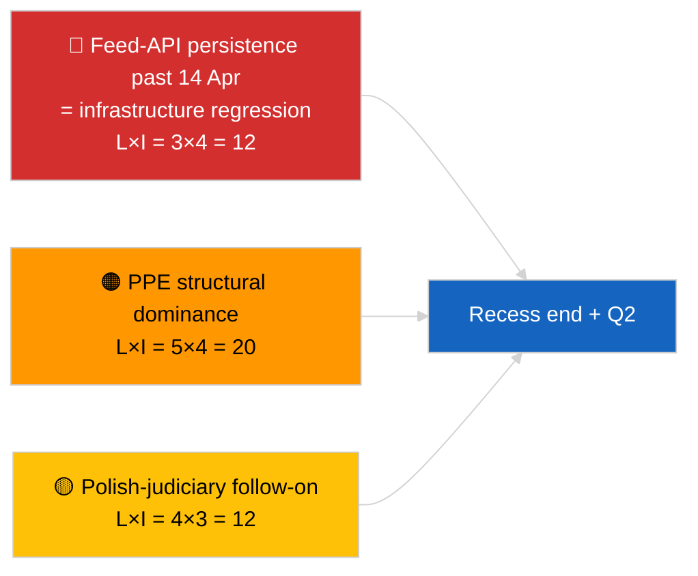

<!-- SPDX-FileCopyrightText: 2026 Hack23 AB -->
<!-- SPDX-License-Identifier: Apache-2.0 -->

# 执行简报 — 速报（休会中期战略综合）| 2026-04-05

**分类：** OSINT | 公开议会记录
**可信度：** 🟢 高（12小时纵向休会中期综合）
**生成日期：** 2026-04-05T00:00:00Z（回溯性简报）
**文章类型：** 速报 — 休会期间战略情报简报（12小时纵向综合）
**来源：** 欧洲议会开放数据门户

---

## 🎯 BLUF

**休会中期战略综合（第18天中的第10天）确认了延续至2026年第二季度的三个持续情报主题。** 第一，欧洲议会馈送API连续第3天处于降级状态，上游无可观察到的恢复——休会相关假设仍为首选。第二，EP10的联盟算术已稳定在PPE 38%的结构性主导地位，Renew–ECR凝聚力信号（~0.95）逐日保持。第三，3月底的反腐败 + 布劳恩 + 更好立法 + 公开获取改革集群仍是第一季度的主要机构公信力成果。精确的中间点时间节点（18天中已过9天）是未来规划的自然拐点。纵向模式稳定性**🟢 高可信度**；休会结束时馈送API恢复预测**🟡 中等可信度**。

---

## 🧭 本简报支持的3项决策

| # | 决策 | 决策者 | 截止日期 | 依据 |
|:-:|------|------|:------:|------|
| 1 | **编辑：** 将战略性休会中期综合作为纵向锚点发布 | 编辑部 | +24小时 | 12小时纵向数据 + 3个主题 |
| 2 | **监测：** 为4月14日休会后恢复测试做准备 | 数据管道 | 2026-04-14 | 拐点规划 |
| 3 | **前瞻监测：** 4月7日欧盟委员会周二议程作为下一个外部触发器 | 分析负责人 | 2026-04-07 | 复活节后首项机构活动 |

---

## 📰 60秒速读

- 🔴 **第18天中的第10天 — 复活节休会的精确中间点**（2026年3月27日 → 4月13日）。（🟢 高）
- 🟠 **3个持续主题**经12小时纵向综合确认：馈送降级、联盟算术稳定、改革集群延续。（🟢 高）
- 🟢 **今日无欧洲议会新活动**（周日，休会）。（🟢 高）
- 🟡 **Renew–ECR凝聚力信号逐日保持**，自2026-04-03起约0.95。（🟡 中等）
- 🔵 **经济背景：** 美国—欧盟贸易轨迹未变；IMF 4月WEO发布窗口临近。（🟢 高）
- 🟣 **交叉参考：** 姊妹报告`breaking`和`breaking-2`提供晨间基线；本次运行综合了两者。（🟢 高）
- 🩷 **干扰向量：** 波兰司法后续仍是4月全体会议最可能的意外情况。（🟡 中等）
- ⚪ **延续：** 第二季度全体会议准备工作于4月13日开始。

---

## 🗂️ 重要发现 — 休会中期综合

| 排名 | 发现 | 来源 | 重要性 | 可信度 |
|:--:|------|------|:----:|:----:|
| 1 | 欧洲议会馈送API降级（连续第3天） | 2026-04-03/breaking-2基线 | 8.0 | 🟢 高 |
| 2 | 联盟算术稳定（PPE 38% / Renew–ECR 0.95） | 2026-04-03/breaking, 2026-04-04/breaking | 7.5 | 🟡 中等 |
| 3 | 反腐败 / 改革集群（延续） | 2026-04-03/breaking-3 | 9.0 | 🟢 高 |
| 4 | 第18天中第10天无新EP活动 | 本次运行 | 0.0 | 🟢 高 |

---

## ⚠️ 风险与威胁快照

| 风险 | 可能性 | 影响 | 评分 | 触发因素 | 来源 | 海军准则 |
|-----|:-----:|:---:|:---:|---------|------|:-------:|
| 馈送API退化（4月14日后） | 3 | 4 | 12 | 无恢复 | 2026-04-03/breaking-2 | A1 |
| PPE结构性主导 | 5 | 4 | 20 | 所有多数都需要PPE | 联盟算术 | A1 |
| 波兰司法后续 | 4 | 3 | 12 | 新调查 | TA-10-2026-0088 | A1 |
| 第1层转置风险 | 4 | 4 | 16 | 国家间分歧 | TA-10-2026-0094 | A1 |

---

## 🔮 主要前瞻触发器

**2026年4月13日休会结束 + 复活节后首个欧盟委员会周二4月7日。** 这一复合触发器窗口将决定三个持续主题是否演变（API恢复、新行为者出现、改革实施开始）或持续至第二季度。

---

## 🛡️ 信息来源质量评估

- **一级来源：** 从2026-04-03 / 04-04实质性运行延续；对`breaking`和`breaking-2`晨间姊妹报告进行12小时纵向审查。
- **可信度：** 连续性声明🟢 高；预测窗口框架🟡 中等。

---

## 📎 链接

| 链接 | 路径 |
|-----|------|
| 文章 | `./article.md` |
| 姊妹运行 | `analysis/daily/2026-04-05/breaking/`, `breaking-2/` |
| 来源 — API探针 | `analysis/daily/2026-04-03/breaking-2/` |
| 来源 — 联盟基线 | `analysis/daily/2026-04-03/breaking/`, `analysis/daily/2026-04-04/breaking/` |
| 来源 — 改革集群 | `analysis/daily/2026-04-03/breaking-3/` |
| 清单 | `./manifest.json` |

---

**文档控制**
- **模板：** `/analysis/templates/executive-brief.md`
- **制品路径：** `analysis/daily/2026-04-05/breaking-3/executive-brief.md`
- **分类：** 公开
- **回溯性生成：** 回填会话。
