# Breaking — 2026-04-05

<h2 id="section-executive-brief">Executive Brief</h2>

### 🎯 BLUF

**No breaking news developments on 2026-04-05; EP is in Easter recess (Day 10 of 18, 27 March → 13 April 2026).** No parliamentary sessions, committee meetings, or votes scheduled. The week's intelligence signals (DEGRADED feed-API state, PPE 38% structural dominance, anti-corruption reform cluster) are inherited from the 2026-04-03 / 04-04 substantive runs. **🟢 HIGH confidence** the inactivity is calendar-driven.

---

### 🧭 3 Decisions This Brief Supports

| # | Decision | Who Decides | Deadline | Evidence |
|:-:|----------|-------------|:--------:|----------|
| 1 | **Editorial:** SKIP daily breaking | Editor | +12h | Recess Day 10 of 18 |
| 2 | **Monitoring:** maintain endpoint health watch | Data pipeline | daily | DEGRADED state |
| 3 | **Forward-watch:** Commission Tuesday 7 April, recess end 13 April | Analysis lead | 2026-04-07 | Q1→Q2 transition |

---

### 📰 60-Second Read

- 🔴 **No new EP activity** on 2026-04-05 (Sunday, Easter recess Day 10/18). (🟢 High)
- 🟠 **DEGRADED feed-API state continues** from 2026-04-03 probe. (🟢 High)
- 🟢 **Carry-over watch list:** anti-corruption (TA-10-2026-0094), Braun immunity (TA-10-2026-0088), US tariff (TA-10-2026-0096), HDV emissions (TA-10-2026-0084). (🟢 High)
- 🟡 **Coalition arithmetic stable**: PPE 38% / Grand Coalition 60%. (🟢 High)
- 🔵 **Economic context:** US-EU trade trajectory unchanged. (🟢 High)
- 🟣 **Cross-reference:** sibling `breaking-2` and `breaking-3` provide cross-session mid-recess synthesis. (🟢 High)
- 🩷 **Disruption vector:** none acute. (🟢 High)
- ⚪ **Carry-forward:** 8 days to recess end.

---

### 🗂️ Top Documents / Procedures Table

| Rank | EP reference | Title (short) | Significance | Confidence |
|:----:|--------------|---------------|:------------:|:----------:|
| 1 | — | No new procedures or adopted texts on 2026-04-05 | 0.0 | 🟢 HIGH |
| 2 | TA-10-2026-0094 | Anti-corruption (carry-over) | 9.0 | 🟢 HIGH |
| 3 | TA-10-2026-0088 | Braun immunity (carry-over) | 7.0 | 🟢 HIGH |

---

### ⚠️ Risk & Threat Snapshot

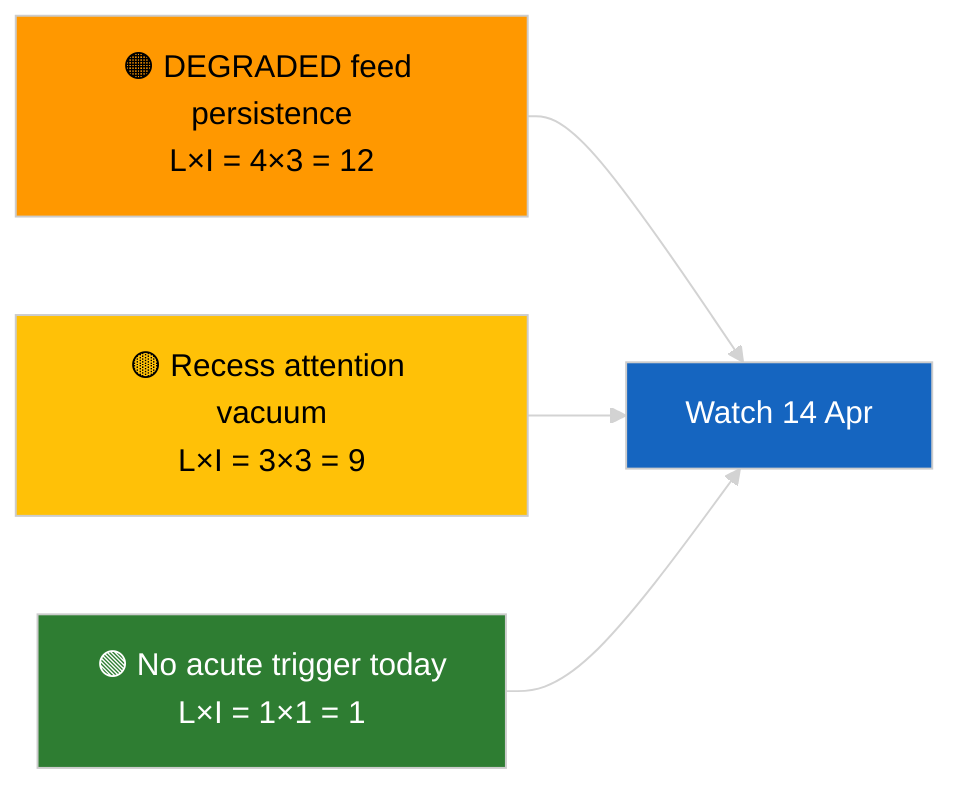
```mermaid
%%{init: {"theme":"dark"}}%%
graph LR
    R1["🟠 DEGRADED feed persistence<br/>L×I = 4×3 = 12"] --> CONS["Watch 14 Apr"]
    R2["🟡 Recess attention vacuum<br/>L×I = 3×3 = 9"] --> CONS
    R3["🟢 No acute trigger today<br/>L×I = 1×1 = 1"] --> CONS
    style R1 fill:#FF9800,color:#000000
    style R2 fill:#FFC107,color:#000000
    style R3 fill:#2E7D32,color:#FFFFFF
    style CONS fill:#1565C0,color:#FFFFFF
```

| Risk | L | I | Score | Trigger | Source | Admiralty |
|------|:-:|:-:|:-----:|---------|--------|:---------:|
| DEGRADED feed persistence | 4 | 3 | 12 | Past 14 April | 2026-04-03/breaking-2 | A1 |
| Recess attention vacuum | 3 | 3 | 9 | US or PL surprise | EP calendar | A2 |

---

### 🔮 Top Forward Trigger

**Commission Tuesday 7 April 2026** (first post-Easter college tabling) and **recess end 13 April**.

---

### 🛡️ Source Quality Assessment

- **Primary sources:** EP calendar; carry-over Q1 cluster.
- **Confidence:** 🟢 HIGH on calendar driver.

---

### 📎 Links

| Link | Path |
|------|------|
| Article | `./article.md` |
| Sibling runs | `analysis/daily/2026-04-05/breaking-2/`, `breaking-3/` |
| Manifest | `./manifest.json` |

---

**Document Control**
- **Template:** `/analysis/templates/executive-brief.md`
- **Artifact path:** `analysis/daily/2026-04-05/breaking/executive-brief.md`
- **Classification:** Public
- **Retrospective generation:** Back-fill session.

<h2 id="reader-intelligence-guide">Reader Intelligence Guide</h2>

Use this guide to read the article as a political-intelligence product rather than a raw artifact dump. High-value reader lenses appear first; technical provenance remains available in the audit appendices.

| Reader need | What you'll get | Source artifact |
|---|---|---|
| [BLUF and editorial decisions](#section-executive-brief) | fast answer to what happened, why it matters, who is accountable, and the next dated trigger | `executive-brief.md` |
| [Supplementary intelligence](#section-supplementary-intelligence) | additional markdown discovered in the run that has not yet been assigned to a canonical section | `executive-brief_ar.md` |

<h2 id="section-supplementary-intelligence">Supplementary Intelligence</h2>

### Executive Brief Ar

**التصنيف:** OSINT | سجل برلماني علني
**الثقة:** 🟢 مرتفعة (تقييم هيكلي خلال الفترة الاستراحية البرلمانية)
**تاريخ الإنشاء:** 2026-04-05T00:00:00Z (موجز استرجاعي)
**نوع المقال:** عاجل
**المصدر:** بوابة البيانات المفتوحة للبرلمان الأوروبي

---

### 🎯 BLUF

**لا توجد تطورات إخبارية عاجلة بتاريخ 2026-04-05؛ يوجد البرلمان الأوروبي في عطلة عيد الفصح (اليوم 10 من 18، من 27 مارس إلى 13 أبريل 2026).** لا جلسات عامة ولا اجتماعات لجان ولا تصويتات مجدولة. إشارات المعلومات الاستخباراتية للأسبوع (حالة API الخلاصة المتدهورة، الهيمنة الهيكلية لـ PPE بنسبة 38%، حزمة إصلاح مكافحة الفساد) موروثة من جلسات العمل الجوهرية في 2026-04-03 / 04-04. **🟢 ثقة مرتفعة** في أن عدم النشاط ذو طابع تقويمي.

---

### 🧭 3 Decisions This Brief Supports

| # | القرار | من يقرر | الموعد النهائي | الأدلة |
|:-:|--------|---------|:-------------:|--------|
| 1 | **تحرير:** تخطّي النشرة اليومية العاجلة | رئيس التحرير | +12 ساعة | يوم استراحة 10 من 18 |
| 2 | **مراقبة:** الإبقاء على مراقبة صحة نقطة النهاية | خط بيانات | يومياً | حالة متدهورة |
| 3 | **رصد استشرافي:** المفوضية يوم الثلاثاء 7 أبريل، انتهاء الاستراحة 13 أبريل | قائد التحليل | 2026-04-07 | انتقال Q1→Q2 |

---

### 📰 60-Second Read

- 🔴 **لا نشاط جديد للبرلمان الأوروبي** بتاريخ 2026-04-05 (الأحد، عطلة عيد الفصح اليوم 10/18). (🟢 مرتفعة)
- 🟠 **حالة API الخلاصة المتدهورة مستمرة** منذ سبر 2026-04-03. (🟢 مرتفعة)
- 🟢 **قائمة المراقبة المنقولة:** مكافحة الفساد (TA-10-2026-0094)، حصانة براون (TA-10-2026-0088)، تعريفات أمريكية (TA-10-2026-0096)، انبعاثات HDV (TA-10-2026-0084). (🟢 مرتفعة)
- 🟡 **الحسابات الائتلافية مستقرة**: PPE 38% / التحالف الكبير 60%. (🟢 مرتفعة)
- 🔵 **السياق الاقتصادي:** مسار التجارة بين الولايات المتحدة والاتحاد الأوروبي دون تغيير. (🟢 مرتفعة)
- 🟣 **إشارة مرجعية متبادلة:** جلستا الأخت `breaking-2` و`breaking-3` توفران تركيباً متوسط الاستراحة عبر الجلسات. (🟢 مرتفعة)
- 🩷 **ناقل الاضطراب:** لا شيء حاد. (🟢 مرتفعة)
- ⚪ **المنقول:** 8 أيام حتى نهاية الاستراحة.

---

### 🗂️ Top Documents / Procedures Table

| الرتبة | المرجع في البرلمان الأوروبي | العنوان (مختصر) | الأهمية | الثقة |
|:------:|---------------------------|----------------|:-------:|:-----:|
| 1 | — | لا إجراءات جديدة ولا نصوص معتمدة بتاريخ 2026-04-05 | 0.0 | 🟢 مرتفعة |
| 2 | TA-10-2026-0094 | مكافحة الفساد (منقول) | 9.0 | 🟢 مرتفعة |
| 3 | TA-10-2026-0088 | حصانة براون (منقول) | 7.0 | 🟢 مرتفعة |

---

### ⚠️ Risk & Threat Snapshot

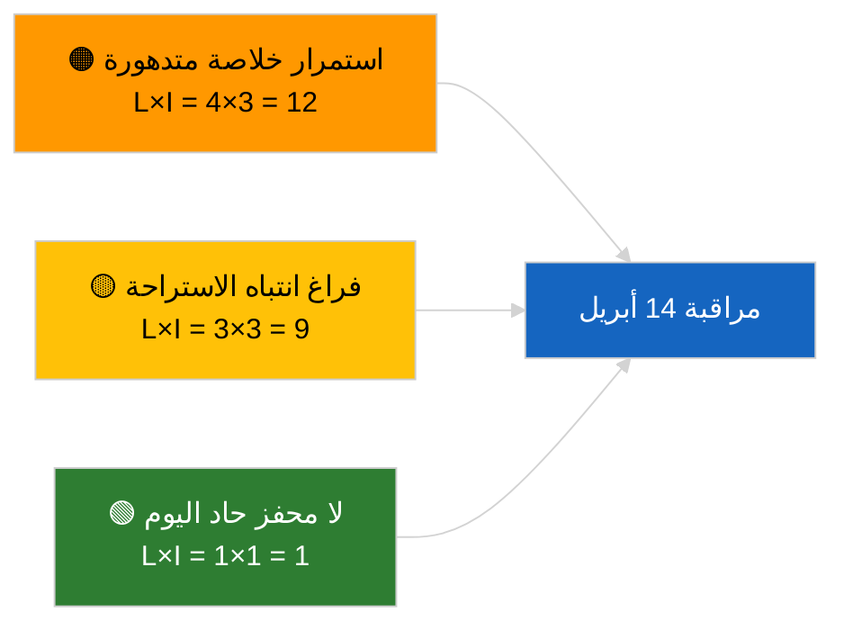
```mermaid
%%{init: {"theme":"dark"}}%%
graph LR
    R1["🟠 استمرار خلاصة متدهورة<br/>L×I = 4×3 = 12"] --> CONS["مراقبة 14 أبريل"]
    R2["🟡 فراغ انتباه الاستراحة<br/>L×I = 3×3 = 9"] --> CONS
    R3["🟢 لا محفز حاد اليوم<br/>L×I = 1×1 = 1"] --> CONS
    style R1 fill:#FF9800,color:#000000
    style R2 fill:#FFC107,color:#000000
    style R3 fill:#2E7D32,color:#FFFFFF
    style CONS fill:#1565C0,color:#FFFFFF
```

| الخطر | ا | ت | الدرجة | المحفز | المصدر | الأدميرالية |
|:-----:|:-:|:-:|:------:|--------|--------|:-----------:|
| استمرار خلاصة متدهورة | 4 | 3 | 12 | بعد 14 أبريل | 2026-04-03/breaking-2 | A1 |
| فراغ انتباه الاستراحة | 3 | 3 | 9 | مفاجأة أمريكية أو بولندية | تقويم البرلمان الأوروبي | A2 |

---

### 🔮 Top Forward Trigger

**المفوضية الأوروبية يوم الثلاثاء 7 أبريل 2026** (أول جلسة عمل بعد عيد الفصح) و**انتهاء الاستراحة 13 أبريل**.

---

### 🛡️ Source Quality Assessment

- **المصادر الأولية:** تقويم البرلمان الأوروبي؛ حزمة مناقلات Q1.
- **الثقة:** 🟢 مرتفعة في العامل التقويمي.

---

### 📎 Links

| الرابط | المسار |
|--------|--------|
| المقال | `./article.md` |
| جلسات الأخت | `analysis/daily/2026-04-05/breaking-2/`, `breaking-3/` |
| البيان الإلزامي | `./manifest.json` |

---

**ضبط الوثيقة**
- **القالب:** `/analysis/templates/executive-brief.md`
- **مسار المصنوع:** `analysis/daily/2026-04-05/breaking/executive-brief.md`
- **التصنيف:** عام
- **الإنشاء الاسترجاعي:** جلسة الملء الخلفي.

### Executive Brief Da

### 🎯 BLUF

**Ingen seneste nyheder den 2026-04-05; EP er i påskepause (Dag 10 af 18, 27. marts → 13. april 2026).** Ingen plenarmøder, udvalgsmøder eller afstemninger planlagt. Ugens efterretningssignaler (FORRINGET feed-API-tilstand, PPE's strukturelle dominans på 38 %, antikorruptions-reformklynge) er nedarvet fra de substantielle kørsler den 2026-04-03 / 04-04. **🟢 HØJ troværdighed** for at inaktiviteten er kalenderbestemt.

---

### 🧭 3 Decisions This Brief Supports

| # | Beslutning | Beslutningstagere | Frist | Beviser |
|:-:|-----------|-----------------|:-----:|---------|
| 1 | **Redaktion:** SPRING OVER daglig seneste nyt | Redaktør | +12t | Pausedag 10 af 18 |
| 2 | **Overvågning:** oprethold endepunkts-sundhedsovervågning | Datapipeline | dagligt | FORRINGET tilstand |
| 3 | **Fremsynet:** Kommissionen tirsdag 7. april, pauseafslutning 13. april | Analysechef | 2026-04-07 | Q1→Q2-overgang |

---

### 📰 60-Second Read

- 🔴 **Ingen ny EP-aktivitet** den 2026-04-05 (søndag, påskepause Dag 10/18). (🟢 Høj)
- 🟠 **FORRINGET feed-API-tilstand fortsætter** fra sonden 2026-04-03. (🟢 Høj)
- 🟢 **Overført overvågningsliste:** antikorruption (TA-10-2026-0094), Braun-immunitet (TA-10-2026-0088), amerikanske toldsatser (TA-10-2026-0096), HDV-emissioner (TA-10-2026-0084). (🟢 Høj)
- 🟡 **Koalitionsaritmik stabil**: PPE 38 % / Stor koalition 60 %. (🟢 Høj)
- 🔵 **Økonomisk kontekst:** USA-EU handelstrajektorie uændret. (🟢 Høj)
- 🟣 **Krydshenvisning:** søsterkørsler `breaking-2` og `breaking-3` leverer sessionskrydset midt-pause-syntese. (🟢 Høj)
- 🩷 **Forstyrrelsesvektor:** ingen akut. (🟢 Høj)
- ⚪ **Overførsel:** 8 dage til pauseafslutning.

---

### 🗂️ Top Documents / Procedures Table

| Rang | EP-reference | Titel (kort) | Betydning | Troværdighed |
|:----:|-------------|-------------|:---------:|:------------:|
| 1 | — | Ingen nye procedurer eller vedtagne tekster den 2026-04-05 | 0,0 | 🟢 HØJ |
| 2 | TA-10-2026-0094 | Antikorruption (overført) | 9,0 | 🟢 HØJ |
| 3 | TA-10-2026-0088 | Braun-immunitet (overført) | 7,0 | 🟢 HØJ |

---

### ⚠️ Risk & Threat Snapshot

```mermaid
%%{init: {"theme":"dark"}}%%
graph LR
    R1["🟠 FORRINGET feed-vedholdenhed<br/>L×I = 4×3 = 12"] --> CONS["Overvåg 14. apr."]
    R2["🟡 Opmærksomhedsvakuum pause<br/>L×I = 3×3 = 9"] --> CONS
    R3["🟢 Ingen akut udløser i dag<br/>L×I = 1×1 = 1"] --> CONS
    style R1 fill:#FF9800,color:#000000
    style R2 fill:#FFC107,color:#000000
    style R3 fill:#2E7D32,color:#FFFFFF
    style CONS fill:#1565C0,color:#FFFFFF
```

| Risiko | S | P | Score | Udløser | Kilde | Admiralitet |
|--------|:-:|:-:|:-----:|---------|-------|:-----------:|
| FORRINGET feed-vedholdenhed | 4 | 3 | 12 | Efter 14. april | 2026-04-03/breaking-2 | A1 |
| Opmærksomhedsvakuum pause | 3 | 3 | 9 | USA- eller PL-overraskelse | EP-kalender | A2 |

---

### 🔮 Top Forward Trigger

**Kommissionen tirsdag 7. april 2026** (første post-påske tabelopstilling) og **pauseafslutning 13. april**.

---

### 🛡️ Source Quality Assessment

- **Primære kilder:** EP-kalender; Q1-overførselsklynge.
- **Troværdighed:** 🟢 HØJ på kalenderfaktor.

---

### 📎 Links

| Link | Sti |
|------|-----|
| Artikel | `./article.md` |
| Søsterkørsler | `analysis/daily/2026-04-05/breaking-2/`, `breaking-3/` |
| Manifest | `./manifest.json` |

---

**Dokumentkontrol**
- **Skabelon:** `/analysis/templates/executive-brief.md`
- **Artefaktsti:** `analysis/daily/2026-04-05/breaking/executive-brief.md`
- **Klassificering:** Offentlig
- **Retrospektiv generering:** Back-fill session.

### Executive Brief De

### 🎯 BLUF

**Keine aktuellen Nachrichten am 2026-04-05; das EP befindet sich in der Osterpause (Tag 10 von 18, 27. März → 13. April 2026).** Keine Plenarsitzungen, Ausschusssitzungen oder Abstimmungen angesetzt. Die Informationssignale der Woche (DEGRADIERTER Feed-API-Zustand, strukturelle PPE-Dominanz von 38 %, Anti-Korruptionsreform-Cluster) stammen aus den substantiellen Läufen vom 2026-04-03 / 04-04. **🟢 HOHE Konfidenz**, dass die Inaktivität kalenderbedingt ist.

---

### 🧭 3 Decisions This Brief Supports

| # | Entscheidung | Entscheider | Frist | Belege |
|:-:|-------------|------------|:-----:|--------|
| 1 | **Redaktion:** Tageliche Eilmeldung ÜBERSPRINGEN | Chefredakteur | +12h | Pausentag 10 von 18 |
| 2 | **Überwachung:** Endpunkt-Gesundheitsüberwachung beibehalten | Datenpipeline | täglich | DEGRADIERTER Zustand |
| 3 | **Vorausschau:** Kommission Dienstag 7. April, Pausenende 13. April | Analyseleitung | 2026-04-07 | Q1→Q2-Übergang |

---

### 📰 60-Second Read

- 🔴 **Keine neuen EP-Aktivitäten** am 2026-04-05 (Sonntag, Osterpause Tag 10/18). (🟢 Hoch)
- 🟠 **DEGRADIERTER Feed-API-Zustand setzt sich fort** seit Sonde 2026-04-03. (🟢 Hoch)
- 🟢 **Übertragungs-Beobachtungsliste:** Anti-Korruption (TA-10-2026-0094), Braun-Immunität (TA-10-2026-0088), US-Zölle (TA-10-2026-0096), HDV-Emissionen (TA-10-2026-0084). (🟢 Hoch)
- 🟡 **Koalitionsarithmetik stabil**: PPE 38 % / Große Koalition 60 %. (🟢 Hoch)
- 🔵 **Wirtschaftlicher Kontext:** US-EU-Handelsentwicklung unverändert. (🟢 Hoch)
- 🟣 **Querverweisen:** Geschwisterdurchläufe `breaking-2` und `breaking-3` liefern sitzungsübergreifende Mitten-Pausen-Synthese. (🟢 Hoch)
- 🩷 **Störungsvektor:** keiner akut. (🟢 Hoch)
- ⚪ **Übertragung:** 8 Tage bis Pausenende.

---

### 🗂️ Top Documents / Procedures Table

| Rang | EP-Referenz | Titel (kurz) | Bedeutung | Konfidenz |
|:----:|-------------|-------------|:---------:|:---------:|
| 1 | — | Keine neuen Verfahren oder angenommenen Texte am 2026-04-05 | 0,0 | 🟢 HOCH |
| 2 | TA-10-2026-0094 | Anti-Korruption (Übertragung) | 9,0 | 🟢 HOCH |
| 3 | TA-10-2026-0088 | Braun-Immunität (Übertragung) | 7,0 | 🟢 HOCH |

---

### ⚠️ Risk & Threat Snapshot

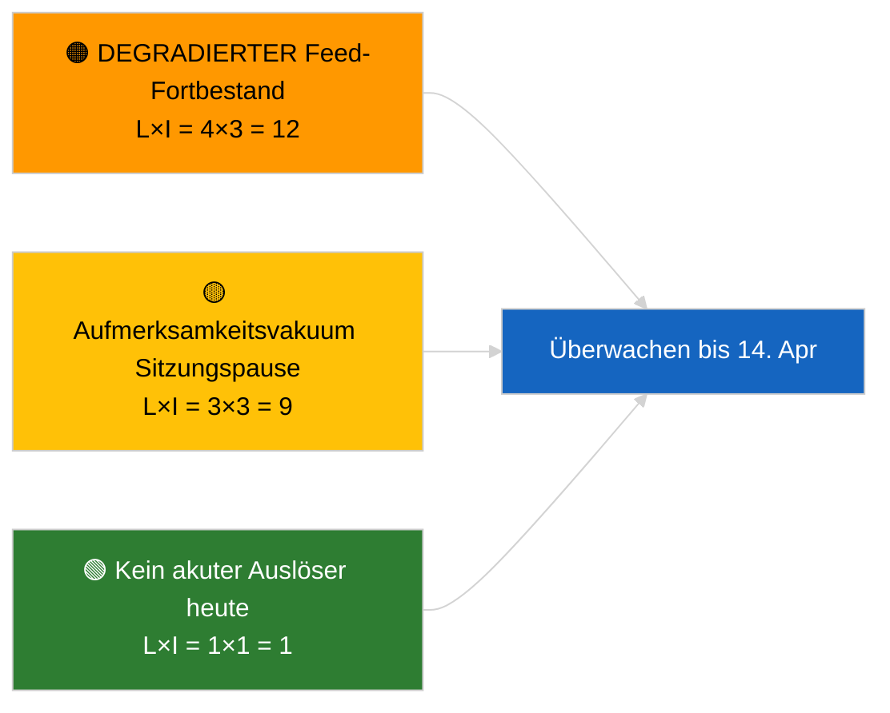
```mermaid
%%{init: {"theme":"dark"}}%%
graph LR
    R1["🟠 DEGRADIERTER Feed-Fortbestand<br/>L×I = 4×3 = 12"] --> CONS["Überwachen bis 14. Apr"]
    R2["🟡 Aufmerksamkeitsvakuum Sitzungspause<br/>L×I = 3×3 = 9"] --> CONS
    R3["🟢 Kein akuter Auslöser heute<br/>L×I = 1×1 = 1"] --> CONS
    style R1 fill:#FF9800,color:#000000
    style R2 fill:#FFC107,color:#000000
    style R3 fill:#2E7D32,color:#FFFFFF
    style CONS fill:#1565C0,color:#FFFFFF
```

| Risiko | W | A | Punktzahl | Auslöser | Quelle | Admiralität |
|--------|:-:|:-:|:---------:|---------|--------|:-----------:|
| DEGRADIERTER Feed-Fortbestand | 4 | 3 | 12 | Nach 14. April | 2026-04-03/breaking-2 | A1 |
| Aufmerksamkeitsvakuum Pause | 3 | 3 | 9 | US- oder PL-Überraschung | EP-Kalender | A2 |

---

### 🔮 Top Forward Trigger

**Kommission Dienstag 7. April 2026** (erste Befassung nach Ostern) und **Pausenende 13. April**.

---

### 🛡️ Source Quality Assessment

- **Primärquellen:** EP-Kalender; Q1-Übertragungs-Cluster.
- **Konfidenz:** 🟢 HOCH bezüglich des Kalendertreibers.

---

### 📎 Links

| Link | Pfad |
|------|------|
| Artikel | `./article.md` |
| Geschwisterdurchläufe | `analysis/daily/2026-04-05/breaking-2/`, `breaking-3/` |
| Manifest | `./manifest.json` |

---

**Dokumentenkontrolle**
- **Vorlage:** `/analysis/templates/executive-brief.md`
- **Artefaktpfad:** `analysis/daily/2026-04-05/breaking/executive-brief.md`
- **Klassifizierung:** Öffentlich
- **Retrospektive Erstellung:** Nachfüll-Sitzung.

### Executive Brief Es

### 🎯 BLUF

**Sin noticias de última hora el 2026-04-05; el PE está en receso de Semana Santa (Día 10 de 18, del 27 de marzo al 13 de abril de 2026).** No hay sesiones plenarias, reuniones de comisión ni votaciones programadas. Las señales de inteligencia de la semana (estado DEGRADADO de la API de feed, dominancia estructural del PPE del 38 %, clúster de reforma anticorrupción) se heredan de las sesiones sustantivas del 2026-04-03 / 04-04. **🟢 ALTA confianza** en que la inactividad es de carácter calendárico.

---

### 🧭 3 Decisions This Brief Supports

| # | Decisión | Responsable | Plazo | Evidencia |
|:-:|---------|------------|:-----:|-----------|
| 1 | **Editorial:** OMITIR la última hora diaria | Editor | +12h | Día de receso 10 de 18 |
| 2 | **Monitoreo:** mantener la vigilancia del estado de los endpoints | Canalización de datos | diario | Estado DEGRADADO |
| 3 | **Vigilancia prospectiva:** Comisión martes 7 de abril, fin del receso 13 de abril | Responsable de análisis | 2026-04-07 | Transición Q1→Q2 |

---

### 📰 60-Second Read

- 🔴 **Sin nueva actividad del PE** el 2026-04-05 (domingo, receso de Semana Santa Día 10/18). (🟢 Alta)
- 🟠 **El estado DEGRADADO de la API de feed continúa** desde la sonda del 2026-04-03. (🟢 Alta)
- 🟢 **Lista de seguimiento pendiente:** anticorrupción (TA-10-2026-0094), inmunidad Braun (TA-10-2026-0088), aranceles EE. UU. (TA-10-2026-0096), emisiones HDV (TA-10-2026-0084). (🟢 Alta)
- 🟡 **Aritmética de coalición estable**: PPE 38 % / Gran coalición 60 %. (🟢 Alta)
- 🔵 **Contexto económico:** trayectoria comercial UE-EE. UU. sin cambios. (🟢 Alta)
- 🟣 **Referencia cruzada:** las sesiones hermanas `breaking-2` y `breaking-3` proporcionan síntesis interoperable de mediados del receso. (🟢 Alta)
- 🩷 **Vector de perturbación:** ninguno agudo. (🟢 Alta)
- ⚪ **Traslado:** 8 días para el fin del receso.

---

### 🗂️ Top Documents / Procedures Table

| Rango | Referencia PE | Título (resumido) | Relevancia | Confianza |
|:-----:|--------------|-------------------|:----------:|:---------:|
| 1 | — | Sin nuevos procedimientos ni textos adoptados el 2026-04-05 | 0,0 | 🟢 ALTA |
| 2 | TA-10-2026-0094 | Anticorrupción (pendiente) | 9,0 | 🟢 ALTA |
| 3 | TA-10-2026-0088 | Inmunidad Braun (pendiente) | 7,0 | 🟢 ALTA |

---

### ⚠️ Risk & Threat Snapshot

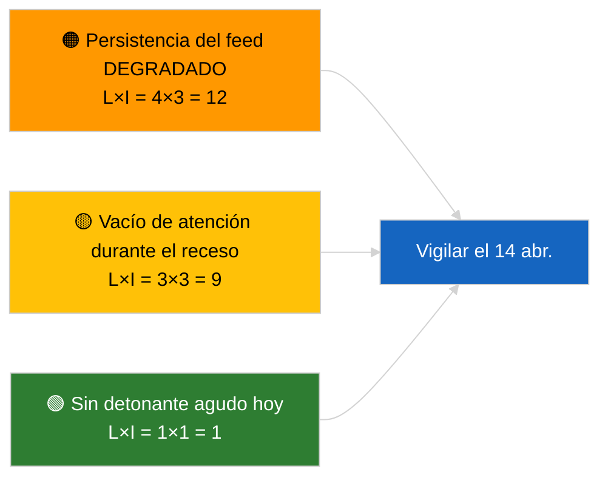
```mermaid
%%{init: {"theme":"dark"}}%%
graph LR
    R1["🟠 Persistencia del feed DEGRADADO<br/>L×I = 4×3 = 12"] --> CONS["Vigilar el 14 abr."]
    R2["🟡 Vacío de atención durante el receso<br/>L×I = 3×3 = 9"] --> CONS
    R3["🟢 Sin detonante agudo hoy<br/>L×I = 1×1 = 1"] --> CONS
    style R1 fill:#FF9800,color:#000000
    style R2 fill:#FFC107,color:#000000
    style R3 fill:#2E7D32,color:#FFFFFF
    style CONS fill:#1565C0,color:#FFFFFF
```

| Riesgo | V | I | Puntuación | Detonante | Fuente | Almirantazgo |
|--------|:-:|:-:|:----------:|----------|--------|:------------:|
| Persistencia feed DEGRADADO | 4 | 3 | 12 | Después del 14 de abril | 2026-04-03/breaking-2 | A1 |
| Vacío de atención receso | 3 | 3 | 9 | Sorpresa EE. UU. o PL | Calendario PE | A2 |

---

### 🔮 Top Forward Trigger

**Comisión martes 7 de abril de 2026** (primera presentación post-Semana Santa) y **fin del receso el 13 de abril**.

---

### 🛡️ Source Quality Assessment

- **Fuentes primarias:** Calendario PE; clúster de pendientes del Q1.
- **Confianza:** 🟢 ALTA en el factor calendárico.

---

### 📎 Links

| Enlace | Ruta |
|--------|------|
| Artículo | `./article.md` |
| Sesiones hermanas | `analysis/daily/2026-04-05/breaking-2/`, `breaking-3/` |
| Manifiesto | `./manifest.json` |

---

**Control del documento**
- **Plantilla:** `/analysis/templates/executive-brief.md`
- **Ruta del artefacto:** `analysis/daily/2026-04-05/breaking/executive-brief.md`
- **Clasificación:** Público
- **Generación retrospectiva:** Sesión de relleno.

### Executive Brief Fi

### 🎯 BLUF

**Ei viimeisintä uutista 2026-04-05; EP on pääsiäistauolla (Päivä 10/18, 27. maaliskuuta → 13. huhtikuuta 2026).** Ei täysistuntoja, valiokuntakokouksia eikä äänestyksiä. Viikon tiedustellusignaalit (HEIKENTYNYT syöte-API-tila, EPP:n rakenteellinen 38 %:n hallitsevuus, korruptiontorjunnan uudistusryväs) on peritty 2026-04-03 / 04-04 sisällöllisistä ajoista. **🟢 KORKEA luotettavuus** sille, että passiivisuus on kalenterin mukaista.

---

### 🧭 3 Decisions This Brief Supports

| # | Päätös | Päätöksentekijä | Määräaika | Todisteet |
|:-:|-------|----------------|:----------:|-----------|
| 1 | **Toimitus:** JÄtä VÄLIIN päivittäinen viimeisin uutinen | Toimittaja | +12h | Taukopäivä 10/18 |
| 2 | **Seuranta:** ylläpidä päätepisteen terveysseurantaa | Datapuoliputki | päivittäin | HEIKENTYNYT tila |
| 3 | **Ennakkokatse:** Komissio tiistaina 7. huhtikuuta, tauon päätös 13. huhtikuuta | Analyysipäällikkö | 2026-04-07 | Q1→Q2-siirtymä |

---

### 📰 60-Second Read

- 🔴 **Ei uusia EP-toimia** 2026-04-05 (sunnuntai, pääsiäistauko Päivä 10/18). (🟢 Korkea)
- 🟠 **HEIKENTYNYT syöte-API-tila jatkuu** 2026-04-03 koettimesta lähtien. (🟢 Korkea)
- 🟢 **Siirretty seurantalista:** korruptiontorjunta (TA-10-2026-0094), Braunin koskemattomuus (TA-10-2026-0088), Yhdysvaltojen tullimaksut (TA-10-2026-0096), HDV-päästöt (TA-10-2026-0084). (🟢 Korkea)
- 🟡 **Koalitioaritmetiikka vakaa**: EPP 38 % / Suurkoalitio 60 %. (🟢 Korkea)
- 🔵 **Taloudellinen asiayhteys:** Yhdysvaltojen ja EU:n kaupan kehityssuunta muuttumaton. (🟢 Korkea)
- 🟣 **Ristiviittaus:** sisarusajot `breaking-2` ja `breaking-3` tarjoavat istuntojen välisen tauon synteesin. (🟢 Korkea)
- 🩷 **Häiriövektori:** ei akuuttia. (🟢 Korkea)
- ⚪ **Siirto:** 8 päivää tauon loppuun.

---

### 🗂️ Top Documents / Procedures Table

| Sija | EP-viite | Otsikko (lyhyt) | Merkitys | Luotettavuus |
|:----:|---------|----------------|:--------:|:------------:|
| 1 | — | Ei uusia menettelyjä tai hyväksyttyjä tekstejä 2026-04-05 | 0,0 | 🟢 KORKEA |
| 2 | TA-10-2026-0094 | Korruptiontorjunta (siirretty) | 9,0 | 🟢 KORKEA |
| 3 | TA-10-2026-0088 | Braunin koskemattomuus (siirretty) | 7,0 | 🟢 KORKEA |

---

### ⚠️ Risk & Threat Snapshot

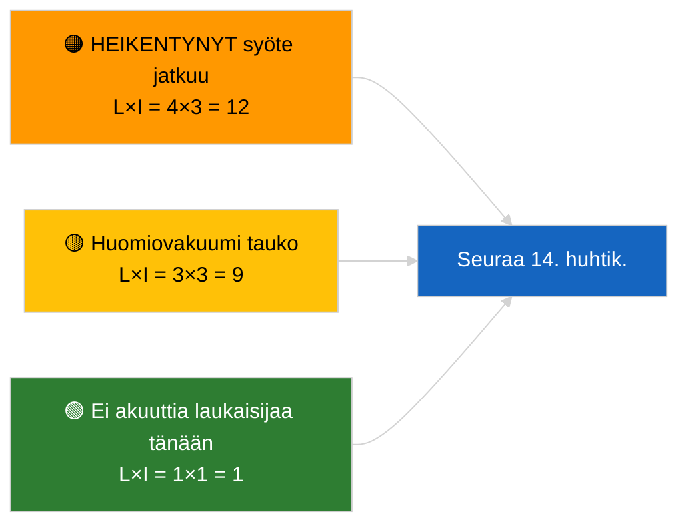
```mermaid
%%{init: {"theme":"dark"}}%%
graph LR
    R1["🟠 HEIKENTYNYT syöte jatkuu<br/>L×I = 4×3 = 12"] --> CONS["Seuraa 14. huhtik."]
    R2["🟡 Huomiovakuumi tauko<br/>L×I = 3×3 = 9"] --> CONS
    R3["🟢 Ei akuuttia laukaisijaa tänään<br/>L×I = 1×1 = 1"] --> CONS
    style R1 fill:#FF9800,color:#000000
    style R2 fill:#FFC107,color:#000000
    style R3 fill:#2E7D32,color:#FFFFFF
    style CONS fill:#1565C0,color:#FFFFFF
```

| Riski | T | V | Pisteet | Laukaisija | Lähde | Amiraliteetti |
|-------|:-:|:-:|:-------:|-----------|-------|:-------------:|
| HEIKENTYNYT syöte jatkuu | 4 | 3 | 12 | 14. huhtikuun jälkeen | 2026-04-03/breaking-2 | A1 |
| Huomiovakuumi tauko | 3 | 3 | 9 | Yhdysvaltojen tai PL:n yllätys | EP-kalenteri | A2 |

---

### 🔮 Top Forward Trigger

**Komissio tiistaina 7. huhtikuuta 2026** (ensimmäinen pääsiäisen jälkeinen esittelykokous) ja **tauon päätös 13. huhtikuuta**.

---

### 🛡️ Source Quality Assessment

- **Ensisijaiset lähteet:** EP-kalenteri; Q1-siirretty ryväs.
- **Luotettavuus:** 🟢 KORKEA kalenteritekijän osalta.

---

### 📎 Links

| Linkki | Polku |
|--------|-------|
| Artikkeli | `./article.md` |
| Sisarusajot | `analysis/daily/2026-04-05/breaking-2/`, `breaking-3/` |
| Manifest | `./manifest.json` |

---

**Asiakirjavalvonta**
- **Malli:** `/analysis/templates/executive-brief.md`
- **Artefaktipolku:** `analysis/daily/2026-04-05/breaking/executive-brief.md`
- **Luokittelu:** Julkinen
- **Retrospektiivinen luonti:** Takaisinpäin täyttö -istunto.

### Executive Brief Fr

### 🎯 BLUF

**Aucun développement d'actualité le 2026-04-05 ; le PE est en pause pascale (Jour 10 sur 18, du 27 mars au 13 avril 2026).** Aucune session plénière, aucune réunion de commission ni vote planifié. Les signaux de renseignement de la semaine (état dégradé de l'API de flux, dominance structurelle du PPE à 38 %, cluster réforme anti-corruption) sont repris depuis les sessions substantielles des 2026-04-03 / 04-04. **🟢 HAUTE confiance** sur le fait que l'inactivité est de nature calendaire.

---

### 🧭 3 Decisions This Brief Supports

| # | Décision | Décideur | Échéance | Preuves |
|:-:|---------|---------|:--------:|---------|
| 1 | **Éditorial :** IGNORER l'actualité quotidienne | Rédacteur en chef | +12h | Jour de pause 10 sur 18 |
| 2 | **Surveillance :** maintenir la veille de santé des points de terminaison | Pipeline de données | quotidien | État DÉGRADÉ |
| 3 | **Veille prospective :** Commission mardi 7 avril, fin de pause 13 avril | Responsable d'analyse | 2026-04-07 | Transition Q1→Q2 |

---

### 📰 60-Second Read

- 🔴 **Aucune nouvelle activité PE** le 2026-04-05 (dimanche, pause pascale Jour 10/18). (🟢 Élevée)
- 🟠 **L'état DÉGRADÉ de l'API de flux persiste** depuis la sonde du 2026-04-03. (🟢 Élevée)
- 🟢 **Liste de surveillance reprise :** anti-corruption (TA-10-2026-0094), immunité Braun (TA-10-2026-0088), tarifs américains (TA-10-2026-0096), émissions HDV (TA-10-2026-0084). (🟢 Élevée)
- 🟡 **Arithmétique de coalition stable** : PPE 38 % / Grande coalition 60 %. (🟢 Élevée)
- 🔵 **Contexte économique :** trajectoire commerciale UE-États-Unis inchangée. (🟢 Élevée)
- 🟣 **Référence croisée :** les sessions sœurs `breaking-2` et `breaking-3` fournissent une synthèse croisée de mi-pause. (🟢 Élevée)
- 🩷 **Vecteur de perturbation :** aucun aigu. (🟢 Élevée)
- ⚪ **Report :** 8 jours avant la fin de la pause.

---

### 🗂️ Top Documents / Procedures Table

| Rang | Référence PE | Titre (abrégé) | Importance | Fiabilité |
|:----:|-------------|----------------|:----------:|:---------:|
| 1 | — | Aucune nouvelle procédure ni texte adopté le 2026-04-05 | 0,0 | 🟢 ÉLEVÉE |
| 2 | TA-10-2026-0094 | Anti-corruption (report) | 9,0 | 🟢 ÉLEVÉE |
| 3 | TA-10-2026-0088 | Immunité Braun (report) | 7,0 | 🟢 ÉLEVÉE |

---

### ⚠️ Risk & Threat Snapshot

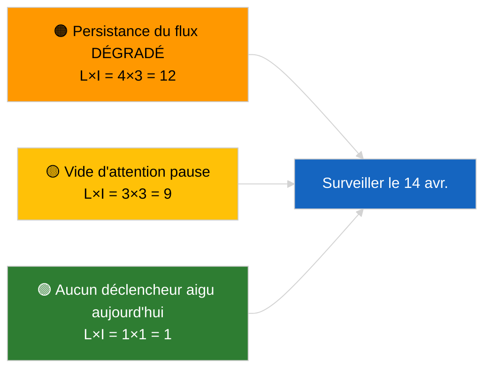
```mermaid
%%{init: {"theme":"dark"}}%%
graph LR
    R1["🟠 Persistance du flux DÉGRADÉ<br/>L×I = 4×3 = 12"] --> CONS["Surveiller le 14 avr."]
    R2["🟡 Vide d'attention pause<br/>L×I = 3×3 = 9"] --> CONS
    R3["🟢 Aucun déclencheur aigu aujourd'hui<br/>L×I = 1×1 = 1"] --> CONS
    style R1 fill:#FF9800,color:#000000
    style R2 fill:#FFC107,color:#000000
    style R3 fill:#2E7D32,color:#FFFFFF
    style CONS fill:#1565C0,color:#FFFFFF
```

| Risque | V | I | Score | Déclencheur | Source | Admirauté |
|--------|:-:|:-:|:-----:|------------|--------|:---------:|
| Persistance flux DÉGRADÉ | 4 | 3 | 12 | Après le 14 avril | 2026-04-03/breaking-2 | A1 |
| Vide d'attention pause | 3 | 3 | 9 | Surprise US ou PL | Calendrier PE | A2 |

---

### 🔮 Top Forward Trigger

**Réunion de la Commission mardi 7 avril 2026** (premier tableau post-Pâques) et **fin de pause le 13 avril**.

---

### 🛡️ Source Quality Assessment

- **Sources primaires :** Calendrier PE ; cluster de report Q1.
- **Fiabilité :** 🟢 ÉLEVÉE sur le facteur calendaire.

---

### 📎 Links

| Lien | Chemin |
|------|--------|
| Article | `./article.md` |
| Sessions sœurs | `analysis/daily/2026-04-05/breaking-2/`, `breaking-3/` |
| Manifeste | `./manifest.json` |

---

**Contrôle du document**
- **Modèle :** `/analysis/templates/executive-brief.md`
- **Chemin de l'artefact :** `analysis/daily/2026-04-05/breaking/executive-brief.md`
- **Classification :** Public
- **Génération rétrospective :** Session de remplissage.

### Executive Brief He

**סיווג:** OSINT | רשומה פרלמנטרית ציבורית
**אמינות:** 🟢 גבוהה (הערכה מבנית בתקופת הפסקה פרלמנטרית)
**נוצר:** 2026-04-05T00:00:00Z (תקציר רטרואקטיבי)
**סוג המאמר:** חדשות שוטפות
**מקור:** פורטל הנתונים הפתוחים של הפרלמנט האירופי

---

### 🎯 BLUF

**אין חדשות שוטפות ב-2026-04-05; ה-EP נמצא בחופשת פסחא (יום 10 מתוך 18, 27 במרץ → 13 באפריל 2026).** אין מושבים מליאים, ישיבות ועדה או הצבעות מתוזמנות. אותות המודיעין של השבוע (מצב API מוזנק DEGRADED, שליטה מבנית של PPE ב-38%, אשכול רפורמת נגד שחיתות) עוברים בירושה מהמפגשים המהותיים של 2026-04-03 / 04-04. **🟢 אמינות גבוהה** שהחוסר פעילות הוא לוחי זמנים.

---

### 🧭 3 Decisions This Brief Supports

| # | ההחלטה | מי מחליט | דדליין | ראיות |
|:-:|---------|----------|:------:|-------|
| 1 | **עריכה:** לדלג על החדשות השוטפות היומיות | עורך | +12 שעות | יום הפסקה 10 מתוך 18 |
| 2 | **ניטור:** לשמור על מעקב בריאות נקודות קצה | צינור נתונים | יומי | מצב DEGRADED |
| 3 | **מעקב קדימה:** הנציבות יום שלישי 7 באפריל, סוף ההפסקה 13 באפריל | ראש ניתוח | 2026-04-07 | מעבר Q1→Q2 |

---

### 📰 60-Second Read

- 🔴 **אין פעילות EP חדשה** ב-2026-04-05 (ראשון, חופשת פסחא יום 10/18). (🟢 גבוהה)
- 🟠 **מצב API מוזנק DEGRADED נמשך** מהחישוש ב-2026-04-03. (🟢 גבוהה)
- 🟢 **רשימת מעקב שמועברת:** נגד שחיתות (TA-10-2026-0094), חסינות Braun (TA-10-2026-0088), מכסי ארה"ב (TA-10-2026-0096), פליטות HDV (TA-10-2026-0084). (🟢 גבוהה)
- 🟡 **חשבון אריתמטי של קואליציה יציב**: PPE 38% / קואליציה גדולה 60%. (🟢 גבוהה)
- 🔵 **הקשר כלכלי:** מסלול המסחר בין ארה"ב לאיחוד האירופי ללא שינוי. (🟢 גבוהה)
- 🟣 **הפניה צולבת:** מפגשי האחות `breaking-2` ו-`breaking-3` מספקים סינתזת אמצע הפסקה בין-סשיונלית. (🟢 גבוהה)
- 🩷 **וקטור שיבוש:** אין דחוף. (🟢 גבוהה)
- ⚪ **מועבר קדימה:** 8 ימים עד סוף ההפסקה.

---

### 🗂️ Top Documents / Procedures Table

| דרגה | מפנה EP | כותרת (קצר) | חשיבות | אמינות |
|:----:|---------|------------|:------:|:------:|
| 1 | — | אין הליכים חדשים או טקסטים שאומצו ב-2026-04-05 | 0.0 | 🟢 גבוהה |
| 2 | TA-10-2026-0094 | נגד שחיתות (מועבר) | 9.0 | 🟢 גבוהה |
| 3 | TA-10-2026-0088 | חסינות Braun (מועבר) | 7.0 | 🟢 גבוהה |

---

### ⚠️ Risk & Threat Snapshot

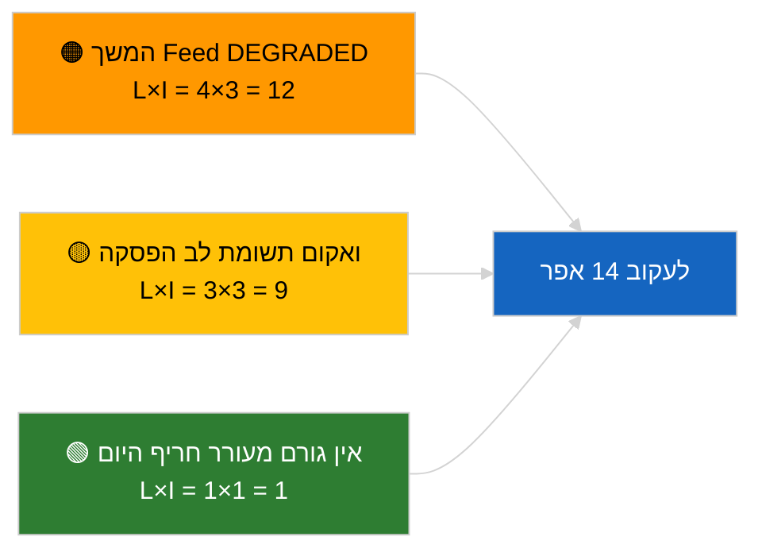
```mermaid
%%{init: {"theme":"dark"}}%%
graph LR
    R1["🟠 המשך Feed DEGRADED<br/>L×I = 4×3 = 12"] --> CONS["לעקוב 14 אפר"]
    R2["🟡 ואקום תשומת לב הפסקה<br/>L×I = 3×3 = 9"] --> CONS
    R3["🟢 אין גורם מעורר חריף היום<br/>L×I = 1×1 = 1"] --> CONS
    style R1 fill:#FF9800,color:#000000
    style R2 fill:#FFC107,color:#000000
    style R3 fill:#2E7D32,color:#FFFFFF
    style CONS fill:#1565C0,color:#FFFFFF
```

| סיכון | ס' | ת' | ניקוד | גורם מעורר | מקור | אדמירליות |
|:-----:|:-:|:-:|:-----:|------------|------|:---------:|
| המשך Feed DEGRADED | 4 | 3 | 12 | אחרי 14 באפריל | 2026-04-03/breaking-2 | A1 |
| ואקום תשומת לב הפסקה | 3 | 3 | 9 | הפתעה אמריקאית או פולנית | לוח שנה EP | A2 |

---

### 🔮 Top Forward Trigger

**הנציבות יום שלישי 7 באפריל 2026** (הגשת המכלול הראשון לאחר פסחא) ו**סוף ההפסקה 13 באפריל**.

---

### 🛡️ Source Quality Assessment

- **מקורות ראשיים:** לוח שנה EP; אשכול מועבר Q1.
- **אמינות:** 🟢 גבוהה על גורם הלוח.

---

### 📎 Links

| קישור | נתיב |
|-------|------|
| מאמר | `./article.md` |
| מפגשי אחות | `analysis/daily/2026-04-05/breaking-2/`, `breaking-3/` |
| מניפסט | `./manifest.json` |

---

**מעקב מסמך**
- **תבנית:** `/analysis/templates/executive-brief.md`
- **נתיב פריט ניתוח:** `analysis/daily/2026-04-05/breaking/executive-brief.md`
- **סיווג:** ציבורי
- **יצירה רטרואקטיבית:** סשן מילוי לאחור.

### Executive Brief Ja

**分類：** OSINT | 公開議会記録
**信頼度：** 🟢 高（議会休会期間中の構造的評価）
**作成日：** 2026-04-05T00:00:00Z（事後ブリーフ）
**記事タイプ：** 速報
**出典：** 欧州議会オープンデータポータル

---

### 🎯 BLUF

**2026-04-05 に速報はなし；EP は復活祭休会中（18 日間のうち 10 日目、2026 年 3 月 27 日 → 4 月 13 日）。** 本会議、委員会会議、採決は予定なし。今週の情報シグナル（DEGRADED フィード API 状態、PPE の構造的 38% 優位、腐敗対策改革クラスター）は 2026-04-03 / 04-04 の実質的な実行から引き継がれている。不活動が暦によるものである可能性は **🟢 高信頼度**。

---

### 🧭 3 Decisions This Brief Supports

| # | 決定事項 | 意思決定者 | 期限 | 根拠 |
|:-:|---------|-----------|:----:|------|
| 1 | **編集：** 日次速報を SKIP | 編集長 | +12 時間 | 休会 10/18 日目 |
| 2 | **監視：** エンドポイント健全性監視を維持 | データパイプライン | 毎日 | DEGRADED 状態 |
| 3 | **前方監視：** 欧州委員会 4 月 7 日（火）、休会終了 4 月 13 日 | 分析リーダー | 2026-04-07 | Q1→Q2 移行 |

---

### 📰 60-Second Read

- 🔴 **2026-04-05 に新たな EP 活動なし**（日曜日、復活祭休会 10/18 日目）。（🟢 高）
- 🟠 **DEGRADED フィード API 状態が 2026-04-03 の探索以来継続**。（🟢 高）
- 🟢 **引き継ぎ監視リスト：** 腐敗対策（TA-10-2026-0094）、Braun 不逮捕特権（TA-10-2026-0088）、米国関税（TA-10-2026-0096）、HDV 排気規制（TA-10-2026-0084）。（🟢 高）
- 🟡 **連立の算術は安定：** PPE 38% / 大連立 60%。（🟢 高）
- 🔵 **経済的背景：** 米 EU 貿易軌道に変化なし。（🟢 高）
- 🟣 **相互参照：** 姉妹実行 `breaking-2` および `breaking-3` がセッション横断の休会中期総合分析を提供。（🟢 高）
- 🩷 **混乱ベクター：** 急性なし。（🟢 高）
- ⚪ **引き継ぎ：** 休会終了まで 8 日。

---

### 🗂️ Top Documents / Procedures Table

| 順位 | EP 参照番号 | 題名（略） | 重要度 | 信頼度 |
|:---:|-----------|----------|:------:|:------:|
| 1 | — | 2026-04-05 に新たな手続きも採択テキストもなし | 0.0 | 🟢 高 |
| 2 | TA-10-2026-0094 | 腐敗対策（引き継ぎ） | 9.0 | 🟢 高 |
| 3 | TA-10-2026-0088 | Braun 不逮捕特権（引き継ぎ） | 7.0 | 🟢 高 |

---

### ⚠️ Risk & Threat Snapshot

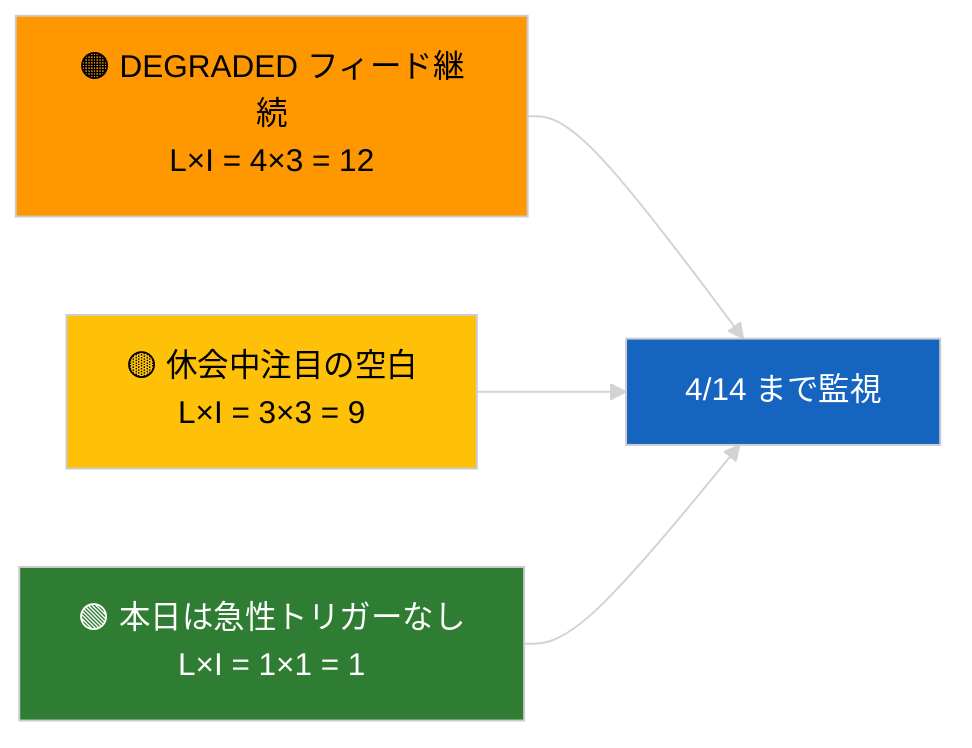
```mermaid
%%{init: {"theme":"dark"}}%%
graph LR
    R1["🟠 DEGRADED フィード継続<br/>L×I = 4×3 = 12"] --> CONS["4/14 まで監視"]
    R2["🟡 休会中注目の空白<br/>L×I = 3×3 = 9"] --> CONS
    R3["🟢 本日は急性トリガーなし<br/>L×I = 1×1 = 1"] --> CONS
    style R1 fill:#FF9800,color:#000000
    style R2 fill:#FFC107,color:#000000
    style R3 fill:#2E7D32,color:#FFFFFF
    style CONS fill:#1565C0,color:#FFFFFF
```

| リスク | 蓋 | 影 | スコア | トリガー | 出典 | Admiralty |
|:-----:|:-:|:-:|:-----:|---------|------|:---------:|
| DEGRADED フィード継続 | 4 | 3 | 12 | 4 月 14 日以降 | 2026-04-03/breaking-2 | A1 |
| 休会中注目の空白 | 3 | 3 | 9 | 米国または PL の驚き | EP カレンダー | A2 |

---

### 🔮 Top Forward Trigger

**欧州委員会 2026 年 4 月 7 日（火）**（復活祭後の最初の議事提出）および**休会終了 4 月 13 日**。

---

### 🛡️ Source Quality Assessment

- **一次情報源：** EP カレンダー；Q1 引き継ぎクラスター。
- **信頼度：** 🟢 暦的要因に関しては高。

---

### 📎 Links

| リンク | パス |
|-------|------|
| 記事 | `./article.md` |
| 姉妹実行 | `analysis/daily/2026-04-05/breaking-2/`, `breaking-3/` |
| マニフェスト | `./manifest.json` |

---

**文書管理**
- **テンプレート：** `/analysis/templates/executive-brief.md`
- **成果物パス：** `analysis/daily/2026-04-05/breaking/executive-brief.md`
- **分類：** 公開
- **事後生成：** バックフィル・セッション。

### Executive Brief Ko

**분류:** OSINT | 공개 의회 기록
**신뢰도:** 🟢 높음 (의회 휴회 기간 중 구조적 평가)
**작성일:** 2026-04-05T00:00:00Z (사후 요약)
**기사 유형:** 속보
**출처:** 유럽의회 오픈 데이터 포털

---

### 🎯 BLUF

**2026-04-05에 속보 없음; EP는 부활절 휴회 중(18일 중 10일째, 2026년 3월 27일 → 4월 13일).** 본회의, 위원회 회의, 투표 없음. 이번 주 인텔리전스 신호(DEGRADED 피드 API 상태, PPE의 38% 구조적 우세, 반부패 개혁 클러스터)는 2026-04-03 / 04-04 실질 실행에서 이월됨. 비활동이 달력에 의한 것임에 대해 **🟢 높은 신뢰도**.

---

### 🧭 3 Decisions This Brief Supports

| # | 결정 사항 | 결정 주체 | 마감 | 근거 |
|:-:|---------|---------|:----:|------|
| 1 | **편집:** 일일 속보 건너뜀 | 편집장 | +12시간 | 휴회 10/18일째 |
| 2 | **모니터링:** 엔드포인트 건강 감시 유지 | 데이터 파이프라인 | 매일 | DEGRADED 상태 |
| 3 | **전방 감시:** 집행위 4월 7일(화), 휴회 종료 4월 13일 | 분석 책임자 | 2026-04-07 | Q1→Q2 전환 |

---

### 📰 60-Second Read

- 🔴 **2026-04-05에 새로운 EP 활동 없음** (일요일, 부활절 휴회 10/18일째). (🟢 높음)
- 🟠 **DEGRADED 피드 API 상태 2026-04-03 탐색 이후 지속**. (🟢 높음)
- 🟢 **이월 감시 목록:** 반부패 (TA-10-2026-0094), Braun 불체포특권 (TA-10-2026-0088), 미국 관세 (TA-10-2026-0096), HDV 배출 (TA-10-2026-0084). (🟢 높음)
- 🟡 **연립 산술 안정**: PPE 38% / 대연립 60%. (🟢 높음)
- 🔵 **경제적 맥락:** 미EU 무역 궤도 변동 없음. (🟢 높음)
- 🟣 **교차 참조:** 자매 실행 `breaking-2`와 `breaking-3`이 세션 간 휴회 중기 종합 분석 제공. (🟢 높음)
- 🩷 **혼란 벡터:** 급성 없음. (🟢 높음)
- ⚪ **이월:** 휴회 종료까지 8일.

---

### 🗂️ Top Documents / Procedures Table

| 순위 | EP 참조 | 제목 (약칭) | 중요도 | 신뢰도 |
|:---:|--------|-----------|:-----:|:------:|
| 1 | — | 2026-04-05에 새로운 절차 또는 채택 텍스트 없음 | 0.0 | 🟢 높음 |
| 2 | TA-10-2026-0094 | 반부패 (이월) | 9.0 | 🟢 높음 |
| 3 | TA-10-2026-0088 | Braun 불체포특권 (이월) | 7.0 | 🟢 높음 |

---

### ⚠️ Risk & Threat Snapshot

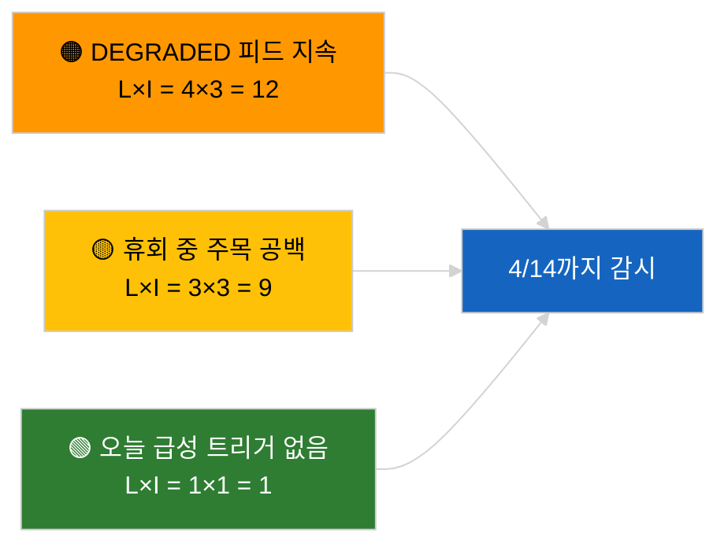
```mermaid
%%{init: {"theme":"dark"}}%%
graph LR
    R1["🟠 DEGRADED 피드 지속<br/>L×I = 4×3 = 12"] --> CONS["4/14까지 감시"]
    R2["🟡 휴회 중 주목 공백<br/>L×I = 3×3 = 9"] --> CONS
    R3["🟢 오늘 급성 트리거 없음<br/>L×I = 1×1 = 1"] --> CONS
    style R1 fill:#FF9800,color:#000000
    style R2 fill:#FFC107,color:#000000
    style R3 fill:#2E7D32,color:#FFFFFF
    style CONS fill:#1565C0,color:#FFFFFF
```

| 리스크 | 가 | 영 | 점수 | 트리거 | 출처 | 해군성 |
|:-----:|:-:|:-:|:---:|--------|------|:------:|
| DEGRADED 피드 지속 | 4 | 3 | 12 | 4월 14일 이후 | 2026-04-03/breaking-2 | A1 |
| 휴회 중 주목 공백 | 3 | 3 | 9 | 미국 또는 PL 서프라이즈 | EP 달력 | A2 |

---

### 🔮 Top Forward Trigger

**집행위 2026년 4월 7일(화)** (부활절 이후 최초 의사 일정 제출) 및 **휴회 종료 4월 13일**.

---

### 🛡️ Source Quality Assessment

- **1차 출처:** EP 달력; Q1 이월 클러스터.
- **신뢰도:** 🟢 달력 요인에 대해 높음.

---

### 📎 Links

| 링크 | 경로 |
|------|------|
| 기사 | `./article.md` |
| 자매 실행 | `analysis/daily/2026-04-05/breaking-2/`, `breaking-3/` |
| 매니페스트 | `./manifest.json` |

---

**문서 관리**
- **템플릿:** `/analysis/templates/executive-brief.md`
- **성과물 경로:** `analysis/daily/2026-04-05/breaking/executive-brief.md`
- **분류:** 공개
- **사후 생성:** 백필 세션.

### Executive Brief Nl

### 🎯 BLUF

**Geen breaking news op 2026-04-05; het EP is in paasvakantie (dag 10 van 18, 27 maart → 13 april 2026).** Er zijn geen plenaire vergaderingen, commissievergaderingen of stemmen gepland. De informatiesignalen van de week (GEDEGRADEERDE feed-API-staat, PPE-structurele dominantie van 38 %, anti-corruptie-hervormingscluster) zijn overgenomen van de inhoudelijke sessies van 2026-04-03 / 04-04. **🟢 HOGE betrouwbaarheid** dat de inactiviteit kalendergestuurd is.

---

### 🧭 3 Decisions This Brief Supports

| # | Beslissing | Beslisser | Deadline | Bewijs |
|:-:|-----------|----------|:--------:|--------|
| 1 | **Redactie:** dagelijkse nieuwsberichten OVERSLAAN | Redacteur | +12u | Recessdag 10 van 18 |
| 2 | **Monitoring:** eindpunt-gezondheidscontrole handhaven | Datapijplijn | dagelijks | GEDEGRADEERDE staat |
| 3 | **Vooruitkijken:** Commissie dinsdag 7 april, einde reces 13 april | Analyseleider | 2026-04-07 | Q1→Q2-overgang |

---

### 📰 60-Second Read

- 🔴 **Geen nieuwe EP-activiteit** op 2026-04-05 (zondag, paasvakantie dag 10/18). (🟢 Hoog)
- 🟠 **GEDEGRADEERDE feed-API-staat duurt voort** vanaf de sonde van 2026-04-03. (🟢 Hoog)
- 🟢 **Overgedragen observatielijst:** anti-corruptie (TA-10-2026-0094), Braun-immuniteit (TA-10-2026-0088), Amerikaanse tarieven (TA-10-2026-0096), HDV-emissies (TA-10-2026-0084). (🟢 Hoog)
- 🟡 **Coalitiearithmetiek stabiel**: PPE 38 % / Grote Coalitie 60 %. (🟢 Hoog)
- 🔵 **Economische context:** VS-EU-handelskoers ongewijzigd. (🟢 Hoog)
- 🟣 **Kruisreferentie:** zusterloops `breaking-2` en `breaking-3` leveren sessieoverstijgende mid-recess-synthese. (🟢 Hoog)
- 🩷 **Storingsvector:** geen acuut. (🟢 Hoog)
- ⚪ **Overdracht:** 8 dagen tot einde reces.

---

### 🗂️ Top Documents / Procedures Table

| Rang | EP-referentie | Titel (kort) | Belang | Betrouwbaarheid |
|:----:|--------------|-------------|:------:|:---------------:|
| 1 | — | Geen nieuwe procedures of aangenomen teksten op 2026-04-05 | 0,0 | 🟢 HOOG |
| 2 | TA-10-2026-0094 | Anti-corruptie (overdracht) | 9,0 | 🟢 HOOG |
| 3 | TA-10-2026-0088 | Braun-immuniteit (overdracht) | 7,0 | 🟢 HOOG |

---

### ⚠️ Risk & Threat Snapshot

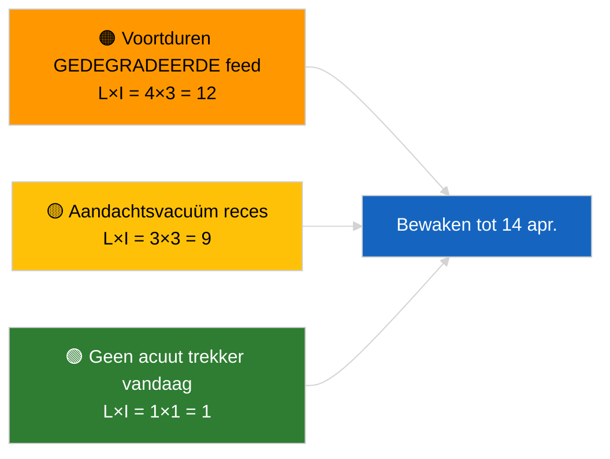
```mermaid
%%{init: {"theme":"dark"}}%%
graph LR
    R1["🟠 Voortduren GEDEGRADEERDE feed<br/>L×I = 4×3 = 12"] --> CONS["Bewaken tot 14 apr."]
    R2["🟡 Aandachtsvacuüm reces<br/>L×I = 3×3 = 9"] --> CONS
    R3["🟢 Geen acuut trekker vandaag<br/>L×I = 1×1 = 1"] --> CONS
    style R1 fill:#FF9800,color:#000000
    style R2 fill:#FFC107,color:#000000
    style R3 fill:#2E7D32,color:#FFFFFF
    style CONS fill:#1565C0,color:#FFFFFF
```

| Risico | W | I | Score | Trekker | Bron | Admiraliteit |
|--------|:-:|:-:|:-----:|---------|------|:------------:|
| Voortduren GEDEGRADEERDE feed | 4 | 3 | 12 | Na 14 april | 2026-04-03/breaking-2 | A1 |
| Aandachtsvacuüm reces | 3 | 3 | 9 | VS- of PL-verrassing | EP-kalender | A2 |

---

### 🔮 Top Forward Trigger

**Commissie dinsdag 7 april 2026** (eerste zitting na Pasen) en **einde reces 13 april**.

---

### 🛡️ Source Quality Assessment

- **Primaire bronnen:** EP-kalender; Q1-overdrachtcluster.
- **Betrouwbaarheid:** 🟢 HOOG op kalenderfactor.

---

### 📎 Links

| Link | Pad |
|------|-----|
| Artikel | `./article.md` |
| Zusterloops | `analysis/daily/2026-04-05/breaking-2/`, `breaking-3/` |
| Manifest | `./manifest.json` |

---

**Documentbeheer**
- **Sjabloon:** `/analysis/templates/executive-brief.md`
- **Artefactpad:** `analysis/daily/2026-04-05/breaking/executive-brief.md`
- **Classificatie:** Openbaar
- **Retrospectieve generatie:** Back-fill sessie.

### Executive Brief No

### 🎯 BLUF

**Ingen siste-nytt-utvikling den 2026-04-05; EP er i påskepause (Dag 10 av 18, 27. mars → 13. april 2026).** Ingen plenumsmøter, komitémøter eller stemmer planlagt. Ukens etterretningssignaler (DEGRADERT feed-API-tilstand, PPE:s strukturelle dominans på 38 %, antikorrupsjonsreformklynge) er arvet fra de innholdsmessige kjøringene 2026-04-03 / 04-04. **🟢 HØY troverdighet** for at inaktiviteten er kalenderbestemt.

---

### 🧭 3 Decisions This Brief Supports

| # | Beslutning | Beslutningstaker | Frist | Bevis |
|:-:|-----------|----------------|:-----:|-------|
| 1 | **Redaksjon:** HOPP OVER daglig siste nytt | Redaktør | +12t | Pausedag 10 av 18 |
| 2 | **Overvåking:** oppretthold endepunkt-helseovervåking | Datapipeline | daglig | DEGRADERT tilstand |
| 3 | **Fremtidsutsikt:** Kommisjonen tirsdag 7. april, pauseslutt 13. april | Analyseansvarlig | 2026-04-07 | Q1→Q2-overgang |

---

### 📰 60-Second Read

- 🔴 **Ingen ny EP-aktivitet** den 2026-04-05 (søndag, påskepause Dag 10/18). (🟢 Høy)
- 🟠 **DEGRADERT feed-API-tilstand fortsetter** fra sonden 2026-04-03. (🟢 Høy)
- 🟢 **Overført overvåkingsliste:** antikorrupsjon (TA-10-2026-0094), Braun-immunitet (TA-10-2026-0088), amerikanske tollsatser (TA-10-2026-0096), HDV-utslipp (TA-10-2026-0084). (🟢 Høy)
- 🟡 **Koalisjonsaritmetikk stabil**: PPE 38 % / Storkoalisjon 60 %. (🟢 Høy)
- 🔵 **Økonomisk kontekst:** USA-EU handelstrajektorie uendret. (🟢 Høy)
- 🟣 **Krysskjøring:** søsterkjøringene `breaking-2` og `breaking-3` leverer sesjonsoverskridende midt-pause-syntese. (🟢 Høy)
- 🩷 **Forstyrrelsesvektoren:** ingen akutt. (🟢 Høy)
- ⚪ **Overføring:** 8 dager til pauseslutt.

---

### 🗂️ Top Documents / Procedures Table

| Rang | EP-referanse | Tittel (kortform) | Betydning | Troverdighet |
|:----:|-------------|-----------------|:---------:|:------------:|
| 1 | — | Ingen nye prosedyrer eller vedtatte tekster den 2026-04-05 | 0,0 | 🟢 HØY |
| 2 | TA-10-2026-0094 | Antikorrupsjon (overføring) | 9,0 | 🟢 HØY |
| 3 | TA-10-2026-0088 | Braun-immunitet (overføring) | 7,0 | 🟢 HØY |

---

### ⚠️ Risk & Threat Snapshot

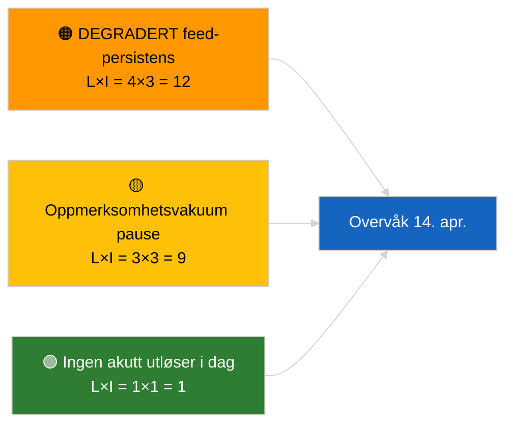
```mermaid
%%{init: {"theme":"dark"}}%%
graph LR
    R1["🟠 DEGRADERT feed-persistens<br/>L×I = 4×3 = 12"] --> CONS["Overvåk 14. apr."]
    R2["🟡 Oppmerksomhetsvakuum pause<br/>L×I = 3×3 = 9"] --> CONS
    R3["🟢 Ingen akutt utløser i dag<br/>L×I = 1×1 = 1"] --> CONS
    style R1 fill:#FF9800,color:#000000
    style R2 fill:#FFC107,color:#000000
    style R3 fill:#2E7D32,color:#FFFFFF
    style CONS fill:#1565C0,color:#FFFFFF
```

| Risiko | S | P | Poeng | Utløser | Kilde | Admiralitet |
|--------|:-:|:-:|:-----:|---------|-------|:-----------:|
| DEGRADERT feed-persistens | 4 | 3 | 12 | Etter 14. april | 2026-04-03/breaking-2 | A1 |
| Oppmerksomhetsvakuum pause | 3 | 3 | 9 | USA- eller PL-overraskelse | EP-kalender | A2 |

---

### 🔮 Top Forward Trigger

**Kommisjonen tirsdag 7. april 2026** (første post-påske kollegietabellering) og **pauseslutt 13. april**.

---

### 🛡️ Source Quality Assessment

- **Primærkilder:** EP-kalender; Q1-overførinsgklynge.
- **Troverdighet:** 🟢 HØY på kalenderfaktoren.

---

### 📎 Links

| Lenke | Sti |
|-------|-----|
| Artikkel | `./article.md` |
| Søsterkjøringer | `analysis/daily/2026-04-05/breaking-2/`, `breaking-3/` |
| Manifest | `./manifest.json` |

---

**Dokumentkontroll**
- **Mal:** `/analysis/templates/executive-brief.md`
- **Artefaktsti:** `analysis/daily/2026-04-05/breaking/executive-brief.md`
- **Klassifisering:** Offentlig
- **Retrospektiv generering:** Back-fill sesjon.

### Executive Brief Sv

### 🎯 BLUF

**Inga nyheter den 2026-04-05; EP befinner sig i påskuppehåll (dag 10 av 18, 27 mars → 13 april 2026).** Inga plenarsammanträden, utskottsmöten eller omröstningar planerade. Veckans informationssignaler (FÖRSÄMRAT feed-API-tillstånd, EPP:s strukturella dominans på 38 %, antikorruptionsreformkluster) är ärvda från de substantiella körningarna 2026-04-03 / 04-04. **🟢 HÖG tillförlitlighet** att inaktiviteten är kalenderstyrd.

---

### 🧭 3 Decisions This Brief Supports

| # | Beslut | Beslutsfattare | Tidsfrist | Bevis |
|:-:|-------|---------------|:---------:|-------|
| 1 | **Redaktion:** HOPPA ÖVER daglig senaste nytt | Redaktör | +12h | Uppehållsdag 10 av 18 |
| 2 | **Övervakning:** bibehåll hälsoövervakning av slutpunkter | Datapipeline | dagligen | FÖRSÄMRAT tillstånd |
| 3 | **Framsyn:** Kommissionen tisdag 7 april, uppehållsslut 13 april | Analysansvarig | 2026-04-07 | Q1→Q2-övergång |

---

### 📰 60-Second Read

- 🔴 **Ingen ny EP-aktivitet** den 2026-04-05 (söndag, påskuppehåll dag 10/18). (🟢 Hög)
- 🟠 **FÖRSÄMRAT feed-API-tillstånd fortsätter** sedan sonden 2026-04-03. (🟢 Hög)
- 🟢 **Överfört bevakningsläge:** antikorruption (TA-10-2026-0094), Braun-immunitet (TA-10-2026-0088), USA-tullar (TA-10-2026-0096), HDV-utsläpp (TA-10-2026-0084). (🟢 Hög)
- 🟡 **Koalitionsaritmik stabil**: EPP 38 % / Storkoalition 60 %. (🟢 Hög)
- 🔵 **Ekonomisk kontext:** USA-EU-handelsutvecklingen oförändrad. (🟢 Hög)
- 🟣 **Korsreferens:** systerkörningarna `breaking-2` och `breaking-3` tillhandahåller sessionsöverskridande mitt-uppehållssyntes. (🟢 Hög)
- 🩷 **Störningsvektor:** ingen akut. (🟢 Hög)
- ⚪ **Överfört:** 8 dagar kvar till uppehållets slut.

---

### 🗂️ Top Documents / Procedures Table

| Rang | EP-referens | Titel (kortform) | Relevans | Tillförlitlighet |
|:----:|------------|-----------------|:--------:|:----------------:|
| 1 | — | Inga nya förfaranden eller antagna texter den 2026-04-05 | 0,0 | 🟢 HÖG |
| 2 | TA-10-2026-0094 | Antikorruption (överfört) | 9,0 | 🟢 HÖG |
| 3 | TA-10-2026-0088 | Braun-immunitet (överfört) | 7,0 | 🟢 HÖG |

---

### ⚠️ Risk & Threat Snapshot

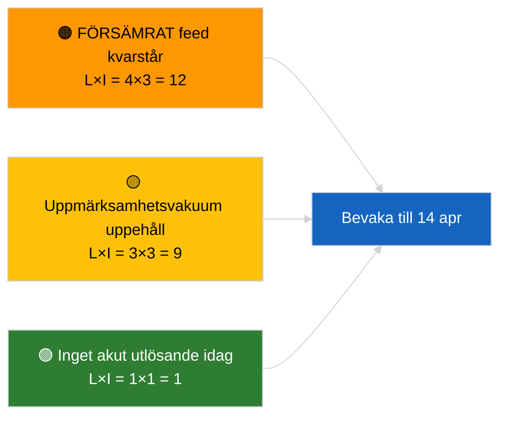
```mermaid
%%{init: {"theme":"dark"}}%%
graph LR
    R1["🟠 FÖRSÄMRAT feed kvarstår<br/>L×I = 4×3 = 12"] --> CONS["Bevaka till 14 apr"]
    R2["🟡 Uppmärksamhetsvakuum uppehåll<br/>L×I = 3×3 = 9"] --> CONS
    R3["🟢 Inget akut utlösande idag<br/>L×I = 1×1 = 1"] --> CONS
    style R1 fill:#FF9800,color:#000000
    style R2 fill:#FFC107,color:#000000
    style R3 fill:#2E7D32,color:#FFFFFF
    style CONS fill:#1565C0,color:#FFFFFF
```

| Risk | S | P | Poäng | Utlösare | Källa | Amiralitet |
|------|:-:|:-:|:-----:|---------|-------|:----------:|
| FÖRSÄMRAT feed kvarstår | 4 | 3 | 12 | Efter 14 april | 2026-04-03/breaking-2 | A1 |
| Uppmärksamhetsvakuum uppehåll | 3 | 3 | 9 | USA- eller PL-överraskning | EP-kalender | A2 |

---

### 🔮 Top Forward Trigger

**Kommissionen tisdag 7 april 2026** (första kollegialinlämning efter påsk) och **uppehållsslut 13 april**.

---

### 🛡️ Source Quality Assessment

- **Primärkällor:** EP-kalender; Q1-överförtkluster.
- **Tillförlitlighet:** 🟢 HÖG på kalenderfaktorn.

---

### 📎 Links

| Länk | Sökväg |
|------|--------|
| Artikel | `./article.md` |
| Systerkörningar | `analysis/daily/2026-04-05/breaking-2/`, `breaking-3/` |
| Manifest | `./manifest.json` |

---

**Dokumentkontroll**
- **Mall:** `/analysis/templates/executive-brief.md`
- **Artefaktsökväg:** `analysis/daily/2026-04-05/breaking/executive-brief.md`
- **Klassificering:** Offentlig
- **Retrospektiv generering:** Backfill-session.

### Executive Brief Zh

**分类：** OSINT | 公开议会记录
**置信度：** 🟢 高（议会休会期间的结构性评估）
**生成时间：** 2026-04-05T00:00:00Z（事后摘要）
**文章类型：** 突发新闻
**来源：** 欧洲议会开放数据门户

---

### 🎯 BLUF

**2026-04-05 无突发新闻动态；EP 处于复活节休会期（第 10 天，共 18 天，2026 年 3 月 27 日 → 4 月 13 日）。** 无全体会议、委员会会议或投票安排。本周情报信号（DEGRADED 数据源 API 状态、PPE 38% 结构性主导地位、反腐改革集群）继承自 2026-04-03 / 04-04 实质性运行。**🟢 高置信度**认为不活跃是日程安排所致。

---

### 🧭 3 Decisions This Brief Supports

| # | 决策 | 决策主体 | 截止日期 | 证据 |
|:-:|-----|---------|:-------:|------|
| 1 | **编辑：** 跳过日常突发新闻 | 总编辑 | +12 小时 | 休会第 10/18 天 |
| 2 | **监控：** 维持端点健康监视 | 数据管道 | 每日 | DEGRADED 状态 |
| 3 | **前瞻监视：** 委员会 4 月 7 日（周二），休会结束 4 月 13 日 | 分析负责人 | 2026-04-07 | Q1→Q2 过渡 |

---

### 📰 60-Second Read

- 🔴 **2026-04-05 无新 EP 活动**（星期日，复活节休会第 10/18 天）。（🟢 高）
- 🟠 **DEGRADED 数据源 API 状态自 2026-04-03 探测以来持续**。（🟢 高）
- 🟢 **结转监视列表：** 反腐（TA-10-2026-0094）、Braun 豁免权（TA-10-2026-0088）、美国关税（TA-10-2026-0096）、HDV 排放（TA-10-2026-0084）。（🟢 高）
- 🟡 **联合算术稳定**：PPE 38% / 大联合 60%。（🟢 高）
- 🔵 **经济背景：** 美欧贸易轨迹无变化。（🟢 高）
- 🟣 **交叉参考：** 姐妹运行 `breaking-2` 和 `breaking-3` 提供跨会议休会中期综合分析。（🟢 高）
- 🩷 **干扰向量：** 无急性干扰。（🟢 高）
- ⚪ **结转：** 距休会结束 8 天。

---

### 🗂️ Top Documents / Procedures Table

| 排名 | EP 参考编号 | 标题（简称） | 重要性 | 置信度 |
|:---:|-----------|-----------|:-----:|:------:|
| 1 | — | 2026-04-05 无新程序或通过文本 | 0.0 | 🟢 高 |
| 2 | TA-10-2026-0094 | 反腐（结转） | 9.0 | 🟢 高 |
| 3 | TA-10-2026-0088 | Braun 豁免权（结转） | 7.0 | 🟢 高 |

---

### ⚠️ Risk & Threat Snapshot

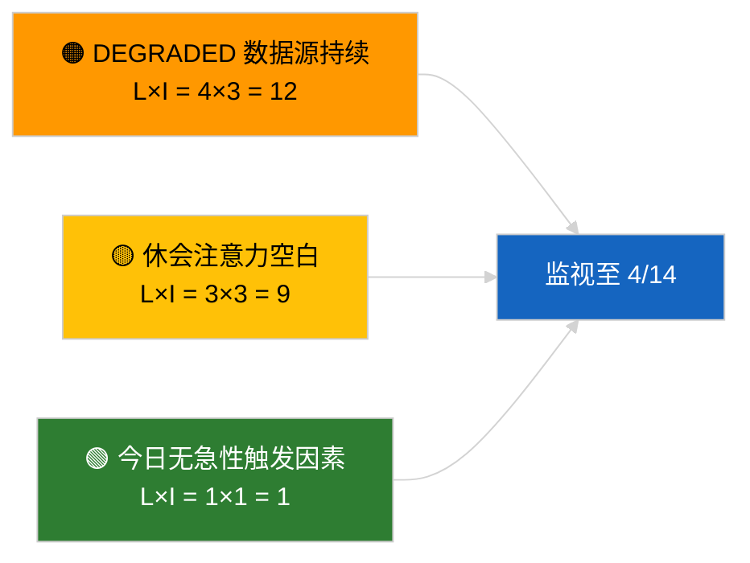
```mermaid
%%{init: {"theme":"dark"}}%%
graph LR
    R1["🟠 DEGRADED 数据源持续<br/>L×I = 4×3 = 12"] --> CONS["监视至 4/14"]
    R2["🟡 休会注意力空白<br/>L×I = 3×3 = 9"] --> CONS
    R3["🟢 今日无急性触发因素<br/>L×I = 1×1 = 1"] --> CONS
    style R1 fill:#FF9800,color:#000000
    style R2 fill:#FFC107,color:#000000
    style R3 fill:#2E7D32,color:#FFFFFF
    style CONS fill:#1565C0,color:#FFFFFF
```

| 风险 | 可 | 影 | 评分 | 触发因素 | 来源 | 海军上将级别 |
|:---:|:-:|:-:|:---:|---------|------|:----------:|
| DEGRADED 数据源持续 | 4 | 3 | 12 | 4 月 14 日之后 | 2026-04-03/breaking-2 | A1 |
| 休会注意力空白 | 3 | 3 | 9 | 美国或 PL 意外 | EP 日历 | A2 |

---

### 🔮 Top Forward Trigger

**委员会 2026 年 4 月 7 日（周二）**（复活节后首次议程提交）及**休会结束 4 月 13 日**。

---

### 🛡️ Source Quality Assessment

- **一手来源：** EP 日历；Q1 结转集群。
- **置信度：** 🟢 日程因素为高。

---

### 📎 Links

| 链接 | 路径 |
|------|------|
| 文章 | `./article.md` |
| 姐妹运行 | `analysis/daily/2026-04-05/breaking-2/`, `breaking-3/` |
| 清单 | `./manifest.json` |

---

**文档管理**
- **模板：** `/analysis/templates/executive-brief.md`
- **成果物路径：** `analysis/daily/2026-04-05/breaking/executive-brief.md`
- **分类：** 公开
- **事后生成：** 回填会话。

### Intelligence Brief

### Situation Overview

| Domain | Activity Level | Key Signal | Alert Status |
|--------|---------------|------------|-------------|
| **Plenary Activity** | None | Easter recess (27 March - 13 April) | Inactive |
| **Legislative Pipeline** | Low | 85 pre-recess adopted texts in one-week feed | Monitoring |
| **Committee Work** | None | Resumes 14 April (committee week) | Inactive |
| **Political Dynamics** | Low | PPE dominance risk HIGH; stability 84/100 | Watch |
| **Data Availability** | Degraded | 6/8 EP API feed endpoints returning 404 | Degraded |

---

### Executive Summary

The European Parliament remains in Easter recess (27 March - 13 April 2026). No parliamentary sessions, committee meetings, or votes are scheduled. The EP Open Data API continues to show degraded performance, with 6 of 8 feed endpoints returning 404 errors - a recurring pattern during recess periods first observed in this monitoring cycle on 28 March.

**Key finding:** The one-week adopted texts feed reveals 85 items, including 70 EP10 texts (TA-10-2026-0035 through TA-10-2026-0104) and 15 EP9/EP10-2025 texts (updates to earlier adopted texts). This pre-recess legislative push represents significant output that merits post-recess implementation monitoring. Confidence: HIGH - direct EP data.

**Analytical value of this run:** Continuing to document the EP API degradation pattern during recess periods. This is a continuing observation (since 28 March) of reduced API availability, confirming a systematic pattern rather than isolated failures.

---

### Parliamentary Calendar Context

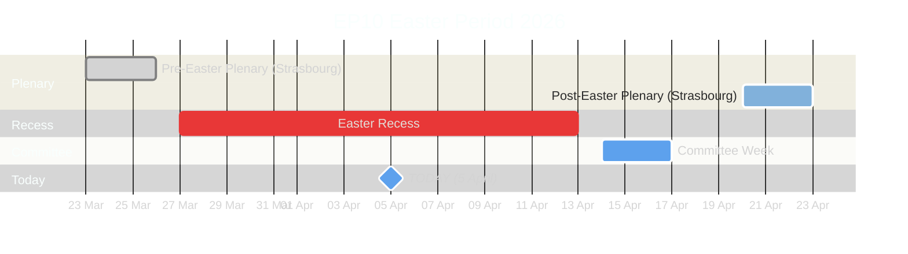
```mermaid
%%{init: {"theme":"dark","themeVariables":{"primaryColor":"#1565C0","primaryTextColor":"#ffffff","primaryBorderColor":"#0A3F7F","lineColor":"#90CAF9","secondaryColor":"#2E7D32","secondaryTextColor":"#ffffff","secondaryBorderColor":"#0F3F00","tertiaryColor":"#FF9800","tertiaryTextColor":"#000000","tertiaryBorderColor":"#7F4F00","mainBkg":"#1565C0","secondBkg":"#2E7D32","tertiaryBkg":"#FF9800","noteBkgColor":"#FFC107","noteTextColor":"#000000","noteBorderColor":"#7F6000","errorBkgColor":"#D32F2F","errorTextColor":"#ffffff","fontFamily":"Inter, Helvetica, Arial, sans-serif","pie1":"#1565C0","pie2":"#2E7D32","pie3":"#FF9800","pie4":"#D32F2F","pie5":"#FFC107","pie6":"#7B1FA2","pie7":"#9E9E9E","pie8":"#0288D1","pie9":"#388E3C","pie10":"#F57C00","pie11":"#C62828","pie12":"#FBC02D","pieTitleTextSize":"18px","pieSectionTextSize":"14px","pieLegendTextSize":"13px","pieStrokeColor":"#1e1e1e","pieOuterStrokeColor":"#1e1e1e","git0":"#1565C0","git1":"#2E7D32","git2":"#FF9800","git3":"#D32F2F","gitBranchLabel0":"#ffffff","gitBranchLabel1":"#ffffff","gitBranchLabel2":"#000000","gitBranchLabel3":"#ffffff","cScale0":"#1565C0","cScale1":"#2E7D32","cScale2":"#FF9800","cScale3":"#D32F2F","cScale4":"#FFC107","cScale5":"#7B1FA2","cScale6":"#9E9E9E","cScale7":"#0288D1","xyChart":{"backgroundColor":"#1e1e1e","plotColorPalette":"#1565C0,#2E7D32,#FF9800,#D32F2F,#FFC107,#7B1FA2,#9E9E9E"}}}}%%
gantt
    title EP10 Easter Period 2026
    dateFormat YYYY-MM-DD
    axisFormat %d %b

    section Plenary
    Pre-Easter Plenary (Strasbourg)   :done, 2026-03-23, 2026-03-26
    Post-Easter Plenary (Strasbourg)  :active, 2026-04-20, 2026-04-23

    section Recess
    Easter Recess                      :crit, 2026-03-27, 2026-04-13

    section Committee
    Committee Week                     :2026-04-14, 2026-04-17

    section Today
    TODAY (5 April)                    :milestone, 2026-04-05, 0d
```

Parliament is at the midpoint of the 18-day Easter recess. The next institutional activity is the committee week beginning 14 April, followed by the Strasbourg plenary session 20-23 April. Confidence: HIGH - EP calendar.

---

### Pre-Recess Legislative Output Analysis

#### Adopted Texts Inventory (One-Week Feed)

The one-week feed contains **85 adopted texts** spanning two parliamentary terms:

| Term | Range | Count | Significance |
|------|-------|-------|-------------|
| EP10 (2026) | TA-10-2026-0035 to TA-10-2026-0104 | 70 | Current term legislative output |
| EP10 (2025) | TA-10-2025-0279 to TA-10-2025-0314 | 8 | Late-2025 texts updated in feed |
| EP9 (2024) | TA-9-2024-0177 to TA-9-2024-0186 | 7 | Historical texts with metadata updates |

**Analysis:** The 70 EP10-2026 adopted texts represent a significant pre-recess legislative push. At this pace (104 texts in Q1 2026 alone), the projected annual output of approximately 114 legislative acts identified in prior analyses appears on track. This is a +46% increase over 2025 (78 acts). Confidence: MEDIUM - projection based on Q1 data.

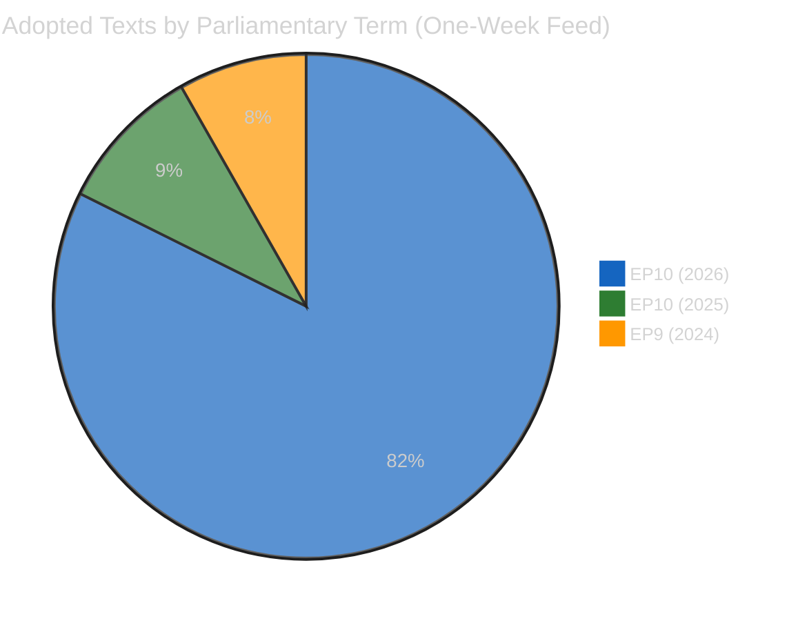
```mermaid
%%{init: {"theme":"dark","themeVariables":{"primaryColor":"#1565C0","primaryTextColor":"#ffffff","primaryBorderColor":"#0A3F7F","lineColor":"#90CAF9","secondaryColor":"#2E7D32","secondaryTextColor":"#ffffff","secondaryBorderColor":"#0F3F00","tertiaryColor":"#FF9800","tertiaryTextColor":"#000000","tertiaryBorderColor":"#7F4F00","mainBkg":"#1565C0","secondBkg":"#2E7D32","tertiaryBkg":"#FF9800","noteBkgColor":"#FFC107","noteTextColor":"#000000","noteBorderColor":"#7F6000","errorBkgColor":"#D32F2F","errorTextColor":"#ffffff","fontFamily":"Inter, Helvetica, Arial, sans-serif","pie1":"#1565C0","pie2":"#2E7D32","pie3":"#FF9800","pie4":"#D32F2F","pie5":"#FFC107","pie6":"#7B1FA2","pie7":"#9E9E9E","pie8":"#0288D1","pie9":"#388E3C","pie10":"#F57C00","pie11":"#C62828","pie12":"#FBC02D","pieTitleTextSize":"18px","pieSectionTextSize":"14px","pieLegendTextSize":"13px","pieStrokeColor":"#1e1e1e","pieOuterStrokeColor":"#1e1e1e","git0":"#1565C0","git1":"#2E7D32","git2":"#FF9800","git3":"#D32F2F","gitBranchLabel0":"#ffffff","gitBranchLabel1":"#ffffff","gitBranchLabel2":"#000000","gitBranchLabel3":"#ffffff","cScale0":"#1565C0","cScale1":"#2E7D32","cScale2":"#FF9800","cScale3":"#D32F2F","cScale4":"#FFC107","cScale5":"#7B1FA2","cScale6":"#9E9E9E","cScale7":"#0288D1","xyChart":{"backgroundColor":"#1e1e1e","plotColorPalette":"#1565C0,#2E7D32,#FF9800,#D32F2F,#FFC107,#7B1FA2,#9E9E9E"}}}}%%
pie title Adopted Texts by Parliamentary Term (One-Week Feed)
    "EP10 (2026)" : 70
    "EP10 (2025)" : 8
    "EP9 (2024)" : 7
```

---

### EP API Health Assessment

#### Feed Endpoint Status Matrix

| Endpoint | Today | One-Week | Status |
|----------|-------|----------|--------|
| get_adopted_texts_feed | Error | 85 items | Partial |
| get_events_feed | 404 | 404 | **Down** |
| get_procedures_feed | 404 | 404 | **Down** |
| get_meps_feed | 737 MEPs | - | Operational |
| get_documents_feed | - | 404 | **Down** |
| get_plenary_documents_feed | - | 404 | **Down** |
| get_committee_documents_feed | - | 404 | **Down** |
| get_parliamentary_questions_feed | - | 404 | **Down** |

**Pattern analysis:** The MEPs feed and adopted texts feed (one-week) remain operational, while activity-related feeds (events, procedures, documents, questions) consistently return 404. This suggests the EP API feed infrastructure deprioritises activity endpoints during recess periods, while static/roster data remains available. Confidence: MEDIUM - pattern observed across multiple monitoring runs.

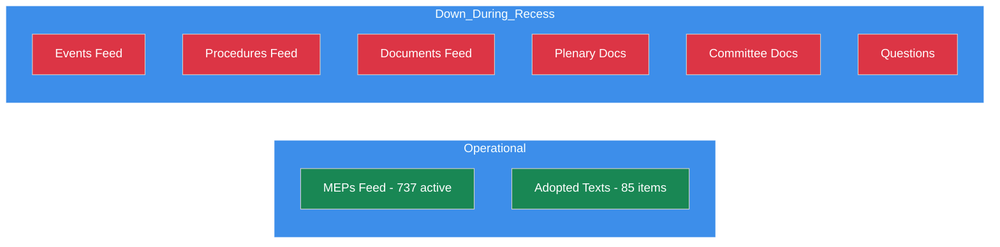
```mermaid
%%{init: {"theme":"dark","themeVariables":{"primaryColor":"#1565C0","primaryTextColor":"#ffffff","primaryBorderColor":"#0A3F7F","lineColor":"#90CAF9","secondaryColor":"#2E7D32","secondaryTextColor":"#ffffff","secondaryBorderColor":"#0F3F00","tertiaryColor":"#FF9800","tertiaryTextColor":"#000000","tertiaryBorderColor":"#7F4F00","mainBkg":"#1565C0","secondBkg":"#2E7D32","tertiaryBkg":"#FF9800","noteBkgColor":"#FFC107","noteTextColor":"#000000","noteBorderColor":"#7F6000","errorBkgColor":"#D32F2F","errorTextColor":"#ffffff","fontFamily":"Inter, Helvetica, Arial, sans-serif","pie1":"#1565C0","pie2":"#2E7D32","pie3":"#FF9800","pie4":"#D32F2F","pie5":"#FFC107","pie6":"#7B1FA2","pie7":"#9E9E9E","pie8":"#0288D1","pie9":"#388E3C","pie10":"#F57C00","pie11":"#C62828","pie12":"#FBC02D","pieTitleTextSize":"18px","pieSectionTextSize":"14px","pieLegendTextSize":"13px","pieStrokeColor":"#1e1e1e","pieOuterStrokeColor":"#1e1e1e","git0":"#1565C0","git1":"#2E7D32","git2":"#FF9800","git3":"#D32F2F","gitBranchLabel0":"#ffffff","gitBranchLabel1":"#ffffff","gitBranchLabel2":"#000000","gitBranchLabel3":"#ffffff","cScale0":"#1565C0","cScale1":"#2E7D32","cScale2":"#FF9800","cScale3":"#D32F2F","cScale4":"#FFC107","cScale5":"#7B1FA2","cScale6":"#9E9E9E","cScale7":"#0288D1","xyChart":{"backgroundColor":"#1e1e1e","plotColorPalette":"#1565C0,#2E7D32,#FF9800,#D32F2F,#FFC107,#7B1FA2,#9E9E9E"}}}}%%
flowchart LR
    subgraph Operational
        A["MEPs Feed - 737 active"]
        B["Adopted Texts - 85 items"]
    end

    subgraph Down_During_Recess
        C["Events Feed"]
        D["Procedures Feed"]
        E["Documents Feed"]
        F["Plenary Docs"]
        G["Committee Docs"]
        H["Questions"]
    end

    style A fill:#198754,color:#fff
    style B fill:#198754,color:#fff
    style C fill:#dc3545,color:#fff
    style D fill:#dc3545,color:#fff
    style E fill:#dc3545,color:#fff
    style F fill:#dc3545,color:#fff
    style G fill:#dc3545,color:#fff
    style H fill:#dc3545,color:#fff
```

**Recommendation:** Automated monitoring should implement a recess mode that: (a) reduces feed polling frequency during known recess periods, (b) focuses on MEP roster and adopted texts feeds which remain available, (c) resumes full-frequency polling 2 days before scheduled committee activity. Confidence: MEDIUM.

---

### Political Landscape Snapshot

#### Current Group Composition

| Group | Seat Share | Bloc | Role |
|-------|-----------|------|------|
| **PPE** | 38.0% | Centre-Right | Dominant group |
| **S&D** | 22.0% | Centre-Left | Junior coalition partner |
| **PfE** | 11.0% | Right | Third force |
| **Verts/ALE** | 10.0% | Green-Left | Opposition |
| **ECR** | 8.0% | Conservative | Swing group |
| **Renew** | 5.0% | Liberal | Small group |
| **NI** | 4.0% | Non-attached | Mixed |
| **The Left** | 2.0% | Left | Smallest group |

**Grand coalition arithmetic:** PPE (38%) + S&D (22%) = 60% - viable majority above the approximately 51% threshold. However, this relies on both groups maintaining internal discipline. Confidence: MEDIUM.

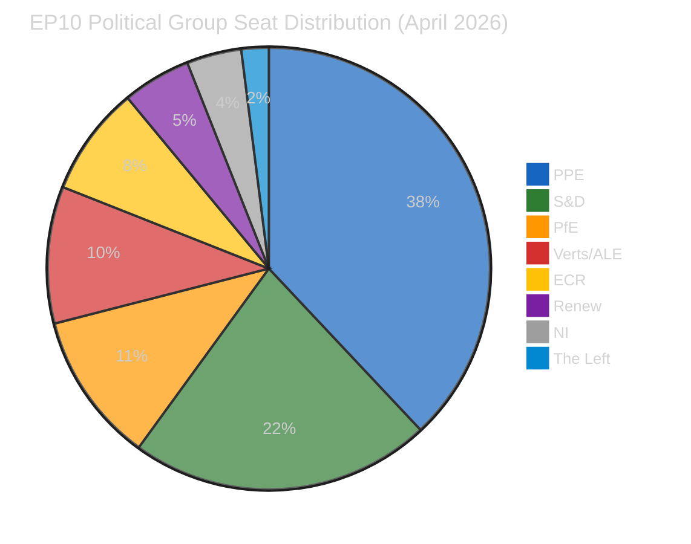
```mermaid
%%{init: {"theme":"dark","themeVariables":{"primaryColor":"#1565C0","primaryTextColor":"#ffffff","primaryBorderColor":"#0A3F7F","lineColor":"#90CAF9","secondaryColor":"#2E7D32","secondaryTextColor":"#ffffff","secondaryBorderColor":"#0F3F00","tertiaryColor":"#FF9800","tertiaryTextColor":"#000000","tertiaryBorderColor":"#7F4F00","mainBkg":"#1565C0","secondBkg":"#2E7D32","tertiaryBkg":"#FF9800","noteBkgColor":"#FFC107","noteTextColor":"#000000","noteBorderColor":"#7F6000","errorBkgColor":"#D32F2F","errorTextColor":"#ffffff","fontFamily":"Inter, Helvetica, Arial, sans-serif","pie1":"#1565C0","pie2":"#2E7D32","pie3":"#FF9800","pie4":"#D32F2F","pie5":"#FFC107","pie6":"#7B1FA2","pie7":"#9E9E9E","pie8":"#0288D1","pie9":"#388E3C","pie10":"#F57C00","pie11":"#C62828","pie12":"#FBC02D","pieTitleTextSize":"18px","pieSectionTextSize":"14px","pieLegendTextSize":"13px","pieStrokeColor":"#1e1e1e","pieOuterStrokeColor":"#1e1e1e","git0":"#1565C0","git1":"#2E7D32","git2":"#FF9800","git3":"#D32F2F","gitBranchLabel0":"#ffffff","gitBranchLabel1":"#ffffff","gitBranchLabel2":"#000000","gitBranchLabel3":"#ffffff","cScale0":"#1565C0","cScale1":"#2E7D32","cScale2":"#FF9800","cScale3":"#D32F2F","cScale4":"#FFC107","cScale5":"#7B1FA2","cScale6":"#9E9E9E","cScale7":"#0288D1","xyChart":{"backgroundColor":"#1e1e1e","plotColorPalette":"#1565C0,#2E7D32,#FF9800,#D32F2F,#FFC107,#7B1FA2,#9E9E9E"}}}}%%
pie title EP10 Political Group Seat Distribution (April 2026)
    "PPE" : 38
    "S&D" : 22
    "PfE" : 11
    "Verts/ALE" : 10
    "ECR" : 8
    "Renew" : 5
    "NI" : 4
    "The Left" : 2
```

#### Bloc Analysis

| Bloc | Groups | Combined Share | Viability |
|------|--------|---------------|-----------|
| Grand Coalition | PPE + S&D | 60% | Viable majority |
| Centre-Right Broad | PPE + ECR + PfE | 57% | Viable but ideological tensions |
| Progressive | S&D + Verts/ALE + Renew + Left | 39% | Insufficient for majority |
| Right-of-Centre | PPE + ECR + PfE + NI | 61% | Viable but NI unreliable |

---

### Early Warning Indicators

#### Active Warnings

| Severity | Type | Description | Recommended Action |
|----------|------|-------------|-------------------|
| HIGH | PPE Dominance Risk | PPE is 19x the size of the smallest group | Monitor minority group coalition formation; track committee chair distribution |
| MEDIUM | High Fragmentation | 8 political groups - complex coalition building | Watch for cross-group voting patterns post-Easter |
| LOW | Small Group Quorum | Renew, NI, The Left (5% or less) may struggle | Monitor post-Easter attendance rates |

#### Stability Assessment

- **Overall stability score:** 84/100 (MEDIUM confidence)
- **Parliamentary fragmentation:** 4.04 effective parties (moderate-high)
- **Grand coalition viability:** POSITIVE - 60% combined seat share
- **Minority representation:** Healthy - 6% in groups with less than 5% seat share
- **Key risk factor:** PPE dominance - 38% approaching threshold where single-group vetoes become frequent

---

### Forward-Looking Scenarios

#### Scenario A: Smooth Return - LIKELY (approximately 60%)
Parliament resumes 14 April with committee week. EP API recovers to full operational status. Pre-recess legislative momentum continues seamlessly. PPE-S&D grand coalition holds on key files in the 20-23 April Strasbourg plenary. No significant coalition shifts.

**Indicators to watch:** API feed recovery on 14 April; committee meeting agendas published by 10 April; no MEP group-switching announcements during recess.

#### Scenario B: Post-Easter Realignment - POSSIBLE (approximately 25%)
Right-of-centre groups (PPE + ECR + PfE) used recess bilateral talks to build issue-specific alliances, particularly on migration and trade policy. This becomes visible in the first post-Easter roll-call votes. S&D pushed towards Greens/EFA on social policy in response.

**Indicators to watch:** Joint EPP-ECR-PfE statements during recess; S&D-Greens joint press events; first post-Easter roll-call vote alignment patterns.

#### Scenario C: Legislative Bottleneck - UNLIKELY (approximately 15%)
Committee week overwhelmed by backlog from pre-recess push. Key legislative files delayed into May. Smaller groups exploit procedural tools (quorum calls, referral back to committee) to slow the dominant PPE agenda.

**Indicators to watch:** Committee agenda density 14-17 April; Rule 144 (referral back) requests; delayed rapporteur nominations.

---

### Monitoring Priorities - Week of 7-13 April 2026

1. **EP API Recovery Watch** - Check daily for feed endpoint restoration (expected approximately 14 April)
2. **April Plenary Agenda** - Expected publication approximately 10 April; critical for week-ahead intelligence
3. **MEP Roster Changes** - Monitor for group-switching or departures announced during recess
4. **Commission Proposals** - External document feed may contain new legislative proposals tabled during recess
5. **Pre-Plenary Positioning** - Watch for political group statements previewing April plenary positions

---

### Sources and Attribution

| Source | Tool / Endpoint | Data Point | Confidence |
|--------|----------------|------------|------------|
| EP Adopted Texts Feed | get_adopted_texts_feed(one-week) | 85 adopted texts | HIGH |
| EP MEPs Feed | get_meps_feed(today) | 737 active MEPs | HIGH |
| Voting Anomalies | detect_voting_anomalies | 0 anomalies, stability 100 | LOW |
| Coalition Dynamics | analyze_coalition_dynamics | Size-ratio cohesion only | LOW |
| Political Landscape | generate_political_landscape | 8 groups, PPE 38% | MEDIUM |
| Early Warning System | early_warning_system | Stability 84, 3 warnings | MEDIUM |
| Precomputed Stats | get_all_generated_stats | Historical context 2004-2026 | HIGH |
| Editorial Memory | Repo memory (prior runs) | Recess dates, monitoring patterns | HIGH |

**Methodology:** 4-pass analysis refinement cycle per ai-driven-analysis-guide.md v4.0. All 6 methodology documents consulted. Political Threat Landscape + Risk Assessment + SWOT frameworks applied.

---

*Generated by EU Parliament Monitor Agentic Workflow - 5 April 2026 00:20 UTC*
*Data source: European Parliament Open Data Portal - data.europarl.europa.eu*

### Political Landscape Analysis

### Current Political Configuration

The 10th European Parliament (EP10) operates with 8 political groups spanning 23 member states. The current configuration, assessed at the midpoint of the Easter recess, shows a PPE-dominant landscape with high fragmentation requiring multi-party coalitions for every major vote.

#### Group Strength and Positioning

```mermaid
%%{init: {"theme":"dark","themeVariables":{"primaryColor":"#1565C0","primaryTextColor":"#ffffff","primaryBorderColor":"#0A3F7F","lineColor":"#90CAF9","secondaryColor":"#2E7D32","secondaryTextColor":"#ffffff","secondaryBorderColor":"#0F3F00","tertiaryColor":"#FF9800","tertiaryTextColor":"#000000","tertiaryBorderColor":"#7F4F00","mainBkg":"#1565C0","secondBkg":"#2E7D32","tertiaryBkg":"#FF9800","noteBkgColor":"#FFC107","noteTextColor":"#000000","noteBorderColor":"#7F6000","errorBkgColor":"#D32F2F","errorTextColor":"#ffffff","fontFamily":"Inter, Helvetica, Arial, sans-serif","pie1":"#1565C0","pie2":"#2E7D32","pie3":"#FF9800","pie4":"#D32F2F","pie5":"#FFC107","pie6":"#7B1FA2","pie7":"#9E9E9E","pie8":"#0288D1","pie9":"#388E3C","pie10":"#F57C00","pie11":"#C62828","pie12":"#FBC02D","pieTitleTextSize":"18px","pieSectionTextSize":"14px","pieLegendTextSize":"13px","pieStrokeColor":"#1e1e1e","pieOuterStrokeColor":"#1e1e1e","git0":"#1565C0","git1":"#2E7D32","git2":"#FF9800","git3":"#D32F2F","gitBranchLabel0":"#ffffff","gitBranchLabel1":"#ffffff","gitBranchLabel2":"#000000","gitBranchLabel3":"#ffffff","cScale0":"#1565C0","cScale1":"#2E7D32","cScale2":"#FF9800","cScale3":"#D32F2F","cScale4":"#FFC107","cScale5":"#7B1FA2","cScale6":"#9E9E9E","cScale7":"#0288D1","xyChart":{"backgroundColor":"#1e1e1e","plotColorPalette":"#1565C0,#2E7D32,#FF9800,#D32F2F,#FFC107,#7B1FA2,#9E9E9E"}}}}%%
graph TD
    subgraph Centre_Right["Centre-Right Bloc (57%)"]
        PPE["PPE
38% | Dominant"]
        ECR["ECR
8% | Conservative"]
        PfE["PfE
11% | Right"]
    end

    subgraph Centre_Left["Progressive Bloc (39%)"]
        SD["S&D
22% | Centre-Left"]
        VERTS["Verts/ALE
10% | Green"]
        RENEW["Renew
5% | Liberal"]
        LEFT["The Left
2% | Left"]
    end

    subgraph Other["Non-Attached (4%)"]
        NI["NI
4% | Mixed"]
    end

    PPE -.->|"Grand Coalition (60%)"| SD
    PPE -.->|"Centre-Right (57%)"| ECR
    PPE -.->|"Centre-Right (57%)"| PfE

    style PPE fill:#003399,color:#fff
    style SD fill:#cc0000,color:#fff
    style RENEW fill:#FFD700,color:#000
    style ECR fill:#FF6600,color:#fff
    style VERTS fill:#009933,color:#fff
    style PfE fill:#2B3856,color:#fff
    style LEFT fill:#8B0000,color:#fff
    style NI fill:#808080,color:#fff
```

#### Seat Distribution by Group

| Rank | Group | Seat Share | Change vs EP9 | EP Colour | Ideological Family |
|------|-------|-----------|---------------|-----------|-------------------|
| 1 | PPE | 38.0% | Increased | #003399 | Christian Democracy / Centre-Right |
| 2 | S&D | 22.0% | Stable | #cc0000 | Social Democracy / Centre-Left |
| 3 | PfE | 11.0% | New (from ID) | #2B3856 | Eurosceptic Right |
| 4 | Verts/ALE | 10.0% | Decreased | #009933 | Green / Regionalist |
| 5 | ECR | 8.0% | Stable | #FF6600 | Conservative / Eurosceptic |
| 6 | Renew | 5.0% | Decreased | #FFD700 | Liberal / Centrist |
| 7 | NI | 4.0% | Stable | #808080 | Non-attached |
| 8 | The Left | 2.0% | Decreased | #8B0000 | Socialist / Communist |

---

### Coalition Arithmetic and Majority Scenarios

The majority threshold in EP10 is approximately 51% of seats (approximately 361 of 705 MEPs in the full Parliament). Current coalition scenarios:

#### Viable Majority Coalitions

| Coalition | Groups | Combined Share | Surplus | Stability Assessment |
|-----------|--------|---------------|---------|---------------------|
| **Grand Coalition** | PPE + S&D | 60% | +9% | Most stable; tested in EP9; ideological tensions on social policy |
| **Centre-Right Broad** | PPE + ECR + PfE | 57% | +6% | Mathematically viable; deep divisions on EU integration, rule of law |
| **Right + NI** | PPE + ECR + PfE + NI | 61% | +10% | Unreliable; NI lack group discipline |
| **Ursula Coalition** | PPE + S&D + Renew | 65% | +14% | Most comfortable margin; Renew declining relevance |

#### Non-Viable Configurations

| Coalition | Groups | Combined Share | Deficit | Notes |
|-----------|--------|---------------|---------|-------|
| Progressive Bloc | S&D + Verts + Renew + Left | 39% | -12% | Cannot reach majority even with full unity |
| Opposition Bloc | All non-PPE | 62% | N/A | PPE cannot be outvoted if it holds firm |
| Left Alliance | S&D + Verts + Left | 34% | -17% | Structurally insufficient |

---

### Fragmentation and Power Concentration Analysis

#### Fragmentation Metrics

| Metric | Value | Interpretation |
|--------|-------|---------------|
| Effective Number of Parties (ENP) | 4.04 | Moderate-high fragmentation |
| Herfindahl-Hirschman Index (HHI) | ~0.248 | Concentrated (PPE dominant) |
| PPE Dominance Ratio | 19:1 vs smallest group | Asymmetric power distribution |
| Groups Below 5% Threshold | 3 (Renew, NI, Left) | Quorum risk for 30% of groups |

**Analysis:** EP10 exhibits a paradoxical combination of high fragmentation (8 groups, ENP 4.04) and high concentration (PPE alone holds 38%). This means that while many groups exist, power is heavily skewed. PPE can effectively veto any legislative initiative while needing only one medium-sized partner to form a majority. This structural asymmetry is the defining feature of EP10 power dynamics. Confidence: MEDIUM.

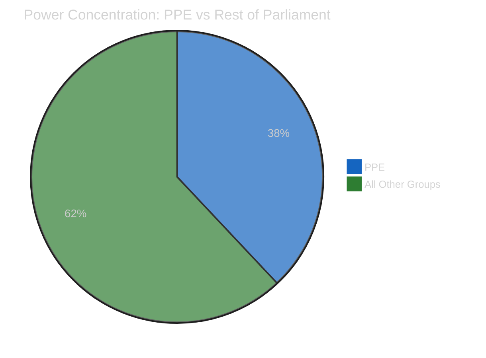
```mermaid
%%{init: {"theme":"dark","themeVariables":{"primaryColor":"#1565C0","primaryTextColor":"#ffffff","primaryBorderColor":"#0A3F7F","lineColor":"#90CAF9","secondaryColor":"#2E7D32","secondaryTextColor":"#ffffff","secondaryBorderColor":"#0F3F00","tertiaryColor":"#FF9800","tertiaryTextColor":"#000000","tertiaryBorderColor":"#7F4F00","mainBkg":"#1565C0","secondBkg":"#2E7D32","tertiaryBkg":"#FF9800","noteBkgColor":"#FFC107","noteTextColor":"#000000","noteBorderColor":"#7F6000","errorBkgColor":"#D32F2F","errorTextColor":"#ffffff","fontFamily":"Inter, Helvetica, Arial, sans-serif","pie1":"#1565C0","pie2":"#2E7D32","pie3":"#FF9800","pie4":"#D32F2F","pie5":"#FFC107","pie6":"#7B1FA2","pie7":"#9E9E9E","pie8":"#0288D1","pie9":"#388E3C","pie10":"#F57C00","pie11":"#C62828","pie12":"#FBC02D","pieTitleTextSize":"18px","pieSectionTextSize":"14px","pieLegendTextSize":"13px","pieStrokeColor":"#1e1e1e","pieOuterStrokeColor":"#1e1e1e","git0":"#1565C0","git1":"#2E7D32","git2":"#FF9800","git3":"#D32F2F","gitBranchLabel0":"#ffffff","gitBranchLabel1":"#ffffff","gitBranchLabel2":"#000000","gitBranchLabel3":"#ffffff","cScale0":"#1565C0","cScale1":"#2E7D32","cScale2":"#FF9800","cScale3":"#D32F2F","cScale4":"#FFC107","cScale5":"#7B1FA2","cScale6":"#9E9E9E","cScale7":"#0288D1","xyChart":{"backgroundColor":"#1e1e1e","plotColorPalette":"#1565C0,#2E7D32,#FF9800,#D32F2F,#FFC107,#7B1FA2,#9E9E9E"}}}}%%
pie title Power Concentration: PPE vs Rest of Parliament
    "PPE" : 38
    "All Other Groups" : 62
```

---

### Coalition Dynamics During Recess

#### Current Cohesion Signals (Methodological Caveat)

The coalition dynamics tool reports cohesion scores based on group size ratios rather than actual voting data (per-MEP voting statistics unavailable from EP API). These should be interpreted as structural similarity indicators, not behavioural cohesion measures.

| Pair | Cohesion Score | Alliance Signal | Trend | Interpretation |
|------|---------------|-----------------|-------|---------------|
| Renew-ECR | 0.95 | Yes | Strengthening | Size similarity; NOT ideological alignment |
| The Left-NI | 0.65 | Yes | Strengthening | Small group structural similarity |
| S&D-ECR | 0.60 | Yes | Stable | Moderate size proximity |
| Renew-The Left | 0.60 | Yes | Stable | Small group structural similarity |
| S&D-Renew | 0.57 | Yes | Stable | Historical coalition partners |
| EPP-S&D | 0.00 | No | Weakening | Size disparity artifact |

**Critical caveat:** The EPP-S&D cohesion of 0.00 is a methodological artifact of the size-ratio approach, NOT evidence of coalition breakdown. In practice, EPP and S&D remain the core grand coalition partners. Confidence: LOW for all cohesion scores due to methodology limitations.

---

### Post-Easter Outlook: What to Watch

#### Committee Week (14-17 April)

The committee week is the first opportunity for observable political activity after the 18-day recess. Key indicators:

1. **Agenda density** - If committees schedule more than 15 meetings, signals legislative pressure
2. **Rapporteur assignments** - New assignments reveal group priorities for the April-June period
3. **Cross-group amendments** - Co-signed amendments between PPE and ECR/PfE would confirm right-of-centre alignment
4. **Small group interventions** - Rule of Procedure challenges from Renew, Left, or NI signal marginalisation pushback

#### Strasbourg Plenary (20-23 April)

The first post-Easter plenary is the critical test for coalition dynamics:

1. **Roll-call vote alignment** - Compare PPE-S&D alignment rate with pre-recess baseline
2. **Resolution debates** - Watch for positioning statements previewing committee-level negotiations
3. **Attendance patterns** - Post-recess attendance often dips 5-10%; monitor small groups especially
4. **Emergency debates** - Any emergency item would reveal real-time coalition formation patterns

---

### Sources

| Data Source | Endpoint | Key Metric | Confidence |
|------------|----------|-----------|------------|
| Political Landscape | generate_political_landscape | 8 groups, PPE 38% | MEDIUM |
| Coalition Dynamics | analyze_coalition_dynamics | Renew-ECR 0.95, ENP 4.04 | LOW |
| Early Warning System | early_warning_system | Stability 84, PPE dominance HIGH | MEDIUM |
| MEPs Feed | get_meps_feed(today) | 737 active MEPs | HIGH |
| Precomputed Stats | get_all_generated_stats | Historical 2004-2026 | HIGH |

**Methodology:** Political Landscape Analysis template applied. Coalition dynamics analysed with explicit methodology caveats. 4-pass refinement cycle completed.

---

*Generated by EU Parliament Monitor Agentic Workflow - 5 April 2026 00:30 UTC*

### Risk Assessment

### Executive Risk Summary

During the Easter recess, the European Parliament faces primarily structural and monitoring risks rather than active political threats. The dominant risk is the EP API transparency deficit (Score: 10, HIGH band), followed by medium-band risks around legislative bottlenecks and coalition dynamics. No critical-band risks are identified.

---

### Risk Matrix

```mermaid
%%{init: {
  "theme": "dark",
  "themeVariables": {
    "quadrant1Fill": "#1565C0",
    "quadrant2Fill": "#2E7D32",
    "quadrant3Fill": "#FF9800",
    "quadrant4Fill": "#D32F2F",
    "quadrantTitleFill": "#ffffff",
    "quadrantPointFill": "#ffffff",
    "quadrantPointTextFill": "#ffffff",
    "quadrantXAxisTextFill": "#ffffff",
    "quadrantYAxisTextFill": "#ffffff"
  },
  "quadrantChart": {
    "chartWidth": 700,
    "chartHeight": 700,
    "pointLabelFontSize": 14,
    "titleFontSize": 22,
    "quadrantLabelFontSize": 18,
    "xAxisLabelFontSize": 16,
    "yAxisLabelFontSize": 16
  }
}}%%
quadrantChart
    title Political Risk Matrix - Easter Recess 2026
    x-axis Low Impact --> High Impact
    y-axis Low Likelihood --> High Likelihood
    quadrant-1 Monitor Closely
    quadrant-2 Critical Action
    quadrant-3 Accept
    quadrant-4 Active Monitoring
    API Transparency Deficit: [0.35, 0.92]
    Legislative Bottleneck: [0.55, 0.48]
    PPE Coalition Manipulation: [0.55, 0.28]
    Small Group Marginalisation: [0.35, 0.48]
    Right-Centre Formalisation: [0.75, 0.28]
```

---

### Detailed Risk Register

#### R1: EP API Transparency Deficit

| Attribute | Value |
|-----------|-------|
| **Category** | institutional-integrity |
| **Likelihood** | 5 (Almost Certain) - actively observed |
| **Impact** | 2 (Minor) - temporary, recoverable |
| **Risk Score** | 10 (HIGH) |
| **Trend** | Stable (recurring during every recess period) |
| **Affected Stakeholders** | EU Citizens, Civil Society, Media |

**Description:** 6 of 8 EP Open Data API feed endpoints return 404 during the Easter recess. This reduces real-time democratic monitoring capability for watchdog organisations, journalists, and citizen platforms. While the data is not lost (it becomes available when feeds recover), the temporary blackout creates information asymmetries.

**Evidence:** Direct feed call failures across events, procedures, documents, plenary documents, committee documents, and parliamentary questions endpoints. Only MEPs feed and adopted texts feed (one-week) remain operational.

**Mitigation:** (a) Implement recess-aware monitoring schedules; (b) Pre-cache data before known recess periods; (c) Advocate for EP API reliability SLA improvements.

**Confidence:** HIGH - directly observed in multiple consecutive monitoring runs.

---

#### R2: Post-Easter Legislative Bottleneck

| Attribute | Value |
|-----------|-------|
| **Category** | policy-implementation |
| **Likelihood** | 3 (Possible) |
| **Impact** | 3 (Moderate) |
| **Risk Score** | 9 (MEDIUM) |
| **Trend** | Unknown (depends on committee agenda density) |
| **Affected Stakeholders** | Political Groups, Legislative Rapporteurs, Industry |

**Description:** The pre-recess legislative push produced 70 EP10-2026 adopted texts. When committees resume on 14 April, they face accumulated dossiers requiring follow-up, implementation planning, and potential amendment work. If the April committee week agenda is overpacked, key files may be delayed into May.

**Evidence:** Adopted texts feed shows high pre-recess output volume. Historical pattern: post-recess committee weeks typically see 20-30% higher meeting density than regular weeks.

**Mitigation:** (a) Monitor committee agenda publication (expected approximately 10 April); (b) Track rapporteur availability and substitution patterns; (c) Flag any procedural delay requests.

**Confidence:** MEDIUM - based on historical patterns and current output volume.

---

#### R3: PPE Coalition Manipulation During Recess

| Attribute | Value |
|-----------|-------|
| **Category** | grand-coalition-stability |
| **Likelihood** | 2 (Unlikely) |
| **Impact** | 3 (Moderate) |
| **Risk Score** | 6 (MEDIUM) |
| **Trend** | Stable |
| **Affected Stakeholders** | S&D, Smaller Groups, EU Citizens |

**Description:** With Parliament in recess and no plenary scrutiny, PPE (38% seat share, 19x the smallest group) could use bilateral talks to pre-arrange voting deals with ECR or PfE that bypass normal coalition negotiation processes. While standard practice in parliamentary politics, the information vacuum during recess amplifies the risk of opaque deal-making.

**Evidence:** Early warning system flags PPE dominance as HIGH severity. Political landscape shows PPE can form alternative majorities without S&D (PPE + ECR + PfE = 57%).

**Mitigation:** (a) Monitor for joint group statements during recess; (b) Track post-Easter voting alignment changes; (c) Compare pre- and post-recess coalition patterns.

**Confidence:** MEDIUM - structural risk based on seat distribution; actual occurrence unverifiable during recess.

---

#### R4: Small Group Marginalisation

| Attribute | Value |
|-----------|-------|
| **Category** | social-cohesion |
| **Likelihood** | 3 (Possible) |
| **Impact** | 2 (Minor) |
| **Risk Score** | 6 (MEDIUM) |
| **Trend** | Stable |
| **Affected Stakeholders** | Renew, NI, The Left, EU Citizens |

**Description:** Three political groups (Renew 5%, NI 4%, The Left 2%) hold 11% of seats combined. Their small size creates quorum challenges in committees and limits their ability to table amendments or demand debates. Post-Easter, if attendance dips below pre-recess levels, these groups face further marginalisation.

**Evidence:** Early warning system: SMALL_GROUP_QUORUM_RISK (LOW severity). Political landscape: 3 groups below 5% seat share threshold.

**Mitigation:** (a) Monitor post-Easter attendance rates for small groups; (b) Track committee quorum challenges; (c) Flag any rules changes affecting small group rights.

**Confidence:** MEDIUM - structural risk clearly evidenced by seat distribution.

---

#### R5: Right-of-Centre Bloc Formalisation

| Attribute | Value |
|-----------|-------|
| **Category** | grand-coalition-stability |
| **Likelihood** | 2 (Unlikely) |
| **Impact** | 4 (Major) |
| **Risk Score** | 8 (MEDIUM) |
| **Trend** | Unknown |
| **Affected Stakeholders** | All Political Groups, EU Institutions, Civil Society |

**Description:** The Renew-ECR cohesion signal (0.95) from coalition dynamics analysis, combined with PPE-ECR-PfE combined 57% seat share, hints at a potential right-of-centre bloc that could bypass the traditional grand coalition. If formalised, this would fundamentally alter EP10 power dynamics. However, deep ideological divisions (especially on rule of law, EU integration, and social policy) make this unlikely in the current term.

**Evidence:** Coalition dynamics: Renew-ECR 0.95 cohesion (CAVEAT: size-ratio based, not vote-based). Political landscape: PPE + ECR + PfE = 57%.

**Mitigation:** (a) Monitor post-Easter roll-call votes for systematic PPE-ECR-PfE alignment; (b) Track joint statements or cross-group amendments; (c) Compare voting patterns on migration, trade, and rule-of-law files.

**Confidence:** LOW - cohesion signal is methodologically weak (derived from group size ratios, not actual voting data).

---

### Political Threat Landscape Assessment (6 Dimensions)

| Dimension | Current Level | Trend | Evidence | Confidence |
|-----------|--------------|-------|----------|------------|
| Coalition Shifts | STABLE | Neutral | No voting activity during recess = no observable shifts | MEDIUM |
| Transparency Deficit | ELEVATED | Stable | 6/8 EP API feeds returning 404 | HIGH |
| Policy Reversal | LOW | Neutral | Adopted texts are final; no rollback mechanism during recess | HIGH |
| Institutional Pressure | LOW | Neutral | Standard parliamentary calendar; no extraordinary sessions | HIGH |
| Legislative Obstruction | N/A | N/A | No active legislative sessions during recess | HIGH |
| Democratic Erosion | LOW-MEDIUM | Stable | Short-term but recurrent transparency gap during recesses | MEDIUM |

---

### Recommendations

1. **Immediate (this week):** Continue daily API health monitoring; prepare comprehensive data collection scripts for 14 April API recovery window
2. **Short-term (14-17 April):** Deploy full-spectrum monitoring during committee week; compare pre- and post-recess group alignment patterns
3. **Medium-term (20-23 April):** Analyse first post-Easter plenary votes for coalition shift signals; track attendance rates across all groups

---

### Sources

- EP Adopted Texts Feed (one-week): 85 items
- EP MEPs Feed (today): 737 active MEPs
- Voting Anomalies: 0 detected, stability 100
- Coalition Dynamics: size-ratio analysis, Renew-ECR 0.95
- Political Landscape: 8 groups, PPE 38%
- Early Warning: stability 84/100, 3 warnings
- Editorial Memory: recess dates, historical patterns

**Methodology:** Political Risk Methodology v2.0 (5x5 Likelihood x Impact matrix). Political Threat Landscape v3.0 (6-dimension model). 4-pass refinement cycle applied.

---

*Generated by EU Parliament Monitor Agentic Workflow - 5 April 2026 00:25 UTC*

### Swot Analysis

### SWOT Matrix

#### Strengths

| ID | Finding | Evidence | Confidence | Severity |
|----|---------|----------|------------|----------|
| S1 | **EP10 legislative output accelerating** - 70 EP10-2026 adopted texts (TA-10-2026-0035 to TA-10-2026-0104) in one-week feed shows pre-recess productivity push | EP adopted texts feed (one-week): 85 items total, 70 from current term | HIGH | High |
| S2 | **Full MEP roster operational** - 737 active MEPs with no mass departures or group collapses | EP MEPs feed (today): 737 records | HIGH | Medium |
| S3 | **Grand coalition mathematically viable** - PPE (38%) + S&D (22%) = 60% seat share exceeds majority threshold | Political landscape: generate_political_landscape | MEDIUM | High |
| S4 | **Institutional stability score healthy** - 84/100 stability with no critical warnings | Early warning system: stability 84, 0 critical warnings | MEDIUM | Medium |

#### Weaknesses

| ID | Finding | Evidence | Confidence | Severity |
|----|---------|----------|------------|----------|
| W1 | **EP API degradation during recess** - 6/8 feed endpoints returning 404, reducing democratic transparency during non-session periods | Direct observation: events, procedures, documents, plenary docs, committee docs, questions all 404 | HIGH | Medium |
| W2 | **Coalition dynamics data unavailable** - Per-MEP voting statistics not available from EP API, making real cohesion analysis impossible | Coalition dynamics tool: all dataAvailability UNAVAILABLE | HIGH | Medium |
| W3 | **Small group quorum risk** - Renew (5%), NI (4%), The Left (2%) may struggle for committee quorum in post-Easter sessions | Early warning system: 3 groups below 5% threshold | MEDIUM | Low |
| W4 | **High fragmentation index** - 4.04 effective parties across 8 groups requires complex coalition arithmetic for every major vote | Coalition dynamics: fragmentationIndex 4.04 | MEDIUM | Medium |

#### Opportunities

| ID | Finding | Evidence | Confidence | Severity |
|----|---------|----------|------------|----------|
| O1 | **Post-Easter committee week** (14-17 April) provides first activity window for strategic group positioning | EP calendar; editorial context from prior monitoring runs | MEDIUM | Medium |
| O2 | **Pre-recess legislative push data** - 70 EP10-2026 texts provide rich implementation monitoring baseline for post-Easter analysis | Adopted texts feed: TA-10-2026-0035 to TA-10-2026-0104 | HIGH | Medium |
| O3 | **EP API recovery window** - Expected restoration by 14 April enables improved monitoring for committee week | Historical pattern from editorial context (observed in prior recess cycles) | MEDIUM | Low |

#### Threats

| ID | Finding | Evidence | Confidence | Severity |
|----|---------|----------|------------|----------|
| T1 | **PPE dominance risk (HIGH)** - 38% seat share is 19x smallest group, risking democratic deficit if smaller groups are marginalised | Early warning system: DOMINANT_GROUP_RISK severity HIGH; political landscape: PPE 38% | HIGH | High |
| T2 | **Information vacuum during recess** - 2-week gap in parliamentary activity monitoring creates blind spots for policy tracking and public accountability | Direct observation: 6/8 feeds returning 404 for 9+ consecutive days | HIGH | Medium |
| T3 | **Potential right-of-centre realignment** - Renew-ECR cohesion signal (0.95) and PPE-ECR-PfE combined 57% may indicate emerging alliance patterns | Coalition dynamics: Renew-ECR pair 0.95 cohesion (methodological caveat: size-ratio based) | LOW | High |

---

### TOWS Strategic Matrix

| | **Strengths** | **Weaknesses** |
|---|---|---|
| **Opportunities** | **SO Strategy:** Leverage pre-recess legislative output data (S1) during committee week (O1) to produce comprehensive implementation tracking articles | **WO Strategy:** Use EP API recovery window (O3) to compensate for current data gaps (W1); prepare comprehensive data collection scripts for 14 April |
| **Threats** | **ST Strategy:** Document PPE dominance patterns (T1) against institutional stability score (S4) to provide balanced democratic health assessment | **WT Strategy:** Address information vacuum (T2) and API degradation (W1) by maintaining recess monitoring cadence; flag transparency concerns in editorial content |

---

### Cross-SWOT Interference Analysis

1. **S3 + T1 Tension:** Grand coalition viability (60%) depends on PPE-S&D cooperation, but PPE dominance (38%) creates asymmetric power dynamics within the coalition. PPE can more easily find alternative partners (ECR, PfE) than S&D can.

2. **W1 + T2 Reinforcement:** API degradation (W1) directly amplifies the information vacuum threat (T2). Both are structural issues during recess periods that compound to reduce democratic monitoring capacity.

3. **S1 + O2 Synergy:** The pre-recess legislative push (S1) provides the exact data needed for post-Easter implementation monitoring opportunities (O2). The 85 adopted texts are a rich analytical baseline.

4. **W4 + T3 Risk Cascade:** High fragmentation (W4) combined with potential right-of-centre realignment (T3) could create unpredictable voting outcomes in the April plenary if ECR pivots from issue-by-issue cooperation to systematic alliance with PPE.

---

### Risk Register (Likelihood x Impact)

| Risk | Likelihood | Impact | Score | Band | Trend |
|------|-----------|--------|-------|------|-------|
| PPE coalition manipulation during recess | 2 (Unlikely) | 3 (Moderate) | 6 | MEDIUM | Stable |
| Transparency deficit from API degradation | 5 (Almost Certain) | 2 (Minor) | 10 | HIGH | Stable |
| Post-Easter legislative bottleneck | 3 (Possible) | 3 (Moderate) | 9 | MEDIUM | Unknown |
| Small group marginalisation | 3 (Possible) | 2 (Minor) | 6 | MEDIUM | Stable |
| Right-of-centre bloc formalisation | 2 (Unlikely) | 4 (Major) | 8 | MEDIUM | Unknown |

---

### Sources

- EP Adopted Texts Feed (one-week): 85 items - get_adopted_texts_feed
- EP MEPs Feed (today): 737 MEPs - get_meps_feed
- Political Landscape: 8 groups - generate_political_landscape
- Coalition Dynamics: size-ratio analysis - analyze_coalition_dynamics
- Early Warning System: stability 84/100 - early_warning_system
- Voting Anomalies: 0 detected - detect_voting_anomalies
- Precomputed Statistics: 2004-2026 historical context - get_all_generated_stats

**Methodology:** Political SWOT Framework v2.0 with evidence-based entries. Risk scoring per Political Risk Methodology v2.0 (Likelihood x Impact, 5x5 matrix). Cross-SWOT interference analysis applied.

---

*Generated by EU Parliament Monitor Agentic Workflow - 5 April 2026 00:25 UTC*

> **Provenance & Audit**
>
> - **Article type:** `breaking`
> - **Run date:** 2026-04-05
> - **Run id:** `breaking`
> - **Gate result:** `PENDING`
> - **Analysis tree:** [analysis/daily/2026-04-05/breaking](https://github.com/Hack23/euparliamentmonitor/tree/main/analysis/daily/2026-04-05/breaking)
> - **Manifest:** [manifest.json](https://github.com/Hack23/euparliamentmonitor/blob/main/analysis/daily/2026-04-05/breaking/manifest.json)

<h2 id="aggregator-tradecraft-references">Tradecraft References</h2>

This article is produced under the [Hack23 AB](https://hack23.com) intelligence tradecraft library. Every methodology and artifact template applied to this run is linked below.

### Artifact templates

- [README](https://github.com/Hack23/euparliamentmonitor/blob/main/analysis/templates/README.md)
- [Actor Mapping](https://github.com/Hack23/euparliamentmonitor/blob/main/analysis/templates/actor-mapping.md)
- [Actor Threat Profiles](https://github.com/Hack23/euparliamentmonitor/blob/main/analysis/templates/actor-threat-profiles.md)
- [Analysis Index](https://github.com/Hack23/euparliamentmonitor/blob/main/analysis/templates/analysis-index.md)
- [Coalition Dynamics](https://github.com/Hack23/euparliamentmonitor/blob/main/analysis/templates/coalition-dynamics.md)
- [Coalition Mathematics](https://github.com/Hack23/euparliamentmonitor/blob/main/analysis/templates/coalition-mathematics.md)
- [Commission Wp Alignment](https://github.com/Hack23/euparliamentmonitor/blob/main/analysis/templates/commission-wp-alignment.md)
- [Comparative International](https://github.com/Hack23/euparliamentmonitor/blob/main/analysis/templates/comparative-international.md)
- [Consequence Trees](https://github.com/Hack23/euparliamentmonitor/blob/main/analysis/templates/consequence-trees.md)
- [Cross Reference Map](https://github.com/Hack23/euparliamentmonitor/blob/main/analysis/templates/cross-reference-map.md)
- [Cross Run Diff](https://github.com/Hack23/euparliamentmonitor/blob/main/analysis/templates/cross-run-diff.md)
- [Cross Session Intelligence](https://github.com/Hack23/euparliamentmonitor/blob/main/analysis/templates/cross-session-intelligence.md)
- [Data Availability Assessment](https://github.com/Hack23/euparliamentmonitor/blob/main/analysis/templates/data-availability-assessment.md)
- [Data Download Manifest](https://github.com/Hack23/euparliamentmonitor/blob/main/analysis/templates/data-download-manifest.md)
- [Deep Analysis](https://github.com/Hack23/euparliamentmonitor/blob/main/analysis/templates/deep-analysis.md)
- [Devils Advocate Analysis](https://github.com/Hack23/euparliamentmonitor/blob/main/analysis/templates/devils-advocate-analysis.md)
- [Economic Context](https://github.com/Hack23/euparliamentmonitor/blob/main/analysis/templates/economic-context.md)
- [Executive Brief](https://github.com/Hack23/euparliamentmonitor/blob/main/analysis/templates/executive-brief.md)
- [Forces Analysis](https://github.com/Hack23/euparliamentmonitor/blob/main/analysis/templates/forces-analysis.md)
- [Forward Indicators](https://github.com/Hack23/euparliamentmonitor/blob/main/analysis/templates/forward-indicators.md)
- [Forward Projection](https://github.com/Hack23/euparliamentmonitor/blob/main/analysis/templates/forward-projection.md)
- [Historical Baseline](https://github.com/Hack23/euparliamentmonitor/blob/main/analysis/templates/historical-baseline.md)
- [Historical Parallels](https://github.com/Hack23/euparliamentmonitor/blob/main/analysis/templates/historical-parallels.md)
- [Imf Vintage Audit](https://github.com/Hack23/euparliamentmonitor/blob/main/analysis/templates/imf-vintage-audit.md)
- [Impact Matrix](https://github.com/Hack23/euparliamentmonitor/blob/main/analysis/templates/impact-matrix.md)
- [Implementation Feasibility](https://github.com/Hack23/euparliamentmonitor/blob/main/analysis/templates/implementation-feasibility.md)
- [Intelligence Assessment](https://github.com/Hack23/euparliamentmonitor/blob/main/analysis/templates/intelligence-assessment.md)
- [Legislative Disruption](https://github.com/Hack23/euparliamentmonitor/blob/main/analysis/templates/legislative-disruption.md)
- [Legislative Pipeline Forecast](https://github.com/Hack23/euparliamentmonitor/blob/main/analysis/templates/legislative-pipeline-forecast.md)
- [Legislative Velocity Risk](https://github.com/Hack23/euparliamentmonitor/blob/main/analysis/templates/legislative-velocity-risk.md)
- [Mandate Fulfilment Scorecard](https://github.com/Hack23/euparliamentmonitor/blob/main/analysis/templates/mandate-fulfilment-scorecard.md)
- [Mcp Reliability Audit](https://github.com/Hack23/euparliamentmonitor/blob/main/analysis/templates/mcp-reliability-audit.md)
- [Media Framing Analysis](https://github.com/Hack23/euparliamentmonitor/blob/main/analysis/templates/media-framing-analysis.md)
- [Methodology Reflection](https://github.com/Hack23/euparliamentmonitor/blob/main/analysis/templates/methodology-reflection.md)
- [Parliamentary Calendar Projection](https://github.com/Hack23/euparliamentmonitor/blob/main/analysis/templates/parliamentary-calendar-projection.md)
- [Per File Political Intelligence](https://github.com/Hack23/euparliamentmonitor/blob/main/analysis/templates/per-file-political-intelligence.md)
- [Pestle Analysis](https://github.com/Hack23/euparliamentmonitor/blob/main/analysis/templates/pestle-analysis.md)
- [Political Capital Risk](https://github.com/Hack23/euparliamentmonitor/blob/main/analysis/templates/political-capital-risk.md)
- [Political Classification](https://github.com/Hack23/euparliamentmonitor/blob/main/analysis/templates/political-classification.md)
- [Political Threat Landscape](https://github.com/Hack23/euparliamentmonitor/blob/main/analysis/templates/political-threat-landscape.md)
- [Presidency Trio Context](https://github.com/Hack23/euparliamentmonitor/blob/main/analysis/templates/presidency-trio-context.md)
- [Quantitative Swot](https://github.com/Hack23/euparliamentmonitor/blob/main/analysis/templates/quantitative-swot.md)
- [Reference Analysis Quality](https://github.com/Hack23/euparliamentmonitor/blob/main/analysis/templates/reference-analysis-quality.md)
- [Risk Assessment](https://github.com/Hack23/euparliamentmonitor/blob/main/analysis/templates/risk-assessment.md)
- [Risk Matrix](https://github.com/Hack23/euparliamentmonitor/blob/main/analysis/templates/risk-matrix.md)
- [Scenario Forecast](https://github.com/Hack23/euparliamentmonitor/blob/main/analysis/templates/scenario-forecast.md)
- [Seat Projection](https://github.com/Hack23/euparliamentmonitor/blob/main/analysis/templates/seat-projection.md)
- [Session Baseline](https://github.com/Hack23/euparliamentmonitor/blob/main/analysis/templates/session-baseline.md)
- [Significance Classification](https://github.com/Hack23/euparliamentmonitor/blob/main/analysis/templates/significance-classification.md)
- [Significance Scoring](https://github.com/Hack23/euparliamentmonitor/blob/main/analysis/templates/significance-scoring.md)
- [Stakeholder Impact](https://github.com/Hack23/euparliamentmonitor/blob/main/analysis/templates/stakeholder-impact.md)
- [Stakeholder Map](https://github.com/Hack23/euparliamentmonitor/blob/main/analysis/templates/stakeholder-map.md)
- [Swot Analysis](https://github.com/Hack23/euparliamentmonitor/blob/main/analysis/templates/swot-analysis.md)
- [Synthesis Summary](https://github.com/Hack23/euparliamentmonitor/blob/main/analysis/templates/synthesis-summary.md)
- [Term Arc](https://github.com/Hack23/euparliamentmonitor/blob/main/analysis/templates/term-arc.md)
- [Threat Analysis](https://github.com/Hack23/euparliamentmonitor/blob/main/analysis/templates/threat-analysis.md)
- [Threat Model](https://github.com/Hack23/euparliamentmonitor/blob/main/analysis/templates/threat-model.md)
- [Voter Segmentation](https://github.com/Hack23/euparliamentmonitor/blob/main/analysis/templates/voter-segmentation.md)
- [Voting Patterns](https://github.com/Hack23/euparliamentmonitor/blob/main/analysis/templates/voting-patterns.md)
- [Wildcards Blackswans](https://github.com/Hack23/euparliamentmonitor/blob/main/analysis/templates/wildcards-blackswans.md)
- [Workflow Audit](https://github.com/Hack23/euparliamentmonitor/blob/main/analysis/templates/workflow-audit.md)

### Methodologies

- [README](https://github.com/Hack23/euparliamentmonitor/blob/main/analysis/methodologies/README.md)
- [Ai Driven Analysis Guide](https://github.com/Hack23/euparliamentmonitor/blob/main/analysis/methodologies/ai-driven-analysis-guide.md)
- [Analytical Supplementary Methodology](https://github.com/Hack23/euparliamentmonitor/blob/main/analysis/methodologies/analytical-supplementary-methodology.md)
- [Artifact Catalog](https://github.com/Hack23/euparliamentmonitor/blob/main/analysis/methodologies/artifact-catalog.md)
- [Confidence Calibration](https://github.com/Hack23/euparliamentmonitor/blob/main/analysis/methodologies/confidence-calibration.md)
- [Electoral Cycle Methodology](https://github.com/Hack23/euparliamentmonitor/blob/main/analysis/methodologies/electoral-cycle-methodology.md)
- [Electoral Domain Methodology](https://github.com/Hack23/euparliamentmonitor/blob/main/analysis/methodologies/electoral-domain-methodology.md)
- [Forward Projection Methodology](https://github.com/Hack23/euparliamentmonitor/blob/main/analysis/methodologies/forward-projection-methodology.md)
- [Imf Indicator Mapping](https://github.com/Hack23/euparliamentmonitor/blob/main/analysis/methodologies/imf-indicator-mapping.md)
- [Osint Tradecraft Standards](https://github.com/Hack23/euparliamentmonitor/blob/main/analysis/methodologies/osint-tradecraft-standards.md)
- [Per Artifact Methodologies](https://github.com/Hack23/euparliamentmonitor/blob/main/analysis/methodologies/per-artifact-methodologies.md)
- [Per Document Methodology](https://github.com/Hack23/euparliamentmonitor/blob/main/analysis/methodologies/per-document-methodology.md)
- [Political Classification Guide](https://github.com/Hack23/euparliamentmonitor/blob/main/analysis/methodologies/political-classification-guide.md)
- [Political Risk Methodology](https://github.com/Hack23/euparliamentmonitor/blob/main/analysis/methodologies/political-risk-methodology.md)
- [Political Style Guide](https://github.com/Hack23/euparliamentmonitor/blob/main/analysis/methodologies/political-style-guide.md)
- [Political Swot Framework](https://github.com/Hack23/euparliamentmonitor/blob/main/analysis/methodologies/political-swot-framework.md)
- [Political Threat Framework](https://github.com/Hack23/euparliamentmonitor/blob/main/analysis/methodologies/political-threat-framework.md)
- [Seo Headers Policy](https://github.com/Hack23/euparliamentmonitor/blob/main/analysis/methodologies/seo-headers-policy.md)
- [Source Triangulation](https://github.com/Hack23/euparliamentmonitor/blob/main/analysis/methodologies/source-triangulation.md)
- [Strategic Extensions Methodology](https://github.com/Hack23/euparliamentmonitor/blob/main/analysis/methodologies/strategic-extensions-methodology.md)
- [Structural Metadata Methodology](https://github.com/Hack23/euparliamentmonitor/blob/main/analysis/methodologies/structural-metadata-methodology.md)
- [Synthesis Methodology](https://github.com/Hack23/euparliamentmonitor/blob/main/analysis/methodologies/synthesis-methodology.md)
- [Voter Segmentation Methodology](https://github.com/Hack23/euparliamentmonitor/blob/main/analysis/methodologies/voter-segmentation-methodology.md)
- [Worldbank Indicator Mapping](https://github.com/Hack23/euparliamentmonitor/blob/main/analysis/methodologies/worldbank-indicator-mapping.md)

<h2 id="aggregator-analysis-index">Analysis Index</h2>

Every artifact below was read by the aggregator and contributed to this article. The raw [manifest.json](https://github.com/Hack23/euparliamentmonitor/blob/main/analysis/daily/2026-04-05/breaking/manifest.json) carries the full machine-readable list, including gate-result history.

| Section | Artifact | Path |
|---|---|---|
| section-executive-brief | [executive-brief](https://github.com/Hack23/euparliamentmonitor/blob/main/analysis/daily/2026-04-05/breaking/executive-brief.md) | `executive-brief.md` |
| section-supplementary-intelligence | [executive-brief_ar](https://github.com/Hack23/euparliamentmonitor/blob/main/analysis/daily/2026-04-05/breaking/executive-brief_ar.md) | `executive-brief_ar.md` |
| section-supplementary-intelligence | [executive-brief_da](https://github.com/Hack23/euparliamentmonitor/blob/main/analysis/daily/2026-04-05/breaking/executive-brief_da.md) | `executive-brief_da.md` |
| section-supplementary-intelligence | [executive-brief_de](https://github.com/Hack23/euparliamentmonitor/blob/main/analysis/daily/2026-04-05/breaking/executive-brief_de.md) | `executive-brief_de.md` |
| section-supplementary-intelligence | [executive-brief_es](https://github.com/Hack23/euparliamentmonitor/blob/main/analysis/daily/2026-04-05/breaking/executive-brief_es.md) | `executive-brief_es.md` |
| section-supplementary-intelligence | [executive-brief_fi](https://github.com/Hack23/euparliamentmonitor/blob/main/analysis/daily/2026-04-05/breaking/executive-brief_fi.md) | `executive-brief_fi.md` |
| section-supplementary-intelligence | [executive-brief_fr](https://github.com/Hack23/euparliamentmonitor/blob/main/analysis/daily/2026-04-05/breaking/executive-brief_fr.md) | `executive-brief_fr.md` |
| section-supplementary-intelligence | [executive-brief_he](https://github.com/Hack23/euparliamentmonitor/blob/main/analysis/daily/2026-04-05/breaking/executive-brief_he.md) | `executive-brief_he.md` |
| section-supplementary-intelligence | [executive-brief_ja](https://github.com/Hack23/euparliamentmonitor/blob/main/analysis/daily/2026-04-05/breaking/executive-brief_ja.md) | `executive-brief_ja.md` |
| section-supplementary-intelligence | [executive-brief_ko](https://github.com/Hack23/euparliamentmonitor/blob/main/analysis/daily/2026-04-05/breaking/executive-brief_ko.md) | `executive-brief_ko.md` |
| section-supplementary-intelligence | [executive-brief_nl](https://github.com/Hack23/euparliamentmonitor/blob/main/analysis/daily/2026-04-05/breaking/executive-brief_nl.md) | `executive-brief_nl.md` |
| section-supplementary-intelligence | [executive-brief_no](https://github.com/Hack23/euparliamentmonitor/blob/main/analysis/daily/2026-04-05/breaking/executive-brief_no.md) | `executive-brief_no.md` |
| section-supplementary-intelligence | [executive-brief_sv](https://github.com/Hack23/euparliamentmonitor/blob/main/analysis/daily/2026-04-05/breaking/executive-brief_sv.md) | `executive-brief_sv.md` |
| section-supplementary-intelligence | [executive-brief_zh](https://github.com/Hack23/euparliamentmonitor/blob/main/analysis/daily/2026-04-05/breaking/executive-brief_zh.md) | `executive-brief_zh.md` |
| section-supplementary-intelligence | [intelligence-brief](https://github.com/Hack23/euparliamentmonitor/blob/main/analysis/daily/2026-04-05/breaking/intelligence-brief.md) | `intelligence-brief.md` |
| section-supplementary-intelligence | [political-landscape-analysis](https://github.com/Hack23/euparliamentmonitor/blob/main/analysis/daily/2026-04-05/breaking/political-landscape-analysis.md) | `political-landscape-analysis.md` |
| section-supplementary-intelligence | [risk-assessment](https://github.com/Hack23/euparliamentmonitor/blob/main/analysis/daily/2026-04-05/breaking/risk-assessment.md) | `risk-assessment.md` |
| section-supplementary-intelligence | [swot-analysis](https://github.com/Hack23/euparliamentmonitor/blob/main/analysis/daily/2026-04-05/breaking/swot-analysis.md) | `swot-analysis.md` |

