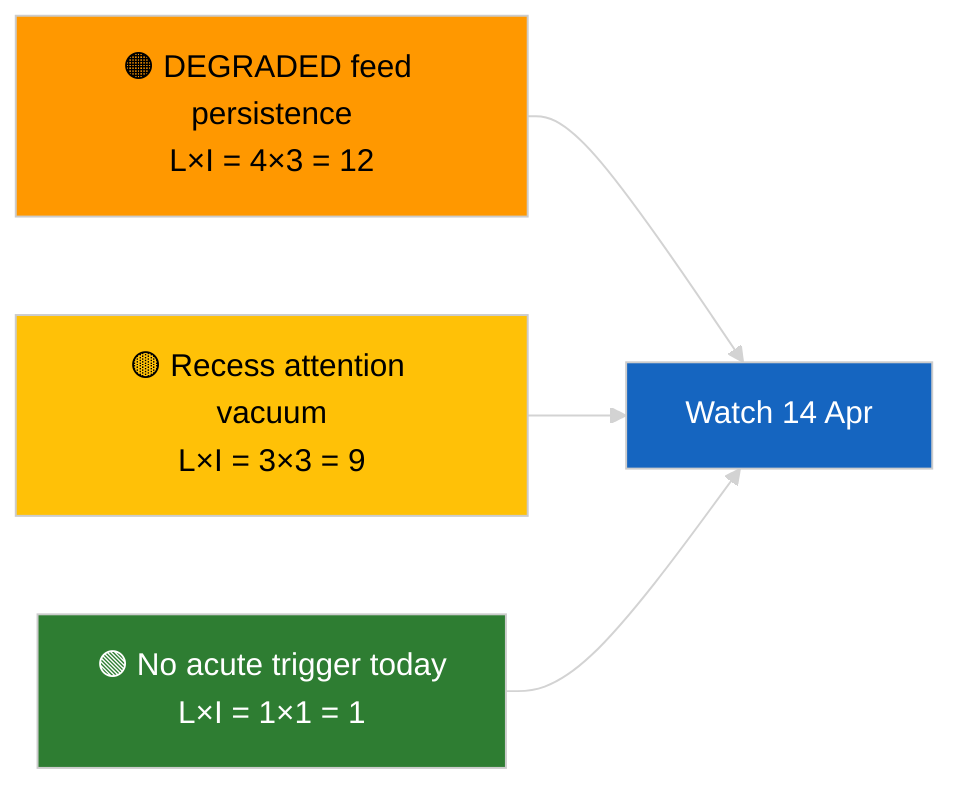

<!-- SPDX-FileCopyrightText: 2026 Hack23 AB -->
<!-- SPDX-License-Identifier: Apache-2.0 -->

# Executive Brief — Breaking | 2026-04-05

**Classification:** OSINT | Public Parliamentary Record
**Confidence:** 🟢 High (recess-period structural assessment)
**Generated:** 2026-04-05T00:00:00Z (retrospective brief)
**Article Type:** Breaking
**Source:** European Parliament Open Data Portal

---

## 🎯 BLUF

**No breaking news developments on 2026-04-05; EP is in Easter recess (Day 10 of 18, 27 March → 13 April 2026).** No parliamentary sessions, committee meetings, or votes scheduled. The week's intelligence signals (DEGRADED feed-API state, PPE 38% structural dominance, anti-corruption reform cluster) are inherited from the 2026-04-03 / 04-04 substantive runs. **🟢 HIGH confidence** the inactivity is calendar-driven.

---

## 🧭 3 Decisions This Brief Supports

| # | Decision | Who Decides | Deadline | Evidence |
|:-:|----------|-------------|:--------:|----------|
| 1 | **Editorial:** SKIP daily breaking | Editor | +12h | Recess Day 10 of 18 |
| 2 | **Monitoring:** maintain endpoint health watch | Data pipeline | daily | DEGRADED state |
| 3 | **Forward-watch:** Commission Tuesday 7 April, recess end 13 April | Analysis lead | 2026-04-07 | Q1→Q2 transition |

---

## 📰 60-Second Read

- 🔴 **No new EP activity** on 2026-04-05 (Sunday, Easter recess Day 10/18). (🟢 High)
- 🟠 **DEGRADED feed-API state continues** from 2026-04-03 probe. (🟢 High)
- 🟢 **Carry-over watch list:** anti-corruption (TA-10-2026-0094), Braun immunity (TA-10-2026-0088), US tariff (TA-10-2026-0096), HDV emissions (TA-10-2026-0084). (🟢 High)
- 🟡 **Coalition arithmetic stable**: PPE 38% / Grand Coalition 60%. (🟢 High)
- 🔵 **Economic context:** US-EU trade trajectory unchanged. (🟢 High)
- 🟣 **Cross-reference:** sibling `breaking-2` and `breaking-3` provide cross-session mid-recess synthesis. (🟢 High)
- 🩷 **Disruption vector:** none acute. (🟢 High)
- ⚪ **Carry-forward:** 8 days to recess end.

---

## 🗂️ Top Documents / Procedures Table

| Rank | EP reference | Title (short) | Significance | Confidence |
|:----:|--------------|---------------|:------------:|:----------:|
| 1 | — | No new procedures or adopted texts on 2026-04-05 | 0.0 | 🟢 HIGH |
| 2 | TA-10-2026-0094 | Anti-corruption (carry-over) | 9.0 | 🟢 HIGH |
| 3 | TA-10-2026-0088 | Braun immunity (carry-over) | 7.0 | 🟢 HIGH |

---

## ⚠️ Risk & Threat Snapshot

| Risk | L | I | Score | Trigger | Source | Admiralty |
|------|:-:|:-:|:-----:|---------|--------|:---------:|
| DEGRADED feed persistence | 4 | 3 | 12 | Past 14 April | 2026-04-03/breaking-2 | A1 |
| Recess attention vacuum | 3 | 3 | 9 | US or PL surprise | EP calendar | A2 |

---

## 🔮 Top Forward Trigger

**Commission Tuesday 7 April 2026** (first post-Easter college tabling) and **recess end 13 April**.

---

## 🛡️ Source Quality Assessment

- **Primary sources:** EP calendar; carry-over Q1 cluster.
- **Confidence:** 🟢 HIGH on calendar driver.

---

## 📎 Links

| Link | Path |
|------|------|
| Article | `./article.md` |
| Sibling runs | `analysis/daily/2026-04-05/breaking-2/`, `breaking-3/` |
| Manifest | `./manifest.json` |

---

**Document Control**
- **Template:** `/analysis/templates/executive-brief.md`
- **Artifact path:** `analysis/daily/2026-04-05/breaking/executive-brief.md`
- **Classification:** Public
- **Retrospective generation:** Back-fill session.
