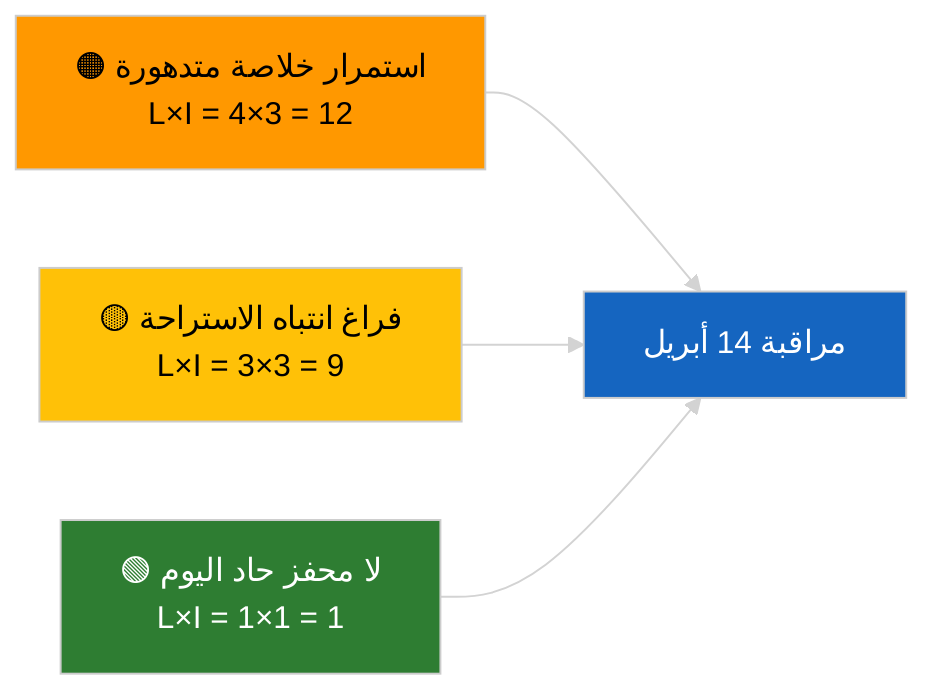

<!-- SPDX-FileCopyrightText: 2026 Hack23 AB -->
<!-- SPDX-License-Identifier: Apache-2.0 -->

# الموجز التنفيذي — عاجل | 2026-04-05

**التصنيف:** OSINT | سجل برلماني علني
**الثقة:** 🟢 مرتفعة (تقييم هيكلي خلال الفترة الاستراحية البرلمانية)
**تاريخ الإنشاء:** 2026-04-05T00:00:00Z (موجز استرجاعي)
**نوع المقال:** عاجل
**المصدر:** بوابة البيانات المفتوحة للبرلمان الأوروبي

---

## 🎯 BLUF

**لا توجد تطورات إخبارية عاجلة بتاريخ 2026-04-05؛ يوجد البرلمان الأوروبي في عطلة عيد الفصح (اليوم 10 من 18، من 27 مارس إلى 13 أبريل 2026).** لا جلسات عامة ولا اجتماعات لجان ولا تصويتات مجدولة. إشارات المعلومات الاستخباراتية للأسبوع (حالة API الخلاصة المتدهورة، الهيمنة الهيكلية لـ PPE بنسبة 38%، حزمة إصلاح مكافحة الفساد) موروثة من جلسات العمل الجوهرية في 2026-04-03 / 04-04. **🟢 ثقة مرتفعة** في أن عدم النشاط ذو طابع تقويمي.

---

## 🧭 3 Decisions This Brief Supports

| # | القرار | من يقرر | الموعد النهائي | الأدلة |
|:-:|--------|---------|:-------------:|--------|
| 1 | **تحرير:** تخطّي النشرة اليومية العاجلة | رئيس التحرير | +12 ساعة | يوم استراحة 10 من 18 |
| 2 | **مراقبة:** الإبقاء على مراقبة صحة نقطة النهاية | خط بيانات | يومياً | حالة متدهورة |
| 3 | **رصد استشرافي:** المفوضية يوم الثلاثاء 7 أبريل، انتهاء الاستراحة 13 أبريل | قائد التحليل | 2026-04-07 | انتقال Q1→Q2 |

---

## 📰 60-Second Read

- 🔴 **لا نشاط جديد للبرلمان الأوروبي** بتاريخ 2026-04-05 (الأحد، عطلة عيد الفصح اليوم 10/18). (🟢 مرتفعة)
- 🟠 **حالة API الخلاصة المتدهورة مستمرة** منذ سبر 2026-04-03. (🟢 مرتفعة)
- 🟢 **قائمة المراقبة المنقولة:** مكافحة الفساد (TA-10-2026-0094)، حصانة براون (TA-10-2026-0088)، تعريفات أمريكية (TA-10-2026-0096)، انبعاثات HDV (TA-10-2026-0084). (🟢 مرتفعة)
- 🟡 **الحسابات الائتلافية مستقرة**: PPE 38% / التحالف الكبير 60%. (🟢 مرتفعة)
- 🔵 **السياق الاقتصادي:** مسار التجارة بين الولايات المتحدة والاتحاد الأوروبي دون تغيير. (🟢 مرتفعة)
- 🟣 **إشارة مرجعية متبادلة:** جلستا الأخت `breaking-2` و`breaking-3` توفران تركيباً متوسط الاستراحة عبر الجلسات. (🟢 مرتفعة)
- 🩷 **ناقل الاضطراب:** لا شيء حاد. (🟢 مرتفعة)
- ⚪ **المنقول:** 8 أيام حتى نهاية الاستراحة.

---

## 🗂️ Top Documents / Procedures Table

| الرتبة | المرجع في البرلمان الأوروبي | العنوان (مختصر) | الأهمية | الثقة |
|:------:|---------------------------|----------------|:-------:|:-----:|
| 1 | — | لا إجراءات جديدة ولا نصوص معتمدة بتاريخ 2026-04-05 | 0.0 | 🟢 مرتفعة |
| 2 | TA-10-2026-0094 | مكافحة الفساد (منقول) | 9.0 | 🟢 مرتفعة |
| 3 | TA-10-2026-0088 | حصانة براون (منقول) | 7.0 | 🟢 مرتفعة |

---

## ⚠️ Risk & Threat Snapshot

| الخطر | ا | ت | الدرجة | المحفز | المصدر | الأدميرالية |
|:-----:|:-:|:-:|:------:|--------|--------|:-----------:|
| استمرار خلاصة متدهورة | 4 | 3 | 12 | بعد 14 أبريل | 2026-04-03/breaking-2 | A1 |
| فراغ انتباه الاستراحة | 3 | 3 | 9 | مفاجأة أمريكية أو بولندية | تقويم البرلمان الأوروبي | A2 |

---

## 🔮 Top Forward Trigger

**المفوضية الأوروبية يوم الثلاثاء 7 أبريل 2026** (أول جلسة عمل بعد عيد الفصح) و**انتهاء الاستراحة 13 أبريل**.

---

## 🛡️ Source Quality Assessment

- **المصادر الأولية:** تقويم البرلمان الأوروبي؛ حزمة مناقلات Q1.
- **الثقة:** 🟢 مرتفعة في العامل التقويمي.

---

## 📎 Links

| الرابط | المسار |
|--------|--------|
| المقال | `./article.md` |
| جلسات الأخت | `analysis/daily/2026-04-05/breaking-2/`, `breaking-3/` |
| البيان الإلزامي | `./manifest.json` |

---

**ضبط الوثيقة**
- **القالب:** `/analysis/templates/executive-brief.md`
- **مسار المصنوع:** `analysis/daily/2026-04-05/breaking/executive-brief.md`
- **التصنيف:** عام
- **الإنشاء الاسترجاعي:** جلسة الملء الخلفي.
