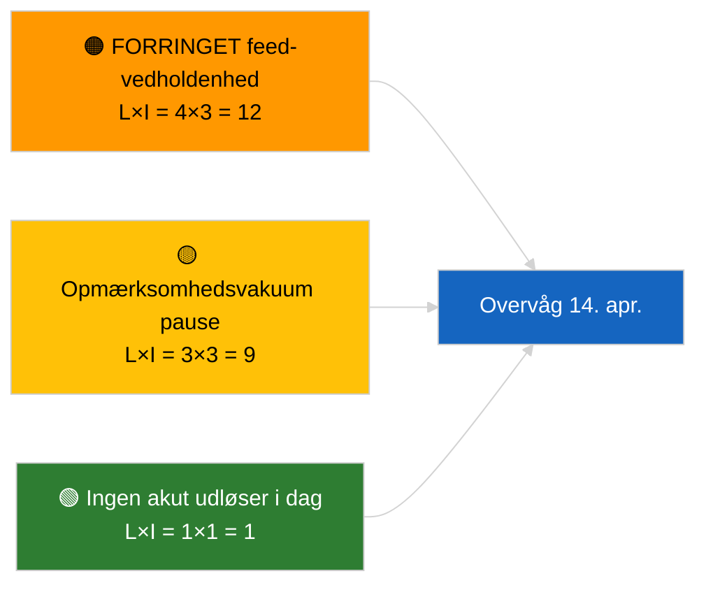

<!-- SPDX-FileCopyrightText: 2026 Hack23 AB -->
<!-- SPDX-License-Identifier: Apache-2.0 -->

# Resumé — Seneste nyt | 2026-04-05

**Klassificering:** OSINT | Offentlig parlamentarisk registrering
**Troværdighed:** 🟢 Høj (strukturel vurdering under parlamentarisk pause)
**Genereret:** 2026-04-05T00:00:00Z (retrospektivt resumé)
**Artikeltype:** Seneste nyt
**Kilde:** Europaparlamentets åbne dataportal

---

## 🎯 BLUF

**Ingen seneste nyheder den 2026-04-05; EP er i påskepause (Dag 10 af 18, 27. marts → 13. april 2026).** Ingen plenarmøder, udvalgsmøder eller afstemninger planlagt. Ugens efterretningssignaler (FORRINGET feed-API-tilstand, PPE's strukturelle dominans på 38 %, antikorruptions-reformklynge) er nedarvet fra de substantielle kørsler den 2026-04-03 / 04-04. **🟢 HØJ troværdighed** for at inaktiviteten er kalenderbestemt.

---

## 🧭 3 Decisions This Brief Supports

| # | Beslutning | Beslutningstagere | Frist | Beviser |
|:-:|-----------|-----------------|:-----:|---------|
| 1 | **Redaktion:** SPRING OVER daglig seneste nyt | Redaktør | +12t | Pausedag 10 af 18 |
| 2 | **Overvågning:** oprethold endepunkts-sundhedsovervågning | Datapipeline | dagligt | FORRINGET tilstand |
| 3 | **Fremsynet:** Kommissionen tirsdag 7. april, pauseafslutning 13. april | Analysechef | 2026-04-07 | Q1→Q2-overgang |

---

## 📰 60-Second Read

- 🔴 **Ingen ny EP-aktivitet** den 2026-04-05 (søndag, påskepause Dag 10/18). (🟢 Høj)
- 🟠 **FORRINGET feed-API-tilstand fortsætter** fra sonden 2026-04-03. (🟢 Høj)
- 🟢 **Overført overvågningsliste:** antikorruption (TA-10-2026-0094), Braun-immunitet (TA-10-2026-0088), amerikanske toldsatser (TA-10-2026-0096), HDV-emissioner (TA-10-2026-0084). (🟢 Høj)
- 🟡 **Koalitionsaritmik stabil**: PPE 38 % / Stor koalition 60 %. (🟢 Høj)
- 🔵 **Økonomisk kontekst:** USA-EU handelstrajektorie uændret. (🟢 Høj)
- 🟣 **Krydshenvisning:** søsterkørsler `breaking-2` og `breaking-3` leverer sessionskrydset midt-pause-syntese. (🟢 Høj)
- 🩷 **Forstyrrelsesvektor:** ingen akut. (🟢 Høj)
- ⚪ **Overførsel:** 8 dage til pauseafslutning.

---

## 🗂️ Top Documents / Procedures Table

| Rang | EP-reference | Titel (kort) | Betydning | Troværdighed |
|:----:|-------------|-------------|:---------:|:------------:|
| 1 | — | Ingen nye procedurer eller vedtagne tekster den 2026-04-05 | 0,0 | 🟢 HØJ |
| 2 | TA-10-2026-0094 | Antikorruption (overført) | 9,0 | 🟢 HØJ |
| 3 | TA-10-2026-0088 | Braun-immunitet (overført) | 7,0 | 🟢 HØJ |

---

## ⚠️ Risk & Threat Snapshot

| Risiko | S | P | Score | Udløser | Kilde | Admiralitet |
|--------|:-:|:-:|:-----:|---------|-------|:-----------:|
| FORRINGET feed-vedholdenhed | 4 | 3 | 12 | Efter 14. april | 2026-04-03/breaking-2 | A1 |
| Opmærksomhedsvakuum pause | 3 | 3 | 9 | USA- eller PL-overraskelse | EP-kalender | A2 |

---

## 🔮 Top Forward Trigger

**Kommissionen tirsdag 7. april 2026** (første post-påske tabelopstilling) og **pauseafslutning 13. april**.

---

## 🛡️ Source Quality Assessment

- **Primære kilder:** EP-kalender; Q1-overførselsklynge.
- **Troværdighed:** 🟢 HØJ på kalenderfaktor.

---

## 📎 Links

| Link | Sti |
|------|-----|
| Artikel | `./article.md` |
| Søsterkørsler | `analysis/daily/2026-04-05/breaking-2/`, `breaking-3/` |
| Manifest | `./manifest.json` |

---

**Dokumentkontrol**
- **Skabelon:** `/analysis/templates/executive-brief.md`
- **Artefaktsti:** `analysis/daily/2026-04-05/breaking/executive-brief.md`
- **Klassificering:** Offentlig
- **Retrospektiv generering:** Back-fill session.
