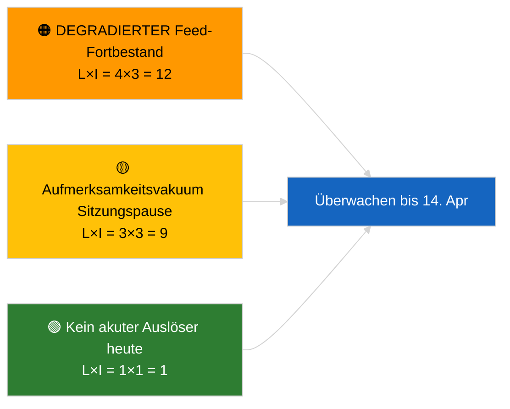

<!-- SPDX-FileCopyrightText: 2026 Hack23 AB -->
<!-- SPDX-License-Identifier: Apache-2.0 -->

# Exekutivbriefing — Aktuell | 2026-04-05

**Klassifizering:** OSINT | Öffentliche parlamentarische Aufzeichnung
**Vertrouen:** 🟢 Hoch (Strukturbewertung während parlamentarischer Sitzungspause)
**Erstellt:** 2026-04-05T00:00:00Z (retrospektives Briefing)
**Artikeltyp:** Aktuell
**Quelle:** Europäisches Parlament Open Data Portal

---

## 🎯 BLUF

**Keine aktuellen Nachrichten am 2026-04-05; das EP befindet sich in der Osterpause (Tag 10 von 18, 27. März → 13. April 2026).** Keine Plenarsitzungen, Ausschusssitzungen oder Abstimmungen angesetzt. Die Informationssignale der Woche (DEGRADIERTER Feed-API-Zustand, strukturelle PPE-Dominanz von 38 %, Anti-Korruptionsreform-Cluster) stammen aus den substantiellen Läufen vom 2026-04-03 / 04-04. **🟢 HOHE Konfidenz**, dass die Inaktivität kalenderbedingt ist.

---

## 🧭 3 Decisions This Brief Supports

| # | Entscheidung | Entscheider | Frist | Belege |
|:-:|-------------|------------|:-----:|--------|
| 1 | **Redaktion:** Tageliche Eilmeldung ÜBERSPRINGEN | Chefredakteur | +12h | Pausentag 10 von 18 |
| 2 | **Überwachung:** Endpunkt-Gesundheitsüberwachung beibehalten | Datenpipeline | täglich | DEGRADIERTER Zustand |
| 3 | **Vorausschau:** Kommission Dienstag 7. April, Pausenende 13. April | Analyseleitung | 2026-04-07 | Q1→Q2-Übergang |

---

## 📰 60-Second Read

- 🔴 **Keine neuen EP-Aktivitäten** am 2026-04-05 (Sonntag, Osterpause Tag 10/18). (🟢 Hoch)
- 🟠 **DEGRADIERTER Feed-API-Zustand setzt sich fort** seit Sonde 2026-04-03. (🟢 Hoch)
- 🟢 **Übertragungs-Beobachtungsliste:** Anti-Korruption (TA-10-2026-0094), Braun-Immunität (TA-10-2026-0088), US-Zölle (TA-10-2026-0096), HDV-Emissionen (TA-10-2026-0084). (🟢 Hoch)
- 🟡 **Koalitionsarithmetik stabil**: PPE 38 % / Große Koalition 60 %. (🟢 Hoch)
- 🔵 **Wirtschaftlicher Kontext:** US-EU-Handelsentwicklung unverändert. (🟢 Hoch)
- 🟣 **Querverweisen:** Geschwisterdurchläufe `breaking-2` und `breaking-3` liefern sitzungsübergreifende Mitten-Pausen-Synthese. (🟢 Hoch)
- 🩷 **Störungsvektor:** keiner akut. (🟢 Hoch)
- ⚪ **Übertragung:** 8 Tage bis Pausenende.

---

## 🗂️ Top Documents / Procedures Table

| Rang | EP-Referenz | Titel (kurz) | Bedeutung | Konfidenz |
|:----:|-------------|-------------|:---------:|:---------:|
| 1 | — | Keine neuen Verfahren oder angenommenen Texte am 2026-04-05 | 0,0 | 🟢 HOCH |
| 2 | TA-10-2026-0094 | Anti-Korruption (Übertragung) | 9,0 | 🟢 HOCH |
| 3 | TA-10-2026-0088 | Braun-Immunität (Übertragung) | 7,0 | 🟢 HOCH |

---

## ⚠️ Risk & Threat Snapshot

| Risiko | W | A | Punktzahl | Auslöser | Quelle | Admiralität |
|--------|:-:|:-:|:---------:|---------|--------|:-----------:|
| DEGRADIERTER Feed-Fortbestand | 4 | 3 | 12 | Nach 14. April | 2026-04-03/breaking-2 | A1 |
| Aufmerksamkeitsvakuum Pause | 3 | 3 | 9 | US- oder PL-Überraschung | EP-Kalender | A2 |

---

## 🔮 Top Forward Trigger

**Kommission Dienstag 7. April 2026** (erste Befassung nach Ostern) und **Pausenende 13. April**.

---

## 🛡️ Source Quality Assessment

- **Primärquellen:** EP-Kalender; Q1-Übertragungs-Cluster.
- **Konfidenz:** 🟢 HOCH bezüglich des Kalendertreibers.

---

## 📎 Links

| Link | Pfad |
|------|------|
| Artikel | `./article.md` |
| Geschwisterdurchläufe | `analysis/daily/2026-04-05/breaking-2/`, `breaking-3/` |
| Manifest | `./manifest.json` |

---

**Dokumentenkontrolle**
- **Vorlage:** `/analysis/templates/executive-brief.md`
- **Artefaktpfad:** `analysis/daily/2026-04-05/breaking/executive-brief.md`
- **Klassifizierung:** Öffentlich
- **Retrospektive Erstellung:** Nachfüll-Sitzung.
