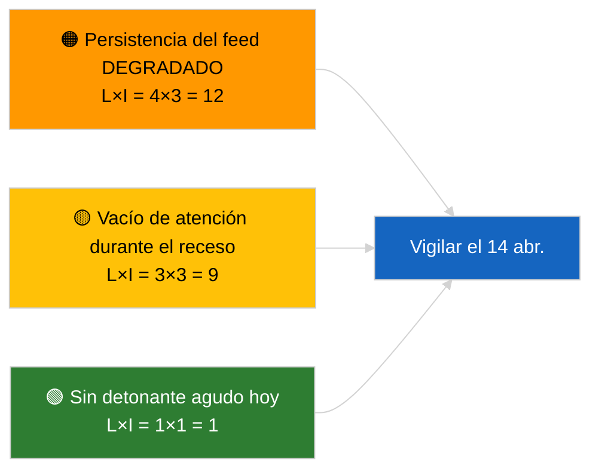

<!-- SPDX-FileCopyrightText: 2026 Hack23 AB -->
<!-- SPDX-License-Identifier: Apache-2.0 -->

# Resumen ejecutivo — Última hora | 2026-04-05

**Clasificación:** OSINT | Registro parlamentario público
**Confianza:** 🟢 Alta (evaluación estructural durante el período de receso parlamentario)
**Generado:** 2026-04-05T00:00:00Z (resumen retrospectivo)
**Tipo de artículo:** Última hora
**Fuente:** Portal de datos abiertos del Parlamento Europeo

---

## 🎯 BLUF

**Sin noticias de última hora el 2026-04-05; el PE está en receso de Semana Santa (Día 10 de 18, del 27 de marzo al 13 de abril de 2026).** No hay sesiones plenarias, reuniones de comisión ni votaciones programadas. Las señales de inteligencia de la semana (estado DEGRADADO de la API de feed, dominancia estructural del PPE del 38 %, clúster de reforma anticorrupción) se heredan de las sesiones sustantivas del 2026-04-03 / 04-04. **🟢 ALTA confianza** en que la inactividad es de carácter calendárico.

---

## 🧭 3 Decisions This Brief Supports

| # | Decisión | Responsable | Plazo | Evidencia |
|:-:|---------|------------|:-----:|-----------|
| 1 | **Editorial:** OMITIR la última hora diaria | Editor | +12h | Día de receso 10 de 18 |
| 2 | **Monitoreo:** mantener la vigilancia del estado de los endpoints | Canalización de datos | diario | Estado DEGRADADO |
| 3 | **Vigilancia prospectiva:** Comisión martes 7 de abril, fin del receso 13 de abril | Responsable de análisis | 2026-04-07 | Transición Q1→Q2 |

---

## 📰 60-Second Read

- 🔴 **Sin nueva actividad del PE** el 2026-04-05 (domingo, receso de Semana Santa Día 10/18). (🟢 Alta)
- 🟠 **El estado DEGRADADO de la API de feed continúa** desde la sonda del 2026-04-03. (🟢 Alta)
- 🟢 **Lista de seguimiento pendiente:** anticorrupción (TA-10-2026-0094), inmunidad Braun (TA-10-2026-0088), aranceles EE. UU. (TA-10-2026-0096), emisiones HDV (TA-10-2026-0084). (🟢 Alta)
- 🟡 **Aritmética de coalición estable**: PPE 38 % / Gran coalición 60 %. (🟢 Alta)
- 🔵 **Contexto económico:** trayectoria comercial UE-EE. UU. sin cambios. (🟢 Alta)
- 🟣 **Referencia cruzada:** las sesiones hermanas `breaking-2` y `breaking-3` proporcionan síntesis interoperable de mediados del receso. (🟢 Alta)
- 🩷 **Vector de perturbación:** ninguno agudo. (🟢 Alta)
- ⚪ **Traslado:** 8 días para el fin del receso.

---

## 🗂️ Top Documents / Procedures Table

| Rango | Referencia PE | Título (resumido) | Relevancia | Confianza |
|:-----:|--------------|-------------------|:----------:|:---------:|
| 1 | — | Sin nuevos procedimientos ni textos adoptados el 2026-04-05 | 0,0 | 🟢 ALTA |
| 2 | TA-10-2026-0094 | Anticorrupción (pendiente) | 9,0 | 🟢 ALTA |
| 3 | TA-10-2026-0088 | Inmunidad Braun (pendiente) | 7,0 | 🟢 ALTA |

---

## ⚠️ Risk & Threat Snapshot

| Riesgo | V | I | Puntuación | Detonante | Fuente | Almirantazgo |
|--------|:-:|:-:|:----------:|----------|--------|:------------:|
| Persistencia feed DEGRADADO | 4 | 3 | 12 | Después del 14 de abril | 2026-04-03/breaking-2 | A1 |
| Vacío de atención receso | 3 | 3 | 9 | Sorpresa EE. UU. o PL | Calendario PE | A2 |

---

## 🔮 Top Forward Trigger

**Comisión martes 7 de abril de 2026** (primera presentación post-Semana Santa) y **fin del receso el 13 de abril**.

---

## 🛡️ Source Quality Assessment

- **Fuentes primarias:** Calendario PE; clúster de pendientes del Q1.
- **Confianza:** 🟢 ALTA en el factor calendárico.

---

## 📎 Links

| Enlace | Ruta |
|--------|------|
| Artículo | `./article.md` |
| Sesiones hermanas | `analysis/daily/2026-04-05/breaking-2/`, `breaking-3/` |
| Manifiesto | `./manifest.json` |

---

**Control del documento**
- **Plantilla:** `/analysis/templates/executive-brief.md`
- **Ruta del artefacto:** `analysis/daily/2026-04-05/breaking/executive-brief.md`
- **Clasificación:** Público
- **Generación retrospectiva:** Sesión de relleno.
