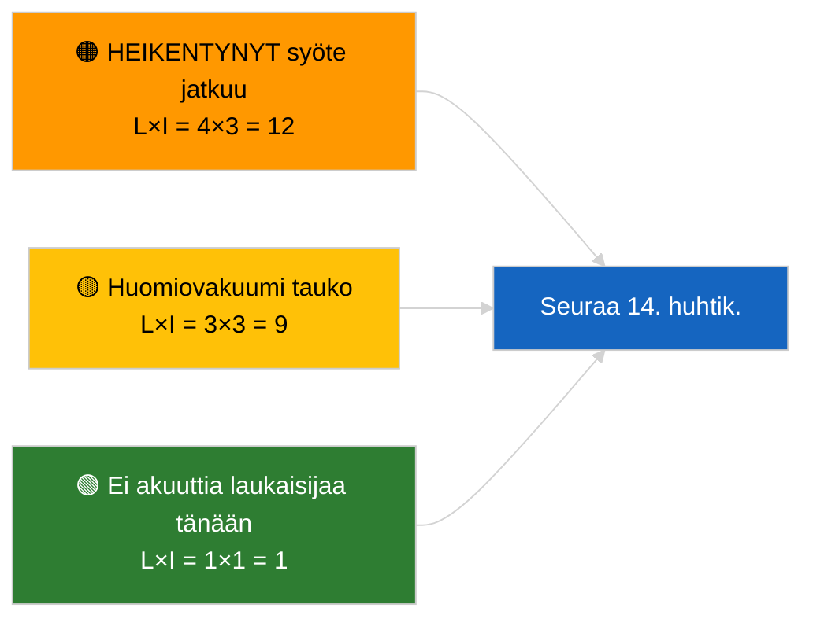

<!-- SPDX-FileCopyrightText: 2026 Hack23 AB -->
<!-- SPDX-License-Identifier: Apache-2.0 -->

# Tiivistelmä — Viimeisin uutinen | 2026-04-05

**Luokittelu:** OSINT | Julkinen parlamentaarinen asiakirja
**Luotettavuus:** 🟢 Korkea (rakenteellinen arvio parlamentaarisen tauon aikana)
**Laadittu:** 2026-04-05T00:00:00Z (retrospektiivinen tiivistelmä)
**Artikkelityyppi:** Viimeisin uutinen
**Lähde:** Euroopan parlamentin avoin tietoportaali

---

## 🎯 BLUF

**Ei viimeisintä uutista 2026-04-05; EP on pääsiäistauolla (Päivä 10/18, 27. maaliskuuta → 13. huhtikuuta 2026).** Ei täysistuntoja, valiokuntakokouksia eikä äänestyksiä. Viikon tiedustellusignaalit (HEIKENTYNYT syöte-API-tila, EPP:n rakenteellinen 38 %:n hallitsevuus, korruptiontorjunnan uudistusryväs) on peritty 2026-04-03 / 04-04 sisällöllisistä ajoista. **🟢 KORKEA luotettavuus** sille, että passiivisuus on kalenterin mukaista.

---

## 🧭 3 Decisions This Brief Supports

| # | Päätös | Päätöksentekijä | Määräaika | Todisteet |
|:-:|-------|----------------|:----------:|-----------|
| 1 | **Toimitus:** JÄtä VÄLIIN päivittäinen viimeisin uutinen | Toimittaja | +12h | Taukopäivä 10/18 |
| 2 | **Seuranta:** ylläpidä päätepisteen terveysseurantaa | Datapuoliputki | päivittäin | HEIKENTYNYT tila |
| 3 | **Ennakkokatse:** Komissio tiistaina 7. huhtikuuta, tauon päätös 13. huhtikuuta | Analyysipäällikkö | 2026-04-07 | Q1→Q2-siirtymä |

---

## 📰 60-Second Read

- 🔴 **Ei uusia EP-toimia** 2026-04-05 (sunnuntai, pääsiäistauko Päivä 10/18). (🟢 Korkea)
- 🟠 **HEIKENTYNYT syöte-API-tila jatkuu** 2026-04-03 koettimesta lähtien. (🟢 Korkea)
- 🟢 **Siirretty seurantalista:** korruptiontorjunta (TA-10-2026-0094), Braunin koskemattomuus (TA-10-2026-0088), Yhdysvaltojen tullimaksut (TA-10-2026-0096), HDV-päästöt (TA-10-2026-0084). (🟢 Korkea)
- 🟡 **Koalitioaritmetiikka vakaa**: EPP 38 % / Suurkoalitio 60 %. (🟢 Korkea)
- 🔵 **Taloudellinen asiayhteys:** Yhdysvaltojen ja EU:n kaupan kehityssuunta muuttumaton. (🟢 Korkea)
- 🟣 **Ristiviittaus:** sisarusajot `breaking-2` ja `breaking-3` tarjoavat istuntojen välisen tauon synteesin. (🟢 Korkea)
- 🩷 **Häiriövektori:** ei akuuttia. (🟢 Korkea)
- ⚪ **Siirto:** 8 päivää tauon loppuun.

---

## 🗂️ Top Documents / Procedures Table

| Sija | EP-viite | Otsikko (lyhyt) | Merkitys | Luotettavuus |
|:----:|---------|----------------|:--------:|:------------:|
| 1 | — | Ei uusia menettelyjä tai hyväksyttyjä tekstejä 2026-04-05 | 0,0 | 🟢 KORKEA |
| 2 | TA-10-2026-0094 | Korruptiontorjunta (siirretty) | 9,0 | 🟢 KORKEA |
| 3 | TA-10-2026-0088 | Braunin koskemattomuus (siirretty) | 7,0 | 🟢 KORKEA |

---

## ⚠️ Risk & Threat Snapshot

| Riski | T | V | Pisteet | Laukaisija | Lähde | Amiraliteetti |
|-------|:-:|:-:|:-------:|-----------|-------|:-------------:|
| HEIKENTYNYT syöte jatkuu | 4 | 3 | 12 | 14. huhtikuun jälkeen | 2026-04-03/breaking-2 | A1 |
| Huomiovakuumi tauko | 3 | 3 | 9 | Yhdysvaltojen tai PL:n yllätys | EP-kalenteri | A2 |

---

## 🔮 Top Forward Trigger

**Komissio tiistaina 7. huhtikuuta 2026** (ensimmäinen pääsiäisen jälkeinen esittelykokous) ja **tauon päätös 13. huhtikuuta**.

---

## 🛡️ Source Quality Assessment

- **Ensisijaiset lähteet:** EP-kalenteri; Q1-siirretty ryväs.
- **Luotettavuus:** 🟢 KORKEA kalenteritekijän osalta.

---

## 📎 Links

| Linkki | Polku |
|--------|-------|
| Artikkeli | `./article.md` |
| Sisarusajot | `analysis/daily/2026-04-05/breaking-2/`, `breaking-3/` |
| Manifest | `./manifest.json` |

---

**Asiakirjavalvonta**
- **Malli:** `/analysis/templates/executive-brief.md`
- **Artefaktipolku:** `analysis/daily/2026-04-05/breaking/executive-brief.md`
- **Luokittelu:** Julkinen
- **Retrospektiivinen luonti:** Takaisinpäin täyttö -istunto.
