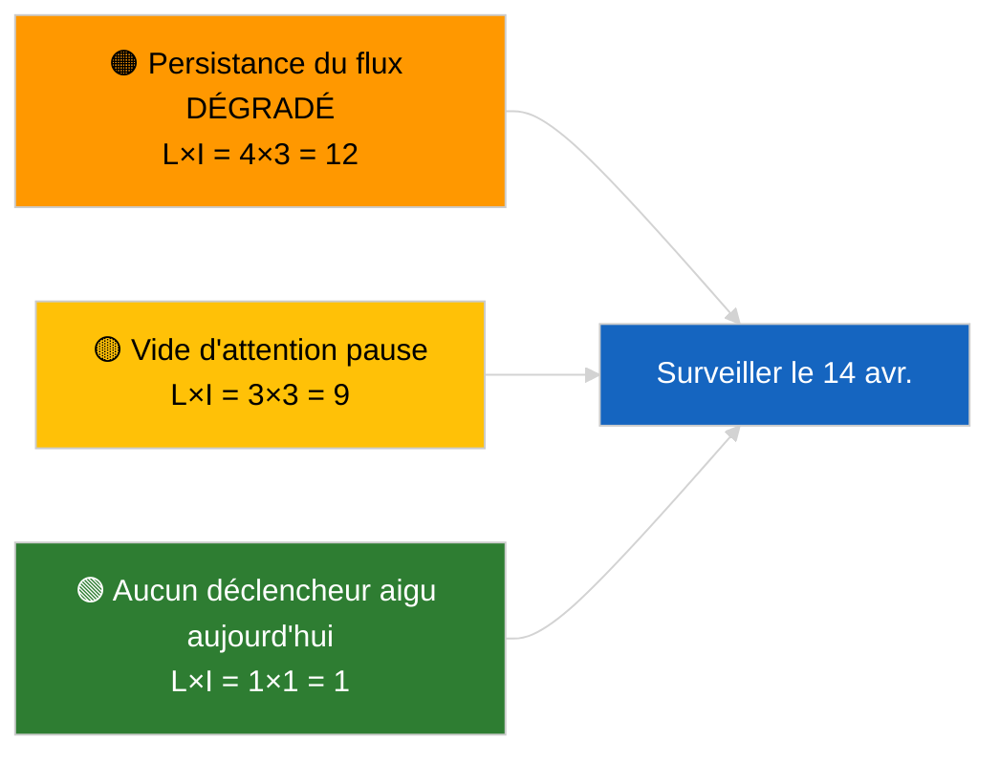

<!-- SPDX-FileCopyrightText: 2026 Hack23 AB -->
<!-- SPDX-License-Identifier: Apache-2.0 -->

# Note de synthèse — Actualité | 2026-04-05

**Classification :** OSINT | Registre parlementaire public
**Fiabilité :** 🟢 Élevée (évaluation structurelle en période de pause parlementaire)
**Générée :** 2026-04-05T00:00:00Z (note rétrospective)
**Type d'article :** Actualité
**Source :** Portail de données ouvertes du Parlement européen

---

## 🎯 BLUF

**Aucun développement d'actualité le 2026-04-05 ; le PE est en pause pascale (Jour 10 sur 18, du 27 mars au 13 avril 2026).** Aucune session plénière, aucune réunion de commission ni vote planifié. Les signaux de renseignement de la semaine (état dégradé de l'API de flux, dominance structurelle du PPE à 38 %, cluster réforme anti-corruption) sont repris depuis les sessions substantielles des 2026-04-03 / 04-04. **🟢 HAUTE confiance** sur le fait que l'inactivité est de nature calendaire.

---

## 🧭 3 Decisions This Brief Supports

| # | Décision | Décideur | Échéance | Preuves |
|:-:|---------|---------|:--------:|---------|
| 1 | **Éditorial :** IGNORER l'actualité quotidienne | Rédacteur en chef | +12h | Jour de pause 10 sur 18 |
| 2 | **Surveillance :** maintenir la veille de santé des points de terminaison | Pipeline de données | quotidien | État DÉGRADÉ |
| 3 | **Veille prospective :** Commission mardi 7 avril, fin de pause 13 avril | Responsable d'analyse | 2026-04-07 | Transition Q1→Q2 |

---

## 📰 60-Second Read

- 🔴 **Aucune nouvelle activité PE** le 2026-04-05 (dimanche, pause pascale Jour 10/18). (🟢 Élevée)
- 🟠 **L'état DÉGRADÉ de l'API de flux persiste** depuis la sonde du 2026-04-03. (🟢 Élevée)
- 🟢 **Liste de surveillance reprise :** anti-corruption (TA-10-2026-0094), immunité Braun (TA-10-2026-0088), tarifs américains (TA-10-2026-0096), émissions HDV (TA-10-2026-0084). (🟢 Élevée)
- 🟡 **Arithmétique de coalition stable** : PPE 38 % / Grande coalition 60 %. (🟢 Élevée)
- 🔵 **Contexte économique :** trajectoire commerciale UE-États-Unis inchangée. (🟢 Élevée)
- 🟣 **Référence croisée :** les sessions sœurs `breaking-2` et `breaking-3` fournissent une synthèse croisée de mi-pause. (🟢 Élevée)
- 🩷 **Vecteur de perturbation :** aucun aigu. (🟢 Élevée)
- ⚪ **Report :** 8 jours avant la fin de la pause.

---

## 🗂️ Top Documents / Procedures Table

| Rang | Référence PE | Titre (abrégé) | Importance | Fiabilité |
|:----:|-------------|----------------|:----------:|:---------:|
| 1 | — | Aucune nouvelle procédure ni texte adopté le 2026-04-05 | 0,0 | 🟢 ÉLEVÉE |
| 2 | TA-10-2026-0094 | Anti-corruption (report) | 9,0 | 🟢 ÉLEVÉE |
| 3 | TA-10-2026-0088 | Immunité Braun (report) | 7,0 | 🟢 ÉLEVÉE |

---

## ⚠️ Risk & Threat Snapshot

| Risque | V | I | Score | Déclencheur | Source | Admirauté |
|--------|:-:|:-:|:-----:|------------|--------|:---------:|
| Persistance flux DÉGRADÉ | 4 | 3 | 12 | Après le 14 avril | 2026-04-03/breaking-2 | A1 |
| Vide d'attention pause | 3 | 3 | 9 | Surprise US ou PL | Calendrier PE | A2 |

---

## 🔮 Top Forward Trigger

**Réunion de la Commission mardi 7 avril 2026** (premier tableau post-Pâques) et **fin de pause le 13 avril**.

---

## 🛡️ Source Quality Assessment

- **Sources primaires :** Calendrier PE ; cluster de report Q1.
- **Fiabilité :** 🟢 ÉLEVÉE sur le facteur calendaire.

---

## 📎 Links

| Lien | Chemin |
|------|--------|
| Article | `./article.md` |
| Sessions sœurs | `analysis/daily/2026-04-05/breaking-2/`, `breaking-3/` |
| Manifeste | `./manifest.json` |

---

**Contrôle du document**
- **Modèle :** `/analysis/templates/executive-brief.md`
- **Chemin de l'artefact :** `analysis/daily/2026-04-05/breaking/executive-brief.md`
- **Classification :** Public
- **Génération rétrospective :** Session de remplissage.
