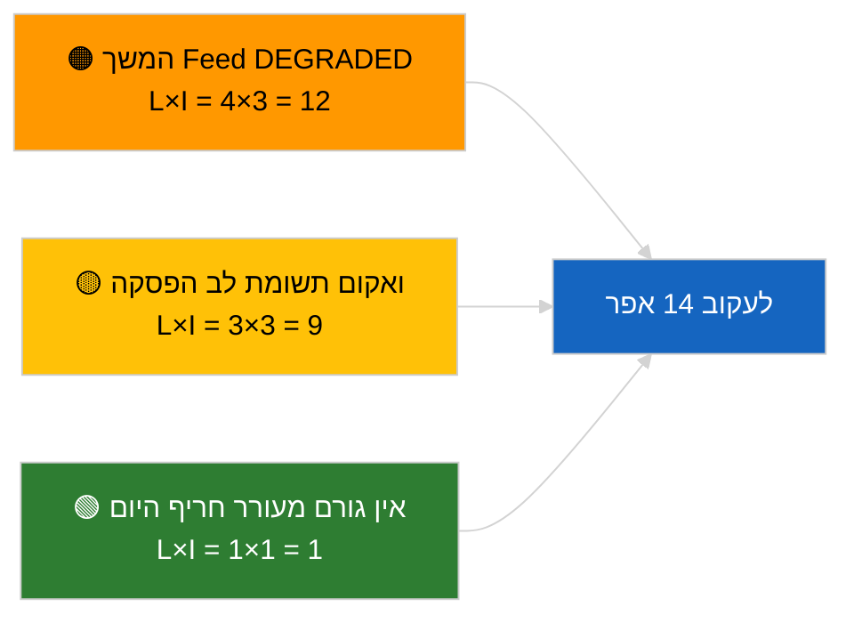

<!-- SPDX-FileCopyrightText: 2026 Hack23 AB -->
<!-- SPDX-License-Identifier: Apache-2.0 -->

# תקציר מנהלים — חדשות שוטפות | 2026-04-05

**סיווג:** OSINT | רשומה פרלמנטרית ציבורית
**אמינות:** 🟢 גבוהה (הערכה מבנית בתקופת הפסקה פרלמנטרית)
**נוצר:** 2026-04-05T00:00:00Z (תקציר רטרואקטיבי)
**סוג המאמר:** חדשות שוטפות
**מקור:** פורטל הנתונים הפתוחים של הפרלמנט האירופי

---

## 🎯 BLUF

**אין חדשות שוטפות ב-2026-04-05; ה-EP נמצא בחופשת פסחא (יום 10 מתוך 18, 27 במרץ → 13 באפריל 2026).** אין מושבים מליאים, ישיבות ועדה או הצבעות מתוזמנות. אותות המודיעין של השבוע (מצב API מוזנק DEGRADED, שליטה מבנית של PPE ב-38%, אשכול רפורמת נגד שחיתות) עוברים בירושה מהמפגשים המהותיים של 2026-04-03 / 04-04. **🟢 אמינות גבוהה** שהחוסר פעילות הוא לוחי זמנים.

---

## 🧭 3 Decisions This Brief Supports

| # | ההחלטה | מי מחליט | דדליין | ראיות |
|:-:|---------|----------|:------:|-------|
| 1 | **עריכה:** לדלג על החדשות השוטפות היומיות | עורך | +12 שעות | יום הפסקה 10 מתוך 18 |
| 2 | **ניטור:** לשמור על מעקב בריאות נקודות קצה | צינור נתונים | יומי | מצב DEGRADED |
| 3 | **מעקב קדימה:** הנציבות יום שלישי 7 באפריל, סוף ההפסקה 13 באפריל | ראש ניתוח | 2026-04-07 | מעבר Q1→Q2 |

---

## 📰 60-Second Read

- 🔴 **אין פעילות EP חדשה** ב-2026-04-05 (ראשון, חופשת פסחא יום 10/18). (🟢 גבוהה)
- 🟠 **מצב API מוזנק DEGRADED נמשך** מהחישוש ב-2026-04-03. (🟢 גבוהה)
- 🟢 **רשימת מעקב שמועברת:** נגד שחיתות (TA-10-2026-0094), חסינות Braun (TA-10-2026-0088), מכסי ארה"ב (TA-10-2026-0096), פליטות HDV (TA-10-2026-0084). (🟢 גבוהה)
- 🟡 **חשבון אריתמטי של קואליציה יציב**: PPE 38% / קואליציה גדולה 60%. (🟢 גבוהה)
- 🔵 **הקשר כלכלי:** מסלול המסחר בין ארה"ב לאיחוד האירופי ללא שינוי. (🟢 גבוהה)
- 🟣 **הפניה צולבת:** מפגשי האחות `breaking-2` ו-`breaking-3` מספקים סינתזת אמצע הפסקה בין-סשיונלית. (🟢 גבוהה)
- 🩷 **וקטור שיבוש:** אין דחוף. (🟢 גבוהה)
- ⚪ **מועבר קדימה:** 8 ימים עד סוף ההפסקה.

---

## 🗂️ Top Documents / Procedures Table

| דרגה | מפנה EP | כותרת (קצר) | חשיבות | אמינות |
|:----:|---------|------------|:------:|:------:|
| 1 | — | אין הליכים חדשים או טקסטים שאומצו ב-2026-04-05 | 0.0 | 🟢 גבוהה |
| 2 | TA-10-2026-0094 | נגד שחיתות (מועבר) | 9.0 | 🟢 גבוהה |
| 3 | TA-10-2026-0088 | חסינות Braun (מועבר) | 7.0 | 🟢 גבוהה |

---

## ⚠️ Risk & Threat Snapshot

| סיכון | ס' | ת' | ניקוד | גורם מעורר | מקור | אדמירליות |
|:-----:|:-:|:-:|:-----:|------------|------|:---------:|
| המשך Feed DEGRADED | 4 | 3 | 12 | אחרי 14 באפריל | 2026-04-03/breaking-2 | A1 |
| ואקום תשומת לב הפסקה | 3 | 3 | 9 | הפתעה אמריקאית או פולנית | לוח שנה EP | A2 |

---

## 🔮 Top Forward Trigger

**הנציבות יום שלישי 7 באפריל 2026** (הגשת המכלול הראשון לאחר פסחא) ו**סוף ההפסקה 13 באפריל**.

---

## 🛡️ Source Quality Assessment

- **מקורות ראשיים:** לוח שנה EP; אשכול מועבר Q1.
- **אמינות:** 🟢 גבוהה על גורם הלוח.

---

## 📎 Links

| קישור | נתיב |
|-------|------|
| מאמר | `./article.md` |
| מפגשי אחות | `analysis/daily/2026-04-05/breaking-2/`, `breaking-3/` |
| מניפסט | `./manifest.json` |

---

**מעקב מסמך**
- **תבנית:** `/analysis/templates/executive-brief.md`
- **נתיב פריט ניתוח:** `analysis/daily/2026-04-05/breaking/executive-brief.md`
- **סיווג:** ציבורי
- **יצירה רטרואקטיבית:** סשן מילוי לאחור.
