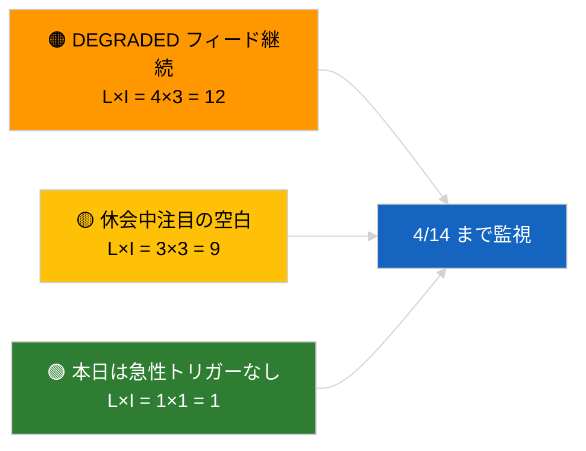

<!-- SPDX-FileCopyrightText: 2026 Hack23 AB -->
<!-- SPDX-License-Identifier: Apache-2.0 -->

# エグゼクティブ・ブリーフ — 速報 | 2026-04-05

**分類：** OSINT | 公開議会記録
**信頼度：** 🟢 高（議会休会期間中の構造的評価）
**作成日：** 2026-04-05T00:00:00Z（事後ブリーフ）
**記事タイプ：** 速報
**出典：** 欧州議会オープンデータポータル

---

## 🎯 BLUF

**2026-04-05 に速報はなし；EP は復活祭休会中（18 日間のうち 10 日目、2026 年 3 月 27 日 → 4 月 13 日）。** 本会議、委員会会議、採決は予定なし。今週の情報シグナル（DEGRADED フィード API 状態、PPE の構造的 38% 優位、腐敗対策改革クラスター）は 2026-04-03 / 04-04 の実質的な実行から引き継がれている。不活動が暦によるものである可能性は **🟢 高信頼度**。

---

## 🧭 3 Decisions This Brief Supports

| # | 決定事項 | 意思決定者 | 期限 | 根拠 |
|:-:|---------|-----------|:----:|------|
| 1 | **編集：** 日次速報を SKIP | 編集長 | +12 時間 | 休会 10/18 日目 |
| 2 | **監視：** エンドポイント健全性監視を維持 | データパイプライン | 毎日 | DEGRADED 状態 |
| 3 | **前方監視：** 欧州委員会 4 月 7 日（火）、休会終了 4 月 13 日 | 分析リーダー | 2026-04-07 | Q1→Q2 移行 |

---

## 📰 60-Second Read

- 🔴 **2026-04-05 に新たな EP 活動なし**（日曜日、復活祭休会 10/18 日目）。（🟢 高）
- 🟠 **DEGRADED フィード API 状態が 2026-04-03 の探索以来継続**。（🟢 高）
- 🟢 **引き継ぎ監視リスト：** 腐敗対策（TA-10-2026-0094）、Braun 不逮捕特権（TA-10-2026-0088）、米国関税（TA-10-2026-0096）、HDV 排気規制（TA-10-2026-0084）。（🟢 高）
- 🟡 **連立の算術は安定：** PPE 38% / 大連立 60%。（🟢 高）
- 🔵 **経済的背景：** 米 EU 貿易軌道に変化なし。（🟢 高）
- 🟣 **相互参照：** 姉妹実行 `breaking-2` および `breaking-3` がセッション横断の休会中期総合分析を提供。（🟢 高）
- 🩷 **混乱ベクター：** 急性なし。（🟢 高）
- ⚪ **引き継ぎ：** 休会終了まで 8 日。

---

## 🗂️ Top Documents / Procedures Table

| 順位 | EP 参照番号 | 題名（略） | 重要度 | 信頼度 |
|:---:|-----------|----------|:------:|:------:|
| 1 | — | 2026-04-05 に新たな手続きも採択テキストもなし | 0.0 | 🟢 高 |
| 2 | TA-10-2026-0094 | 腐敗対策（引き継ぎ） | 9.0 | 🟢 高 |
| 3 | TA-10-2026-0088 | Braun 不逮捕特権（引き継ぎ） | 7.0 | 🟢 高 |

---

## ⚠️ Risk & Threat Snapshot

| リスク | 蓋 | 影 | スコア | トリガー | 出典 | Admiralty |
|:-----:|:-:|:-:|:-----:|---------|------|:---------:|
| DEGRADED フィード継続 | 4 | 3 | 12 | 4 月 14 日以降 | 2026-04-03/breaking-2 | A1 |
| 休会中注目の空白 | 3 | 3 | 9 | 米国または PL の驚き | EP カレンダー | A2 |

---

## 🔮 Top Forward Trigger

**欧州委員会 2026 年 4 月 7 日（火）**（復活祭後の最初の議事提出）および**休会終了 4 月 13 日**。

---

## 🛡️ Source Quality Assessment

- **一次情報源：** EP カレンダー；Q1 引き継ぎクラスター。
- **信頼度：** 🟢 暦的要因に関しては高。

---

## 📎 Links

| リンク | パス |
|-------|------|
| 記事 | `./article.md` |
| 姉妹実行 | `analysis/daily/2026-04-05/breaking-2/`, `breaking-3/` |
| マニフェスト | `./manifest.json` |

---

**文書管理**
- **テンプレート：** `/analysis/templates/executive-brief.md`
- **成果物パス：** `analysis/daily/2026-04-05/breaking/executive-brief.md`
- **分類：** 公開
- **事後生成：** バックフィル・セッション。
