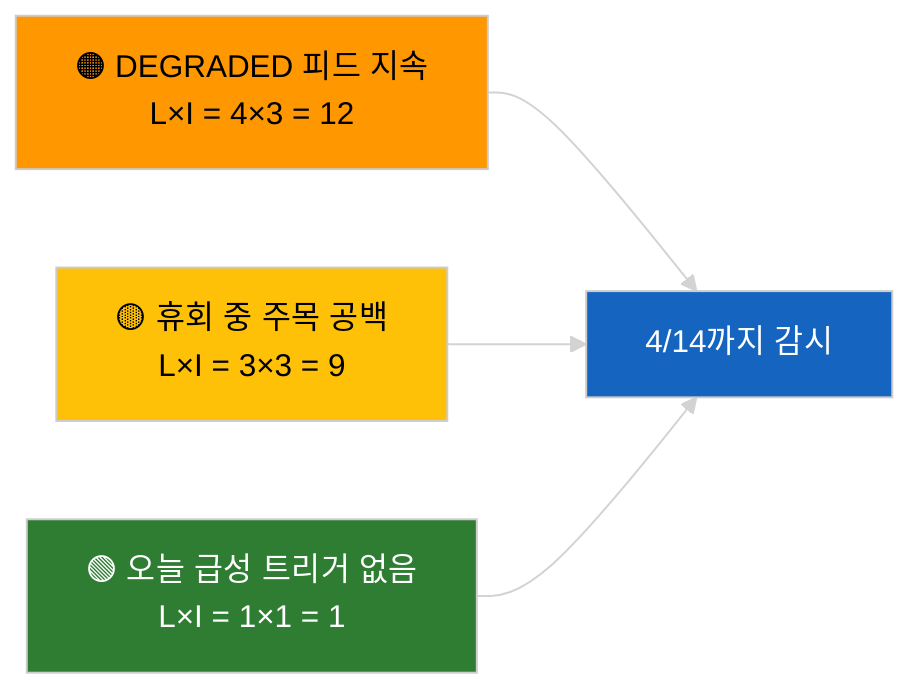

<!-- SPDX-FileCopyrightText: 2026 Hack23 AB -->
<!-- SPDX-License-Identifier: Apache-2.0 -->

# 집행 요약 — 속보 | 2026-04-05

**분류:** OSINT | 공개 의회 기록
**신뢰도:** 🟢 높음 (의회 휴회 기간 중 구조적 평가)
**작성일:** 2026-04-05T00:00:00Z (사후 요약)
**기사 유형:** 속보
**출처:** 유럽의회 오픈 데이터 포털

---

## 🎯 BLUF

**2026-04-05에 속보 없음; EP는 부활절 휴회 중(18일 중 10일째, 2026년 3월 27일 → 4월 13일).** 본회의, 위원회 회의, 투표 없음. 이번 주 인텔리전스 신호(DEGRADED 피드 API 상태, PPE의 38% 구조적 우세, 반부패 개혁 클러스터)는 2026-04-03 / 04-04 실질 실행에서 이월됨. 비활동이 달력에 의한 것임에 대해 **🟢 높은 신뢰도**.

---

## 🧭 3 Decisions This Brief Supports

| # | 결정 사항 | 결정 주체 | 마감 | 근거 |
|:-:|---------|---------|:----:|------|
| 1 | **편집:** 일일 속보 건너뜀 | 편집장 | +12시간 | 휴회 10/18일째 |
| 2 | **모니터링:** 엔드포인트 건강 감시 유지 | 데이터 파이프라인 | 매일 | DEGRADED 상태 |
| 3 | **전방 감시:** 집행위 4월 7일(화), 휴회 종료 4월 13일 | 분석 책임자 | 2026-04-07 | Q1→Q2 전환 |

---

## 📰 60-Second Read

- 🔴 **2026-04-05에 새로운 EP 활동 없음** (일요일, 부활절 휴회 10/18일째). (🟢 높음)
- 🟠 **DEGRADED 피드 API 상태 2026-04-03 탐색 이후 지속**. (🟢 높음)
- 🟢 **이월 감시 목록:** 반부패 (TA-10-2026-0094), Braun 불체포특권 (TA-10-2026-0088), 미국 관세 (TA-10-2026-0096), HDV 배출 (TA-10-2026-0084). (🟢 높음)
- 🟡 **연립 산술 안정**: PPE 38% / 대연립 60%. (🟢 높음)
- 🔵 **경제적 맥락:** 미EU 무역 궤도 변동 없음. (🟢 높음)
- 🟣 **교차 참조:** 자매 실행 `breaking-2`와 `breaking-3`이 세션 간 휴회 중기 종합 분석 제공. (🟢 높음)
- 🩷 **혼란 벡터:** 급성 없음. (🟢 높음)
- ⚪ **이월:** 휴회 종료까지 8일.

---

## 🗂️ Top Documents / Procedures Table

| 순위 | EP 참조 | 제목 (약칭) | 중요도 | 신뢰도 |
|:---:|--------|-----------|:-----:|:------:|
| 1 | — | 2026-04-05에 새로운 절차 또는 채택 텍스트 없음 | 0.0 | 🟢 높음 |
| 2 | TA-10-2026-0094 | 반부패 (이월) | 9.0 | 🟢 높음 |
| 3 | TA-10-2026-0088 | Braun 불체포특권 (이월) | 7.0 | 🟢 높음 |

---

## ⚠️ Risk & Threat Snapshot

| 리스크 | 가 | 영 | 점수 | 트리거 | 출처 | 해군성 |
|:-----:|:-:|:-:|:---:|--------|------|:------:|
| DEGRADED 피드 지속 | 4 | 3 | 12 | 4월 14일 이후 | 2026-04-03/breaking-2 | A1 |
| 휴회 중 주목 공백 | 3 | 3 | 9 | 미국 또는 PL 서프라이즈 | EP 달력 | A2 |

---

## 🔮 Top Forward Trigger

**집행위 2026년 4월 7일(화)** (부활절 이후 최초 의사 일정 제출) 및 **휴회 종료 4월 13일**.

---

## 🛡️ Source Quality Assessment

- **1차 출처:** EP 달력; Q1 이월 클러스터.
- **신뢰도:** 🟢 달력 요인에 대해 높음.

---

## 📎 Links

| 링크 | 경로 |
|------|------|
| 기사 | `./article.md` |
| 자매 실행 | `analysis/daily/2026-04-05/breaking-2/`, `breaking-3/` |
| 매니페스트 | `./manifest.json` |

---

**문서 관리**
- **템플릿:** `/analysis/templates/executive-brief.md`
- **성과물 경로:** `analysis/daily/2026-04-05/breaking/executive-brief.md`
- **분류:** 공개
- **사후 생성:** 백필 세션.
