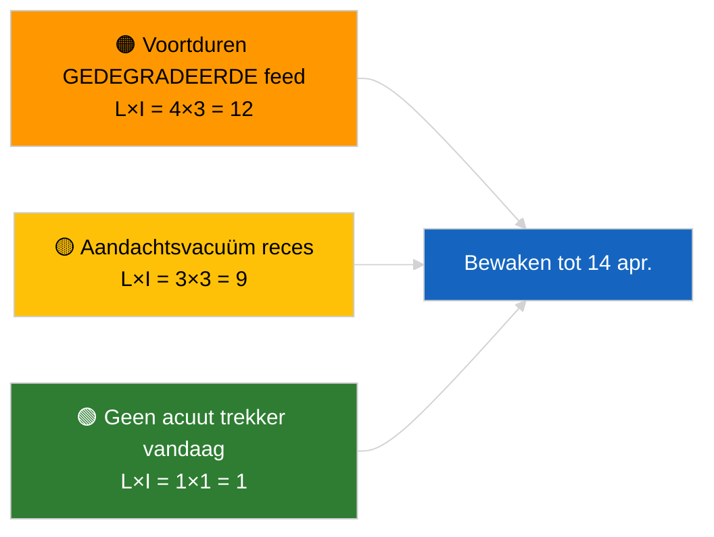

<!-- SPDX-FileCopyrightText: 2026 Hack23 AB -->
<!-- SPDX-License-Identifier: Apache-2.0 -->

# Uitvoerende samenvatting — Nieuws | 2026-04-05

**Classificatie:** OSINT | Openbaar parlementair register
**Betrouwbaarheid:** 🟢 Hoog (structurele beoordeling tijdens parlementair reces)
**Gegenereerd:** 2026-04-05T00:00:00Z (retrospectieve samenvatting)
**Artikeltype:** Nieuws
**Bron:** Open Data Portal Europees Parlement

---

## 🎯 BLUF

**Geen breaking news op 2026-04-05; het EP is in paasvakantie (dag 10 van 18, 27 maart → 13 april 2026).** Er zijn geen plenaire vergaderingen, commissievergaderingen of stemmen gepland. De informatiesignalen van de week (GEDEGRADEERDE feed-API-staat, PPE-structurele dominantie van 38 %, anti-corruptie-hervormingscluster) zijn overgenomen van de inhoudelijke sessies van 2026-04-03 / 04-04. **🟢 HOGE betrouwbaarheid** dat de inactiviteit kalendergestuurd is.

---

## 🧭 3 Decisions This Brief Supports

| # | Beslissing | Beslisser | Deadline | Bewijs |
|:-:|-----------|----------|:--------:|--------|
| 1 | **Redactie:** dagelijkse nieuwsberichten OVERSLAAN | Redacteur | +12u | Recessdag 10 van 18 |
| 2 | **Monitoring:** eindpunt-gezondheidscontrole handhaven | Datapijplijn | dagelijks | GEDEGRADEERDE staat |
| 3 | **Vooruitkijken:** Commissie dinsdag 7 april, einde reces 13 april | Analyseleider | 2026-04-07 | Q1→Q2-overgang |

---

## 📰 60-Second Read

- 🔴 **Geen nieuwe EP-activiteit** op 2026-04-05 (zondag, paasvakantie dag 10/18). (🟢 Hoog)
- 🟠 **GEDEGRADEERDE feed-API-staat duurt voort** vanaf de sonde van 2026-04-03. (🟢 Hoog)
- 🟢 **Overgedragen observatielijst:** anti-corruptie (TA-10-2026-0094), Braun-immuniteit (TA-10-2026-0088), Amerikaanse tarieven (TA-10-2026-0096), HDV-emissies (TA-10-2026-0084). (🟢 Hoog)
- 🟡 **Coalitiearithmetiek stabiel**: PPE 38 % / Grote Coalitie 60 %. (🟢 Hoog)
- 🔵 **Economische context:** VS-EU-handelskoers ongewijzigd. (🟢 Hoog)
- 🟣 **Kruisreferentie:** zusterloops `breaking-2` en `breaking-3` leveren sessieoverstijgende mid-recess-synthese. (🟢 Hoog)
- 🩷 **Storingsvector:** geen acuut. (🟢 Hoog)
- ⚪ **Overdracht:** 8 dagen tot einde reces.

---

## 🗂️ Top Documents / Procedures Table

| Rang | EP-referentie | Titel (kort) | Belang | Betrouwbaarheid |
|:----:|--------------|-------------|:------:|:---------------:|
| 1 | — | Geen nieuwe procedures of aangenomen teksten op 2026-04-05 | 0,0 | 🟢 HOOG |
| 2 | TA-10-2026-0094 | Anti-corruptie (overdracht) | 9,0 | 🟢 HOOG |
| 3 | TA-10-2026-0088 | Braun-immuniteit (overdracht) | 7,0 | 🟢 HOOG |

---

## ⚠️ Risk & Threat Snapshot

| Risico | W | I | Score | Trekker | Bron | Admiraliteit |
|--------|:-:|:-:|:-----:|---------|------|:------------:|
| Voortduren GEDEGRADEERDE feed | 4 | 3 | 12 | Na 14 april | 2026-04-03/breaking-2 | A1 |
| Aandachtsvacuüm reces | 3 | 3 | 9 | VS- of PL-verrassing | EP-kalender | A2 |

---

## 🔮 Top Forward Trigger

**Commissie dinsdag 7 april 2026** (eerste zitting na Pasen) en **einde reces 13 april**.

---

## 🛡️ Source Quality Assessment

- **Primaire bronnen:** EP-kalender; Q1-overdrachtcluster.
- **Betrouwbaarheid:** 🟢 HOOG op kalenderfactor.

---

## 📎 Links

| Link | Pad |
|------|-----|
| Artikel | `./article.md` |
| Zusterloops | `analysis/daily/2026-04-05/breaking-2/`, `breaking-3/` |
| Manifest | `./manifest.json` |

---

**Documentbeheer**
- **Sjabloon:** `/analysis/templates/executive-brief.md`
- **Artefactpad:** `analysis/daily/2026-04-05/breaking/executive-brief.md`
- **Classificatie:** Openbaar
- **Retrospectieve generatie:** Back-fill sessie.
