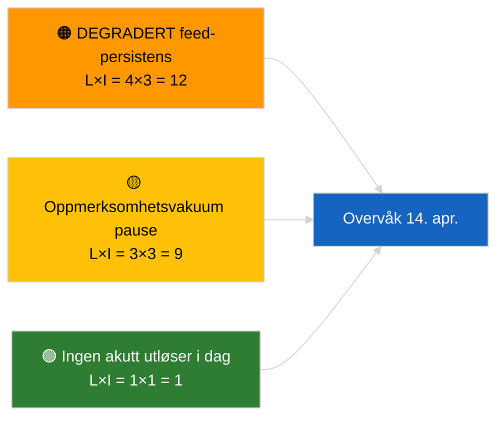

<!-- SPDX-FileCopyrightText: 2026 Hack23 AB -->
<!-- SPDX-License-Identifier: Apache-2.0 -->

# Sammendrag — Siste nytt | 2026-04-05

**Klassifisering:** OSINT | Offentlig parlamentarisk registrering
**Troverdighet:** 🟢 Høy (strukturell vurdering i parlamentarisk pause)
**Generert:** 2026-04-05T00:00:00Z (retrospektivt sammendrag)
**Artikkeltype:** Siste nytt
**Kilde:** Europaparlamentets åpne dataportal

---

## 🎯 BLUF

**Ingen siste-nytt-utvikling den 2026-04-05; EP er i påskepause (Dag 10 av 18, 27. mars → 13. april 2026).** Ingen plenumsmøter, komitémøter eller stemmer planlagt. Ukens etterretningssignaler (DEGRADERT feed-API-tilstand, PPE:s strukturelle dominans på 38 %, antikorrupsjonsreformklynge) er arvet fra de innholdsmessige kjøringene 2026-04-03 / 04-04. **🟢 HØY troverdighet** for at inaktiviteten er kalenderbestemt.

---

## 🧭 3 Decisions This Brief Supports

| # | Beslutning | Beslutningstaker | Frist | Bevis |
|:-:|-----------|----------------|:-----:|-------|
| 1 | **Redaksjon:** HOPP OVER daglig siste nytt | Redaktør | +12t | Pausedag 10 av 18 |
| 2 | **Overvåking:** oppretthold endepunkt-helseovervåking | Datapipeline | daglig | DEGRADERT tilstand |
| 3 | **Fremtidsutsikt:** Kommisjonen tirsdag 7. april, pauseslutt 13. april | Analyseansvarlig | 2026-04-07 | Q1→Q2-overgang |

---

## 📰 60-Second Read

- 🔴 **Ingen ny EP-aktivitet** den 2026-04-05 (søndag, påskepause Dag 10/18). (🟢 Høy)
- 🟠 **DEGRADERT feed-API-tilstand fortsetter** fra sonden 2026-04-03. (🟢 Høy)
- 🟢 **Overført overvåkingsliste:** antikorrupsjon (TA-10-2026-0094), Braun-immunitet (TA-10-2026-0088), amerikanske tollsatser (TA-10-2026-0096), HDV-utslipp (TA-10-2026-0084). (🟢 Høy)
- 🟡 **Koalisjonsaritmetikk stabil**: PPE 38 % / Storkoalisjon 60 %. (🟢 Høy)
- 🔵 **Økonomisk kontekst:** USA-EU handelstrajektorie uendret. (🟢 Høy)
- 🟣 **Krysskjøring:** søsterkjøringene `breaking-2` og `breaking-3` leverer sesjonsoverskridende midt-pause-syntese. (🟢 Høy)
- 🩷 **Forstyrrelsesvektoren:** ingen akutt. (🟢 Høy)
- ⚪ **Overføring:** 8 dager til pauseslutt.

---

## 🗂️ Top Documents / Procedures Table

| Rang | EP-referanse | Tittel (kortform) | Betydning | Troverdighet |
|:----:|-------------|-----------------|:---------:|:------------:|
| 1 | — | Ingen nye prosedyrer eller vedtatte tekster den 2026-04-05 | 0,0 | 🟢 HØY |
| 2 | TA-10-2026-0094 | Antikorrupsjon (overføring) | 9,0 | 🟢 HØY |
| 3 | TA-10-2026-0088 | Braun-immunitet (overføring) | 7,0 | 🟢 HØY |

---

## ⚠️ Risk & Threat Snapshot

| Risiko | S | P | Poeng | Utløser | Kilde | Admiralitet |
|--------|:-:|:-:|:-----:|---------|-------|:-----------:|
| DEGRADERT feed-persistens | 4 | 3 | 12 | Etter 14. april | 2026-04-03/breaking-2 | A1 |
| Oppmerksomhetsvakuum pause | 3 | 3 | 9 | USA- eller PL-overraskelse | EP-kalender | A2 |

---

## 🔮 Top Forward Trigger

**Kommisjonen tirsdag 7. april 2026** (første post-påske kollegietabellering) og **pauseslutt 13. april**.

---

## 🛡️ Source Quality Assessment

- **Primærkilder:** EP-kalender; Q1-overførinsgklynge.
- **Troverdighet:** 🟢 HØY på kalenderfaktoren.

---

## 📎 Links

| Lenke | Sti |
|-------|-----|
| Artikkel | `./article.md` |
| Søsterkjøringer | `analysis/daily/2026-04-05/breaking-2/`, `breaking-3/` |
| Manifest | `./manifest.json` |

---

**Dokumentkontroll**
- **Mal:** `/analysis/templates/executive-brief.md`
- **Artefaktsti:** `analysis/daily/2026-04-05/breaking/executive-brief.md`
- **Klassifisering:** Offentlig
- **Retrospektiv generering:** Back-fill sesjon.
