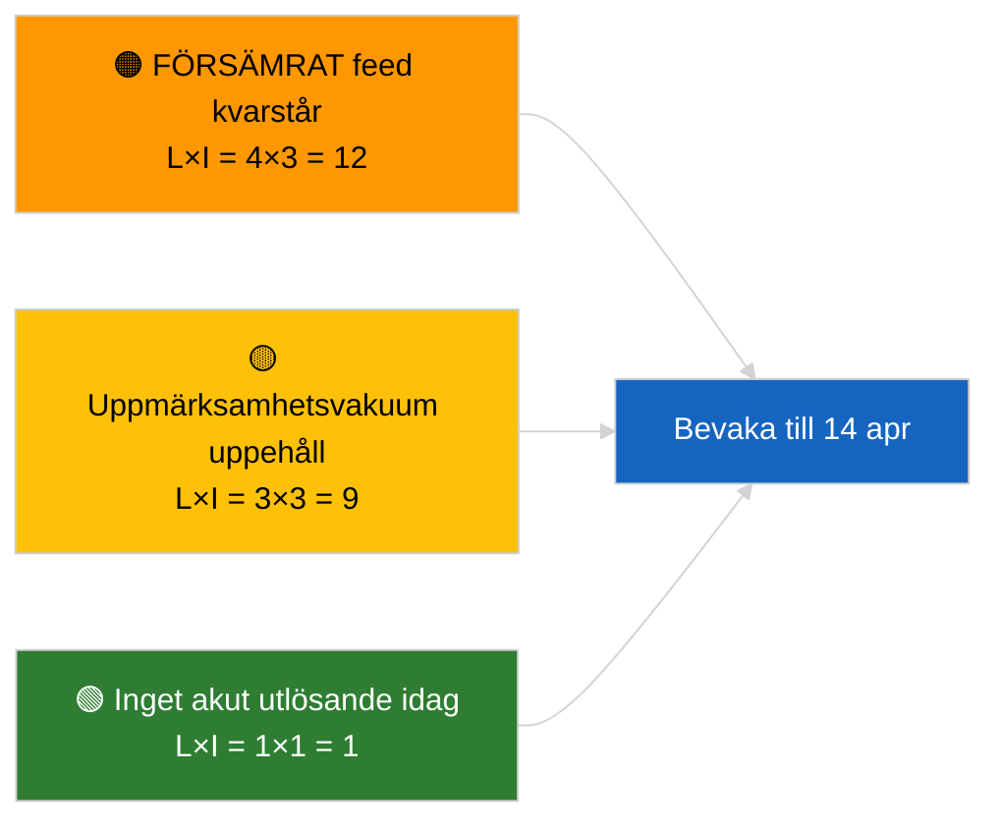

<!-- SPDX-FileCopyrightText: 2026 Hack23 AB -->
<!-- SPDX-License-Identifier: Apache-2.0 -->

# Sammanfattning — Senaste nytt | 2026-04-05

**Klassificering:** OSINT | Offentlig parlamentarisk handling
**Tillförlitlighet:** 🟢 Hög (strukturell bedömning under parlamentarisk uppehållsperiod)
**Genererad:** 2026-04-05T00:00:00Z (retrospektiv sammanfattning)
**Artikeltyp:** Senaste nytt
**Källa:** Europaparlamentets öppna dataportalen

---

## 🎯 BLUF

**Inga nyheter den 2026-04-05; EP befinner sig i påskuppehåll (dag 10 av 18, 27 mars → 13 april 2026).** Inga plenarsammanträden, utskottsmöten eller omröstningar planerade. Veckans informationssignaler (FÖRSÄMRAT feed-API-tillstånd, EPP:s strukturella dominans på 38 %, antikorruptionsreformkluster) är ärvda från de substantiella körningarna 2026-04-03 / 04-04. **🟢 HÖG tillförlitlighet** att inaktiviteten är kalenderstyrd.

---

## 🧭 3 Decisions This Brief Supports

| # | Beslut | Beslutsfattare | Tidsfrist | Bevis |
|:-:|-------|---------------|:---------:|-------|
| 1 | **Redaktion:** HOPPA ÖVER daglig senaste nytt | Redaktör | +12h | Uppehållsdag 10 av 18 |
| 2 | **Övervakning:** bibehåll hälsoövervakning av slutpunkter | Datapipeline | dagligen | FÖRSÄMRAT tillstånd |
| 3 | **Framsyn:** Kommissionen tisdag 7 april, uppehållsslut 13 april | Analysansvarig | 2026-04-07 | Q1→Q2-övergång |

---

## 📰 60-Second Read

- 🔴 **Ingen ny EP-aktivitet** den 2026-04-05 (söndag, påskuppehåll dag 10/18). (🟢 Hög)
- 🟠 **FÖRSÄMRAT feed-API-tillstånd fortsätter** sedan sonden 2026-04-03. (🟢 Hög)
- 🟢 **Överfört bevakningsläge:** antikorruption (TA-10-2026-0094), Braun-immunitet (TA-10-2026-0088), USA-tullar (TA-10-2026-0096), HDV-utsläpp (TA-10-2026-0084). (🟢 Hög)
- 🟡 **Koalitionsaritmik stabil**: EPP 38 % / Storkoalition 60 %. (🟢 Hög)
- 🔵 **Ekonomisk kontext:** USA-EU-handelsutvecklingen oförändrad. (🟢 Hög)
- 🟣 **Korsreferens:** systerkörningarna `breaking-2` och `breaking-3` tillhandahåller sessionsöverskridande mitt-uppehållssyntes. (🟢 Hög)
- 🩷 **Störningsvektor:** ingen akut. (🟢 Hög)
- ⚪ **Överfört:** 8 dagar kvar till uppehållets slut.

---

## 🗂️ Top Documents / Procedures Table

| Rang | EP-referens | Titel (kortform) | Relevans | Tillförlitlighet |
|:----:|------------|-----------------|:--------:|:----------------:|
| 1 | — | Inga nya förfaranden eller antagna texter den 2026-04-05 | 0,0 | 🟢 HÖG |
| 2 | TA-10-2026-0094 | Antikorruption (överfört) | 9,0 | 🟢 HÖG |
| 3 | TA-10-2026-0088 | Braun-immunitet (överfört) | 7,0 | 🟢 HÖG |

---

## ⚠️ Risk & Threat Snapshot

| Risk | S | P | Poäng | Utlösare | Källa | Amiralitet |
|------|:-:|:-:|:-----:|---------|-------|:----------:|
| FÖRSÄMRAT feed kvarstår | 4 | 3 | 12 | Efter 14 april | 2026-04-03/breaking-2 | A1 |
| Uppmärksamhetsvakuum uppehåll | 3 | 3 | 9 | USA- eller PL-överraskning | EP-kalender | A2 |

---

## 🔮 Top Forward Trigger

**Kommissionen tisdag 7 april 2026** (första kollegialinlämning efter påsk) och **uppehållsslut 13 april**.

---

## 🛡️ Source Quality Assessment

- **Primärkällor:** EP-kalender; Q1-överförtkluster.
- **Tillförlitlighet:** 🟢 HÖG på kalenderfaktorn.

---

## 📎 Links

| Länk | Sökväg |
|------|--------|
| Artikel | `./article.md` |
| Systerkörningar | `analysis/daily/2026-04-05/breaking-2/`, `breaking-3/` |
| Manifest | `./manifest.json` |

---

**Dokumentkontroll**
- **Mall:** `/analysis/templates/executive-brief.md`
- **Artefaktsökväg:** `analysis/daily/2026-04-05/breaking/executive-brief.md`
- **Klassificering:** Offentlig
- **Retrospektiv generering:** Backfill-session.
