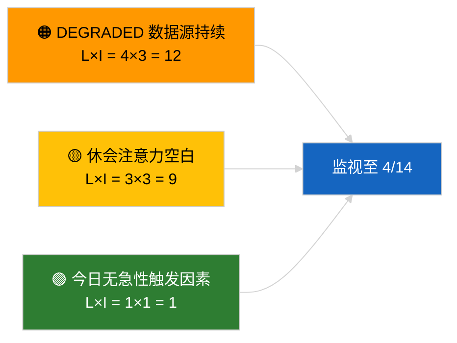

<!-- SPDX-FileCopyrightText: 2026 Hack23 AB -->
<!-- SPDX-License-Identifier: Apache-2.0 -->

# 执行摘要 — 突发新闻 | 2026-04-05

**分类：** OSINT | 公开议会记录
**置信度：** 🟢 高（议会休会期间的结构性评估）
**生成时间：** 2026-04-05T00:00:00Z（事后摘要）
**文章类型：** 突发新闻
**来源：** 欧洲议会开放数据门户

---

## 🎯 BLUF

**2026-04-05 无突发新闻动态；EP 处于复活节休会期（第 10 天，共 18 天，2026 年 3 月 27 日 → 4 月 13 日）。** 无全体会议、委员会会议或投票安排。本周情报信号（DEGRADED 数据源 API 状态、PPE 38% 结构性主导地位、反腐改革集群）继承自 2026-04-03 / 04-04 实质性运行。**🟢 高置信度**认为不活跃是日程安排所致。

---

## 🧭 3 Decisions This Brief Supports

| # | 决策 | 决策主体 | 截止日期 | 证据 |
|:-:|-----|---------|:-------:|------|
| 1 | **编辑：** 跳过日常突发新闻 | 总编辑 | +12 小时 | 休会第 10/18 天 |
| 2 | **监控：** 维持端点健康监视 | 数据管道 | 每日 | DEGRADED 状态 |
| 3 | **前瞻监视：** 委员会 4 月 7 日（周二），休会结束 4 月 13 日 | 分析负责人 | 2026-04-07 | Q1→Q2 过渡 |

---

## 📰 60-Second Read

- 🔴 **2026-04-05 无新 EP 活动**（星期日，复活节休会第 10/18 天）。（🟢 高）
- 🟠 **DEGRADED 数据源 API 状态自 2026-04-03 探测以来持续**。（🟢 高）
- 🟢 **结转监视列表：** 反腐（TA-10-2026-0094）、Braun 豁免权（TA-10-2026-0088）、美国关税（TA-10-2026-0096）、HDV 排放（TA-10-2026-0084）。（🟢 高）
- 🟡 **联合算术稳定**：PPE 38% / 大联合 60%。（🟢 高）
- 🔵 **经济背景：** 美欧贸易轨迹无变化。（🟢 高）
- 🟣 **交叉参考：** 姐妹运行 `breaking-2` 和 `breaking-3` 提供跨会议休会中期综合分析。（🟢 高）
- 🩷 **干扰向量：** 无急性干扰。（🟢 高）
- ⚪ **结转：** 距休会结束 8 天。

---

## 🗂️ Top Documents / Procedures Table

| 排名 | EP 参考编号 | 标题（简称） | 重要性 | 置信度 |
|:---:|-----------|-----------|:-----:|:------:|
| 1 | — | 2026-04-05 无新程序或通过文本 | 0.0 | 🟢 高 |
| 2 | TA-10-2026-0094 | 反腐（结转） | 9.0 | 🟢 高 |
| 3 | TA-10-2026-0088 | Braun 豁免权（结转） | 7.0 | 🟢 高 |

---

## ⚠️ Risk & Threat Snapshot

| 风险 | 可 | 影 | 评分 | 触发因素 | 来源 | 海军上将级别 |
|:---:|:-:|:-:|:---:|---------|------|:----------:|
| DEGRADED 数据源持续 | 4 | 3 | 12 | 4 月 14 日之后 | 2026-04-03/breaking-2 | A1 |
| 休会注意力空白 | 3 | 3 | 9 | 美国或 PL 意外 | EP 日历 | A2 |

---

## 🔮 Top Forward Trigger

**委员会 2026 年 4 月 7 日（周二）**（复活节后首次议程提交）及**休会结束 4 月 13 日**。

---

## 🛡️ Source Quality Assessment

- **一手来源：** EP 日历；Q1 结转集群。
- **置信度：** 🟢 日程因素为高。

---

## 📎 Links

| 链接 | 路径 |
|------|------|
| 文章 | `./article.md` |
| 姐妹运行 | `analysis/daily/2026-04-05/breaking-2/`, `breaking-3/` |
| 清单 | `./manifest.json` |

---

**文档管理**
- **模板：** `/analysis/templates/executive-brief.md`
- **成果物路径：** `analysis/daily/2026-04-05/breaking/executive-brief.md`
- **分类：** 公开
- **事后生成：** 回填会话。
