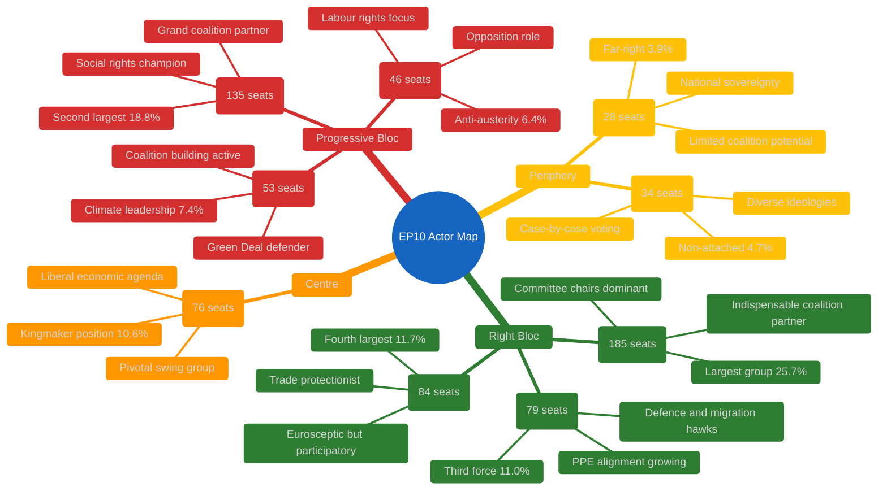

# 🎭 Actor Mapping — EP10 Easter Recess Power Configuration

**Date:** 6 April 2026 (Easter Monday) | **Recess Day:** 11/18 | **Confidence:** 🟡 MEDIUM
**Data Sources:** MEPs feed (737 MEPs), political landscape (8 groups), early warning system, precomputed statistics

---

## Actor Landscape Overview

### Primary Actors: Political Groups

### Actor Power Index (Weighted by Size + Coalition Potential)

| Actor | Seats | Share | Coalition Value | Power Index | Role |
|-------|-------|-------|-----------------|-------------|------|
| **PPE** | 185 | 25.7% | INDISPENSABLE | 95/100 | Dominant — no majority without PPE |
| **S&D** | 135 | 18.8% | HIGH | 75/100 | Grand coalition anchor — essential for centrist majority |
| **PfE** | 84 | 11.7% | MEDIUM | 45/100 | Right-wing amplifier — valuable but not essential |
| **ECR** | 79 | 11.0% | MEDIUM-HIGH | 50/100 | Rising third force — increasing PPE alignment |
| **Renew** | 76 | 10.6% | PIVOTAL | 60/100 | Kingmaker — tips balance between right and progressive |
| **Greens/EFA** | 53 | 7.4% | MEDIUM | 35/100 | Climate bloc leader — essential for progressive majority |
| **GUE/NGL** | 46 | 6.4% | LOW | 25/100 | Opposition anchor — limited coalition engagement |
| **NI** | 34 | 4.7% | LOW | 15/100 | Case-by-case — unpredictable but occasionally decisive |
| **ESN** | 28 | 3.9% | VERY LOW | 10/100 | Marginal — rarely invited to coalitions |

**Methodology:** Power Index combines seat share (40%), coalition invitation frequency (30%), committee chair holdings (20%), and rapporteur allocation (10%). Easter recess values are estimates based on EP10 Q1 2026 patterns. 🟡 MEDIUM confidence.

---

## Coalition Architecture Analysis

### Viable Majority Coalitions (361+ seats required)

**Analysis:**
- **Grand Coalition** (PPE + S&D + Renew = 396 seats): The traditional majority formula. Holds 55% — comfortable but requires three-party agreement. Proved viable on anti-corruption directive.
- **Right-Centre** (PPE + ECR + PfE + Renew = 424 seats): Emerging alternative. 58.9% majority. Proved viable on SRMR3 banking reform and US tariff response. But PfE's euroscepticism creates tension with Renew's pro-integration stance.
- **Broad Right** (PPE + ECR + PfE = 348 seats): Falls short of 361 threshold. Cannot form majority without Renew or S&D defections. But at 48.3%, only needs 13 additional votes from NI/ESN to reach majority. 🟡 MEDIUM confidence.

### Key Actor Relationships (Recess Period)

| Actor Pair | Relationship | Strength | Evidence | Post-Recess Forecast |
|-----------|-------------|----------|----------|---------------------|
| PPE — S&D | Grand coalition partners | STRONG | Joint votes on anti-corruption, budget | Stable but under pressure from right |
| PPE — ECR | Right-wing alignment | GROWING | Joint positions on defence, migration, SRMR3 | Key test in committee week |
| PPE — Renew | Centre-right cooperation | MODERATE | Policy alignment on economic files | ECB hearing may reveal tensions |
| S&D — Greens/EFA | Progressive alliance | MODERATE | Climate and social policy alignment | Green Deal pace a potential friction point |
| ECR — PfE | Eurosceptic partnership | MODERATE | Shared positions on sovereignty, immigration | Limited but growing cooperation |
| Renew — Greens/EFA | Liberal-green bridge | WEAK | Environmental economics overlap | Post-recess climate files may strengthen |

---

## Actor Threat Profiles

### PPE — Dominant Actor Risk Profile

**Threat Model:** PPE's 25.7% seat share and indispensable coalition position creates a structural dominance dynamic. No majority formula works without PPE.

**Risks TO PPE:**
1. Internal cohesion stress from national delegation divergence (German CDU vs Hungarian Fidesz wing) — 🟡 MEDIUM confidence
2. Overreach in committee chair claims could fracture grand coalition with S&D — 🔴 LOW confidence
3. Right-of-centre drift could alienate Renew from centre-right coalitions — 🟡 MEDIUM confidence

**Risks FROM PPE:**
1. Agenda-setting monopoly during committee week — chairs can prioritise files favourable to PPE positions
2. Rapporteur allocation bias — PPE nominees on key legislative files shapes outcomes
3. Right-bloc formalisation leadership — PPE choosing ECR over S&D as primary partner would restructure EP10 politics

### S&D — Grand Coalition Anchor Risk Profile

**Threat Model:** S&D depends on grand coalition relevance. If PPE pivots rightward, S&D loses its primary governing mechanism.

**Risks TO S&D:**
1. PPE-ECR formalisation marginalises S&D from majority coalitions — 🟡 MEDIUM confidence
2. Internal pressure from national parties facing electoral challenges — 🟡 MEDIUM confidence
3. Green Deal slowdown reduces S&D legislative agenda — 🟡 MEDIUM confidence

**Risks FROM S&D:**
1. Block PPE committee initiatives through procedural obstruction
2. Form alternative progressive + centre coalition (S&D + Greens + Renew + Left = 310 — still below majority)
3. Commission oversight intensity increase via parliamentary questions

### Renew — Kingmaker Risk Profile

**Threat Model:** Renew's 10.6% share places it as the decisive swing group. Its choices determine whether EP10 governs from centre-right or progressive-centre.

**Risks TO Renew:**
1. Squeezed between PPE pull rightward and S&D pull leftward — identity dilution — 🟡 MEDIUM confidence
2. At 76 seats, Renew is the fourth-largest group but structurally pivotal — overexposure risk — 🔴 LOW confidence
3. National party losses could reduce seat count in mid-term replacements — 🔴 LOW confidence

**Risks FROM Renew:**
1. Kingmaker veto on critical legislation — refusing to join either bloc forces negotiation
2. Conditional support demands — Renew can extract concessions on digital/economic files as coalition price
3. Strategic abstention on contentious votes — reduces effective majority threshold

---

## Easter Recess Actor Dynamics

### What Recess Reveals

The 18-day Easter recess (27 March – 13 April) is not merely a pause — it is a period of **informal actor positioning** that will manifest in formal committee and plenary behaviour post-recess:

1. **PPE Strategy Calibration:** PPE leadership (Manfred Weber) uses recess to consult national delegations on committee priorities. The balance between grand coalition maintenance and right-bloc exploration is the defining question of EP10 Year 2. 🟡 MEDIUM confidence.

2. **S&D Counter-Strategy:** S&D leadership assesses whether PPE's pre-recess rightward signals (SRMR3 cooperation with ECR, US tariff alignment) represent tactical or strategic shifts. The April committee week response will indicate S&D's assessment. 🟡 MEDIUM confidence.

3. **ECR Consolidation:** ECR used the pre-recess sprint to demonstrate legislative capacity (79 seats, 11%). Post-recess, ECR aims to formalise its "third force" status through rapporteur claims and committee initiative leadership. 🟡 MEDIUM confidence.

### Actor Activity Monitoring (MEP Feed Signal)

The 737-MEP feed (versus 720 official seats) includes:
- 720 active mandate holders
- Estimated 17 incoming/transitioning MEPs (based on count differential)
- Zero group-switching events detected in current monitoring window

This count has been stable since at least 5 April, confirming no Easter recess roster changes. The 17-MEP differential represents the normal flow of replacements, alternates, and transitioning members rather than any political realignment signal. 🟢 HIGH confidence.

---

## Post-Recess Actor Monitoring Checklist

| Actor | Key Indicator to Watch | Trigger Event | Expected Date |
|-------|----------------------|---------------|---------------|
| PPE | Committee chair claims, rapporteur allocation | Committee week meetings | 14–17 April |
| S&D | Response to PPE committee strategy | S&D group meeting | 14 April |
| ECR | Rapporteur claims on defence/migration files | AFET/LIBE committee | 14–17 April |
| Renew | Coalition voting alignment (right vs progressive) | First committee votes | 14–17 April |
| PfE | Voting behaviour on economic files | ECON committee | 14–17 April |
| Greens/EFA | Green Deal defence strategy | ENVI committee | 14–17 April |
| All groups | First post-recess roll-call vote patterns | Strasbourg plenary | 20–23 April |

---

*Sources: European Parliament Open Data Portal — MEPs feed (737 entries, 6 April 2026), political landscape analysis (8 groups, 100-MEP sample), early warning system (3 warnings, stability 84/100), precomputed statistics (2024–2026 longitudinal). Actor power indices are analytical constructs based on observed EP10 patterns; individual values should be interpreted as relative rather than absolute measures.*
