# 🤝 Coalition Dynamics Analysis — Easter Monday Structural Assessment

**Date:** 6 April 2026 (Easter Monday) | **Recess Day:** 11/18 | **Confidence:** 🟡 MEDIUM
**Data Sources:** Political landscape, early warning, precomputed statistics, MEPs feed (737), cross-run memory

---

## Coalition Architecture Dashboard

| Coalition Formula | Seats | Share | Viable? | Pre-Recess Usage | Post-Recess Likelihood |
|-------------------|-------|-------|---------|-------------------|----------------------|
| PPE + S&D + Renew | 396 | 55.0% | ✅ Yes | Anti-corruption, budget | 55% (LIKELY) |
| PPE + ECR + PfE + Renew | 424 | 58.9% | ✅ Yes | SRMR3, tariffs | 30% (POSSIBLE) |
| PPE + ECR + PfE | 348 | 48.3% | ❌ No | Partial on migration | 10% (UNLIKELY) |
| S&D + Greens + Renew + Left | 310 | 43.1% | ❌ No | Never achieved | 5% (RARE) |
| PPE + S&D | 320 | 44.4% | ❌ No | Pre-2019 formula | 0% (IMPOSSIBLE) |

**Structural Insight:** Since 2019 (EP9), no two-party coalition can achieve majority. EP10 requires minimum 3 groups for any legislative majority. Top-2 concentration (PPE + S&D) at 44.4% — crossed below 50% threshold in 2019, representing a structural regime change. 🟢 HIGH confidence — verified against precomputed statistics HHI trend 2004–2026.

---

## Coalition Dynamics Indicators

### Herfindahl-Hirschman Index (HHI) Trajectory

| Year | HHI | Effective Parties | Two-Party Majority? | Assessment |
|------|-----|-------------------|---------------------|------------|
| 2004 | 0.2348 | 4.12 | ✅ Yes (63.9%) | Near-duopoly |
| 2009 | 0.2111 | 4.60 | ✅ Yes (61.0%) | Moderate concentration |
| 2014 | 0.1870 | 5.30 | ✅ Yes (54.1%) | Declining concentration |
| 2019 | 0.1612 | 6.20 | ❌ No (45.9%) | **Regime change** |
| 2024 | 0.1536 | 6.51 | ❌ No (45.0%) | Multi-polar |
| 2025 | 0.1517 | 6.59 | ❌ No (44.5%) | Multi-polar stable |
| 2026 | 0.1517 | 6.59 | ❌ No (44.5%) | Multi-polar stable |

```mermaid
%%{init: {"theme":"dark","themeVariables":{"primaryColor":"#1565C0","primaryTextColor":"#ffffff","primaryBorderColor":"#0A3F7F","lineColor":"#90CAF9","secondaryColor":"#2E7D32","secondaryTextColor":"#ffffff","secondaryBorderColor":"#0F3F00","tertiaryColor":"#FF9800","tertiaryTextColor":"#000000","tertiaryBorderColor":"#7F4F00","mainBkg":"#1565C0","secondBkg":"#2E7D32","tertiaryBkg":"#FF9800","noteBkgColor":"#FFC107","noteTextColor":"#000000","noteBorderColor":"#7F6000","errorBkgColor":"#D32F2F","errorTextColor":"#ffffff","fontFamily":"Inter, Helvetica, Arial, sans-serif","pie1":"#1565C0","pie2":"#2E7D32","pie3":"#FF9800","pie4":"#D32F2F","pie5":"#FFC107","pie6":"#7B1FA2","pie7":"#9E9E9E","pie8":"#0288D1","pie9":"#388E3C","pie10":"#F57C00","pie11":"#C62828","pie12":"#FBC02D","pieTitleTextSize":"18px","pieSectionTextSize":"14px","pieLegendTextSize":"13px","pieStrokeColor":"#1e1e1e","pieOuterStrokeColor":"#1e1e1e","git0":"#1565C0","git1":"#2E7D32","git2":"#FF9800","git3":"#D32F2F","gitBranchLabel0":"#ffffff","gitBranchLabel1":"#ffffff","gitBranchLabel2":"#000000","gitBranchLabel3":"#ffffff","cScale0":"#1565C0","cScale1":"#2E7D32","cScale2":"#FF9800","cScale3":"#D32F2F","cScale4":"#FFC107","cScale5":"#7B1FA2","cScale6":"#9E9E9E","cScale7":"#0288D1","xyChart":{"backgroundColor":"#1e1e1e","plotColorPalette":"#1565C0,#2E7D32,#FF9800,#D32F2F,#FFC107,#7B1FA2,#9E9E9E"}}}}%%
graph LR
    A["2004\nHHI: 0.235\nDuopoly"] --> B["2009\n0.211\nModerate"]
    B --> C["2014\n0.187\nDeclining"]
    C --> D["2019\n0.161\nRegime Change"]
    D --> E["2024\n0.154\nMulti-polar"]
    E --> F["2026\n0.152\nStable MP"]

    style A fill:#28a745,color:#fff
    style B fill:#28a745,color:#fff
    style C fill:#ffc107,color:#000
    style D fill:#dc3545,color:#fff
    style E fill:#dc3545,color:#fff
    style F fill:#dc3545,color:#fff
```

**Key Finding:** The HHI has stabilised at 0.1517 between 2025 and 2026, suggesting the deconcentration trend that began in 2004 has reached an equilibrium. The 8-group system with 6.59 effective parties appears to be the structural configuration of EP10. 🟢 HIGH confidence.

### Minimum Winning Coalition Size

The minimum winning coalition (361+ seats) requires 3 groups. The most efficient minimum winning coalition is:
- **PPE (185) + S&D (135) + Renew (76) = 396 seats** — surplus of 35 over 361 threshold

Alternative minimum winning coalitions:
- PPE (185) + S&D (135) + ECR (79) = 399 seats — right-of-centre flavour
- PPE (185) + S&D (135) + PfE (84) = 404 seats — broad coalition
- PPE (185) + ECR (79) + PfE (84) + Renew (76) = 424 seats — without S&D

**Important:** Every viable majority includes PPE. There is no majority formula that excludes PPE, making it the structurally indispensable actor. This asymmetry gives PPE agenda-setting power disproportionate to its 25.7% seat share. 🟢 HIGH confidence.

---

## Pre-Recess Coalition Behaviour (Evidence Base)

### SRMR3 Banking Reform (2023/0111 COD) — Adopted 26 March

**Coalition Used:** Right-centre alignment (PPE + ECR + PfE, with Renew support)
**Significance:** S&D was NOT the primary coalition partner for this major economic file. This represents a shift from EP9 practice where S&D was included in all major economic legislation.
**Implication:** PPE demonstrated it can build legislative majorities without S&D on economic/financial files. 🟡 MEDIUM confidence — based on propositions analysis cross-reference.

### Anti-Corruption Directive (2023/0135 COD) — Adopted 26 March

**Coalition Used:** Grand coalition (PPE + S&D + Renew, with Greens support)
**Significance:** S&D led this file, demonstrating the grand coalition remains functional on rule-of-law/governance issues.
**Implication:** The dual-track coalition pattern (right-of-centre for economic files, grand coalition for governance files) is the defining feature of EP10. 🟡 MEDIUM confidence.

### US Tariff Response (2025/0261) — Adopted 26 March

**Coalition Used:** Broad cross-party (near-unanimous trade defence)
**Significance:** External trade threats generate the broadest coalitions. Even PfE and ESN supported EU trade countermeasures.
**Implication:** Geopolitical pressure creates coalition convergence that overrides normal left-right dynamics. 🟢 HIGH confidence.

---

## Coalition Stress Indicators

### Grand Coalition Stress Points

| Indicator | Value | Threshold | Status | Trend |
|-----------|-------|-----------|--------|-------|
| PPE-S&D seat ratio | 1.37:1 | >1.5 = asymmetric | BELOW | Stable |
| Joint votes (2026) | ~60% of files | <50% = fracture signal | ABOVE | Declining ↘ |
| Renew co-alignment | Required for majority | Loss = coalition collapse | MAINTAINED | Stable |
| ECR alternative availability | Growing | High = S&D dispensable | INCREASING | ↑ |

**Assessment:** The grand coalition is not fractured but is under structural stress. PPE's ability to form right-of-centre majorities on economic files (SRMR3) reduces S&D's bargaining leverage. The key question post-recess is whether PPE maintains the dual-track approach or consolidates rightward. 🟡 MEDIUM confidence.

### Right-Bloc Cohesion Indicators

| Factor | PPE-ECR | PPE-PfE | ECR-PfE | Assessment |
|--------|---------|---------|---------|------------|
| Defence policy | HIGH | MEDIUM | MEDIUM | Convergent |
| Economic regulation | MEDIUM | LOW | LOW | Divergent on scope |
| Migration | HIGH | HIGH | HIGH | Strong convergence |
| EU integration | MEDIUM | LOW | LOW | Structural tension |
| Trade policy | MEDIUM | MEDIUM | MEDIUM | Selectively aligned |

**Assessment:** Right-bloc cohesion is strongest on migration and defence, weakest on EU integration depth. PfE's euroscepticism creates a structural limit on how far right-bloc cooperation can extend into institutional questions. 🟡 MEDIUM confidence.

---

## Coalition Scenarios Post-Recess (14–23 April)

### Scenario A: Dual-Track Continuation (55%)
PPE maintains both grand coalition (for governance/social files) and right-of-centre (for economic/security files) tracks. S&D accepts junior partner role on economic files in exchange for agenda influence on social/governance files. Renew maintains kingmaker position.

**Trigger Indicators:** PPE inviting S&D to co-rapporteur positions on social files while excluding S&D from ECON committee priorities.

### Scenario B: Right-Bloc Consolidation (30%)
PPE increases ECR-PfE cooperation across multiple policy areas. Grand coalition used only for budget and constitutional matters. S&D moves toward constructive opposition.

**Trigger Indicators:** PPE-ECR joint committee chair claims, PfE included in rapporteur allocations, S&D publicly criticising PPE drift.

### Scenario C: Grand Coalition Renewal (15%)
External shock (economic crisis, geopolitical escalation) forces PPE-S&D-Renew to reaffirm centrist cooperation. Right-bloc cooperation limited to defence files only.

**Trigger Indicators:** ECB rate decision triggers economic concern, US tariff escalation deepens, Commission crisis communication.

---

## Longitudinal Coalition Pattern (Cross-Run Intelligence)

Based on 17+ monitoring runs since 28 March 2026 (Easter recess start):

| Metric | Day 2 (28 Mar) | Day 7 (2 Apr) | Day 11 (6 Apr) | Delta |
|--------|----------------|---------------|-----------------|-------|
| Grand coalition viability | 55.0% | 55.0% | 55.0% | 0% |
| PPE dominance index | 95/100 | 95/100 | 95/100 | 0 |
| Right-bloc seat share | 52.3% | 52.3% | 52.3% | 0% |
| Fragmentation (HHI) | 0.1517 | 0.1517 | 0.1517 | 0 |
| MEP feed stability | 737 | 737 | 737 | 0 |
| Group switching events | 0 | 0 | 0 | 0 |

**Assessment:** Complete structural stasis throughout Easter recess. Zero movement on any coalition indicator. This confirms that recess produces a frozen political landscape — all dynamics are deferred to the April resumption. The first post-recess committee votes (14–17 April) will be the critical data points for updating these coalition assessments. 🟢 HIGH confidence.

---

*Sources: European Parliament Open Data Portal — precomputed statistics (HHI 2004–2026), political landscape (8 groups, 100-MEP sample extrapolated), early warning (stability 84/100), MEPs feed (737 entries). Coalition formulae verified against 720-seat total. Pre-recess coalition behaviour cross-referenced with propositions analysis (6 April 2026, 05:47 UTC). Longitudinal tracking based on article-log.json (17+ entries since 28 March).*
