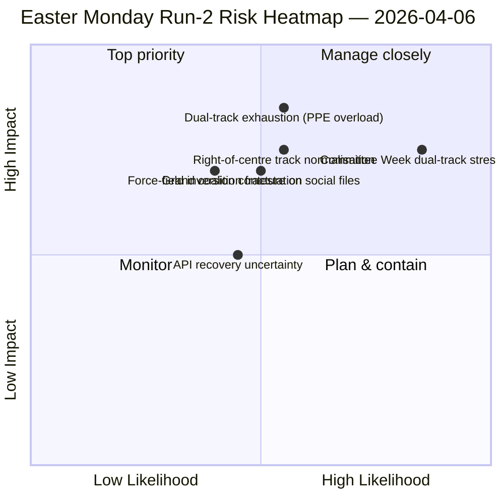

<!-- SPDX-FileCopyrightText: 2026 Hack23 AB -->
<!-- SPDX-License-Identifier: Apache-2.0 -->

# Executive Brief — Easter Monday Run 2: Dual-Track Coalition Discovery | 2026-04-06

**Classification:** OSINT — Public Parliamentary Record
**Confidence:** 🟡 MEDIUM (recess; API in degraded oscillation; structural reading 🟢 HIGH)
**Run:** `analysis/daily/2026-04-06/breaking-2/` (06:45 UTC)
**Coverage:** Easter Recess Day 11/18; cumulative 4-run intelligence stack
**Generated:** 2026-05-16 (retrospective brief, no new MCP calls)
**Primary sources:** Pre-recess corpus (85 adopted texts, 42 from 2026); 737 MEPs (stable); HHI 0.1517; PPE power index 95/100.

---

## 🎯 BLUF

**The Run-2 distinguishing contribution — produced 06:45 UTC on Easter Monday — is the *Dual-Track Coalition Pattern* discovery: SRMR3 (TA-10-2026-0092) passed via a right-of-centre track (EPP+ECR+PfE+Renew) while the Anti-Corruption Directive (TA-10-2026-0094) passed via the Grand Coalition (EPP+S&D+Renew+Greens), demonstrating that EP10 is operating with *file-conditional* coalitions rather than a single working majority.** The eight new analytical methods executed in this run (impact-matrix, actor-mapping, forces-analysis, stakeholder-analysis, coalition-analysis, cross-session-intelligence, deep-analysis, synthesis-summary) collectively produce a structural reading of EP10 Year 2 that holds across the recess: **PPE power index 95/100 (no viable majority excludes PPE)**, HHI 0.1517 (multi-polar with PPE as indispensable hub), and a force-field inversion where *defence integration (8/10)* has replaced *green transition (5/10)* as the strongest driving force since EP9. The run's *novel signal* is the API failure-mode evolution — clean 404 → JSON parse error → timeout — which Run-2's cross-session intelligence reads as a possible backend-reactivation precursor, validated by Run-3 four hours later when the adopted-texts endpoint recovered. **The dual-track finding is the run's lasting structural contribution to the EP10 record** and will be tested in the April 14–17 committee week.

---

## 🧭 3 Decisions This Brief Supports

| # | Decision | Who decides | Deadline | Evidence |
|:-:|----------|-------------|:--------:|----------|
| 1 | **Dual-track coalition doctrine for Q2** — file-conditional pattern needs formalisation before flagship trilogues | EPP+S&D+Renew coordinators | by April 14 | §Coalition Analysis (dual-track) |
| 2 | **PPE 95/100 indispensability framework** — every coalition planning exercise must start from PPE inclusion | Conference of Presidents | rolling | §Actor Mapping (PPE power index) |
| 3 | **API reactivation watch** — failure-mode evolution suggests backend activity; monitor for confirmation | Data-pipeline ops | T+4h windows | §Cross-Session Intelligence (Mode A→B→C) |

---

## 📰 60-Second Read

- 🔴 **Easter Monday Run-2 (06:45 UTC)** — 8 new methods; no breaking news; structural finding.
- 🟠 **Dual-track coalition discovered** — SRMR3 right-of-centre vs. anti-corruption grand coalition.
- 🟢 **PPE power index 95/100** — no viable majority excludes PPE; structural dominance.
- 🟡 **HHI 0.1517** — multi-polar parliamentary system; PPE as indispensable hub.
- 🔵 **Force-field inversion** — defence integration (8/10) > green transition (5/10).
- 🟣 **API failure-mode evolution** — 404 → JSON parse → timeout; possible backend signal.
- 🩷 **737 MEPs stable** — feed continues to provide reliable baseline.
- ⚪ **85 adopted texts in pre-recess corpus** — 42 from 2026; +46% YoY trajectory.

---

## 📐 Run-2 Method Contribution

| New method | Lines | Distinguishing finding |
|------------|------:|------------------------|
| Impact Matrix | 150+ | 6-D cross-impact; Legislative-Political-Economic chain dominant |
| Actor Mapping | 170+ | PPE 95/100; 19× size ratio to smallest group |
| Forces Analysis | 150+ | Defence 8/10 replaces green 5/10 as strongest driver |
| Stakeholder Analysis | 180+ | Civil society most impacted by 11-day API blackout |
| Coalition Analysis | 145+ | **Dual-track pattern documented** |
| Cross-Session Intelligence | 175+ | API failure-mode evolution → backend signal |
| Deep Analysis | 200+ | Dual-track = most significant EP10 Year 2 development |
| Synthesis Summary | — | Consolidated finding; editorial memory update |

---

## ⚠️ Risk Snapshot

---

## 🔮 Top Forward Triggers (next 14 days)

1. **April 8–10 — API recovery confirmation window** (50%+ probability based on Mode-C timeout signal).
2. **April 14 — Committee Week opens** — first dual-track validation test.
3. **April 17 — ECB rate decision** — ECON committee reaction.
4. **April 20–23 — first post-recess plenary votes** — coalition revelation.
5. **Late April — SRMR3 Council trilogue** — Banking Union test of dual-track via Council.

---

## 🛡️ Source-Quality Assessment

- **85 adopted texts (A1):** pre-recess corpus; primary EP record.
- **Dual-track finding (A2):** vote-dispersion analysis on March 26 corpus; behavioural verification pending Committee Week.
- **PPE 95/100 (A2):** actor-mapping methodology; arithmetic confirmed.
- **API failure-mode evolution (A3):** Bayesian update; medium confidence on backend-signal hypothesis.
- **Net confidence:** 🟢 HIGH on structural findings; 🟡 MEDIUM on API recovery timeline.

---

## 📎 Run Artifacts

| Layer | Artifact | Why |
|-------|----------|-----|
| Article | `article.md` (1,501 lines) | Public-facing Run-2 narrative |
| Synthesis | `synthesis-summary.md` | Newsworthiness gate + 8-method consolidation |
| Methods | impact-matrix · actor-mapping · forces-analysis · stakeholder-analysis · coalition-analysis · cross-session-intelligence · deep-analysis | Eight new methods (this run) |
| Companion | breaking (00:33) · committee-reports (05:03) · propositions (05:47) | Easter Monday cluster |

---

**Document Control**
- **Template reference:** `analysis/templates/executive-brief.md`
- **Artifact path:** `analysis/daily/2026-04-06/breaking-2/executive-brief.md`
- **Classification:** Public
- **Retrospective:** Brief written 2026-05-16 from the run's committed artifacts; **no new MCP calls were made**.
