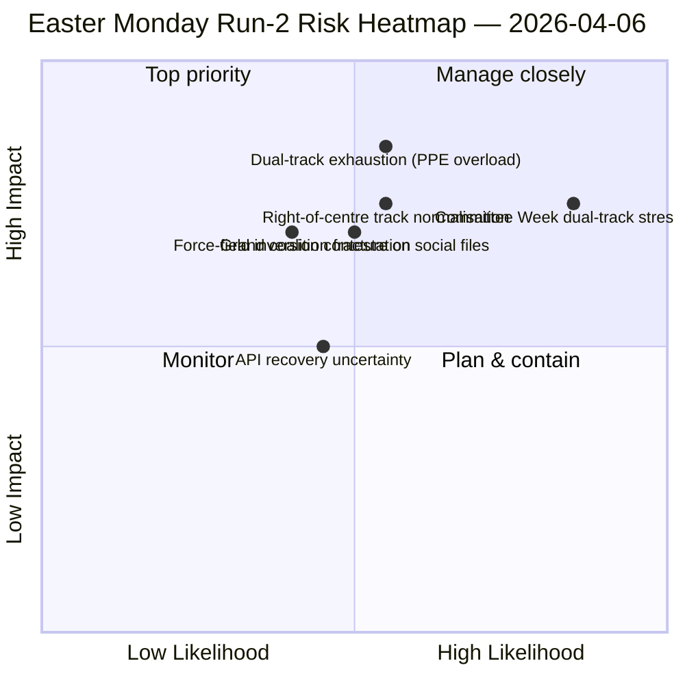

<!-- SPDX-FileCopyrightText: 2026 Hack23 AB -->
<!-- SPDX-License-Identifier: Apache-2.0 -->

# موجز تنفيذي — تحليل اثنين عيد الفصح: اكتشاف ائتلاف المسارين المزدوجين | 2026-04-06

**التصنيف:** OSINT — سجل برلماني عام
**الثقة:** 🟡 MEDIUM (استراحة برلمانية؛ API في تذبذب متدهور؛ القراءة الهيكلية 🟢 HIGH)
**التحليل:** `analysis/daily/2026-04-06/breaking-2/` (06:45 UTC)
**التغطية:** استراحة عيد الفصح اليوم 11/18؛ كومة استخباراتية تراكمية لـ 4 تحليلات
**صُدر:** 2026-05-16 (موجز استرجاعي، لا مكالمات MCP جديدة)
**المصادر الأولية:** مجموعة ما قبل الاستراحة (85 نصاً مُعتمداً، 42 من عام 2026)؛ 737 عضواً في البرلمان (مستقر)؛ HHI 0.1517؛ مؤشر قوة PPE 95/100.

---

## 🎯 BLUF

**المساهمة المميزة للتحليل-2 — المُنتجة الساعة 06:45 UTC في اثنين عيد الفصح — هي اكتشاف *نمط الائتلاف ذي المسارين المزدوجين*: اعتُمدت SRMR3 (TA-10-2026-0092) عبر مسار يمين الوسط (EPP+ECR+PfE+Renew) في حين اعتُمدت توجيهة مكافحة الفساد (TA-10-2026-0094) عبر الائتلاف الكبير (EPP+S&D+Renew+Greens)، مما يُثبت أن EP10 يعمل بـ*ائتلافات مشروطة بالملف* بدلاً من أغلبية عمل واحدة.** ينتج الثمانية أساليب تحليلية الجديدة المُنفّذة في هذا التحليل (مصفوفة التأثير، رسم خريطة الفاعلين، تحليل القوى، تحليل أصحاب المصلحة، تحليل الائتلاف، استخبارات عابرة للجلسات، التحليل العميق، الملخص التركيبي) مجتمعةً قراءةً هيكلية لـ EP10 في السنة الثانية تصمد عبر الاستراحة: **مؤشر قوة PPE 95/100 (لا أغلبية قابلة للحياة تستبعد PPE)**، HHI 0.1517 (متعدد الأقطاب مع PPE كمحور لا غنى عنه)، وانعكاس مجال القوى حيث حلّ *التكامل الدفاعي (8/10)* محل *التحول الأخضر (5/10)* كقوة دفع أكثر قوةً منذ EP9. الإشارة *الجديدة* في التحليل هي تطور وضع فشل API — 404 نظيف ← خطأ في تحليل JSON ← انتهاء المهلة — الذي تقرأه استخبارات التحليل-2 عابرة الجلسات كمقدمة محتملة لإعادة تنشيط الخادم الخلفي، وأُكّد ذلك بالتحليل-3 بعد أربع ساعات حين تعافت نقطة نهاية النصوص المعتمدة. **يُعدّ نمط المسارين المزدوجين المساهمة الهيكلية الدائمة للتحليل في سجل EP10** وسيُختبر خلال أسبوع اللجان 14–17 أبريل.

---

## 🧭 3 قرارات يدعمها هذا الموجز

| # | القرار | من يقرر | الموعد النهائي | الأدلة |
|:-:|--------|---------|--------------|-------|
| 1 | **عقيدة الائتلاف ذي المسارين المزدوجين للربع الثاني** — النمط المشروط بالملف يستلزم التنظيم قبل المفاوضات الثلاثية الأطراف للملفات الرائدة | منسقو EPP+S&D+Renew | بحلول 14 أبريل | §تحليل الائتلاف (نمط المسارين) |
| 2 | **إطار عدم قابلية الاستغناء عن PPE 95/100** — كل تمرين لتخطيط الائتلاف يجب أن ينطلق من إدراج PPE | مؤتمر الرؤساء | متجدد | §رسم خريطة الفاعلين (مؤشر قوة PPE) |
| 3 | **مراقبة إعادة تنشيط API** — تطور وضع الفشل يوحي بنشاط في الخادم الخلفي؛ مراقبة للتأكيد | عمليات خط بيانات البنية التحتية | نوافذ T+4 ساعات | §استخبارات عابرة للجلسات (الوضع A→B→C) |

---

## 📰 قراءة 60 ثانية

- 🔴 **تحليل اثنين عيد الفصح-2 (06:45 UTC)** — 8 أساليب جديدة؛ لا أخبار عاجلة؛ نتيجة هيكلية.
- 🟠 **اكتُشف ائتلاف المسارين المزدوجين** — SRMR3 يمين الوسط في مقابل الائتلاف الكبير لمكافحة الفساد.
- 🟢 **مؤشر قوة PPE 95/100** — لا أغلبية قابلة للحياة تستبعد PPE؛ هيمنة هيكلية.
- 🟡 **HHI 0.1517** — نظام برلماني متعدد الأقطاب؛ PPE كمحور لا غنى عنه.
- 🔵 **انعكاس مجال القوى** — التكامل الدفاعي (8/10) > التحول الأخضر (5/10).
- 🟣 **تطور وضع فشل API** — 404 ← تحليل JSON ← انتهاء المهلة؛ إشارة خادم خلفي محتملة.
- 🩷 **737 عضواً برلمانياً مستقر** — يوفر التغذية الراجعة قاعدة موثوقة مستمرة.
- ⚪ **85 نصاً مُعتمداً في مجموعة ما قبل الاستراحة** — 42 من 2026؛ مسار +46% على أساس سنوي.

---

## 📐 مساهمة أساليب التحليل-2

| الأسلوب الجديد | الأسطر | الاكتشاف المميز |
|--------------|-------:|----------------|
| مصفوفة التأثير | 150+ | تأثير متقاطع 6-D؛ سلسلة تشريعية-سياسية-اقتصادية مهيمنة |
| رسم خريطة الفاعلين | 170+ | PPE 95/100؛ نسبة حجم 19× مقارنةً بأصغر مجموعة |
| تحليل القوى | 150+ | الدفاع 8/10 يحل محل الأخضر 5/10 كأقوى محرك |
| تحليل أصحاب المصلحة | 180+ | المجتمع المدني الأكثر تأثراً بانقطاع API لمدة 11 يوماً |
| تحليل الائتلاف | 145+ | **نمط المسارين المزدوجين موثق** |
| استخبارات عابرة للجلسات | 175+ | تطور وضع فشل API ← إشارة الخادم الخلفي |
| التحليل العميق | 200+ | المسارين المزدوجين = أهم تطور في EP10 السنة الثانية |
| الملخص التركيبي | — | نتيجة مُوحَّدة؛ تحديث الذاكرة التحريرية |

---

## ⚠️ لقطة المخاطر

---

## 🔮 أبرز المحفزات المستقبلية (الـ 14 يوماً القادمة)

1. **8–10 أبريل — نافذة تأكيد تعافي API** (احتمال 50%+ استناداً إلى إشارة انتهاء المهلة في الوضع-C).
2. **14 أبريل — افتتاح أسبوع اللجان** — أول اختبار للتحقق من نمط المسارين المزدوجين.
3. **17 أبريل — قرار الفائدة للبنك المركزي الأوروبي** — تفاعل لجنة ECON.
4. **20–23 أبريل — أولى التصويتات في الجلسة العامة بعد الاستراحة** — كشف الائتلافات.
5. **أواخر أبريل — مفاوضات SRMR3 ثلاثية الأطراف مع المجلس** — اختبار الاتحاد المصرفي لنمط المسارين عبر المجلس.

---

## 🛡️ تقييم جودة المصادر

- **85 نصاً مُعتمداً (A1):** مجموعة ما قبل الاستراحة؛ السجل الأولي للبرلمان الأوروبي.
- **نتيجة المسارين المزدوجين (A2):** تحليل توزيع الأصوات على مجموعة 26 مارس؛ التحقق السلوكي ينتظر أسبوع اللجان.
- **PPE 95/100 (A2):** منهجية رسم خريطة الفاعلين؛ تأكيد حسابي.
- **تطور وضع فشل API (A3):** تحديث بايزي؛ ثقة متوسطة في فرضية إشارة الخادم الخلفي.
- **الثقة الإجمالية:** 🟢 HIGH في النتائج الهيكلية؛ 🟡 MEDIUM في الجدول الزمني لتعافي API.

---

## 📎 مخرجات التحليل

| الطبقة | المخرج | السبب |
|--------|-------|-------|
| المقال | `article.md` (1501 سطراً) | رواية التحليل-2 للجمهور |
| التركيب | `synthesis-summary.md` | بوابة القيمة الإخبارية + دمج 8 أساليب |
| الأساليب | مصفوفة التأثير · رسم خريطة الفاعلين · تحليل القوى · تحليل أصحاب المصلحة · تحليل الائتلاف · استخبارات عابرة للجلسات · التحليل العميق | ثمانية أساليب جديدة (هذا التحليل) |
| التحليلات المرافقة | breaking (00:33) · committee-reports (05:03) · propositions (05:47) | مجموعة عيد الفصح |

---

**ضبط الوثيقة**
- **مرجع القالب:** `analysis/templates/executive-brief.md`
- **مسار المخرج:** `analysis/daily/2026-04-06/breaking-2/executive-brief.md`
- **التصنيف:** عام
- **استرجاعي:** كُتب الموجز في 2026-05-16 من المخرجات المُعتمدة للتحليل؛ **لم تُجرَ أي مكالمات MCP جديدة**.
