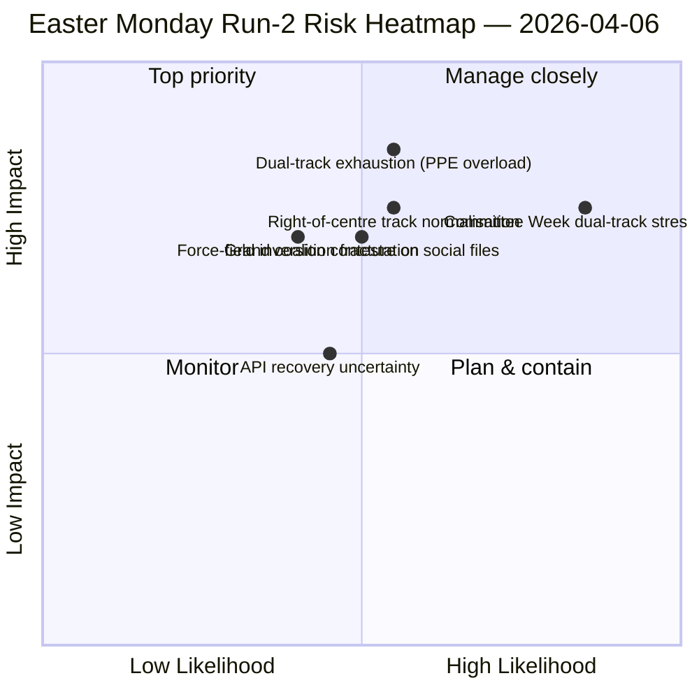

<!-- SPDX-FileCopyrightText: 2026 Hack23 AB -->
<!-- SPDX-License-Identifier: Apache-2.0 -->

# Ledelsesresumé — Påskemandag Kørsel 2: Dobbeltspor-Koalitionsdynamik | 2026-04-06

**Klassificering:** OSINT — Offentlig parlamentarisk kilde
**Troværdighed:** 🟡 MEDIUM (reces; API i degraderet oscillation; strukturel læsning 🟢 HIGH)
**Kørsel:** `analysis/daily/2026-04-06/breaking-2/` (06:45 UTC)
**Dækning:** Påskeferie Dag 11/18; kumulativ 4-kørselsintelligens-stak
**Genereret:** 2026-05-16 (retrospektivt resumé, ingen nye MCP-kald)
**Primære kilder:** Corpus før recessen (85 vedtagne tekster, 42 fra 2026); 737 MEP'er (stabilt); HHI 0.1517; PPE-magtindeks 95/100.

---

## 🎯 BLUF

**Kørsel 2's særskilte bidrag — produceret 06:45 UTC på påskemandag — er opdagelsen af *Dobbeltspor-Koalitionsmønsteret*: SRMR3 (TA-10-2026-0092) blev vedtaget via et højre-af-centrum-spor (EPP+ECR+PfE+Renew), mens Antikorruptionsdirektivet (TA-10-2026-0094) blev vedtaget via Storkoalitionen (EPP+S&D+Renew+Greens), hvilket viser, at EP10 opererer med *filbetingede* koalitioner snarere end et enkelt arbejdsflertallet.** De otte nye analytiske metoder udført i denne kørsel (effektmatrix, aktørkortlægning, styrkeanalyse, interessentanalyse, koalitionsanalyse, tværsessions-efterretning, dybdeanalyse, synteseoversigt) producerer tilsammen en strukturel læsning af EP10 År 2, der holder på tværs af recessen: **PPE-magtindeks 95/100 (intet levedygtigt flertal udelukker PPE)**, HHI 0.1517 (multipolær med PPE som uundværlig hub), og en kraftfeltsinversion, hvor *forsvarsintegration (8/10)* har erstattet *grøn omstilling (5/10)* som den stærkeste drivkraft siden EP9. Kørslen's *nye signal* er API-fejltilstandsudviklingen — ren 404 → JSON-fortolkningsfejl → timeout — som Kørsel 2's tværsessions-efterretning læser som en mulig backend-reaktiveringsforløber, valideret af Kørsel 3 fire timer senere, da endepunktet for vedtagne tekster kom sig. **Dobbelsporsmønsteret er kørslen's varige strukturelle bidrag til EP10-protokollen** og vil blive testet i komitéugen 14–17 april.

---

## 🧭 3 Beslutninger dette resumé understøtter

| # | Beslutning | Hvem beslutter | Deadline | Evidens |
|:-:|-----------|----------------|:--------:|---------|
| 1 | **Dobbeltspor-koalitionsdoktrin for Q2** — filbetinget mønster kræver formalisering inden flagskibsforhandlinger | EPP+S&D+Renew-koordinatorer | inden 14. april | §Koalitionsanalyse (dobbelsporsmønster) |
| 2 | **PPE 95/100 uundværlighedsramme** — enhver koalitionsplanlægningsøvelse skal starte fra PPE-inkludering | Præsidentkonferencen | løbende | §Aktørkortlægning (PPE-magtindeks) |
| 3 | **API-reaktiveringsvagt** — fejltilstandsudvikling antyder backend-aktivitet; overvåg for bekræftelse | Datapipeline-drift | T+4h-vinduer | §Tværsessions-efterretning (Tilstand A→B→C) |

---

## 📰 60-sekunders læsning

- 🔴 **Påskemandag Kørsel 2 (06:45 UTC)** — 8 nye metoder; ingen nyheder; strukturelt fund.
- 🟠 **Dobbeltspor-koalition opdaget** — SRMR3 højre-af-centrum kontra antikorruptionsdirektivets storkoalition.
- 🟢 **PPE-magtindeks 95/100** — intet levedygtigt flertal udelukker PPE; strukturel dominans.
- 🟡 **HHI 0.1517** — multipolært parlamentarisk system; PPE som uundværlig hub.
- 🔵 **Kraftfeltsinversion** — forsvarsintegration (8/10) > grøn omstilling (5/10).
- 🟣 **API-fejltilstandsudvikling** — 404 → JSON-fortolkning → timeout; muligt backend-signal.
- 🩷 **737 MEP'er stabilt** — feed giver fortsat pålidelig baseline.
- ⚪ **85 vedtagne tekster i corpus inden recessen** — 42 fra 2026; +46% YoY-bane.

---

## 📐 Kørsel 2-metodebidrag

| Ny metode | Linjer | Fremhævet fund |
|-----------|-------:|----------------|
| Effektmatrix | 150+ | 6-D krydseffekt; Lovgivnings-Politisk-Økonomisk kæde dominerende |
| Aktørkortlægning | 170+ | PPE 95/100; 19× størrelsesforhold til mindste gruppe |
| Styrkeanalyse | 150+ | Forsvar 8/10 erstatter grønt 5/10 som stærkeste drivkraft |
| Interessentanalyse | 180+ | Civilsamfund mest påvirket af 11-dages API-afbrydelse |
| Koalitionsanalyse | 145+ | **Dobbelsporsmønster dokumenteret** |
| Tværsessions-efterretning | 175+ | API-fejltilstandsudvikling → backend-signal |
| Dybdeanalyse | 200+ | Dobbelsporsmønster = mest betydningsfulde EP10 År 2-begivenhed |
| Synteseoversigt | — | Konsolideret fund; redaktionel hukommelsesopdatering |

---

## ⚠️ Risikooversigt

---

## 🔮 Top fremadrettede udløsere (næste 14 dage)

1. **8–10. april — API-genopretningsbekræftelsesvindue** (50%+ sandsynlighed baseret på Tilstand-C timeout-signal).
2. **14. april — Komitéuge åbner** — første dobbelsportvalideringstest.
3. **17. april — ECB-rentebeslutning** — ECON-komitéens reaktion.
4. **20–23. april — Første plenarstemninger efter recessen** — koalitionsåbenbaring.
5. **Sen april — SRMR3 Råds-trilogi** — Bankunionstesten af dobbelsporsmønsteret via Rådet.

---

## 🛡️ Kildekvalitetsvurdering

- **85 vedtagne tekster (A1):** corpus inden recessen; primær EP-protokol.
- **Dobbelsporsfund (A2):** afstemningsspredninsanalyse på 26. marts-corpus; adfærdsverifikation afventer komitéugen.
- **PPE 95/100 (A2):** aktørkortlægningsmetodik; aritmetik bekræftet.
- **API-fejltilstandsudvikling (A3):** Bayesiansk opdatering; middel tillid til backend-signalhypotesen.
- **Nettotillid:** 🟢 HIGH på strukturelle fund; 🟡 MEDIUM på API-genopretningssktidslinjen.

---

## 📎 Kørslen's artefakter

| Lag | Artefakt | Hvorfor |
|-----|----------|---------|
| Artikel | `article.md` (1.501 linjer) | Offentlig Kørsel 2-fortælling |
| Syntese | `synthesis-summary.md` | Nyhedsværdi-gate + 8-metodekonsolidering |
| Metoder | effektmatrix · aktørkortlægning · styrkeanalyse · interessentanalyse · koalitionsanalyse · tværsessions-efterretning · dybdeanalyse | Otte nye metoder (denne kørsel) |
| Ledsager | breaking (00:33) · committee-reports (05:03) · propositions (05:47) | Påskemandagsklynge |

---

**Dokumentkontrol**
- **Skabelonreference:** `analysis/templates/executive-brief.md`
- **Artefaktsti:** `analysis/daily/2026-04-06/breaking-2/executive-brief.md`
- **Klassificering:** Offentlig
- **Retrospektiv:** Resumé skrevet 2026-05-16 fra kørslen's forpligtede artefakter; **ingen nye MCP-kald blev foretaget**.
