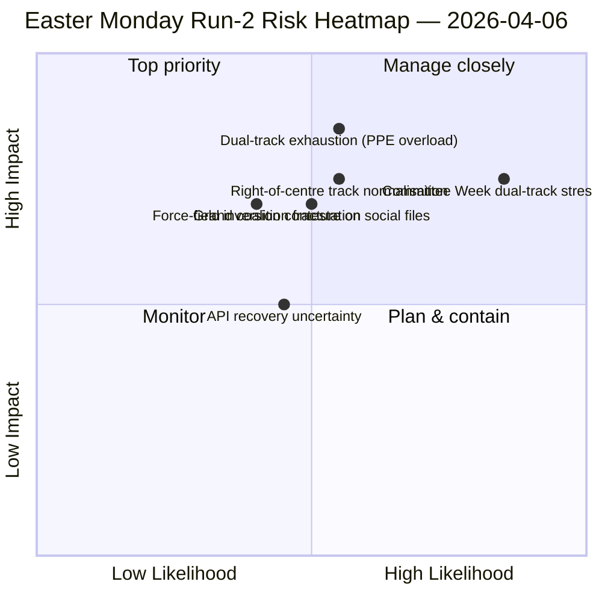

<!-- SPDX-FileCopyrightText: 2026 Hack23 AB -->
<!-- SPDX-License-Identifier: Apache-2.0 -->

# Leitungsbrief — Ostermontag Analyse 2: Doppelspurkoalitionsentdeckung | 2026-04-06

**Klassifizierung:** OSINT — Öffentliche parlamentarische Quelle
**Vertrauen:** 🟡 MEDIUM (Sitzungspause; API in degradierter Oszillation; strukturelle Lektüre 🟢 HIGH)
**Analyse:** `analysis/daily/2026-04-06/breaking-2/` (06:45 UTC)
**Abdeckung:** Osterpause Tag 11/18; kumulativer 4-Analyse-Nachrichtendienstturm
**Erstellt:** 2026-05-16 (retrospektives Bericht, keine neuen MCP-Aufrufe)
**Primärquellen:** Corpus vor der Pause (85 verabschiedete Texte, 42 aus 2026); 737 Abgeordnete (stabil); HHI 0.1517; PPE-Machtindex 95/100.

---

## 🎯 BLUF

**Der besondere Beitrag von Analyse 2 — erstellt um 06:45 UTC am Ostermontag — ist die Entdeckung des *Doppelspurkoalitionsmusters*: SRMR3 (TA-10-2026-0092) wurde über einen rechts-der-Mitte-Kurs (EPP+ECR+PfE+Renew) verabschiedet, während die Antikorruptionsrichtlinie (TA-10-2026-0094) über die Große Koalition (EPP+S&D+Renew+Greens) verabschiedet wurde, was zeigt, dass EP10 mit *dateibedingten* Koalitionen operiert anstatt mit einer einzigen arbeitsfähigen Mehrheit.** Die acht neuen analytischen Methoden dieser Analyse (Wirkungsmatrix, Akteursmapping, Kräfteanalyse, Stakeholderanalyse, Koalitionsanalyse, Sitzungsübergreifende Nachrichtendienste, Tiefenanalyse, Synthesezusammenfassung) produzieren zusammen eine strukturelle Lesart von EP10 Jahr 2, die durch die Pause standhält: **PPE-Machtindex 95/100 (keine lebensfähige Mehrheit schließt PPE aus)**, HHI 0.1517 (multipolar mit PPE als unverzichtbarem Knotenpunkt) und eine Kraftfeldinversion, bei der *Verteidigungsintegration (8/10)* den *grünen Wandel (5/10)* als stärkste treibende Kraft seit EP9 abgelöst hat. Das *neue Signal* der Analyse ist die API-Fehlerzustandsentwicklung — saubere 404 → JSON-Analysefehler → Zeitüberschreitung — die der Sitzungsübergreifende Nachrichtendienst als mögliche Backend-Reaktivierungsvorstufe liest, bestätigt durch Analyse 3 vier Stunden später, als der Endpunkt für verabschiedete Texte sich erholte. **Das Doppelspurmuster ist der dauerhafte strukturelle Beitrag dieser Analyse zum EP10-Protokoll** und wird in der Ausschusswoche 14.–17. April getestet.

---

## 🧭 3 Entscheidungen, die dieser Bericht unterstützt

| # | Entscheidung | Wer entscheidet | Frist | Beweise |
|:-:|-------------|----------------|:-----:|---------|
| 1 | **Doppelspurkoalitionsdoktrin für Q2** — dateibedingtes Muster braucht Formalisierung vor Flaggschiff-Trilogien | EPP+S&D+Renew-Koordinatoren | bis 14. April | §Koalitionsanalyse (Doppelspurmuster) |
| 2 | **PPE 95/100 Unentbehrlichkeitsrahmen** — jede Koalitionsplanungsübung muss von PPE-Einbeziehung ausgehen | Konferenz der Präsidenten | fortlaufend | §Akteursmapping (PPE-Machtindex) |
| 3 | **API-Reaktivierungsüberwachung** — Fehlerzustandsentwicklung deutet auf Backend-Aktivität hin; auf Bestätigung überwachen | Datenpipeline-Betrieb | T+4h-Fenster | §Sitzungsübergreifende Nachrichtendienste (Modus A→B→C) |

---

## 📰 60-Sekunden-Lektüre

- 🔴 **Ostermontag Analyse-2 (06:45 UTC)** — 8 neue Methoden; keine Eilmeldungen; struktureller Befund.
- 🟠 **Doppelspurkoalition entdeckt** — SRMR3 rechts-der-Mitte versus Antikorruptionsrichtlinie Große Koalition.
- 🟢 **PPE-Machtindex 95/100** — keine lebensfähige Mehrheit schließt PPE aus; strukturelle Dominanz.
- 🟡 **HHI 0.1517** — multipolares Parlamentssystem; PPE als unverzichtbarer Knotenpunkt.
- 🔵 **Kraftfeldinversion** — Verteidigungsintegration (8/10) > grüner Wandel (5/10).
- 🟣 **API-Fehlerzustandsentwicklung** — 404 → JSON-Analyse → Zeitüberschreitung; mögliches Backend-Signal.
- 🩷 **737 Abgeordnete stabil** — Feed liefert weiterhin zuverlässige Basislinie.
- ⚪ **85 verabschiedete Texte im Vorpause-Corpus** — 42 aus 2026; +46% Jahresvergleichstrajektorie.

---

## 📐 Analyse-2 Methodenbeitrag

| Neue Methode | Zeilen | Hervorstechender Befund |
|-------------|-------:|------------------------|
| Wirkungsmatrix | 150+ | 6-D Kreuzwirkung; Legislativ-Politisch-Wirtschaftliche Kette dominierend |
| Akteursmapping | 170+ | PPE 95/100; 19× Größenverhältnis zur kleinsten Gruppe |
| Kräfteanalyse | 150+ | Verteidigung 8/10 ersetzt Grünes 5/10 als stärkste Triebkraft |
| Stakeholderanalyse | 180+ | Zivilgesellschaft am stärksten betroffen vom 11-tägigen API-Ausfall |
| Koalitionsanalyse | 145+ | **Doppelspurmuster dokumentiert** |
| Sitzungsübergr. Nachrichtendienste | 175+ | API-Fehlerzustandsentwicklung → Backend-Signal |
| Tiefenanalyse | 200+ | Doppelspurmuster = bedeutendste EP10 Jahr 2-Entwicklung |
| Synthesezusammenfassung | — | Konsolidierter Befund; redaktionelles Gedächtnisupdate |

---

## ⚠️ Risikoübersicht

---

## 🔮 Top-Vorwärtsauslöser (nächste 14 Tage)

1. **8.–10. April — API-Wiederherstellungsbestätigungsfenster** (50%+ Wahrscheinlichkeit basierend auf Modus-C Zeitüberschreitungssignal).
2. **14. April — Ausschusswoche öffnet** — erster Doppelspurvalidierungstest.
3. **17. April — EZB-Zinsentscheidung** — Reaktion des ECON-Ausschusses.
4. **20.–23. April — Erste Plenumsstimmen nach der Pause** — Koalitionsoffenbarung.
5. **Ende April — SRMR3 Rats-Trilog** — Bankenunionstest des Doppelspurmusters über den Rat.

---

## 🛡️ Quellenqualitätsbewertung

- **85 verabschiedete Texte (A1):** Vorpause-Corpus; primäres EP-Protokoll.
- **Doppelspurbefund (A2):** Abstimmungsstreuungsanalyse am 26.-März-Corpus; Verhaltensverifikation wartet auf Ausschusswoche.
- **PPE 95/100 (A2):** Akteursmapping-Methodik; Arithmetik bestätigt.
- **API-Fehlerzustandsentwicklung (A3):** Bayesianisches Update; mittleres Vertrauen in Backend-Signal-Hypothese.
- **Nettovertrauen:** 🟢 HIGH bei strukturellen Befunden; 🟡 MEDIUM bei API-Wiederherstellungszeitplan.

---

## 📎 Artefakte der Analyse

| Schicht | Artefakt | Warum |
|---------|----------|-------|
| Artikel | `article.md` (1.501 Zeilen) | Öffentliche Analyse-2-Erzählung |
| Synthese | `synthesis-summary.md` | Nachrichtenwert-Gate + 8-Methoden-Konsolidierung |
| Methoden | Wirkungsmatrix · Akteursmapping · Kräfteanalyse · Stakeholderanalyse · Koalitionsanalyse · Sitzungsübergr. Nachrichtendienste · Tiefenanalyse | Acht neue Methoden (diese Analyse) |
| Begleiter | breaking (00:33) · committee-reports (05:03) · propositions (05:47) | Ostermontags-Cluster |

---

**Dokumentenkontrolle**
- **Vorlagenreferenz:** `analysis/templates/executive-brief.md`
- **Artefaktpfad:** `analysis/daily/2026-04-06/breaking-2/executive-brief.md`
- **Klassifizierung:** Öffentlich
- **Retrospektiv:** Bericht am 2026-05-16 aus den bestätigten Artefakten der Analyse geschrieben; **es wurden keine neuen MCP-Aufrufe getätigt**.
