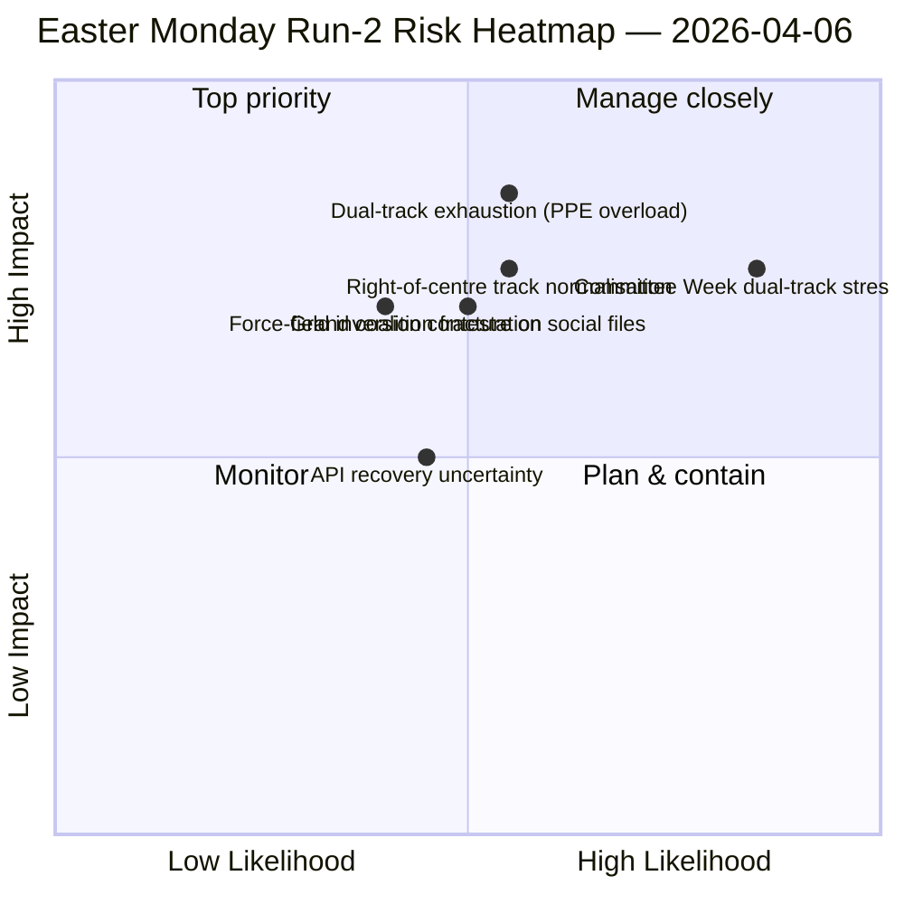

<!-- SPDX-FileCopyrightText: 2026 Hack23 AB -->
<!-- SPDX-License-Identifier: Apache-2.0 -->

# Nota Ejecutiva — Lunes de Pascua Análisis 2: Descubrimiento de Coalición de Doble Vía | 2026-04-06

**Clasificación:** OSINT — Registro parlamentario público
**Confianza:** 🟡 MEDIUM (receso parlamentario; API en oscilación degradada; lectura estructural 🟢 HIGH)
**Análisis:** `analysis/daily/2026-04-06/breaking-2/` (06:45 UTC)
**Cobertura:** Receso de Pascua Día 11/18; pila de inteligencia acumulativa 4 análisis
**Generada:** 2026-05-16 (nota retrospectiva, sin nuevas llamadas MCP)
**Fuentes primarias:** Corpus pre-receso (85 textos adoptados, 42 de 2026); 737 eurodiputados (estable); HHI 0.1517; índice de poder PPE 95/100.

---

## 🎯 BLUF

**La contribución distintiva del Análisis-2 — producida a las 06:45 UTC el Lunes de Pascua — es el descubrimiento del *Patrón de Coalición de Doble Vía*: SRMR3 (TA-10-2026-0092) fue aprobada a través de una vía de centro-derecha (EPP+ECR+PfE+Renew) mientras que la Directiva Anticorrupción (TA-10-2026-0094) fue aprobada a través de la Gran Coalición (EPP+S&D+Renew+Greens), demostrando que EP10 opera con coaliciones *condicionales al expediente* en lugar de una única mayoría funcional.** Los ocho nuevos métodos analíticos ejecutados en este análisis (matriz de impacto, mapeo de actores, análisis de fuerzas, análisis de partes interesadas, análisis de coalición, inteligencia entre sesiones, análisis profundo, síntesis-resumen) producen colectivamente una lectura estructural del EP10 Año 2 que se mantiene a lo largo del receso: **índice de poder PPE 95/100 (ninguna mayoría viable excluye al PPE)**, HHI 0.1517 (multipolar con el PPE como nodo indispensable) y una inversión del campo de fuerzas donde *la integración de defensa (8/10)* ha reemplazado a *la transición verde (5/10)* como la fuerza motriz más fuerte desde EP9. La *nueva señal* del análisis es la evolución del modo de fallo de la API — 404 limpio → error de análisis JSON → tiempo de espera agotado — que la inteligencia entre sesiones del Análisis-2 lee como un posible precursor de reactivación del backend, validado por el Análisis-3 cuatro horas después cuando el punto final de textos adoptados se recuperó. **El patrón de doble vía es la contribución estructural duradera del análisis al registro EP10** y será probado en la semana de comité del 14 al 17 de abril.

---

## 🧭 3 Decisiones que esta nota apoya

| # | Decisión | Quién decide | Plazo | Evidencia |
|:-:|---------|------------|:-----:|-----------|
| 1 | **Doctrina de coalición de doble vía para Q2** — el patrón condicional al expediente necesita formalización antes de los trílogos insignia | Coordinadores EPP+S&D+Renew | para el 14 de abril | §Análisis de coalición (patrón de doble vía) |
| 2 | **Marco de indispensabilidad PPE 95/100** — todo ejercicio de planificación de coalición debe partir de la inclusión del PPE | Conferencia de Presidentes | continuo | §Mapeo de actores (índice de poder PPE) |
| 3 | **Vigilancia de reactivación API** — la evolución del modo de fallo sugiere actividad backend; monitorear para confirmación | Operaciones del pipeline de datos | ventanas T+4h | §Inteligencia entre sesiones (Modo A→B→C) |

---

## 📰 Lectura en 60 segundos

- 🔴 **Lunes de Pascua Análisis-2 (06:45 UTC)** — 8 nuevos métodos; sin noticias de última hora; hallazgo estructural.
- 🟠 **Coalición de doble vía descubierta** — SRMR3 centro-derecha versus Gran Coalición de la directiva anticorrupción.
- 🟢 **Índice de poder PPE 95/100** — ninguna mayoría viable excluye al PPE; dominancia estructural.
- 🟡 **HHI 0.1517** — sistema parlamentario multipolar; PPE como nodo indispensable.
- 🔵 **Inversión del campo de fuerzas** — integración de defensa (8/10) > transición verde (5/10).
- 🟣 **Evolución del modo de fallo API** — 404 → análisis JSON → tiempo de espera; posible señal backend.
- 🩷 **737 eurodiputados estable** — el feed sigue proporcionando una línea de base fiable.
- ⚪ **85 textos adoptados en corpus pre-receso** — 42 de 2026; trayectoria +46% interanual.

---

## 📐 Contribución metodológica del Análisis-2

| Nuevo método | Líneas | Hallazgo destacado |
|-------------|-------:|-------------------|
| Matriz de impacto | 150+ | Impacto cruzado 6-D; cadena Legislativa-Política-Económica dominante |
| Mapeo de actores | 170+ | PPE 95/100; ratio de tamaño 19× respecto al grupo más pequeño |
| Análisis de fuerzas | 150+ | Defensa 8/10 reemplaza verde 5/10 como fuerza motriz más fuerte |
| Análisis de partes interesadas | 180+ | Sociedad civil más impactada por el corte API de 11 días |
| Análisis de coalición | 145+ | **Patrón de doble vía documentado** |
| Inteligencia entre sesiones | 175+ | Evolución del modo de fallo API → señal backend |
| Análisis profundo | 200+ | Doble vía = desarrollo EP10 Año 2 más significativo |
| Síntesis-resumen | — | Hallazgo consolidado; actualización de memoria editorial |

---

## ⚠️ Instantánea de riesgos

---

## 🔮 Principales desencadenantes futuros (próximos 14 días)

1. **8–10 de abril — Ventana de confirmación de recuperación API** (probabilidad 50%+ basada en la señal de tiempo de espera Modo-C).
2. **14 de abril — Apertura de la semana de comité** — primera prueba de validación de doble vía.
3. **17 de abril — Decisión sobre tipos del BCE** — reacción del comité ECON.
4. **20–23 de abril — Primeras votaciones en pleno tras el receso** — revelación de coalición.
5. **Finales de abril — Trílogo del Consejo sobre SRMR3** — prueba de la Unión Bancaria del patrón de doble vía a través del Consejo.

---

## 🛡️ Evaluación de calidad de fuentes

- **85 textos adoptados (A1):** corpus pre-receso; protocolo EP primario.
- **Hallazgo de doble vía (A2):** análisis de dispersión de votos sobre corpus del 26 de marzo; verificación conductual pendiente de la semana de comité.
- **PPE 95/100 (A2):** metodología de mapeo de actores; aritmética confirmada.
- **Evolución del modo de fallo API (A3):** actualización bayesiana; confianza media en la hipótesis de señal backend.
- **Confianza neta:** 🟢 HIGH en hallazgos estructurales; 🟡 MEDIUM en el calendario de recuperación API.

---

## 📎 Artefactos del análisis

| Capa | Artefacto | Por qué |
|------|----------|---------|
| Artículo | `article.md` (1.501 líneas) | Narrativa pública del Análisis-2 |
| Síntesis | `synthesis-summary.md` | Puerta de valor noticioso + consolidación 8 métodos |
| Métodos | matriz de impacto · mapeo de actores · análisis de fuerzas · análisis de partes interesadas · análisis de coalición · inteligencia entre sesiones · análisis profundo | Ocho nuevos métodos (este análisis) |
| Compañero | breaking (00:33) · committee-reports (05:03) · propositions (05:47) | Grupo de Pascua |

---

**Control del documento**
- **Referencia de plantilla:** `analysis/templates/executive-brief.md`
- **Ruta del artefacto:** `analysis/daily/2026-04-06/breaking-2/executive-brief.md`
- **Clasificación:** Público
- **Retrospectivo:** Nota escrita el 2026-05-16 a partir de los artefactos comprometidos del análisis; **no se realizaron nuevas llamadas MCP**.
