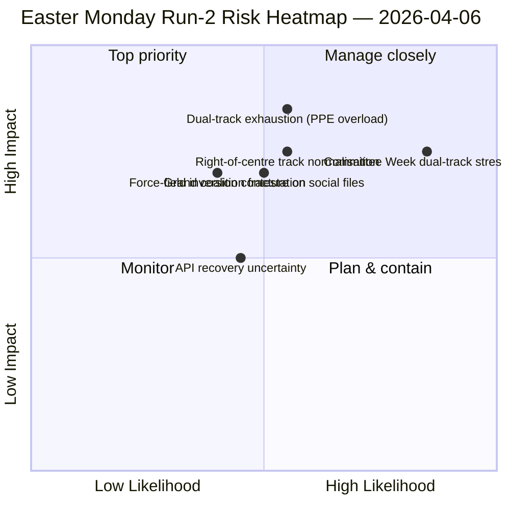

<!-- SPDX-FileCopyrightText: 2026 Hack23 AB -->
<!-- SPDX-License-Identifier: Apache-2.0 -->

# Johtokatsaus — Pääsiäismaanantai Ajo 2: Kaksoisratakoalitiohavainto | 2026-04-06

**Luokitus:** OSINT — Julkinen parlamentaarinen lähde
**Luotettavuus:** 🟡 MEDIUM (istuntotauko; API heikkenevässä oskillointitilassa; rakenteellinen analyysi 🟢 HIGH)
**Ajo:** `analysis/daily/2026-04-06/breaking-2/` (06:45 UTC)
**Kattavuus:** Pääsiäistauko Päivä 11/18; kumulatiivinen 4-ajon tiedustelupino
**Luotu:** 2026-05-16 (takautuva katsaus, ei uusia MCP-kutsuja)
**Ensisijaiset lähteet:** Tauon edeltävä aineisto (85 hyväksyttyä tekstiä, 42 vuodelta 2026); 737 MEP:tä (vakaa); HHI 0.1517; PPE-valtaindeksi 95/100.

---

## 🎯 BLUF

**Ajo-2:n erottava panos — tuotettu 06:45 UTC pääsiäismaanantaina — on *Kaksoisratakoalitiokuvion* löytäminen: SRMR3 (TA-10-2026-0092) hyväksyttiin oikeakeskusradan kautta (EPP+ECR+PfE+Renew) kun taas Korruptionvastainendirektiivi (TA-10-2026-0094) hyväksyttiin Suurkoalition kautta (EPP+S&D+Renew+Greens), mikä osoittaa, että EP10 toimii *tiedostoehtoisilla* koalitioilla yhden toimivan enemmistön sijaan.** Kahdeksan uutta analyyttistä menetelmää (vaikutusmatriisi, toimijatkartoitus, voimakenttäanalyysi, sidosryhmäanalyysi, koalitioanalyysi, ristisessiotiedustelu, syväanalyysi, synteesiyhteenveto) tuottavat yhdessä EP10 Vuosi 2:n rakenteellisen analyysin, joka pitää tauon ajan: **PPE-valtaindeksi 95/100 (mikään toimintakelpoinen enemmistö ei sulje pois PPE:tä)**, HHI 0.1517 (moninapainen PPE:n toimiessa välttämättömänä solmukohtana), sekä voimakenttäinversio, jossa *puolustusintegraatio (8/10)* on korvannut *vihreän siirtymän (5/10)* vahvimpana ajurina EP9:n jälkeen. Ajon *uusi signaali* on API-virhetilan kehitys — puhdas 404 → JSON-jäsentämisvirhe → aikakatkaisu — jonka Ajo-2:n ristisessiotiedustelu tulkitsee mahdolliseksi taustajärjestelmän uudelleenaktivoinnin ennakoijaksi, minkä Ajo-3 vahvisti neljä tuntia myöhemmin hyväksyttyjen tekstien päätepisteelle. **Kaksoisratakuvio on ajon pysyvä rakenteellinen panos EP10-tietueeseen** ja sitä testataan komiteaViikolla 14.–17. huhtikuuta.

---

## 🧭 3 Päätöstä, joita tämä katsaus tukee

| # | Päätös | Kuka päättää | Määräaika | Näyttö |
|:-:|--------|-------------|:--------:|--------|
| 1 | **Kaksoisratakoalitio-doktriini Q2:lle** — tiedostoehtoisenin kuvio tarvitsee virallistamisen ennen lippulaivaneuvotteluja | EPP+S&D+Renew-koordinaattorit | 14. huhtikuuta mennessä | §Koalitioanalyysi (kaksoisratakuvio) |
| 2 | **PPE 95/100 välttämättömyysviitekehys** — jokainen koalitiosuunnitteluharjoitus täytyy aloittaa PPE:n mukaan ottamisesta | Puheenjohtajiston konferenssi | jatkuva | §Toimijakartoitus (PPE-valtaindeksi) |
| 3 | **API-uudelleenaktivointivahti** — virhetilan kehitys viittaa taustajärjestelmän aktiviteettiin; seuraa vahvistusta varten | Datapipelinen operaatiot | T+4h-ikkunat | §Ristisessiotiedustelu (Tila A→B→C) |

---

## 📰 60 sekunnin katsaus

- 🔴 **Pääsiäismaanantai Ajo-2 (06:45 UTC)** — 8 uutta menetelmää; ei uutisia; rakenteellinen havainto.
- 🟠 **Kaksoisratakoalitio havaittu** — SRMR3 oikeakeskus versus korruptionvastaisen direktiivin suurkoalitio.
- 🟢 **PPE-valtaindeksi 95/100** — mikään toimintakelpoinen enemmistö ei sulje pois PPE:tä; rakenteellinen hallitsevuus.
- 🟡 **HHI 0.1517** — moninapainen parlamentaarinen järjestelmä; PPE välttämättömänä solmukohtana.
- 🔵 **Voimakenttäinversio** — puolustusintegraatio (8/10) > vihreä siirtymä (5/10).
- 🟣 **API-virhetilan kehitys** — 404 → JSON-jäsennys → aikakatkaisu; mahdollinen taustasignaali.
- 🩷 **737 MEP:tä vakaana** — syöte tarjoaa edelleen luotettavan lähtötason.
- ⚪ **85 hyväksyttyä tekstiä tauon edeltävässä aineistossa** — 42 vuodelta 2026; +46% vuosikasvuvauhti.

---

## 📐 Ajo-2 menetelmäpanos

| Uusi menetelmä | Rivit | Erottuva havainto |
|---------------|------:|-------------------|
| Vaikutusmatriisi | 150+ | 6-D ristivaikutus; Lainsäädäntö-Poliittinen-Taloudellinen ketju hallitseva |
| Toimijakartoitus | 170+ | PPE 95/100; 19× kokosuhde pienimpään ryhmään |
| Voimakenttäanalyysi | 150+ | Puolustus 8/10 korvaa vihreän 5/10 vahvimpana ajurina |
| Sidosryhmäanalyysi | 180+ | Kansalaisyhteiskunta eniten vaikuttunut 11 päivän API-katkoksesta |
| Koalitioanalyysi | 145+ | **Kaksoisratakuvio dokumentoitu** |
| Ristisessiotiedustelu | 175+ | API-virhetilan kehitys → taustasignaali |
| Syväanalyysi | 200+ | Kaksoisratakuvio = merkittävin EP10 Vuosi 2 -tapahtuma |
| Synteesiyhteenveto | — | Konsolidoitu havainto; toimituksellinen muistipäivitys |

---

## ⚠️ Riskiyhteenveto

---

## 🔮 Tärkeimmät tulevat laukaisijat (seuraavat 14 päivää)

1. **8.–10. huhtikuuta — API-palautumisen vahvistusikkuna** (50%+ todennäköisyys Tila-C-aikatkatkaisu-signaalin perusteella).
2. **14. huhtikuuta — KomiteaViikko avautuu** — ensimmäinen kaksoisratavalidointitesti.
3. **17. huhtikuuta — EKP:n korkopäätös** — ECON-komitean reaktio.
4. **20.–23. huhtikuuta — Ensimmäiset täysistuntoäänestykset tauon jälkeen** — koalitiopaljastus.
5. **Huhtikuun lopussa — SRMR3 Neuvoston neuvottelut** — Pankkiunionin kaksoisratakauvion testi neuvoston kautta.

---

## 🛡️ Lähdekvaliteetin arviointi

- **85 hyväksyttyä tekstiä (A1):** tauon edeltävä aineisto; ensisijainen EP-tietue.
- **Kaksoisratahavainto (A2):** äänestysjakaumaanalyysi 26. maaliskuuta -aineistosta; käyttäytymisvarmennus odottaa komiteaViikkoa.
- **PPE 95/100 (A2):** toimijakartoitusmenetelmä; aritmetiikka vahvistettu.
- **API-virhetilan kehitys (A3):** Bayesilainen päivitys; keskitasoinen luottamus taustasignaalihypoteesiin.
- **Nettovarmuus:** 🟢 HIGH rakenteellisista havainnoista; 🟡 MEDIUM API-palautumisen aikataulusta.

---

## 📎 Ajon artefaktit

| Kerros | Artefakti | Miksi |
|--------|-----------|-------|
| Artikkeli | `article.md` (1 501 riviä) | Julkinen Ajo-2-kertomus |
| Synteesi | `synthesis-summary.md` | Uutisarviointi + 8-menetelmäkonsolidointi |
| Menetelmät | vaikutusmatriisi · toimijakartoitus · voimakenttäanalyysi · sidosryhmäanalyysi · koalitioanalyysi · ristisessiotiedustelu · syväanalyysi | Kahdeksan uutta menetelmää (tämä ajo) |
| Sisarajo | breaking (00:33) · committee-reports (05:03) · propositions (05:47) | Pääsiäismaanantaiklusterit |

---

**Asiakirjavalvonta**
- **Malliviite:** `analysis/templates/executive-brief.md`
- **Artefaktipolku:** `analysis/daily/2026-04-06/breaking-2/executive-brief.md`
- **Luokitus:** Julkinen
- **Takautuva:** Katsaus kirjoitettu 2026-05-16 ajon sidotuista artefakteista; **uusia MCP-kutsuja ei tehty**.
