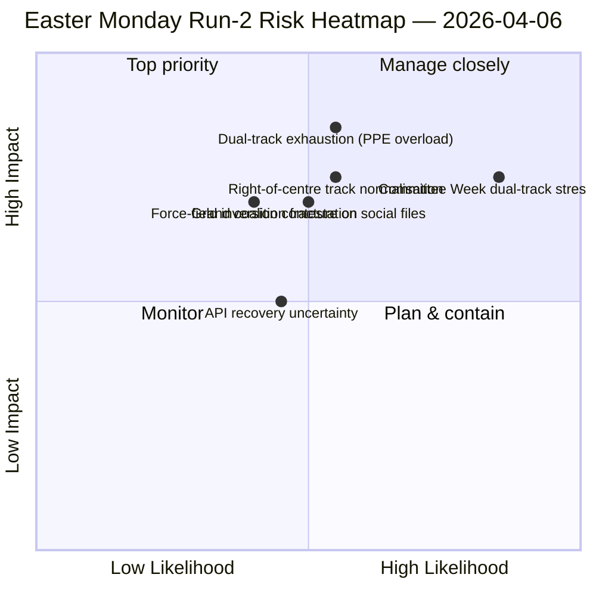

<!-- SPDX-FileCopyrightText: 2026 Hack23 AB -->
<!-- SPDX-License-Identifier: Apache-2.0 -->

# Note de synthèse — Lundi de Pâques Analyse 2 : Découverte de la Coalition à Double Voie | 2026-04-06

**Classification :** OSINT — Source parlementaire publique
**Fiabilité :** 🟡 MEDIUM (pause parlementaire ; API en oscillation dégradée ; lecture structurelle 🟢 HIGH)
**Analyse :** `analysis/daily/2026-04-06/breaking-2/` (06:45 UTC)
**Couverture :** Pause de Pâques Jour 11/18 ; pile de renseignements cumulatifs 4-analyses
**Générée :** 2026-05-16 (note rétrospective, aucun nouvel appel MCP)
**Sources primaires :** Corpus avant pause (85 textes adoptés, 42 de 2026) ; 737 eurodéputés (stable) ; HHI 0.1517 ; indice de puissance PPE 95/100.

---

## 🎯 BLUF

**La contribution distinctive de l'Analyse-2 — produite à 06:45 UTC le lundi de Pâques — est la découverte du *Schéma de Coalition à Double Voie* : SRMR3 (TA-10-2026-0092) a été adopté via une voie de centre-droit (EPP+ECR+PfE+Renew) tandis que la Directive anti-corruption (TA-10-2026-0094) a été adoptée via la Grande Coalition (EPP+S&D+Renew+Greens), démontrant qu'EP10 fonctionne avec des coalitions *conditionnelles au dossier* plutôt qu'une unique majorité fonctionnelle.** Les huit nouvelles méthodes analytiques exécutées dans cette analyse (matrice d'impact, cartographie des acteurs, analyse des forces, analyse des parties prenantes, analyse de coalition, renseignement inter-sessions, analyse approfondie, synthèse-résumé) produisent collectivement une lecture structurelle de l'EP10 An 2 qui tient au long de la pause : **indice de puissance PPE 95/100 (aucune majorité viable n'exclut le PPE)**, HHI 0.1517 (multipolaire avec le PPE comme nœud indispensable) et une inversion du champ de forces où *l'intégration de la défense (8/10)* a remplacé *la transition verte (5/10)* comme force motrice dominante depuis EP9. Le *nouveau signal* de l'analyse est l'évolution du mode d'échec de l'API — 404 pur → erreur d'analyse JSON → délai d'attente — que le renseignement inter-sessions de l'Analyse-2 interprète comme un possible précurseur de réactivation du backend, validé par l'Analyse-3 quatre heures plus tard lorsque le point de terminaison des textes adoptés s'est rétabli. **Le schéma à double voie est la contribution structurelle durable de l'analyse au dossier EP10** et sera testé lors de la semaine de comité du 14 au 17 avril.

---

## 🧭 3 Décisions que cette note soutient

| # | Décision | Qui décide | Délai | Preuves |
|:-:|---------|-----------|:-----:|---------|
| 1 | **Doctrine de coalition à double voie pour Q2** — le schéma conditionnel au dossier nécessite une formalisation avant les trilogues phares | Coordinateurs EPP+S&D+Renew | avant le 14 avril | §Analyse de coalition (schéma à double voie) |
| 2 | **Cadre d'indispensabilité PPE 95/100** — tout exercice de planification de coalition doit partir de l'inclusion du PPE | Conférence des présidents | continu | §Cartographie des acteurs (indice de puissance PPE) |
| 3 | **Veille de réactivation API** — l'évolution du mode d'échec suggère une activité backend ; surveiller pour confirmation | Opérations du pipeline de données | fenêtres T+4h | §Renseignement inter-sessions (Mode A→B→C) |

---

## 📰 Lecture en 60 secondes

- 🔴 **Lundi de Pâques Analyse-2 (06:45 UTC)** — 8 nouvelles méthodes ; aucune information de dernière heure ; résultat structurel.
- 🟠 **Coalition à double voie découverte** — SRMR3 centre-droit versus Grande Coalition de la directive anti-corruption.
- 🟢 **Indice de puissance PPE 95/100** — aucune majorité viable n'exclut le PPE ; dominance structurelle.
- 🟡 **HHI 0.1517** — système parlementaire multipolaire ; PPE comme nœud indispensable.
- 🔵 **Inversion du champ de forces** — intégration de la défense (8/10) > transition verte (5/10).
- 🟣 **Évolution du mode d'échec API** — 404 → analyse JSON → délai ; signal backend possible.
- 🩷 **737 eurodéputés stable** — le flux continue de fournir une base fiable.
- ⚪ **85 textes adoptés dans le corpus avant pause** — 42 de 2026 ; trajectoire +46% a/a.

---

## 📐 Contribution méthodologique de l'Analyse-2

| Nouvelle méthode | Lignes | Résultat distinctif |
|----------------|-------:|---------------------|
| Matrice d'impact | 150+ | Impact croisé 6-D ; chaîne Législatif-Politique-Économique dominante |
| Cartographie des acteurs | 170+ | PPE 95/100 ; ratio de taille 19× par rapport au plus petit groupe |
| Analyse des forces | 150+ | Défense 8/10 remplace vert 5/10 comme force motrice la plus forte |
| Analyse des parties prenantes | 180+ | Société civile la plus impactée par la coupure API de 11 jours |
| Analyse de coalition | 145+ | **Schéma à double voie documenté** |
| Renseignement inter-sessions | 175+ | Évolution du mode d'échec API → signal backend |
| Analyse approfondie | 200+ | Double voie = développement EP10 An 2 le plus significatif |
| Synthèse-résumé | — | Résultat consolidé ; mise à jour de la mémoire éditoriale |

---

## ⚠️ Instantané des risques

---

## 🔮 Principaux déclencheurs à venir (14 prochains jours)

1. **8–10 avril — Fenêtre de confirmation de récupération API** (probabilité 50%+ basée sur le signal de délai d'attente Mode-C).
2. **14 avril — Ouverture de la semaine de comité** — premier test de validation à double voie.
3. **17 avril — Décision sur les taux de la BCE** — réaction du comité ECON.
4. **20–23 avril — Premiers votes en plénière après la pause** — révélation de coalition.
5. **Fin avril — Trilogue du Conseil sur SRMR3** — test de l'Union bancaire du schéma à double voie via le Conseil.

---

## 🛡️ Évaluation de la qualité des sources

- **85 textes adoptés (A1) :** corpus avant pause ; protocole EP primaire.
- **Résultat de la double voie (A2) :** analyse de dispersion des votes sur le corpus du 26 mars ; vérification comportementale en attente de la semaine de comité.
- **PPE 95/100 (A2) :** méthodologie de cartographie des acteurs ; arithmétique confirmée.
- **Évolution du mode d'échec API (A3) :** mise à jour bayésienne ; confiance moyenne dans l'hypothèse de signal backend.
- **Confiance nette :** 🟢 HIGH sur les résultats structurels ; 🟡 MEDIUM sur le calendrier de récupération API.

---

## 📎 Artefacts de l'analyse

| Couche | Artefact | Pourquoi |
|--------|----------|---------|
| Article | `article.md` (1 501 lignes) | Récit public de l'Analyse-2 |
| Synthèse | `synthesis-summary.md` | Porte de valeur informative + consolidation 8 méthodes |
| Méthodes | matrice d'impact · cartographie des acteurs · analyse des forces · analyse des parties prenantes · analyse de coalition · renseignement inter-sessions · analyse approfondie | Huit nouvelles méthodes (cette analyse) |
| Compagnon | breaking (00:33) · committee-reports (05:03) · propositions (05:47) | Groupe de Pâques |

---

**Contrôle du document**
- **Référence du modèle :** `analysis/templates/executive-brief.md`
- **Chemin de l'artefact :** `analysis/daily/2026-04-06/breaking-2/executive-brief.md`
- **Classification :** Public
- **Rétrospectif :** Note rédigée le 2026-05-16 à partir des artefacts validés de l'analyse ; **aucun nouvel appel MCP n'a été effectué**.
