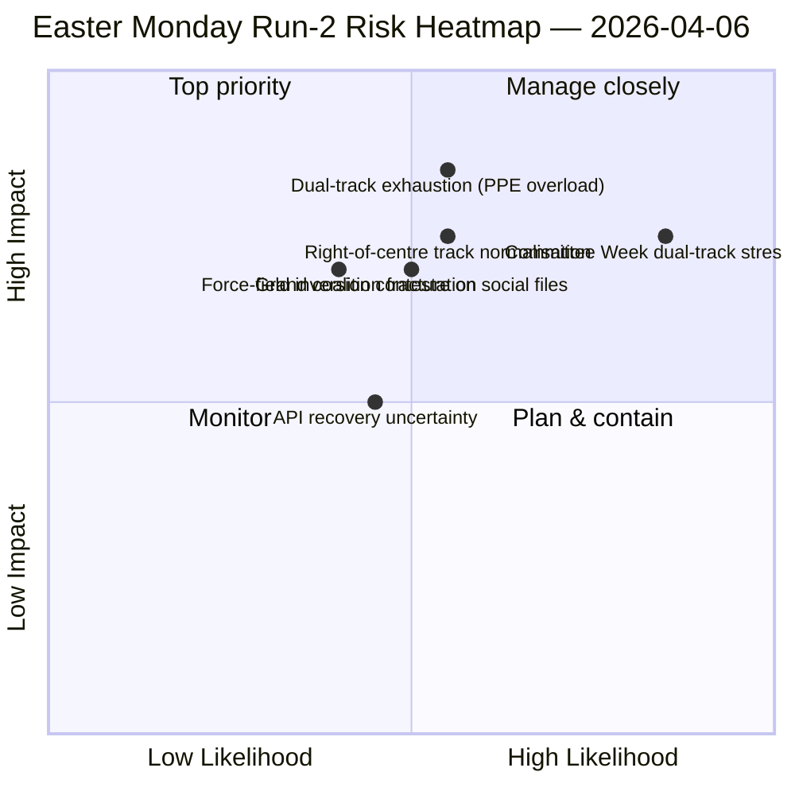

<!-- SPDX-FileCopyrightText: 2026 Hack23 AB -->
<!-- SPDX-License-Identifier: Apache-2.0 -->

# תקציר מנהלים — ניתוח שני של פסחא: גילוי קואליציית מסלול כפול | 2026-04-06

**סיווג:** OSINT — רשומה פרלמנטרית ציבורית
**אמינות:** 🟡 MEDIUM (הפסקה פרלמנטרית; API בתנודה מדורדרת; קריאה מבנית 🟢 HIGH)
**ניתוח:** `analysis/daily/2026-04-06/breaking-2/` (06:45 UTC)
**כיסוי:** הפסקת פסחא יום 11/18; ערמת מודיעין מצטברת 4 ניתוחים
**נוצר:** 2026-05-16 (תקציר רטרוספקטיבי, ללא קריאות MCP חדשות)
**מקורות עיקריים:** מאגר לפני ההפסקה (85 טקסטים שאושרו, 42 מ-2026); 737 חברי פרלמנט (יציב); HHI 0.1517; מדד עוצמת PPE 95/100.

---

## 🎯 BLUF

**התרומה המבחינה של ניתוח-2 — שיוצרה ב-06:45 UTC ביום שני של פסחא — היא גילוי *תבנית הקואליציה של מסלול כפול*: SRMR3 (TA-10-2026-0092) אושרה דרך מסלול ימין-מרכז (EPP+ECR+PfE+Renew) בעוד שהנחיית המאבק בשחיתות (TA-10-2026-0094) אושרה דרך הקואליציה הגדולה (EPP+S&D+Renew+Greens), מה שמדגים שEP10 פועל עם קואליציות *מותנות-לפי-תיק* במקום רוב עבודה אחד.** שמונת השיטות האנליטיות החדשות שהופעלו בניתוח זה (מטריצת השפעה, מיפוי שחקנים, ניתוח כוחות, ניתוח בעלי עניין, ניתוח קואליציה, מודיעין בין-סשנים, ניתוח עומק, סיכום סינתזה) מייצרות יחד קריאה מבנית של EP10 שנה 2 שמחזיקה לאורך ההפסקה: **מדד עוצמת PPE 95/100 (אף רוב ברי-קיימא אינו מדיר PPE)**, HHI 0.1517 (רב-קוטבי עם PPE כצומת הכרחי), והיפוך שדה כוחות שבו *אינטגרציית הגנה (8/10)* החליפה את *המעבר הירוק (5/10)* כגורם הדחיפה החזק ביותר מאז EP9. ה*אות החדש* של הניתוח הוא התפתחות מצב כשל API — 404 נקי ← שגיאת ניתוח JSON ← פסק זמן — שמודיעין בין-הסשנים של ניתוח-2 קורא כאפשרי מבשר להפעלה מחדש של ה-backend, שנאומת על ידי ניתוח-3 ארבע שעות לאחר מכן כשנקודת הקצה לטקסטים שאושרו התאוששה. **תבנית המסלול הכפול היא התרומה המבנית הקבועה של הניתוח לרשומת EP10** ותיבחן בשבוע ועדה 14–17 אפריל.

---

## 🧭 3 החלטות שתקציר זה תומך בהן

| # | החלטה | מי מחליט | מועד אחרון | עדויות |
|:-:|-------|---------|:----------:|--------|
| 1 | **דוקטרינת קואליציית המסלול הכפול לרבעון Q2** — תבנית מותנית-לפי-תיק זקוקה לפורמליזציה לפני טרילוגים מרכזיים | רכזי EPP+S&D+Renew | לפני 14 אפריל | §ניתוח קואליציה (תבנית מסלול כפול) |
| 2 | **מסגרת הכרחיות PPE 95/100** — כל תרגיל תכנון קואליציה חייב להתחיל מהכללת PPE | ועידת הנשיאים | שוטף | §מיפוי שחקנים (מדד עוצמת PPE) |
| 3 | **כוננות הפעלה מחדש של API** — התפתחות מצב כשל מרמזת על פעילות backend; מעקב לאישור | פעולות צינור נתונים | חלונות T+4h | §מודיעין בין-סשנים (מצב A→B→C) |

---

## 📰 קריאת 60 שניות

- 🔴 **ניתוח שני פסחא-2 (06:45 UTC)** — 8 שיטות חדשות; ללא חדשות שוברות; ממצא מבני.
- 🟠 **קואליציית מסלול כפול התגלתה** — SRMR3 ימין-מרכז לעומת קואליציה גדולה של ניתוח-שחיתות.
- 🟢 **מדד עוצמת PPE 95/100** — אף רוב ברי-קיימא אינו מדיר PPE; שליטה מבנית.
- 🟡 **HHI 0.1517** — מערכת פרלמנטרית רב-קוטבית; PPE כצומת הכרחי.
- 🔵 **היפוך שדה כוחות** — אינטגרציית הגנה (8/10) > מעבר ירוק (5/10).
- 🟣 **התפתחות מצב כשל API** — 404 ← ניתוח JSON ← פסק זמן; אות backend אפשרי.
- 🩷 **737 חברי פרלמנט יציב** — הפיד ממשיך לספק קו בסיס אמין.
- ⚪ **85 טקסטים שאושרו במאגר לפני ההפסקה** — 42 מ-2026; מסלול +46% שנתי.

---

## 📐 תרומת שיטות ניתוח-2

| שיטה חדשה | שורות | ממצא מבחין |
|---------|------:|-----------|
| מטריצת השפעה | 150+ | השפעה צולבת 6-D; שרשרת חקיקתית-פוליטית-כלכלית שלטת |
| מיפוי שחקנים | 170+ | PPE 95/100; יחס גודל 19× ביחס לקבוצה הקטנה ביותר |
| ניתוח כוחות | 150+ | הגנה 8/10 מחליפה ירוק 5/10 כגורם הדחיפה החזק ביותר |
| ניתוח בעלי עניין | 180+ | החברה האזרחית הנפגעת ביותר מניתוק API של 11 ימים |
| ניתוח קואליציה | 145+ | **תבנית מסלול כפול מתועדת** |
| מודיעין בין-סשנים | 175+ | התפתחות מצב כשל API ← אות backend |
| ניתוח עומק | 200+ | מסלול כפול = ההתפתחות המשמעותית ביותר של EP10 שנה 2 |
| סיכום סינתזה | — | ממצא מאוחד; עדכון זיכרון עריכה |

---

## ⚠️ תמונת סיכונים

---

## 🔮 טריגרים עתידיים מובילים (14 הימים הקרובים)

1. **8–10 באפריל — חלון אישור התאוששות API** (הסתברות 50%+ על בסיס אות פסק הזמן מצב-C).
2. **14 באפריל — שבוע ועדה נפתח** — מבחן אימות ראשון של מסלול כפול.
3. **17 באפריל — החלטת ריבית ECB** — תגובת ועדת ECON.
4. **20–23 באפריל — הצבעות מליאה ראשונות לאחר ההפסקה** — חשיפת קואליציה.
5. **סוף אפריל — טרילוג מועצת SRMR3** — מבחן האיחוד הבנקאי לתבנית המסלול הכפול דרך המועצה.

---

## 🛡️ הערכת איכות מקורות

- **85 טקסטים שאושרו (A1):** מאגר לפני ההפסקה; פרוטוקול EP ראשי.
- **ממצא מסלול כפול (A2):** ניתוח פיזור הצבעות על מאגר 26 מרץ; אימות התנהגותי ממתין לשבוע ועדה.
- **PPE 95/100 (A2):** מתודולוגיית מיפוי שחקנים; אריתמטיקה מאושרת.
- **התפתחות מצב כשל API (A3):** עדכון בייסיאני; אמון בינוני בהיפותזת אות backend.
- **אמון נטו:** 🟢 HIGH על ממצאים מבניים; 🟡 MEDIUM על לוח זמנים של התאוששות API.

---

## 📎 תוצרי הניתוח

| שכבה | תוצר | מדוע |
|------|------|------|
| מאמר | `article.md` (1,501 שורות) | נרטיב ניתוח-2 ציבורי |
| סינתזה | `synthesis-summary.md` | שער ערך חדשותי + איחוד 8 שיטות |
| שיטות | מטריצת השפעה · מיפוי שחקנים · ניתוח כוחות · ניתוח בעלי עניין · ניתוח קואליציה · מודיעין בין-סשנים · ניתוח עומק | שמונה שיטות חדשות (ניתוח זה) |
| מלווה | breaking (00:33) · committee-reports (05:03) · propositions (05:47) · | אשכול פסחא |

---

**בקרת מסמך**
- **הפניית תבנית:** `analysis/templates/executive-brief.md`
- **נתיב תוצר:** `analysis/daily/2026-04-06/breaking-2/executive-brief.md`
- **סיווג:** ציבורי
- **רטרוספקטיבי:** תקציר נכתב 2026-05-16 מהתוצרים המחויבים של הניתוח; **לא בוצעו קריאות MCP חדשות**.
