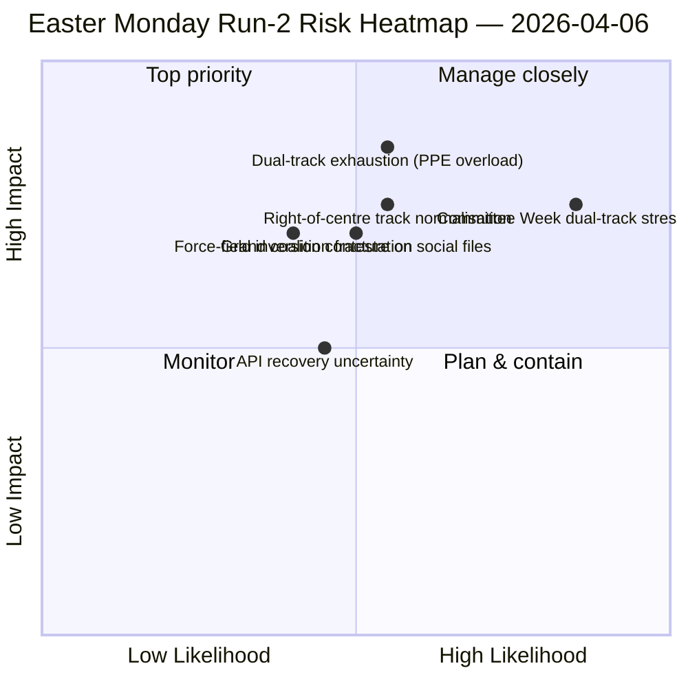

<!-- SPDX-FileCopyrightText: 2026 Hack23 AB -->
<!-- SPDX-License-Identifier: Apache-2.0 -->

# エグゼクティブ・ブリーフ — イースター月曜日第2分析：デュアル・トラック連立の発見 | 2026-04-06

**分類：** OSINT — 公開議事録
**信頼性：** 🟡 中（議会休会；API不安定；構造的解読 🟢 高）
**分析：** `analysis/daily/2026-04-06/breaking-2/` （06:45 UTC）
**対象期間：** イースター休会第11/18日；累積インテリジェンス4分析
**作成：** 2026-05-16（回顧的ブリーフ、新規MCP呼び出しなし）
**主要ソース：** 休会前アーカイブ（採択テキスト85件、2026年分42件）；議員737名（安定）；HHI 0.1517；PPE影響力スコア95/100。

---

## 🎯 BLUF

**第2分析（イースター月曜日06:45 UTC）の特徴的貢献は、*デュアル・トラック連立パターン*の発見である：SRMR3（TA-10-2026-0092）は中道右派トラック（EPP+ECR+PfE+Renew）を通じて採択され、一方で汚職対策指令（TA-10-2026-0094）は大連立（EPP+S&D+Renew+Greens）を通じて採択された。これにより、EP10は単一の安定多数派ではなく*案件条件付き連立*で機能していることが実証された。** 本分析で展開した8つの新手法（影響力マトリクス、アクター・マッピング、勢力分析、ステークホルダー分析、連立分析、セッション間インテリジェンス、深度分析、統合サマリー）は、休会を通じて維持されるEP10第2年の構造的解読を共同で生成する：**PPE影響力スコア95/100（持続可能な多数派はPPEを排除できない）**、HHI 0.1517（PPEを必要ノードとした多極化）、EP9以来*緑の移行（5/10）*に代わり*防衛統合（8/10）*が最強の推進力となった勢力場の逆転。本分析の*新シグナル*はAPIエラー状態の進展—クリーン404←JSONパースエラー←タイムアウト—であり、第2分析のセッション間インテリジェンスはこれをバックエンド再起動の可能性を示す前兆として解読し、その4時間後に採択テキストエンドポイントが回復したことで第3分析が確認した。**デュアル・トラック・パターンはEP10記録への構造的貢献として永続し**、4月14〜17日の委員会ウィークで検証される。

---

## 🧭 本ブリーフが支援する3つの意思決定

| # | 意思決定 | 決定者 | 期限 | 根拠 |
|:-:|--------|--------|:----:|------|
| 1 | **Q2デュアル・トラック連立ドクトリン** — 主要三部協議前にこの案件条件付きパターンを正式化する必要 | EPP+S&D+Renew調整者 | 4月14日前 | §連立分析（デュアル・トラック・パターン） |
| 2 | **PPE必要性フレームワーク95/100** — すべての連立計画演習はPPEの包含から始める必要あり | 議長会議 | 継続 | §アクター・マッピング（PPE影響力スコア） |
| 3 | **API再起動準備態勢** — 障害状態の進展はバックエンド活動を示唆；確認のため監視 | データパイプライン運用 | T+4hウィンドウ | §セッション間インテリジェンス（状態A→B→C） |

---

## 📰 60秒解説

- 🔴 **第2分析イースター月曜日（06:45 UTC）** — 8新手法；速報ニュースなし；構造的発見。
- 🟠 **デュアル・トラック連立の発見** — SRMR3は中道右派、汚職対策は大連立。
- 🟢 **PPE影響力スコア95/100** — 持続可能な多数派はPPEを排除不可；構造的支配。
- 🟡 **HHI 0.1517** — 多極化議会システム；PPEが必要ノード。
- 🔵 **勢力場の逆転** — 防衛統合（8/10）>緑の移行（5/10）。
- 🟣 **APIエラー状態の進展** — 404←JSONパース←タイムアウト；バックエンド信号の可能性。
- 🩷 **議員737名安定** — フィードが信頼性の高いベースラインを提供し続ける。
- ⚪ **休会前アーカイブ85件** — 42件は2026年；年率+46%トラック。

---

## 📐 第2分析の手法貢献

| 新手法 | 行数 | 特徴的発見 |
|------|-----:|----------|
| 影響力マトリクス | 150+ | 6次元交差影響；立法-政治-経済の連鎖が支配的 |
| アクター・マッピング | 170+ | PPE 95/100；最小グループの19倍の規模比 |
| 勢力分析 | 150+ | 防衛8/10が緑5/10に代わり最強推進力に |
| ステークホルダー分析 | 180+ | 市民社会がAPI11日間断絶の最大被害者 |
| 連立分析 | 145+ | **デュアル・トラック・パターン文書化** |
| セッション間インテリジェンス | 175+ | APIエラー状態進展←バックエンド信号 |
| 深度分析 | 200+ | デュアル・トラック＝EP10第2年最重要発展 |
| 統合サマリー | — | 統一発見；編集メモリ更新 |

---

## ⚠️ リスク・スナップショット

---

## 🔮 主要な将来トリガー（今後14日間）

1. **4月8〜10日 — API回復確認ウィンドウ**（状態Cタイムアウト信号に基づく確率50%以上）。
2. **4月14日 — 委員会ウィーク開始** — デュアル・トラックの初回検証テスト。
3. **4月17日 — ECB金利決定** — ECON委員会の反応。
4. **4月20〜23日 — 休会後初の本会議投票** — 連立公開。
5. **4月末 — SRMR3理事会三部協議** — 理事会を通じたデュアル・トラック・パターンへの銀行同盟テスト。

---

## 🛡️ ソース品質評価

- **採択テキスト85件（A1）：** 休会前アーカイブ；EP第一次プロトコル。
- **デュアル・トラック発見（A2）：** 3月26日アーカイブの投票分布分析；委員会ウィークで行動検証待ち。
- **PPE 95/100（A2）：** アクター・マッピング手法；算術確認済み。
- **APIエラー状態進展（A3）：** ベイズ更新；バックエンド信号仮説は中程度の確信。
- **正味信頼性：** 🟢 構造的発見HIGH；🟡 API回復タイムラインMEDIUM。

---

## 📎 分析成果物

| レイヤー | 成果物 | 理由 |
|--------|------|-----|
| 記事 | `article.md`（1,501行） | 公開第2分析ナラティブ |
| 統合 | `synthesis-summary.md` | ニュース価値判断＋8手法統合 |
| 手法 | 影響力マトリクス・アクター・マッピング・勢力分析・ステークホルダー分析・連立分析・セッション間インテリジェンス・深度分析 | 新8手法（本分析） |
| 同時期 | breaking（00:33）・committee-reports（05:03）・propositions（05:47） | イースタークラスター |

---

**文書管理**
- **テンプレート参照：** `analysis/templates/executive-brief.md`
- **成果物パス：** `analysis/daily/2026-04-06/breaking-2/executive-brief.md`
- **分類：** 公開
- **回顧的：** 本ブリーフは2026-05-16に分析のコミット済み成果物から作成；**新規MCP呼び出しは実施されていない**。
