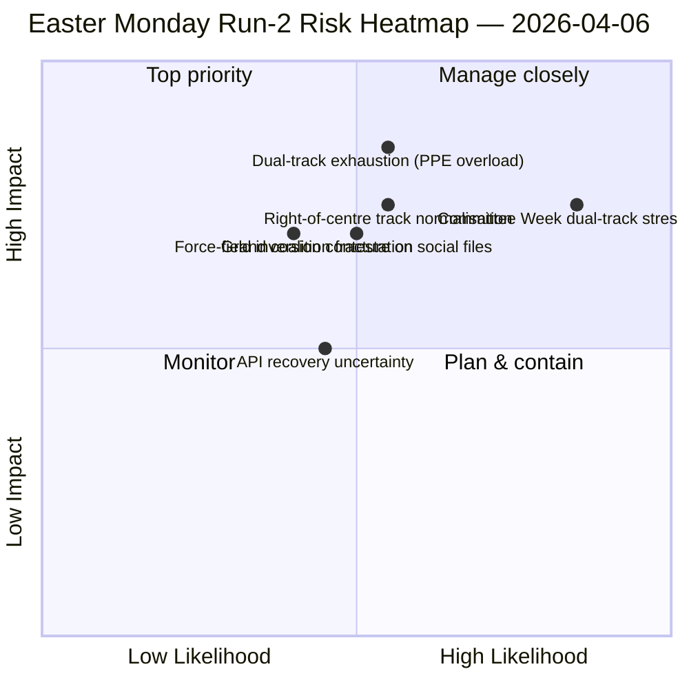

<!-- SPDX-FileCopyrightText: 2026 Hack23 AB -->
<!-- SPDX-License-Identifier: Apache-2.0 -->

# 임원 브리핑 — 부활절 월요일 2차 분석: 이중 트랙 연합 발견 | 2026-04-06

**분류:** OSINT — 공개 의회 기록
**신뢰도:** 🟡 보통 (의회 휴회; API 저하 불안정; 구조적 해석 🟢 높음)
**분석:** `analysis/daily/2026-04-06/breaking-2/` (06:45 UTC)
**범위:** 부활절 휴회 11/18일차; 누적 인텔리전스 4차 분석
**작성:** 2026-05-16 (소급 브리핑, 신규 MCP 호출 없음)
**주요 출처:** 휴회 전 아카이브 (채택 텍스트 85건, 2026년 42건); 의원 737명 (안정); HHI 0.1517; PPE 영향력 점수 95/100.

---

## 🎯 BLUF

**2차 분석(부활절 월요일 06:45 UTC)의 차별적 기여는 *이중 트랙 연합 패턴*의 발견이다: SRMR3(TA-10-2026-0092)는 중도우파 트랙(EPP+ECR+PfE+Renew)을 통해 채택되었고, 부패방지지침(TA-10-2026-0094)은 대연립(EPP+S&D+Renew+Greens)을 통해 채택되어, EP10이 단일 안정 다수가 아닌 *안건별 조건부 연합*으로 운영됨을 실증했다.** 본 분석에서 전개된 8가지 신규 방법론(영향력 매트릭스, 행위자 매핑, 세력 분석, 이해관계자 분석, 연합 분석, 세션 간 인텔리전스, 심층 분석, 통합 요약)은 휴회를 통해 유지되는 EP10 2년차 구조적 해석을 공동으로 생성한다: **PPE 영향력 점수 95/100(지속 가능한 다수는 PPE를 배제할 수 없음)**, HHI 0.1517(PPE를 필수 노드로 한 다극화), EP9 이후 *녹색 전환(5/10)*을 대체하여 *방위 통합(8/10)*이 최강 추진력이 된 세력장 역전. 본 분석의 *새로운 신호*는 API 오류 상태 진행—깨끗한 404←JSON 파싱 오류←타임아웃—이며, 2차 분석의 세션 간 인텔리전스는 이를 백엔드 재시작 가능성 신호로 해석하여 4시간 후 채택 텍스트 엔드포인트가 복구되면서 3차 분석이 확인했다. **이중 트랙 패턴은 EP10 기록에 대한 구조적 기여로 영속하며** 4월 14~17일 위원회 주간에서 검증된다.

---

## 🧭 본 브리핑이 지원하는 3가지 의사결정

| # | 의사결정 | 결정자 | 기한 | 근거 |
|:-:|---------|--------|:----:|------|
| 1 | **Q2 이중 트랙 연합 독트린** — 주요 삼자협상 전 안건별 조건부 패턴 공식화 필요 | EPP+S&D+Renew 조율자 | 4월 14일 전 | §연합 분석 (이중 트랙 패턴) |
| 2 | **PPE 필수성 프레임워크 95/100** — 모든 연합 계획 작업은 PPE 포함에서 시작 | 의장 회의 | 지속 | §행위자 매핑 (PPE 영향력 점수) |
| 3 | **API 재시작 준비 태세** — 오류 상태 진행이 백엔드 활동 시사; 확인 모니터링 | 데이터 파이프라인 운영 | T+4h 창 | §세션 간 인텔리전스 (상태 A→B→C) |

---

## 📰 60초 해설

- 🔴 **2차 분석 부활절 월요일 (06:45 UTC)** — 8가지 신규 방법론; 속보 없음; 구조적 발견.
- 🟠 **이중 트랙 연합 발견** — SRMR3 중도우파 vs. 부패방지 대연립.
- 🟢 **PPE 영향력 점수 95/100** — 지속 가능한 다수는 PPE 배제 불가; 구조적 지배.
- 🟡 **HHI 0.1517** — 다극화 의회 시스템; PPE가 필수 노드.
- 🔵 **세력장 역전** — 방위 통합(8/10) > 녹색 전환(5/10).
- 🟣 **API 오류 상태 진행** — 404←JSON 파싱←타임아웃; 백엔드 신호 가능성.
- 🩷 **의원 737명 안정** — 피드가 신뢰할 수 있는 기준선 지속 제공.
- ⚪ **휴회 전 아카이브 85건** — 42건은 2026년; 연간 +46% 트랙.

---

## 📐 2차 분석 방법론 기여

| 신규 방법론 | 행수 | 차별적 발견 |
|----------|----:|-----------|
| 영향력 매트릭스 | 150+ | 6차원 교차 영향; 입법-정치-경제 연쇄 지배 |
| 행위자 매핑 | 170+ | PPE 95/100; 최소 그룹 대비 19배 규모비 |
| 세력 분석 | 150+ | 방위 8/10이 녹색 5/10 대체해 최강 추진력 |
| 이해관계자 분석 | 180+ | 시민사회가 API 11일 단절 최대 피해자 |
| 연합 분석 | 145+ | **이중 트랙 패턴 문서화** |
| 세션 간 인텔리전스 | 175+ | API 오류 상태 진행←백엔드 신호 |
| 심층 분석 | 200+ | 이중 트랙 = EP10 2년차 가장 중요한 발전 |
| 통합 요약 | — | 통합 발견; 편집 메모리 업데이트 |

---

## ⚠️ 리스크 스냅샷

---

## 🔮 주요 미래 트리거 (향후 14일)

1. **4월 8~10일 — API 복구 확인 창** (상태 C 타임아웃 신호 기반 확률 50%+).
2. **4월 14일 — 위원회 주간 개시** — 이중 트랙 첫 번째 검증 테스트.
3. **4월 17일 — ECB 금리 결정** — ECON 위원회 반응.
4. **4월 20~23일 — 휴회 후 첫 본회의 투표** — 연합 공개.
5. **4월 말 — SRMR3 이사회 삼자협상** — 이사회를 통한 이중 트랙 패턴 은행동맹 테스트.

---

## 🛡️ 소스 품질 평가

- **채택 텍스트 85건 (A1):** 휴회 전 아카이브; EP 1차 프로토콜.
- **이중 트랙 발견 (A2):** 3월 26일 아카이브의 투표 분포 분석; 위원회 주간 행동 검증 대기.
- **PPE 95/100 (A2):** 행위자 매핑 방법론; 산술 확인 완료.
- **API 오류 상태 진행 (A3):** 베이즈 업데이트; 백엔드 신호 가설 중간 확신.
- **순 신뢰도:** 🟢 구조적 발견 높음; 🟡 API 복구 타임라인 보통.

---

## 📎 분석 결과물

| 레이어 | 결과물 | 이유 |
|------|------|-----|
| 기사 | `article.md` (1,501행) | 공개 2차 분석 내러티브 |
| 통합 | `synthesis-summary.md` | 뉴스 가치 판단 + 8가지 방법론 통합 |
| 방법론 | 영향력 매트릭스·행위자 매핑·세력 분석·이해관계자 분석·연합 분석·세션 간 인텔리전스·심층 분석 | 신규 8가지 방법론 (본 분석) |
| 동시기 | breaking (00:33)·committee-reports (05:03)·propositions (05:47) | 부활절 클러스터 |

---

**문서 관리**
- **템플릿 참조:** `analysis/templates/executive-brief.md`
- **결과물 경로:** `analysis/daily/2026-04-06/breaking-2/executive-brief.md`
- **분류:** 공개
- **소급:** 본 브리핑은 2026-05-16에 분석의 커밋된 결과물로부터 작성; **신규 MCP 호출 미실시**.
