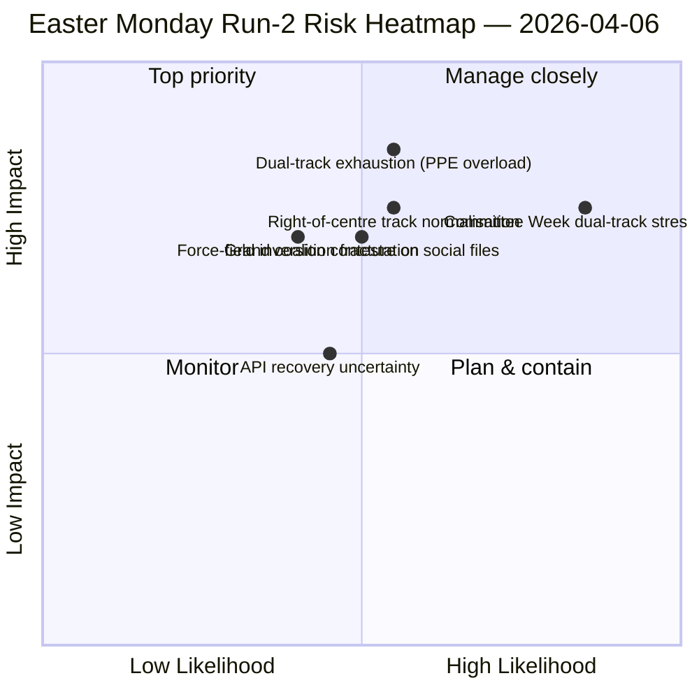

<!-- SPDX-FileCopyrightText: 2026 Hack23 AB -->
<!-- SPDX-License-Identifier: Apache-2.0 -->

# Bestuurssamenvatting — Paasmaandag Analyse 2: Ontdekking Dubbelspoorcoalitie | 2026-04-06

**Classificatie:** OSINT — Openbare parlementaire bron
**Betrouwbaarheid:** 🟡 MEDIUM (parlementair reces; API in gedegradeerde oscillatie; structurele lezing 🟢 HIGH)
**Analyse:** `analysis/daily/2026-04-06/breaking-2/` (06:45 UTC)
**Dekking:** Paasreces Dag 11/18; cumulatieve 4-analyse inlichtingenstapel
**Gegenereerd:** 2026-05-16 (retrospectieve samenvatting, geen nieuwe MCP-aanroepen)
**Primaire bronnen:** Corpus vóór reces (85 aangenomen teksten, 42 uit 2026); 737 EP-leden (stabiel); HHI 0.1517; PPE-machtsindex 95/100.

---

## 🎯 BLUF

**De onderscheidende bijdrage van Analyse-2 — geproduceerd om 06:45 UTC op Paasmaandag — is de ontdekking van het *Dubbelspoorcoalitiepatroon*: SRMR3 (TA-10-2026-0092) werd aangenomen via een rechts-van-centrum-spoor (EPP+ECR+PfE+Renew) terwijl de Antikorruptierichtlijn (TA-10-2026-0094) werd aangenomen via de Grote Coalitie (EPP+S&D+Renew+Greens), wat aantoont dat EP10 opereert met *dossierafhankelijke* coalities in plaats van één werkende meerderheid.** De acht nieuwe analytische methoden die in deze analyse zijn uitgevoerd (impactmatrix, actorkaart, krachtenveldanalyse, stakeholderanalyse, coalitieanalyse, sessieoverstijgende inlichtingen, diepteanalyse, syntheseoverzicht) produceren gezamenlijk een structurele lezing van EP10 Jaar 2 die overeind blijft gedurende het reces: **PPE-machtsindex 95/100 (geen levensvatbare meerderheid sluit PPE uit)**, HHI 0.1517 (multipolair met PPE als onmisbaar knooppunt) en een krachtveldinversie waarbij *defensie-integratie (8/10)* de *groene transitie (5/10)* heeft vervangen als de sterkste drijvende kracht sinds EP9. Het *nieuwe signaal* van de analyse is de evolutie van de API-foutstatus — clean 404 → JSON-parseerfout → time-out — die de sessieoverstijgende inlichtingen van Analyse-2 leest als een mogelijke backend-reactiveringsvoorbode, gevalideerd door Analyse-3 vier uur later toen het eindpunt voor aangenomen teksten herstel vertoonde. **Het dubbelspoorpatroon is de blijvende structurele bijdrage van de analyse aan het EP10-dossier** en zal worden getest tijdens de commissieweek van 14–17 april.

---

## 🧭 3 Beslissingen die deze samenvatting ondersteunt

| # | Beslissing | Wie beslist | Deadline | Bewijs |
|:-:|-----------|------------|:--------:|--------|
| 1 | **Dubbelspoorcoalitiedoctrine voor Q2** — dossierafhankelijk patroon vereist formalisering vóór vlaggenschip-trilogues | EPP+S&D+Renew-coördinatoren | voor 14 april | §Coalitieanalyse (dubbelspoorpatroon) |
| 2 | **PPE 95/100 onmisbaarheidsraamwerk** — elke coalitieplanningsoefening moet starten met PPE-insluiting | Conferentie van Voorzitters | doorlopend | §Actorkaart (PPE-machtsindex) |
| 3 | **API-reactiveringswatch** — evolutie van foutstatus wijst op backend-activiteit; bewaken voor bevestiging | Datapipeline-operaties | T+4u-vensters | §Sessieoverstijgende inlichtingen (Modus A→B→C) |

---

## 📰 60-seconden lezing

- 🔴 **Paasmaandag Analyse-2 (06:45 UTC)** — 8 nieuwe methoden; geen nieuws; structurele bevinding.
- 🟠 **Dubbelspoorcoalitie ontdekt** — SRMR3 rechts-van-centrum versus Antikorruptierichtlijn Grote Coalitie.
- 🟢 **PPE-machtsindex 95/100** — geen levensvatbare meerderheid sluit PPE uit; structurele dominantie.
- 🟡 **HHI 0.1517** — multipolair parlementair systeem; PPE als onmisbaar knooppunt.
- 🔵 **Krachtveldinversie** — defensie-integratie (8/10) > groene transitie (5/10).
- 🟣 **Evolutie API-foutstatus** — 404 → JSON-parsing → time-out; mogelijk backend-signaal.
- 🩷 **737 EP-leden stabiel** — feed biedt betrouwbare basislijn.
- ⚪ **85 aangenomen teksten in pre-reces corpus** — 42 uit 2026; +46% j-o-j traject.

---

## 📐 Methodologische bijdrage Analyse-2

| Nieuwe methode | Regels | Onderscheidende bevinding |
|---------------|-------:|--------------------------|
| Impactmatrix | 150+ | 6-D kruisimpact; Legislatief-Politiek-Economische keten dominant |
| Actorkaart | 170+ | PPE 95/100; 19× grootteratio ten opzichte van kleinste groep |
| Krachtenveldanalyse | 150+ | Defensie 8/10 vervangt groen 5/10 als sterkste drijfveer |
| Stakeholderanalyse | 180+ | Maatschappelijk middenveld meest getroffen door 11-daagse API-uitval |
| Coalitieanalyse | 145+ | **Dubbelspoorpatroon gedocumenteerd** |
| Sessieoverstijgende inlichtingen | 175+ | Evolutie API-foutstatus → backend-signaal |
| Diepteanalyse | 200+ | Dubbelspoor = meest significante EP10 Jaar 2 ontwikkeling |
| Syntheseoverzicht | — | Geconsolideerde bevinding; redactioneel geheugen bijgewerkt |

---

## ⚠️ Risico-momentopname

---

## 🔮 Top voorwaartse triggers (volgende 14 dagen)

1. **8–10 april — API-herstelbevestigingsvenster** (kans 50%+ gebaseerd op Modus-C time-out-signaal).
2. **14 april — Commissieweek opent** — eerste dubbelspoorvalidatietest.
3. **17 april — ECB-rentebeslissing** — reactie ECON-commissie.
4. **20–23 april — Eerste plenaire stemmen na reces** — coalitie-onthulling.
5. **Eind april — SRMR3 Raadstriloog** — test Bankenunie van dubbelspoorpatroon via de Raad.

---

## 🛡️ Bronkwaliteitsbeoordeling

- **85 aangenomen teksten (A1):** pre-reces corpus; primair EP-dossier.
- **Dubbelspoorbevinding (A2):** stemdispersie-analyse op 26 maart-corpus; gedragsverificatie in afwachting van commissieweek.
- **PPE 95/100 (A2):** actorkaartmethodologie; rekenkunde bevestigd.
- **Evolutie API-foutstatus (A3):** Bayesiaanse update; gemiddeld vertrouwen in backend-signaalhypothese.
- **Nettovertrouwen:** 🟢 HIGH op structurele bevindingen; 🟡 MEDIUM op tijdlijn API-herstel.

---

## 📎 Artefacten van de analyse

| Laag | Artefact | Waarom |
|------|---------|--------|
| Artikel | `article.md` (1.501 regels) | Publieke Analyse-2-vertelling |
| Synthese | `synthesis-summary.md` | Nieuwswaarde-gate + 8-methode-consolidatie |
| Methoden | impactmatrix · actorkaart · krachtenveldanalyse · stakeholderanalyse · coalitieanalyse · sessieoverstijgende inlichtingen · diepteanalyse | Acht nieuwe methoden (deze analyse) |
| Begeleider | breaking (00:33) · committee-reports (05:03) · propositions (05:47) | Paasmondagcluster |

---

**Documentbeheer**
- **Sjabloonreferentie:** `analysis/templates/executive-brief.md`
- **Artefactpad:** `analysis/daily/2026-04-06/breaking-2/executive-brief.md`
- **Classificatie:** Openbaar
- **Retrospectief:** Samenvatting geschreven op 2026-05-16 vanuit de vastgelegde artefacten van de analyse; **er zijn geen nieuwe MCP-aanroepen gedaan**.
