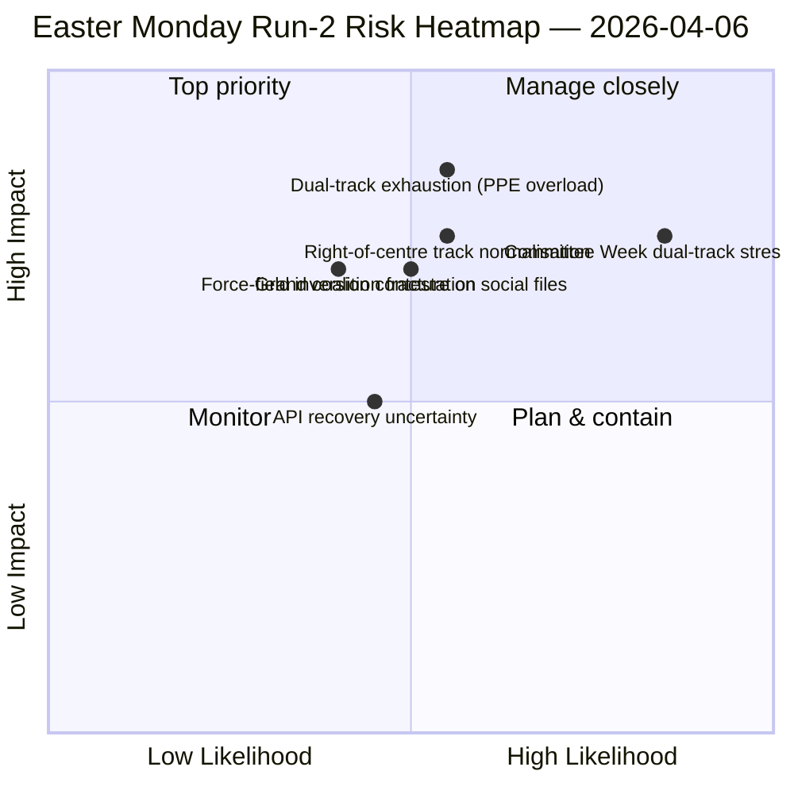

<!-- SPDX-FileCopyrightText: 2026 Hack23 AB -->
<!-- SPDX-License-Identifier: Apache-2.0 -->

# Ledersammendrag — 2. påskedagsanalyse: Dobbeltspor-Koalisjonsoppdagelse | 2026-04-06

**Klassifisering:** OSINT — Offentlig parlamentarisk kilde
**Troverdighet:** 🟡 MEDIUM (parlamentarisk pause; API i degradert oscillasjon; strukturell lesning 🟢 HIGH)
**Analyse:** `analysis/daily/2026-04-06/breaking-2/` (06:45 UTC)
**Dekning:** Påskepause Dag 11/18; kumulativ 4-analyseetterretningsstabel
**Generert:** 2026-05-16 (retrospektivt sammendrag, ingen nye MCP-anrop)
**Primærkilder:** Corpus før pause (85 vedtatte tekster, 42 fra 2026); 737 MEP-er (stabilt); HHI 0.1517; PPE-maktindeks 95/100.

---

## 🎯 BLUF

**Analyse-2s særegne bidrag — produsert 06:45 UTC på 2. påskedag — er oppdagelsen av *Dobbeltspor-Koalisjonsm ønsteret*: SRMR3 (TA-10-2026-0092) ble vedtatt via et høyre-av-sentrum-spor (EPP+ECR+PfE+Renew) mens Antikorrupsjonsdirektivet (TA-10-2026-0094) ble vedtatt via Storkoalisjonen (EPP+S&D+Renew+Greens), noe som demonstrerer at EP10 opererer med *filbetingede* koalisjoner snarere enn ett enkelt arbeidsflertall.** De åtte nye analytiske metodene utført i denne analysen (effektmatrise, aktørkartlegging, styrkeanalyse, interessentanalyse, koalisjonsanalyse, tverrsesjonsetterretning, dybdeanalyse, synteseoppsummering) produserer samlet en strukturell lesning av EP10 År 2 som holder gjennom pausen: **PPE-maktindeks 95/100 (intet levedyktig flertall ekskluderer PPE)**, HHI 0.1517 (multipolær med PPE som uunnværlig knutepunkt), og en kraftfeltinversjon der *forsvarsintegrasjon (8/10)* har erstattet *grønn omstilling (5/10)* som den sterkeste drivkraften siden EP9. Analysens *nye signal* er API-feiltilstandsutviklingen — ren 404 → JSON-tolkningsfeil → timeout — som Analyse-2s tverrsesjonsetterretning leser som en mulig backend-reaktiveringsprekursor, validert av Analyse-3 fire timer senere da sluttpunktet for vedtatte tekster kom seg. **Dobbelsporsmønsteret er analysens varige strukturelle bidrag til EP10-protokollen** og vil bli testet i komitéuken 14.–17. april.

---

## 🧭 3 Beslutninger dette sammendraget støtter

| # | Beslutning | Hvem bestemmer | Frist | Bevis |
|:-:|-----------|----------------|:-----:|-------|
| 1 | **Dobbeltspor-koalisjonssdoktrine for Q2** — filbetinget mønster trenger formalisering før flaggskip-trilogier | EPP+S&D+Renew-koordinatorer | innen 14. april | §Koalisjonsanalyse (dobbelsporsmønster) |
| 2 | **PPE 95/100 uunnværlighetsramme** — enhver koalisjonsplanleggingsøvelse må starte fra PPE-inkludering | Presidentkonferansen | løpende | §Aktørkartlegging (PPE-maktindeks) |
| 3 | **API-reaktiveringsvakt** — feiltilstandsutvikling antyder backend-aktivitet; overvåk for bekreftelse | Datapipeline-operasjoner | T+4t-vinduer | §Tverrsesjonsetterretning (Modus A→B→C) |

---

## 📰 60-sekunders lesning

- 🔴 **2. påskedagsanalyse-2 (06:45 UTC)** — 8 nye metoder; ingen nyhetsbrudd; strukturelt funn.
- 🟠 **Dobbeltspor-koalisjon oppdaget** — SRMR3 høyre-av-sentrum kontra antikorrupsjonsdirektivets storkoalisjon.
- 🟢 **PPE-maktindeks 95/100** — intet levedyktig flertall ekskluderer PPE; strukturell dominans.
- 🟡 **HHI 0.1517** — multipolært parlamentarisk system; PPE som uunnværlig knutepunkt.
- 🔵 **Kraftfeltinversjon** — forsvarsintegrasjon (8/10) > grønn omstilling (5/10).
- 🟣 **API-feiltilstandsutvikling** — 404 → JSON-tolkning → timeout; mulig backend-signal.
- 🩷 **737 MEP-er stabilt** — strøm fortsetter å gi pålitelig baseline.
- ⚪ **85 vedtatte tekster i corpus før pause** — 42 fra 2026; +46% YoY-bane.

---

## 📐 Analyse-2 metodebidrag

| Ny metode | Linjer | Fremtredende funn |
|-----------|-------:|-------------------|
| Effektmatrise | 150+ | 6-D kryss-effekt; Lovgivnings-Politisk-Økonomisk kjede dominerende |
| Aktørkartlegging | 170+ | PPE 95/100; 19× størrelsesforhold til minste gruppe |
| Styrkeanalyse | 150+ | Forsvar 8/10 erstatter grønt 5/10 som sterkeste drivkraft |
| Interessentanalyse | 180+ | Sivilsamfunn mest påvirket av 11-dagers API-avbrudd |
| Koalisjonsanalyse | 145+ | **Dobbelsporsmønster dokumentert** |
| Tverrsesjonsetterretning | 175+ | API-feiltilstandsutvikling → backend-signal |
| Dybdeanalyse | 200+ | Dobbelsporsmønster = mest betydningsfulle EP10 År 2-hendelse |
| Synteseoppsummering | — | Konsolidert funn; redaksjonell minneoppdatering |

---

## ⚠️ Risikooversikt

---

## 🔮 Topp fremtidige utløsere (neste 14 dager)

1. **8.–10. april — API-gjenopprettingsbekreftelsesvindu** (50%+ sannsynlighet basert på Modus-C timeout-signal).
2. **14. april — Komitéuke åpner** — første dobbelsportsvalideringstest.
3. **17. april — ECB-rentebeslutning** — ECON-komitéens reaksjon.
4. **20.–23. april — Første plenumsstemmer etter pause** — koalisjonsavsløring.
5. **Sen april — SRMR3 Råd-trilogi** — Bankunion-testen av dobbelsporsmønsteret via Rådet.

---

## 🛡️ Kildekvalitetsvurdering

- **85 vedtatte tekster (A1):** corpus før pause; primær EP-protokoll.
- **Dobbelsporsfunn (A2):** stemmespredningsanalyse på 26. mars-corpus; atferdsbekreftelse avventer komitéuken.
- **PPE 95/100 (A2):** aktørkartleggingsmetodikk; aritmetikk bekreftet.
- **API-feiltilstandsutvikling (A3):** Bayesiansk oppdatering; middels tillit til backend-signalhypotesen.
- **Nettotillit:** 🟢 HIGH på strukturelle funn; 🟡 MEDIUM på API-gjenopprettingstidslinjen.

---

## 📎 Analysens artefakter

| Lag | Artefakt | Hvorfor |
|-----|----------|---------|
| Artikkel | `article.md` (1 501 linjer) | Offentlig Analyse-2-fortelling |
| Syntese | `synthesis-summary.md` | Nyhetsverdi-gate + 8-metodekonsolidering |
| Metoder | effektmatrise · aktørkartlegging · styrkeanalyse · interessentanalyse · koalisjonsanalyse · tverrsesjonsetterretning · dybdeanalyse | Åtte nye metoder (denne analysen) |
| Ledsager | breaking (00:33) · committee-reports (05:03) · propositions (05:47) | Påskedagsklynge |

---

**Dokumentkontroll**
- **Malreferanse:** `analysis/templates/executive-brief.md`
- **Artefaktsti:** `analysis/daily/2026-04-06/breaking-2/executive-brief.md`
- **Klassifisering:** Offentlig
- **Retrospektiv:** Sammendrag skrevet 2026-05-16 fra analysens forpliktede artefakter; **ingen nye MCP-anrop ble gjort**.
