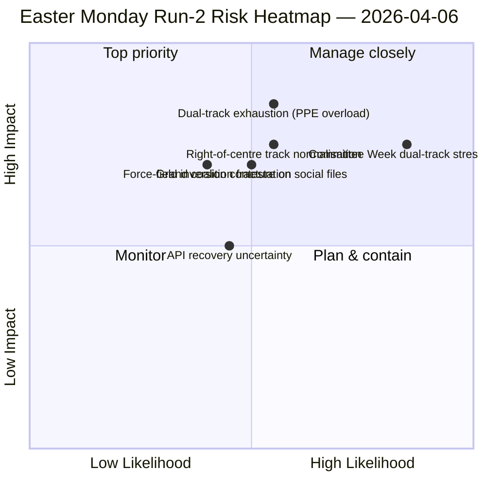

<!-- SPDX-FileCopyrightText: 2026 Hack23 AB -->
<!-- SPDX-License-Identifier: Apache-2.0 -->

# Exekutivt Sammanfattningsbrev — Påskdagskörning 2: Dubbårsiskoalitionsdynamik | 2026-04-06

**Klassificering:** OSINT — Öppen parlamentarisk källa
**Tillförlitlighet:** 🟡 MEDIUM (recessperiod; API i degraderat oscillationsläge; strukturell läsning 🟢 HIGH)
**Körning:** `analysis/daily/2026-04-06/breaking-2/` (06:45 UTC)
**Täckning:** Påskuppehåll Dag 11/18; kumulativ 4-körningars underrättelsestack
**Genererad:** 2026-05-16 (retrospektivt brev, inga nya MCP-anrop)
**Primära källor:** Kår före recessperioden (85 antagna texter, 42 från 2026); 737 MEP:ar (stabilt); HHI 0.1517; PPE-maktindex 95/100.

---

## 🎯 BLUF

**Körning-2:s särdragsbidrag — producerat 06:45 UTC på påskdagen — är upptäckten av det *Dubbårsiskoalitionsmönstret*: SRMR3 (TA-10-2026-0092) godkändes via ett höger-av-centrum-spår (EPP+ECR+PfE+Renew) medan Antikorrpupdirektivet (TA-10-2026-0094) godkändes via Storkoalitionen (EPP+S&D+Renew+Greens), vilket visar att EP10 verkar med *filbetingade* koalitioner snarare än en enda fungerande majoritet.** De åtta nya analytiska metoderna som utfördes i denna körning (effektmatris, aktörkartläggning, kraftanalys, intressentanalys, koalitionsanalys, tvärsessions-underrättelse, djupanalys, syntessammanfattning) producerar sammanfattningsvis en strukturell läsning av EP10 År 2 som håller under recessperioden: **PPE-maktindex 95/100 (ingen fungerande majoritet exkluderar PPE)**, HHI 0.1517 (multipolär med PPE som oumbärligt nav), och en kraftfältsinversion där *försvarsintegration (8/10)* har ersatt *grön omställning (5/10)* som den starkaste drivkraften sedan EP9. Körningens *nya signal* är API-fellägets evolution — ren 404 → JSON-tolkningsfel → timeout — som Körning-2:s tvärsessions-underrättelse läser som ett möjligt bakänd-återaktiveringsprecursor, validerat av Körning-3 fyra timmar senare när slutpunkten för antagna texter återhämtade sig. **Det dubbårssisade mönstret är körningens bestående strukturella bidrag till EP10-protokollet** och kommer att testas under kommittéveckan 14–17 april.

---

## 🧭 3 Beslut som detta brev stöder

| # | Beslut | Vem beslutar | Deadline | Bevis |
|:-:|--------|--------------|:--------:|-------|
| 1 | **Dubbårssiskoalitionsdoktrin för Q2** — filbetingat mönster behöver formalisering innan flaggskepp-triloger | EPP+S&D+Renew-koordinatorer | till 14 april | §Koalitionsanalys (dubbårssismönster) |
| 2 | **PPE 95/100 oumbärlighetsram** — varje koalitionsplaneringövning måste börja med PPE-inkludering | Presidentkonferensen | löpande | §Aktörkartläggning (PPE-maktindex) |
| 3 | **API-återaktiveringsvakt** — felägesutveckling antyder bakändsaktivitet; övervaka för bekräftelse | Datapipelineoperationer | T+4h-fönster | §Tvärsessions-underrättelse (Läge A→B→C) |

---

## 📰 60-sekunders läsning

- 🔴 **Påskdagskörning-2 (06:45 UTC)** — 8 nya metoder; inga nyhetsbrytningar; strukturellt fynd.
- 🟠 **Dubbårssiskoalition upptäckt** — SRMR3 höger-av-centrum kontra antikorrpupdirektivets storkoalition.
- 🟢 **PPE-maktindex 95/100** — ingen fungerande majoritet exkluderar PPE; strukturell dominans.
- 🟡 **HHI 0.1517** — multipolärt parlamentariskt system; PPE som oumbärligt nav.
- 🔵 **Kraftfältsinversion** — försvarsintegration (8/10) > grön omställning (5/10).
- 🟣 **API-felägesutveckling** — 404 → JSON-tolkning → timeout; möjlig bakändssignal.
- 🩷 **737 MEP:ar stabilt** — flödet ger fortsatt tillförlitlig baslinje.
- ⚪ **85 antagna texter i kår före recessperioden** — 42 från 2026; +46% YoY-bana.

---

## 📐 Körning-2 metodbidrag

| Ny metod | Rader | Utmärkande fynd |
|----------|------:|-----------------|
| Effektmatris | 150+ | 6-D korseffekt; Lagstiftnings-Politisk-Ekonomisk kedja dominerande |
| Aktörkartläggning | 170+ | PPE 95/100; 19× storlekskvot mot minsta grupp |
| Kraftanalys | 150+ | Försvar 8/10 ersätter grönt 5/10 som starkaste drivkraft |
| Intressentanalys | 180+ | Civilsamhälle mest påverkat av 11-dagars API-avbrott |
| Koalitionsanalys | 145+ | **Dubbårssismönster dokumenterat** |
| Tvärsessions-underrättelse | 175+ | API-felägesutveckling → bakändssignal |
| Djupanalys | 200+ | Dubbårssismönster = mest betydande EP10 År 2-händelse |
| Syntessammanfattning | — | Konsoliderat fynd; redaktionell minnesuppdatering |

---

## ⚠️ Risköversikt

---

## 🔮 Topp framåtutlösare (nästa 14 dagar)

1. **8–10 april — API-återhämtningsbekräftelsefönster** (50%+ sannolikhet baserat på Läge-C timeout-signal).
2. **14 april — Kommittévecka öppnar** — första dubbårssisvalideringstestet.
3. **17 april — ECB räntebeslut** — ECON-kommitténs reaktion.
4. **20–23 april — Första plenariröstningar efter recessperioden** — koalitionsuppenbarelse.
5. **Sen april — SRMR3 rådsutloga** — Bankuniontestet av dubbårssismönstret via rådet.

---

## 🛡️ Källkvalitetsbedömning

- **85 antagna texter (A1):** kår före recessperioden; primärt EP-protokoll.
- **Dubbårssisfynd (A2):** röstspridningsanalys på 26 mars kår; beteendeverifikation väntar under kommittéveckan.
- **PPE 95/100 (A2):** aktörkartläggningsmetodik; aritmetik bekräftad.
- **API-felägesutveckling (A3):** Bayesiansk uppdatering; medelhög tillförlitlighet på bakändssignalhypotesen.
- **Nettotillförlitlighet:** 🟢 HIGH på strukturella fynd; 🟡 MEDIUM på API-återhämtningstidslinjen.

---

## 📎 Körningens artefakter

| Lager | Artefakt | Varför |
|-------|----------|--------|
| Artikel | `article.md` (1 501 rader) | Offentlig Körning-2-berättelse |
| Syntes | `synthesis-summary.md` | Nyhetsvärdesgräns + 8-metodskonsolidering |
| Metoder | effektmatris · aktörkartläggning · kraftanalys · intressentanalys · koalitionsanalys · tvärsessions-underrättelse · djupanalys | Åtta nya metoder (denna körning) |
| Följeslagare | breaking (00:33) · committee-reports (05:03) · propositions (05:47) | Påskdagskluster |

---

**Dokumentkontroll**
- **Mallreferens:** `analysis/templates/executive-brief.md`
- **Artefaktsökväg:** `analysis/daily/2026-04-06/breaking-2/executive-brief.md`
- **Klassificering:** Offentlig
- **Retrospektiv:** Brev skrivet 2026-05-16 från körningens åtagade artefakter; **inga nya MCP-anrop gjordes**.
