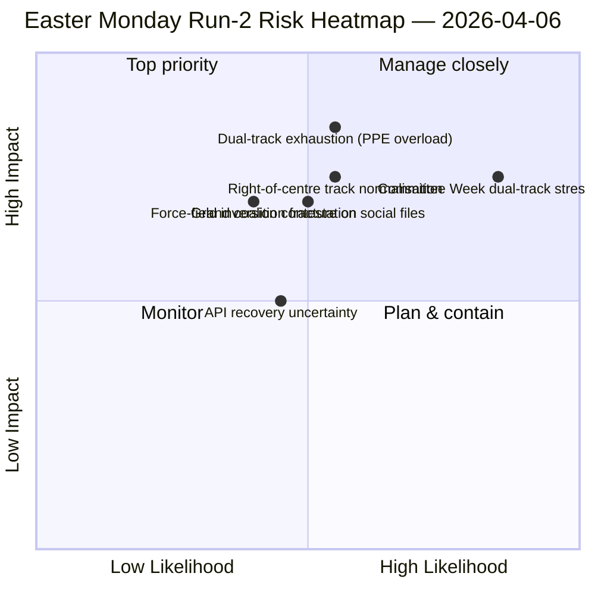

<!-- SPDX-FileCopyrightText: 2026 Hack23 AB -->
<!-- SPDX-License-Identifier: Apache-2.0 -->

# 执行简报 — 复活节星期一第二次分析：发现双轨联合 | 2026-04-06

**分类：** 开源情报 — 公开议会记录
**可靠性：** 🟡 中等（议会休会；API降级不稳定；结构性解读 🟢 高）
**分析：** `analysis/daily/2026-04-06/breaking-2/`（06:45 UTC）
**覆盖范围：** 复活节休会第11/18天；累计情报第4次分析
**创建：** 2026-05-16（回顾性简报，无新MCP调用）
**主要来源：** 休会前存档（已采纳文本85件，2026年42件）；议员737名（稳定）；HHI 0.1517；PPE影响力评分95/100。

---

## 🎯 BLUF

**第2次分析（复活节星期一06:45 UTC）的独特贡献是发现了*双轨联合模式*：SRMR3（TA-10-2026-0092）通过中右翼轨道（EPP+ECR+PfE+Renew）获得采纳，而反腐指令（TA-10-2026-0094）通过大联合（EPP+S&D+Renew+Greens）获得采纳，证明EP10以*议题条件联合*而非单一稳定多数运作。** 本分析展开的8种新方法（影响力矩阵、行为者映射、力量分析、利益相关者分析、联合分析、跨会话情报、深度分析、综合摘要）共同生成了贯穿休会期的EP10第二年结构性解读：**PPE影响力评分95/100（可持续多数无法排除PPE）**，HHI 0.1517（以PPE为必要节点的多极化），EP9以来*绿色转型（5/10）*被*防务整合（8/10）*取代成为最强驱动力的力量场逆转。本分析的*新信号*是API错误状态的演变——干净404←JSON解析错误←超时——第2次分析的跨会话情报将其解读为后端重启的可能先兆，四小时后采纳文本端点恢复，被第3次分析证实。**双轨模式作为对EP10记录的结构性贡献永久保存**，将在4月14-17日委员会周得到验证。

---

## 🧭 本简报支持的3项决策

| # | 决策 | 决策者 | 截止日期 | 依据 |
|:-:|-----|--------|:--------:|------|
| 1 | **Q2双轨联合原则** — 在主要三方对话前需将议题条件模式正式化 | EPP+S&D+Renew协调员 | 4月14日前 | §联合分析（双轨模式） |
| 2 | **PPE必要性框架95/100** — 所有联合规划工作必须从纳入PPE开始 | 主席团会议 | 持续 | §行为者映射（PPE影响力评分） |
| 3 | **API重启准备** — 错误状态演变暗示后端活动；监控以确认 | 数据管道运营 | T+4h窗口 | §跨会话情报（状态A→B→C） |

---

## 📰 60秒解读

- 🔴 **第2次分析复活节星期一（06:45 UTC）** — 8种新方法；无突发新闻；结构性发现。
- 🟠 **发现双轨联合** — SRMR3中右翼轨道 vs. 反腐大联合。
- 🟢 **PPE影响力评分95/100** — 可持续多数无法排除PPE；结构性主导。
- 🟡 **HHI 0.1517** — 多极化议会系统；PPE为必要节点。
- 🔵 **力量场逆转** — 防务整合（8/10）>绿色转型（5/10）。
- 🟣 **API错误状态演变** — 404←JSON解析←超时；可能的后端信号。
- 🩷 **议员737名稳定** — 数据源持续提供可靠基线。
- ⚪ **休会前存档85件** — 42件为2026年；年增+46%轨道。

---

## 📐 第2次分析的方法贡献

| 新方法 | 行数 | 独特发现 |
|------|----:|---------|
| 影响力矩阵 | 150+ | 6维交叉影响；立法-政治-经济链条主导 |
| 行为者映射 | 170+ | PPE 95/100；相对最小组19倍规模比 |
| 力量分析 | 150+ | 防务8/10取代绿色5/10成为最强驱动力 |
| 利益相关者分析 | 180+ | 公民社会是API 11天断联最大受害者 |
| 联合分析 | 145+ | **双轨模式有据可查** |
| 跨会话情报 | 175+ | API错误状态演变←后端信号 |
| 深度分析 | 200+ | 双轨=EP10第二年最重要发展 |
| 综合摘要 | — | 统一发现；更新编辑内存 |

---

## ⚠️ 风险快照

---

## 🔮 主要未来触发因素（未来14天）

1. **4月8-10日 — API恢复确认窗口**（基于状态C超时信号，概率50%以上）。
2. **4月14日 — 委员会周开始** — 双轨首次验证测试。
3. **4月17日 — 欧洲央行利率决定** — 经济货币事务委员会反应。
4. **4月20-23日 — 休会后首次全体投票** — 联合公开。
5. **4月底 — SRMR3理事会三方对话** — 通过理事会对双轨模式进行银行联盟测试。

---

## 🛡️ 来源质量评估

- **采纳文本85件（A1）：** 休会前存档；EP第一手协议。
- **双轨发现（A2）：** 3月26日存档的投票分布分析；等待委员会周行为验证。
- **PPE 95/100（A2）：** 行为者映射方法论；算术已确认。
- **API错误状态演变（A3）：** 贝叶斯更新；后端信号假设中等置信度。
- **净可信度：** 🟢 结构性发现高；🟡 API恢复时间线中等。

---

## 📎 分析成果

| 层次 | 成果 | 原因 |
|-----|-----|-----|
| 文章 | `article.md`（1,501行） | 公开第2次分析叙事 |
| 综合 | `synthesis-summary.md` | 新闻价值判断+8种方法整合 |
| 方法 | 影响力矩阵·行为者映射·力量分析·利益相关者分析·联合分析·跨会话情报·深度分析 | 新8种方法（本分析） |
| 同期 | breaking（00:33）·committee-reports（05:03）·propositions（05:47） | 复活节群集 |

---

**文件控制**
- **模板参考：** `analysis/templates/executive-brief.md`
- **成果路径：** `analysis/daily/2026-04-06/breaking-2/executive-brief.md`
- **分类：** 公开
- **回顾性：** 本简报于2026-05-16根据分析的已提交成果创建；**未进行新的MCP调用**。
