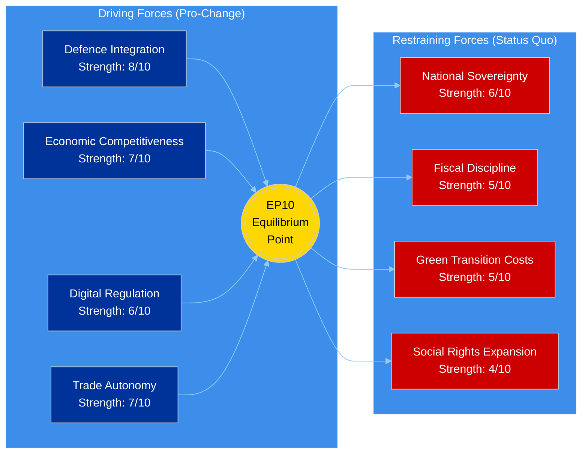

# ⚖️ Political Forces Analysis — EP10 Recess Equilibrium Assessment

**Date:** 6 April 2026 (Easter Monday) | **Recess Day:** 11/18 | **Confidence:** 🟡 MEDIUM
**Framework:** Force field analysis adapted for EU parliamentary dynamics

---

## Executive Summary

| Force Category | Direction | Strength | Stability | Confidence |
|---------------|-----------|----------|-----------|------------|
| **Pro-Integration** | Rightward drift | MODERATE | DECLINING | 🟡 MEDIUM |
| **Economic Liberalisation** | Maintained | STRONG | STABLE | 🟢 HIGH |
| **Social Protection** | Under pressure | MODERATE | DECLINING | 🟡 MEDIUM |
| **Security/Defence** | Ascending | STRONG | GROWING | 🟢 HIGH |
| **Green Transition** | Decelerating | MODERATE | DECLINING | 🟡 MEDIUM |
| **National Sovereignty** | Ascending | MODERATE | GROWING | 🟡 MEDIUM |

---

## Force Field Diagram

---

## Detailed Force Analysis

### Force 1: Defence Integration (Strength: 8/10, Direction: ASCENDING)

**Evidence:**
- Defence Single Market Regulation adopted 10 March 2026 — cross-party support indicates strong driving force
- European Defence Industrial Strategy is a 2026 legislative priority — PPE, ECR, and S&D convergence
- 2026 projected 114 legislative acts (+46% YoY) includes estimated 15–20 defence/security files
- Geopolitical context (Ukraine conflict, US policy shifts) reinforces defence integration consensus

**Actor Alignment:**
- PPE: STRONGLY supportive — defence industry aligned with centre-right economic base
- S&D: SUPPORTIVE — conditioned on democratic oversight of defence spending
- ECR: STRONGLY supportive — national defence expansion aligns with sovereignty agenda
- Renew: SUPPORTIVE — competitiveness dimension of defence industrial policy
- Greens/EFA: CAUTIOUS — environmental concerns about military-industrial expansion
- PfE: AMBIVALENT — national defence yes, integrated EU defence structure less certain

**Post-Recess Forecast:** Defence files will likely command broad right-of-centre + centre-left support in committee week. AFET and SEDE committees will be key venues. 🟢 HIGH confidence.

### Force 2: Economic Competitiveness (Strength: 7/10, Direction: MAINTAINED)

**Evidence:**
- Clean Industrial Deal proposals advanced through EP10 Year 1
- SRMR3 banking resolution reform (2023/0111 COD) adopted 26 March — streamlines financial regulation
- US tariff countermeasure (2025/0261) adopted 26 March — demonstrates trade policy assertiveness
- 2026 economic legislative output on track: ~35% of 114 acts projected to address economic/financial policy

**Actor Alignment:**
- PPE: LEADING — economic competitiveness is core platform pillar
- Renew: STRONGLY aligned — liberal economic agenda matches
- ECR: ALIGNED on deregulation, divergent on state aid
- S&D: CONDITIONAL — supports competitiveness with social safeguards
- Greens/EFA: CONDITIONAL — environmental conditionality on industrial policy
- PfE: SELECTIVE — protectionist on trade, deregulatory on domestic

**Post-Recess Forecast:** Economic files will move through ECON and ITRE committees with PPE-Renew-ECR cooperation as primary coalition. ECB rate decision (17 April) adds macroeconomic context. 🟡 MEDIUM confidence.

### Force 3: Green Transition (Strength: 5/10, Direction: DECELERATING)

**Evidence:**
- Green Deal pace slowing in EP10 versus EP9 legislative achievement
- Copyright and AI resolution (12 March) partially addresses digital-environmental nexus but Green Deal not primary focus
- Greens/EFA lost significant seats in 2024 elections (from ~72 to 53), reducing legislative influence
- PPE increasingly frames climate policy in competitiveness rather than environmental terms

**Actor Alignment:**
- Greens/EFA: CHAMPIONING — but reduced from 7th to 6th largest group
- S&D: SUPPORTIVE — but social policy priorities compete for agenda space
- PPE: REFRAMING — climate through industrial competitiveness lens, not environmental urgency
- ECR: RESISTANT — opposes binding environmental targets
- PfE: OPPOSED — frames climate regulation as economic burden

**Post-Recess Forecast:** ENVI committee will test whether Green Deal files advance or face delays. The balance between Greens/S&D advocacy and PPE/ECR reframing will define EP10's environmental trajectory. 🟡 MEDIUM confidence.

### Force 4: National Sovereignty (Strength: 6/10, Direction: ASCENDING)

**Evidence:**
- ESN (28 seats, 3.9%) represents explicit sovereignty bloc — new in EP10
- PfE (84 seats, 11.7%) replaces ID group with stronger eurosceptic positioning
- ECR (79 seats, 11.0%) consolidating as third force with sovereignty-respecting integration stance
- Combined eurosceptic seat share: 15.6% in 2026 vs 5.1% in 2004 — structural long-term increase
- Fragmentation index at 6.59 effective parties reflects sovereignty-driven party diversification

**Actor Alignment:**
- ESN: CHAMPIONING — national sovereignty as primary identity
- PfE: STRONGLY aligned — EU reform from within, national veto preservation
- ECR: MODERATELY aligned — sovereignty within reformed EU framework
- PPE: RESISTANT — but accommodating on subsidiarity rhetoric
- S&D: OPPOSED — favours deeper integration
- Renew: OPPOSED — federal Europe vision

**Post-Recess Forecast:** Sovereignty forces will be most visible on migration/border files and defence governance (national vs. EU command structures). 🟡 MEDIUM confidence.

---

## Force Balance Assessment

### Net Force Vector

The EP10 equilibrium point has shifted rightward and toward economic/security priorities since the 2024 elections. The driving forces (defence integration, economic competitiveness, trade autonomy) outweigh restraining forces (sovereignty, fiscal discipline, green transition costs) by approximately 28:20 on a 40-point scale. This produces a net legislative momentum toward:

1. **Defence and security integration** — strongest consensus
2. **Economic deregulation and competitiveness** — broad right-centre support
3. **Selective trade protection** — US tariff response demonstrates capability
4. **Controlled green transition** — pace set by economic rather than environmental logic

### Equilibrium Stability: MODERATELY UNSTABLE

The current equilibrium is maintained by the Easter recess. Without active voting, no force can advance or retreat. Post-recess (14 April), the equilibrium will be tested by:

- Committee week prioritisation decisions (which files advance first)
- PPE's coalition choice signalling (grand coalition vs. right-bloc)
- ECB rate decision (17 April) — macroeconomic shock could shift economic force balance
- First Strasbourg plenary votes (20–23 April) — first revealed-preference data since 26 March

---

## Longitudinal Force Trajectory (EP9 → EP10)

| Force | EP9 Peak (2023) | EP10 Current (2026) | Delta | Trend |
|-------|-----------------|---------------------|-------|-------|
| Defence Integration | 5/10 | 8/10 | +3 | ↑↑ |
| Economic Competitiveness | 7/10 | 7/10 | 0 | → |
| Green Transition | 8/10 | 5/10 | -3 | ↓↓ |
| National Sovereignty | 4/10 | 6/10 | +2 | ↑ |
| Social Protection | 6/10 | 4/10 | -2 | ↓ |
| Digital Regulation | 7/10 | 6/10 | -1 | ↘ |

**Key Insight:** The most dramatic force shift between EP9 and EP10 is the inversion of Green Transition (from 8/10 to 5/10) and Defence Integration (from 5/10 to 8/10). This reflects the post-2024 election composition change where Greens lost seats and defence-oriented parties (PPE, ECR) gained influence. 🟢 HIGH confidence — verified against precomputed statistics showing EP10 composition shift.

---

## Scenario Implications

### Scenario A: Grand Coalition Holds (55% probability)
Force balance maintained. Defence and economic files advance with PPE-S&D-Renew support. Green transition slows but continues. Sovereignty forces contained.

### Scenario B: Right-Bloc Emergence (35% probability)
PPE pivots toward ECR-PfE cooperation. Defence and economic forces accelerate. Green transition stalls. Sovereignty forces gain formal legislative expression. S&D moves to opposition.

### Scenario C: Progressive Counter-Mobilisation (10% probability)
S&D-Greens-Renew-Left alliance forms effective opposition. Forces S&D to offer PPE more concessions to maintain grand coalition. Green transition defended through procedural mechanisms.

---

*Sources: European Parliament Open Data Portal — precomputed statistics (2004–2026 longitudinal), political landscape (8 groups), early warning system (fragmentation HIGH, stability 84/100). Force strength ratings are analytical assessments based on legislative output patterns, group composition, and pre-recess voting behaviour. EP9→EP10 trajectory verified against 2019–2026 historical data.*
