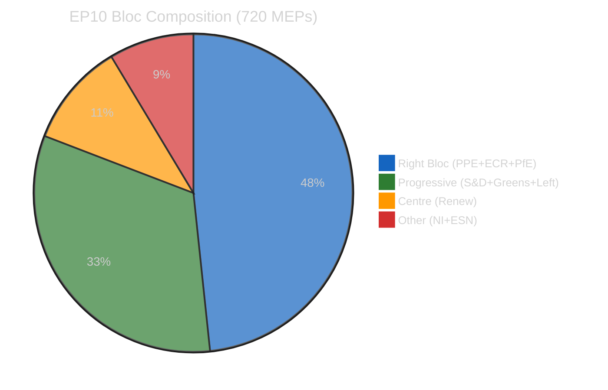
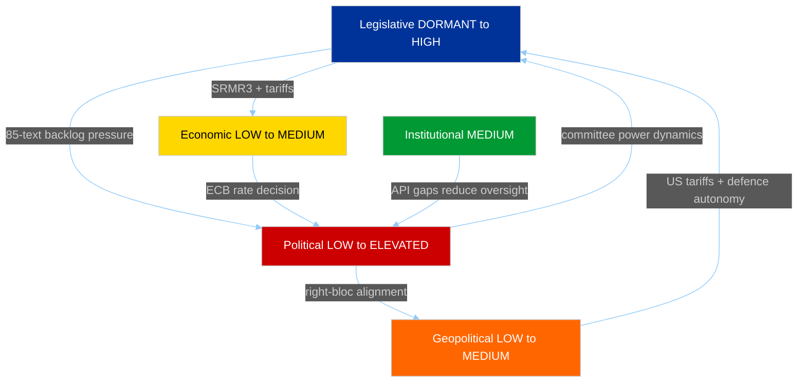

# 📊 Impact Matrix — Easter Monday Cross-Dimensional Assessment

**Date:** 6 April 2026 (Monday — Easter Monday) | **Recess Day:** 11/18 | **Confidence:** 🟡 MEDIUM
**Run:** breaking-2 (06:45 UTC) | **Cross-References:** breaking (00:33), committee-reports (05:03), propositions (05:47)

---

## Executive Summary

| Dimension | Current Impact | Post-Recess Projection | Trend | Confidence |
|-----------|---------------|----------------------|-------|------------|
| **Legislative** | DORMANT | HIGH (+46% YoY target) | ↑ | 🟢 HIGH |
| **Political** | LOW (structural only) | ELEVATED (committee power plays) | ↗ | 🟡 MEDIUM |
| **Institutional** | MEDIUM (API degradation) | LOW (expected recovery) | → | 🟡 MEDIUM |
| **Economic** | LOW | MEDIUM (ECB decision 17 Apr) | ↗ | 🟡 MEDIUM |
| **Social** | NEGLIGIBLE | LOW | → | 🟡 MEDIUM |
| **Geopolitical** | LOW | MEDIUM (US tariff response) | ↗ | 🟢 HIGH |

---

## Cross-Dimensional Impact Assessment

### 1. Legislative Impact — DORMANT → HIGH

**Current State (Easter Monday):** Zero legislative activity. Parliament on recess since 27 March 2026. No votes, no committee meetings, no plenary sessions.

**Post-Recess Projection (14–23 April):** EP10 is tracking toward a record 114 legislative acts in 2026 (+46% versus 78 in 2025). The pre-recess sprint yielded 42 EP10-2026 adopted texts (TA-10-2026-0035 through TA-10-2026-0104), confirming above-average productivity. 🟢 HIGH confidence — verified against precomputed statistics.

**Impact Quantification:**
- **Legislative velocity:** 2.11 acts per session (2026) vs 1.47 (2025) — 44% acceleration
- **Roll-call vote intensity:** 567 projected votes (2026) vs 420 (2025) — 35% increase
- **Committee meeting load:** 2,363 projected (2026) vs 1,980 (2025) — 19% increase
- **Pipeline pressure:** 85 adopted texts in one-week feed backlog requiring post-recess processing

**Key Legislative Files from Pre-Recess Sprint (per propositions analysis):**

| File | Type | Status | Impact |
|------|------|--------|--------|
| SRMR3 (2023/0111 COD) | Banking resolution reform | EP position adopted 26 March | HIGH — restructures Single Resolution Mechanism |
| Anti-Corruption (2023/0135 COD) | Directive | EP position adopted 26 March | HIGH — first EU-wide anti-corruption framework |
| US Tariff Adjustments (2025/0261) | Trade measure | Adopted 26 March | MEDIUM — EU countermeasure to US tariff escalation |
| EU Talent Pool Regulation | Labour mobility | Adopted 10 March | MEDIUM — cross-border recruitment platform |
| Copyright and AI Resolution | Digital regulation | Adopted 12 March | MEDIUM — AI training data governance |

### 2. Political Impact — LOW → ELEVATED

**Current State:** Structural power dynamics frozen during recess. No voting activity to reveal group alignments or defections.

**Post-Recess Projection:** Committee week (14–17 April) will be the first test of EP10 political dynamics since the pre-recess sprint. Three key tensions will surface:

1. **PPE Dominance Test:** PPE (185 seats, 25.7%) holds the largest group with 19× size ratio versus the smallest group (early warning: DOMINANT_GROUP_RISK HIGH). Committee chair negotiations will reveal whether PPE pursues collaborative or dominant strategy. 🟡 MEDIUM confidence.

2. **Right-Bloc Alignment Signal:** PPE + ECR + PfE = 52.3% combined seat share. Pre-recess cooperation on SRMR3 banking reform and US tariff response demonstrated policy convergence. Post-recess committee votes will indicate whether ad hoc cooperation is formalising. 🟡 MEDIUM confidence.

3. **Progressive Alliance Response:** S&D + Greens/EFA + GUE/NGL = 32.6% — insufficient for blocking minority (needs 33.3%). Progressive groups must attract Renew (10.6%) for effective opposition. Anti-corruption directive success showed this coalition CAN form on specific files. 🟡 MEDIUM confidence.

### 3. Institutional Impact — MEDIUM (API Degradation)

**Current State:** EP API infrastructure has been degraded for 11 consecutive days (since 28 March). 6/8 feed endpoints returning HTTP 404 errors. This represents the longest sustained API outage observed in EP10 monitoring history.

**Impact Assessment:**
- **Democratic monitoring:** External transparency tools (including this platform) operate at reduced capacity — only adopted texts and MEP feeds available. 🟢 HIGH confidence.
- **Academic research:** Researchers relying on EP Open Data Portal face 11-day data gap in events, procedures, documents, committee records, and parliamentary questions.
- **Media coverage:** Journalists without direct EP access have reduced ability to track pre-recess decisions during the holiday news cycle.

**New Signal (6 April):** The adopted texts endpoint has begun cycling between 404 errors and JSON parse errors (observed in today's primary feed call). This is a novel failure mode not seen in the previous 10 days — potentially indicating backend maintenance or configuration changes. 🟡 MEDIUM confidence — ambiguous signal.

```mermaid
%%{init: {"theme":"dark","themeVariables":{"primaryColor":"#1565C0","primaryTextColor":"#ffffff","primaryBorderColor":"#0A3F7F","lineColor":"#90CAF9","secondaryColor":"#2E7D32","secondaryTextColor":"#ffffff","secondaryBorderColor":"#0F3F00","tertiaryColor":"#FF9800","tertiaryTextColor":"#000000","tertiaryBorderColor":"#7F4F00","mainBkg":"#1565C0","secondBkg":"#2E7D32","tertiaryBkg":"#FF9800","noteBkgColor":"#FFC107","noteTextColor":"#000000","noteBorderColor":"#7F6000","errorBkgColor":"#D32F2F","errorTextColor":"#ffffff","fontFamily":"Inter, Helvetica, Arial, sans-serif","pie1":"#1565C0","pie2":"#2E7D32","pie3":"#FF9800","pie4":"#D32F2F","pie5":"#FFC107","pie6":"#7B1FA2","pie7":"#9E9E9E","pie8":"#0288D1","pie9":"#388E3C","pie10":"#F57C00","pie11":"#C62828","pie12":"#FBC02D","pieTitleTextSize":"18px","pieSectionTextSize":"14px","pieLegendTextSize":"13px","pieStrokeColor":"#1e1e1e","pieOuterStrokeColor":"#1e1e1e","git0":"#1565C0","git1":"#2E7D32","git2":"#FF9800","git3":"#D32F2F","gitBranchLabel0":"#ffffff","gitBranchLabel1":"#ffffff","gitBranchLabel2":"#000000","gitBranchLabel3":"#ffffff","cScale0":"#1565C0","cScale1":"#2E7D32","cScale2":"#FF9800","cScale3":"#D32F2F","cScale4":"#FFC107","cScale5":"#7B1FA2","cScale6":"#9E9E9E","cScale7":"#0288D1","xyChart":{"backgroundColor":"#1e1e1e","plotColorPalette":"#1565C0,#2E7D32,#FF9800,#D32F2F,#FFC107,#7B1FA2,#9E9E9E"}}}}%%
graph LR
    subgraph "EP API Status Day 11"
        A["Adopted Texts — Intermittent"] -.-> B["Backend Maintenance?"]
        C["MEPs Feed — Operational"] --> D["Stable Data Source"]
        E["Events — 404"] -.-> F["11-day Outage"]
        G["Procedures — 404/Timeout"] -.-> F
        H["Documents — Timeout"] -.-> I["Infrastructure Strain"]
        J["Plenary Docs — Timeout"] -.-> I
        K["Committee Docs — Timeout"] -.-> I
        L["Questions — Timeout"] -.-> I
    end

    style A fill:#ffc107,color:#000
    style C fill:#28a745,color:#fff
    style E fill:#dc3545,color:#fff
    style G fill:#dc3545,color:#fff
    style H fill:#dc3545,color:#fff
    style J fill:#dc3545,color:#fff
    style K fill:#dc3545,color:#fff
    style L fill:#dc3545,color:#fff
```

### 4. Economic Impact — LOW → MEDIUM

**Current State:** No direct economic legislative activity during Easter recess.

**Post-Recess Projection:**
- **ECB Rate Decision (17 April):** Coincides with committee week. ECON committee will likely convene a hearing or debate. ECB decisions interact with EP economic governance framework.
- **SRMR3 Banking Reform (adopted 26 March):** The Single Resolution Mechanism revision has direct implications for EU banking stability, cross-border resolution procedures, and deposit insurance. Trilogue with Council expected Q2 2026.
- **US Tariff Response (2025/0261, adopted 26 March):** EP trade countermeasure to US tariff escalation has market-moving implications for EU-US trade relations.

**Quantified Economic Indicators:**
- 2026 projected legislative output includes 114 legislative acts — approximately 30–35% address economic/financial policy areas based on EP9-EP10 historical proportions
- 6,147 projected parliamentary questions in 2026, with Commission economic oversight representing the largest question category historically

### 5. Social Impact — NEGLIGIBLE → LOW

**Current State:** No direct social policy impact during Easter recess.

**Post-Recess Watch:**
- EU Talent Pool Regulation (adopted 10 March): Labour mobility implications for workers across 27 member states
- Housing Crisis Resolution: Referenced in pre-recess propositions analysis as pending legislation
- Package Travel Directive: Consumer protection update with cross-border implications

### 6. Geopolitical Impact — LOW → MEDIUM

**Current State:** Limited but significant — US tariff response (2025/0261) adopted during pre-recess sprint positions EU in active trade dispute.

**Post-Recess Projection:**
- **Defence Single Market Regulation:** Adopted 10 March, advances EU strategic autonomy agenda. Committee week may see AFET/SEDE follow-up
- **US Tariff Escalation:** Council response to EP position expected in April. Trade committee (INTA) likely to schedule hearings
- **European Defence Industrial Strategy:** Priority legislative file for 2026, committee deliberations expected to intensify post-recess

---

## Impact Interconnection Matrix

**Key Interconnection:** The Legislative → Political → Economic chain is the dominant pathway for post-recess impact transmission. The 85-text backlog creates processing pressure (Legislative), which forces committee prioritisation decisions (Political), which affects regulatory outcomes for banking reform and trade policy (Economic). The institutional dimension (API degradation) creates an information asymmetry that amplifies political uncertainty.

---

## Forward-Looking Impact Calendar

| Date | Event | Primary Dimension | Expected Impact |
|------|-------|-------------------|-----------------|
| 8 April | Staff return (expected) | Institutional | API partial recovery possible |
| 14–17 April | **Committee Week** | Political + Legislative | ELEVATED — first post-recess test |
| 17 April | **ECB Rate Decision** | Economic + Political | MEDIUM — ECON committee reaction |
| 20–23 April | **Strasbourg Plenary** | All dimensions | HIGH — first post-recess voting |
| Late April | SRMR3 trilogue begins | Economic + Legislative | HIGH — banking reform negotiations |

---

*Sources: European Parliament Open Data Portal (adopted texts feed, MEPs feed, precomputed statistics 2024–2026), EP MCP early warning system (stability score 84/100, 3 warnings), political landscape analysis (8 groups, 720 MEPs). Cross-referenced with breaking (00:33 UTC), committee-reports (05:03 UTC), and propositions (05:47 UTC) analyses from 6 April 2026.*
