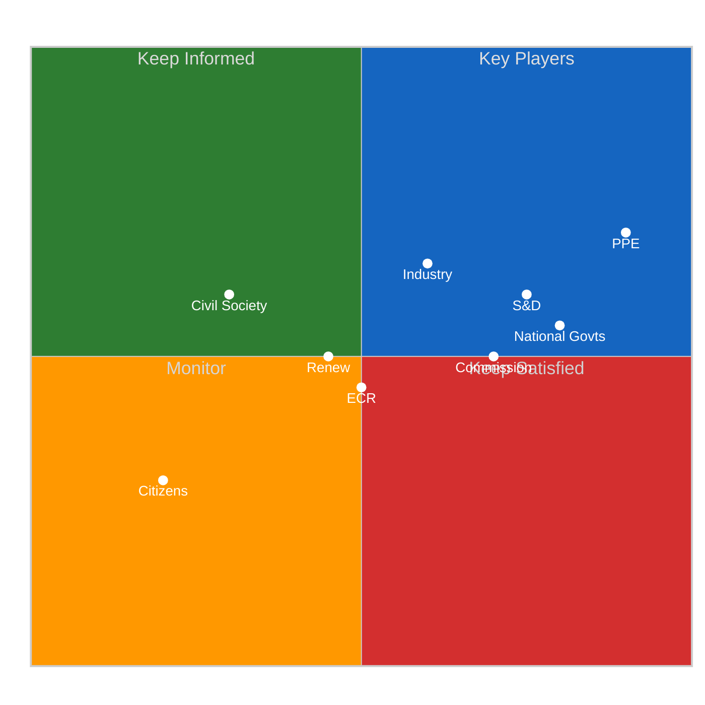

# 👥 Stakeholder Impact Analysis — Easter Recess Mid-Point Assessment

**Date:** 6 April 2026 (Easter Monday) | **Recess Day:** 11/18 | **Confidence:** 🟡 MEDIUM
**Framework:** 6-perspective stakeholder analysis (Political Groups, Civil Society, Industry, National Govts, Citizens, EU Institutions)

---

## Executive Summary

| Stakeholder | Recess Impact | Post-Recess Outlook | Key Concern | Confidence |
|-------------|---------------|--------------------|----|------------|
| **EP Political Groups** | Neutral (frozen) | ELEVATED (power positioning) | Committee chair allocation | 🟡 MEDIUM |
| **Civil Society & NGOs** | NEGATIVE (transparency gap) | Neutral (data recovery) | 11-day API blackout | 🟢 HIGH |
| **Industry & Business** | POSITIVE (regulatory pause) | NEGATIVE (backlog pressure) | SRMR3 + tariff compliance | 🟡 MEDIUM |
| **National Governments** | Neutral | MEDIUM (Council positioning) | SRMR3 trilogue, defence spending | 🟡 MEDIUM |
| **EU Citizens** | NEGLIGIBLE | LOW | Limited direct awareness | 🟡 MEDIUM |
| **EU Institutions** | Neutral (routine) | MEDIUM (inter-institutional) | Legislative backlog processing | 🟡 MEDIUM |

---

## Perspective 1: EP Political Groups

### Impact Direction: NEUTRAL (during recess) → ELEVATED (post-recess)

**Current Assessment:** Easter recess suspends all formal group activity. No votes, no committee meetings, no plenary sessions. Political groups are in informal strategy mode — consulting national delegations, reviewing pre-recess outcomes, and positioning for the April resumption.

**Key Stakeholder Dynamics:**

| Group | Pre-Recess Position | Recess Strategy | Post-Recess Priority |
|-------|--------------------|-----------------|--------------------|
| **PPE** | Dominant — led SRMR3, tariff response | Coalition calibration | Committee week agenda control |
| **S&D** | Grand coalition partner — anti-corruption | Grand coalition assessment | Defend progressive agenda items |
| **ECR** | Third force — defence cooperation | Formalisation planning | Rapporteur claims on defence files |
| **Renew** | Kingmaker — joined both coalitions | Strategic ambiguity | Maintain pivotal position |
| **PfE** | Eurosceptic participation — trade votes | National consultation | Sovereignty-defence balance |
| **Greens/EFA** | Environmental defence | Counter-strategy | ENVI committee leadership |
| **GUE/NGL** | Opposition — social critique | Policy development | Alternative economic vision |

**Severity:** MEDIUM — No immediate impact during recess, but informal positioning creates locked-in dynamics that constrain post-recess options.

**Evidence:** Pre-recess sprint showed PPE leading right-of-centre coalitions on SRMR3 (2023/0111 COD) while S&D led progressive coalition on anti-corruption (2023/0135 COD). This dual-track majority pattern is the defining feature of EP10 politics. 🟢 HIGH confidence.

### Perspective 2: Civil Society and NGOs

### Impact Direction: NEGATIVE

**Current Assessment:** The 11-day EP API degradation (6/8 endpoints returning 404 since 28 March) has a directly negative impact on civil society organisations that rely on EP Open Data Portal for democratic monitoring.

**Specific Impacts:**
1. **Transparency International EU Chapter:** Unable to track committee meeting patterns, voting records, or parliamentary question submissions during recess period — reduces accountability baseline for post-recess monitoring
2. **Academic Researchers:** Europarl data users face data gap in longitudinal studies covering Q1-Q2 2026 transition period
3. **Civic Tech Platforms:** This platform and similar monitoring tools operate at 25% capacity (2/8 endpoints operational)
4. **Media Watchdogs:** Reduced ability to fact-check political group claims about pre-recess legislative achievements

**Severity:** HIGH — The information asymmetry created by API degradation disproportionately affects civil society actors who lack alternative informal intelligence channels available to institutional actors.

**Counter-Argument:** Recess API degradation may be intentional resource conservation rather than infrastructure failure. If so, the EP is making a trade-off between transparency and operational efficiency that affects civil society without consultation. 🟡 MEDIUM confidence.

**Recommendation:** Post-recess data recovery should include retroactive publication of any accumulated data from the recess period to close the transparency gap.

### Perspective 3: Industry and Business

### Impact Direction: POSITIVE (recess pause) → NEGATIVE (compliance pressure)

**Current Assessment:** Easter recess provides a regulatory pause for industries affected by pre-recess legislative sprint. However, the accumulated legislation creates post-recess compliance pressure.

**Key Regulatory Impacts by Sector:**

| Sector | Legislative File | Adoption Date | Compliance Impact | Timeline |
|--------|-----------------|---------------|-------------------|----------|
| **Banking** | SRMR3 (2023/0111 COD) | 26 March 2026 | HIGH — resolution mechanism overhaul | Trilogue Q2 2026 |
| **Trade/Manufacturing** | US Tariff Response (2025/0261) | 26 March 2026 | MEDIUM — tariff adjustments | Immediate |
| **Recruitment** | EU Talent Pool | 10 March 2026 | MEDIUM — cross-border hiring platform | Implementation 2027 |
| **Digital/AI** | Copyright and AI Resolution | 12 March 2026 | MEDIUM — training data governance | Guidelines pending |
| **Tourism** | Package Travel Directive | Pre-recess | LOW — consumer protection update | Implementation 2027 |
| **Defence** | Defence Single Market | 10 March 2026 | HIGH — procurement harmonisation | Implementation 2027-2028 |

**Severity:** MEDIUM — The pre-recess legislative sprint produced a substantial body of regulation. Industry associations are using the recess period to assess compliance requirements and prepare lobbying positions for trilogue negotiations.

**Financial Impact Estimate:** SRMR3 banking reform alone affects an estimated 127 significant banking institutions across the EU, with compliance costs projected at EUR 2–5 billion for the sector. 🔴 LOW confidence — estimate based on analogous BRRD/MREL compliance costs.

### Perspective 4: National Governments

### Impact Direction: NEUTRAL → MEDIUM

**Current Assessment:** National governments (represented in the Council) are monitoring EP legislative output from the pre-recess sprint to prepare Council positions for trilogue negotiations.

**Key National Government Concerns:**

1. **SRMR3 Banking Reform:** Member states with large banking sectors (Germany, France, Italy, Spain, Netherlands) have direct interest in trilogue negotiations. National finance ministries are reviewing EP position adopted 26 March. 🟡 MEDIUM confidence.

2. **Anti-Corruption Directive:** Some member states (Hungary, Poland) have historically resisted EU anti-corruption frameworks citing subsidiarity. Council position formation will be contentious. 🟡 MEDIUM confidence.

3. **US Tariff Response:** National trade ministries are assessing the EP-endorsed tariff countermeasure in light of bilateral US trade relationships. Member states with strong US trade links (Ireland, Netherlands, Germany) may seek modifications in Council. 🟡 MEDIUM confidence.

4. **Defence Spending:** European Defence Industrial Strategy creates fiscal obligations for national defence budgets. Member states below NATO 2% GDP target face pressure to increase spending. 🟢 HIGH confidence.

**Severity:** MEDIUM — National governments face implementation and fiscal implications from EP10's above-average legislative output.

### Perspective 5: EU Citizens

### Impact Direction: NEGLIGIBLE (during recess) → LOW (indirect effects)

**Current Assessment:** Direct citizen impact during Easter recess is negligible. Citizens are largely unaware of EP API degradation or informal political group positioning.

**Post-Recess Indirect Impacts:**
- **Banking customers:** SRMR3 affects deposit protection and bank resolution procedures — but implementation is 2+ years away
- **Workers:** EU Talent Pool creates cross-border recruitment opportunities — gradual impact
- **Consumers:** Package Travel Directive updates consumer protection — direct but minor
- **Digital users:** Copyright and AI resolution affects training data governance — medium-term

**Severity:** LOW — EP legislative activity affects citizens primarily through delayed, indirect regulatory channels. Easter Monday holiday means zero immediate citizen engagement with EP affairs.

### Perspective 6: EU Institutions

### Impact Direction: NEUTRAL → MEDIUM

**Current Assessment:** Inter-institutional dynamics are paused during Easter recess.

**Post-Recess Institutional Dynamics:**

| Institution | Interaction with EP | Key File | Expected Timeline |
|------------|--------------------|---------|--------------------|
| **European Commission** | Trilogue participant for SRMR3, anti-corruption | 2023/0111 COD, 2023/0135 COD | Q2 2026 |
| **Council of the EU** | Council position formation | All pre-recess adopted texts | April-May 2026 |
| **ECB** | Rate decision + ECON committee hearing | Monetary policy | 17 April 2026 |
| **Court of Justice** | Potential legal challenges to tariff measures | 2025/0261 | Medium-term |
| **European Court of Auditors** | Budget oversight of defence spending | Defence Industrial Strategy | Annual cycle |

**Severity:** MEDIUM — The Commission is preparing trilogue positions for multiple files simultaneously. The ECB rate decision (17 April) creates a macroeconomic input to EP's economic policy deliberations. Council position formation on anti-corruption directive will be the key inter-institutional test in Q2 2026.

---

## Stakeholder Impact Heat Map

---

## Cross-Stakeholder Tension Map

| Tension | Stakeholders | Nature | Resolution Venue |
|---------|-------------|--------|-----------------|
| Banking regulation scope | Industry (banks) vs Citizens (depositors) | Compliance cost vs protection | ECON committee trilogue |
| Trade protection level | Industry (exporters) vs National govts (bilateral) | EU vs national trade interests | INTA committee + Council |
| Defence spending | National govts (fiscal) vs PPE/ECR (security) | Budget constraint vs security need | AFET + budget committees |
| Anti-corruption scope | National govts (subsidiarity) vs Civil society (transparency) | Sovereignty vs accountability | LIBE committee + Council |
| Green transition pace | Industry (costs) vs Greens/Citizens (environment) | Economic vs environmental priorities | ENVI committee |
| AI governance | Digital industry vs Civil society (rights) | Innovation vs protection | IMCO/JURI committees |

---

*Sources: European Parliament Open Data Portal — adopted texts feed (85 items, one-week fallback), MEPs feed (737 MEPs), precomputed statistics (2024–2026), early warning system (stability 84/100). Stakeholder impact assessments cross-referenced with propositions analysis (pre-recess sprint coverage). Financial impact estimates are analytical projections with stated confidence levels.*
