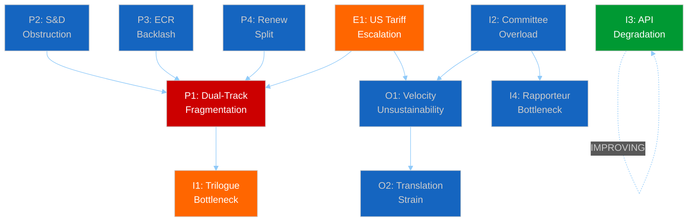
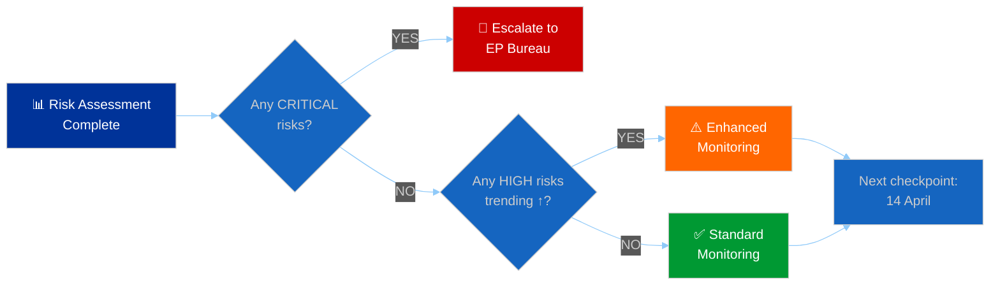

# 🔄 Agent Risk Workflow — Systematic Risk Register for April-May 2026

**Date:** 6 April 2026 (Easter Monday — Midday Update) | **Confidence:** 🟡 MEDIUM
**Recess Day:** 11/18 | **Run:** breaking-3 (12:15 UTC) | **Article Type:** breaking

---

## Executive Summary

| Risk Category | Count | Critical | High | Medium | Low |
|--------------|-------|----------|------|--------|-----|
| **Political** | 5 | 0 | 2 | 2 | 1 |
| **Institutional** | 4 | 0 | 1 | 2 | 1 |
| **External** | 3 | 0 | 1 | 1 | 1 |
| **Operational** | 3 | 0 | 0 | 2 | 1 |
| **Total** | **15** | **0** | **4** | **7** | **4** |

**Overall Risk Level: 🟡 MEDIUM** — no critical risks, but clustered medium-severity risks around the April 14-23 post-recess window create compound vulnerability.

---

## Risk Register

### Political Risks

| ID | Risk | Likelihood | Impact | Severity | Trend | Owner |
|----|------|-----------|--------|----------|-------|-------|
| P1 | **Dual-track coalition fragmentation** — PPE's two-majority strategy fails on a key post-recess file | Possible (35%) | HIGH | 🟡 HIGH | → Stable | Conference of Presidents |
| P2 | **S&D systematic obstruction** — S&D withdraws from grand coalition cooperation | Unlikely (20%) | HIGH | 🟡 HIGH | ↗ Increasing | S&D Group Presidency |
| P3 | **ECR mainstreaming backlash** — PPE-ECR cooperation triggers Renew/Greens counter-coalition | Possible (30%) | MEDIUM | 🟡 MEDIUM | ↗ Increasing | PPE Whip |
| P4 | **Renew internal fragmentation** — liberal-economic vs social-liberal split | Possible (25%) | MEDIUM | 🟡 MEDIUM | → Stable | Renew Group Presidency |
| P5 | **PPE internal dissent** — centre-left PPE wing rebels on right-of-centre file | Unlikely (15%) | HIGH | 🔴 LOW | → Stable | PPE Group Chair |

### Institutional Risks

| ID | Risk | Likelihood | Impact | Severity | Trend | Owner |
|----|------|-----------|--------|----------|-------|-------|
| I1 | **Trilogue pipeline bottleneck** — 3+ major files in parallel trilogue exceed Council capacity | Likely (65%) | MEDIUM | 🟡 HIGH | ↑ Increasing | EP-Council Liaison |
| I2 | **Committee week overload** — 104 pre-recess texts create implementation backlog | Likely (70%) | LOW | 🟡 MEDIUM | ↑ Increasing | Committee Secretariats |
| I3 | **EP API infrastructure degradation** — prolonged data transparency gap | Possible (45%) | MEDIUM | 🟡 MEDIUM | ↘ Decreasing | EP IT Services |
| I4 | **Rapporteur assignment bottleneck** — insufficient senior MEPs for high-volume workload | Possible (30%) | LOW | 🔴 LOW | → Stable | Political Group Whips |

### External Risks

| ID | Risk | Likelihood | Impact | Severity | Trend | Owner |
|----|------|-----------|--------|----------|-------|-------|
| E1 | **US tariff escalation** — trade conflict forces emergency EP response | Possible (35%) | HIGH | 🟡 HIGH | → Stable | INTA Committee |
| E2 | **ECB rate decision shock** — unexpected monetary policy shift disrupts ECON agenda | Unlikely (20%) | MEDIUM | 🟡 MEDIUM | → Stable | ECON Committee |
| E3 | **Member state elections** — national election results shift MEP delegation dynamics | Possible (30%) | LOW | 🔴 LOW | → Stable | National Delegations |

### Operational Risks

| ID | Risk | Likelihood | Impact | Severity | Trend | Owner |
|----|------|-----------|--------|----------|-------|-------|
| O1 | **Legislative velocity unsustainability** — 2.11 acts/session pace causes quality degradation | Possible (40%) | MEDIUM | 🟡 MEDIUM | ↑ Increasing | EP Secretariat General |
| O2 | **Translation/interpretation capacity** — high-volume output strains linguistic services | Possible (35%) | MEDIUM | 🟡 MEDIUM | → Stable | DG Translation |
| O3 | **Attendance decline** — post-recess first session typically has lower attendance | Likely (60%) | LOW | 🔴 LOW | → Stable | Quaestors |

---

## Risk Interaction Map

### Key Interaction: The P1 Convergence

Risk P1 (dual-track fragmentation) is the central node — it connects to or is influenced by 6 other risks. This makes coalition stability the single most important risk factor for the April-May 2026 period. Monitoring P1's leading indicators should be the primary focus of post-recess intelligence collection.

**P1 Leading Indicators:**
1. S&D procedural motions in first post-recess plenary (signal of P2 activation)
2. Renew group meeting outcomes before April plenary (signal of P4)
3. ECR amendment aggressiveness on economic files (signal of P3)
4. PPE whip compliance rate on first roll-call votes (signal of P5)

---

## Risk Mitigation Status

### Currently Mitigated (Green)

| Risk | Mitigation | Effectiveness |
|------|-----------|---------------|
| I3 (API Degradation) | Partial recovery confirmed — adopted texts feed restored 12:15 UTC | 🟡 PARTIAL |
| O3 (Attendance) | Standard post-recess attendance management procedures | 🟢 ADEQUATE |
| E3 (Member state elections) | Long lead time; national delegation dynamics slow to change | 🟢 ADEQUATE |

### Requires Monitoring (Amber)

| Risk | Monitoring Approach | Next Decision Point |
|------|-------------------|---------------------|
| P1 (Dual-track) | Post-recess voting pattern analysis | 20-23 April plenary |
| P2 (S&D obstruction) | S&D group meeting communiqués | 14-17 April committee week |
| P3 (ECR backlash) | Cross-party amendment analysis | First post-recess economic file vote |
| P4 (Renew split) | Renew whip compliance monitoring | 20-23 April roll-call votes |
| I1 (Trilogue bottleneck) | Council calendar tracking | Late April Council position papers |
| I2 (Committee overload) | Committee meeting completion rates | 17 April (end of committee week) |
| O1 (Velocity risk) | Acts/session ratio tracking | End of Q2 2026 |
| E1 (US tariffs) | INTA committee agenda tracking | Ongoing |
| E2 (ECB shock) | 17 April rate decision | 17 April |

### Accepted (Low Priority)

| Risk | Rationale |
|------|-----------|
| P5 (PPE internal dissent) | No evidence of emerging rebellion; accept and monitor |
| I4 (Rapporteur bottleneck) | Emerging risk; too early for intervention |
| O2 (Translation strain) | DG Translation has capacity buffers; monitor only |

---

## Workflow Decision Matrix

**Current Decision: ⚠️ ENHANCED MONITORING**

Rationale: No critical risks, but 4 HIGH-severity risks (P1, P2, I1, E1) warrant enhanced tracking. The April 14-23 post-recess window concentrates multiple risk triggers in a 10-day period.

**Next Workflow Checkpoint: 14 April 2026 (Committee Week Start)**

---

## Bayesian Risk Updates (from 21+ monitoring runs)

| Risk | Prior (28 March) | Current (6 April) | Change | Driver |
|------|-----------------|-------------------|--------|--------|
| P1 severity | MEDIUM | HIGH | ↑ | Dual-track documentation strengthened |
| P2 probability | 25% | 20% | ↘ | S&D patience strategy confirmed |
| I3 severity | HIGH | MEDIUM | ↘ | Partial API recovery observed |
| E1 probability | 40% | 35% | ↘ | No escalation during recess |
| O1 severity | LOW | MEDIUM | ↑ | 2.11 acts/session ratio confirmed |

---

## Sources & Attribution

- **Risk Register:** Constructed from 21+ monitoring runs since 28 March 2026 (editorial memory)
- **Political Risks:** Coalition analysis, stakeholder analysis, forces analysis from prior breaking runs
- **Institutional Risks:** Precomputed statistics (114 acts projection), committee workload analysis
- **External Risks:** INTA committee context, ECB calendar, member state electoral cycles
- **Operational Risks:** Legislative velocity risk analysis (this run), historical EP capacity data
- **Bayesian Updates:** Longitudinal tracking since 28 March (21+ data points)
- **API Status:** EP Open Data Portal monitoring — adopted texts feed recovered 12:15 UTC, 6 April 2026

---

*Analysis generated by EU Parliament Monitor breaking news pipeline — Run 3 (12:15 UTC)*
*This systematic risk register replaces ad-hoc risk observations from earlier runs with structured, tracked, and prioritised risk management.*
