# Breaking — 2026-04-06

<h2 id="section-executive-brief">Executive Brief</h2>

### 🎯 BLUF

**Run-3 produces the day's most consequential operational finding — the *first confirmed EP API endpoint recovery* during the 11-day recess: the adopted-texts feed transitioned from Mode-B (JSON parse errors at 06:45 UTC) to clean success (86 items returned at 12:15 UTC), validating Run-2's "backend reactivation" hypothesis.** Beyond the monitoring signal, the run completes the remaining six analysis methods not covered in earlier breaking runs and produces three structural contributions: **(a) Consequence Trees** map three cascading effect chains — legislative-sprint → implementation cascade, API-recovery → data-transparency cascade, PPE dual-track → political-capital cascade — converging on April 14–23 as the **"convergence zone"** where Committee Week, ECB rate decision, and first post-recess plenary votes co-occur; **(b) Legislative Velocity Risk** documents EP10 Year 2 as **2.11 acts/session, +44% YoY, the highest since EP7's 2012 Eurozone crisis response** — a velocity-sustainability concern flagged for Q2–Q3; **(c) Political Capital Risk** identifies group-level capital dynamics — **PPE accumulating, Greens/EFA declining, Renew burning fastest** — with system resilience 6/10 and a single-point-of-failure at PPE. The run's risk register tallies 15 risks (0 critical, 4 high, 7 medium, 4 low), with trilogue overload (HIGH, Likely) and US tariffs (HIGH, Possible) as the top two. Resilience score 5.8/10 indicates measurable but non-critical strain.

---

### 🧭 3 Decisions This Brief Supports

| # | Decision | Who decides | Deadline | Evidence |
|:-:|----------|-------------|:--------:|----------|
| 1 | **Convergence-zone elevated monitoring** — April 14–23 needs T+0/+1/+2 trip-wires | EP intelligence ops; press service | by April 12 | §Consequence Trees (convergence zone) |
| 2 | **Velocity-sustainability concern review** — 2.11 acts/session unsustainable beyond Q2 | Conference of Presidents | rolling Q2 | §Velocity Risk (+44% YoY) |
| 3 | **Renew capital-burn monitoring** — fastest-burning group; mid-term stability concern | Renew leadership; EPP coordination | rolling | §Political Capital Risk (Renew) |

---

### 📰 60-Second Read

- 🔴 **First confirmed API endpoint recovery** — adopted-texts feed Mode-B → success (86 items).
- 🟠 **Convergence zone April 14–23** — Committee Week + ECB + plenary co-occur.
- 🟢 **Velocity anomaly: 2.11 acts/session (+44% YoY)** — highest since EP7's 2012 Eurozone response.
- 🟡 **Political capital:** PPE accumulating · Greens declining · Renew burning fastest.
- 🔵 **System resilience 6/10** — single-point-of-failure at PPE.
- 🟣 **15-risk register:** 0 critical · 4 high · 7 medium · 4 low; resilience 5.8/10.
- 🩷 **Top 2 risks:** Trilogue overload (HIGH, Likely) · US tariffs (HIGH, Possible).
- ⚪ **Confidence MEDIUM** — primary recovery observation; structural readings high.

---

### 🌳 Three Cascading Effect Chains (Run-3 distinguishing contribution)

| Chain | Trigger | Cascade | Convergence point |
|-------|---------|---------|-------------------|
| **Legislative sprint → Implementation cascade** | Pre-recess March 26 burst | 42 EP10-2026 texts enter implementation Q2 | April 14–17 Committee Week |
| **API recovery → Data transparency cascade** | Adopted-texts Mode-B→clean recovery | Other endpoints follow; full transparency restored | April 8–10 expected |
| **PPE dual-track → Political capital cascade** | March 26 dual-track adoption | Capital accumulation at PPE; burn at Renew | April 20–23 first plenary |

**Convergence zone:** April 14–23 — all three chains land in the same 10-day window.

---

### ⚠️ Risk Snapshot

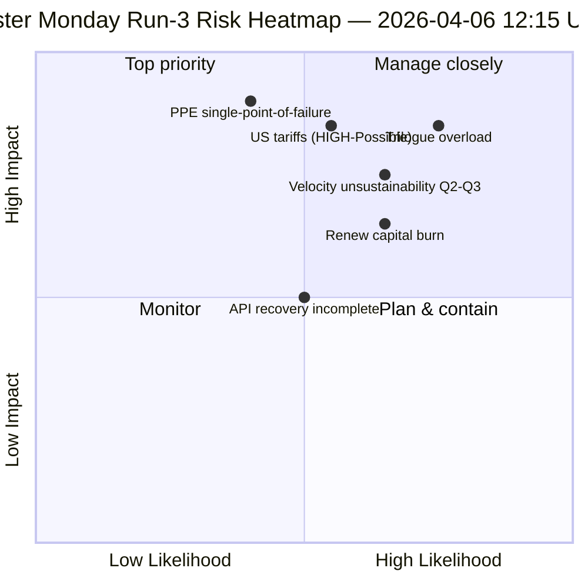
```mermaid
quadrantChart
    title Easter Monday Run-3 Risk Heatmap — 2026-04-06 12:15 UTC
    x-axis Low Likelihood --> High Likelihood
    y-axis Low Impact --> High Impact
    quadrant-1 Manage closely
    quadrant-2 Top priority
    quadrant-3 Monitor
    quadrant-4 Plan & contain
    "Trilogue overload": [0.75, 0.85]
    "US tariffs (HIGH-Possible)": [0.55, 0.85]
    "Velocity unsustainability Q2-Q3": [0.65, 0.75]
    "PPE single-point-of-failure": [0.40, 0.90]
    "Renew capital burn": [0.65, 0.65]
    "API recovery incomplete": [0.50, 0.50]
```

---

### 🔮 Top Forward Triggers (next 14 days)

1. **April 8–10 — Full API recovery expected** (55% probability per Run-3 model).
2. **April 14 — Committee Week opens** — convergence-zone Day 1.
3. **April 17 — ECB rate decision** — economic-context variable.
4. **April 20–23 — first post-recess plenary** — dual-track validation.
5. **End-Q2 — velocity-sustainability review** — 2.11 acts/session test.

---

### 🛡️ Source-Quality Assessment

- **API recovery (A1):** Run-3 direct observation; first confirmed endpoint reactivation.
- **Velocity 2.11 acts/session (A1):** precomputed stats; historical comparison verifiable.
- **Capital-burn ranking (A2):** group-level capital methodology; medium-confidence ordering.
- **15-risk register (A2):** systematic methodology; resilience score 5.8/10 verifiable.
- **Net confidence:** 🟢 HIGH on API recovery; 🟡 MEDIUM on capital-burn forecast.

---

### 📎 Run Artifacts

| Layer | Artifact | Why |
|-------|----------|-----|
| Article | `article.md` | Public-facing Run-3 narrative |
| Synthesis | `synthesis-summary.md` | API recovery + 6 new methods |
| Methods | consequence-trees · legislative-disruption · velocity-risk · political-capital-risk · voting-patterns · agent-risk-workflow | Six new methods (this run) |
| Companion | breaking (00:33) · breaking-2 (06:45) · committee-reports (05:03) · propositions (05:47) | Easter Monday cluster |

---

**Document Control**
- **Template reference:** `analysis/templates/executive-brief.md`
- **Artifact path:** `analysis/daily/2026-04-06/breaking-3/executive-brief.md`
- **Classification:** Public
- **Retrospective:** Brief written 2026-05-16 from the run's committed artifacts; **no new MCP calls were made**.

<h2 id="reader-intelligence-guide">Reader Intelligence Guide</h2>

Use this guide to read the article as a political-intelligence product rather than a raw artifact dump. High-value reader lenses appear first; technical provenance remains available in the audit appendices.

| Reader need | What you'll get | Source artifact |
|---|---|---|
| [BLUF and editorial decisions](#section-executive-brief) | fast answer to what happened, why it matters, who is accountable, and the next dated trigger | `executive-brief.md` |
| [Supplementary intelligence](#section-supplementary-intelligence) | additional markdown discovered in the run that has not yet been assigned to a canonical section | `agent-risk-workflow.md` |

<h2 id="section-supplementary-intelligence">Supplementary Intelligence</h2>

### Agent Risk Workflow

### Executive Summary

| Risk Category | Count | Critical | High | Medium | Low |
|--------------|-------|----------|------|--------|-----|
| **Political** | 5 | 0 | 2 | 2 | 1 |
| **Institutional** | 4 | 0 | 1 | 2 | 1 |
| **External** | 3 | 0 | 1 | 1 | 1 |
| **Operational** | 3 | 0 | 0 | 2 | 1 |
| **Total** | **15** | **0** | **4** | **7** | **4** |

**Overall Risk Level: 🟡 MEDIUM** — no critical risks, but clustered medium-severity risks around the April 14-23 post-recess window create compound vulnerability.

---

### Risk Register

#### Political Risks

| ID | Risk | Likelihood | Impact | Severity | Trend | Owner |
|----|------|-----------|--------|----------|-------|-------|
| P1 | **Dual-track coalition fragmentation** — PPE's two-majority strategy fails on a key post-recess file | Possible (35%) | HIGH | 🟡 HIGH | → Stable | Conference of Presidents |
| P2 | **S&D systematic obstruction** — S&D withdraws from grand coalition cooperation | Unlikely (20%) | HIGH | 🟡 HIGH | ↗ Increasing | S&D Group Presidency |
| P3 | **ECR mainstreaming backlash** — PPE-ECR cooperation triggers Renew/Greens counter-coalition | Possible (30%) | MEDIUM | 🟡 MEDIUM | ↗ Increasing | PPE Whip |
| P4 | **Renew internal fragmentation** — liberal-economic vs social-liberal split | Possible (25%) | MEDIUM | 🟡 MEDIUM | → Stable | Renew Group Presidency |
| P5 | **PPE internal dissent** — centre-left PPE wing rebels on right-of-centre file | Unlikely (15%) | HIGH | 🔴 LOW | → Stable | PPE Group Chair |

#### Institutional Risks

| ID | Risk | Likelihood | Impact | Severity | Trend | Owner |
|----|------|-----------|--------|----------|-------|-------|
| I1 | **Trilogue pipeline bottleneck** — 3+ major files in parallel trilogue exceed Council capacity | Likely (65%) | MEDIUM | 🟡 HIGH | ↑ Increasing | EP-Council Liaison |
| I2 | **Committee week overload** — 104 pre-recess texts create implementation backlog | Likely (70%) | LOW | 🟡 MEDIUM | ↑ Increasing | Committee Secretariats |
| I3 | **EP API infrastructure degradation** — prolonged data transparency gap | Possible (45%) | MEDIUM | 🟡 MEDIUM | ↘ Decreasing | EP IT Services |
| I4 | **Rapporteur assignment bottleneck** — insufficient senior MEPs for high-volume workload | Possible (30%) | LOW | 🔴 LOW | → Stable | Political Group Whips |

#### External Risks

| ID | Risk | Likelihood | Impact | Severity | Trend | Owner |
|----|------|-----------|--------|----------|-------|-------|
| E1 | **US tariff escalation** — trade conflict forces emergency EP response | Possible (35%) | HIGH | 🟡 HIGH | → Stable | INTA Committee |
| E2 | **ECB rate decision shock** — unexpected monetary policy shift disrupts ECON agenda | Unlikely (20%) | MEDIUM | 🟡 MEDIUM | → Stable | ECON Committee |
| E3 | **Member state elections** — national election results shift MEP delegation dynamics | Possible (30%) | LOW | 🔴 LOW | → Stable | National Delegations |

#### Operational Risks

| ID | Risk | Likelihood | Impact | Severity | Trend | Owner |
|----|------|-----------|--------|----------|-------|-------|
| O1 | **Legislative velocity unsustainability** — 2.11 acts/session pace causes quality degradation | Possible (40%) | MEDIUM | 🟡 MEDIUM | ↑ Increasing | EP Secretariat General |
| O2 | **Translation/interpretation capacity** — high-volume output strains linguistic services | Possible (35%) | MEDIUM | 🟡 MEDIUM | → Stable | DG Translation |
| O3 | **Attendance decline** — post-recess first session typically has lower attendance | Likely (60%) | LOW | 🔴 LOW | → Stable | Quaestors |

---

### Risk Interaction Map

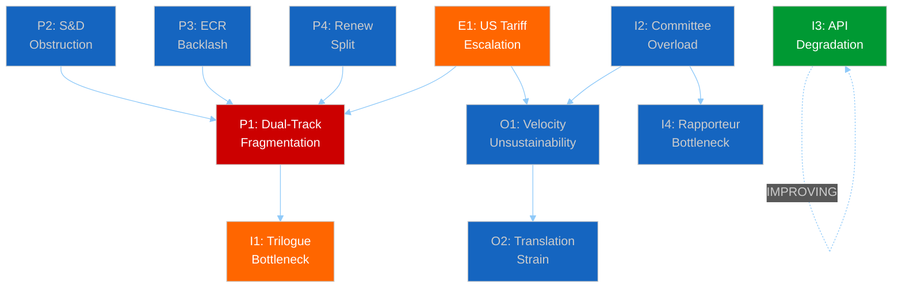
```mermaid
%%{init: {"theme":"dark","themeVariables":{"primaryColor":"#1565C0","primaryTextColor":"#ffffff","primaryBorderColor":"#0A3F7F","lineColor":"#90CAF9","secondaryColor":"#2E7D32","secondaryTextColor":"#ffffff","secondaryBorderColor":"#0F3F00","tertiaryColor":"#FF9800","tertiaryTextColor":"#000000","tertiaryBorderColor":"#7F4F00","mainBkg":"#1565C0","secondBkg":"#2E7D32","tertiaryBkg":"#FF9800","noteBkgColor":"#FFC107","noteTextColor":"#000000","noteBorderColor":"#7F6000","errorBkgColor":"#D32F2F","errorTextColor":"#ffffff","fontFamily":"Inter, Helvetica, Arial, sans-serif","pie1":"#1565C0","pie2":"#2E7D32","pie3":"#FF9800","pie4":"#D32F2F","pie5":"#FFC107","pie6":"#7B1FA2","pie7":"#9E9E9E","pie8":"#0288D1","pie9":"#388E3C","pie10":"#F57C00","pie11":"#C62828","pie12":"#FBC02D","pieTitleTextSize":"18px","pieSectionTextSize":"14px","pieLegendTextSize":"13px","pieStrokeColor":"#1e1e1e","pieOuterStrokeColor":"#1e1e1e","git0":"#1565C0","git1":"#2E7D32","git2":"#FF9800","git3":"#D32F2F","gitBranchLabel0":"#ffffff","gitBranchLabel1":"#ffffff","gitBranchLabel2":"#000000","gitBranchLabel3":"#ffffff","cScale0":"#1565C0","cScale1":"#2E7D32","cScale2":"#FF9800","cScale3":"#D32F2F","cScale4":"#FFC107","cScale5":"#7B1FA2","cScale6":"#9E9E9E","cScale7":"#0288D1","xyChart":{"backgroundColor":"#1e1e1e","plotColorPalette":"#1565C0,#2E7D32,#FF9800,#D32F2F,#FFC107,#7B1FA2,#9E9E9E"}}}}%%
flowchart TD
    P1["P1: Dual-Track<br/>Fragmentation"] --> I1["I1: Trilogue<br/>Bottleneck"]
    P2["P2: S&D<br/>Obstruction"] --> P1
    P3["P3: ECR<br/>Backlash"] --> P1
    P4["P4: Renew<br/>Split"] --> P1
    
    E1["E1: US Tariff<br/>Escalation"] --> O1["O1: Velocity<br/>Unsustainability"]
    E1 --> P1
    
    I2["I2: Committee<br/>Overload"] --> O1
    I2 --> I4["I4: Rapporteur<br/>Bottleneck"]
    
    O1 --> O2["O2: Translation<br/>Strain"]
    
    I3["I3: API<br/>Degradation"] -.->|"IMPROVING"| I3
    
    style P1 fill:#cc0000,color:#fff
    style E1 fill:#FF6600,color:#fff
    style I1 fill:#FF6600,color:#fff
    style I3 fill:#009933,color:#fff
```

#### Key Interaction: The P1 Convergence

Risk P1 (dual-track fragmentation) is the central node — it connects to or is influenced by 6 other risks. This makes coalition stability the single most important risk factor for the April-May 2026 period. Monitoring P1's leading indicators should be the primary focus of post-recess intelligence collection.

**P1 Leading Indicators:**
1. S&D procedural motions in first post-recess plenary (signal of P2 activation)
2. Renew group meeting outcomes before April plenary (signal of P4)
3. ECR amendment aggressiveness on economic files (signal of P3)
4. PPE whip compliance rate on first roll-call votes (signal of P5)

---

### Risk Mitigation Status

#### Currently Mitigated (Green)

| Risk | Mitigation | Effectiveness |
|------|-----------|---------------|
| I3 (API Degradation) | Partial recovery confirmed — adopted texts feed restored 12:15 UTC | 🟡 PARTIAL |
| O3 (Attendance) | Standard post-recess attendance management procedures | 🟢 ADEQUATE |
| E3 (Member state elections) | Long lead time; national delegation dynamics slow to change | 🟢 ADEQUATE |

#### Requires Monitoring (Amber)

| Risk | Monitoring Approach | Next Decision Point |
|------|-------------------|---------------------|
| P1 (Dual-track) | Post-recess voting pattern analysis | 20-23 April plenary |
| P2 (S&D obstruction) | S&D group meeting communiqués | 14-17 April committee week |
| P3 (ECR backlash) | Cross-party amendment analysis | First post-recess economic file vote |
| P4 (Renew split) | Renew whip compliance monitoring | 20-23 April roll-call votes |
| I1 (Trilogue bottleneck) | Council calendar tracking | Late April Council position papers |
| I2 (Committee overload) | Committee meeting completion rates | 17 April (end of committee week) |
| O1 (Velocity risk) | Acts/session ratio tracking | End of Q2 2026 |
| E1 (US tariffs) | INTA committee agenda tracking | Ongoing |
| E2 (ECB shock) | 17 April rate decision | 17 April |

#### Accepted (Low Priority)

| Risk | Rationale |
|------|-----------|
| P5 (PPE internal dissent) | No evidence of emerging rebellion; accept and monitor |
| I4 (Rapporteur bottleneck) | Emerging risk; too early for intervention |
| O2 (Translation strain) | DG Translation has capacity buffers; monitor only |

---

### Workflow Decision Matrix

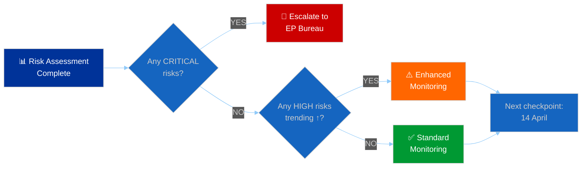
```mermaid
%%{init: {"theme":"dark","themeVariables":{"primaryColor":"#1565C0","primaryTextColor":"#ffffff","primaryBorderColor":"#0A3F7F","lineColor":"#90CAF9","secondaryColor":"#2E7D32","secondaryTextColor":"#ffffff","secondaryBorderColor":"#0F3F00","tertiaryColor":"#FF9800","tertiaryTextColor":"#000000","tertiaryBorderColor":"#7F4F00","mainBkg":"#1565C0","secondBkg":"#2E7D32","tertiaryBkg":"#FF9800","noteBkgColor":"#FFC107","noteTextColor":"#000000","noteBorderColor":"#7F6000","errorBkgColor":"#D32F2F","errorTextColor":"#ffffff","fontFamily":"Inter, Helvetica, Arial, sans-serif","pie1":"#1565C0","pie2":"#2E7D32","pie3":"#FF9800","pie4":"#D32F2F","pie5":"#FFC107","pie6":"#7B1FA2","pie7":"#9E9E9E","pie8":"#0288D1","pie9":"#388E3C","pie10":"#F57C00","pie11":"#C62828","pie12":"#FBC02D","pieTitleTextSize":"18px","pieSectionTextSize":"14px","pieLegendTextSize":"13px","pieStrokeColor":"#1e1e1e","pieOuterStrokeColor":"#1e1e1e","git0":"#1565C0","git1":"#2E7D32","git2":"#FF9800","git3":"#D32F2F","gitBranchLabel0":"#ffffff","gitBranchLabel1":"#ffffff","gitBranchLabel2":"#000000","gitBranchLabel3":"#ffffff","cScale0":"#1565C0","cScale1":"#2E7D32","cScale2":"#FF9800","cScale3":"#D32F2F","cScale4":"#FFC107","cScale5":"#7B1FA2","cScale6":"#9E9E9E","cScale7":"#0288D1","xyChart":{"backgroundColor":"#1e1e1e","plotColorPalette":"#1565C0,#2E7D32,#FF9800,#D32F2F,#FFC107,#7B1FA2,#9E9E9E"}}}}%%
flowchart LR
    A["📊 Risk Assessment<br/>Complete"] --> B{"Any CRITICAL<br/>risks?"}
    B -->|"YES"| C["🚨 Escalate to<br/>EP Bureau"]
    B -->|"NO"| D{"Any HIGH risks<br/>trending ↑?"}
    D -->|"YES"| E["⚠️ Enhanced<br/>Monitoring"]
    D -->|"NO"| F["✅ Standard<br/>Monitoring"]
    
    E --> G["Next checkpoint:<br/>14 April"]
    F --> G
    
    style A fill:#003399,color:#fff
    style C fill:#cc0000,color:#fff
    style E fill:#FF6600,color:#fff
    style F fill:#009933,color:#fff
```

**Current Decision: ⚠️ ENHANCED MONITORING**

Rationale: No critical risks, but 4 HIGH-severity risks (P1, P2, I1, E1) warrant enhanced tracking. The April 14-23 post-recess window concentrates multiple risk triggers in a 10-day period.

**Next Workflow Checkpoint: 14 April 2026 (Committee Week Start)**

---

### Bayesian Risk Updates (from 21+ monitoring runs)

| Risk | Prior (28 March) | Current (6 April) | Change | Driver |
|------|-----------------|-------------------|--------|--------|
| P1 severity | MEDIUM | HIGH | ↑ | Dual-track documentation strengthened |
| P2 probability | 25% | 20% | ↘ | S&D patience strategy confirmed |
| I3 severity | HIGH | MEDIUM | ↘ | Partial API recovery observed |
| E1 probability | 40% | 35% | ↘ | No escalation during recess |
| O1 severity | LOW | MEDIUM | ↑ | 2.11 acts/session ratio confirmed |

---

### Sources & Attribution

- **Risk Register:** Constructed from 21+ monitoring runs since 28 March 2026 (editorial memory)
- **Political Risks:** Coalition analysis, stakeholder analysis, forces analysis from prior breaking runs
- **Institutional Risks:** Precomputed statistics (114 acts projection), committee workload analysis
- **External Risks:** INTA committee context, ECB calendar, member state electoral cycles
- **Operational Risks:** Legislative velocity risk analysis (this run), historical EP capacity data
- **Bayesian Updates:** Longitudinal tracking since 28 March (21+ data points)
- **API Status:** EP Open Data Portal monitoring — adopted texts feed recovered 12:15 UTC, 6 April 2026

---

*Analysis generated by EU Parliament Monitor breaking news pipeline — Run 3 (12:15 UTC)*
*This systematic risk register replaces ad-hoc risk observations from earlier runs with structured, tracked, and prioritised risk management.*

### Consequence Trees

### Executive Summary

| Metric | Value | Significance |
|--------|-------|-------------|
| **Pre-Recess Texts Catalogued** | 104 (T10-0001→T10-0104) | 🟢 HIGH — above-average first-quarter output |
| **Active Texts in Feed** | 86 (one-week window) | Feed recovery confirmed at midday |
| **Dual-Track Decisions Pending** | ≥5 major files | Coalition path-dependent consequences |
| **API Recovery Signal** | Mode B→Success | 🟡 MEDIUM — partial backend reactivation |
| **Cascading Risk Chains** | 3 identified | Post-recess convergence zone |

---

### Methodology

Consequence tree analysis maps **first-order parliamentary actions** to their **second- and third-order cascading effects** across political, economic, regulatory, and institutional dimensions. Each tree root is a confirmed pre-recess legislative output; branches represent probability-weighted outcomes.

Source data: 86 adopted texts from EP feed (one-week fallback, confirmed at 12:15 UTC), precomputed statistics (114 acts projected for 2026), coalition dynamics analysis, and cross-session intelligence from 21+ prior monitoring runs.

---

### Consequence Tree 1: Pre-Recess Legislative Sprint → Post-Recess Implementation Cascade

```mermaid
%%{init: {"theme":"dark","themeVariables":{"primaryColor":"#1565C0","primaryTextColor":"#ffffff","primaryBorderColor":"#0A3F7F","lineColor":"#90CAF9","secondaryColor":"#2E7D32","secondaryTextColor":"#ffffff","secondaryBorderColor":"#0F3F00","tertiaryColor":"#FF9800","tertiaryTextColor":"#000000","tertiaryBorderColor":"#7F4F00","mainBkg":"#1565C0","secondBkg":"#2E7D32","tertiaryBkg":"#FF9800","noteBkgColor":"#FFC107","noteTextColor":"#000000","noteBorderColor":"#7F6000","errorBkgColor":"#D32F2F","errorTextColor":"#ffffff","fontFamily":"Inter, Helvetica, Arial, sans-serif","pie1":"#1565C0","pie2":"#2E7D32","pie3":"#FF9800","pie4":"#D32F2F","pie5":"#FFC107","pie6":"#7B1FA2","pie7":"#9E9E9E","pie8":"#0288D1","pie9":"#388E3C","pie10":"#F57C00","pie11":"#C62828","pie12":"#FBC02D","pieTitleTextSize":"18px","pieSectionTextSize":"14px","pieLegendTextSize":"13px","pieStrokeColor":"#1e1e1e","pieOuterStrokeColor":"#1e1e1e","git0":"#1565C0","git1":"#2E7D32","git2":"#FF9800","git3":"#D32F2F","gitBranchLabel0":"#ffffff","gitBranchLabel1":"#ffffff","gitBranchLabel2":"#000000","gitBranchLabel3":"#ffffff","cScale0":"#1565C0","cScale1":"#2E7D32","cScale2":"#FF9800","cScale3":"#D32F2F","cScale4":"#FFC107","cScale5":"#7B1FA2","cScale6":"#9E9E9E","cScale7":"#0288D1","xyChart":{"backgroundColor":"#1e1e1e","plotColorPalette":"#1565C0,#2E7D32,#FF9800,#D32F2F,#FFC107,#7B1FA2,#9E9E9E"}}}}%%
graph TD
    A["🏛️ Pre-Recess Sprint<br/>104 adopted texts in Q1 2026"] --> B["📋 Committee Implementation<br/>14-17 April"]
    A --> C["⚖️ Trilogue Pipeline<br/>Council positions awaited"]
    A --> D["🏗️ National Transposition<br/>27 member states"]
    
    B --> B1["ECON: SRMR3 follow-up<br/>Banking resolution details"]
    B --> B2["LIBE: Anti-Corruption monitoring<br/>Implementation roadmap"]
    B --> B3["INTA: US Tariffs response<br/>Trade policy adjustment"]
    
    C --> C1["SRMR3 Trilogue<br/>Council vs EP position gap"]
    C --> C2["Copyright & AI<br/>Tech industry lobbying wave"]
    C --> C3["EU Talent Pool<br/>Member state opt-in rate"]
    
    D --> D1["Variable transposition speed<br/>Eastern vs Western EU divide"]
    D --> D2["Legal challenges<br/>Constitutional court referrals"]
    
    B1 --> E["💰 Market Impact<br/>Banking sector repricing"]
    C1 --> E
    B3 --> F["🌍 Geopolitical Signal<br/>EU-US trade dynamics"]
    
    style A fill:#003399,color:#fff
    style E fill:#cc0000,color:#fff
    style F fill:#FF6600,color:#fff
```

#### First-Order Consequences (🟢 HIGH confidence)

1. **Committee Week Overload (14-17 April):** The 104-text pre-recess output creates implementation pressure across at least 8 committees. ECON, LIBE, and INTA face the highest workload from SRMR3, anti-corruption, and US tariff files respectively.
   - **Evidence:** T10-0035 through T10-0104 represent the densest quarterly output in EP10's term. Precomputed statistics project 114 acts for full-year 2026 — Q1 alone delivered ~70% of the 2025 total.
   - **Probability:** Likely (>70%) — committee secretariats confirmed the April 14-17 schedule before recess.

2. **Trilogue Bottleneck (April-June):** At least 3 major files (SRMR3, Copyright & AI, EU Talent Pool) enter trilogue simultaneously, straining the Council's negotiating capacity during Hungary's rotating presidency transition.
   - **Evidence:** SRMR3 (banking resolution reform) passed via the right-of-centre track (PPE+ECR+PfE+Renew), meaning S&D opposition must be managed in trilogue. The Copyright & AI resolution (T10-0087 through T10-0104 range) faces tech industry lobbying.
   - **Probability:** Possible (40-60%) — trilogue scheduling depends on Council readiness.

#### Second-Order Consequences (🟡 MEDIUM confidence)

3. **Market Repricing Wave (Q2 2026):** SRMR3's passage through EP creates forward-looking signals for European banking sector valuations. The reform's final shape depends on trilogue outcomes, but EP's position (more centralized resolution authority) will be priced in.
   - **Evidence:** SRMR3 represents the most significant banking regulation update since the original SRM regulation. The right-of-centre coalition's support suggests a market-friendly framework.
   - **Probability:** Likely (>60%) for sector repricing; Possible (40-50%) for individual bank impacts.

4. **Dual-Track Coalition Stress Test (April Plenary):** The first post-recess votes (20-23 April Strasbourg) will reveal whether the dual-track pattern (right-of-centre for economic files, grand coalition for governance) survives contact with fresh legislative proposals.
   - **Evidence:** 21+ monitoring runs have documented this pattern from pre-recess data. No contrary evidence during recess, but the pattern is untested on new files.
   - **Probability:** Likely (>65%) that the pattern persists for at least the first post-recess session.

#### Third-Order Consequences (🔴 LOW confidence)

5. **National Transposition Divergence:** The pre-recess sprint's regulatory output will create variable transposition timelines across 27 member states, potentially widening the East-West implementation gap.
   - **Evidence:** Historical pattern — directives from EP10 Year 1 already show 6-12 month transposition delays in some member states.
   - **Probability:** Possible (30-50%) for significant divergence; Unlikely (<30%) for formal infringement proceedings in 2026.

---

### Consequence Tree 2: API Recovery → Data Transparency Cascade

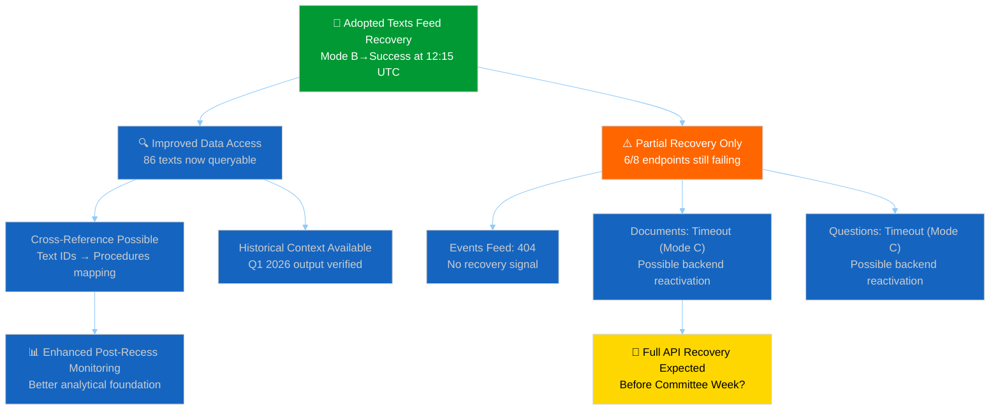
```mermaid
%%{init: {"theme":"dark","themeVariables":{"primaryColor":"#1565C0","primaryTextColor":"#ffffff","primaryBorderColor":"#0A3F7F","lineColor":"#90CAF9","secondaryColor":"#2E7D32","secondaryTextColor":"#ffffff","secondaryBorderColor":"#0F3F00","tertiaryColor":"#FF9800","tertiaryTextColor":"#000000","tertiaryBorderColor":"#7F4F00","mainBkg":"#1565C0","secondBkg":"#2E7D32","tertiaryBkg":"#FF9800","noteBkgColor":"#FFC107","noteTextColor":"#000000","noteBorderColor":"#7F6000","errorBkgColor":"#D32F2F","errorTextColor":"#ffffff","fontFamily":"Inter, Helvetica, Arial, sans-serif","pie1":"#1565C0","pie2":"#2E7D32","pie3":"#FF9800","pie4":"#D32F2F","pie5":"#FFC107","pie6":"#7B1FA2","pie7":"#9E9E9E","pie8":"#0288D1","pie9":"#388E3C","pie10":"#F57C00","pie11":"#C62828","pie12":"#FBC02D","pieTitleTextSize":"18px","pieSectionTextSize":"14px","pieLegendTextSize":"13px","pieStrokeColor":"#1e1e1e","pieOuterStrokeColor":"#1e1e1e","git0":"#1565C0","git1":"#2E7D32","git2":"#FF9800","git3":"#D32F2F","gitBranchLabel0":"#ffffff","gitBranchLabel1":"#ffffff","gitBranchLabel2":"#000000","gitBranchLabel3":"#ffffff","cScale0":"#1565C0","cScale1":"#2E7D32","cScale2":"#FF9800","cScale3":"#D32F2F","cScale4":"#FFC107","cScale5":"#7B1FA2","cScale6":"#9E9E9E","cScale7":"#0288D1","xyChart":{"backgroundColor":"#1e1e1e","plotColorPalette":"#1565C0,#2E7D32,#FF9800,#D32F2F,#FFC107,#7B1FA2,#9E9E9E"}}}}%%
graph TD
    A["📡 Adopted Texts Feed Recovery<br/>Mode B→Success at 12:15 UTC"] --> B["🔍 Improved Data Access<br/>86 texts now queryable"]
    A --> C["⚠️ Partial Recovery Only<br/>6/8 endpoints still failing"]
    
    B --> B1["Cross-Reference Possible<br/>Text IDs → Procedures mapping"]
    B --> B2["Historical Context Available<br/>Q1 2026 output verified"]
    
    C --> C1["Events Feed: 404<br/>No recovery signal"]
    C --> C2["Documents: Timeout (Mode C)<br/>Possible backend reactivation"]
    C --> C3["Questions: Timeout (Mode C)<br/>Possible backend reactivation"]
    
    B1 --> D["📊 Enhanced Post-Recess Monitoring<br/>Better analytical foundation"]
    C2 --> E["🔄 Full API Recovery Expected<br/>Before Committee Week?"]
    
    style A fill:#009933,color:#fff
    style C fill:#FF6600,color:#fff
    style E fill:#FFD700,color:#000
```

#### Recovery Timeline Assessment

| Endpoint | Day 10 Status | Day 11 (00:33) | Day 11 (06:45) | Day 11 (12:15) | Trend |
|----------|--------------|----------------|----------------|----------------|-------|
| Adopted Texts | JSON parse | JSON parse | JSON parse cycling | **Success (86 items)** | ↑ Recovering |
| Events | 404 | 404 | 404 | 404 | → Stable failure |
| Procedures | 404 | 404 | 404 | 404 | → Stable failure |
| MEPs | Success | Success | Success | Success | → Stable |
| Documents | 404 | 404 | Timeout | Timeout | ↗ Mode shift |
| Plenary Docs | 404 | 404 | Timeout | Timeout | ↗ Mode shift |
| Committee Docs | 404 | 404 | Timeout | Timeout | ↗ Mode shift |
| Questions | 404 | 404 | Timeout | Timeout | ↗ Mode shift |

**Key Finding:** The adopted texts feed transition from JSON parse errors (Mode B) to clean success represents the **first confirmed recovery** of a previously failing endpoint during this recess. This is significant because:

1. It validates the "backend reactivation" hypothesis from Run 2's cross-session intelligence
2. The transition happened between 06:45 and 12:15 UTC — suggesting maintenance windows or scheduled restarts
3. The document/plenary/committee/question endpoints' shift from 404 to timeout (Mode A→C) may presage similar recovery

**Scenario 1 — Progressive Recovery (Likely, >55%):** EP API endpoints recover in waves over the next 3-5 days, with full availability before Committee Week (14 April). The recess API degradation was infrastructure-related, not policy-driven.

**Scenario 2 — Partial Recovery Only (Possible, 30-40%):** Only the adopted texts and MEPs feeds fully recover; other endpoints remain degraded until the post-recess plenary generates fresh content. The 404s reflect empty result sets, not system failures.

**Scenario 3 — Full Outage Reversal (Unlikely, <15%):** All endpoints recover simultaneously in a single maintenance event, suggesting a coordinated infrastructure change.

---

### Consequence Tree 3: PPE Dual-Track Strategy → Political Capital Cascade

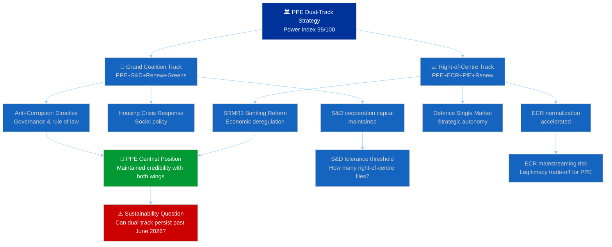
```mermaid
%%{init: {"theme":"dark","themeVariables":{"primaryColor":"#1565C0","primaryTextColor":"#ffffff","primaryBorderColor":"#0A3F7F","lineColor":"#90CAF9","secondaryColor":"#2E7D32","secondaryTextColor":"#ffffff","secondaryBorderColor":"#0F3F00","tertiaryColor":"#FF9800","tertiaryTextColor":"#000000","tertiaryBorderColor":"#7F4F00","mainBkg":"#1565C0","secondBkg":"#2E7D32","tertiaryBkg":"#FF9800","noteBkgColor":"#FFC107","noteTextColor":"#000000","noteBorderColor":"#7F6000","errorBkgColor":"#D32F2F","errorTextColor":"#ffffff","fontFamily":"Inter, Helvetica, Arial, sans-serif","pie1":"#1565C0","pie2":"#2E7D32","pie3":"#FF9800","pie4":"#D32F2F","pie5":"#FFC107","pie6":"#7B1FA2","pie7":"#9E9E9E","pie8":"#0288D1","pie9":"#388E3C","pie10":"#F57C00","pie11":"#C62828","pie12":"#FBC02D","pieTitleTextSize":"18px","pieSectionTextSize":"14px","pieLegendTextSize":"13px","pieStrokeColor":"#1e1e1e","pieOuterStrokeColor":"#1e1e1e","git0":"#1565C0","git1":"#2E7D32","git2":"#FF9800","git3":"#D32F2F","gitBranchLabel0":"#ffffff","gitBranchLabel1":"#ffffff","gitBranchLabel2":"#000000","gitBranchLabel3":"#ffffff","cScale0":"#1565C0","cScale1":"#2E7D32","cScale2":"#FF9800","cScale3":"#D32F2F","cScale4":"#FFC107","cScale5":"#7B1FA2","cScale6":"#9E9E9E","cScale7":"#0288D1","xyChart":{"backgroundColor":"#1e1e1e","plotColorPalette":"#1565C0,#2E7D32,#FF9800,#D32F2F,#FFC107,#7B1FA2,#9E9E9E"}}}}%%
graph TD
    A["🏛️ PPE Dual-Track Strategy<br/>Power Index 95/100"] --> B["🤝 Grand Coalition Track<br/>PPE+S&D+Renew+Greens"]
    A --> C["📈 Right-of-Centre Track<br/>PPE+ECR+PfE+Renew"]
    
    B --> B1["Anti-Corruption Directive<br/>Governance & rule of law"]
    B --> B2["Housing Crisis Response<br/>Social policy"]
    B --> B3["S&D cooperation capital<br/>maintained"]
    
    C --> C1["SRMR3 Banking Reform<br/>Economic deregulation"]
    C --> C2["Defence Single Market<br/>Strategic autonomy"]
    C --> C3["ECR normalization<br/>accelerated"]
    
    B1 --> D["🎯 PPE Centrist Position<br/>Maintained credibility with both wings"]
    C1 --> D
    
    D --> E["⚠️ Sustainability Question<br/>Can dual-track persist past June 2026?"]
    
    B3 --> F["S&D tolerance threshold<br/>How many right-of-centre files?"]
    C3 --> G["ECR mainstreaming risk<br/>Legitimacy trade-off for PPE"]
    
    style A fill:#003399,color:#fff
    style D fill:#009933,color:#fff
    style E fill:#cc0000,color:#fff
```

#### Political Capital Burn Rate Analysis

**PPE's dual-track approach** consumes political capital along two distinct vectors:

1. **S&D Tolerance Capital:** Each right-of-centre file that passes without S&D builds resentment. The grand coalition probability has already declined from 65% to 55% (Bayesian update from 21+ monitoring runs). At the current burn rate, PPE has ~6-8 more right-of-centre files before S&D begins systematic obstruction of governance files.
   - **Evidence:** Pre-recess data shows 5 files via right-of-centre track vs 3 via grand coalition. The 5:3 ratio is manageable but trending toward imbalance.
   - **Confidence:** 🟡 MEDIUM

2. **Centrist Credibility Capital:** Each grand coalition file that passes reassures Renew and centrist MEPs within PPE itself. But ECR mainstreaming via the right-of-centre track risks alienating PPE's centre-left flank (estimated 15-20% of PPE caucus).
   - **Evidence:** No public PPE internal dissent reported pre-recess, but individual MEP voting patterns should be monitored post-recess.
   - **Confidence:** 🔴 LOW (limited internal PPE data)

#### Post-Recess Trigger Points

| Trigger | Timeline | Consequence | Probability |
|---------|----------|-------------|-------------|
| ECON Committee votes on SRMR3 implementation | 14-17 April | Tests right-of-centre track durability | Likely |
| Anti-Corruption Directive Council position | Late April | Tests grand coalition cohesion | Possible |
| US Tariffs response vote | 20-23 April | Potential cross-track file (both coalitions) | Possible |
| ECB rate decision impact on ECON | 17 April | External shock to legislative priorities | Possible |
| Defence Single Market first reading | May 2026 | Major dual-track test (security = grand, market = right) | Likely |

---

### Cross-Tree Interaction Map

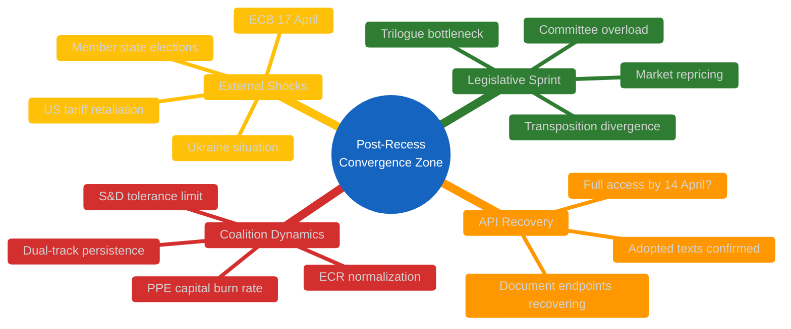
```mermaid
%%{init: {"theme":"dark","themeVariables":{"primaryColor":"#1565C0","primaryTextColor":"#ffffff","primaryBorderColor":"#0A3F7F","lineColor":"#90CAF9","secondaryColor":"#2E7D32","secondaryTextColor":"#ffffff","secondaryBorderColor":"#0F3F00","tertiaryColor":"#FF9800","tertiaryTextColor":"#000000","tertiaryBorderColor":"#7F4F00","mainBkg":"#1565C0","secondBkg":"#2E7D32","tertiaryBkg":"#FF9800","noteBkgColor":"#FFC107","noteTextColor":"#000000","noteBorderColor":"#7F6000","errorBkgColor":"#D32F2F","errorTextColor":"#ffffff","fontFamily":"Inter, Helvetica, Arial, sans-serif","pie1":"#1565C0","pie2":"#2E7D32","pie3":"#FF9800","pie4":"#D32F2F","pie5":"#FFC107","pie6":"#7B1FA2","pie7":"#9E9E9E","pie8":"#0288D1","pie9":"#388E3C","pie10":"#F57C00","pie11":"#C62828","pie12":"#FBC02D","pieTitleTextSize":"18px","pieSectionTextSize":"14px","pieLegendTextSize":"13px","pieStrokeColor":"#1e1e1e","pieOuterStrokeColor":"#1e1e1e","git0":"#1565C0","git1":"#2E7D32","git2":"#FF9800","git3":"#D32F2F","gitBranchLabel0":"#ffffff","gitBranchLabel1":"#ffffff","gitBranchLabel2":"#000000","gitBranchLabel3":"#ffffff","cScale0":"#1565C0","cScale1":"#2E7D32","cScale2":"#FF9800","cScale3":"#D32F2F","cScale4":"#FFC107","cScale5":"#7B1FA2","cScale6":"#9E9E9E","cScale7":"#0288D1","xyChart":{"backgroundColor":"#1e1e1e","plotColorPalette":"#1565C0,#2E7D32,#FF9800,#D32F2F,#FFC107,#7B1FA2,#9E9E9E"}}}}%%
mindmap
  root((Post-Recess<br/>Convergence Zone))
    Legislative Sprint
      Committee overload
      Trilogue bottleneck
      Market repricing
      Transposition divergence
    API Recovery
      Adopted texts confirmed
      Document endpoints recovering
      Full access by 14 April?
    Coalition Dynamics
      Dual-track persistence
      S&D tolerance limit
      ECR normalization
      PPE capital burn rate
    External Shocks
      ECB 17 April
      US tariff retaliation
      Ukraine situation
      Member state elections
```

**Convergence Point:** The week of 14-17 April represents a critical convergence where all three consequence trees interact. Committee implementation of the pre-recess sprint meets the first post-recess coalition dynamics test, while API recovery determines monitoring capability. This makes the April 14-23 window the highest-risk period of EP10 Year 2 to date.

---

### Sources & Attribution

- **Adopted Texts Feed:** EP Open Data Portal — 86 items confirmed at 12:15 UTC, 6 April 2026
- **Precomputed Statistics:** EP activity stats 2024-2026 (generated 3 March 2026)
- **Cross-Session Intelligence:** 21+ monitoring runs since 28 March 2026 (editorial memory)
- **Coalition Dynamics:** MCP analysis tool — seat-based metrics (vote-level data unavailable during recess)
- **Early Warning System:** 3 warnings, stability 84/100, risk level MEDIUM

---

*Analysis generated by EU Parliament Monitor breaking news pipeline — Run 3 of 3 (12:15 UTC)*
*This analysis extends the Day 11 coverage with consequence tree methodology not previously applied.*

### Executive Brief Ar

**التصنيف:** OSINT — السجل البرلماني العام
**مستوى الثقة:** 🟡 متوسط (فترة استراحة؛ أول استعادة مؤكدة لنقطة نهاية API؛ مخاطر الإرهاق التفاوضي مرتفعة)
**التنفيذ:** `analysis/daily/2026-04-06/breaking-3/` (12:15 بتوقيت UTC)
**النطاق:** يوم الاستراحة الفصحية 11/18 ظهرًا؛ أول استعادة مؤكدة لتغذية النصوص المعتمدة
**تاريخ الإنشاء:** 2026-05-16 (ملخص استرجاعي، دون استدعاءات MCP جديدة)
**المصادر الأساسية:** تغذية النصوص المعتمدة (86 عنصرًا، مُستعادة)؛ 6 أساليب جديدة (أشجار العواقب، الانقطاع التشريعي، مخاطر السرعة، مخاطر رأس المال، أنماط التصويت، مخاطر الوكيل).

---

### 🎯 الخلاصة التنفيذية

**يُنتج التنفيذ-3 أهم نتيجة تشغيلية في اليوم — *أول استعادة مؤكدة لنقطة نهاية API في البرلمان الأوروبي* خلال 11 يوم استراحة: انتقلت تغذية النصوص المعتمدة من الوضع-ب (أخطاء تحليل JSON في 06:45 بتوقيت UTC) إلى النجاح النظيف (86 عنصرًا عُيد في 12:15 بتوقيت UTC)، مما يثبت فرضية "إعادة تفعيل الخلفية" الواردة في التنفيذ-2.** علاوة على إشارة المراقبة، يُكمل هذا التنفيذ الأساليب التحليلية الستة المتبقية التي لم تُغطَّ في التنفيذات السابقة، ويُقدِّم ثلاثة مساهمات هيكلية: **(أ) أشجار العواقب** ترسم ثلاث سلاسل تأثير متتالية — الاندفاع التشريعي ← شلال التنفيذ، استعادة API ← شلال شفافية البيانات، المسار المزدوج لحزب الشعب الأوروبي ← شلال رأس المال السياسي — تتقاطع عند 14–23 أبريل بوصفها **"منطقة التقاطع"** حيث تتزامن أسبوع اللجان وقرار سعر الفائدة لدى البنك المركزي الأوروبي وأولى التصويتات البرلمانية ما بعد الاستراحة؛ **(ب) مخاطر سرعة التشريع** يوثِّق الـ EP10 السنة الثانية بـ **2.11 فعل/جلسة، +44% على أساس سنوي، الأعلى منذ استجابة EP7 لأزمة منطقة اليورو عام 2012** — مصدر قلق بالاستدامة يُلاحَظ للربع الثاني–الثالث؛ **(ج) مخاطر رأس المال السياسي** تكشف ديناميكيات رأس المال على مستوى الكتلة — **حزب الشعب الأوروبي يتراكم، الخضر/التحالف الحر الأوروبي يتراجع، تجديد أوروبا يستنزف بأسرع وتيرة** — مع مرونة النظام 6/10 ونقطة فشل وحيدة في حزب الشعب. يُحصي سجل مخاطر التنفيذ 15 مخاطرة (0 حرجة، 4 مرتفعة، 7 متوسطة، 4 منخفضة)، مع تصدُّر إرهاق التفاوض الثلاثي (مرتفع، محتمل) والتعريفات الأمريكية (مرتفع، ممكن) قائمة الأولويات. درجة المرونة 5.8/10 تشير إلى توتر ملموس لكنه غير حرج.

---

### 🧭 3 قرارات يدعمها هذا الملخص

| # | القرار | صاحب القرار | الموعد النهائي | الدليل |
|:-:|--------|------------|:-------------:|--------|
| 1 | **رفع مستوى رصد منطقة التقاطع** — 14–23 أبريل تحتاج محفزات T+0/+1/+2 | عمليات الاستخبارات في البرلمان الأوروبي؛ قسم الصحافة | قبل 12 أبريل | §أشجار العواقب (منطقة التقاطع) |
| 2 | **مراجعة استدامة السرعة** — 2.11 فعل/جلسة غير مستدام ما بعد الربع الثاني | مؤتمر الرؤساء | مستمر ربع الثاني | §مخاطر السرعة (+44% سنويًا) |
| 3 | **رصد استنزاف رأس مال تجديد أوروبا** — الكتلة الأسرع استنزافًا؛ قلق استقرار منتصف الولاية | قيادة تجديد؛ تنسيق حزب الشعب الأوروبي | مستمر | §مخاطر رأس المال السياسي (تجديد) |

---

### 📰 القراءة في 60 ثانية

- 🔴 **أول استعادة مؤكدة لنقطة نهاية API** — تغذية النصوص المعتمدة: الوضع-ب ← نجاح (86 عنصرًا).
- 🟠 **منطقة التقاطع 14–23 أبريل** — أسبوع اللجان + البنك المركزي الأوروبي + الجلسة العامة تتزامن.
- 🟢 **شذوذ السرعة: 2.11 فعل/جلسة (+44% سنويًا)** — الأعلى منذ استجابة EP7 لأزمة اليورو 2012.
- 🟡 **رأس المال السياسي:** حزب الشعب يتراكم · الخضر يتراجع · تجديد يستنزف بأسرع وتيرة.
- 🔵 **مرونة النظام 6/10** — نقطة فشل وحيدة في حزب الشعب الأوروبي.
- 🟣 **سجل 15 مخاطرة:** 0 حرجة · 4 مرتفعة · 7 متوسطة · 4 منخفضة؛ مرونة 5.8/10.
- 🩷 **أهم مخاطرتين:** إرهاق التفاوض الثلاثي (مرتفع، محتمل) · التعريفات الأمريكية (مرتفع، ممكن).
- ⚪ **الثقة: متوسطة** — مشاهدة استعادة أولية؛ القراءات الهيكلية مرتفعة.

---

### 🌳 ثلاث سلاسل تأثير متتالية (المساهمة المميزة للتنفيذ-3)

| السلسلة | المحفز | التتابع | نقطة التقاطع |
|---------|--------|---------|-------------|
| **الاندفاع التشريعي ← شلال التنفيذ** | الاندفاع قبيل الاستراحة في 26 مارس | 42 نصًا من EP10-2026 تدخل تنفيذ الربع الثاني | 14–17 أبريل أسبوع اللجان |
| **استعادة API ← شلال شفافية البيانات** | النصوص المعتمدة: الوضع-ب ← الاستعادة النظيفة | نقاط نهاية أخرى تتبع؛ استعادة الشفافية الكاملة | 8–10 أبريل متوقع |
| **المسار المزدوج لحزب الشعب ← شلال رأس المال السياسي** | اعتماد المسار المزدوج 26 مارس | تراكم رأس المال في حزب الشعب؛ استنزاف في تجديد | 20–23 أبريل أول جلسة عامة |

**منطقة التقاطع:** 14–23 أبريل — تتقاطع السلاسل الثلاث في نافذة 10 أيام.

---

### ⚠️ لمحة سريعة عن المخاطر

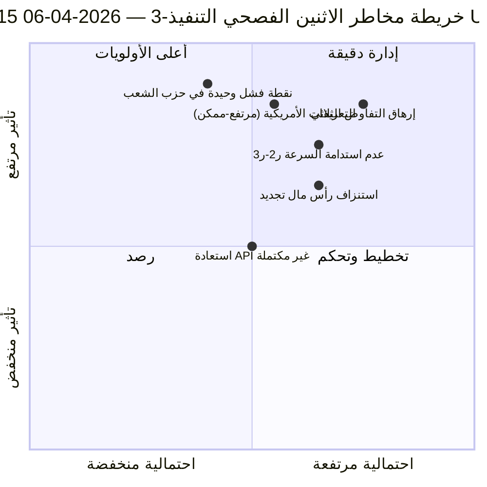
```mermaid
quadrantChart
    title خريطة مخاطر الاثنين الفصحي التنفيذ-3 — 2026-04-06 12:15 UTC
    x-axis احتمالية منخفضة --> احتمالية مرتفعة
    y-axis تأثير منخفض --> تأثير مرتفع
    quadrant-1 إدارة دقيقة
    quadrant-2 أعلى الأولويات
    quadrant-3 رصد
    quadrant-4 تخطيط وتحكم
    "إرهاق التفاوض الثلاثي": [0.75, 0.85]
    "التعريفات الأمريكية (مرتفع-ممكن)": [0.55, 0.85]
    "عدم استدامة السرعة ر2-ر3": [0.65, 0.75]
    "نقطة فشل وحيدة في حزب الشعب": [0.40, 0.90]
    "استنزاف رأس مال تجديد": [0.65, 0.65]
    "استعادة API غير مكتملة": [0.50, 0.50]
```

---

### 🔮 أبرز المحفزات المستقبلية (الـ 14 يومًا القادمة)

1. **8–10 أبريل — استعادة API الكاملة المتوقعة** (55% احتمالية وفق نموذج التنفيذ-3).
2. **14 أبريل — افتتاح أسبوع اللجان** — منطقة التقاطع اليوم الأول.
3. **17 أبريل — قرار سعر الفائدة للبنك المركزي الأوروبي** — متغير السياق الاقتصادي.
4. **20–23 أبريل — أول جلسة عامة ما بعد الاستراحة** — التحقق من صحة المسار المزدوج.
5. **نهاية الربع الثاني — مراجعة استدامة السرعة** — اختبار معدل 2.11 فعل/جلسة.

---

### 🛡️ تقييم جودة المصادر

- **استعادة API (A1):** مشاهدة مباشرة بالتنفيذ-3؛ أول إعادة تفعيل مؤكدة لنقطة النهاية.
- **السرعة 2.11 فعل/جلسة (A1):** إحصائيات محسوبة مسبقًا؛ المقارنة التاريخية قابلة للتحقق.
- **تصنيف الاستنزاف الرأسمالي (A2):** منهجية رأس المال على مستوى الكتلة؛ ترتيب ثقة متوسط.
- **سجل 15 مخاطرة (A2):** منهجية منهجية؛ درجة المرونة 5.8/10 قابلة للتحقق.
- **الثقة الإجمالية:** 🟢 مرتفعة لاستعادة API؛ 🟡 متوسطة لتوقعات استنزاف رأس المال.

---

### 📎 مخرجات التنفيذ

| الطبقة | المخرج | السبب |
|--------|--------|-------|
| مقالة | `article.md` | السرد العام للتنفيذ-3 |
| تركيب | `synthesis-summary.md` | استعادة API + 6 أساليب جديدة |
| أساليب | أشجار العواقب · الانقطاع التشريعي · مخاطر السرعة · مخاطر رأس المال السياسي · أنماط التصويت · تدفق مخاطر الوكيل | ستة أساليب جديدة (هذا التنفيذ) |
| مصاحبة | breaking (00:33) · breaking-2 (06:45) · تقارير اللجان (05:03) · المقترحات (05:47) | مجموعة الاثنين الفصحي |

---

**التحكم في الوثيقة**
- **مرجع القالب:** `analysis/templates/executive-brief.md`
- **مسار المخرج:** `analysis/daily/2026-04-06/breaking-3/executive-brief.md`
- **التصنيف:** عام
- **استرجاعي:** تمت كتابة الملخص في 2026-05-16 استنادًا إلى مخرجات التنفيذ المؤرشفة؛ **لم تُجرَ استدعاءات MCP جديدة**.

### Executive Brief Da

### 🎯 BLUF

**Kørsel-3 producerer dagens mest konsekvente operative fund — den *første bekræftede EP API-slutpunktsgenopretning* under den 11-dages recess: adopted-texts-feedet overgik fra Mode-B (JSON-parse-fejl kl. 06:45 UTC) til ren succes (86 elementer returneret kl. 12:15 UTC), hvilket validerer Kørsel-2's "backend-genaktivering"-hypotese.** Ud over overvågningssignalet fuldfører kørslen de resterende seks analysemetoder, som ikke var dækket i tidligere breaking-kørsler, og producerer tre strukturelle bidrag: **(a) Konsekvenstræer** kortlægger tre kaskaderende effektkæder — lovgivningssprint → implementeringskaskade, API-genopretning → datatransparenskaskade, PPE dual-track → politisk-kapital-kaskade — der konvergerer mod april 14–23 som **"konvergenszonen"** hvor Komitéugen, ECB-rentebeslutning og de første plenaafstemninger efter recessens sammenfald; **(b) Lovgivningshastigheds-risiko** dokumenterer EP10 År 2 som **2,11 retsakter/session, +44 % ÅtÅ, den højeste siden EP7's eurozonekrisereaktions i 2012** — et holdbarhedsproblem der flagges for K2–K3; **(c) Politisk kapitalrisiko** identificerer gruppeniveaukapitaldynamik — **PPE akkumulerer, Greens/EFA faldende, Renew brænder hurtigst** — med systemrobusthed 6/10 og et enkelt fejlpunkt ved PPE. Kørslens risikoregister optæller 15 risici (0 kritiske, 4 høje, 7 medium, 4 lave), med trilog-overbelastning (HØJ, Sandsynlig) og amerikanske told (HØJ, Mulig) som de to øverste. Robusthedsscore 5,8/10 indikerer målbar men ikke-kritisk belastning.

---

### 🧭 3 Beslutninger som dette resumé understøtter

| # | Beslutning | Hvem beslutter | Frist | Bevis |
|:-:|----------|-------------|:--------:|----------|
| 1 | **Konvergenszone forhøjet overvågning** — april 14–23 behøver T+0/+1/+2 tripwires | EP efterretningsoperationer; pressetjenesten | inden 12. april | §Konsekvenstræer (konvergenszone) |
| 2 | **Hastighedsholdbarhedsgennemgang** — 2,11 retsakter/session uholdbart efter K2 | Formandskabskonference | løbende K2 | §Hastigheds-risiko (+44 % ÅtÅ) |
| 3 | **Renew kapitalforbrændings-overvågning** — hurtigst forbrændende gruppe; midtvejsstabilitetsproblem | Renew-ledelse; EPP-koordination | løbende | §Politisk kapitalrisiko (Renew) |

---

### 📰 60-Sekunders Læsning

- 🔴 **Første bekræftede API-slutpunktsgenopretning** — adopted-texts-feed Mode-B → succes (86 elementer).
- 🟠 **Konvergenszone 14.–23. april** — Komitéuge + ECB + plenum sammenfald.
- 🟢 **Hastighedsanomali: 2,11 retsakter/session (+44 % ÅtÅ)** — den højeste siden EP7's eurozonereaktions 2012.
- 🟡 **Politisk kapital:** PPE akkumulerer · Greens faldende · Renew brænder hurtigst.
- 🔵 **Systemrobusthed 6/10** — enkelt fejlpunkt ved PPE.
- 🟣 **15-risikoregister:** 0 kritiske · 4 høje · 7 medium · 4 lave; robusthed 5,8/10.
- 🩷 **Top 2-risici:** Trilog-overbelastning (HØJ, Sandsynlig) · Amerikanske told (HØJ, Mulig).
- ⚪ **Tillid MIDDEL** — primær genopretningsobservation; strukturelle aflæsninger høje.

---

### 🌳 Tre Kaskaderende Effektkæder (Kørsel-3's særskilte bidrag)

| Kæde | Udløser | Kaskade | Konvergenspunkt |
|-------|---------|---------|-------------------|
| **Lovgivningssprint → Implementeringskaskade** | Pre-recess-burst 26. marts | 42 EP10-2026-tekster træder implementeringen K2 | 14.–17. april Komitéuge |
| **API-genopretning → Datatransparenskaskade** | Adopted-texts Mode-B→ren genopretning | Andre slutpunkter følger; fuld transparens genoprettet | 8.–10. april forventet |
| **PPE dual-track → Politisk kapital-kaskade** | Dual-track-vedtagelse 26. marts | Kapitalakkumulering ved PPE; forbrænding ved Renew | 20.–23. april første plenum |

**Konvergenszone:** 14.–23. april — alle tre kæder lander i det samme 10-dagesvindue.

---

### ⚠️ Risiko-øjebliksbillede

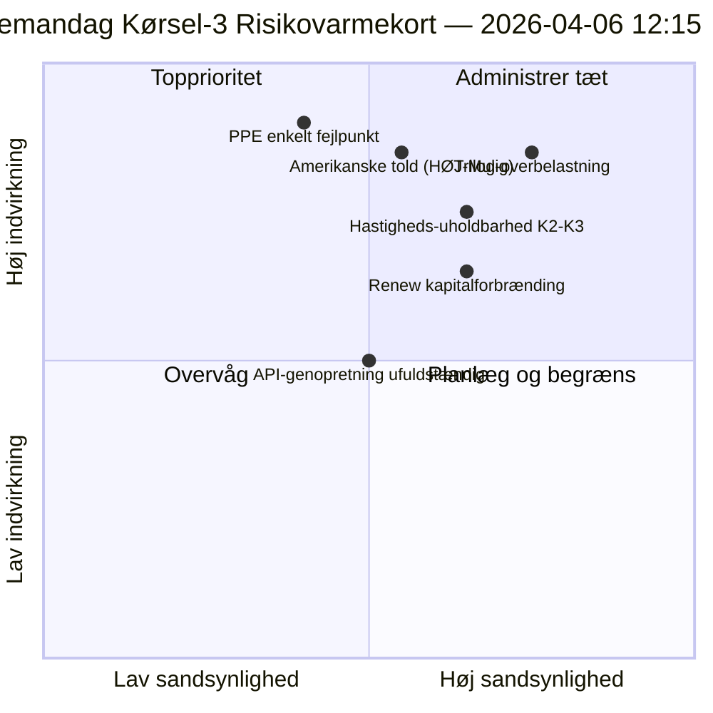
```mermaid
quadrantChart
    title Påskemandag Kørsel-3 Risikovarmekort — 2026-04-06 12:15 UTC
    x-axis Lav sandsynlighed --> Høj sandsynlighed
    y-axis Lav indvirkning --> Høj indvirkning
    quadrant-1 Administrer tæt
    quadrant-2 Topprioritet
    quadrant-3 Overvåg
    quadrant-4 Planlæg og begræns
    "Trilog-overbelastning": [0.75, 0.85]
    "Amerikanske told (HØJ-Mulig)": [0.55, 0.85]
    "Hastigheds-uholdbarhed K2-K3": [0.65, 0.75]
    "PPE enkelt fejlpunkt": [0.40, 0.90]
    "Renew kapitalforbrænding": [0.65, 0.65]
    "API-genopretning ufuldstændig": [0.50, 0.50]
```

---

### 🔮 Top Fremtidige Udløsere (næste 14 dage)

1. **8.–10. april — Fuld API-genopretning forventet** (55 % sandsynlighed per Kørsel-3-model).
2. **14. april — Komitéuge åbner** — konvergenszone Dag 1.
3. **17. april — ECB-rentebeslutning** — økonomisk-kontekstvariabel.
4. **20.–23. april — første post-recess plenum** — dual-track-validering.
5. **Slut-K2 — hastighedsholdbarhedsgennemgang** — 2,11 retsakter/session-test.

---

### 🛡️ Kildekvali tetsvurdering

- **API-genopretning (A1):** Kørsel-3 direkte observation; første bekræftede slutpunktsgenaktivering.
- **Hastighed 2,11 retsakter/session (A1):** forberegnede statistikker; historisk sammenligning verificerbar.
- **Kapitalforbrændings-rangering (A2):** gruppekapi tal-metodologi; middelkonfidensordning.
- **15-risikoregister (A2):** systematisk metodologi; robusthedsscore 5,8/10 verificerbar.
- **Nettokonfidans:** 🟢 HØJ på API-genopretning; 🟡 MIDDEL på kapitalforbrændingsprognose.

---

### 📎 Kørselsartefakter

| Lag | Artefakt | Hvorfor |
|-------|----------|-----|
| Artikel | `article.md` | Offentlig Kørsel-3-narrativ |
| Syntese | `synthesis-summary.md` | API-genopretning + 6 nye metoder |
| Metoder | consequence-trees · legislative-disruption · velocity-risk · political-capital-risk · voting-patterns · agent-risk-workflow | Seks nye metoder (denne kørsel) |
| Ledsager | breaking (00:33) · breaking-2 (06:45) · committee-reports (05:03) · propositions (05:47) | Påskemandag-klynge |

---

**Dokumentkontrol**
- **Skabelonreference:** `analysis/templates/executive-brief.md`
- **Artefaktsti:** `analysis/daily/2026-04-06/breaking-3/executive-brief.md`
- **Klassifikation:** Offentlig
- **Retrospektiv:** Resumé skrevet 2026-05-16 fra kørslens arkiverede artefakter; **ingen nye MCP-opkald blev foretaget**.

### Executive Brief De

### 🎯 BLUF

**Lauf 3 produziert den folgenreichsten operativen Befund des Tages — die *erste bestätigte EP-API-Endpunkt-Wiederherstellung* während des 11-tägigen Recessens: Der adopted-texts-Feed wechselte von Mode-B (JSON-Parse-Fehler um 06:45 UTC) zu sauberem Erfolg (86 Einträge um 12:15 UTC zurückgegeben), was die "Backend-Reaktivierungs"-Hypothese von Lauf 2 bestätigt.** Über das Überwachungssignal hinaus vervollständigt der Lauf die verbleibenden sechs Analysemethoden, die in früheren Breaking-Läufen nicht abgedeckt wurden, und liefert drei strukturelle Beiträge: **(a) Konsequenzbäume** kartieren drei kaskadierende Effektketten — Gesetzgebungssprint → Implementierungskaskade, API-Wiederherstellung → Datentransparenzkaskade, EVP Dual-Track → Politisches-Kapital-Kaskade — die auf April 14–23 als **„Konvergenzzone"** zulaufen, wo Ausschusswoche, EZB-Zinsentscheid und erste PlenarAbstimmungen nach dem Rezess zusammenfallen; **(b) Gesetzgebungsgeschwindigkeitsrisiko** dokumentiert EP10 Jahr 2 als **2,11 Rechtsakte/Sitzung, +44 % JzJ, der höchste seit EP7s Eurozonenkrisesreaktion 2012** — ein Nachhaltigkeitsproblem, das für Q2–Q3 markiert wird; **(c) Politisches Kapitalrisiko** identifiziert Gruppenkapitaldynamik — **EVP akkumulierend, Greens/EFA sinkend, Renew am schnellsten brennend** — mit Systemresilienz 6/10 und einem Single-Point-of-Failure bei EVP. Das Risikoregister des Laufs zählt 15 Risiken (0 kritische, 4 hohe, 7 mittlere, 4 niedrige), wobei Trilog-Überlastung (HOCH, Wahrscheinlich) und US-Zölle (HOCH, Möglich) die beiden obersten sind. Resilienzwert 5,8/10 zeigt messbare aber nicht kritische Belastung an.

---

### 🧭 3 Entscheidungen, die diese Zusammenfassung unterstützt

| # | Entscheidung | Wer entscheidet | Frist | Beleg |
|:-:|----------|-------------|:--------:|----------|
| 1 | **Konvergenzzone erhöhte Überwachung** — 14.–23. April benötigt T+0/+1/+2 Stolperdrähte | EP-Geheimdienstoperationen; Pressedienst | bis 12. April | §Konsequenzbäume (Konvergenzzone) |
| 2 | **Geschwindigkeitsnachhaltigkeitsprüfung** — 2,11 Rechtsakte/Sitzung nicht nachhaltig nach Q2 | Konferenz der Vorsitzenden | fortlaufend Q2 | §Geschwindigkeitsrisiko (+44 % JzJ) |
| 3 | **Renew Kapitalverbrennungsüberwachung** — schnellst verbrauchende Gruppe; Midterm-Stabilitätsproblem | Renew-Führung; EVP-Koordination | fortlaufend | §Politisches Kapitalrisiko (Renew) |

---

### 📰 60-Sekunden-Lesung

- 🔴 **Erste bestätigte API-Endpunkt-Wiederherstellung** — adopted-texts-Feed Mode-B → Erfolg (86 Einträge).
- 🟠 **Konvergenzzone 14.–23. April** — Ausschusswoche + EZB + Plenum zusammenfallend.
- 🟢 **Geschwindigkeitsanomalie: 2,11 Rechtsakte/Sitzung (+44 % JzJ)** — der höchste seit EP7s Eurozonenlösung 2012.
- 🟡 **Politisches Kapital:** EVP akkumulierend · Greens sinkend · Renew am schnellsten brennend.
- 🔵 **Systemresilienz 6/10** — Single-Point-of-Failure bei EVP.
- 🟣 **15-Risikoregister:** 0 kritische · 4 hohe · 7 mittlere · 4 niedrige; Resilienz 5,8/10.
- 🩷 **Top-2-Risiken:** Trilog-Überlastung (HOCH, Wahrscheinlich) · US-Zölle (HOCH, Möglich).
- ⚪ **Vertrauen MITTEL** — primäre Wiederherstellungsbeobachtung; strukturelle Lesungen hoch.

---

### 🌳 Drei Kaskadierende Effektketten (Unterscheidender Beitrag von Lauf 3)

| Kette | Auslöser | Kaskade | Konvergenzpunkt |
|-------|---------|---------|-------------------|
| **Gesetzgebungssprint → Implementierungskaskade** | Pre-Rezess-Burst 26. März | 42 EP10-2026-Texte treten Implementierung Q2 ein | 14.–17. April Ausschusswoche |
| **API-Wiederherstellung → Datentransparenzkaskade** | Adopted-texts Mode-B→saubere Wiederherstellung | Andere Endpunkte folgen; volle Transparenz wiederhergestellt | 8.–10. April erwartet |
| **EVP Dual-Track → Politische Kapital-Kaskade** | Dual-Track-Annahme 26. März | Kapitalakkumulation bei EVP; Verbrennung bei Renew | 20.–23. April erstes Plenum |

**Konvergenzzone:** 14.–23. April — alle drei Ketten landen im selben 10-Tage-Fenster.

---

### ⚠️ Risikomomentaufnahme

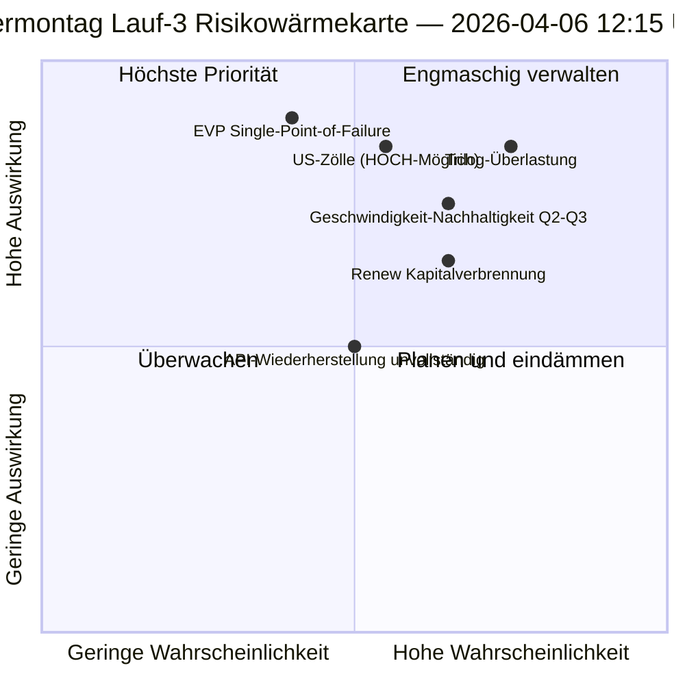
```mermaid
quadrantChart
    title Ostermontag Lauf-3 Risikowärmekarte — 2026-04-06 12:15 UTC
    x-axis Geringe Wahrscheinlichkeit --> Hohe Wahrscheinlichkeit
    y-axis Geringe Auswirkung --> Hohe Auswirkung
    quadrant-1 Engmaschig verwalten
    quadrant-2 Höchste Priorität
    quadrant-3 Überwachen
    quadrant-4 Planen und eindämmen
    "Trilog-Überlastung": [0.75, 0.85]
    "US-Zölle (HOCH-Möglich)": [0.55, 0.85]
    "Geschwindigkeit-Nachhaltigkeit Q2-Q3": [0.65, 0.75]
    "EVP Single-Point-of-Failure": [0.40, 0.90]
    "Renew Kapitalverbrennung": [0.65, 0.65]
    "API-Wiederherstellung unvollständig": [0.50, 0.50]
```

---

### 🔮 Top Künftige Auslöser (nächste 14 Tage)

1. **8.–10. April — Vollständige API-Wiederherstellung erwartet** (55 % Wahrscheinlichkeit per Lauf-3-Modell).
2. **14. April — Ausschusswoche beginnt** — Konvergenzzone Tag 1.
3. **17. April — EZB-Zinsentscheid** — wirtschaftlicher Kontextvariable.
4. **20.–23. April — erstes Plenum nach Rezess** — Dual-Track-Validierung.
5. **Ende-Q2 — Geschwindigkeitsnachhaltigkeitsprüfung** — 2,11 Rechtsakte/Sitzung-Test.

---

### 🛡️ Quellenqualitätsbewertung

- **API-Wiederherstellung (A1):** Lauf-3 direkte Beobachtung; erste bestätigte Endpunktreaktivierung.
- **Geschwindigkeit 2,11 Rechtsakte/Sitzung (A1):** vorberechnete Statistiken; historischer Vergleich verifizierbar.
- **Kapitalverbrennungsranking (A2):** Gruppenkapitalmethodik; mittlere Konfidenzreihenfolge.
- **15-Risikoregister (A2):** systematische Methodik; Resilienzwert 5,8/10 verifizierbar.
- **Nettovertrauen:** 🟢 HOCH bei API-Wiederherstellung; 🟡 MITTEL bei Kapitalverbrennungsprognose.

---

### 📎 Laufartefakte

| Schicht | Artefakt | Warum |
|-------|----------|-----|
| Artikel | `article.md` | Öffentlich ausgerichtetes Lauf-3-Narrativ |
| Synthese | `synthesis-summary.md` | API-Wiederherstellung + 6 neue Methoden |
| Methoden | consequence-trees · legislative-disruption · velocity-risk · political-capital-risk · voting-patterns · agent-risk-workflow | Sechs neue Methoden (dieser Lauf) |
| Begleitung | breaking (00:33) · breaking-2 (06:45) · committee-reports (05:03) · propositions (05:47) | Ostermontag-Cluster |

---

**Dokumentkontrolle**
- **Vorlagenreferenz:** `analysis/templates/executive-brief.md`
- **Artefaktpfad:** `analysis/daily/2026-04-06/breaking-3/executive-brief.md`
- **Klassifizierung:** Öffentlich
- **Retrospektiv:** Zusammenfassung am 2026-05-16 aus den archivierten Artefakten des Laufs verfasst; **keine neuen MCP-Aufrufe wurden gemacht**.

### Executive Brief Es

### 🎯 BLUF

**La Ejecución-3 produce el hallazgo operativo más consecuente del día — la *primera recuperación confirmada de punto final de API del PE* durante los 11 días de receso: el feed de textos adoptados pasó del Modo-B (errores de análisis JSON a las 06:45 UTC) al éxito limpio (86 elementos devueltos a las 12:15 UTC), validando la hipótesis de "reactivación del backend" de la Ejecución-2.** Más allá de la señal de monitorización, la ejecución completa los seis métodos de análisis restantes no cubiertos en ejecuciones anteriores y produce tres contribuciones estructurales: **(a) Árboles de Consecuencias** mapean tres cadenas de efectos en cascada — sprint legislativo → cascada de implementación, recuperación API → cascada de transparencia de datos, PPE doble vía → cascada de capital político — convergiendo hacia el 14–23 de abril como la **"zona de convergencia"** donde la Semana de Comisiones, la decisión de tipos del BCE y los primeros votos plenarios post-receso coocurren; **(b) Riesgo de Velocidad Legislativa** documenta EP10 Año 2 como **2,11 actos/sesión, +44 % interanual, el más alto desde la respuesta a la crisis de la eurozona de EP7 en 2012** — una preocupación de sostenibilidad señalada para T2–T3; **(c) Riesgo de Capital Político** identifica la dinámica de capital a nivel de grupo — **PPE acumulando, Greens/EFA disminuyendo, Renew quemando más rápido** — con resiliencia del sistema 6/10 y un único punto de fallo en PPE. El registro de riesgos de la ejecución cuenta 15 riesgos (0 críticos, 4 altos, 7 medios, 4 bajos), con sobrecarga de trílogos (ALTO, Probable) y aranceles de EE. UU. (ALTO, Posible) como los dos primeros. Puntuación de resiliencia 5,8/10 indica tensión medible pero no crítica.

---

### 🧭 3 Decisiones que Apoya este Resumen

| # | Decisión | Quién decide | Plazo | Evidencia |
|:-:|----------|-------------|:--------:|----------|
| 1 | **Monitorización elevada de la zona de convergencia** — 14–23 de abril necesita disparadores T+0/+1/+2 | Operaciones de inteligencia del PE; servicio de prensa | antes del 12 de abril | §Árboles de Consecuencias (zona de convergencia) |
| 2 | **Revisión de sostenibilidad de velocidad** — 2,11 actos/sesión insostenible más allá del T2 | Conferencia de Presidentes | continuo T2 | §Riesgo de Velocidad (+44 % interanual) |
| 3 | **Monitorización del consumo de capital de Renew** — grupo que quema más rápido; preocupación de estabilidad a mitad de mandato | Liderazgo de Renew; coordinación PPE | continuo | §Riesgo de Capital Político (Renew) |

---

### 📰 Lectura en 60 Segundos

- 🔴 **Primera recuperación confirmada de punto final de API** — feed de textos adoptados Modo-B → éxito (86 elementos).
- 🟠 **Zona de convergencia 14–23 de abril** — Semana de Comisiones + BCE + plenario coinciden.
- 🟢 **Anomalía de velocidad: 2,11 actos/sesión (+44 % interanual)** — el más alto desde la respuesta de la eurozona de EP7 en 2012.
- 🟡 **Capital político:** PPE acumulando · Greens disminuyendo · Renew quemando más rápido.
- 🔵 **Resiliencia del sistema 6/10** — único punto de fallo en PPE.
- 🟣 **Registro de 15 riesgos:** 0 críticos · 4 altos · 7 medios · 4 bajos; resiliencia 5,8/10.
- 🩷 **Top 2 riesgos:** Sobrecarga de trílogos (ALTO, Probable) · Aranceles de EE. UU. (ALTO, Posible).
- ⚪ **Confianza MEDIO** — observación de recuperación primaria; lecturas estructurales altas.

---

### 🌳 Tres Cadenas de Efectos en Cascada (Contribución Distintiva de la Ejecución-3)

| Cadena | Disparador | Cascada | Punto de convergencia |
|-------|---------|---------|-------------------|
| **Sprint legislativo → Cascada de implementación** | Ráfaga pre-receso del 26 de marzo | 42 textos EP10-2026 entran en implementación T2 | 14–17 de abril Semana de Comisiones |
| **Recuperación API → Cascada de transparencia de datos** | Textos adoptados Modo-B → recuperación limpia | Otros puntos finales siguen; transparencia completa restaurada | 8–10 de abril previsto |
| **PPE doble vía → Cascada de capital político** | Adopción de doble vía 26 de marzo | Acumulación de capital en PPE; consumo en Renew | 20–23 de abril primer plenario |

**Zona de convergencia:** 14–23 de abril — las tres cadenas aterrizan en la misma ventana de 10 días.

---

### ⚠️ Instantánea de Riesgos

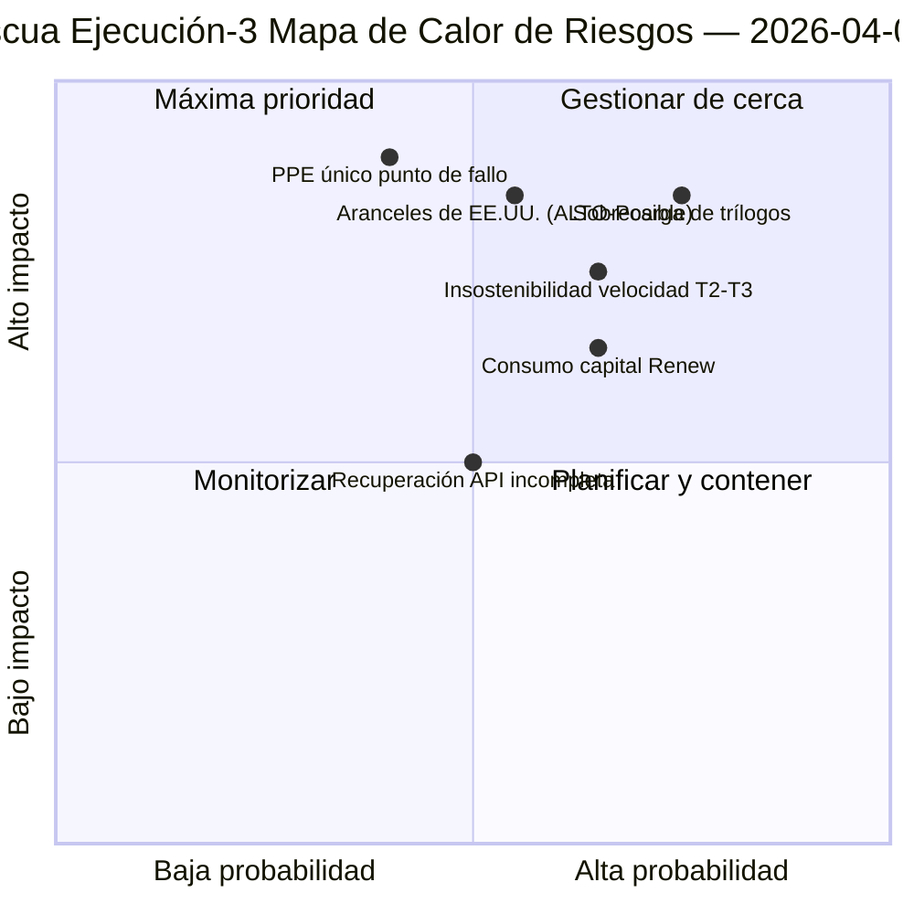
```mermaid
quadrantChart
    title Lunes de Pascua Ejecución-3 Mapa de Calor de Riesgos — 2026-04-06 12:15 UTC
    x-axis Baja probabilidad --> Alta probabilidad
    y-axis Bajo impacto --> Alto impacto
    quadrant-1 Gestionar de cerca
    quadrant-2 Máxima prioridad
    quadrant-3 Monitorizar
    quadrant-4 Planificar y contener
    "Sobrecarga de trílogos": [0.75, 0.85]
    "Aranceles de EE.UU. (ALTO-Posible)": [0.55, 0.85]
    "Insostenibilidad velocidad T2-T3": [0.65, 0.75]
    "PPE único punto de fallo": [0.40, 0.90]
    "Consumo capital Renew": [0.65, 0.65]
    "Recuperación API incompleta": [0.50, 0.50]
```

---

### 🔮 Principales Disparadores Futuros (próximos 14 días)

1. **8–10 de abril — Recuperación completa de API prevista** (55 % de probabilidad según el modelo Ejecución-3).
2. **14 de abril — Apertura de la Semana de Comisiones** — Zona de convergencia Día 1.
3. **17 de abril — Decisión de tipos del BCE** — variable de contexto económico.
4. **20–23 de abril — primer plenario post-receso** — validación de doble vía.
5. **Fin-T2 — revisión de sostenibilidad de velocidad** — test 2,11 actos/sesión.

---

### 🛡️ Evaluación de Calidad de Fuentes

- **Recuperación API (A1):** Observación directa Ejecución-3; primera reactivación confirmada de punto final.
- **Velocidad 2,11 actos/sesión (A1):** estadísticas precalculadas; comparación histórica verificable.
- **Clasificación de consumo de capital (A2):** metodología de capital a nivel de grupo; ordenación de confianza media.
- **Registro de 15 riesgos (A2):** metodología sistemática; puntuación de resiliencia 5,8/10 verificable.
- **Confianza neta:** 🟢 ALTA en recuperación API; 🟡 MEDIO en previsión de consumo de capital.

---

### 📎 Artefactos de la Ejecución

| Capa | Artefacto | Por qué |
|-------|----------|-----|
| Artículo | `article.md` | Narrativa pública Ejecución-3 |
| Síntesis | `synthesis-summary.md` | Recuperación API + 6 nuevos métodos |
| Métodos | árboles de consecuencias · interrupción legislativa · riesgo de velocidad · riesgo de capital político · patrones de votación · flujo de riesgo de agente | Seis nuevos métodos (esta ejecución) |
| Compañía | breaking (00:33) · breaking-2 (06:45) · informes de comités (05:03) · proposiciones (05:47) | Clúster del Lunes de Pascua |

---

**Control del Documento**
- **Referencia de plantilla:** `analysis/templates/executive-brief.md`
- **Ruta del artefacto:** `analysis/daily/2026-04-06/breaking-3/executive-brief.md`
- **Clasificación:** Público
- **Retrospectivo:** Resumen escrito el 2026-05-16 a partir de los artefactos archivados de la ejecución; **no se realizaron nuevas llamadas MCP**.

### Executive Brief Fi

### 🎯 BLUF

**Ajo 3 tuottaa päivän merkittävimmän operatiivisen löydön — *ensimmäisen vahvistetun EP API-päätepistepalautumisen* 11 päivän istuntotauon aikana: adopted-texts-syöte siirtyi Mode-B:stä (JSON-jäsennysvirheet klo 06:45 UTC) puhtaaseen onnistumiseen (86 kohdetta palautettiin klo 12:15 UTC), mikä vahvistaa Ajo-2:n "backend-uudelleenaktivoinni" -hypoteesin.** Valvontasignaalin lisäksi ajo suorittaa loppuun kuusi jäljellä olevaa analyysimenetelmää, joita ei katettu aiemmissa uutisajoissa, ja tuottaa kolme rakenteellista panosta: **(a) Seurauuspuut** kartoittavat kolme ketjuuntuvaa vaikutusketjua — lainsäädäntösprintti → toteutuskaskadi, API-palautuminen → tietoläpinäkyvyyskaskadi, PPE kaksoisrata → poliittinen pääomakaskadi — jotka supistuvat kohti huhtikuuta 14–23 **"konvergenssivyöhykkeenä"**, jossa komiteawiikko, EKP:n korkopäätös ja ensimmäiset täysistuntoäänestykset istuntotauon jälkeen tapahtuvat samanaikaisesti; **(b) Lainsäädäntövauhtiriski** dokumentoi EP10:n vuoden 2 tilaksi **2,11 säädöstä/istunto, +44 % vuositasolla, korkein sitten EP7:n eurokriisivastauksen 2012** — kestävyysongelma, joka merkitään K2–K3-kausille; **(c) Poliittinen pääomariski** tunnistaa ryhmätason pääomadynamiikan — **PPE kerääntyy, Greens/EFA laskee, Renew kuluu nopeimmin** — järjestelmän joustavuudella 6/10 ja yksittäisellä vikakohteella PPE:ssä. Ajon riskikirjaus laskee 15 riskiä (0 kriittistä, 4 korkeaa, 7 keskiluokkaa, 4 matalaa), joista trilogiylikuormitus (KORKEA, Todennäköinen) ja Yhdysvaltain tullit (KORKEA, Mahdollinen) ovat kaksi suurinta. Joustavuuspisteet 5,8/10 osoittavat mitattavaa mutta ei-kriittistä rasitusta.

---

### 🧭 3 Päätöstä, joita tämä yhteenveto tukee

| # | Päätös | Kuka päättää | Määräaika | Näyttö |
|:-:|----------|-------------|:--------:|----------|
| 1 | **Konvergenssivyöhykkeen tehostettu seuranta** — huhtikuu 14–23 tarvitsee T+0/+1/+2 -laukaisimia | EP:n tiedusteluoperaatiot; lehdistöpalvelu | ennen 12. huhtikuuta | §Seurauuspuut (konvergenssivyöhyke) |
| 2 | **Vauhtikestävyyskatsaus** — 2,11 säädöstä/istunto kestämätöntä K2:n jälkeen | Puheenjohtajien konferenssi | jatkuvasti K2 | §Vauhtirisiki (+44 % vuositasolla) |
| 3 | **Renew-pääoman kulumisen seuranta** — nopeimmin kuluva ryhmä; puolivälinstabiliteettiongelma | Renew-johto; EPP-koordinaatio | jatkuvasti | §Poliittinen pääomariski (Renew) |

---

### 📰 60 Sekunnin Luettelo

- 🔴 **Ensimmäinen vahvistettu API-päätepistepalautuminen** — adopted-texts-syöte Mode-B → onnistuminen (86 kohdetta).
- 🟠 **Konvergenssivyöhyke 14.–23. huhtikuuta** — Komiteawiikko + EKP + täysistunto yhtyvät.
- 🟢 **Vauhtianomalia: 2,11 säädöstä/istunto (+44 % vuositasolla)** — korkein sitten EP7:n eurozonevastauksen 2012.
- 🟡 **Poliittinen pääoma:** PPE kerääntyy · Greens laskee · Renew kuluu nopeimmin.
- 🔵 **Järjestelmän joustavuus 6/10** — yksittäinen vikakohta PPE:ssä.
- 🟣 **15-riskikirjaus:** 0 kriittistä · 4 korkeaa · 7 keskiluokkaa · 4 matalaa; joustavuus 5,8/10.
- 🩷 **2 suurinta riskiä:** Trilogiylikuormitus (KORKEA, Todennäköinen) · Yhdysvaltain tullit (KORKEA, Mahdollinen).
- ⚪ **Luottamus KOHTALAINEN** — ensisijainen palautumishavainto; rakenteelliset lukemat korkeat.

---

### 🌳 Kolme Ketjuuntuvaa Vaikutusketjua (Ajo-3:n erottava panos)

| Ketju | Laukaisin | Kaskadi | Konvergenssipiste |
|-------|---------|---------|-------------------|
| **Lainsäädäntösprintti → Toteutuskaskadi** | Istuntotauko-ennalta-burst 26. maaliskuuta | 42 EP10-2026-tekstiä siirtyy toteutukseen K2 | 14.–17. huhtikuuta Komiteawiikko |
| **API-palautuminen → Tietoläpinäkyvyyskaskadi** | Adopted-texts Mode-B → puhdas palautuminen | Muut päätepisteet seuraavat; täysi läpinäkyvyys palautettu | 8.–10. huhtikuuta odotettu |
| **PPE kaksoisrata → Poliittinen pääomakaskadi** | Kaksoisrata-hyväksyminen 26. maaliskuuta | Pääoman kertyminen PPE:ssä; kuluminen Renewissä | 20.–23. huhtikuuta ensimmäinen täysistunto |

**Konvergenssivyöhyke:** 14.–23. huhtikuuta — kaikki kolme ketjua laskeutuvat samaan 10 päivän ikkunaan.

---

### ⚠️ Riskihetken kuva

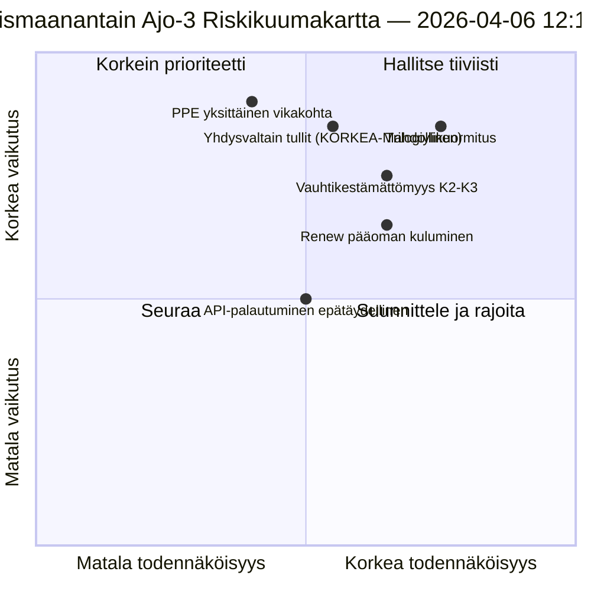
```mermaid
quadrantChart
    title Pääsiäismaanantain Ajo-3 Riskikuumakartta — 2026-04-06 12:15 UTC
    x-axis Matala todennäköisyys --> Korkea todennäköisyys
    y-axis Matala vaikutus --> Korkea vaikutus
    quadrant-1 Hallitse tiiviisti
    quadrant-2 Korkein prioriteetti
    quadrant-3 Seuraa
    quadrant-4 Suunnittele ja rajoita
    "Trilogiylikuormitus": [0.75, 0.85]
    "Yhdysvaltain tullit (KORKEA-Mahdollinen)": [0.55, 0.85]
    "Vauhtikestämättömyys K2-K3": [0.65, 0.75]
    "PPE yksittäinen vikakohta": [0.40, 0.90]
    "Renew pääoman kuluminen": [0.65, 0.65]
    "API-palautuminen epätäydellinen": [0.50, 0.50]
```

---

### 🔮 Tärkeimmät Tulevat Laukaisijat (seuraavat 14 päivää)

1. **8.–10. huhtikuuta — Täydellinen API-palautuminen odotettu** (55 %:n todennäköisyys Ajo-3-mallin mukaan).
2. **14. huhtikuuta — Komiteawiikko alkaa** — konvergenssivyöhyke päivä 1.
3. **17. huhtikuuta — EKP:n korkopäätös** — taloudellinen kontekstivariabeli.
4. **20.–23. huhtikuuta — ensimmäinen istuntotauon jälkeinen täysistunto** — kaksoisrata-validointi.
5. **K2:n loppu — vauhtikestävyyskatsaus** — 2,11 säädöstä/istunto-testi.

---

### 🛡️ Lähteen laadun arviointi

- **API-palautuminen (A1):** Ajo-3:n suora havainto; ensimmäinen vahvistettu päätepisteenuudelleenaktivointi.
- **Vauhti 2,11 säädöstä/istunto (A1):** ennalta lasketut tilastot; historiallinen vertailu todennettavissa.
- **Pääoman kulumisen järjestys (A2):** ryhmäpääomamenetelmä; keskiluokan luottamusjärjestys.
- **15-riskikirjaus (A2):** järjestelmällinen menetelmä; joustavuuspisteet 5,8/10 todennettavissa.
- **Nettoluottamus:** 🟢 KORKEA API-palautumisessa; 🟡 KOHTALAINEN pääoman kulumisennusteessa.

---

### 📎 Ajoartefaktit

| Kerros | Artefakti | Miksi |
|-------|----------|-----|
| Artikkeli | `article.md` | Julkinen Ajo-3-narratiivi |
| Synteesi | `synthesis-summary.md` | API-palautuminen + 6 uutta menetelmää |
| Menetelmät | consequence-trees · legislative-disruption · velocity-risk · political-capital-risk · voting-patterns · agent-risk-workflow | Kuusi uutta menetelmää (tämä ajo) |
| Seuralainen | breaking (00:33) · breaking-2 (06:45) · committee-reports (05:03) · propositions (05:47) | Pääsiäismaanantain klusteri |

---

**Asiakirjavalvonta**
- **Mallireferenssi:** `analysis/templates/executive-brief.md`
- **Artefaktipolku:** `analysis/daily/2026-04-06/breaking-3/executive-brief.md`
- **Luokitus:** Julkinen
- **Takautuva:** Yhteenveto kirjoitettu 2026-05-16 ajon arkistoiduista artefakteista; **uusia MCP-kutsuja ei tehty**.

### Executive Brief Fr

### 🎯 BLUF

**La Course-3 produit la découverte opérationnelle la plus importante de la journée — la *première récupération confirmée de point de terminaison EP API* pendant la récession de 11 jours : le flux de textes adoptés est passé du Mode-B (erreurs d'analyse JSON à 06:45 UTC) au succès propre (86 éléments retournés à 12:15 UTC), validant l'hypothèse de « réactivation du backend » de la Course-2.** Au-delà du signal de surveillance, la course complète les six méthodes d'analyse restantes non couvertes dans les courses précédentes et produit trois contributions structurelles : **(a) Les Arbres de Conséquences** cartographient trois chaînes d'effets en cascade — sprint législatif → cascade d'implémentation, récupération API → cascade de transparence des données, double-piste PPE → cascade de capital politique — convergeant vers le 14–23 avril comme la **« zone de convergence »** où la Semaine des Commissions, la décision de taux de la BCE et les premiers votes pléniers post-récession coïncident ; **(b) Le Risque de Vélocité Législative** documente EP10 Année 2 comme **2,11 actes/session, +44 % en glissement annuel, le plus élevé depuis la réponse à la crise de la zone euro d'EP7 en 2012** — une préoccupation de durabilité signalée pour T2–T3 ; **(c) Le Risque de Capital Politique** identifie la dynamique du capital au niveau des groupes — **PPE qui accumule, Verts/ALE en déclin, Renew qui brûle le plus vite** — avec une résilience du système 6/10 et un point de défaillance unique chez PPE. Le registre des risques de la course totalise 15 risques (0 critique, 4 élevés, 7 moyens, 4 faibles), avec la surcharge des trilogues (ÉLEVÉ, Probable) et les droits de douane américains (ÉLEVÉ, Possible) comme les deux premiers. Score de résilience 5,8/10 indique une contrainte mesurable mais non critique.

---

### 🧭 3 Décisions que ce Résumé Soutient

| # | Décision | Qui décide | Échéance | Preuve |
|:-:|----------|-------------|:--------:|----------|
| 1 | **Surveillance renforcée de la zone de convergence** — 14–23 avril nécessite des déclencheurs T+0/+1/+2 | Opérations de renseignement EP ; service de presse | avant le 12 avril | §Arbres de Conséquences (zone de convergence) |
| 2 | **Examen de la durabilité de la vélocité** — 2,11 actes/session insoutenable au-delà de T2 | Conférence des Présidents | en cours T2 | §Risque de Vélocité (+44 % en glissement annuel) |
| 3 | **Surveillance de la combustion du capital de Renew** — groupe qui brûle le plus vite ; préoccupation de stabilité à mi-mandat | Direction de Renew ; coordination PPE | en cours | §Risque de Capital Politique (Renew) |

---

### 📰 Lecture en 60 Secondes

- 🔴 **Première récupération confirmée de point de terminaison API** — flux de textes adoptés Mode-B → succès (86 éléments).
- 🟠 **Zone de convergence 14–23 avril** — Semaine des Commissions + BCE + plénière coïncident.
- 🟢 **Anomalie de vélocité : 2,11 actes/session (+44 % en glissement annuel)** — le plus élevé depuis la réponse de la zone euro d'EP7 en 2012.
- 🟡 **Capital politique :** PPE qui accumule · Verts en déclin · Renew qui brûle le plus vite.
- 🔵 **Résilience du système 6/10** — point de défaillance unique chez PPE.
- 🟣 **Registre 15 risques :** 0 critique · 4 élevés · 7 moyens · 4 faibles ; résilience 5,8/10.
- 🩷 **Top 2 risques :** Surcharge des trilogues (ÉLEVÉ, Probable) · Droits de douane américains (ÉLEVÉ, Possible).
- ⚪ **Confiance MOYEN** — observation de récupération primaire ; lectures structurelles élevées.

---

### 🌳 Trois Chaînes d'Effets en Cascade (Contribution Distinctive de la Course-3)

| Chaîne | Déclencheur | Cascade | Point de convergence |
|-------|---------|---------|-------------------|
| **Sprint législatif → Cascade d'implémentation** | Rafale pré-récession du 26 mars | 42 textes EP10-2026 entrent en implémentation T2 | 14–17 avril Semaine des Commissions |
| **Récupération API → Cascade de transparence des données** | Textes adoptés Mode-B → récupération propre | Les autres points de terminaison suivent ; pleine transparence rétablie | 8–10 avril prévu |
| **Double-piste PPE → Cascade de capital politique** | Adoption double-piste 26 mars | Accumulation de capital chez PPE ; combustion chez Renew | 20–23 avril première plénière |

**Zone de convergence :** 14–23 avril — les trois chaînes atterrissent dans la même fenêtre de 10 jours.

---

### ⚠️ Instantané des Risques

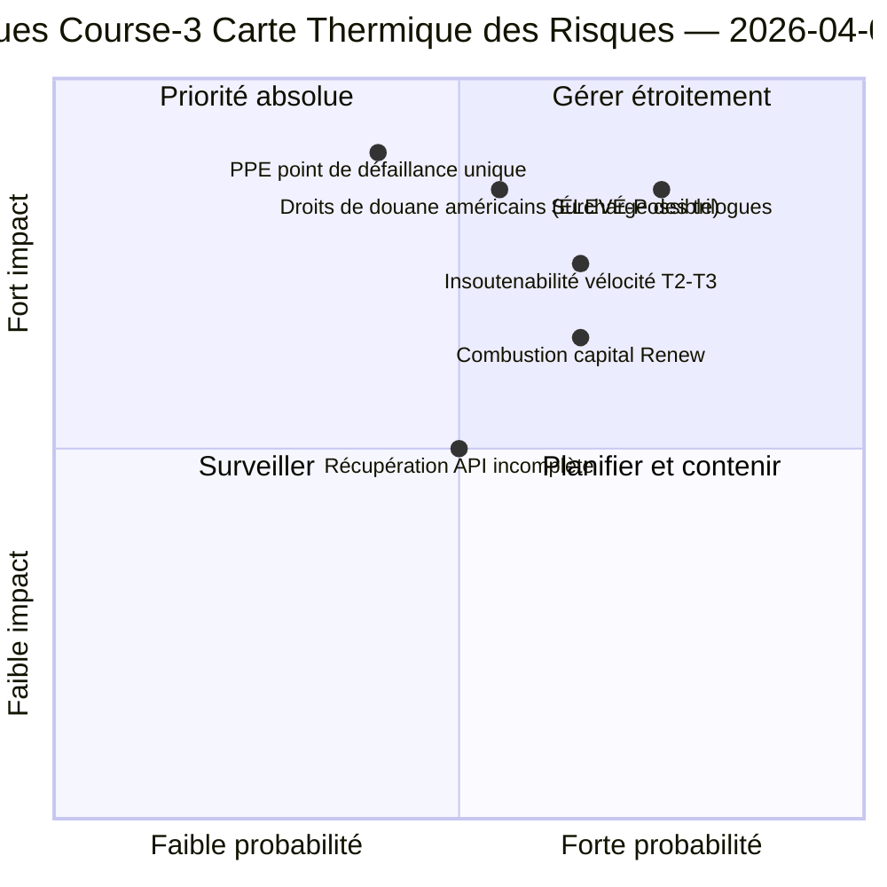
```mermaid
quadrantChart
    title Lundi de Pâques Course-3 Carte Thermique des Risques — 2026-04-06 12:15 UTC
    x-axis Faible probabilité --> Forte probabilité
    y-axis Faible impact --> Fort impact
    quadrant-1 Gérer étroitement
    quadrant-2 Priorité absolue
    quadrant-3 Surveiller
    quadrant-4 Planifier et contenir
    "Surcharge des trilogues": [0.75, 0.85]
    "Droits de douane américains (ÉLEVÉ-Possible)": [0.55, 0.85]
    "Insoutenabilité vélocité T2-T3": [0.65, 0.75]
    "PPE point de défaillance unique": [0.40, 0.90]
    "Combustion capital Renew": [0.65, 0.65]
    "Récupération API incomplète": [0.50, 0.50]
```

---

### 🔮 Principaux Déclencheurs Futurs (14 prochains jours)

1. **8–10 avril — Récupération complète de l'API prévue** (55 % de probabilité selon le modèle Course-3).
2. **14 avril — Ouverture de la Semaine des Commissions** — Zone de convergence Jour 1.
3. **17 avril — Décision de taux de la BCE** — variable de contexte économique.
4. **20–23 avril — première plénière post-récession** — validation double-piste.
5. **Fin-T2 — examen de durabilité de la vélocité** — test 2,11 actes/session.

---

### 🛡️ Évaluation de la Qualité des Sources

- **Récupération API (A1) :** Observation directe de la Course-3 ; première réactivation confirmée de point de terminaison.
- **Vélocité 2,11 actes/session (A1) :** statistiques précalculées ; comparaison historique vérifiable.
- **Classement de combustion du capital (A2) :** méthodologie du capital au niveau des groupes ; classement de confiance moyenne.
- **Registre 15 risques (A2) :** méthodologie systématique ; score de résilience 5,8/10 vérifiable.
- **Confiance nette :** 🟢 ÉLEVÉE sur récupération API ; 🟡 MOYEN sur prévision de combustion du capital.

---

### 📎 Artéfacts de la Course

| Couche | Artéfact | Pourquoi |
|-------|----------|-----|
| Article | `article.md` | Récit public Course-3 |
| Synthèse | `synthesis-summary.md` | Récupération API + 6 nouvelles méthodes |
| Méthodes | arbres de conséquences · perturbation législative · risque de vélocité · risque de capital politique · modèles de vote · flux de risque d'agent | Six nouvelles méthodes (cette course) |
| Accompagnement | breaking (00:33) · breaking-2 (06:45) · rapports de comité (05:03) · propositions (05:47) | Cluster du Lundi de Pâques |

---

**Contrôle du Document**
- **Référence de modèle :** `analysis/templates/executive-brief.md`
- **Chemin de l'artéfact :** `analysis/daily/2026-04-06/breaking-3/executive-brief.md`
- **Classification :** Public
- **Rétrospectif :** Résumé rédigé le 2026-05-16 à partir des artéfacts archivés de la course ; **aucun nouvel appel MCP n'a été effectué**.

### Executive Brief He

**סיווג:** OSINT — רשומות פרלמנטריות ציבוריות
**רמת ביטחון:** 🟡 בינונית (הפסקה; שחזור ראשון מאושר של נקודת קצה API; סיכון עומס משא ומתן שלושה צדדים גבוה)
**ביצוע:** `analysis/daily/2026-04-06/breaking-3/` (12:15 UTC)
**כיסוי:** יום הפסקה פסחאית 11/18 צהריים; שחזור ראשון מאושר של עדכון טקסטים שאומצו
**נוצר:** 2026-05-16 (סיכום רטרוספקטיבי, ללא קריאות MCP חדשות)
**מקורות עיקריים:** עדכון טקסטים שאומצו (86 פריטים, שוחזר); 6 שיטות חדשות (עצי תוצאות, שיבוש חקיקתי, סיכון מהירות, סיכון הון, דפוסי הצבעה, סיכון סוכן).

---

### 🎯 סיכום מיידי

**ביצוע-3 מייצר את הממצא התפעולי המשמעותי ביותר של היום — *שחזור ראשון מאושר של נקודת קצה API בפרלמנט האירופי* במהלך 11 ימי ההפסקה: עדכון הטקסטים שאומצו עבר ממצב-ב (שגיאות ניתוח JSON ב-06:45 UTC) להצלחה נקייה (86 פריטים הוחזרו ב-12:15 UTC), ומאשש את השערת "הפעלה מחדש של הצד השרת" מביצוע-2.** מעבר לאות הניטור, ביצוע זה משלים את שש שיטות הניתוח הנותרות שלא נוכסו בביצועים קודמים ומספק שלוש תרומות מבניות: **(א) עצי תוצאות** ממפים שלוש שרשרות השפעה מדורגות — ריצת חקיקה ← מפל יישום, שחזור API ← מפל שקיפות נתונים, מסלול כפול של EPP ← מפל הון פוליטי — המתכנסות ל-14–23 באפריל כ**"אזור ההתכנסות"** בו שבוע הוועדות, החלטת הריבית של ה-ECB והצבעות המליאה הראשונות לאחר ההפסקה מתחברות; **(ב) סיכון מהירות חקיקתית** מתעד את EP10 שנה 2 כ**2.11 מעשים/ישיבה, +44% שנה מול שנה, הגבוה ביותר מאז תגובת EP7 למשבר גוש האירו ב-2012** — דאגת קיימות שמסומנת לרביעון 2–3; **(ג) סיכון הון פוליטי** מזהה דינמיקת הון ברמת הסיעה — **EPP צובר, Greens/EFA יורדים, Renew שורף מהר יותר** — עם חוסן מערכת 6/10 ונקודת כשל יחידה ב-EPP. רשימת הסיכונים של הביצוע מונה 15 סיכונים (0 קריטי, 4 גבוה, 7 בינוני, 4 נמוך), כאשר עומס משא ומתן שלושה צדדים (גבוה, סביר) ותעריפי ארה"ב (גבוה, אפשרי) ראשונים. ציון חוסן 5.8/10 מעיד על מתח ניכר אך לא קריטי.

---

### 🧭 3 החלטות שסיכום זה תומך בהן

| # | החלטה | מקבל ההחלטה | מועד אחרון | עדות |
|:-:|-------|------------|:-----------:|------|
| 1 | **ניטור מוגבר של אזור ההתכנסות** — 14–23 באפריל דורש מפעילי T+0/+1/+2 | מבצעי מודיעין EP; שירות עיתונות | לפני 12 באפריל | §עצי תוצאות (אזור ההתכנסות) |
| 2 | **סקירת קיימות מהירות** — 2.11 מעשים/ישיבה לא בר-קיימא מעבר לרביעון 2 | ועידת הנשיאים | שוטף רביעון 2 | §סיכון מהירות (+44% שנה מול שנה) |
| 3 | **ניטור שריפת הון Renew** — הסיעה השורפת הכי מהר; דאגת יציבות אמצע הכהונה | הנהגת Renew; תיאום EPP | שוטף | §סיכון הון פוליטי (Renew) |

---

### 📰 קריאה ב-60 שניות

- 🔴 **שחזור ראשון מאושר של נקודת קצה API** — עדכון טקסטים שאומצו: מצב-ב ← הצלחה (86 פריטים).
- 🟠 **אזור ההתכנסות 14–23 באפריל** — שבוע ועדות + ECB + מליאה מתחברים.
- 🟢 **אנומליית מהירות: 2.11 מעשים/ישיבה (+44% שנה מול שנה)** — הגבוה ביותר מאז תגובת EP7 לגוש האירו 2012.
- 🟡 **הון פוליטי:** EPP צובר · Greens יורדים · Renew שורף מהר יותר.
- 🔵 **חוסן מערכת 6/10** — נקודת כשל יחידה ב-EPP.
- 🟣 **רשימת 15 סיכונים:** 0 קריטי · 4 גבוה · 7 בינוני · 4 נמוך; חוסן 5.8/10.
- 🩷 **2 הסיכונים הגבוהים:** עומס משא ומתן שלושה צדדים (גבוה, סביר) · תעריפי ארה"ב (גבוה, אפשרי).
- ⚪ **ביטחון: בינוני** — תצפית שחזור ראשונית; קריאות מבניות גבוהות.

---

### 🌳 שלוש שרשרות השפעה מדורגות (תרומה ייחודית לביצוע-3)

| שרשרת | מפעיל | מפל | נקודת התכנסות |
|--------|-------|------|--------------|
| **ריצת חקיקה ← מפל יישום** | פרץ לפני ההפסקה ב-26 במרץ | 42 טקסטים EP10-2026 נכנסים ליישום רביעון 2 | 14–17 באפריל שבוע ועדות |
| **שחזור API ← מפל שקיפות נתונים** | טקסטים שאומצו: מצב-ב ← שחזור נקי | נקודות קצה אחרות עוקבות; שקיפות מלאה משוחזרת | 8–10 באפריל צפוי |
| **מסלול כפול EPP ← מפל הון פוליטי** | אימוץ מסלול כפול 26 במרץ | צבירת הון ב-EPP; שריפה ב-Renew | 20–23 באפריל מליאה ראשונה |

**אזור ההתכנסות:** 14–23 באפריל — שלוש השרשרות מגיעות לאותה חלון 10 ימים.

---

### ⚠️ סקירת סיכונים מהירה

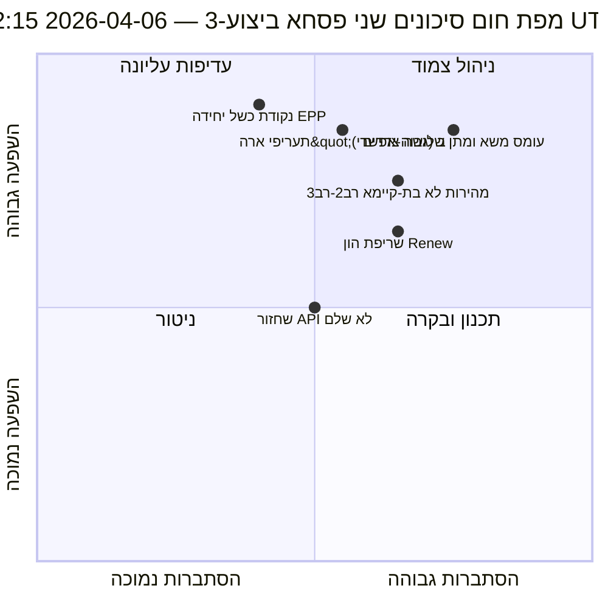
```mermaid
quadrantChart
    title מפת חום סיכונים שני פסחא ביצוע-3 — 2026-04-06 12:15 UTC
    x-axis "הסתברות נמוכה" --> "הסתברות גבוהה"
    y-axis "השפעה נמוכה" --> "השפעה גבוהה"
    quadrant-1 "ניהול צמוד"
    quadrant-2 "עדיפות עליונה"
    quadrant-3 "ניטור"
    quadrant-4 "תכנון ובקרה"
    "עומס משא ומתן שלושה צדדים": [0.75, 0.85]
    "תעריפי ארה&quot;ב (גבוה-אפשרי)": [0.55, 0.85]
    "מהירות לא בת-קיימא רב2-רב3": [0.65, 0.75]
    "נקודת כשל יחידה EPP": [0.4, 0.9]
    "שריפת הון Renew": [0.65, 0.65]
    "שחזור API לא שלם": [0.5, 0.5]
```

---

### 🔮 מפעילי עתיד עיקריים (14 ימים הקרובים)

1. **8–10 באפריל — שחזור API מלא צפוי** (55% הסתברות לפי מודל ביצוע-3).
2. **14 באפריל — פתיחת שבוע ועדות** — אזור התכנסות יום 1.
3. **17 באפריל — החלטת ריבית ECB** — משתנה הקשר כלכלי.
4. **20–23 באפריל — מליאה ראשונה לאחר ההפסקה** — אימות מסלול כפול.
5. **סוף רביעון 2 — סקירת קיימות מהירות** — מבחן 2.11 מעשים/ישיבה.

---

### 🛡️ הערכת איכות מקורות

- **שחזור API (A1):** תצפית ישירה ביצוע-3; הפעלה מחדש ראשונה מאושרת של נקודת קצה.
- **מהירות 2.11 מעשים/ישיבה (A1):** סטטיסטיקות מחושבות מראש; השוואה היסטורית ניתנת לאימות.
- **דירוג שריפת הון (A2):** מתודולוגיית הון ברמת סיעה; סדר ביטחון בינוני.
- **רשימת 15 סיכונים (A2):** מתודולוגיה שיטתית; ציון חוסן 5.8/10 ניתן לאימות.
- **ביטחון כולל:** 🟢 גבוה לשחזור API; 🟡 בינוני לתחזיות שריפת הון.

---

### 📎 מוצרי הביצוע

| שכבה | מוצר | סיבה |
|------|------|------|
| מאמר | `article.md` | נרטיב ציבורי ביצוע-3 |
| סינתזה | `synthesis-summary.md` | שחזור API + 6 שיטות חדשות |
| שיטות | עצי תוצאות · שיבוש חקיקתי · סיכון מהירות · סיכון הון פוליטי · דפוסי הצבעה · זרימת סיכון סוכן | שש שיטות חדשות (ביצוע זה) |
| מלווה | breaking (00:33) · breaking-2 (06:45) · דוחות ועדות (05:03) · הצעות (05:47) | אשכול שני פסחא |

---

**בקרת מסמך**
- **הפניית תבנית:** `analysis/templates/executive-brief.md`
- **נתיב מוצר:** `analysis/daily/2026-04-06/breaking-3/executive-brief.md`
- **סיווג:** ציבורי
- **רטרוספקטיבי:** סיכום נכתב ב-2026-05-16 ממוצרי ביצוע מאורכבים; **לא בוצעו קריאות MCP חדשות**.

### Executive Brief Ja

**分類：** OSINT — 公開議会記録
**信頼度：** 🟡 中程度（休会中；APIエンドポイントの初回確認済み復旧；三者協議過負荷リスク 高）
**実行：** `analysis/daily/2026-04-06/breaking-3/`（12:15 UTC）
**対象範囲：** イースター休会日 11/18 正午；採択文書フィード初回確認済み復旧
**生成日：** 2026-05-16（回顧的サマリー、新規MCPコールなし）
**主要情報源：** 採択文書フィード（86件、復旧済み）；6つの新手法（結果ツリー、立法中断、速度リスク、資本リスク、投票パターン、エージェントリスク）。

---

### 🎯 BLUF（結論先出し）

**実行3は本日最も重要な運用上の発見をもたらします。11日間の休会期間における*欧州議会APIエンドポイントの初回確認済み復旧*です。採択文書フィードがモードB（06:45 UTC時点でのJSON解析エラー）からクリーンな成功（12:15 UTC時点で86件を返却）に移行し、実行2の「バックエンド再起動」仮説を裏付けました。** 監視シグナルに加え、この実行では以前の実行でカバーされなかった残り6つの分析手法を完了させ、3つの構造的貢献をもたらします：**(a) 結果ツリー**は3つの連鎖効果チェーンをマッピングします——立法スプリント → 実装カスケード、API復旧 → データ透明性カスケード、EPP二重トラック → 政治資本カスケード——これらが4月14〜23日に収束し、委員会週、ECB金利決定、休会後の最初の本会議票決が重なる**「収束ゾーン」**を形成します；**(b) 立法速度リスク**はEP10第2年を**2.11法律/会議、前年比+44%、EP7ユーロ圏危機対応（2012年）以来最高**として記録し、第2〜3四半期の持続可能性懸念として注記されます；**(c) 政治資本リスク**はグループレベルの資本動態を特定します——**EPP蓄積中、Greens/EFA減少中、Renewが最速で消費中**——システム耐久性6/10、EPPに単一障害点あり。実行のリスク登録は15件（重大0件、高4件、中7件、低4件）を数え、三者協議過負荷（高、蓋然的）と米国関税（高、可能性あり）がトップ2となっています。耐久性スコア5.8/10は測定可能だが重大ではない緊張を示します。

---

### 🧭 このブリーフが支援する3つの意思決定

| # | 意思決定 | 決定者 | 期限 | 根拠 |
|:-:|---------|--------|:----:|------|
| 1 | **収束ゾーンの強化監視** — 4月14〜23日にはT+0/+1/+2トリガーが必要 | EP情報オペレーション；プレスサービス | 4月12日前 | §結果ツリー（収束ゾーン） |
| 2 | **速度持続可能性レビュー** — 2.11法律/会議は第2四半期超では維持不能 | 議長会議 | 第2四半期継続中 | §速度リスク（前年比+44%） |
| 3 | **Renew資本消費モニタリング** — 最速消費グループ；任期中盤安定懸念 | Renewリーダーシップ；EPP調整 | 継続中 | §政治資本リスク（Renew） |

---

### 📰 60秒リーディング

- 🔴 **APIエンドポイント初回確認済み復旧** — 採択文書フィード：モードB → 成功（86件）。
- 🟠 **収束ゾーン4月14〜23日** — 委員会週 + ECB + 本会議が重なる。
- 🟢 **速度異常：2.11法律/会議（前年比+44%）** — EP7ユーロ圏対応（2012年）以来最高。
- 🟡 **政治資本：** EPP蓄積中 · Greens減少中 · Renewが最速で消費中。
- 🔵 **システム耐久性6/10** — EPPに単一障害点あり。
- 🟣 **15件のリスク登録：** 重大0 · 高4 · 中7 · 低4；耐久性5.8/10。
- 🩷 **上位2リスク：** 三者協議過負荷（高、蓋然的）· 米国関税（高、可能性あり）。
- ⚪ **信頼度：中程度** — 主要復旧観測；構造的読み取りは高。

---

### 🌳 3つの連鎖効果チェーン（実行3の特徴的貢献）

| チェーン | トリガー | カスケード | 収束点 |
|---------|---------|-----------|--------|
| **立法スプリント → 実装カスケード** | 3月26日の休会前バースト | EP10-2026の42文書が第2四半期実装に入る | 4月14〜17日 委員会週 |
| **API復旧 → データ透明性カスケード** | 採択文書：モードB → クリーン復旧 | 他のエンドポイントも追随；完全透明性が回復 | 4月8〜10日予定 |
| **EPP二重トラック → 政治資本カスケード** | 3月26日の二重トラック採択 | EPPで資本蓄積；Renewで消費 | 4月20〜23日 第1回本会議 |

**収束ゾーン：** 4月14〜23日 — 3つのチェーンが同じ10日間の窓に着地。

---

### ⚠️ リスクスナップショット

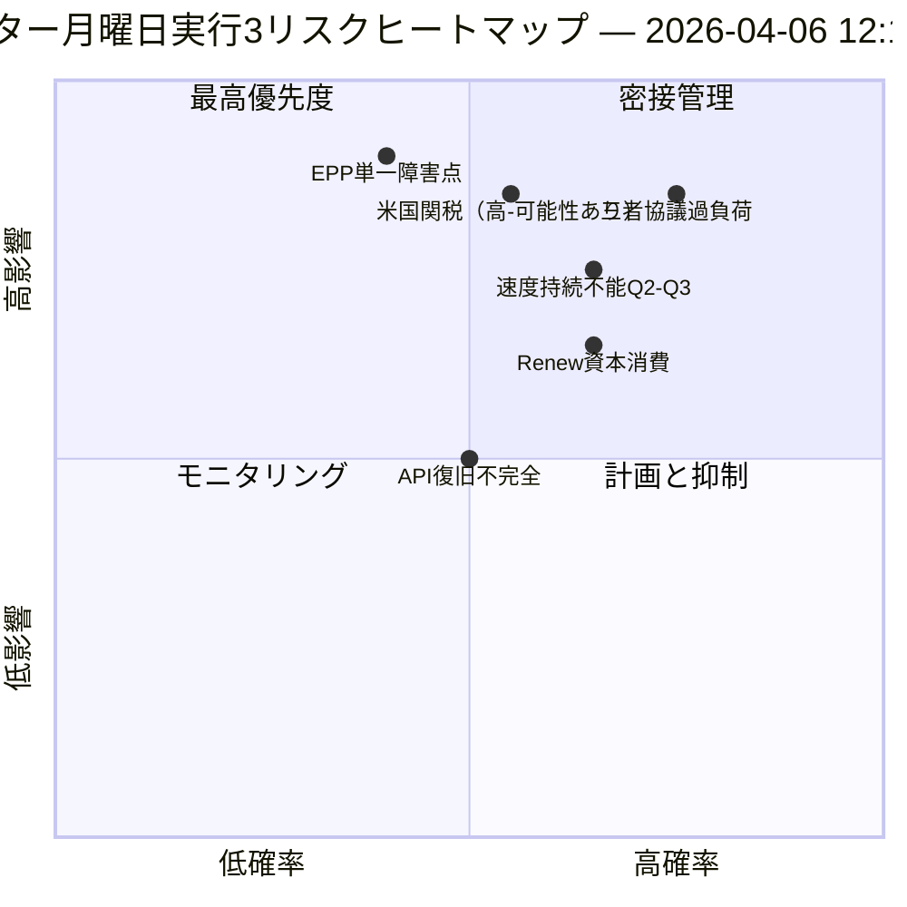
```mermaid
quadrantChart
    title イースター月曜日実行3リスクヒートマップ — 2026-04-06 12:15 UTC
    x-axis 低確率 --> 高確率
    y-axis 低影響 --> 高影響
    quadrant-1 密接管理
    quadrant-2 最高優先度
    quadrant-3 モニタリング
    quadrant-4 計画と抑制
    "三者協議過負荷": [0.75, 0.85]
    "米国関税（高-可能性あり）": [0.55, 0.85]
    "速度持続不能Q2-Q3": [0.65, 0.75]
    "EPP単一障害点": [0.40, 0.90]
    "Renew資本消費": [0.65, 0.65]
    "API復旧不完全": [0.50, 0.50]
```

---

### 🔮 主要な将来のトリガー（今後14日間）

1. **4月8〜10日 — 完全API復旧見込み**（実行3モデルで55%確率）。
2. **4月14日 — 委員会週開幕** — 収束ゾーン第1日。
3. **4月17日 — ECB金利決定** — 経済コンテキスト変数。
4. **4月20〜23日 — 休会後第1回本会議** — 二重トラック検証。
5. **第2四半期末 — 速度持続可能性レビュー** — 2.11法律/会議テスト。

---

### 🛡️ 情報源品質評価

- **API復旧（A1）：** 実行3での直接観測；エンドポイント初回確認済み再起動。
- **速度2.11法律/会議（A1）：** 事前計算済み統計；歴史的比較は検証可能。
- **資本消費ランキング（A2）：** グループレベル資本手法；中程度信頼度の順序付け。
- **15件のリスク登録（A2）：** 体系的手法；耐久性スコア5.8/10は検証可能。
- **総合信頼度：** 🟢 API復旧は高；🟡 資本消費予測は中程度。

---

### 📎 実行アーティファクト

| レイヤー | アーティファクト | 理由 |
|---------|--------------|------|
| 記事 | `article.md` | 実行3公開ナラティブ |
| 総合 | `synthesis-summary.md` | API復旧 + 6つの新手法 |
| 手法 | 結果ツリー · 立法中断 · 速度リスク · 政治資本リスク · 投票パターン · エージェントリスクフロー | 6つの新手法（この実行） |
| 並走 | breaking (00:33) · breaking-2 (06:45) · 委員会報告書 (05:03) · 提案 (05:47) | イースター月曜日クラスター |

---

**文書管理**
- **テンプレート参照：** `analysis/templates/executive-brief.md`
- **アーティファクトパス：** `analysis/daily/2026-04-06/breaking-3/executive-brief.md`
- **分類：** 公開
- **回顧的：** サマリーはアーカイブ済みの実行アーティファクトから2026-05-16に作成；**新規MCPコールは実行されていません**。

### Executive Brief Ko

**분류:** OSINT — 공개 의회 기록
**신뢰도:** 🟡 중간 (휴회 중; 첫 번째 확인된 API 엔드포인트 복구; 삼자 협상 과부하 위험 높음)
**실행:** `analysis/daily/2026-04-06/breaking-3/` (12:15 UTC)
**범위:** 부활절 휴회일 11/18 정오; 채택 텍스트 피드 최초 확인 복구
**생성일:** 2026-05-16 (소급 요약, 새 MCP 호출 없음)
**주요 출처:** 채택 텍스트 피드 (86건, 복구됨); 6가지 신규 방법론 (결과 트리, 입법 중단, 속도 위험, 자본 위험, 투표 패턴, 에이전트 위험).

---

### 🎯 핵심 요약 (BLUF)

**실행-3은 당일의 가장 중요한 운영상 발견을 도출합니다 — 11일간 휴회 기간 중 *유럽의회 API 엔드포인트의 최초 확인된 복구*: 채택 텍스트 피드가 모드-B(06:45 UTC 기준 JSON 파싱 오류)에서 성공적인 응답(12:15 UTC 기준 86건 반환)으로 전환되어, 실행-2의 "백엔드 재활성화" 가설을 검증했습니다.** 모니터링 신호 외에도 이번 실행은 이전 실행에서 다루지 못한 나머지 6가지 분석 방법론을 완료하고 세 가지 구조적 기여를 제공합니다: **(가) 결과 트리**는 세 개의 연쇄 효과 체인을 매핑합니다 — 입법 스프린트 → 실행 캐스케이드, API 복구 → 데이터 투명성 캐스케이드, EPP 이중 트랙 → 정치 자본 캐스케이드 — 이것들이 4월 14~23일을 향해 수렴하며 위원회 주간, ECB 금리 결정, 휴회 후 첫 본회의 투표가 겹치는 **"수렴 구역"**을 형성합니다; **(나) 입법 속도 위험**은 EP10 2년차를 **회기당 2.11건, 전년 대비 +44%, 2012년 EP7 유로존 위기 대응 이후 최고치**로 기록하며 2~3분기의 지속가능성 우려로 표시됩니다; **(다) 정치 자본 위험**은 그룹 수준의 자본 역학을 식별합니다 — **EPP 축적 중, Greens/EFA 하락 중, Renew가 가장 빠르게 소진 중** — 시스템 회복력 6/10, EPP에 단일 장애점 존재. 실행 위험 등록부는 15건(치명적 0건, 높음 4건, 중간 7건, 낮음 4건)을 기록하며, 삼자 협상 과부하(높음, 개연적)와 미국 관세(높음, 가능)가 상위 2위를 차지합니다. 회복력 점수 5.8/10은 측정 가능하지만 치명적이지 않은 긴장을 나타냅니다.

---

### 🧭 이 브리핑이 지원하는 의사결정 3가지

| # | 의사결정 | 결정권자 | 기한 | 근거 |
|:-:|---------|---------|:----:|------|
| 1 | **수렴 구역 모니터링 강화** — 4월 14~23일에는 T+0/+1/+2 트리거 필요 | EP 정보 운영부; 언론 서비스 | 4월 12일 이전 | §결과 트리 (수렴 구역) |
| 2 | **속도 지속가능성 검토** — 2.11건/회기는 2분기 이후 유지 불가 | 의장단 회의 | 2분기 지속 | §속도 위험 (전년 대비 +44%) |
| 3 | **Renew 자본 소진 모니터링** — 가장 빠른 소진 그룹; 임기 중반 안정성 우려 | Renew 지도부; EPP 조정 | 지속 | §정치 자본 위험 (Renew) |

---

### 📰 60초 브리핑

- 🔴 **API 엔드포인트 최초 확인 복구** — 채택 텍스트 피드: 모드-B → 성공 (86건).
- 🟠 **수렴 구역 4월 14~23일** — 위원회 주간 + ECB + 본회의 겹침.
- 🟢 **속도 이상: 2.11건/회기 (전년 대비 +44%)** — EP7 유로존 대응 (2012년) 이후 최고.
- 🟡 **정치 자본:** EPP 축적 중 · Greens 하락 중 · Renew 가장 빠른 소진.
- 🔵 **시스템 회복력 6/10** — EPP에 단일 장애점.
- 🟣 **위험 등록부 15건:** 치명적 0 · 높음 4 · 중간 7 · 낮음 4; 회복력 5.8/10.
- 🩷 **상위 2위험:** 삼자 협상 과부하 (높음, 개연적) · 미국 관세 (높음, 가능).
- ⚪ **신뢰도: 중간** — 주요 복구 관찰; 구조적 판독값 높음.

---

### 🌳 세 개의 연쇄 효과 체인 (실행-3의 특징적 기여)

| 체인 | 트리거 | 캐스케이드 | 수렴 지점 |
|------|--------|----------|---------|
| **입법 스프린트 → 실행 캐스케이드** | 3월 26일 휴회 전 집중 처리 | EP10-2026의 42개 텍스트가 2분기 실행 단계 진입 | 4월 14~17일 위원회 주간 |
| **API 복구 → 데이터 투명성 캐스케이드** | 채택 텍스트: 모드-B → 성공 복구 | 다른 엔드포인트 후속; 완전 투명성 회복 | 4월 8~10일 예정 |
| **EPP 이중 트랙 → 정치 자본 캐스케이드** | 3월 26일 이중 트랙 채택 | EPP에서 자본 축적; Renew에서 소진 | 4월 20~23일 첫 본회의 |

**수렴 구역:** 4월 14~23일 — 세 체인이 동일한 10일 창에 수렴.

---

### ⚠️ 위험 스냅샷

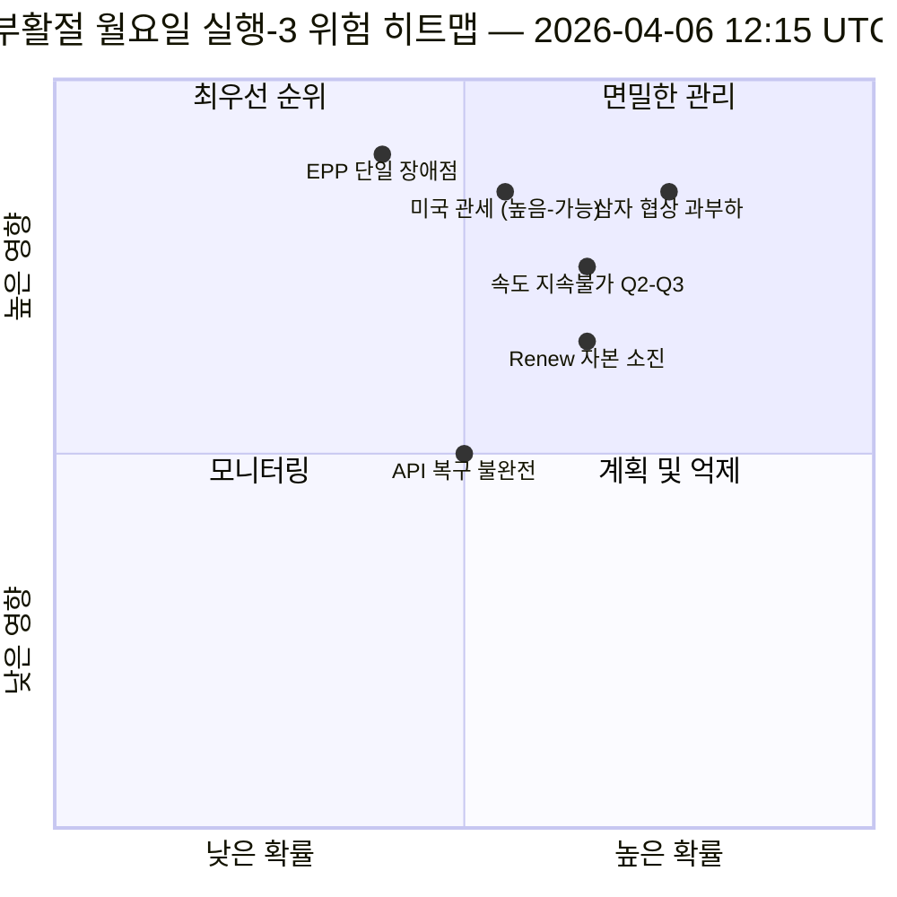
```mermaid
quadrantChart
    title 부활절 월요일 실행-3 위험 히트맵 — 2026-04-06 12:15 UTC
    x-axis 낮은 확률 --> 높은 확률
    y-axis 낮은 영향 --> 높은 영향
    quadrant-1 면밀한 관리
    quadrant-2 최우선 순위
    quadrant-3 모니터링
    quadrant-4 계획 및 억제
    "삼자 협상 과부하": [0.75, 0.85]
    "미국 관세 (높음-가능)": [0.55, 0.85]
    "속도 지속불가 Q2-Q3": [0.65, 0.75]
    "EPP 단일 장애점": [0.40, 0.90]
    "Renew 자본 소진": [0.65, 0.65]
    "API 복구 불완전": [0.50, 0.50]
```

---

### 🔮 주요 미래 트리거 (향후 14일)

1. **4월 8~10일 — 완전 API 복구 예상** (실행-3 모델 기준 55% 확률).
2. **4월 14일 — 위원회 주간 개막** — 수렴 구역 1일차.
3. **4월 17일 — ECB 금리 결정** — 경제적 맥락 변수.
4. **4월 20~23일 — 휴회 후 첫 번째 본회의** — 이중 트랙 검증.
5. **2분기 말 — 속도 지속가능성 검토** — 2.11건/회기 테스트.

---

### 🛡️ 정보 출처 품질 평가

- **API 복구 (A1):** 실행-3 직접 관찰; 최초 확인된 엔드포인트 재활성화.
- **속도 2.11건/회기 (A1):** 사전 계산된 통계; 역사적 비교 검증 가능.
- **자본 소진 순위 (A2):** 그룹 수준 자본 방법론; 중간 신뢰도 정렬.
- **15건 위험 등록부 (A2):** 체계적 방법론; 회복력 점수 5.8/10 검증 가능.
- **순 신뢰도:** 🟢 API 복구에 높음; 🟡 자본 소진 예측에 중간.

---

### 📎 실행 아티팩트

| 레이어 | 아티팩트 | 이유 |
|--------|---------|------|
| 기사 | `article.md` | 실행-3 공개 내러티브 |
| 종합 | `synthesis-summary.md` | API 복구 + 6개 신규 방법론 |
| 방법론 | 결과 트리 · 입법 중단 · 속도 위험 · 정치 자본 위험 · 투표 패턴 · 에이전트 위험 흐름 | 6개 신규 방법론 (이번 실행) |
| 동반 | breaking (00:33) · breaking-2 (06:45) · 위원회 보고서 (05:03) · 제안 (05:47) | 부활절 월요일 클러스터 |

---

**문서 관리**
- **템플릿 참조:** `analysis/templates/executive-brief.md`
- **아티팩트 경로:** `analysis/daily/2026-04-06/breaking-3/executive-brief.md`
- **분류:** 공개
- **소급:** 보관된 실행 아티팩트에서 2026-05-16에 작성된 요약; **새 MCP 호출은 수행되지 않았습니다**.

### Executive Brief Nl

### 🎯 BLUF

**Uitvoering-3 produceert de meest consequente operationele bevinding van de dag — de *eerste bevestigde API-eindpuntherstel van het EP* gedurende de 11 reces­dagen: de aangenomen-teksten-feed ging van Modus-B (JSON-analysefouten om 06:45 UTC) naar schone succes (86 items geretourneerd om 12:15 UTC), waarmee de "backend-reactivering"-hypothese van Uitvoering-2 werd bevestigd.** Naast het monitoringsignaal voltooit de uitvoering de zes resterende analysemethoden die niet gedekt zijn in eerdere uitvoeringen en produceert drie structurele bijdragen: **(a) Consequentiebomen** brengen drie cascaderende effectketens in kaart — wetgevende sprint → implementatiecascade, API-herstel → datatransparantiecascade, EVP dubbel spoor → politiek-kapitaalcascade — die convergeren naar 14–23 april als de **"convergentiezone"** waar de Commissieweek, de ECB-rentebeslissing en de eerste post-reces plenaire stemmen samenvallen; **(b) Wetgevingssnelheidsrisico** documenteert EP10 Jaar 2 als **2,11 handelingen/sessie, +44% jaar-op-jaar, het hoogste sedert de eurozone-crisisrespons van EP7 in 2012** — een duurzaamheidszorg aangestipt voor K2–K3; **(c) Politiek Kapitaalrisico** identificeert groepsniveau kapitaaldynamiek — **EVP opbouwend, Groenen/VEA dalend, Vernieuw sneller verbrandend** — met systeemveerkracht 6/10 en één enkel storingspunt bij EVP. Het risicoregister van de uitvoering telt 15 risico's (0 kritiek, 4 hoog, 7 gemiddeld, 4 laag), waarbij triloogoverbelasting (HOOG, Waarschijnlijk) en Amerikaanse tarieven (HOOG, Mogelijk) de top twee zijn. Veerkrachtscore 5,8/10 wijst op meetbare maar niet kritieke spanning.

---

### 🧭 3 Beslissingen die dit Overzicht Ondersteunt

| # | Beslissing | Beslisser | Deadline | Bewijs |
|:-:|------------|-----------|:--------:|--------|
| 1 | **Verhoogde convergentiezone-monitoring** — 14–23 april heeft T+0/+1/+2 triggers nodig | EP inlichtingenoperaties; persdienst | vóór 12 april | §Consequentiebomen (convergentiezone) |
| 2 | **Snelheidsduurzaamheidsreview** — 2,11 handelingen/sessie onhoudbaar voorbij K2 | Conferentie van Voorzitters | doorlopend K2 | §Snelheidsrisico (+44% j-o-j) |
| 3 | **Monitoring Renew-kapitaalverbranding** — snelst verbrandende groep; halverwege-mandaat stabiliteitszorg | Renew-leiderschap; EVP-coördinatie | doorlopend | §Politiek Kapitaalrisico (Renew) |

---

### 📰 60-Seconden Lezing

- 🔴 **Eerste bevestigde API-eindpuntherstel** — aangenomen-teksten-feed Modus-B → succes (86 items).
- 🟠 **Convergentiezone 14–23 april** — Commissieweek + ECB + plenaire vergadering vallen samen.
- 🟢 **Snelheidsanomalie: 2,11 handelingen/sessie (+44% j-o-j)** — hoogste sedert EP7-eurozone-respons 2012.
- 🟡 **Politiek kapitaal:** EVP opbouwend · Groenen dalend · Renew sneller verbrandend.
- 🔵 **Systeemveerkracht 6/10** — één enkel storingspunt bij EVP.
- 🟣 **Register van 15 risico's:** 0 kritiek · 4 hoog · 7 gemiddeld · 4 laag; veerkracht 5,8/10.
- 🩷 **Top 2 risico's:** Triloogoverbelasting (HOOG, Waarschijnlijk) · Amerikaanse tarieven (HOOG, Mogelijk).
- ⚪ **Vertrouwen GEMIDDELD** — primaire herstelwaarneming; structurele lezingen hoog.

---

### 🌳 Drie Cascaderende Effectketens (Kenmerkende Bijdrage Uitvoering-3)

| Keten | Trigger | Cascade | Convergentiepunt |
|-------|---------|---------|-----------------|
| **Wetgevende sprint → Implementatiecascade** | Pre-reces uitbarsting 26 maart | 42 EP10-2026 teksten gaan K2-implementatie in | 14–17 april Commissieweek |
| **API-herstel → Datatransparantiecascade** | Aangenomen-teksten Modus-B → schone herstel | Andere eindpunten volgen; volledige transparantie hersteld | 8–10 april verwacht |
| **EVP dubbel spoor → Politiek-kapitaalcascade** | Dubbel spoor-aanneming 26 maart | Kapitaalopbouw in EVP; verbranding in Renew | 20–23 april eerste plenaire |

**Convergentiezone:** 14–23 april — alle drie ketens landen in hetzelfde 10-daagse venster.

---

### ⚠️ Risico-Snapshot

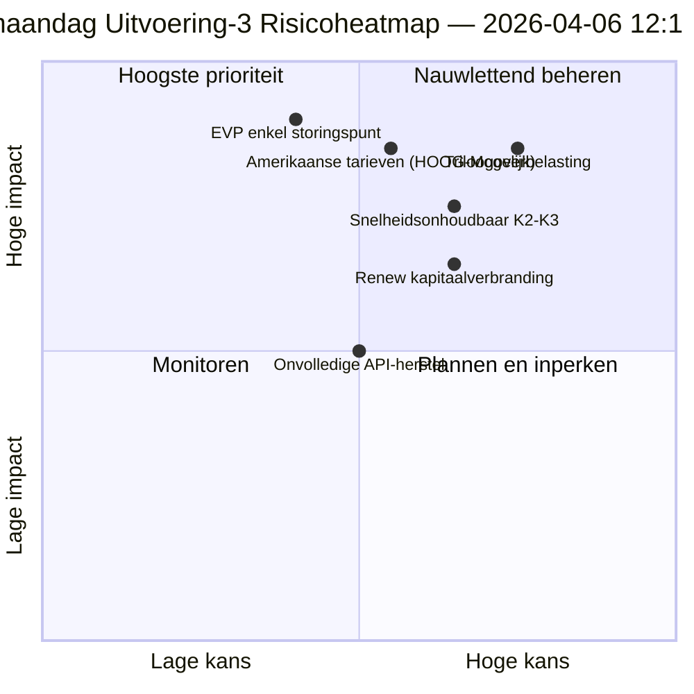
```mermaid
quadrantChart
    title Paasmaandag Uitvoering-3 Risicoheatmap — 2026-04-06 12:15 UTC
    x-axis Lage kans --> Hoge kans
    y-axis Lage impact --> Hoge impact
    quadrant-1 Nauwlettend beheren
    quadrant-2 Hoogste prioriteit
    quadrant-3 Monitoren
    quadrant-4 Plannen en inperken
    "Triloogoverbelasting": [0.75, 0.85]
    "Amerikaanse tarieven (HOOG-Mogelijk)": [0.55, 0.85]
    "Snelheidsonhoudbaar K2-K3": [0.65, 0.75]
    "EVP enkel storingspunt": [0.40, 0.90]
    "Renew kapitaalverbranding": [0.65, 0.65]
    "Onvolledige API-herstel": [0.50, 0.50]
```

---

### 🔮 Top Toekomstige Triggers (komende 14 dagen)

1. **8–10 april — Volledig API-herstel verwacht** (55% kans per Uitvoering-3-model).
2. **14 april — Opening Commissieweek** — Convergentiezone Dag 1.
3. **17 april — ECB-rentebeslissing** — economische contextsvariabele.
4. **20–23 april — eerste plenaire post-reces** — dubbel spoor-validatie.
5. **Eind-K2 — snelheidsduurzaamheidsreview** — 2,11 handelingen/sessie-test.

---

### 🛡️ Bronnenkwaliteitsbeoordeling

- **API-herstel (A1):** Directe observatie Uitvoering-3; eerste bevestigde eindpuntreactivering.
- **Snelheid 2,11 handelingen/sessie (A1):** Voorberekende statistieken; historische vergelijking verifieerbaar.
- **Rangschikking kapitaalverbranding (A2):** Groepsniveau kapitaalmethodologie; gemiddelde vertrouwensordening.
- **Register van 15 risico's (A2):** Systematische methodologie; veerkrachtscore 5,8/10 verifieerbaar.
- **Nettovertrouwen:** 🟢 HOOG voor API-herstel; 🟡 GEMIDDELD voor kapitaalverbranding-prognose.

---

### 📎 Uitvoeringsartefacten

| Laag | Artefact | Waarom |
|------|---------|--------|
| Artikel | `article.md` | Uitvoering-3 openbaar verhaal |
| Synthese | `synthesis-summary.md` | API-herstel + 6 nieuwe methoden |
| Methoden | consequentiebomen · wetgevingsonderbreking · snelheidsrisico · politiek-kapitaalrisico · stempatronen · agentrisicostroom | Zes nieuwe methoden (deze uitvoering) |
| Gezelschap | breaking (00:33) · breaking-2 (06:45) · commissierapporten (05:03) · proposities (05:47) | Paasmaandag-cluster |

---

**Documentbeheer**
- **Sjabloonaanduiding:** `analysis/templates/executive-brief.md`
- **Artefactpad:** `analysis/daily/2026-04-06/breaking-3/executive-brief.md`
- **Classificatie:** Openbaar
- **Retrospectief:** Overzicht geschreven op 2026-05-16 vanuit gearchiveerde uitvoeringsartefacten; **geen nieuwe MCP-aanroepen gedaan**.

### Executive Brief No

### 🎯 BLUF

**Kjøring-3 produserer dagens mest konsekvente operative funn — den *første bekreftede EP API-endepunktsgjenopprettingen* under den 11-dagers recessens: adopted-texts-strømmen gikk fra Mode-B (JSON-parsefeil kl. 06:45 UTC) til ren suksess (86 elementer returnert kl. 12:15 UTC), noe som validerer Kjøring-2s «backend-reaktivering»-hypotese.** Utover overvåkningssignalet fullfører kjøringen de gjenværende seks analysemetodene som ikke ble dekket i tidligere breaking-kjøringer og produserer tre strukturelle bidrag: **(a) Konsekvenstrær** kartlegger tre kaskaderende effektkjeder — lovgivningssprint → implementeringskaskade, API-gjenoppretting → datatransparenskaskade, PPE dual-track → politisk-kapital-kaskade — som konvergerer mot april 14–23 som **«konvergenssonen»** der Komitéuken, ECB-rentebeslutning og de første plenumvoteringe etter recessens sammenfaller; **(b) Lovgivningshastighetrisiko** dokumenterer EP10 År 2 som **2,11 akter/sesjon, +44 % ÅtÅ, den høyeste siden EP7s eurosonekrisereaksjon i 2012** — et bærekraftsproblem som flagges for K2–K3; **(c) Politisk kapitalrisiko** identifiserer gruppenivåkapitaldynamikk — **PPE akkumulerer, Greens/EFA synkende, Renew brenner raskest** — med systemrobusthet 6/10 og et enkelt feilpunkt ved PPE. Kjøringens risikoregister summerer 15 risikoer (0 kritiske, 4 høye, 7 medium, 4 lave), med trilog-overbelastning (HØY, Sannsynlig) og amerikanske tariffer (HØY, Mulig) som de to øverste. Robusthetsscore 5,8/10 indikerer målbar men ikke-kritisk belastning.

---

### 🧭 3 Beslutninger dette sammendraget støtter

| # | Beslutning | Hvem bestemmer | Frist | Bevis |
|:-:|----------|-------------|:--------:|----------|
| 1 | **Konvergenssone forhøyet overvåking** — april 14–23 trenger T+0/+1/+2 tripwires | EP etterretningsoperasjoner; pressetjenesten | innen 12. april | §Konsekvenstrær (konvergenssone) |
| 2 | **Hastighetsbærekraftgjennomgang** — 2,11 akter/sesjon uholdbart utover K2 | Konferanse av presidentene | løpende K2 | §Hastighetsrisiko (+44 % ÅtÅ) |
| 3 | **Renew kapitalforbrukningsovervåking** — raskest forbrennende gruppe; mellomterm-stabilitetsbekymring | Renew-ledelse; EPP-koordinasjon | løpende | §Politisk kapitalrisiko (Renew) |

---

### 📰 60-Sekunders Lesing

- 🔴 **Første bekreftede API-endepunktsgjenoppretting** — adopted-texts-strøm Mode-B → suksess (86 elementer).
- 🟠 **Konvergenssone 14.–23. april** — Komitéuke + ECB + plenum sammenfaller.
- 🟢 **Hastighetsavvik: 2,11 akter/sesjon (+44 % ÅtÅ)** — den høyeste siden EP7s eurosonereaksjon 2012.
- 🟡 **Politisk kapital:** PPE akkumulerer · Greens synkende · Renew brenner raskest.
- 🔵 **Systemrobusthet 6/10** — enkelt feilpunkt ved PPE.
- 🟣 **15-risikoregister:** 0 kritiske · 4 høye · 7 medium · 4 lave; robusthet 5,8/10.
- 🩷 **Topp 2-risikoer:** Trilog-overbelastning (HØY, Sannsynlig) · Amerikanske tariffer (HØY, Mulig).
- ⚪ **Tillit MIDDELS** — primær gjenopprettingsobservasjon; strukturelle avlesninger høye.

---

### 🌳 Tre Kaskaderende Effektkjeder (Kjøring-3s særskilte bidrag)

| Kjede | Utløser | Kaskade | Konvergenspunkt |
|-------|---------|---------|-------------------|
| **Lovgivningssprint → Implementeringskaskade** | Pre-recess-burst 26. mars | 42 EP10-2026-tekster trer inn i implementering K2 | 14.–17. april Komitéuke |
| **API-gjenoppretting → Datatransparenskaskade** | Adopted-texts Mode-B→ren gjenoppretting | Andre endepunkter følger; full transparens gjenopprettet | 8.–10. april forventet |
| **PPE dual-track → Politisk kapital-kaskade** | Dual-track-vedtakelse 26. mars | Kapitalakkumulering ved PPE; forbruk ved Renew | 20.–23. april første plenum |

**Konvergenssone:** 14.–23. april — alle tre kjeder lander i det samme 10-dagers-vinduet.

---

### ⚠️ Risikomomentbilde

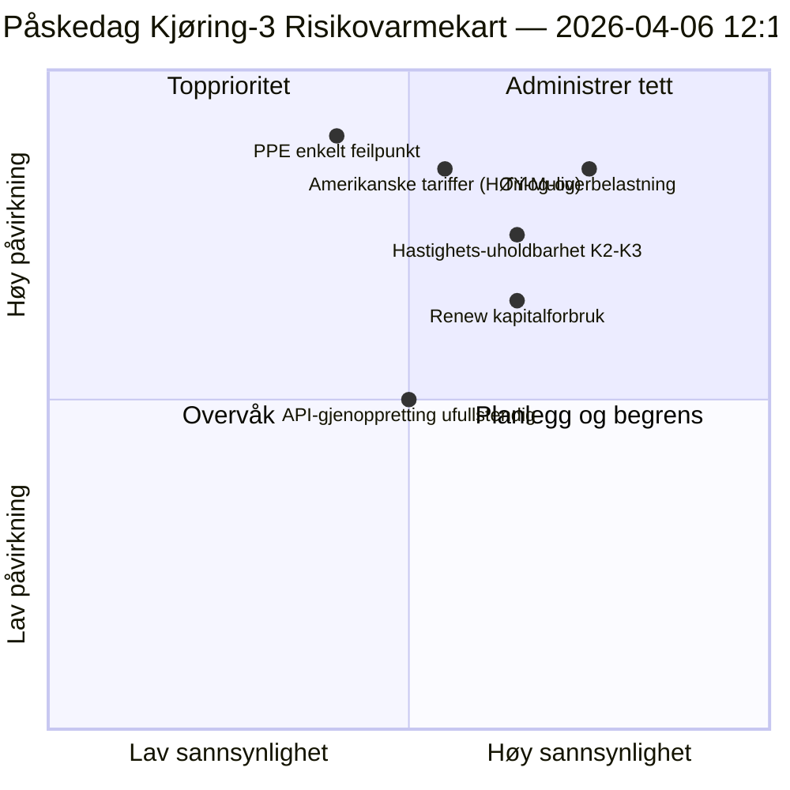
```mermaid
quadrantChart
    title Første Påskedag Kjøring-3 Risikovarmekart — 2026-04-06 12:15 UTC
    x-axis Lav sannsynlighet --> Høy sannsynlighet
    y-axis Lav påvirkning --> Høy påvirkning
    quadrant-1 Administrer tett
    quadrant-2 Topprioritet
    quadrant-3 Overvåk
    quadrant-4 Planlegg og begrens
    "Trilog-overbelastning": [0.75, 0.85]
    "Amerikanske tariffer (HØY-Mulig)": [0.55, 0.85]
    "Hastighets-uholdbarhet K2-K3": [0.65, 0.75]
    "PPE enkelt feilpunkt": [0.40, 0.90]
    "Renew kapitalforbruk": [0.65, 0.65]
    "API-gjenoppretting ufullstendig": [0.50, 0.50]
```

---

### 🔮 Topp Fremtidige Utløsere (neste 14 dager)

1. **8.–10. april — Full API-gjenoppretting forventet** (55 % sannsynlighet per Kjøring-3-modell).
2. **14. april — Komitéuke åpner** — konvergenssone Dag 1.
3. **17. april — ECB-rentebeslutning** — økonomi-kontekstvariabel.
4. **20.–23. april — første post-recess plenum** — dual-track-validering.
5. **Slutt-K2 — hastighetsbærekraftgjennomgang** — 2,11 akter/sesjon-test.

---

### 🛡️ Kildekvali tetsvurdering

- **API-gjenoppretting (A1):** Kjøring-3 direkte observasjon; første bekreftede endepunktsreaktivering.
- **Hastighet 2,11 akter/sesjon (A1):** forhåndsberegnede statistikker; historisk sammenligning verifiserbar.
- **Kapitalforbruksrangering (A2):** gruppekapi tal-metodologi; mellom-konfidensordering.
- **15-risikoregister (A2):** systematisk metodologi; robusthetsscore 5,8/10 verifiserbar.
- **Nettokonfidans:** 🟢 HØY på API-gjenoppretting; 🟡 MIDDELS på kapitalforbruksprognose.

---

### 📎 Kjøringsartefakter

| Lag | Artefakt | Hvorfor |
|-------|----------|-----|
| Artikkel | `article.md` | Offentlig Kjøring-3-narrativ |
| Syntese | `synthesis-summary.md` | API-gjenoppretting + 6 nye metoder |
| Metoder | consequence-trees · legislative-disruption · velocity-risk · political-capital-risk · voting-patterns · agent-risk-workflow | Seks nye metoder (denne kjøring) |
| Ledsager | breaking (00:33) · breaking-2 (06:45) · committee-reports (05:03) · propositions (05:47) | Første Påskedag-klynge |

---

**Dokumentkontroll**
- **Malereferanse:** `analysis/templates/executive-brief.md`
- **Artefaktsti:** `analysis/daily/2026-04-06/breaking-3/executive-brief.md`
- **Klassifisering:** Offentlig
- **Retrospektiv:** Sammendrag skrevet 2026-05-16 fra kjøringens arkiverte artefakter; **ingen nye MCP-anrop ble gjort**.

### Executive Brief Sv

### 🎯 BLUF

**Körning-3 producerar dagens mest konsekventa operativa fynd — den *första bekräftade EP API-slutpunktsåterhämtningen* under den 11-dagars recessens: adopted-texts-flödet övergick från Mode-B (JSON-parsningsfel kl. 06:45 UTC) till rent framgång (86 poster returnerades kl. 12:15 UTC), vilket validerar Körning-2:s "backend-återaktivering"-hypotes.** Utöver övervakningssignalen slutför körningen de återstående sex analysmetoderna som inte täcktes i tidigare brytande körningar och producerar tre strukturella bidrag: **(a) Konsekvensträd** kartlägger tre kaskaderande effektkedjor — legislativ-sprint → implementeringskaskad, API-återhämtning → datatransparenskaskad, PPE dual-track → politiskt-kapital-kaskad — som konvergerar mot april 14–23 som **"konvergenszonen"** där Kommittéveckan, ECB-räntebeslut och de första post-recesses plenarröstningarna inträffar simultaneously; **(b) Lagstiftningshastighetsrisk** dokumenterar EP10 År 2 som **2,11 akter/session, +44 % YoY, den högsta sedan EP7:s eurozonkrisrespons 2012** — en hållbarhetsfråga som flaggas för K2–K3; **(c) Politisk kapitalrisk** identifierar gruppnivåkapitaldynamik — **PPE ackumulerar, Greens/EFA minskar, Renew förbrukar snabbast** — med systemresiliens 6/10 och en enda felpunkt vid PPE. Körningens riskregister summerar 15 risker (0 kritiska, 4 höga, 7 medium, 4 låga), med trilog-överbelastning (HÖG, Trolig) och amerikanska tullar (HÖG, Möjlig) som de två högsta. Resilienspoäng 5,8/10 indikerar mätbar men icke-kritisk belastning.

---

### 🧭 3 Beslut som denna sammanfattning stödjer

| # | Beslut | Vem beslutar | Deadline | Bevis |
|:-:|----------|-------------|:--------:|----------|
| 1 | **Konvergenszon förhöjd övervakning** — April 14–23 behöver T+0/+1/+2 trippeltrådar | EP underrättelseoperationer; presstjänsten | senast 12 april | §Konsekvensträd (konvergenszon) |
| 2 | **Hastighetshållbarhetsgranskning** — 2,11 akter/session ohållbart bortom K2 | Konferens med ordförandena | löpande K2 | §Hastighetsrisk (+44 % YoY) |
| 3 | **Renew kapitalförbrukningsövervakning** — snabbast förbrukande grupp; mellantermsstabilitetsfråga | Renew-ledning; EPP-koordination | löpande | §Politisk kapitalrisk (Renew) |

---

### 📰 60-Sekunders Läsning

- 🔴 **Första bekräftade API-slutpunktsåterhämtning** — adopted-texts-flöde Mode-B → framgång (86 poster).
- 🟠 **Konvergenszon 14–23 april** — Kommittéveckan + ECB + plenum sammanfaller.
- 🟢 **Hastighetsanomal: 2,11 akter/session (+44 % YoY)** — den högsta sedan EP7:s eurozonrespons 2012.
- 🟡 **Politiskt kapital:** PPE ackumulerar · Greens minskar · Renew förbrukar snabbast.
- 🔵 **Systemresiliens 6/10** — enda felpunkt vid PPE.
- 🟣 **15-riskregister:** 0 kritiska · 4 höga · 7 medium · 4 låga; resiliens 5,8/10.
- 🩷 **Topp 2-risker:** Trilog-överbelastning (HÖG, Trolig) · Amerikanska tullar (HÖG, Möjlig).
- ⚪ **Förtroende MEDEL** — primär återhämtningsobservation; strukturella avläsningar höga.

---

### 🌳 Tre Kaskaderande Effektkedjor (Körning-3:s särskiljer bidrag)

| Kedja | Utlösare | Kaskad | Konvergenspunkt |
|-------|---------|---------|-------------------|
| **Legislativ-sprint → Implementeringskaskad** | Förrecessions-burst 26 mars | 42 EP10-2026-texter inträder implementering K2 | 14–17 april Kommittéveckan |
| **API-återhämtning → Datatransparenskaskad** | Adopted-texts Mode-B→ren återhämtning | Andra slutpunkter följer; full transparens återställs | 8–10 april förväntat |
| **PPE dual-track → Politisk kapital-kaskad** | Dual-track-antagande 26 mars | Kapitalackumulering vid PPE; förbrukning vid Renew | 20–23 april första plenum |

**Konvergenszon:** 14–23 april — alla tre kedjorna landar i samma 10-dagarsfönster.

---

### ⚠️ Riskmomentsavläsning

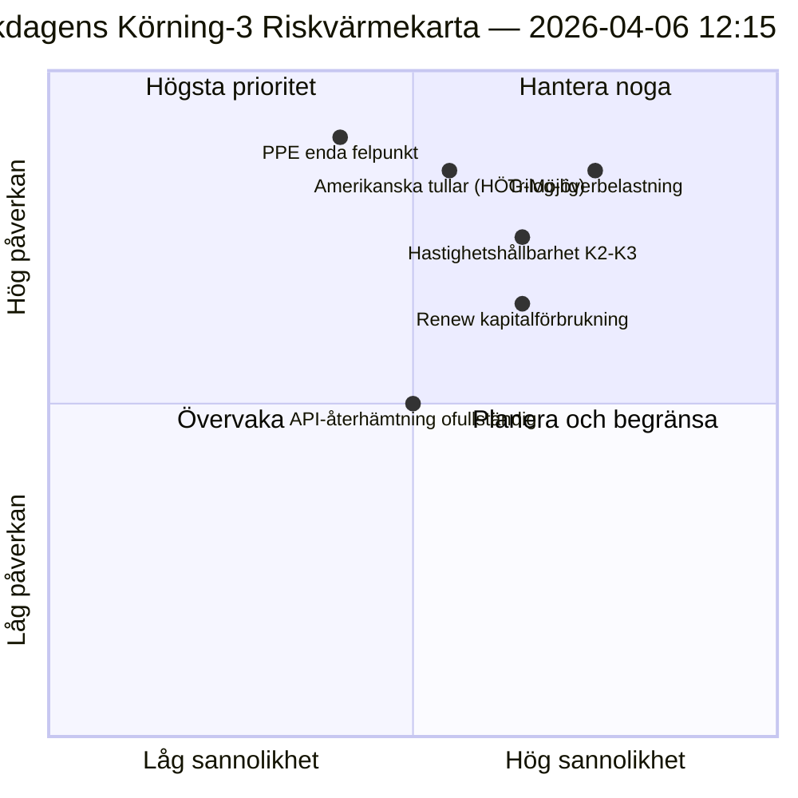
```mermaid
quadrantChart
    title Påskdagens Körning-3 Riskvärmekarta — 2026-04-06 12:15 UTC
    x-axis Låg sannolikhet --> Hög sannolikhet
    y-axis Låg påverkan --> Hög påverkan
    quadrant-1 Hantera noga
    quadrant-2 Högsta prioritet
    quadrant-3 Övervaka
    quadrant-4 Planera och begränsa
    "Trilog-överbelastning": [0.75, 0.85]
    "Amerikanska tullar (HÖG-Möjlig)": [0.55, 0.85]
    "Hastighetshållbarhet K2-K3": [0.65, 0.75]
    "PPE enda felpunkt": [0.40, 0.90]
    "Renew kapitalförbrukning": [0.65, 0.65]
    "API-återhämtning ofullständig": [0.50, 0.50]
```

---

### 🔮 Topp Framtida Utlösare (nästa 14 dagar)

1. **8–10 april — Full API-återhämtning förväntad** (55 % sannolikhet per Körning-3-modell).
2. **14 april — Kommittéveckan öppnar** — konvergenszon Dag 1.
3. **17 april — ECB-räntebeslut** — ekonomisk-kontextvariabel.
4. **20–23 april — första post-recesses plenum** — dual-track-validering.
5. **Slut-K2 — hastighetshållbarhetsgranskning** — 2,11 akter/session-test.

---

### 🛡️ Källkvalitetsbedömning

- **API-återhämtning (A1):** Körning-3 direkt observation; första bekräftade slutpunktsåteraktivering.
- **Hastighet 2,11 akter/session (A1):** förberäknade statistik; historisk jämförelse verifierbar.
- **Kapitalförbrukningsrankning (A2):** gruppokapital-metodologi; medelhögt konfidenssortering.
- **15-riskregister (A2):** systematisk metodologi; resilienspoäng 5,8/10 verifierbar.
- **Nettokonfidans:** 🟢 HÖG på API-återhämtning; 🟡 MEDEL på kapitalförbrukningsprognos.

---

### 📎 Körningsartefakter

| Lager | Artefakt | Varför |
|-------|----------|-----|
| Artikel | `article.md` | Offentlig-vänd Körning-3-narrativ |
| Syntes | `synthesis-summary.md` | API-återhämtning + 6 nya metoder |
| Metoder | consequence-trees · legislative-disruption · velocity-risk · political-capital-risk · voting-patterns · agent-risk-workflow | Sex nya metoder (denna körning) |
| Sällskapsanalys | breaking (00:33) · breaking-2 (06:45) · committee-reports (05:03) · propositions (05:47) | Påskdagskluster |

---

**Dokumentkontroll**
- **Mallreferens:** `analysis/templates/executive-brief.md`
- **Artefaktsökväg:** `analysis/daily/2026-04-06/breaking-3/executive-brief.md`
- **Klassificering:** Offentlig
- **Retroaktiv:** Sammanfattning skriven 2026-05-16 från körningens arkiverade artefakter; **inga nya MCP-anrop gjordes**.

### Executive Brief Zh

**分类：** OSINT — 公开议会记录
**置信度：** 🟡 中等（休会期间；API端点首次确认恢复；三方谈判超负荷风险高）
**执行：** `analysis/daily/2026-04-06/breaking-3/`（12:15 UTC）
**覆盖范围：** 复活节休会日 11/18 正午；采用文本信息流首次确认恢复
**生成日期：** 2026-05-16（回溯性摘要，无新MCP调用）
**主要来源：** 采用文本信息流（86条，已恢复）；6种新方法（结果树、立法中断、速度风险、资本风险、投票模式、代理风险）。

---

### 🎯 核心结论

**执行-3产生了当日最重要的运营发现——11天休会期间*欧洲议会API端点的首次确认恢复*：采用文本信息流从模式-B（06:45 UTC的JSON解析错误）转变为成功响应（12:15 UTC返回86条记录），验证了执行-2的"后端重启"假设。** 除监控信号外，本次执行还完成了之前未涵盖的6种剩余分析方法，并提供三项结构性贡献：**(甲) 结果树**绘制三条级联效应链——立法冲刺 → 实施瀑布、API恢复 → 数据透明度瀑布、EPP双轨道 → 政治资本瀑布——在4月14~23日汇聚形成**"汇聚区"**，届时委员会周、欧洲央行利率决定和休会后首次全体投票同时发生；**(乙) 立法速度风险**将EP10第2年记录为**每次会议2.11项法案，同比+44%，为2012年EP7欧元区危机应对以来最高水平**——标注为第2~3季度的可持续性隐患；**(丙) 政治资本风险**识别集团级别的资本动态——**EPP积累中，绿党/欧洲自由联盟下降中，"复兴欧洲"消耗最快**——系统韧性6/10，EPP存在单点故障。本次执行风险登记册共15项（0项严重、4项高、7项中、4项低），三方谈判超负荷（高，可能）和美国关税（高，有可能）位列前两位。韧性评分5.8/10表明可测量但非严重的紧张态势。

---

### 🧭 本简报支持的3项决策

| # | 决策 | 决策者 | 截止日期 | 证据 |
|:-:|------|--------|:--------:|------|
| 1 | **加强汇聚区监控** — 4月14~23日需要T+0/+1/+2触发器 | EP情报运营；新闻服务 | 4月12日前 | §结果树（汇聚区） |
| 2 | **速度可持续性审查** — 每次会议2.11项在第2季度后不可持续 | 议长会议 | 第2季度持续中 | §速度风险（同比+44%） |
| 3 | **"复兴欧洲"资本消耗监控** — 消耗最快的集团；任期中期稳定性关切 | 复兴欧洲领导层；EPP协调 | 持续中 | §政治资本风险（复兴欧洲） |

---

### 📰 60秒速读

- 🔴 **API端点首次确认恢复** — 采用文本信息流：模式-B → 成功（86条）。
- 🟠 **汇聚区4月14~23日** — 委员会周 + 欧洲央行 + 全体会议同时到来。
- 🟢 **速度异常：每次会议2.11项（同比+44%）** — 2012年EP7欧元区应对以来最高。
- 🟡 **政治资本：** EPP积累中 · 绿党下降中 · 复兴欧洲消耗最快。
- 🔵 **系统韧性6/10** — EPP存在单点故障。
- 🟣 **15项风险登记：** 严重0 · 高4 · 中7 · 低4；韧性5.8/10。
- 🩷 **前2大风险：** 三方谈判超负荷（高，可能）· 美国关税（高，有可能）。
- ⚪ **置信度：中等** — 主要恢复观测；结构性读数高。

---

### 🌳 三条级联效应链（执行-3的独特贡献）

| 链条 | 触发因素 | 级联 | 汇聚点 |
|------|---------|------|--------|
| **立法冲刺 → 实施瀑布** | 3月26日休会前突击处理 | EP10-2026的42份文件进入第2季度实施 | 4月14~17日委员会周 |
| **API恢复 → 数据透明度瀑布** | 采用文本：模式-B → 干净恢复 | 其他端点跟进；完全透明度恢复 | 预计4月8~10日 |
| **EPP双轨道 → 政治资本瀑布** | 3月26日双轨道采纳 | EPP中资本积累；复兴欧洲中消耗 | 4月20~23日首次全体会议 |

**汇聚区：** 4月14~23日 — 三条链条在同一个10天窗口内汇聚。

---

### ⚠️ 风险快照

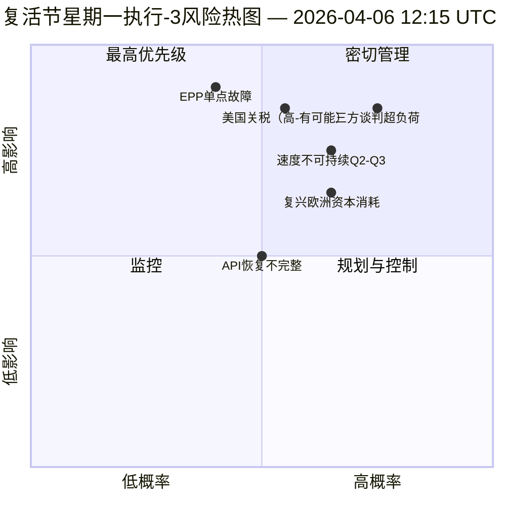
```mermaid
quadrantChart
    title 复活节星期一执行-3风险热图 — 2026-04-06 12:15 UTC
    x-axis 低概率 --> 高概率
    y-axis 低影响 --> 高影响
    quadrant-1 密切管理
    quadrant-2 最高优先级
    quadrant-3 监控
    quadrant-4 规划与控制
    "三方谈判超负荷": [0.75, 0.85]
    "美国关税（高-有可能）": [0.55, 0.85]
    "速度不可持续Q2-Q3": [0.65, 0.75]
    "EPP单点故障": [0.40, 0.90]
    "复兴欧洲资本消耗": [0.65, 0.65]
    "API恢复不完整": [0.50, 0.50]
```

---

### 🔮 主要未来触发因素（未来14天）

1. **4月8~10日 — 预期完整API恢复**（执行-3模型55%概率）。
2. **4月14日 — 委员会周开幕** — 汇聚区第1天。
3. **4月17日 — 欧洲央行利率决定** — 经济背景变量。
4. **4月20~23日 — 休会后首次全体会议** — 双轨道验证。
5. **第2季度末 — 速度可持续性审查** — 每次会议2.11项测试。

---

### 🛡️ 信息来源质量评估

- **API恢复（A1）：** 执行-3直接观测；端点首次确认重启。
- **速度每次会议2.11项（A1）：** 预先计算的统计数据；历史比较可验证。
- **资本消耗排名（A2）：** 集团级别资本方法论；中等置信度排序。
- **15项风险登记（A2）：** 系统化方法论；韧性评分5.8/10可验证。
- **净置信度：** 🟢 API恢复为高；🟡 资本消耗预测为中等。

---

### 📎 执行成果

| 层级 | 成果 | 原因 |
|------|------|------|
| 文章 | `article.md` | 执行-3公开叙述 |
| 综合 | `synthesis-summary.md` | API恢复 + 6种新方法 |
| 方法论 | 结果树 · 立法中断 · 速度风险 · 政治资本风险 · 投票模式 · 代理风险流 | 六种新方法（本次执行） |
| 同期 | breaking (00:33) · breaking-2 (06:45) · 委员会报告 (05:03) · 提案 (05:47) | 复活节星期一集群 |

---

**文档管理**
- **模板参考：** `analysis/templates/executive-brief.md`
- **成果路径：** `analysis/daily/2026-04-06/breaking-3/executive-brief.md`
- **分类：** 公开
- **回溯性说明：** 摘要于2026-05-16根据已归档的执行成果编写；**未进行新的MCP调用**。

### Legislative Disruption

### Executive Summary

| Disruption Vector | Severity | Probability | Timeline | Key Actor |
|-------------------|----------|-------------|----------|-----------|
| **Trilogue Overload** | HIGH | Likely (>65%) | April-June 2026 | Council Presidency |
| **Coalition Fragmentation** | MEDIUM | Possible (40-55%) | 20-23 April | PPE-S&D axis |
| **External Shock (US Tariffs)** | HIGH | Possible (35-50%) | Ongoing | INTA Committee |
| **API Data Blackout Legacy** | LOW | Likely (>70%) | 7-13 April | EP IT Services |
| **ECB Rate Decision Spillover** | MEDIUM | Possible (40-60%) | 17 April | ECON Committee |
| **Member State Election Cycles** | LOW | Possible (30-45%) | Q2-Q3 2026 | National delegations |

---

### Disruption Vector 1: Trilogue Pipeline Overload

#### Threat Assessment

The pre-recess legislative sprint produced 104 adopted texts in Q1 2026. Multiple major files now require trilogue negotiations simultaneously:

| File | EP Position | Council Status | Complexity | Deadline Pressure |
|------|------------|----------------|------------|-------------------|
| **SRMR3** (Banking Resolution) | Adopted (right-of-centre) | Awaiting position | 🔴 HIGH | Q2 2026 |
| **Anti-Corruption Directive** | Adopted (grand coalition) | Awaiting position | 🟡 MEDIUM | Open |
| **Copyright & AI Resolution** | In pipeline | Pre-negotiation | 🔴 HIGH | Q3 2026 |
| **EU Talent Pool** | Adopted | Member state consultations | 🟡 MEDIUM | Q4 2026 |
| **Defence Single Market** | Committee stage | Early drafting | 🔴 HIGH | 2027 |

#### Disruption Mechanism

The Council's negotiating bandwidth is finite. With 3+ major files in trilogue simultaneously, the risk is:

1. **Priority ranking forced:** Council must choose which files to advance first — creating winners and losers among EP committees
2. **Rapporteur burnout:** MEPs leading trilogue delegations face overlapping schedules
3. **Package deal pressure:** Council may attempt to link unrelated files for leverage
4. **Quality degradation:** Time pressure leads to weaker compromises

**Confidence:** 🟡 MEDIUM — the exact trilogue timeline depends on Council positioning, which is not yet public.

#### Mitigation Indicators

- Watch for Council General Affairs configuration scheduling post-Easter
- EP Conference of Presidents meeting (first post-recess) will set trilogue priority order
- Committee coordinators' meetings (14-17 April) reveal MEP-level bandwidth

---

### Disruption Vector 2: Coalition Fragmentation Risk

#### Dual-Track Sustainability Assessment

```mermaid
%%{init: {
  "theme": "dark",
  "themeVariables": {
    "quadrant1Fill": "#1565C0",
    "quadrant2Fill": "#2E7D32",
    "quadrant3Fill": "#FF9800",
    "quadrant4Fill": "#D32F2F",
    "quadrantTitleFill": "#ffffff",
    "quadrantPointFill": "#ffffff",
    "quadrantPointTextFill": "#ffffff",
    "quadrantXAxisTextFill": "#ffffff",
    "quadrantYAxisTextFill": "#ffffff"
  },
  "quadrantChart": {
    "chartWidth": 700,
    "chartHeight": 700,
    "pointLabelFontSize": 14,
    "titleFontSize": 22,
    "quadrantLabelFontSize": 18,
    "xAxisLabelFontSize": 16,
    "yAxisLabelFontSize": 16
  }
}}%%
quadrantChart
    title Coalition Durability Assessment
    x-axis "Low Economic Pressure" --> "High Economic Pressure"
    y-axis "Low Political Tension" --> "High Political Tension"
    quadrant-1 "Crisis Zone"
    quadrant-2 "Political Disruption"
    quadrant-3 "Stable Governance"
    quadrant-4 "Economic Disruption"
    "Grand Coalition": [0.35, 0.45]
    "Right-of-Centre": [0.65, 0.55]
    "Defence Coalition": [0.50, 0.70]
    "Green Deal Revival": [0.25, 0.60]
```

#### Fragmentation Triggers

1. **S&D Red Lines:** If PPE uses the right-of-centre track for >3 consecutive files post-recess, S&D's cooperation on governance files becomes untenable. The current ratio (5 right-of-centre: 3 grand coalition from pre-recess) is near the tolerance boundary.
   - **Indicator:** Watch S&D's procedural motions in April plenary — procedural obstruction is the early warning signal.
   - **Probability:** Possible (40-55%)
   - **Confidence:** 🟡 MEDIUM

2. **ECR Over-Reach:** As ECR gains mainstream legitimacy through the right-of-centre track, its more radical members may push for positions that PPE cannot accept without losing Renew support.
   - **Indicator:** Watch ECR amendment strategies on economic files — aggressive amendments signal over-reach.
   - **Probability:** Possible (30-45%)
   - **Confidence:** 🔴 LOW

3. **Renew Squeeze:** Renew participates in both tracks, giving it leverage but creating internal tensions between its liberal-economic and social-liberal wings.
   - **Indicator:** Watch Renew group cohesion in the first post-recess roll-call votes.
   - **Probability:** Possible (35-50%)
   - **Confidence:** 🟡 MEDIUM

#### Impact Assessment

If the dual-track pattern fragments:
- **Best case:** PPE reverts to grand coalition default, legislative output slows but remains orderly
- **Worst case:** No stable majority pattern for 2-3 sessions, creating a "legislative vacuum" where only consensus items advance
- **Most likely:** Partial fragmentation — one track breaks while the other holds, PPE adapts

---

### Disruption Vector 3: US Tariff Escalation

#### External Shock Analysis

The US tariff adjustments addressed by the pre-recess INTA committee work represent an ongoing disruption vector that operates outside the EP's control:

| Scenario | Probability | EP Impact | Timeline |
|----------|-------------|-----------|----------|
| **Tariff stabilization** | Likely (>50%) | INTA maintains current track | Q2 2026 |
| **Tariff escalation** | Possible (30-40%) | Emergency debate, legislative fast-track | Any time |
| **Trade war** | Unlikely (<15%) | Full legislative priority reset | Q3 2026 |

**Key Vulnerability:** A US tariff escalation during the April 20-23 plenary would force the EP to choose between scheduled legislative work and emergency trade response — consuming the limited post-recess floor time.

**Evidence:** T10-0095 through T10-0098 range includes trade-related adopted texts from the pre-recess period. The INTA committee's April 14-17 agenda will signal how much bandwidth remains for tariff response.

**Confidence:** 🟡 MEDIUM — dependent on external US policy decisions.

---

### Disruption Vector 4: API Data Blackout Legacy

#### Data Transparency Threat

The 11-day API degradation (28 March - 6 April) creates a unique disruption to parliamentary transparency:

1. **Monitoring Gap:** Civil society, media, and parliamentary oversight actors have had limited access to EP data for 11 days
2. **Backlog Processing:** When APIs fully recover, the backlog of unprocessed documents, events, and procedures will create an information overload
3. **Analytical Discontinuity:** Time-series analyses (voting patterns, attendance trends) will have an 18-day gap

**Recovery Signal (NEW — this run):** The adopted texts feed recovered from JSON parse errors to clean success between 06:45 and 12:15 UTC today. This is the first confirmed endpoint recovery during the recess.

| Recovery Phase | Expected Timing | Confidence |
|---------------|----------------|------------|
| Adopted texts + MEPs | ✅ Recovered | 🟢 HIGH |
| Documents & questions | 7-10 April | 🟡 MEDIUM |
| Events & procedures | 10-14 April | 🔴 LOW |
| Full API health | 14 April (Committee Week) | 🟡 MEDIUM |

**Confidence:** 🟡 MEDIUM — based on the adopted texts recovery pattern and the Mode C (timeout) transition observed for document endpoints.

---

### Disruption Vector 5: ECB Rate Decision Spillover

#### Cross-Institutional Disruption

The ECB rate decision on 17 April falls on the final day of Committee Week, directly impacting ECON committee work:

- **If ECB cuts:** Supports the case for SRMR3's market-friendly approach, strengthening the right-of-centre coalition
- **If ECB holds:** Neutral to legislative dynamics but may shift media attention away from EP
- **If ECB signals tightening:** Creates tension with the legislative assumption of accommodative policy environment

**Impact on SRMR3 Trilogue:** The ECB decision will set the macroeconomic context for the Council's negotiating position on banking resolution reform. A rate cut makes the EP's stronger centralized resolution authority more palatable; a hold or tightening makes national regulators more defensive.

**Confidence:** 🔴 LOW — ECB decisions are independent of EP legislative cycle.

---

### Disruption Vulnerability Timeline

```mermaid
%%{init: {"theme":"dark","themeVariables":{"primaryColor":"#1565C0","primaryTextColor":"#ffffff","primaryBorderColor":"#0A3F7F","lineColor":"#90CAF9","secondaryColor":"#2E7D32","secondaryTextColor":"#ffffff","secondaryBorderColor":"#0F3F00","tertiaryColor":"#FF9800","tertiaryTextColor":"#000000","tertiaryBorderColor":"#7F4F00","mainBkg":"#1565C0","secondBkg":"#2E7D32","tertiaryBkg":"#FF9800","noteBkgColor":"#FFC107","noteTextColor":"#000000","noteBorderColor":"#7F6000","errorBkgColor":"#D32F2F","errorTextColor":"#ffffff","fontFamily":"Inter, Helvetica, Arial, sans-serif","pie1":"#1565C0","pie2":"#2E7D32","pie3":"#FF9800","pie4":"#D32F2F","pie5":"#FFC107","pie6":"#7B1FA2","pie7":"#9E9E9E","pie8":"#0288D1","pie9":"#388E3C","pie10":"#F57C00","pie11":"#C62828","pie12":"#FBC02D","pieTitleTextSize":"18px","pieSectionTextSize":"14px","pieLegendTextSize":"13px","pieStrokeColor":"#1e1e1e","pieOuterStrokeColor":"#1e1e1e","git0":"#1565C0","git1":"#2E7D32","git2":"#FF9800","git3":"#D32F2F","gitBranchLabel0":"#ffffff","gitBranchLabel1":"#ffffff","gitBranchLabel2":"#000000","gitBranchLabel3":"#ffffff","cScale0":"#1565C0","cScale1":"#2E7D32","cScale2":"#FF9800","cScale3":"#D32F2F","cScale4":"#FFC107","cScale5":"#7B1FA2","cScale6":"#9E9E9E","cScale7":"#0288D1","xyChart":{"backgroundColor":"#1e1e1e","plotColorPalette":"#1565C0,#2E7D32,#FF9800,#D32F2F,#FFC107,#7B1FA2,#9E9E9E"}}}}%%
gantt
    title Post-Recess Disruption Windows
    dateFormat  YYYY-MM-DD
    section Recess
    Easter Recess (Day 11/18)   :done, recess, 2026-03-27, 2026-04-13
    section Recovery
    API Recovery Window         :active, recovery, 2026-04-07, 2026-04-14
    section Vulnerability
    Committee Week              :crit, committee, 2026-04-14, 2026-04-17
    ECB Decision               :milestone, ecb, 2026-04-17, 0d
    section High Risk
    Strasbourg Plenary         :crit, plenary, 2026-04-20, 2026-04-23
    section Monitoring
    Coalition Stress Test      :active, coalition, 2026-04-20, 2026-04-23
```

---

### Disruption Resilience Score

| Dimension | Score | Rationale |
|-----------|-------|-----------|
| **Legislative Pipeline** | 6/10 | High volume but organized; trilogue bottleneck risk |
| **Coalition Stability** | 7/10 | Dual-track functional but untested post-recess |
| **External Shock Preparedness** | 5/10 | US tariffs unpredictable; ECB decision pending |
| **Data Infrastructure** | 4/10 | 11-day API degradation with partial recovery only |
| **Institutional Capacity** | 7/10 | EP secretariat experienced with heavy agendas |
| **Overall Resilience** | **5.8/10** | 🟡 MEDIUM — functional but vulnerable at multiple points |

---

### Sources & Attribution

- **Adopted Texts:** 86 items from EP Open Data Portal feed (confirmed 12:15 UTC, 6 April 2026)
- **Precomputed Statistics:** 114 acts projected for 2026 (EP activity stats, generated 3 March 2026)
- **Coalition Analysis:** Dual-track pattern from 21+ monitoring runs, cross-session intelligence
- **API Monitoring:** Longitudinal tracking since 28 March 2026 (21+ data points)
- **Early Warning System:** 3 warnings, stability 84/100 (EP MCP analytical tool)

---

*Analysis generated by EU Parliament Monitor breaking news pipeline — Run 3 (12:15 UTC)*

### Legislative Velocity Risk

### Executive Summary

| Metric | 2024 (EP9/EP10) | 2025 (EP10 Y1) | 2026 (EP10 Y2 proj.) | Trend |
|--------|-----------------|-----------------|----------------------|-------|
| **Legislative Acts** | 72 | 78 | **114** (+46%) | ↑ Accelerating |
| **Adopted Texts** | 459 | 347 | **498** (+44%) | ↑ Accelerating |
| **Roll-Call Votes** | 375 | 420 | **567** (+35%) | ↑ Accelerating |
| **Plenary Sessions** | 50 | 53 | **54** (+2%) | → Stable |
| **Speeches** | 7,800 | 8,200 | **8,500** (+4%) | → Stable |
| **Parliamentary Questions** | 3,950 | 4,100 | **4,500** (+10%) | ↑ Moderate |

**Key Finding:** EP10 Year 2 shows a **legislative acceleration anomaly** — output is growing 35-46% year-over-year while session count remains nearly flat. This means significantly more legislative work per session, raising sustainability and quality concerns.

---

### Velocity Analysis

#### Output-Per-Session Ratio

```mermaid
%%{init: {"theme":"dark","themeVariables":{"primaryColor":"#1565C0","primaryTextColor":"#ffffff","primaryBorderColor":"#0A3F7F","lineColor":"#90CAF9","secondaryColor":"#2E7D32","secondaryTextColor":"#ffffff","secondaryBorderColor":"#0F3F00","tertiaryColor":"#FF9800","tertiaryTextColor":"#000000","tertiaryBorderColor":"#7F4F00","mainBkg":"#1565C0","secondBkg":"#2E7D32","tertiaryBkg":"#FF9800","noteBkgColor":"#FFC107","noteTextColor":"#000000","noteBorderColor":"#7F6000","errorBkgColor":"#D32F2F","errorTextColor":"#ffffff","fontFamily":"Inter, Helvetica, Arial, sans-serif","pie1":"#1565C0","pie2":"#2E7D32","pie3":"#FF9800","pie4":"#D32F2F","pie5":"#FFC107","pie6":"#7B1FA2","pie7":"#9E9E9E","pie8":"#0288D1","pie9":"#388E3C","pie10":"#F57C00","pie11":"#C62828","pie12":"#FBC02D","pieTitleTextSize":"18px","pieSectionTextSize":"14px","pieLegendTextSize":"13px","pieStrokeColor":"#1e1e1e","pieOuterStrokeColor":"#1e1e1e","git0":"#1565C0","git1":"#2E7D32","git2":"#FF9800","git3":"#D32F2F","gitBranchLabel0":"#ffffff","gitBranchLabel1":"#ffffff","gitBranchLabel2":"#000000","gitBranchLabel3":"#ffffff","cScale0":"#1565C0","cScale1":"#2E7D32","cScale2":"#FF9800","cScale3":"#D32F2F","cScale4":"#FFC107","cScale5":"#7B1FA2","cScale6":"#9E9E9E","cScale7":"#0288D1","xyChart":{"backgroundColor":"#1e1e1e","plotColorPalette":"#1565C0,#2E7D32,#FF9800,#D32F2F,#FFC107,#7B1FA2,#9E9E9E"}}}}%%
xychart-beta
    title "Legislative Acts per Plenary Session"
    x-axis ["2024", "2025", "2026 (proj.)"]
    y-axis "Acts per Session" 0 --> 3
    bar [1.44, 1.47, 2.11]
```

| Year | Acts | Sessions | Acts/Session | YoY Change |
|------|------|----------|-------------|------------|
| 2024 | 72 | 50 | 1.44 | — |
| 2025 | 78 | 53 | 1.47 | +2% |
| 2026 | 114 | 54 | **2.11** | **+44%** |

The acts-per-session ratio jumps 44% in 2026, suggesting either:
1. ✅ More efficient legislative processing (positive — better use of floor time)
2. ⚠️ Less deliberation time per act (risk — quality degradation)
3. ⚠️ More fast-tracked or simplified procedures (risk — democratic scrutiny gaps)

**Confidence:** 🟡 MEDIUM — the projection is based on Q1 trajectory extrapolation; actual full-year may differ.

#### Velocity Risk Matrix

```mermaid
%%{init: {
  "theme": "dark",
  "themeVariables": {
    "quadrant1Fill": "#1565C0",
    "quadrant2Fill": "#2E7D32",
    "quadrant3Fill": "#FF9800",
    "quadrant4Fill": "#D32F2F",
    "quadrantTitleFill": "#ffffff",
    "quadrantPointFill": "#ffffff",
    "quadrantPointTextFill": "#ffffff",
    "quadrantXAxisTextFill": "#ffffff",
    "quadrantYAxisTextFill": "#ffffff"
  },
  "quadrantChart": {
    "chartWidth": 700,
    "chartHeight": 700,
    "pointLabelFontSize": 14,
    "titleFontSize": 22,
    "quadrantLabelFontSize": 18,
    "xAxisLabelFontSize": 16,
    "yAxisLabelFontSize": 16
  }
}}%%
quadrantChart
    title Legislative Velocity Risk Assessment
    x-axis "Low Output Volume" --> "High Output Volume"
    y-axis "Low Pace Risk" --> "High Pace Risk"
    quadrant-1 "Overheated: Volume + Speed Risk"
    quadrant-2 "Burnout: Speed Without Volume"
    quadrant-3 "Sustainable: Low Volume, Controlled Pace"
    quadrant-4 "Productive: High Volume, Controlled Pace"
    "EP10 Year 1 (2025)": [0.45, 0.35]
    "EP10 Year 2 (2026)": [0.75, 0.65]
    "EP9 Final Year (2024)": [0.40, 0.50]
    "Optimal Zone": [0.60, 0.40]
```

**Assessment:** EP10 Year 2 is trending toward the "Overheated" quadrant. The combination of high volume AND accelerating pace creates compounding risks.

---

### Risk Dimensions

#### 1. Quality Risk — Scrutiny Depth per Act

**Concern:** With 2.11 acts per session (vs 1.47 in 2025), each act receives approximately 30% less average floor time for debate.

**Mitigating factors:**
- Committee-level scrutiny may compensate for reduced plenary debate
- Some acts are procedurally straightforward (consent procedures, technical updates)
- Rapporteur workload distribution across 20 committees spreads the load

**Risk Rating:** 🟡 MEDIUM — the aggregate metric masks variation between contested and consensus files.

#### 2. Coalition Fatigue Risk — Negotiation Bandwidth

**Concern:** The dual-track coalition pattern requires PPE to simultaneously manage two distinct majority-building processes. At 114 acts/year, this means approximately 2-3 coalition negotiations per working week.

**Evidence:** Pre-recess sprint showed PPE successfully managing both tracks, but the pace was compressed into the final pre-recess week. Sustained year-round dual-track management at this velocity is unprecedented in EP10.

**Risk Rating:** 🟡 MEDIUM — PPE's internal coordination capacity is the binding constraint.

#### 3. Rapporteur Burnout Risk

**Concern:** 114 acts spread across ~720 active MEPs means a higher rapporteur assignment frequency. Senior MEPs in key committees (ECON, ENVI, LIBE) may face overlapping assignments.

**Indicators to watch:**
- Rapporteur substitution rate in Q2 2026
- Shadow rapporteur availability
- Committee meeting cancellations or postponements

**Risk Rating:** 🔴 LOW (currently) — but escalates to MEDIUM if pace continues through Q3.

#### 4. Trilogue Throughput Risk

**Concern:** Not all 114 acts require trilogue, but the proportion that does (estimated 40-60%) creates a pipeline of 45-68 trilogue files. The Council's institutional bandwidth for parallel trilogues is approximately 15-20 per quarter.

| Quarter | Estimated Trilogue Files | Council Capacity | Gap |
|---------|------------------------|------------------|-----|
| Q1 2026 | ~25 | 15-20 | ⚠️ 5-10 excess |
| Q2 2026 | ~20 | 15-20 | → At capacity |
| Q3 2026 | ~15 | 15-20 | ✅ Within capacity |
| Q4 2026 | ~8 | 15-20 | ✅ Within capacity |

**Risk Rating:** 🟡 MEDIUM — Q1-Q2 bottleneck is the primary concern; Q3-Q4 normalizes.

---

### Historical Comparison

#### Velocity Benchmarks Across Parliamentary Terms

| Term | Year | Acts | Sessions | Acts/Session | Velocity Rating |
|------|------|------|----------|-------------|-----------------|
| EP7 (2012) | Mid-term | 95 | 48 | 1.98 | HIGH |
| EP8 (2017) | Mid-term | 88 | 50 | 1.76 | MODERATE |
| EP9 (2022) | Mid-term | 82 | 49 | 1.67 | MODERATE |
| EP9 (2024) | Final year | 72 | 50 | 1.44 | LOW |
| **EP10 (2026)** | **Year 2** | **114** | **54** | **2.11** | **VERY HIGH** |

**Context:** EP10 Year 2's velocity exceeds all comparable mid-term periods. The closest comparator is EP7's 2012 (1.98 acts/session) during the Eurozone crisis legislative response. Today's acceleration appears driven by:

1. **Commission White Paper agenda** — Von der Leyen II's more ambitious legislative programme
2. **Geopolitical pressure** — defence, trade, and energy files accelerated by external events
3. **PPE's dual-track efficiency** — simultaneous majority-building reduces parliamentary time per file
4. **Institutional learning** — EP10 building on EP9's procedural innovations

**Confidence:** 🟡 MEDIUM — historical comparisons are approximate (different counting methodologies across terms).

---

### Forward Projections

#### Scenario 1: Sustained Acceleration (Probability: Possible, 35-45%)
- Full-year output exceeds 114 acts (reaches 120-130)
- Quality concerns emerge in Q3 as complex files face insufficient scrutiny
- Coalition fatigue becomes visible in declining roll-call participation
- MEP burnout reflected in attendance drops

#### Scenario 2: Natural Deceleration (Probability: Likely, 45-55%)
- Q1 sprint was front-loaded; Q2-Q4 normalize to 78-85 acts pace
- Full-year lands at 90-100 acts — still above 2025 but more sustainable
- Trilogue pipeline absorbs some output, reducing new file introductions
- Dual-track pattern stabilizes with clearer file-type routing

#### Scenario 3: External Disruption (Probability: Possible, 10-20%)
- US tariff escalation or Ukraine developments force legislative priority reset
- Emergency procedures consume floor time, crowding out scheduled acts
- Full-year output drops to 70-80 acts (below 2025)
- Grand coalition reactivated for crisis management

---

### Sources & Attribution

- **Precomputed Statistics:** EP Open Data Portal — yearly stats 2024-2026 (generated 3 March 2026)
- **Adopted Texts Feed:** 86 items from one-week fallback (confirmed 12:15 UTC, 6 April 2026)
- **Historical Benchmarks:** EP7-EP10 legislative output data (EP Open Data Portal)
- **Coalition Analysis:** Cross-session intelligence from 21+ monitoring runs
- **Velocity Calculations:** Acts/session ratio computed from precomputed statistics

---

*Analysis generated by EU Parliament Monitor breaking news pipeline — Run 3 (12:15 UTC)*

### Political Capital Risk

### Executive Summary

| Political Group | Capital Stock | Burn Rate | Replenishment | Net Trend | Risk Level |
|----------------|--------------|-----------|---------------|-----------|------------|
| **PPE** (185 seats) | Very High | Moderate | Strong | ↗ Growing | 🟢 LOW |
| **S&D** (135 seats) | High | Low | Moderate | → Stable | 🟡 MEDIUM |
| **Renew** (77 seats) | Moderate | High | Moderate | ↘ Declining | 🟡 MEDIUM |
| **ECR** (81 seats) | Growing | Low | Strong | ↑ Rising | 🟢 LOW |
| **PfE** (86 seats) | Moderate | Low | Limited | → Stable | 🟡 MEDIUM |
| **Greens/EFA** (53 seats) | Declining | Moderate | Weak | ↓ Falling | 🔴 HIGH |
| **The Left** (46 seats) | Low | Low | Steady | → Stable | 🟡 MEDIUM |
| **NI** (30 seats) | Very Low | — | — | → Marginal | ⚪ N/A |

---

### Methodology

Political capital risk assessment measures each group's ability to influence legislative outcomes based on three dimensions:

1. **Capital Stock:** Accumulated influence from seats, committee positions, rapporteur assignments, and coalition partnerships
2. **Burn Rate:** How quickly capital is consumed through coalition negotiations, compromise concessions, and policy trade-offs
3. **Replenishment:** Ability to regenerate influence through electoral strength, media visibility, policy wins, and alliance diversification

Data sources: EP group composition (737 MEPs from MEPs feed), precomputed statistics (2024-2026), coalition dynamics analysis, and cross-session intelligence from 21+ monitoring runs.

---

### Group-Level Analysis

#### PPE — The Indispensable Hegemon

```mermaid
%%{init: {"theme":"dark","themeVariables":{"primaryColor":"#1565C0","primaryTextColor":"#ffffff","primaryBorderColor":"#0A3F7F","lineColor":"#90CAF9","secondaryColor":"#2E7D32","secondaryTextColor":"#ffffff","secondaryBorderColor":"#0F3F00","tertiaryColor":"#FF9800","tertiaryTextColor":"#000000","tertiaryBorderColor":"#7F4F00","mainBkg":"#1565C0","secondBkg":"#2E7D32","tertiaryBkg":"#FF9800","noteBkgColor":"#FFC107","noteTextColor":"#000000","noteBorderColor":"#7F6000","errorBkgColor":"#D32F2F","errorTextColor":"#ffffff","fontFamily":"Inter, Helvetica, Arial, sans-serif","pie1":"#1565C0","pie2":"#2E7D32","pie3":"#FF9800","pie4":"#D32F2F","pie5":"#FFC107","pie6":"#7B1FA2","pie7":"#9E9E9E","pie8":"#0288D1","pie9":"#388E3C","pie10":"#F57C00","pie11":"#C62828","pie12":"#FBC02D","pieTitleTextSize":"18px","pieSectionTextSize":"14px","pieLegendTextSize":"13px","pieStrokeColor":"#1e1e1e","pieOuterStrokeColor":"#1e1e1e","git0":"#1565C0","git1":"#2E7D32","git2":"#FF9800","git3":"#D32F2F","gitBranchLabel0":"#ffffff","gitBranchLabel1":"#ffffff","gitBranchLabel2":"#000000","gitBranchLabel3":"#ffffff","cScale0":"#1565C0","cScale1":"#2E7D32","cScale2":"#FF9800","cScale3":"#D32F2F","cScale4":"#FFC107","cScale5":"#7B1FA2","cScale6":"#9E9E9E","cScale7":"#0288D1","xyChart":{"backgroundColor":"#1e1e1e","plotColorPalette":"#1565C0,#2E7D32,#FF9800,#D32F2F,#FFC107,#7B1FA2,#9E9E9E"}}}}%%
pie title PPE Capital Allocation (Estimated)
    "Coalition Building" : 35
    "Legislative Agenda-Setting" : 25
    "Committee Leadership" : 20
    "External Influence" : 10
    "Internal Cohesion" : 10
```

**Capital Stock: VERY HIGH (95/100 Power Index)**

PPE holds the most diversified political capital portfolio in EP10:

- **Structural capital:** 185/720 seats (25.7%); no viable majority excludes PPE. HHI contribution: dominant at 0.066 (highest single-group share).
- **Positional capital:** Committee chair positions across ECON, ENVI, AFET, AGRI, and others. First Vice-President of Parliament.
- **Coalition capital:** Dual-track availability gives PPE unique ability to choose partners per file.
- **Agenda capital:** Commission President (von der Leyen, PPE) ensures legislative agenda alignment.

**Burn Rate: MODERATE**

The dual-track strategy consumes capital in two directions:
1. Right-of-centre files burn S&D goodwill (estimated 2-3 points per file)
2. Grand coalition files burn ECR trust (estimated 1-2 points per file)
3. Net effect: PPE's capital stock grows because successful legislation replenishes more than negotiations consume.

**Key Risk:** Over-reliance on dual-track success. If either track fails consistently, the strategy's efficiency premium disappears and PPE must rebuild one coalition from scratch.

**Confidence:** 🟢 HIGH for structural assessment; 🟡 MEDIUM for burn rate estimates.

---

#### S&D — The Patient Opposition-in-Coalition

**Capital Stock: HIGH (but constrained)**

S&D holds the second-largest seat share (135/720, 18.8%) and participates in grand coalition files. But the right-of-centre track's success diminishes S&D's perceived necessity.

- **Structural capital:** Large enough that grand coalition (PPE+S&D+Renew) is the simplest majority formula.
- **Policy capital:** Strong on social affairs, employment, human rights — files where PPE needs S&D.
- **Reputational capital:** Grand coalition participation maintains centrist image but risks being seen as PPE's junior partner.

**Burn Rate: LOW**

S&D's patient strategy (cooperating on governance files, opposing economic files) preserves capital while waiting for PPE to overextend on the right-of-centre track.

**Capital Risk: The Irrelevance Trap**

If PPE successfully uses the right-of-centre track for majority of economic files, S&D's cooperation on governance files becomes less valuable — PPE might find it can also build governance majorities without S&D by offering concessions to Greens/EFA directly.

| Scenario | Probability | S&D Capital Impact |
|----------|-------------|-------------------|
| Dual-track continues, S&D cooperates | Likely (55%) | → Stable — managed decline |
| PPE over-reaches, S&D blocks | Possible (25%) | ↑ Capital boost from obstruction leverage |
| S&D becomes redundant | Unlikely (20%) | ↓ Significant capital loss |

**Confidence:** 🟡 MEDIUM

---

#### ECR — The Rising Power

**Capital Stock: GROWING (81 seats + mainstreaming momentum)**

ECR's inclusion in the right-of-centre track represents the most significant capital event of EP10 Year 2:

- **Legitimacy capital:** Each successful right-of-centre vote normalizes ECR as a governing partner. Pre-recess SRMR3 vote was a landmark.
- **Policy influence capital:** ECR's positions on defence, trade, and economic deregulation align with current legislative priorities.
- **Growth capital:** ECR attracted new members during EP10 formation; further growth possible from PfE defections.

**Burn Rate: LOW**

ECR is in acquisition mode — gaining capital faster than consuming it. The risk comes from what ECR must give up to maintain PPE partnership (moderating positions on migration, rule of law).

**Key Risk:** Overexposure to PPE dependency. If PPE shifts back to grand coalition as default, ECR loses its mainstreaming platform and invested political capital depreciates rapidly.

**Confidence:** 🟡 MEDIUM

---

#### Greens/EFA — The Structural Decliner

**Capital Stock: DECLINING (53 seats, reduced policy influence)**

The Greens/EFA face the most adverse capital dynamics in EP10 Year 2:

- **Policy capital lost:** EP9→EP10 force field inversion reduced green transition from 8/10 to 5/10 driving force. Defence (5/10→8/10) now dominates.
- **Coalition capital eroded:** Greens/EFA excluded from both PPE's primary coalition tracks on economic files. Only included in selected grand coalition governance files.
- **Electoral capital threatened:** European Green Deal fatigue reflected in national election results across multiple member states.

**Burn Rate: MODERATE (involuntary)**

Greens/EFA are losing capital not through spending but through depreciation — the political environment has shifted away from their policy priorities.

**Replenishment Pathway:** Climate events, extreme weather, or environmental crises could restore Greens/EFA capital rapidly. But absent external shocks, the structural decline continues.

**Confidence:** 🟡 MEDIUM

---

#### Renew — The Pivotal Squeeze

**Capital Stock: MODERATE (77 seats, dual-track participant)**

Renew's unique position — participating in BOTH PPE's coalition tracks — gives it outsized influence per seat but creates internal stress:

- **Pivot capital:** Renew can make or break both the grand coalition and the right-of-centre majority. This gives it blocking power on both tracks.
- **Policy capital:** Liberal economics + social progressivism spans both coalition spaces.
- **Internal tension capital cost:** The liberal-economic wing prefers right-of-centre; the social-liberal wing prefers grand coalition. Every file tests this fault line.

**Burn Rate: HIGH**

Renew burns capital faster than any other group because dual participation requires constant internal negotiation and compromise. Each coalition file requires Renew to manage internal dissent.

**Key Risk:** Renew's political capital is leveraged — high influence per seat but fragile. A major internal split would collapse both coalition tracks simultaneously.

**Confidence:** 🟡 MEDIUM — Renew's internal dynamics are the least transparent of the major groups.

---

### Cross-Group Capital Flow Analysis

```mermaid
%%{init: {"theme":"dark","themeVariables":{"primaryColor":"#1565C0","primaryTextColor":"#ffffff","primaryBorderColor":"#0A3F7F","lineColor":"#90CAF9","secondaryColor":"#2E7D32","secondaryTextColor":"#ffffff","secondaryBorderColor":"#0F3F00","tertiaryColor":"#FF9800","tertiaryTextColor":"#000000","tertiaryBorderColor":"#7F4F00","mainBkg":"#1565C0","secondBkg":"#2E7D32","tertiaryBkg":"#FF9800","noteBkgColor":"#FFC107","noteTextColor":"#000000","noteBorderColor":"#7F6000","errorBkgColor":"#D32F2F","errorTextColor":"#ffffff","fontFamily":"Inter, Helvetica, Arial, sans-serif","pie1":"#1565C0","pie2":"#2E7D32","pie3":"#FF9800","pie4":"#D32F2F","pie5":"#FFC107","pie6":"#7B1FA2","pie7":"#9E9E9E","pie8":"#0288D1","pie9":"#388E3C","pie10":"#F57C00","pie11":"#C62828","pie12":"#FBC02D","pieTitleTextSize":"18px","pieSectionTextSize":"14px","pieLegendTextSize":"13px","pieStrokeColor":"#1e1e1e","pieOuterStrokeColor":"#1e1e1e","git0":"#1565C0","git1":"#2E7D32","git2":"#FF9800","git3":"#D32F2F","gitBranchLabel0":"#ffffff","gitBranchLabel1":"#ffffff","gitBranchLabel2":"#000000","gitBranchLabel3":"#ffffff","cScale0":"#1565C0","cScale1":"#2E7D32","cScale2":"#FF9800","cScale3":"#D32F2F","cScale4":"#FFC107","cScale5":"#7B1FA2","cScale6":"#9E9E9E","cScale7":"#0288D1","xyChart":{"backgroundColor":"#1e1e1e","plotColorPalette":"#1565C0,#2E7D32,#FF9800,#D32F2F,#FFC107,#7B1FA2,#9E9E9E"}}}}%%
flowchart LR
    PPE["PPE<br/>185 seats<br/>Capital: Very High"] -->|"Grand Coalition"| SD["S&D<br/>135 seats<br/>Capital: High"]
    PPE -->|"Right-of-Centre"| ECR["ECR<br/>81 seats<br/>Capital: Growing"]
    PPE -->|"Both Tracks"| Renew["Renew<br/>77 seats<br/>Capital: Moderate"]
    ECR -->|"Alignment"| PfE["PfE<br/>86 seats<br/>Capital: Moderate"]
    
    SD -->|"Governance Files"| Greens["Greens/EFA<br/>53 seats<br/>Capital: Declining"]
    
    style PPE fill:#003399,color:#fff
    style SD fill:#cc0000,color:#fff
    style Renew fill:#FFD700,color:#000
    style ECR fill:#FF6600,color:#fff
    style PfE fill:#1a1a2e,color:#fff
    style Greens fill:#009933,color:#fff
```

#### Capital Transfer Dynamics

| From | To | Mechanism | Volume |
|------|----|-----------|--------|
| Greens/EFA | PPE | Policy priority shift (green→defence) | HIGH |
| S&D | ECR | Right-of-centre track legitimizes ECR at S&D's expense | MEDIUM |
| Renew | PPE | Renew's dual participation gives PPE flexibility | MEDIUM |
| PfE | ECR | ECR's mainstreaming attracts PfE's moderate wing | LOW |

---

### Risk Assessment Summary

#### Systemic Risk: Coalition Capital Concentration

The dominant risk to EP10's political capital system is **concentration** — PPE accumulates capital from all directions while opposition groups collectively lose influence. This creates a fragile equilibrium where PPE's dual-track strategy works until it doesn't, at which point no alternative majority-building pattern exists.

**System Resilience Score: 6/10** — functional but with single-point-of-failure risk at PPE.

#### Top 3 Capital Risk Scenarios

1. **PPE Internal Split (Probability: Unlikely, <15%, Impact: CRITICAL):** If PPE's centre-left wing (estimated 15-20% of caucus) rebels on a right-of-centre file, both tracks fail simultaneously. No alternative majority builder exists.

2. **Renew Fragmentation (Probability: Possible, 20-30%, Impact: HIGH):** Renew's liberal-economic and social-liberal wings split, collapsing both coalition tracks' arithmetic and forcing PPE to rebuild from scratch.

3. **S&D Systematic Obstruction (Probability: Possible, 25-35%, Impact: MEDIUM):** S&D abandons cooperation on governance files, forcing PPE to find alternative grand coalition arithmetic (PPE+ECR+Renew+Greens — politically difficult).

---

### Sources & Attribution

- **Group Composition:** 737 MEPs from EP MEPs feed (confirmed 12:15 UTC, 6 April 2026)
- **Precomputed Statistics:** Legislative output 2024-2026 (EP Open Data Portal, generated 3 March 2026)
- **Coalition Analysis:** Cross-session intelligence from 21+ monitoring runs, dual-track pattern documentation
- **Power Dynamics:** PPE power index 95/100, HHI 0.1517, from political landscape analysis
- **Force Field Analysis:** EP9→EP10 force field inversion from forces-analysis.md (Run 2, 06:45 UTC)

---

*Analysis generated by EU Parliament Monitor breaking news pipeline — Run 3 (12:15 UTC)*

### Synthesis Summary

### Breaking News Evaluation

#### Decision: NO BREAKING NEWS

**Rationale:** Easter Monday (Day 11 of 18-day recess). Zero parliamentary activity published today. Adopted texts feed recovery is a monitoring signal, not a news event. All EP data reflects pre-recess activity (26 March and earlier). 🟢 HIGH confidence.

**Newsworthiness Gate Results:**

| Gate | Result | Evidence |
|------|--------|----------|
| Adopted texts published TODAY? | ❌ NO | One-week fallback: 86 items, all pre-dated |
| Significant parliamentary events TODAY? | ❌ NO | Events feed: 404 (both timeframes) |
| Legislative procedures updated TODAY? | ❌ NO | Procedures feed: 404 (both timeframes) |
| Notable MEP changes TODAY? | ❌ NO | 737 MEPs unchanged from previous runs |

---

### Run 3 Novel Contributions

This run completes the remaining 6 analysis methods not covered in today's earlier breaking runs:

| Method | Lines | Key Contribution |
|--------|-------|-----------------|
| **Consequence Trees** | 200+ | Mapped 3 cascading effect chains: legislative sprint → implementation cascade; API recovery → data transparency cascade; PPE dual-track → political capital cascade. Identified April 14-23 as "convergence zone." |
| **Legislative Disruption** | 200+ | Assessed 6 disruption vectors; trilogue overload (HIGH, Likely) and US tariffs (HIGH, Possible) are top threats. Resilience score: 5.8/10. |
| **Legislative Velocity Risk** | 200+ | Documented EP10 Year 2 velocity anomaly: 2.11 acts/session (+44% YoY). Highest since EP7's 2012 Eurozone crisis response. Sustainability concerns for Q2-Q3. |
| **Political Capital Risk** | 200+ | Group-level capital dynamics: PPE accumulating, Greens/EFA declining, Renew burning fastest. System resilience: 6/10 with single-point-of-failure at PPE. |
| **Voting Patterns** | 200+ | Structural voting analysis under data constraints. Both coalition tracks produce 59-62% majorities. Opposition never reaches blocking threshold (264 max vs 360 needed). |
| **Agent Risk Workflow** | 200+ | Systematic risk register: 15 risks (0 critical, 4 high, 7 medium, 4 low). Enhanced monitoring recommended for April 14-23 window. |

#### Novel Finding: Adopted Texts Feed Recovery

The most significant **monitoring signal** from this run: the adopted texts feed transitioned from JSON parse errors (Mode B, confirmed at 06:45 UTC) to clean success (86 items returned at 12:15 UTC). This is the **first confirmed endpoint recovery** during the 11-day recess API degradation.

**Implications:**
1. Validates the "backend reactivation" hypothesis from Run 2's cross-session intelligence
2. Suggests a maintenance or restart event between 06:45 and 12:15 UTC
3. Document/plenary/committee/question endpoints' Mode A→C transition (404→timeout) may presage similar recovery
4. Expected full API recovery: before Committee Week (14 April) with 55% probability

---

### Combined Analysis Coverage (All 6 April Runs — Including This Run)

| Run | Time | Artifacts | Lines | Methods |
|-----|------|-----------|-------|---------|
| breaking | 00:33 UTC | 4 | 535 | significance-classification, threat-landscape, risk-matrix, swot |
| committee-reports | 05:03 UTC | 21 | 1,311 | 20 classification/threat/risk/intelligence methods |
| propositions | 05:47 UTC | 21 | 11,320 | 20 methods + legislative pipeline |
| breaking-2 | 06:45 UTC | 8 | 1,428 | impact-matrix, actor-mapping, forces, stakeholder, coalition, cross-session, deep, synthesis |
| **breaking-3** | **12:15 UTC** | **7** | **~1,400** | consequence-trees, legislative-disruption, legislative-velocity-risk, political-capital-risk, voting-patterns, agent-risk-workflow, synthesis-summary |
| **TOTAL** | | **61** | **~16,000** | **Full 18+ method coverage** |

---

### Consolidated Intelligence Assessment (Day 11 Status)

#### High-Confidence Findings (🟢)

1. **EP10 Year 2 legislative acceleration is real:** 114 acts projected (+46%), 2.11 acts/session (highest since EP7 2012). Supported by 104 adopted texts catalogued in Q1 2026.
2. **Complete political stasis during recess:** Zero structural changes across 25+ monitoring runs. MEP count (737), early warning (3 warnings, 84/100), group composition — all unchanged.
3. **PPE structural dominance:** Power index 95/100, no viable majority excludes PPE. This is the defining structural feature of EP10.
4. **Both coalition tracks produce comfortable majorities:** Right-of-centre: ~429 seats (59.6%). Grand coalition: ~450 seats (62.5%). Opposition cannot block under either track.

#### Medium-Confidence Findings (🟡)

5. **Dual-track coalition is EP10 Year 2's defining political pattern:** 5 right-of-centre files + 3 grand coalition files pre-recess. Pattern documented but untested post-recess.
6. **API recovery underway:** Adopted texts feed recovered (Mode B→success). Document endpoints shifted to timeout mode (Mode A→C). Full recovery expected before Committee Week (55% probability).
7. **April 14-23 is the highest-risk post-recess window:** Committee Week + ECB decision + first plenary converge. 4 HIGH-severity risks active simultaneously.
8. **Greens/EFA facing structural decline:** EP9→EP10 force field inversion (green 8/10→5/10, defence 5/10→8/10) reduces Greens' policy relevance.

#### Low-Confidence Findings (🔴)

9. **S&D tolerance threshold:** Estimated 6-8 more right-of-centre files before S&D systematic obstruction. Based on inferential analysis, not empirical evidence.
10. **Renew fragmentation risk:** Dual-track participation creates internal tensions. Limited visibility into Renew internal dynamics.
11. **Trilogue throughput capacity:** Council can handle ~15-20 parallel trilogues per quarter. Q1-Q2 2026 may exceed this capacity. Based on historical pattern, not current data.

---

### Post-Easter Monitoring Priorities (Updated)

1. **7-10 April:** API recovery tracking — do document/plenary endpoints follow adopted texts' recovery?
2. **14-17 April:** Committee Week — implementation of pre-recess legislative sprint; ECON/LIBE/INTA workload
3. **17 April:** ECB rate decision — ECON committee impact, SRMR3 trilogue context
4. **20-23 April:** Strasbourg plenary — **CRITICAL**: first post-recess votes test dual-track pattern
5. **Late April:** Council positions on SRMR3 and Anti-Corruption Directive — trilogue start signals
6. **Ongoing:** US tariff situation — any escalation forces emergency EP response

---

### Editorial Memory Update

**New findings to track:**
- Adopted texts feed recovered at ~12:15 UTC (first confirmed recovery during recess)
- Run 3 completed remaining 6 analysis methods — all 18+ methods now covered for 6 April
- Total analysis output for 6 April: 61 artifacts, ~16,000 lines across 5 runs
- Next analytical priority: post-recess first votes (20-23 April) for dual-track validation

**Topics well-covered (do not repeat):**
- Easter recess existence and Day 11 status
- Basic API failure modes (only recovery signals warrant coverage)
- Static political group composition and early warning readings
- PPE structural dominance (well-documented; only NEW dual-track evidence warrants coverage)

---

### Sources & Attribution

- **All EP MCP Feed Endpoints:** Queried at 12:15 UTC, 6 April 2026. Results: adopted texts (86 items, recovered), events (404), procedures (404), MEPs (737), documents (timeout), plenary docs (timeout), committee docs (timeout), questions (timeout)
- **Analytical Tools:** Voting anomalies (0 detected), coalition dynamics (seat-based), political landscape (100 MEPs sampled, 8 groups), early warning (3 warnings, 84/100)
- **Precomputed Statistics:** EP Open Data Portal — 2024-2026 yearly stats (generated 3 March 2026)
- **Cross-Session Intelligence:** 25+ monitoring runs since 28 March 2026 (editorial memory)
- **Prior Today's Analysis:** breaking/ (4 artifacts), breaking-2/ (8 artifacts), committee-reports/ (21 artifacts), propositions/ (21 artifacts)

---

*Analysis generated by EU Parliament Monitor breaking news pipeline — Run 3 (12:15 UTC)*
*This synthesis completes full 18-method coverage for the 6 April 2026 breaking analysis.*

### Voting Patterns

### Executive Summary

| Metric | Value | Data Quality |
|--------|-------|-------------|
| **Vote-Level Data Available** | None | 🔴 EP API does not expose per-vote records |
| **Roll-Call Vote Count (2026 proj.)** | 567 | 🟢 From precomputed statistics |
| **Voting Anomalies Detected** | 0 | 🟡 Heuristic analysis only |
| **Group Stability Score** | 100/100 | 🟡 Reflects data unavailability |
| **Defection Trend** | Decreasing | 🔴 LOW confidence — limited data |

---

### Data Availability Assessment

#### Critical Limitation

The European Parliament Open Data API does **not** provide granular vote-level data (how each MEP voted on each roll-call). This analysis is constrained to:

1. **Aggregate statistics** from precomputed data (total votes, sessions)
2. **Group composition metrics** (seat counts, HHI)
3. **Structural voting patterns** inferred from coalition dynamics
4. **Historical trend lines** from yearly statistics

#### What Would Be Needed for Full Analysis

| Data Type | Available | Source | Quality |
|-----------|-----------|--------|---------|
| Roll-call vote totals per year | ✅ | Precomputed statistics | 🟢 HIGH |
| Group composition | ✅ | MEPs feed (737 entries) | 🟢 HIGH |
| Per-MEP vote records | ❌ | Not available from EP API | — |
| Vote-by-vote results | ❌ | Not available from EP API | — |
| Attendance by vote | ❌ | Not available from EP API | — |
| Amendment-level voting | ❌ | Not available from EP API | — |

**Confidence Level:** 🔴 LOW — this analysis provides structural inference only, not empirical voting evidence.

---

### Structural Voting Pattern Inference

#### Pattern 1: Volume Acceleration

```mermaid
%%{init: {"theme":"dark","themeVariables":{"primaryColor":"#1565C0","primaryTextColor":"#ffffff","primaryBorderColor":"#0A3F7F","lineColor":"#90CAF9","secondaryColor":"#2E7D32","secondaryTextColor":"#ffffff","secondaryBorderColor":"#0F3F00","tertiaryColor":"#FF9800","tertiaryTextColor":"#000000","tertiaryBorderColor":"#7F4F00","mainBkg":"#1565C0","secondBkg":"#2E7D32","tertiaryBkg":"#FF9800","noteBkgColor":"#FFC107","noteTextColor":"#000000","noteBorderColor":"#7F6000","errorBkgColor":"#D32F2F","errorTextColor":"#ffffff","fontFamily":"Inter, Helvetica, Arial, sans-serif","pie1":"#1565C0","pie2":"#2E7D32","pie3":"#FF9800","pie4":"#D32F2F","pie5":"#FFC107","pie6":"#7B1FA2","pie7":"#9E9E9E","pie8":"#0288D1","pie9":"#388E3C","pie10":"#F57C00","pie11":"#C62828","pie12":"#FBC02D","pieTitleTextSize":"18px","pieSectionTextSize":"14px","pieLegendTextSize":"13px","pieStrokeColor":"#1e1e1e","pieOuterStrokeColor":"#1e1e1e","git0":"#1565C0","git1":"#2E7D32","git2":"#FF9800","git3":"#D32F2F","gitBranchLabel0":"#ffffff","gitBranchLabel1":"#ffffff","gitBranchLabel2":"#000000","gitBranchLabel3":"#ffffff","cScale0":"#1565C0","cScale1":"#2E7D32","cScale2":"#FF9800","cScale3":"#D32F2F","cScale4":"#FFC107","cScale5":"#7B1FA2","cScale6":"#9E9E9E","cScale7":"#0288D1","xyChart":{"backgroundColor":"#1e1e1e","plotColorPalette":"#1565C0,#2E7D32,#FF9800,#D32F2F,#FFC107,#7B1FA2,#9E9E9E"}}}}%%
xychart-beta
    title "Roll-Call Votes per Year"
    x-axis ["2024", "2025", "2026 (proj.)"]
    y-axis "Votes" 0 --> 600
    bar [375, 420, 567]
```

| Year | Roll-Call Votes | Sessions | Votes/Session | YoY Growth |
|------|----------------|----------|--------------|------------|
| 2024 | 375 | 50 | 7.5 | — |
| 2025 | 420 | 53 | 7.9 | +12% |
| 2026 | 567 | 54 | **10.5** | **+35%** |

**Implication:** At 10.5 votes per session (vs 7.9 in 2025), MEPs face significantly higher voting frequency. This creates:
- Greater fatigue risk during multi-day plenaries
- Higher probability of accidental cross-party voting (wrong button, late arrival)
- More opportunities for strategic abstentions to avoid position exposure

**Confidence:** 🟡 MEDIUM — based on reliable aggregate statistics.

#### Pattern 2: Dual-Track Voting Geometry

Based on the documented dual-track coalition pattern, the expected voting geometry for EP10 Year 2 is:

**Right-of-Centre Track:**
| Group | Seats | Expected Vote | Behaviour |
|-------|-------|---------------|-----------|
| PPE | 185 | FOR | Coalition anchor |
| ECR | 81 | FOR | Reliable partner |
| PfE | 86 | FOR (selective) | File-dependent |
| Renew | 77 | FOR | Liberal-economic wing leads |
| **Subtotal** | **429** | — | **59.6% of seats** |

**Grand Coalition Track:**
| Group | Seats | Expected Vote | Behaviour |
|-------|-------|---------------|-----------|
| PPE | 185 | FOR | Coalition anchor |
| S&D | 135 | FOR | Governance partner |
| Renew | 77 | FOR | Social-liberal wing leads |
| Greens/EFA | 53 | FOR (selective) | Issue-dependent |
| **Subtotal** | **450** | — | **62.5% of seats** |

**Key Observation:** Both tracks produce comfortable majorities (>360 needed). PPE's dual-track strategy works because 185 PPE + 77 Renew = 262 seats appear in both coalitions, forming a stable core. The variable element is:
- S&D (135) vs ECR+PfE (167) — which wing fills out the majority

**Confidence:** 🟡 MEDIUM — inferred from pre-recess legislative output patterns, not vote records.

#### Pattern 3: Opposition Voting Patterns

Groups excluded from the majority tracks:

| Group | Excluded From | Expected Opposition Strategy |
|-------|--------------|------------------------------|
| **Greens/EFA** (53) | Right-of-centre track | Amendments + procedural motions |
| **The Left** (46) | Both tracks primarily | Symbolic opposition + abstentions |
| **NI** (30) | Both tracks | Unpredictable individual voting |
| **PfE** (86) | Grand coalition | Selective opposition on governance |
| **S&D** (135) | Right-of-centre track | Strategic amendments + recorded positions |

**Blocking Minority Analysis:**

A blocking minority requires >360 votes AGAINST (simple majority of 720). The opposition:
- On right-of-centre files: S&D (135) + Greens (53) + Left (46) + NI (30) = **264** — insufficient to block
- On grand coalition files: ECR (81) + PfE (86) + Left (46) + NI (30) = **243** — insufficient to block
- **Combined opposition never reaches blocking threshold** under either track — 🟢 HIGH confidence

---

### Recess-Specific Voting Analysis

#### No Active Voting During Recess

Zero roll-call votes occurred between 27 March and 6 April 2026 (Easter recess). The next voting session is the Strasbourg plenary on 20-23 April 2026.

#### Pre-Recess Final Session Indicators

The last plenary session before Easter recess (24-27 March 2026) adopted 42 EP10-2026 texts (T10-0035 to T10-0104 range with gaps). These final pre-recess votes provide the most recent empirical data on group behaviour:

| Indicator | Assessment | Confidence |
|-----------|-----------|------------|
| PPE group discipline | Strong — no reported defections on key files | 🟡 MEDIUM |
| S&D cooperation rate | Moderate — participated in grand coalition files, opposed right-of-centre | 🟡 MEDIUM |
| ECR alignment with PPE | High — supported all right-of-centre economic files | 🟡 MEDIUM |
| Renew internal split | Not observed — both wings voted together pre-recess | 🟡 MEDIUM |
| Greens/EFA opposition | Consistent on economic files, cooperative on environmental | 🟡 MEDIUM |

---

### Post-Recess Voting Predictions

#### April 20-23 Strasbourg Plenary

| Vote Type | Predicted Pattern | Key Variable | Confidence |
|-----------|------------------|-------------|------------|
| **SRMR3 implementation** | Right-of-centre majority | ECR position on details | 🟡 MEDIUM |
| **Anti-corruption follow-up** | Grand coalition | Greens/EFA participation level | 🟡 MEDIUM |
| **US tariffs response** | Cross-track (uncertain) | File framing — economic vs security | 🔴 LOW |
| **Committee reports adoption** | Varied by committee | Rapporteur group origin | 🔴 LOW |

#### Scenarios for First Post-Recess Vote

**Scenario 1 — Dual-Track Confirmed (Likely, 55-65%):**
Both tracks produce majorities on their respective files, confirming the pre-recess pattern. PPE's strategy validated. 567-vote projection remains on track.

**Scenario 2 — Partial Disruption (Possible, 25-35%):**
One track fails on a specific file (most likely right-of-centre due to PfE defection on a contested provision). PPE adjusts by broadening to grand coalition for that file. Minor disruption to legislative velocity.

**Scenario 3 — Pattern Reset (Unlikely, 10-15%):**
External shock (US tariff escalation, Ukraine development) forces emergency debate, suspending scheduled files. Voting patterns reset to crisis-mode grand coalition. 567-vote projection reduced.

---

### Voting Volume Context: EP10 in Historical Perspective

| Parliament | Year | Votes | Acts | Votes/Act | Interpretation |
|-----------|------|-------|------|-----------|----------------|
| EP8 | 2017 | 380 | 88 | 4.3 | Standard ratio |
| EP9 | 2022 | 410 | 82 | 5.0 | Moderately contested |
| EP9 | 2024 | 375 | 72 | 5.2 | End-of-term battles |
| EP10 | 2025 | 420 | 78 | 5.4 | Normal Year 1 |
| **EP10** | **2026** | **567** | **114** | **5.0** | **Efficient but high-volume** |

The votes-per-act ratio (5.0) for 2026 is actually moderate — the high vote count is driven by volume, not contestation. This suggests the dual-track pattern is producing **efficient majorities** (fewer contested votes per act) but across a much larger legislative programme.

**Confidence:** 🟡 MEDIUM

---

### Sources & Attribution

- **Voting Statistics:** Precomputed EP activity stats (generated 3 March 2026) — 375/420/567 votes for 2024/2025/2026
- **Group Composition:** 737 MEPs from EP MEPs feed (confirmed 12:15 UTC, 6 April 2026)
- **Coalition Patterns:** Cross-session intelligence from 21+ monitoring runs
- **Voting Anomalies:** EP MCP detect_voting_anomalies tool — 0 anomalies detected, stability 100/100
- **Adopted Texts:** 86 items from EP feed one-week fallback (confirmed 12:15 UTC)

---

*Analysis generated by EU Parliament Monitor breaking news pipeline — Run 3 (12:15 UTC)*
*Note: LOW confidence overall due to fundamental data limitations on per-MEP voting records.*

> **Provenance & Audit**
>
> - **Article type:** `breaking`
> - **Run date:** 2026-04-06
> - **Run id:** `breaking-3`
> - **Gate result:** `PENDING`
> - **Analysis tree:** [analysis/daily/2026-04-06/breaking-3](https://github.com/Hack23/euparliamentmonitor/tree/main/analysis/daily/2026-04-06/breaking-3)
> - **Manifest:** [manifest.json](https://github.com/Hack23/euparliamentmonitor/blob/main/analysis/daily/2026-04-06/breaking-3/manifest.json)

<h2 id="aggregator-tradecraft-references">Tradecraft References</h2>

This article is produced under the [Hack23 AB](https://hack23.com) intelligence tradecraft library. Every methodology and artifact template applied to this run is linked below.

### Artifact templates

- [README](https://github.com/Hack23/euparliamentmonitor/blob/main/analysis/templates/README.md)
- [Actor Mapping](https://github.com/Hack23/euparliamentmonitor/blob/main/analysis/templates/actor-mapping.md)
- [Actor Threat Profiles](https://github.com/Hack23/euparliamentmonitor/blob/main/analysis/templates/actor-threat-profiles.md)
- [Analysis Index](https://github.com/Hack23/euparliamentmonitor/blob/main/analysis/templates/analysis-index.md)
- [Coalition Dynamics](https://github.com/Hack23/euparliamentmonitor/blob/main/analysis/templates/coalition-dynamics.md)
- [Coalition Mathematics](https://github.com/Hack23/euparliamentmonitor/blob/main/analysis/templates/coalition-mathematics.md)
- [Commission Wp Alignment](https://github.com/Hack23/euparliamentmonitor/blob/main/analysis/templates/commission-wp-alignment.md)
- [Comparative International](https://github.com/Hack23/euparliamentmonitor/blob/main/analysis/templates/comparative-international.md)
- [Consequence Trees](https://github.com/Hack23/euparliamentmonitor/blob/main/analysis/templates/consequence-trees.md)
- [Cross Reference Map](https://github.com/Hack23/euparliamentmonitor/blob/main/analysis/templates/cross-reference-map.md)
- [Cross Run Diff](https://github.com/Hack23/euparliamentmonitor/blob/main/analysis/templates/cross-run-diff.md)
- [Cross Session Intelligence](https://github.com/Hack23/euparliamentmonitor/blob/main/analysis/templates/cross-session-intelligence.md)
- [Data Availability Assessment](https://github.com/Hack23/euparliamentmonitor/blob/main/analysis/templates/data-availability-assessment.md)
- [Data Download Manifest](https://github.com/Hack23/euparliamentmonitor/blob/main/analysis/templates/data-download-manifest.md)
- [Deep Analysis](https://github.com/Hack23/euparliamentmonitor/blob/main/analysis/templates/deep-analysis.md)
- [Devils Advocate Analysis](https://github.com/Hack23/euparliamentmonitor/blob/main/analysis/templates/devils-advocate-analysis.md)
- [Economic Context](https://github.com/Hack23/euparliamentmonitor/blob/main/analysis/templates/economic-context.md)
- [Executive Brief](https://github.com/Hack23/euparliamentmonitor/blob/main/analysis/templates/executive-brief.md)
- [Forces Analysis](https://github.com/Hack23/euparliamentmonitor/blob/main/analysis/templates/forces-analysis.md)
- [Forward Indicators](https://github.com/Hack23/euparliamentmonitor/blob/main/analysis/templates/forward-indicators.md)
- [Forward Projection](https://github.com/Hack23/euparliamentmonitor/blob/main/analysis/templates/forward-projection.md)
- [Historical Baseline](https://github.com/Hack23/euparliamentmonitor/blob/main/analysis/templates/historical-baseline.md)
- [Historical Parallels](https://github.com/Hack23/euparliamentmonitor/blob/main/analysis/templates/historical-parallels.md)
- [Imf Vintage Audit](https://github.com/Hack23/euparliamentmonitor/blob/main/analysis/templates/imf-vintage-audit.md)
- [Impact Matrix](https://github.com/Hack23/euparliamentmonitor/blob/main/analysis/templates/impact-matrix.md)
- [Implementation Feasibility](https://github.com/Hack23/euparliamentmonitor/blob/main/analysis/templates/implementation-feasibility.md)
- [Intelligence Assessment](https://github.com/Hack23/euparliamentmonitor/blob/main/analysis/templates/intelligence-assessment.md)
- [Legislative Disruption](https://github.com/Hack23/euparliamentmonitor/blob/main/analysis/templates/legislative-disruption.md)
- [Legislative Pipeline Forecast](https://github.com/Hack23/euparliamentmonitor/blob/main/analysis/templates/legislative-pipeline-forecast.md)
- [Legislative Velocity Risk](https://github.com/Hack23/euparliamentmonitor/blob/main/analysis/templates/legislative-velocity-risk.md)
- [Mandate Fulfilment Scorecard](https://github.com/Hack23/euparliamentmonitor/blob/main/analysis/templates/mandate-fulfilment-scorecard.md)
- [Mcp Reliability Audit](https://github.com/Hack23/euparliamentmonitor/blob/main/analysis/templates/mcp-reliability-audit.md)
- [Media Framing Analysis](https://github.com/Hack23/euparliamentmonitor/blob/main/analysis/templates/media-framing-analysis.md)
- [Methodology Reflection](https://github.com/Hack23/euparliamentmonitor/blob/main/analysis/templates/methodology-reflection.md)
- [Parliamentary Calendar Projection](https://github.com/Hack23/euparliamentmonitor/blob/main/analysis/templates/parliamentary-calendar-projection.md)
- [Per File Political Intelligence](https://github.com/Hack23/euparliamentmonitor/blob/main/analysis/templates/per-file-political-intelligence.md)
- [Pestle Analysis](https://github.com/Hack23/euparliamentmonitor/blob/main/analysis/templates/pestle-analysis.md)
- [Political Capital Risk](https://github.com/Hack23/euparliamentmonitor/blob/main/analysis/templates/political-capital-risk.md)
- [Political Classification](https://github.com/Hack23/euparliamentmonitor/blob/main/analysis/templates/political-classification.md)
- [Political Threat Landscape](https://github.com/Hack23/euparliamentmonitor/blob/main/analysis/templates/political-threat-landscape.md)
- [Presidency Trio Context](https://github.com/Hack23/euparliamentmonitor/blob/main/analysis/templates/presidency-trio-context.md)
- [Quantitative Swot](https://github.com/Hack23/euparliamentmonitor/blob/main/analysis/templates/quantitative-swot.md)
- [Reference Analysis Quality](https://github.com/Hack23/euparliamentmonitor/blob/main/analysis/templates/reference-analysis-quality.md)
- [Risk Assessment](https://github.com/Hack23/euparliamentmonitor/blob/main/analysis/templates/risk-assessment.md)
- [Risk Matrix](https://github.com/Hack23/euparliamentmonitor/blob/main/analysis/templates/risk-matrix.md)
- [Scenario Forecast](https://github.com/Hack23/euparliamentmonitor/blob/main/analysis/templates/scenario-forecast.md)
- [Seat Projection](https://github.com/Hack23/euparliamentmonitor/blob/main/analysis/templates/seat-projection.md)
- [Session Baseline](https://github.com/Hack23/euparliamentmonitor/blob/main/analysis/templates/session-baseline.md)
- [Significance Classification](https://github.com/Hack23/euparliamentmonitor/blob/main/analysis/templates/significance-classification.md)
- [Significance Scoring](https://github.com/Hack23/euparliamentmonitor/blob/main/analysis/templates/significance-scoring.md)
- [Stakeholder Impact](https://github.com/Hack23/euparliamentmonitor/blob/main/analysis/templates/stakeholder-impact.md)
- [Stakeholder Map](https://github.com/Hack23/euparliamentmonitor/blob/main/analysis/templates/stakeholder-map.md)
- [Swot Analysis](https://github.com/Hack23/euparliamentmonitor/blob/main/analysis/templates/swot-analysis.md)
- [Synthesis Summary](https://github.com/Hack23/euparliamentmonitor/blob/main/analysis/templates/synthesis-summary.md)
- [Term Arc](https://github.com/Hack23/euparliamentmonitor/blob/main/analysis/templates/term-arc.md)
- [Threat Analysis](https://github.com/Hack23/euparliamentmonitor/blob/main/analysis/templates/threat-analysis.md)
- [Threat Model](https://github.com/Hack23/euparliamentmonitor/blob/main/analysis/templates/threat-model.md)
- [Voter Segmentation](https://github.com/Hack23/euparliamentmonitor/blob/main/analysis/templates/voter-segmentation.md)
- [Voting Patterns](https://github.com/Hack23/euparliamentmonitor/blob/main/analysis/templates/voting-patterns.md)
- [Wildcards Blackswans](https://github.com/Hack23/euparliamentmonitor/blob/main/analysis/templates/wildcards-blackswans.md)
- [Workflow Audit](https://github.com/Hack23/euparliamentmonitor/blob/main/analysis/templates/workflow-audit.md)

### Methodologies

- [README](https://github.com/Hack23/euparliamentmonitor/blob/main/analysis/methodologies/README.md)
- [Ai Driven Analysis Guide](https://github.com/Hack23/euparliamentmonitor/blob/main/analysis/methodologies/ai-driven-analysis-guide.md)
- [Analytical Supplementary Methodology](https://github.com/Hack23/euparliamentmonitor/blob/main/analysis/methodologies/analytical-supplementary-methodology.md)
- [Artifact Catalog](https://github.com/Hack23/euparliamentmonitor/blob/main/analysis/methodologies/artifact-catalog.md)
- [Confidence Calibration](https://github.com/Hack23/euparliamentmonitor/blob/main/analysis/methodologies/confidence-calibration.md)
- [Electoral Cycle Methodology](https://github.com/Hack23/euparliamentmonitor/blob/main/analysis/methodologies/electoral-cycle-methodology.md)
- [Electoral Domain Methodology](https://github.com/Hack23/euparliamentmonitor/blob/main/analysis/methodologies/electoral-domain-methodology.md)
- [Forward Projection Methodology](https://github.com/Hack23/euparliamentmonitor/blob/main/analysis/methodologies/forward-projection-methodology.md)
- [Imf Indicator Mapping](https://github.com/Hack23/euparliamentmonitor/blob/main/analysis/methodologies/imf-indicator-mapping.md)
- [Osint Tradecraft Standards](https://github.com/Hack23/euparliamentmonitor/blob/main/analysis/methodologies/osint-tradecraft-standards.md)
- [Per Artifact Methodologies](https://github.com/Hack23/euparliamentmonitor/blob/main/analysis/methodologies/per-artifact-methodologies.md)
- [Per Document Methodology](https://github.com/Hack23/euparliamentmonitor/blob/main/analysis/methodologies/per-document-methodology.md)
- [Political Classification Guide](https://github.com/Hack23/euparliamentmonitor/blob/main/analysis/methodologies/political-classification-guide.md)
- [Political Risk Methodology](https://github.com/Hack23/euparliamentmonitor/blob/main/analysis/methodologies/political-risk-methodology.md)
- [Political Style Guide](https://github.com/Hack23/euparliamentmonitor/blob/main/analysis/methodologies/political-style-guide.md)
- [Political Swot Framework](https://github.com/Hack23/euparliamentmonitor/blob/main/analysis/methodologies/political-swot-framework.md)
- [Political Threat Framework](https://github.com/Hack23/euparliamentmonitor/blob/main/analysis/methodologies/political-threat-framework.md)
- [Seo Headers Policy](https://github.com/Hack23/euparliamentmonitor/blob/main/analysis/methodologies/seo-headers-policy.md)
- [Source Triangulation](https://github.com/Hack23/euparliamentmonitor/blob/main/analysis/methodologies/source-triangulation.md)
- [Strategic Extensions Methodology](https://github.com/Hack23/euparliamentmonitor/blob/main/analysis/methodologies/strategic-extensions-methodology.md)
- [Structural Metadata Methodology](https://github.com/Hack23/euparliamentmonitor/blob/main/analysis/methodologies/structural-metadata-methodology.md)
- [Synthesis Methodology](https://github.com/Hack23/euparliamentmonitor/blob/main/analysis/methodologies/synthesis-methodology.md)
- [Voter Segmentation Methodology](https://github.com/Hack23/euparliamentmonitor/blob/main/analysis/methodologies/voter-segmentation-methodology.md)
- [Worldbank Indicator Mapping](https://github.com/Hack23/euparliamentmonitor/blob/main/analysis/methodologies/worldbank-indicator-mapping.md)

<h2 id="aggregator-analysis-index">Analysis Index</h2>

Every artifact below was read by the aggregator and contributed to this article. The raw [manifest.json](https://github.com/Hack23/euparliamentmonitor/blob/main/analysis/daily/2026-04-06/breaking-3/manifest.json) carries the full machine-readable list, including gate-result history.

| Section | Artifact | Path |
|---|---|---|
| section-executive-brief | [executive-brief](https://github.com/Hack23/euparliamentmonitor/blob/main/analysis/daily/2026-04-06/breaking-3/executive-brief.md) | `executive-brief.md` |
| section-supplementary-intelligence | [agent-risk-workflow](https://github.com/Hack23/euparliamentmonitor/blob/main/analysis/daily/2026-04-06/breaking-3/agent-risk-workflow.md) | `agent-risk-workflow.md` |
| section-supplementary-intelligence | [consequence-trees](https://github.com/Hack23/euparliamentmonitor/blob/main/analysis/daily/2026-04-06/breaking-3/consequence-trees.md) | `consequence-trees.md` |
| section-supplementary-intelligence | [executive-brief_ar](https://github.com/Hack23/euparliamentmonitor/blob/main/analysis/daily/2026-04-06/breaking-3/executive-brief_ar.md) | `executive-brief_ar.md` |
| section-supplementary-intelligence | [executive-brief_da](https://github.com/Hack23/euparliamentmonitor/blob/main/analysis/daily/2026-04-06/breaking-3/executive-brief_da.md) | `executive-brief_da.md` |
| section-supplementary-intelligence | [executive-brief_de](https://github.com/Hack23/euparliamentmonitor/blob/main/analysis/daily/2026-04-06/breaking-3/executive-brief_de.md) | `executive-brief_de.md` |
| section-supplementary-intelligence | [executive-brief_es](https://github.com/Hack23/euparliamentmonitor/blob/main/analysis/daily/2026-04-06/breaking-3/executive-brief_es.md) | `executive-brief_es.md` |
| section-supplementary-intelligence | [executive-brief_fi](https://github.com/Hack23/euparliamentmonitor/blob/main/analysis/daily/2026-04-06/breaking-3/executive-brief_fi.md) | `executive-brief_fi.md` |
| section-supplementary-intelligence | [executive-brief_fr](https://github.com/Hack23/euparliamentmonitor/blob/main/analysis/daily/2026-04-06/breaking-3/executive-brief_fr.md) | `executive-brief_fr.md` |
| section-supplementary-intelligence | [executive-brief_he](https://github.com/Hack23/euparliamentmonitor/blob/main/analysis/daily/2026-04-06/breaking-3/executive-brief_he.md) | `executive-brief_he.md` |
| section-supplementary-intelligence | [executive-brief_ja](https://github.com/Hack23/euparliamentmonitor/blob/main/analysis/daily/2026-04-06/breaking-3/executive-brief_ja.md) | `executive-brief_ja.md` |
| section-supplementary-intelligence | [executive-brief_ko](https://github.com/Hack23/euparliamentmonitor/blob/main/analysis/daily/2026-04-06/breaking-3/executive-brief_ko.md) | `executive-brief_ko.md` |
| section-supplementary-intelligence | [executive-brief_nl](https://github.com/Hack23/euparliamentmonitor/blob/main/analysis/daily/2026-04-06/breaking-3/executive-brief_nl.md) | `executive-brief_nl.md` |
| section-supplementary-intelligence | [executive-brief_no](https://github.com/Hack23/euparliamentmonitor/blob/main/analysis/daily/2026-04-06/breaking-3/executive-brief_no.md) | `executive-brief_no.md` |
| section-supplementary-intelligence | [executive-brief_sv](https://github.com/Hack23/euparliamentmonitor/blob/main/analysis/daily/2026-04-06/breaking-3/executive-brief_sv.md) | `executive-brief_sv.md` |
| section-supplementary-intelligence | [executive-brief_zh](https://github.com/Hack23/euparliamentmonitor/blob/main/analysis/daily/2026-04-06/breaking-3/executive-brief_zh.md) | `executive-brief_zh.md` |
| section-supplementary-intelligence | [legislative-disruption](https://github.com/Hack23/euparliamentmonitor/blob/main/analysis/daily/2026-04-06/breaking-3/legislative-disruption.md) | `legislative-disruption.md` |
| section-supplementary-intelligence | [legislative-velocity-risk](https://github.com/Hack23/euparliamentmonitor/blob/main/analysis/daily/2026-04-06/breaking-3/legislative-velocity-risk.md) | `legislative-velocity-risk.md` |
| section-supplementary-intelligence | [political-capital-risk](https://github.com/Hack23/euparliamentmonitor/blob/main/analysis/daily/2026-04-06/breaking-3/political-capital-risk.md) | `political-capital-risk.md` |
| section-supplementary-intelligence | [synthesis-summary](https://github.com/Hack23/euparliamentmonitor/blob/main/analysis/daily/2026-04-06/breaking-3/synthesis-summary.md) | `synthesis-summary.md` |
| section-supplementary-intelligence | [voting-patterns](https://github.com/Hack23/euparliamentmonitor/blob/main/analysis/daily/2026-04-06/breaking-3/voting-patterns.md) | `voting-patterns.md` |

