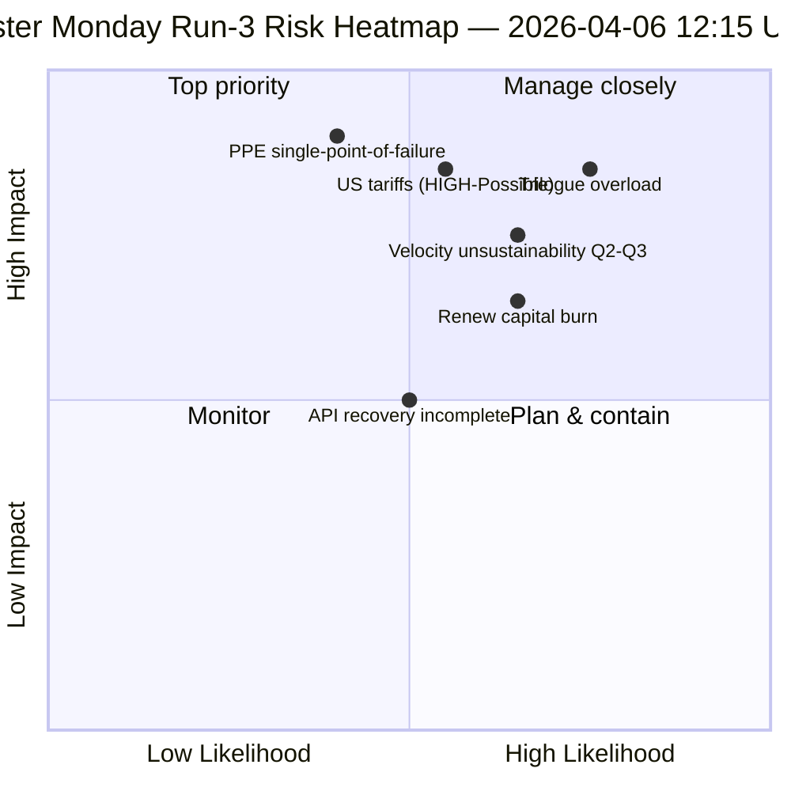

<!-- SPDX-FileCopyrightText: 2026 Hack23 AB -->
<!-- SPDX-License-Identifier: Apache-2.0 -->

# Executive Brief — Easter Monday Run 3: API Recovery + Convergence Zone | 2026-04-06

**Classification:** OSINT — Public Parliamentary Record
**Confidence:** 🟡 MEDIUM (recess; first confirmed API endpoint recovery; trilogue-overload risk HIGH)
**Run:** `analysis/daily/2026-04-06/breaking-3/` (12:15 UTC)
**Coverage:** Easter Recess Day 11/18 midday; first confirmed adopted-texts feed recovery
**Generated:** 2026-05-16 (retrospective brief, no new MCP calls)
**Primary sources:** Adopted-texts feed (86 items, recovered); 6 new methods (consequence-trees, legislative-disruption, velocity-risk, capital-risk, voting-patterns, agent-risk).

---

## 🎯 BLUF

**Run-3 produces the day's most consequential operational finding — the *first confirmed EP API endpoint recovery* during the 11-day recess: the adopted-texts feed transitioned from Mode-B (JSON parse errors at 06:45 UTC) to clean success (86 items returned at 12:15 UTC), validating Run-2's "backend reactivation" hypothesis.** Beyond the monitoring signal, the run completes the remaining six analysis methods not covered in earlier breaking runs and produces three structural contributions: **(a) Consequence Trees** map three cascading effect chains — legislative-sprint → implementation cascade, API-recovery → data-transparency cascade, PPE dual-track → political-capital cascade — converging on April 14–23 as the **"convergence zone"** where Committee Week, ECB rate decision, and first post-recess plenary votes co-occur; **(b) Legislative Velocity Risk** documents EP10 Year 2 as **2.11 acts/session, +44% YoY, the highest since EP7's 2012 Eurozone crisis response** — a velocity-sustainability concern flagged for Q2–Q3; **(c) Political Capital Risk** identifies group-level capital dynamics — **PPE accumulating, Greens/EFA declining, Renew burning fastest** — with system resilience 6/10 and a single-point-of-failure at PPE. The run's risk register tallies 15 risks (0 critical, 4 high, 7 medium, 4 low), with trilogue overload (HIGH, Likely) and US tariffs (HIGH, Possible) as the top two. Resilience score 5.8/10 indicates measurable but non-critical strain.

---

## 🧭 3 Decisions This Brief Supports

| # | Decision | Who decides | Deadline | Evidence |
|:-:|----------|-------------|:--------:|----------|
| 1 | **Convergence-zone elevated monitoring** — April 14–23 needs T+0/+1/+2 trip-wires | EP intelligence ops; press service | by April 12 | §Consequence Trees (convergence zone) |
| 2 | **Velocity-sustainability concern review** — 2.11 acts/session unsustainable beyond Q2 | Conference of Presidents | rolling Q2 | §Velocity Risk (+44% YoY) |
| 3 | **Renew capital-burn monitoring** — fastest-burning group; mid-term stability concern | Renew leadership; EPP coordination | rolling | §Political Capital Risk (Renew) |

---

## 📰 60-Second Read

- 🔴 **First confirmed API endpoint recovery** — adopted-texts feed Mode-B → success (86 items).
- 🟠 **Convergence zone April 14–23** — Committee Week + ECB + plenary co-occur.
- 🟢 **Velocity anomaly: 2.11 acts/session (+44% YoY)** — highest since EP7's 2012 Eurozone response.
- 🟡 **Political capital:** PPE accumulating · Greens declining · Renew burning fastest.
- 🔵 **System resilience 6/10** — single-point-of-failure at PPE.
- 🟣 **15-risk register:** 0 critical · 4 high · 7 medium · 4 low; resilience 5.8/10.
- 🩷 **Top 2 risks:** Trilogue overload (HIGH, Likely) · US tariffs (HIGH, Possible).
- ⚪ **Confidence MEDIUM** — primary recovery observation; structural readings high.

---

## 🌳 Three Cascading Effect Chains (Run-3 distinguishing contribution)

| Chain | Trigger | Cascade | Convergence point |
|-------|---------|---------|-------------------|
| **Legislative sprint → Implementation cascade** | Pre-recess March 26 burst | 42 EP10-2026 texts enter implementation Q2 | April 14–17 Committee Week |
| **API recovery → Data transparency cascade** | Adopted-texts Mode-B→clean recovery | Other endpoints follow; full transparency restored | April 8–10 expected |
| **PPE dual-track → Political capital cascade** | March 26 dual-track adoption | Capital accumulation at PPE; burn at Renew | April 20–23 first plenary |

**Convergence zone:** April 14–23 — all three chains land in the same 10-day window.

---

## ⚠️ Risk Snapshot

---

## 🔮 Top Forward Triggers (next 14 days)

1. **April 8–10 — Full API recovery expected** (55% probability per Run-3 model).
2. **April 14 — Committee Week opens** — convergence-zone Day 1.
3. **April 17 — ECB rate decision** — economic-context variable.
4. **April 20–23 — first post-recess plenary** — dual-track validation.
5. **End-Q2 — velocity-sustainability review** — 2.11 acts/session test.

---

## 🛡️ Source-Quality Assessment

- **API recovery (A1):** Run-3 direct observation; first confirmed endpoint reactivation.
- **Velocity 2.11 acts/session (A1):** precomputed stats; historical comparison verifiable.
- **Capital-burn ranking (A2):** group-level capital methodology; medium-confidence ordering.
- **15-risk register (A2):** systematic methodology; resilience score 5.8/10 verifiable.
- **Net confidence:** 🟢 HIGH on API recovery; 🟡 MEDIUM on capital-burn forecast.

---

## 📎 Run Artifacts

| Layer | Artifact | Why |
|-------|----------|-----|
| Article | `article.md` | Public-facing Run-3 narrative |
| Synthesis | `synthesis-summary.md` | API recovery + 6 new methods |
| Methods | consequence-trees · legislative-disruption · velocity-risk · political-capital-risk · voting-patterns · agent-risk-workflow | Six new methods (this run) |
| Companion | breaking (00:33) · breaking-2 (06:45) · committee-reports (05:03) · propositions (05:47) | Easter Monday cluster |

---

**Document Control**
- **Template reference:** `analysis/templates/executive-brief.md`
- **Artifact path:** `analysis/daily/2026-04-06/breaking-3/executive-brief.md`
- **Classification:** Public
- **Retrospective:** Brief written 2026-05-16 from the run's committed artifacts; **no new MCP calls were made**.
