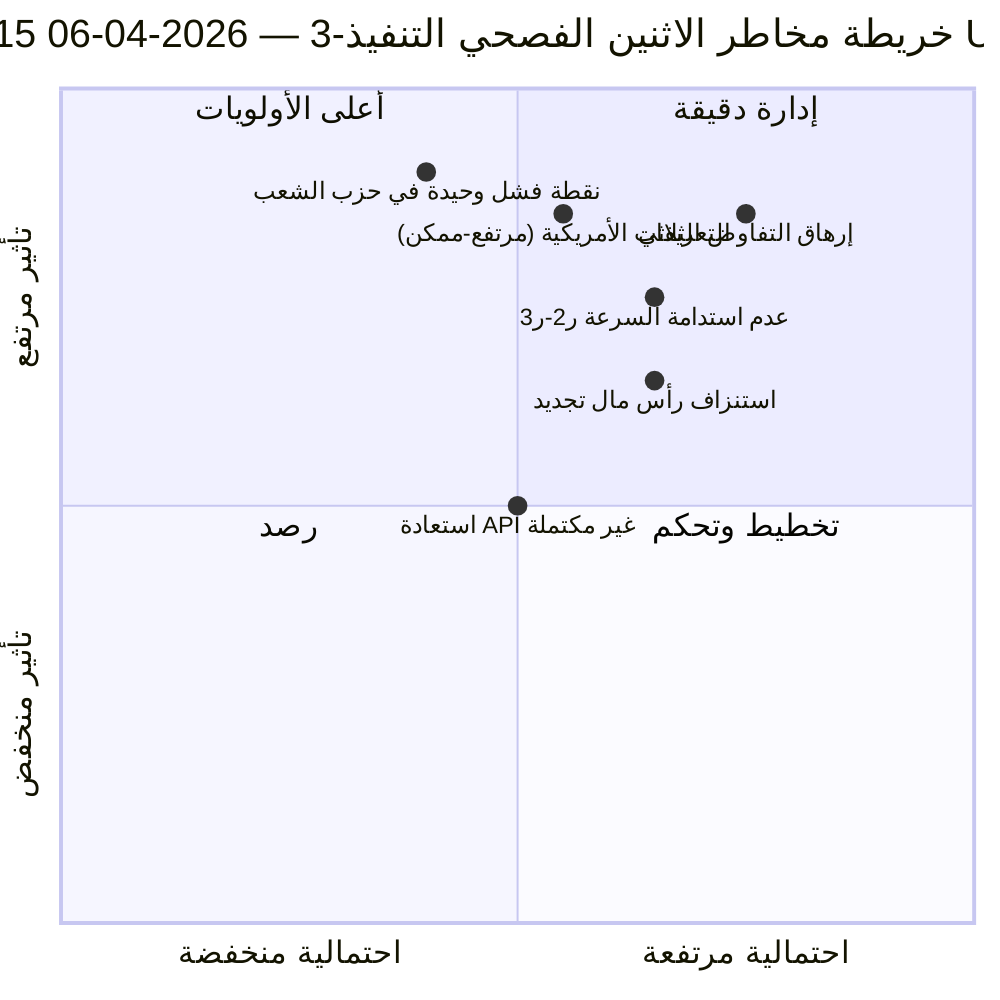

<!-- SPDX-FileCopyrightText: 2026 Hack23 AB -->
<!-- SPDX-License-Identifier: Apache-2.0 -->

# ملخص الاستخبارات التنفيذية — تنفيذ الاثنين الفصحي 3: استعادة واجهة برمجة التطبيقات + منطقة التقاطع | 2026-04-06

**التصنيف:** OSINT — السجل البرلماني العام
**مستوى الثقة:** 🟡 متوسط (فترة استراحة؛ أول استعادة مؤكدة لنقطة نهاية API؛ مخاطر الإرهاق التفاوضي مرتفعة)
**التنفيذ:** `analysis/daily/2026-04-06/breaking-3/` (12:15 بتوقيت UTC)
**النطاق:** يوم الاستراحة الفصحية 11/18 ظهرًا؛ أول استعادة مؤكدة لتغذية النصوص المعتمدة
**تاريخ الإنشاء:** 2026-05-16 (ملخص استرجاعي، دون استدعاءات MCP جديدة)
**المصادر الأساسية:** تغذية النصوص المعتمدة (86 عنصرًا، مُستعادة)؛ 6 أساليب جديدة (أشجار العواقب، الانقطاع التشريعي، مخاطر السرعة، مخاطر رأس المال، أنماط التصويت، مخاطر الوكيل).

---

## 🎯 الخلاصة التنفيذية

**يُنتج التنفيذ-3 أهم نتيجة تشغيلية في اليوم — *أول استعادة مؤكدة لنقطة نهاية API في البرلمان الأوروبي* خلال 11 يوم استراحة: انتقلت تغذية النصوص المعتمدة من الوضع-ب (أخطاء تحليل JSON في 06:45 بتوقيت UTC) إلى النجاح النظيف (86 عنصرًا عُيد في 12:15 بتوقيت UTC)، مما يثبت فرضية "إعادة تفعيل الخلفية" الواردة في التنفيذ-2.** علاوة على إشارة المراقبة، يُكمل هذا التنفيذ الأساليب التحليلية الستة المتبقية التي لم تُغطَّ في التنفيذات السابقة، ويُقدِّم ثلاثة مساهمات هيكلية: **(أ) أشجار العواقب** ترسم ثلاث سلاسل تأثير متتالية — الاندفاع التشريعي ← شلال التنفيذ، استعادة API ← شلال شفافية البيانات، المسار المزدوج لحزب الشعب الأوروبي ← شلال رأس المال السياسي — تتقاطع عند 14–23 أبريل بوصفها **"منطقة التقاطع"** حيث تتزامن أسبوع اللجان وقرار سعر الفائدة لدى البنك المركزي الأوروبي وأولى التصويتات البرلمانية ما بعد الاستراحة؛ **(ب) مخاطر سرعة التشريع** يوثِّق الـ EP10 السنة الثانية بـ **2.11 فعل/جلسة، +44% على أساس سنوي، الأعلى منذ استجابة EP7 لأزمة منطقة اليورو عام 2012** — مصدر قلق بالاستدامة يُلاحَظ للربع الثاني–الثالث؛ **(ج) مخاطر رأس المال السياسي** تكشف ديناميكيات رأس المال على مستوى الكتلة — **حزب الشعب الأوروبي يتراكم، الخضر/التحالف الحر الأوروبي يتراجع، تجديد أوروبا يستنزف بأسرع وتيرة** — مع مرونة النظام 6/10 ونقطة فشل وحيدة في حزب الشعب. يُحصي سجل مخاطر التنفيذ 15 مخاطرة (0 حرجة، 4 مرتفعة، 7 متوسطة، 4 منخفضة)، مع تصدُّر إرهاق التفاوض الثلاثي (مرتفع، محتمل) والتعريفات الأمريكية (مرتفع، ممكن) قائمة الأولويات. درجة المرونة 5.8/10 تشير إلى توتر ملموس لكنه غير حرج.

---

## 🧭 3 قرارات يدعمها هذا الملخص

| # | القرار | صاحب القرار | الموعد النهائي | الدليل |
|:-:|--------|------------|:-------------:|--------|
| 1 | **رفع مستوى رصد منطقة التقاطع** — 14–23 أبريل تحتاج محفزات T+0/+1/+2 | عمليات الاستخبارات في البرلمان الأوروبي؛ قسم الصحافة | قبل 12 أبريل | §أشجار العواقب (منطقة التقاطع) |
| 2 | **مراجعة استدامة السرعة** — 2.11 فعل/جلسة غير مستدام ما بعد الربع الثاني | مؤتمر الرؤساء | مستمر ربع الثاني | §مخاطر السرعة (+44% سنويًا) |
| 3 | **رصد استنزاف رأس مال تجديد أوروبا** — الكتلة الأسرع استنزافًا؛ قلق استقرار منتصف الولاية | قيادة تجديد؛ تنسيق حزب الشعب الأوروبي | مستمر | §مخاطر رأس المال السياسي (تجديد) |

---

## 📰 القراءة في 60 ثانية

- 🔴 **أول استعادة مؤكدة لنقطة نهاية API** — تغذية النصوص المعتمدة: الوضع-ب ← نجاح (86 عنصرًا).
- 🟠 **منطقة التقاطع 14–23 أبريل** — أسبوع اللجان + البنك المركزي الأوروبي + الجلسة العامة تتزامن.
- 🟢 **شذوذ السرعة: 2.11 فعل/جلسة (+44% سنويًا)** — الأعلى منذ استجابة EP7 لأزمة اليورو 2012.
- 🟡 **رأس المال السياسي:** حزب الشعب يتراكم · الخضر يتراجع · تجديد يستنزف بأسرع وتيرة.
- 🔵 **مرونة النظام 6/10** — نقطة فشل وحيدة في حزب الشعب الأوروبي.
- 🟣 **سجل 15 مخاطرة:** 0 حرجة · 4 مرتفعة · 7 متوسطة · 4 منخفضة؛ مرونة 5.8/10.
- 🩷 **أهم مخاطرتين:** إرهاق التفاوض الثلاثي (مرتفع، محتمل) · التعريفات الأمريكية (مرتفع، ممكن).
- ⚪ **الثقة: متوسطة** — مشاهدة استعادة أولية؛ القراءات الهيكلية مرتفعة.

---

## 🌳 ثلاث سلاسل تأثير متتالية (المساهمة المميزة للتنفيذ-3)

| السلسلة | المحفز | التتابع | نقطة التقاطع |
|---------|--------|---------|-------------|
| **الاندفاع التشريعي ← شلال التنفيذ** | الاندفاع قبيل الاستراحة في 26 مارس | 42 نصًا من EP10-2026 تدخل تنفيذ الربع الثاني | 14–17 أبريل أسبوع اللجان |
| **استعادة API ← شلال شفافية البيانات** | النصوص المعتمدة: الوضع-ب ← الاستعادة النظيفة | نقاط نهاية أخرى تتبع؛ استعادة الشفافية الكاملة | 8–10 أبريل متوقع |
| **المسار المزدوج لحزب الشعب ← شلال رأس المال السياسي** | اعتماد المسار المزدوج 26 مارس | تراكم رأس المال في حزب الشعب؛ استنزاف في تجديد | 20–23 أبريل أول جلسة عامة |

**منطقة التقاطع:** 14–23 أبريل — تتقاطع السلاسل الثلاث في نافذة 10 أيام.

---

## ⚠️ لمحة سريعة عن المخاطر

---

## 🔮 أبرز المحفزات المستقبلية (الـ 14 يومًا القادمة)

1. **8–10 أبريل — استعادة API الكاملة المتوقعة** (55% احتمالية وفق نموذج التنفيذ-3).
2. **14 أبريل — افتتاح أسبوع اللجان** — منطقة التقاطع اليوم الأول.
3. **17 أبريل — قرار سعر الفائدة للبنك المركزي الأوروبي** — متغير السياق الاقتصادي.
4. **20–23 أبريل — أول جلسة عامة ما بعد الاستراحة** — التحقق من صحة المسار المزدوج.
5. **نهاية الربع الثاني — مراجعة استدامة السرعة** — اختبار معدل 2.11 فعل/جلسة.

---

## 🛡️ تقييم جودة المصادر

- **استعادة API (A1):** مشاهدة مباشرة بالتنفيذ-3؛ أول إعادة تفعيل مؤكدة لنقطة النهاية.
- **السرعة 2.11 فعل/جلسة (A1):** إحصائيات محسوبة مسبقًا؛ المقارنة التاريخية قابلة للتحقق.
- **تصنيف الاستنزاف الرأسمالي (A2):** منهجية رأس المال على مستوى الكتلة؛ ترتيب ثقة متوسط.
- **سجل 15 مخاطرة (A2):** منهجية منهجية؛ درجة المرونة 5.8/10 قابلة للتحقق.
- **الثقة الإجمالية:** 🟢 مرتفعة لاستعادة API؛ 🟡 متوسطة لتوقعات استنزاف رأس المال.

---

## 📎 مخرجات التنفيذ

| الطبقة | المخرج | السبب |
|--------|--------|-------|
| مقالة | `article.md` | السرد العام للتنفيذ-3 |
| تركيب | `synthesis-summary.md` | استعادة API + 6 أساليب جديدة |
| أساليب | أشجار العواقب · الانقطاع التشريعي · مخاطر السرعة · مخاطر رأس المال السياسي · أنماط التصويت · تدفق مخاطر الوكيل | ستة أساليب جديدة (هذا التنفيذ) |
| مصاحبة | breaking (00:33) · breaking-2 (06:45) · تقارير اللجان (05:03) · المقترحات (05:47) | مجموعة الاثنين الفصحي |

---

**التحكم في الوثيقة**
- **مرجع القالب:** `analysis/templates/executive-brief.md`
- **مسار المخرج:** `analysis/daily/2026-04-06/breaking-3/executive-brief.md`
- **التصنيف:** عام
- **استرجاعي:** تمت كتابة الملخص في 2026-05-16 استنادًا إلى مخرجات التنفيذ المؤرشفة؛ **لم تُجرَ استدعاءات MCP جديدة**.
