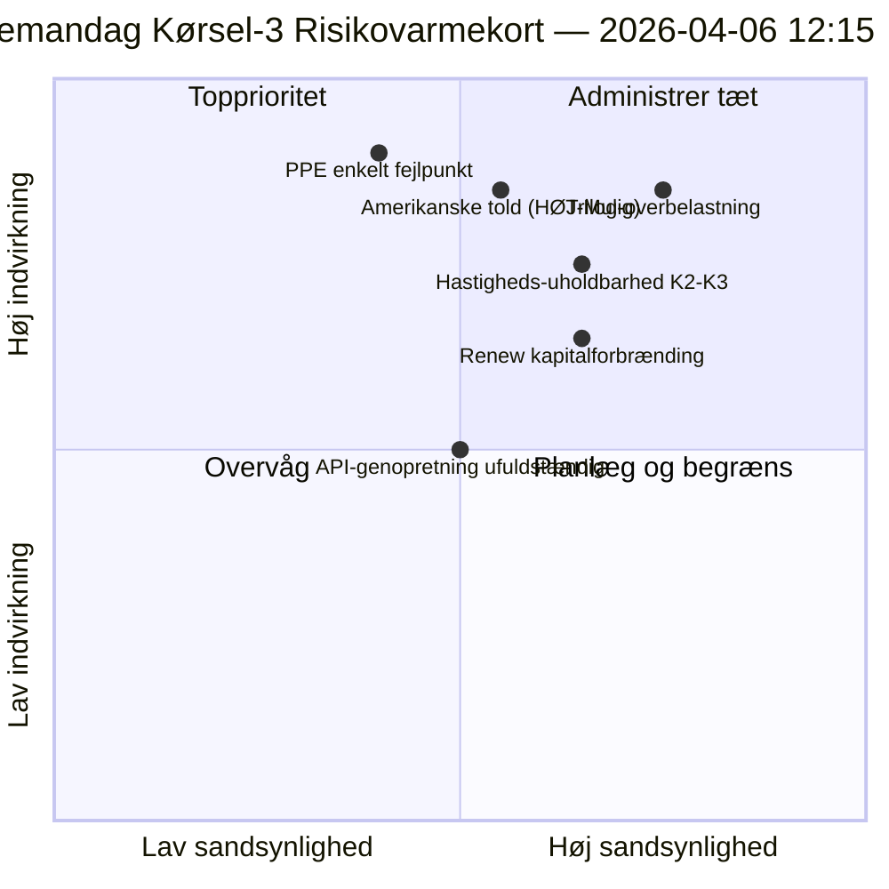

<!-- SPDX-FileCopyrightText: 2026 Hack23 AB -->
<!-- SPDX-License-Identifier: Apache-2.0 -->

# Udøvende Efterretningsbriefing — Påskemandag Kørsel 3: API-genopretning + Konvergenszone | 2026-04-06

**Klassifikation:** OSINT — Offentlig parlamentarisk protokol
**Tillid:** 🟡 MIDDEL (recess; første bekræftede API-slutpunktsgenopretning; trilog-overbelastningsrisiko HØJ)
**Kørsel:** `analysis/daily/2026-04-06/breaking-3/` (12:15 UTC)
**Dækning:** Påskerecess dag 11/18 middag; første bekræftede adopted-texts-feed-genopretning
**Genereret:** 2026-05-16 (retrospektivt resumé, ingen nye MCP-opkald)
**Primære kilder:** Adopted-texts-feed (86 elementer, genoprettet); 6 nye metoder (consequence-trees, legislative-disruption, velocity-risk, capital-risk, voting-patterns, agent-risk).

---

## 🎯 BLUF

**Kørsel-3 producerer dagens mest konsekvente operative fund — den *første bekræftede EP API-slutpunktsgenopretning* under den 11-dages recess: adopted-texts-feedet overgik fra Mode-B (JSON-parse-fejl kl. 06:45 UTC) til ren succes (86 elementer returneret kl. 12:15 UTC), hvilket validerer Kørsel-2's "backend-genaktivering"-hypotese.** Ud over overvågningssignalet fuldfører kørslen de resterende seks analysemetoder, som ikke var dækket i tidligere breaking-kørsler, og producerer tre strukturelle bidrag: **(a) Konsekvenstræer** kortlægger tre kaskaderende effektkæder — lovgivningssprint → implementeringskaskade, API-genopretning → datatransparenskaskade, PPE dual-track → politisk-kapital-kaskade — der konvergerer mod april 14–23 som **"konvergenszonen"** hvor Komitéugen, ECB-rentebeslutning og de første plenaafstemninger efter recessens sammenfald; **(b) Lovgivningshastigheds-risiko** dokumenterer EP10 År 2 som **2,11 retsakter/session, +44 % ÅtÅ, den højeste siden EP7's eurozonekrisereaktions i 2012** — et holdbarhedsproblem der flagges for K2–K3; **(c) Politisk kapitalrisiko** identificerer gruppeniveaukapitaldynamik — **PPE akkumulerer, Greens/EFA faldende, Renew brænder hurtigst** — med systemrobusthed 6/10 og et enkelt fejlpunkt ved PPE. Kørslens risikoregister optæller 15 risici (0 kritiske, 4 høje, 7 medium, 4 lave), med trilog-overbelastning (HØJ, Sandsynlig) og amerikanske told (HØJ, Mulig) som de to øverste. Robusthedsscore 5,8/10 indikerer målbar men ikke-kritisk belastning.

---

## 🧭 3 Beslutninger som dette resumé understøtter

| # | Beslutning | Hvem beslutter | Frist | Bevis |
|:-:|----------|-------------|:--------:|----------|
| 1 | **Konvergenszone forhøjet overvågning** — april 14–23 behøver T+0/+1/+2 tripwires | EP efterretningsoperationer; pressetjenesten | inden 12. april | §Konsekvenstræer (konvergenszone) |
| 2 | **Hastighedsholdbarhedsgennemgang** — 2,11 retsakter/session uholdbart efter K2 | Formandskabskonference | løbende K2 | §Hastigheds-risiko (+44 % ÅtÅ) |
| 3 | **Renew kapitalforbrændings-overvågning** — hurtigst forbrændende gruppe; midtvejsstabilitetsproblem | Renew-ledelse; EPP-koordination | løbende | §Politisk kapitalrisiko (Renew) |

---

## 📰 60-Sekunders Læsning

- 🔴 **Første bekræftede API-slutpunktsgenopretning** — adopted-texts-feed Mode-B → succes (86 elementer).
- 🟠 **Konvergenszone 14.–23. april** — Komitéuge + ECB + plenum sammenfald.
- 🟢 **Hastighedsanomali: 2,11 retsakter/session (+44 % ÅtÅ)** — den højeste siden EP7's eurozonereaktions 2012.
- 🟡 **Politisk kapital:** PPE akkumulerer · Greens faldende · Renew brænder hurtigst.
- 🔵 **Systemrobusthed 6/10** — enkelt fejlpunkt ved PPE.
- 🟣 **15-risikoregister:** 0 kritiske · 4 høje · 7 medium · 4 lave; robusthed 5,8/10.
- 🩷 **Top 2-risici:** Trilog-overbelastning (HØJ, Sandsynlig) · Amerikanske told (HØJ, Mulig).
- ⚪ **Tillid MIDDEL** — primær genopretningsobservation; strukturelle aflæsninger høje.

---

## 🌳 Tre Kaskaderende Effektkæder (Kørsel-3's særskilte bidrag)

| Kæde | Udløser | Kaskade | Konvergenspunkt |
|-------|---------|---------|-------------------|
| **Lovgivningssprint → Implementeringskaskade** | Pre-recess-burst 26. marts | 42 EP10-2026-tekster træder implementeringen K2 | 14.–17. april Komitéuge |
| **API-genopretning → Datatransparenskaskade** | Adopted-texts Mode-B→ren genopretning | Andre slutpunkter følger; fuld transparens genoprettet | 8.–10. april forventet |
| **PPE dual-track → Politisk kapital-kaskade** | Dual-track-vedtagelse 26. marts | Kapitalakkumulering ved PPE; forbrænding ved Renew | 20.–23. april første plenum |

**Konvergenszone:** 14.–23. april — alle tre kæder lander i det samme 10-dagesvindue.

---

## ⚠️ Risiko-øjebliksbillede

---

## 🔮 Top Fremtidige Udløsere (næste 14 dage)

1. **8.–10. april — Fuld API-genopretning forventet** (55 % sandsynlighed per Kørsel-3-model).
2. **14. april — Komitéuge åbner** — konvergenszone Dag 1.
3. **17. april — ECB-rentebeslutning** — økonomisk-kontekstvariabel.
4. **20.–23. april — første post-recess plenum** — dual-track-validering.
5. **Slut-K2 — hastighedsholdbarhedsgennemgang** — 2,11 retsakter/session-test.

---

## 🛡️ Kildekvali tetsvurdering

- **API-genopretning (A1):** Kørsel-3 direkte observation; første bekræftede slutpunktsgenaktivering.
- **Hastighed 2,11 retsakter/session (A1):** forberegnede statistikker; historisk sammenligning verificerbar.
- **Kapitalforbrændings-rangering (A2):** gruppekapi tal-metodologi; middelkonfidensordning.
- **15-risikoregister (A2):** systematisk metodologi; robusthedsscore 5,8/10 verificerbar.
- **Nettokonfidans:** 🟢 HØJ på API-genopretning; 🟡 MIDDEL på kapitalforbrændingsprognose.

---

## 📎 Kørselsartefakter

| Lag | Artefakt | Hvorfor |
|-------|----------|-----|
| Artikel | `article.md` | Offentlig Kørsel-3-narrativ |
| Syntese | `synthesis-summary.md` | API-genopretning + 6 nye metoder |
| Metoder | consequence-trees · legislative-disruption · velocity-risk · political-capital-risk · voting-patterns · agent-risk-workflow | Seks nye metoder (denne kørsel) |
| Ledsager | breaking (00:33) · breaking-2 (06:45) · committee-reports (05:03) · propositions (05:47) | Påskemandag-klynge |

---

**Dokumentkontrol**
- **Skabelonreference:** `analysis/templates/executive-brief.md`
- **Artefaktsti:** `analysis/daily/2026-04-06/breaking-3/executive-brief.md`
- **Klassifikation:** Offentlig
- **Retrospektiv:** Resumé skrevet 2026-05-16 fra kørslens arkiverede artefakter; **ingen nye MCP-opkald blev foretaget**.
