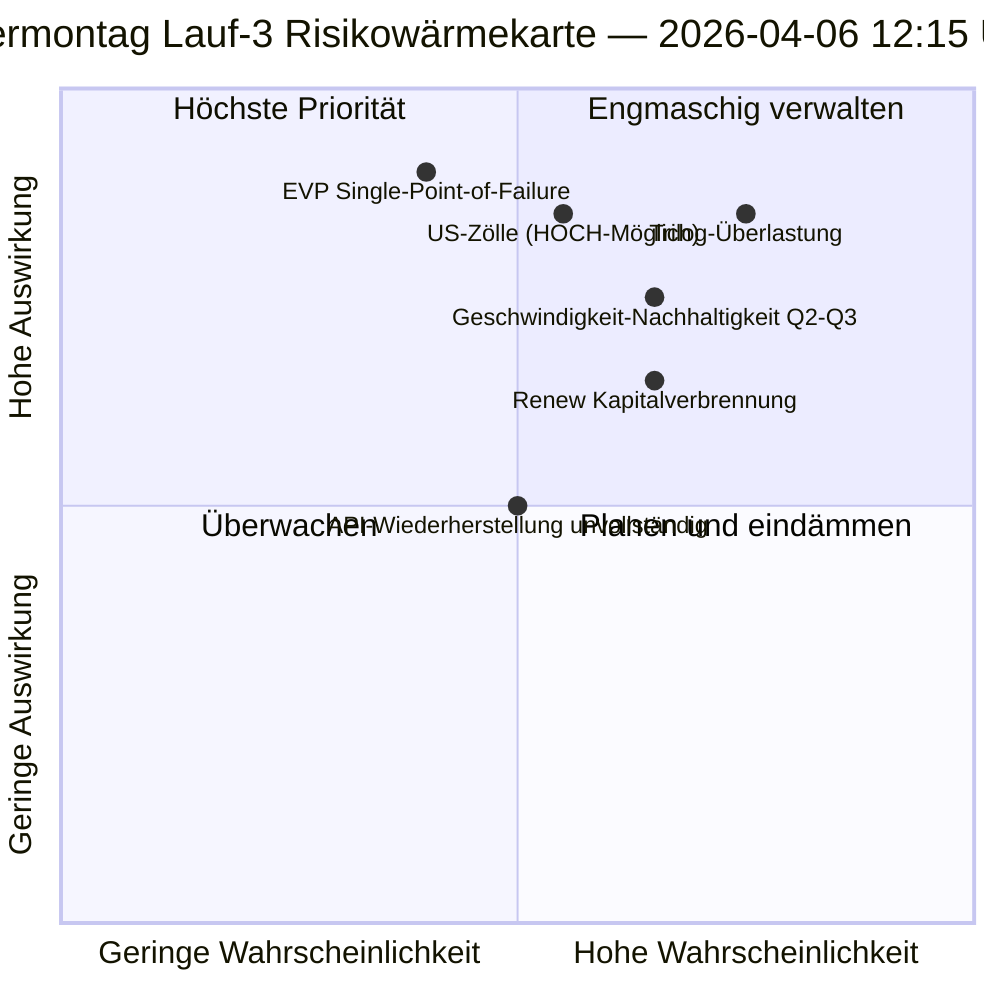

<!-- SPDX-FileCopyrightText: 2026 Hack23 AB -->
<!-- SPDX-License-Identifier: Apache-2.0 -->

# Exekutiver Geheimdienstbericht — Ostermontag Lauf 3: API-Wiederherstellung + Konvergenzzone | 2026-04-06

**Klassifizierung:** OSINT — Öffentliche parlamentarische Aufzeichnung
**Vertrauen:** 🟡 MITTEL (Recesszeit; erste bestätigte API-Endpunkt-Wiederherstellung; Trilog-Überlastungsrisiko HOCH)
**Lauf:** `analysis/daily/2026-04-06/breaking-3/` (12:15 UTC)
**Abdeckung:** Osterrezesstag 11/18 Mittag; erste bestätigte adopted-texts-Feed-Wiederherstellung
**Erstellt:** 2026-05-16 (retrospektive Zusammenfassung, keine neuen MCP-Aufrufe)
**Primärquellen:** Adopted-texts-Feed (86 Einträge, wiederhergestellt); 6 neue Methoden (consequence-trees, legislative-disruption, velocity-risk, capital-risk, voting-patterns, agent-risk).

---

## 🎯 BLUF

**Lauf 3 produziert den folgenreichsten operativen Befund des Tages — die *erste bestätigte EP-API-Endpunkt-Wiederherstellung* während des 11-tägigen Recessens: Der adopted-texts-Feed wechselte von Mode-B (JSON-Parse-Fehler um 06:45 UTC) zu sauberem Erfolg (86 Einträge um 12:15 UTC zurückgegeben), was die "Backend-Reaktivierungs"-Hypothese von Lauf 2 bestätigt.** Über das Überwachungssignal hinaus vervollständigt der Lauf die verbleibenden sechs Analysemethoden, die in früheren Breaking-Läufen nicht abgedeckt wurden, und liefert drei strukturelle Beiträge: **(a) Konsequenzbäume** kartieren drei kaskadierende Effektketten — Gesetzgebungssprint → Implementierungskaskade, API-Wiederherstellung → Datentransparenzkaskade, EVP Dual-Track → Politisches-Kapital-Kaskade — die auf April 14–23 als **„Konvergenzzone"** zulaufen, wo Ausschusswoche, EZB-Zinsentscheid und erste PlenarAbstimmungen nach dem Rezess zusammenfallen; **(b) Gesetzgebungsgeschwindigkeitsrisiko** dokumentiert EP10 Jahr 2 als **2,11 Rechtsakte/Sitzung, +44 % JzJ, der höchste seit EP7s Eurozonenkrisesreaktion 2012** — ein Nachhaltigkeitsproblem, das für Q2–Q3 markiert wird; **(c) Politisches Kapitalrisiko** identifiziert Gruppenkapitaldynamik — **EVP akkumulierend, Greens/EFA sinkend, Renew am schnellsten brennend** — mit Systemresilienz 6/10 und einem Single-Point-of-Failure bei EVP. Das Risikoregister des Laufs zählt 15 Risiken (0 kritische, 4 hohe, 7 mittlere, 4 niedrige), wobei Trilog-Überlastung (HOCH, Wahrscheinlich) und US-Zölle (HOCH, Möglich) die beiden obersten sind. Resilienzwert 5,8/10 zeigt messbare aber nicht kritische Belastung an.

---

## 🧭 3 Entscheidungen, die diese Zusammenfassung unterstützt

| # | Entscheidung | Wer entscheidet | Frist | Beleg |
|:-:|----------|-------------|:--------:|----------|
| 1 | **Konvergenzzone erhöhte Überwachung** — 14.–23. April benötigt T+0/+1/+2 Stolperdrähte | EP-Geheimdienstoperationen; Pressedienst | bis 12. April | §Konsequenzbäume (Konvergenzzone) |
| 2 | **Geschwindigkeitsnachhaltigkeitsprüfung** — 2,11 Rechtsakte/Sitzung nicht nachhaltig nach Q2 | Konferenz der Vorsitzenden | fortlaufend Q2 | §Geschwindigkeitsrisiko (+44 % JzJ) |
| 3 | **Renew Kapitalverbrennungsüberwachung** — schnellst verbrauchende Gruppe; Midterm-Stabilitätsproblem | Renew-Führung; EVP-Koordination | fortlaufend | §Politisches Kapitalrisiko (Renew) |

---

## 📰 60-Sekunden-Lesung

- 🔴 **Erste bestätigte API-Endpunkt-Wiederherstellung** — adopted-texts-Feed Mode-B → Erfolg (86 Einträge).
- 🟠 **Konvergenzzone 14.–23. April** — Ausschusswoche + EZB + Plenum zusammenfallend.
- 🟢 **Geschwindigkeitsanomalie: 2,11 Rechtsakte/Sitzung (+44 % JzJ)** — der höchste seit EP7s Eurozonenlösung 2012.
- 🟡 **Politisches Kapital:** EVP akkumulierend · Greens sinkend · Renew am schnellsten brennend.
- 🔵 **Systemresilienz 6/10** — Single-Point-of-Failure bei EVP.
- 🟣 **15-Risikoregister:** 0 kritische · 4 hohe · 7 mittlere · 4 niedrige; Resilienz 5,8/10.
- 🩷 **Top-2-Risiken:** Trilog-Überlastung (HOCH, Wahrscheinlich) · US-Zölle (HOCH, Möglich).
- ⚪ **Vertrauen MITTEL** — primäre Wiederherstellungsbeobachtung; strukturelle Lesungen hoch.

---

## 🌳 Drei Kaskadierende Effektketten (Unterscheidender Beitrag von Lauf 3)

| Kette | Auslöser | Kaskade | Konvergenzpunkt |
|-------|---------|---------|-------------------|
| **Gesetzgebungssprint → Implementierungskaskade** | Pre-Rezess-Burst 26. März | 42 EP10-2026-Texte treten Implementierung Q2 ein | 14.–17. April Ausschusswoche |
| **API-Wiederherstellung → Datentransparenzkaskade** | Adopted-texts Mode-B→saubere Wiederherstellung | Andere Endpunkte folgen; volle Transparenz wiederhergestellt | 8.–10. April erwartet |
| **EVP Dual-Track → Politische Kapital-Kaskade** | Dual-Track-Annahme 26. März | Kapitalakkumulation bei EVP; Verbrennung bei Renew | 20.–23. April erstes Plenum |

**Konvergenzzone:** 14.–23. April — alle drei Ketten landen im selben 10-Tage-Fenster.

---

## ⚠️ Risikomomentaufnahme

---

## 🔮 Top Künftige Auslöser (nächste 14 Tage)

1. **8.–10. April — Vollständige API-Wiederherstellung erwartet** (55 % Wahrscheinlichkeit per Lauf-3-Modell).
2. **14. April — Ausschusswoche beginnt** — Konvergenzzone Tag 1.
3. **17. April — EZB-Zinsentscheid** — wirtschaftlicher Kontextvariable.
4. **20.–23. April — erstes Plenum nach Rezess** — Dual-Track-Validierung.
5. **Ende-Q2 — Geschwindigkeitsnachhaltigkeitsprüfung** — 2,11 Rechtsakte/Sitzung-Test.

---

## 🛡️ Quellenqualitätsbewertung

- **API-Wiederherstellung (A1):** Lauf-3 direkte Beobachtung; erste bestätigte Endpunktreaktivierung.
- **Geschwindigkeit 2,11 Rechtsakte/Sitzung (A1):** vorberechnete Statistiken; historischer Vergleich verifizierbar.
- **Kapitalverbrennungsranking (A2):** Gruppenkapitalmethodik; mittlere Konfidenzreihenfolge.
- **15-Risikoregister (A2):** systematische Methodik; Resilienzwert 5,8/10 verifizierbar.
- **Nettovertrauen:** 🟢 HOCH bei API-Wiederherstellung; 🟡 MITTEL bei Kapitalverbrennungsprognose.

---

## 📎 Laufartefakte

| Schicht | Artefakt | Warum |
|-------|----------|-----|
| Artikel | `article.md` | Öffentlich ausgerichtetes Lauf-3-Narrativ |
| Synthese | `synthesis-summary.md` | API-Wiederherstellung + 6 neue Methoden |
| Methoden | consequence-trees · legislative-disruption · velocity-risk · political-capital-risk · voting-patterns · agent-risk-workflow | Sechs neue Methoden (dieser Lauf) |
| Begleitung | breaking (00:33) · breaking-2 (06:45) · committee-reports (05:03) · propositions (05:47) | Ostermontag-Cluster |

---

**Dokumentkontrolle**
- **Vorlagenreferenz:** `analysis/templates/executive-brief.md`
- **Artefaktpfad:** `analysis/daily/2026-04-06/breaking-3/executive-brief.md`
- **Klassifizierung:** Öffentlich
- **Retrospektiv:** Zusammenfassung am 2026-05-16 aus den archivierten Artefakten des Laufs verfasst; **keine neuen MCP-Aufrufe wurden gemacht**.
