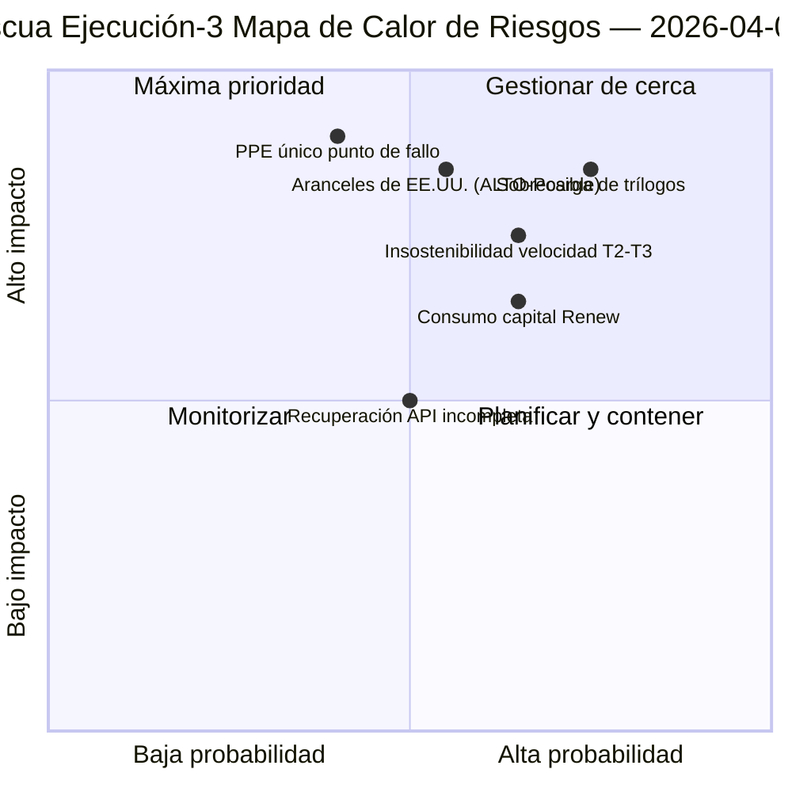

<!-- SPDX-FileCopyrightText: 2026 Hack23 AB -->
<!-- SPDX-License-Identifier: Apache-2.0 -->

# Resumen de Inteligencia Ejecutiva — Lunes de Pascua Ejecución 3: Recuperación API + Zona de Convergencia | 2026-04-06

**Clasificación:** OSINT — Registro parlamentario público
**Confianza:** 🟡 MEDIO (receso; primera recuperación confirmada de punto final de API; riesgo de sobrecarga de trílogos ALTO)
**Ejecución:** `analysis/daily/2026-04-06/breaking-3/` (12:15 UTC)
**Cobertura:** Día de receso de Pascua 11/18 mediodía; primera recuperación confirmada del feed de textos adoptados
**Generado:** 2026-05-16 (resumen retrospectivo, sin nuevas llamadas MCP)
**Fuentes primarias:** Feed de textos adoptados (86 elementos, recuperado); 6 nuevos métodos (árboles de consecuencias, interrupción legislativa, riesgo de velocidad, riesgo de capital, patrones de votación, riesgo de agente).

---

## 🎯 BLUF

**La Ejecución-3 produce el hallazgo operativo más consecuente del día — la *primera recuperación confirmada de punto final de API del PE* durante los 11 días de receso: el feed de textos adoptados pasó del Modo-B (errores de análisis JSON a las 06:45 UTC) al éxito limpio (86 elementos devueltos a las 12:15 UTC), validando la hipótesis de "reactivación del backend" de la Ejecución-2.** Más allá de la señal de monitorización, la ejecución completa los seis métodos de análisis restantes no cubiertos en ejecuciones anteriores y produce tres contribuciones estructurales: **(a) Árboles de Consecuencias** mapean tres cadenas de efectos en cascada — sprint legislativo → cascada de implementación, recuperación API → cascada de transparencia de datos, PPE doble vía → cascada de capital político — convergiendo hacia el 14–23 de abril como la **"zona de convergencia"** donde la Semana de Comisiones, la decisión de tipos del BCE y los primeros votos plenarios post-receso coocurren; **(b) Riesgo de Velocidad Legislativa** documenta EP10 Año 2 como **2,11 actos/sesión, +44 % interanual, el más alto desde la respuesta a la crisis de la eurozona de EP7 en 2012** — una preocupación de sostenibilidad señalada para T2–T3; **(c) Riesgo de Capital Político** identifica la dinámica de capital a nivel de grupo — **PPE acumulando, Greens/EFA disminuyendo, Renew quemando más rápido** — con resiliencia del sistema 6/10 y un único punto de fallo en PPE. El registro de riesgos de la ejecución cuenta 15 riesgos (0 críticos, 4 altos, 7 medios, 4 bajos), con sobrecarga de trílogos (ALTO, Probable) y aranceles de EE. UU. (ALTO, Posible) como los dos primeros. Puntuación de resiliencia 5,8/10 indica tensión medible pero no crítica.

---

## 🧭 3 Decisiones que Apoya este Resumen

| # | Decisión | Quién decide | Plazo | Evidencia |
|:-:|----------|-------------|:--------:|----------|
| 1 | **Monitorización elevada de la zona de convergencia** — 14–23 de abril necesita disparadores T+0/+1/+2 | Operaciones de inteligencia del PE; servicio de prensa | antes del 12 de abril | §Árboles de Consecuencias (zona de convergencia) |
| 2 | **Revisión de sostenibilidad de velocidad** — 2,11 actos/sesión insostenible más allá del T2 | Conferencia de Presidentes | continuo T2 | §Riesgo de Velocidad (+44 % interanual) |
| 3 | **Monitorización del consumo de capital de Renew** — grupo que quema más rápido; preocupación de estabilidad a mitad de mandato | Liderazgo de Renew; coordinación PPE | continuo | §Riesgo de Capital Político (Renew) |

---

## 📰 Lectura en 60 Segundos

- 🔴 **Primera recuperación confirmada de punto final de API** — feed de textos adoptados Modo-B → éxito (86 elementos).
- 🟠 **Zona de convergencia 14–23 de abril** — Semana de Comisiones + BCE + plenario coinciden.
- 🟢 **Anomalía de velocidad: 2,11 actos/sesión (+44 % interanual)** — el más alto desde la respuesta de la eurozona de EP7 en 2012.
- 🟡 **Capital político:** PPE acumulando · Greens disminuyendo · Renew quemando más rápido.
- 🔵 **Resiliencia del sistema 6/10** — único punto de fallo en PPE.
- 🟣 **Registro de 15 riesgos:** 0 críticos · 4 altos · 7 medios · 4 bajos; resiliencia 5,8/10.
- 🩷 **Top 2 riesgos:** Sobrecarga de trílogos (ALTO, Probable) · Aranceles de EE. UU. (ALTO, Posible).
- ⚪ **Confianza MEDIO** — observación de recuperación primaria; lecturas estructurales altas.

---

## 🌳 Tres Cadenas de Efectos en Cascada (Contribución Distintiva de la Ejecución-3)

| Cadena | Disparador | Cascada | Punto de convergencia |
|-------|---------|---------|-------------------|
| **Sprint legislativo → Cascada de implementación** | Ráfaga pre-receso del 26 de marzo | 42 textos EP10-2026 entran en implementación T2 | 14–17 de abril Semana de Comisiones |
| **Recuperación API → Cascada de transparencia de datos** | Textos adoptados Modo-B → recuperación limpia | Otros puntos finales siguen; transparencia completa restaurada | 8–10 de abril previsto |
| **PPE doble vía → Cascada de capital político** | Adopción de doble vía 26 de marzo | Acumulación de capital en PPE; consumo en Renew | 20–23 de abril primer plenario |

**Zona de convergencia:** 14–23 de abril — las tres cadenas aterrizan en la misma ventana de 10 días.

---

## ⚠️ Instantánea de Riesgos

---

## 🔮 Principales Disparadores Futuros (próximos 14 días)

1. **8–10 de abril — Recuperación completa de API prevista** (55 % de probabilidad según el modelo Ejecución-3).
2. **14 de abril — Apertura de la Semana de Comisiones** — Zona de convergencia Día 1.
3. **17 de abril — Decisión de tipos del BCE** — variable de contexto económico.
4. **20–23 de abril — primer plenario post-receso** — validación de doble vía.
5. **Fin-T2 — revisión de sostenibilidad de velocidad** — test 2,11 actos/sesión.

---

## 🛡️ Evaluación de Calidad de Fuentes

- **Recuperación API (A1):** Observación directa Ejecución-3; primera reactivación confirmada de punto final.
- **Velocidad 2,11 actos/sesión (A1):** estadísticas precalculadas; comparación histórica verificable.
- **Clasificación de consumo de capital (A2):** metodología de capital a nivel de grupo; ordenación de confianza media.
- **Registro de 15 riesgos (A2):** metodología sistemática; puntuación de resiliencia 5,8/10 verificable.
- **Confianza neta:** 🟢 ALTA en recuperación API; 🟡 MEDIO en previsión de consumo de capital.

---

## 📎 Artefactos de la Ejecución

| Capa | Artefacto | Por qué |
|-------|----------|-----|
| Artículo | `article.md` | Narrativa pública Ejecución-3 |
| Síntesis | `synthesis-summary.md` | Recuperación API + 6 nuevos métodos |
| Métodos | árboles de consecuencias · interrupción legislativa · riesgo de velocidad · riesgo de capital político · patrones de votación · flujo de riesgo de agente | Seis nuevos métodos (esta ejecución) |
| Compañía | breaking (00:33) · breaking-2 (06:45) · informes de comités (05:03) · proposiciones (05:47) | Clúster del Lunes de Pascua |

---

**Control del Documento**
- **Referencia de plantilla:** `analysis/templates/executive-brief.md`
- **Ruta del artefacto:** `analysis/daily/2026-04-06/breaking-3/executive-brief.md`
- **Clasificación:** Público
- **Retrospectivo:** Resumen escrito el 2026-05-16 a partir de los artefactos archivados de la ejecución; **no se realizaron nuevas llamadas MCP**.
