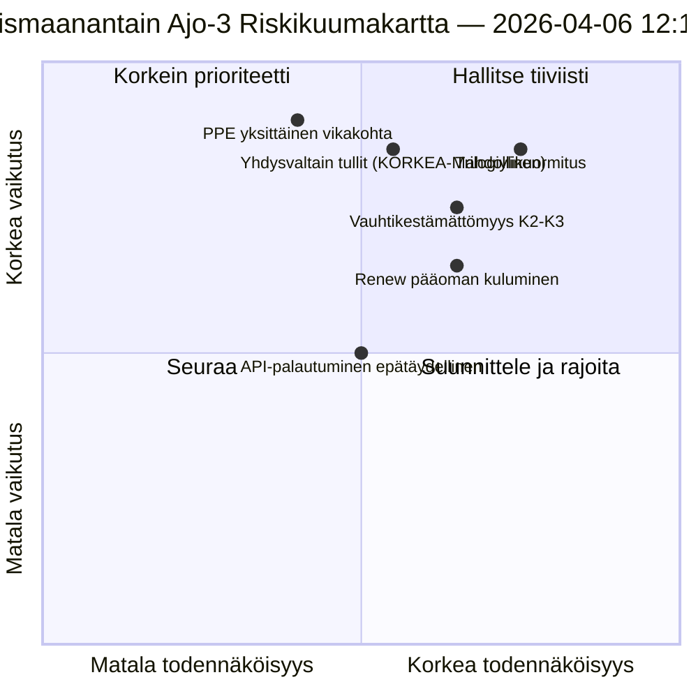

<!-- SPDX-FileCopyrightText: 2026 Hack23 AB -->
<!-- SPDX-License-Identifier: Apache-2.0 -->

# Toimeenpaneva Tiedustelubriefing — Pääsiäismaanantain Ajo 3: API-palautuminen + Konvergenssivyöhyke | 2026-04-06

**Luokitus:** OSINT — Julkinen parlamentaarinen asiakirja
**Luottamus:** 🟡 KOHTALAINEN (istuntotauko; ensimmäinen vahvistettu API-päätepistepalautuminen; trilogiylikuormitusriski KORKEA)
**Ajo:** `analysis/daily/2026-04-06/breaking-3/` (12:15 UTC)
**Kattavuus:** Pääsiäistauon päivä 11/18 keskipäivä; ensimmäinen vahvistettu adopted-texts-syötepalautuminen
**Laadittu:** 2026-05-16 (takautuva yhteenveto, ei uusia MCP-kutsuja)
**Ensisijaiset lähteet:** Adopted-texts-syöte (86 kohdetta, palautunut); 6 uutta menetelmää (consequence-trees, legislative-disruption, velocity-risk, capital-risk, voting-patterns, agent-risk).

---

## 🎯 BLUF

**Ajo 3 tuottaa päivän merkittävimmän operatiivisen löydön — *ensimmäisen vahvistetun EP API-päätepistepalautumisen* 11 päivän istuntotauon aikana: adopted-texts-syöte siirtyi Mode-B:stä (JSON-jäsennysvirheet klo 06:45 UTC) puhtaaseen onnistumiseen (86 kohdetta palautettiin klo 12:15 UTC), mikä vahvistaa Ajo-2:n "backend-uudelleenaktivoinni" -hypoteesin.** Valvontasignaalin lisäksi ajo suorittaa loppuun kuusi jäljellä olevaa analyysimenetelmää, joita ei katettu aiemmissa uutisajoissa, ja tuottaa kolme rakenteellista panosta: **(a) Seurauuspuut** kartoittavat kolme ketjuuntuvaa vaikutusketjua — lainsäädäntösprintti → toteutuskaskadi, API-palautuminen → tietoläpinäkyvyyskaskadi, PPE kaksoisrata → poliittinen pääomakaskadi — jotka supistuvat kohti huhtikuuta 14–23 **"konvergenssivyöhykkeenä"**, jossa komiteawiikko, EKP:n korkopäätös ja ensimmäiset täysistuntoäänestykset istuntotauon jälkeen tapahtuvat samanaikaisesti; **(b) Lainsäädäntövauhtiriski** dokumentoi EP10:n vuoden 2 tilaksi **2,11 säädöstä/istunto, +44 % vuositasolla, korkein sitten EP7:n eurokriisivastauksen 2012** — kestävyysongelma, joka merkitään K2–K3-kausille; **(c) Poliittinen pääomariski** tunnistaa ryhmätason pääomadynamiikan — **PPE kerääntyy, Greens/EFA laskee, Renew kuluu nopeimmin** — järjestelmän joustavuudella 6/10 ja yksittäisellä vikakohteella PPE:ssä. Ajon riskikirjaus laskee 15 riskiä (0 kriittistä, 4 korkeaa, 7 keskiluokkaa, 4 matalaa), joista trilogiylikuormitus (KORKEA, Todennäköinen) ja Yhdysvaltain tullit (KORKEA, Mahdollinen) ovat kaksi suurinta. Joustavuuspisteet 5,8/10 osoittavat mitattavaa mutta ei-kriittistä rasitusta.

---

## 🧭 3 Päätöstä, joita tämä yhteenveto tukee

| # | Päätös | Kuka päättää | Määräaika | Näyttö |
|:-:|----------|-------------|:--------:|----------|
| 1 | **Konvergenssivyöhykkeen tehostettu seuranta** — huhtikuu 14–23 tarvitsee T+0/+1/+2 -laukaisimia | EP:n tiedusteluoperaatiot; lehdistöpalvelu | ennen 12. huhtikuuta | §Seurauuspuut (konvergenssivyöhyke) |
| 2 | **Vauhtikestävyyskatsaus** — 2,11 säädöstä/istunto kestämätöntä K2:n jälkeen | Puheenjohtajien konferenssi | jatkuvasti K2 | §Vauhtirisiki (+44 % vuositasolla) |
| 3 | **Renew-pääoman kulumisen seuranta** — nopeimmin kuluva ryhmä; puolivälinstabiliteettiongelma | Renew-johto; EPP-koordinaatio | jatkuvasti | §Poliittinen pääomariski (Renew) |

---

## 📰 60 Sekunnin Luettelo

- 🔴 **Ensimmäinen vahvistettu API-päätepistepalautuminen** — adopted-texts-syöte Mode-B → onnistuminen (86 kohdetta).
- 🟠 **Konvergenssivyöhyke 14.–23. huhtikuuta** — Komiteawiikko + EKP + täysistunto yhtyvät.
- 🟢 **Vauhtianomalia: 2,11 säädöstä/istunto (+44 % vuositasolla)** — korkein sitten EP7:n eurozonevastauksen 2012.
- 🟡 **Poliittinen pääoma:** PPE kerääntyy · Greens laskee · Renew kuluu nopeimmin.
- 🔵 **Järjestelmän joustavuus 6/10** — yksittäinen vikakohta PPE:ssä.
- 🟣 **15-riskikirjaus:** 0 kriittistä · 4 korkeaa · 7 keskiluokkaa · 4 matalaa; joustavuus 5,8/10.
- 🩷 **2 suurinta riskiä:** Trilogiylikuormitus (KORKEA, Todennäköinen) · Yhdysvaltain tullit (KORKEA, Mahdollinen).
- ⚪ **Luottamus KOHTALAINEN** — ensisijainen palautumishavainto; rakenteelliset lukemat korkeat.

---

## 🌳 Kolme Ketjuuntuvaa Vaikutusketjua (Ajo-3:n erottava panos)

| Ketju | Laukaisin | Kaskadi | Konvergenssipiste |
|-------|---------|---------|-------------------|
| **Lainsäädäntösprintti → Toteutuskaskadi** | Istuntotauko-ennalta-burst 26. maaliskuuta | 42 EP10-2026-tekstiä siirtyy toteutukseen K2 | 14.–17. huhtikuuta Komiteawiikko |
| **API-palautuminen → Tietoläpinäkyvyyskaskadi** | Adopted-texts Mode-B → puhdas palautuminen | Muut päätepisteet seuraavat; täysi läpinäkyvyys palautettu | 8.–10. huhtikuuta odotettu |
| **PPE kaksoisrata → Poliittinen pääomakaskadi** | Kaksoisrata-hyväksyminen 26. maaliskuuta | Pääoman kertyminen PPE:ssä; kuluminen Renewissä | 20.–23. huhtikuuta ensimmäinen täysistunto |

**Konvergenssivyöhyke:** 14.–23. huhtikuuta — kaikki kolme ketjua laskeutuvat samaan 10 päivän ikkunaan.

---

## ⚠️ Riskihetken kuva

---

## 🔮 Tärkeimmät Tulevat Laukaisijat (seuraavat 14 päivää)

1. **8.–10. huhtikuuta — Täydellinen API-palautuminen odotettu** (55 %:n todennäköisyys Ajo-3-mallin mukaan).
2. **14. huhtikuuta — Komiteawiikko alkaa** — konvergenssivyöhyke päivä 1.
3. **17. huhtikuuta — EKP:n korkopäätös** — taloudellinen kontekstivariabeli.
4. **20.–23. huhtikuuta — ensimmäinen istuntotauon jälkeinen täysistunto** — kaksoisrata-validointi.
5. **K2:n loppu — vauhtikestävyyskatsaus** — 2,11 säädöstä/istunto-testi.

---

## 🛡️ Lähteen laadun arviointi

- **API-palautuminen (A1):** Ajo-3:n suora havainto; ensimmäinen vahvistettu päätepisteenuudelleenaktivointi.
- **Vauhti 2,11 säädöstä/istunto (A1):** ennalta lasketut tilastot; historiallinen vertailu todennettavissa.
- **Pääoman kulumisen järjestys (A2):** ryhmäpääomamenetelmä; keskiluokan luottamusjärjestys.
- **15-riskikirjaus (A2):** järjestelmällinen menetelmä; joustavuuspisteet 5,8/10 todennettavissa.
- **Nettoluottamus:** 🟢 KORKEA API-palautumisessa; 🟡 KOHTALAINEN pääoman kulumisennusteessa.

---

## 📎 Ajoartefaktit

| Kerros | Artefakti | Miksi |
|-------|----------|-----|
| Artikkeli | `article.md` | Julkinen Ajo-3-narratiivi |
| Synteesi | `synthesis-summary.md` | API-palautuminen + 6 uutta menetelmää |
| Menetelmät | consequence-trees · legislative-disruption · velocity-risk · political-capital-risk · voting-patterns · agent-risk-workflow | Kuusi uutta menetelmää (tämä ajo) |
| Seuralainen | breaking (00:33) · breaking-2 (06:45) · committee-reports (05:03) · propositions (05:47) | Pääsiäismaanantain klusteri |

---

**Asiakirjavalvonta**
- **Mallireferenssi:** `analysis/templates/executive-brief.md`
- **Artefaktipolku:** `analysis/daily/2026-04-06/breaking-3/executive-brief.md`
- **Luokitus:** Julkinen
- **Takautuva:** Yhteenveto kirjoitettu 2026-05-16 ajon arkistoiduista artefakteista; **uusia MCP-kutsuja ei tehty**.
