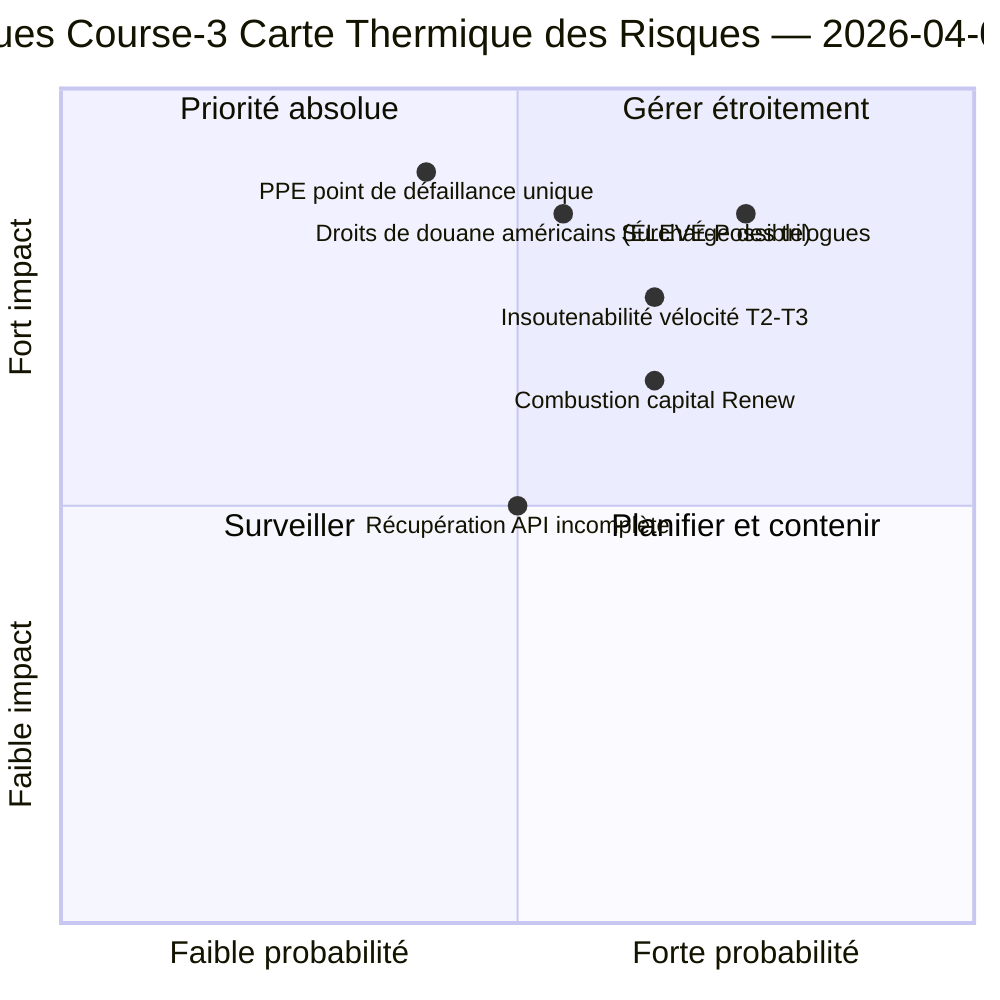

<!-- SPDX-FileCopyrightText: 2026 Hack23 AB -->
<!-- SPDX-License-Identifier: Apache-2.0 -->

# Briefing de Renseignement Exécutif — Lundi de Pâques Course 3 : Récupération API + Zone de Convergence | 2026-04-06

**Classification :** OSINT — Registre parlementaire public
**Confiance :** 🟡 MOYEN (récession ; première récupération confirmée de point de terminaison API ; risque de surcharge des trilogues ÉLEVÉ)
**Course :** `analysis/daily/2026-04-06/breaking-3/` (12:15 UTC)
**Couverture :** Jour de récession de Pâques 11/18 en milieu de journée ; première récupération confirmée du flux de textes adoptés
**Généré :** 2026-05-16 (résumé rétrospectif, aucun nouvel appel MCP)
**Sources primaires :** Flux de textes adoptés (86 éléments, récupéré) ; 6 nouvelles méthodes (arbres de conséquences, perturbation législative, risque de vélocité, risque de capital, modèles de vote, risque d'agent).

---

## 🎯 BLUF

**La Course-3 produit la découverte opérationnelle la plus importante de la journée — la *première récupération confirmée de point de terminaison EP API* pendant la récession de 11 jours : le flux de textes adoptés est passé du Mode-B (erreurs d'analyse JSON à 06:45 UTC) au succès propre (86 éléments retournés à 12:15 UTC), validant l'hypothèse de « réactivation du backend » de la Course-2.** Au-delà du signal de surveillance, la course complète les six méthodes d'analyse restantes non couvertes dans les courses précédentes et produit trois contributions structurelles : **(a) Les Arbres de Conséquences** cartographient trois chaînes d'effets en cascade — sprint législatif → cascade d'implémentation, récupération API → cascade de transparence des données, double-piste PPE → cascade de capital politique — convergeant vers le 14–23 avril comme la **« zone de convergence »** où la Semaine des Commissions, la décision de taux de la BCE et les premiers votes pléniers post-récession coïncident ; **(b) Le Risque de Vélocité Législative** documente EP10 Année 2 comme **2,11 actes/session, +44 % en glissement annuel, le plus élevé depuis la réponse à la crise de la zone euro d'EP7 en 2012** — une préoccupation de durabilité signalée pour T2–T3 ; **(c) Le Risque de Capital Politique** identifie la dynamique du capital au niveau des groupes — **PPE qui accumule, Verts/ALE en déclin, Renew qui brûle le plus vite** — avec une résilience du système 6/10 et un point de défaillance unique chez PPE. Le registre des risques de la course totalise 15 risques (0 critique, 4 élevés, 7 moyens, 4 faibles), avec la surcharge des trilogues (ÉLEVÉ, Probable) et les droits de douane américains (ÉLEVÉ, Possible) comme les deux premiers. Score de résilience 5,8/10 indique une contrainte mesurable mais non critique.

---

## 🧭 3 Décisions que ce Résumé Soutient

| # | Décision | Qui décide | Échéance | Preuve |
|:-:|----------|-------------|:--------:|----------|
| 1 | **Surveillance renforcée de la zone de convergence** — 14–23 avril nécessite des déclencheurs T+0/+1/+2 | Opérations de renseignement EP ; service de presse | avant le 12 avril | §Arbres de Conséquences (zone de convergence) |
| 2 | **Examen de la durabilité de la vélocité** — 2,11 actes/session insoutenable au-delà de T2 | Conférence des Présidents | en cours T2 | §Risque de Vélocité (+44 % en glissement annuel) |
| 3 | **Surveillance de la combustion du capital de Renew** — groupe qui brûle le plus vite ; préoccupation de stabilité à mi-mandat | Direction de Renew ; coordination PPE | en cours | §Risque de Capital Politique (Renew) |

---

## 📰 Lecture en 60 Secondes

- 🔴 **Première récupération confirmée de point de terminaison API** — flux de textes adoptés Mode-B → succès (86 éléments).
- 🟠 **Zone de convergence 14–23 avril** — Semaine des Commissions + BCE + plénière coïncident.
- 🟢 **Anomalie de vélocité : 2,11 actes/session (+44 % en glissement annuel)** — le plus élevé depuis la réponse de la zone euro d'EP7 en 2012.
- 🟡 **Capital politique :** PPE qui accumule · Verts en déclin · Renew qui brûle le plus vite.
- 🔵 **Résilience du système 6/10** — point de défaillance unique chez PPE.
- 🟣 **Registre 15 risques :** 0 critique · 4 élevés · 7 moyens · 4 faibles ; résilience 5,8/10.
- 🩷 **Top 2 risques :** Surcharge des trilogues (ÉLEVÉ, Probable) · Droits de douane américains (ÉLEVÉ, Possible).
- ⚪ **Confiance MOYEN** — observation de récupération primaire ; lectures structurelles élevées.

---

## 🌳 Trois Chaînes d'Effets en Cascade (Contribution Distinctive de la Course-3)

| Chaîne | Déclencheur | Cascade | Point de convergence |
|-------|---------|---------|-------------------|
| **Sprint législatif → Cascade d'implémentation** | Rafale pré-récession du 26 mars | 42 textes EP10-2026 entrent en implémentation T2 | 14–17 avril Semaine des Commissions |
| **Récupération API → Cascade de transparence des données** | Textes adoptés Mode-B → récupération propre | Les autres points de terminaison suivent ; pleine transparence rétablie | 8–10 avril prévu |
| **Double-piste PPE → Cascade de capital politique** | Adoption double-piste 26 mars | Accumulation de capital chez PPE ; combustion chez Renew | 20–23 avril première plénière |

**Zone de convergence :** 14–23 avril — les trois chaînes atterrissent dans la même fenêtre de 10 jours.

---

## ⚠️ Instantané des Risques

---

## 🔮 Principaux Déclencheurs Futurs (14 prochains jours)

1. **8–10 avril — Récupération complète de l'API prévue** (55 % de probabilité selon le modèle Course-3).
2. **14 avril — Ouverture de la Semaine des Commissions** — Zone de convergence Jour 1.
3. **17 avril — Décision de taux de la BCE** — variable de contexte économique.
4. **20–23 avril — première plénière post-récession** — validation double-piste.
5. **Fin-T2 — examen de durabilité de la vélocité** — test 2,11 actes/session.

---

## 🛡️ Évaluation de la Qualité des Sources

- **Récupération API (A1) :** Observation directe de la Course-3 ; première réactivation confirmée de point de terminaison.
- **Vélocité 2,11 actes/session (A1) :** statistiques précalculées ; comparaison historique vérifiable.
- **Classement de combustion du capital (A2) :** méthodologie du capital au niveau des groupes ; classement de confiance moyenne.
- **Registre 15 risques (A2) :** méthodologie systématique ; score de résilience 5,8/10 vérifiable.
- **Confiance nette :** 🟢 ÉLEVÉE sur récupération API ; 🟡 MOYEN sur prévision de combustion du capital.

---

## 📎 Artéfacts de la Course

| Couche | Artéfact | Pourquoi |
|-------|----------|-----|
| Article | `article.md` | Récit public Course-3 |
| Synthèse | `synthesis-summary.md` | Récupération API + 6 nouvelles méthodes |
| Méthodes | arbres de conséquences · perturbation législative · risque de vélocité · risque de capital politique · modèles de vote · flux de risque d'agent | Six nouvelles méthodes (cette course) |
| Accompagnement | breaking (00:33) · breaking-2 (06:45) · rapports de comité (05:03) · propositions (05:47) | Cluster du Lundi de Pâques |

---

**Contrôle du Document**
- **Référence de modèle :** `analysis/templates/executive-brief.md`
- **Chemin de l'artéfact :** `analysis/daily/2026-04-06/breaking-3/executive-brief.md`
- **Classification :** Public
- **Rétrospectif :** Résumé rédigé le 2026-05-16 à partir des artéfacts archivés de la course ; **aucun nouvel appel MCP n'a été effectué**.
