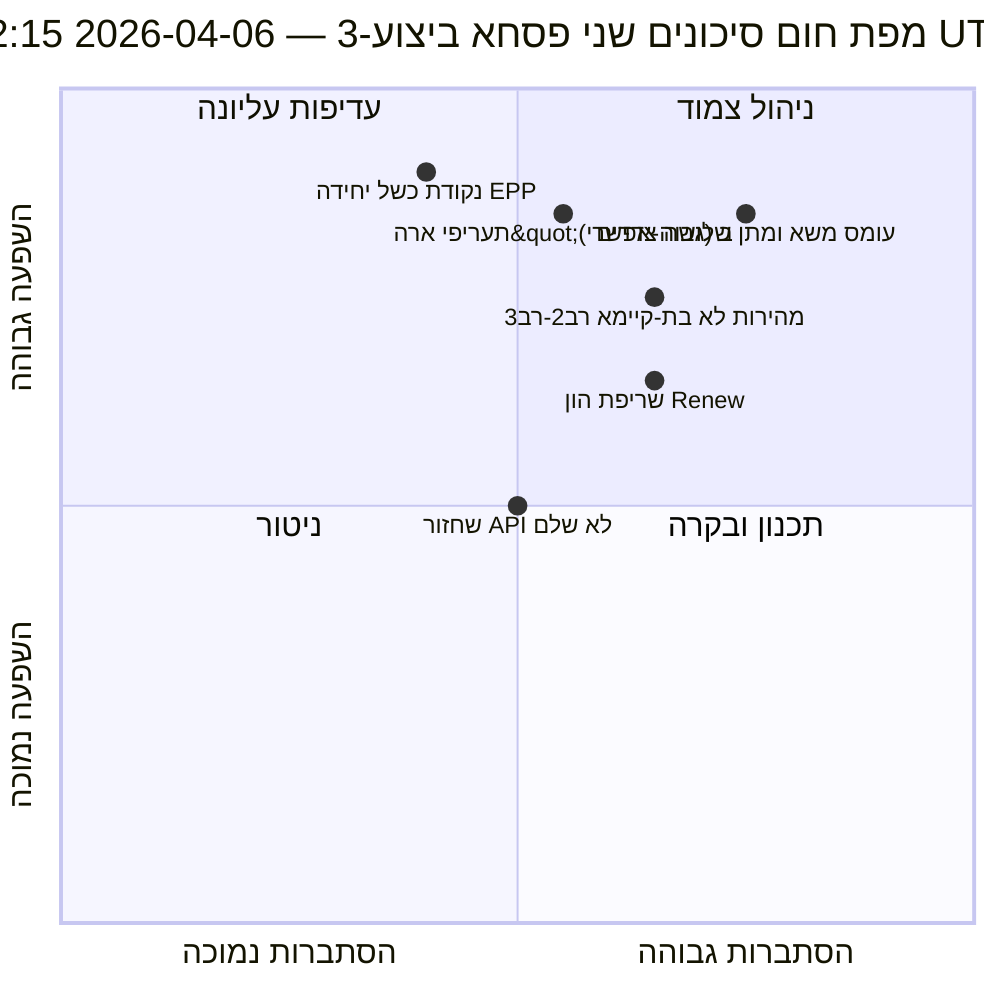

<!-- SPDX-FileCopyrightText: 2026 Hack23 AB -->
<!-- SPDX-License-Identifier: Apache-2.0 -->

# סיכום מודיעין מנהלים — ביצוע שני של חג הפסחא 3: שחזור API + אזור התכנסות | 2026-04-06

**סיווג:** OSINT — רשומות פרלמנטריות ציבוריות
**רמת ביטחון:** 🟡 בינונית (הפסקה; שחזור ראשון מאושר של נקודת קצה API; סיכון עומס משא ומתן שלושה צדדים גבוה)
**ביצוע:** `analysis/daily/2026-04-06/breaking-3/` (12:15 UTC)
**כיסוי:** יום הפסקה פסחאית 11/18 צהריים; שחזור ראשון מאושר של עדכון טקסטים שאומצו
**נוצר:** 2026-05-16 (סיכום רטרוספקטיבי, ללא קריאות MCP חדשות)
**מקורות עיקריים:** עדכון טקסטים שאומצו (86 פריטים, שוחזר); 6 שיטות חדשות (עצי תוצאות, שיבוש חקיקתי, סיכון מהירות, סיכון הון, דפוסי הצבעה, סיכון סוכן).

---

## 🎯 סיכום מיידי

**ביצוע-3 מייצר את הממצא התפעולי המשמעותי ביותר של היום — *שחזור ראשון מאושר של נקודת קצה API בפרלמנט האירופי* במהלך 11 ימי ההפסקה: עדכון הטקסטים שאומצו עבר ממצב-ב (שגיאות ניתוח JSON ב-06:45 UTC) להצלחה נקייה (86 פריטים הוחזרו ב-12:15 UTC), ומאשש את השערת "הפעלה מחדש של הצד השרת" מביצוע-2.** מעבר לאות הניטור, ביצוע זה משלים את שש שיטות הניתוח הנותרות שלא נוכסו בביצועים קודמים ומספק שלוש תרומות מבניות: **(א) עצי תוצאות** ממפים שלוש שרשרות השפעה מדורגות — ריצת חקיקה ← מפל יישום, שחזור API ← מפל שקיפות נתונים, מסלול כפול של EPP ← מפל הון פוליטי — המתכנסות ל-14–23 באפריל כ**"אזור ההתכנסות"** בו שבוע הוועדות, החלטת הריבית של ה-ECB והצבעות המליאה הראשונות לאחר ההפסקה מתחברות; **(ב) סיכון מהירות חקיקתית** מתעד את EP10 שנה 2 כ**2.11 מעשים/ישיבה, +44% שנה מול שנה, הגבוה ביותר מאז תגובת EP7 למשבר גוש האירו ב-2012** — דאגת קיימות שמסומנת לרביעון 2–3; **(ג) סיכון הון פוליטי** מזהה דינמיקת הון ברמת הסיעה — **EPP צובר, Greens/EFA יורדים, Renew שורף מהר יותר** — עם חוסן מערכת 6/10 ונקודת כשל יחידה ב-EPP. רשימת הסיכונים של הביצוע מונה 15 סיכונים (0 קריטי, 4 גבוה, 7 בינוני, 4 נמוך), כאשר עומס משא ומתן שלושה צדדים (גבוה, סביר) ותעריפי ארה"ב (גבוה, אפשרי) ראשונים. ציון חוסן 5.8/10 מעיד על מתח ניכר אך לא קריטי.

---

## 🧭 3 החלטות שסיכום זה תומך בהן

| # | החלטה | מקבל ההחלטה | מועד אחרון | עדות |
|:-:|-------|------------|:-----------:|------|
| 1 | **ניטור מוגבר של אזור ההתכנסות** — 14–23 באפריל דורש מפעילי T+0/+1/+2 | מבצעי מודיעין EP; שירות עיתונות | לפני 12 באפריל | §עצי תוצאות (אזור ההתכנסות) |
| 2 | **סקירת קיימות מהירות** — 2.11 מעשים/ישיבה לא בר-קיימא מעבר לרביעון 2 | ועידת הנשיאים | שוטף רביעון 2 | §סיכון מהירות (+44% שנה מול שנה) |
| 3 | **ניטור שריפת הון Renew** — הסיעה השורפת הכי מהר; דאגת יציבות אמצע הכהונה | הנהגת Renew; תיאום EPP | שוטף | §סיכון הון פוליטי (Renew) |

---

## 📰 קריאה ב-60 שניות

- 🔴 **שחזור ראשון מאושר של נקודת קצה API** — עדכון טקסטים שאומצו: מצב-ב ← הצלחה (86 פריטים).
- 🟠 **אזור ההתכנסות 14–23 באפריל** — שבוע ועדות + ECB + מליאה מתחברים.
- 🟢 **אנומליית מהירות: 2.11 מעשים/ישיבה (+44% שנה מול שנה)** — הגבוה ביותר מאז תגובת EP7 לגוש האירו 2012.
- 🟡 **הון פוליטי:** EPP צובר · Greens יורדים · Renew שורף מהר יותר.
- 🔵 **חוסן מערכת 6/10** — נקודת כשל יחידה ב-EPP.
- 🟣 **רשימת 15 סיכונים:** 0 קריטי · 4 גבוה · 7 בינוני · 4 נמוך; חוסן 5.8/10.
- 🩷 **2 הסיכונים הגבוהים:** עומס משא ומתן שלושה צדדים (גבוה, סביר) · תעריפי ארה"ב (גבוה, אפשרי).
- ⚪ **ביטחון: בינוני** — תצפית שחזור ראשונית; קריאות מבניות גבוהות.

---

## 🌳 שלוש שרשרות השפעה מדורגות (תרומה ייחודית לביצוע-3)

| שרשרת | מפעיל | מפל | נקודת התכנסות |
|--------|-------|------|--------------|
| **ריצת חקיקה ← מפל יישום** | פרץ לפני ההפסקה ב-26 במרץ | 42 טקסטים EP10-2026 נכנסים ליישום רביעון 2 | 14–17 באפריל שבוע ועדות |
| **שחזור API ← מפל שקיפות נתונים** | טקסטים שאומצו: מצב-ב ← שחזור נקי | נקודות קצה אחרות עוקבות; שקיפות מלאה משוחזרת | 8–10 באפריל צפוי |
| **מסלול כפול EPP ← מפל הון פוליטי** | אימוץ מסלול כפול 26 במרץ | צבירת הון ב-EPP; שריפה ב-Renew | 20–23 באפריל מליאה ראשונה |

**אזור ההתכנסות:** 14–23 באפריל — שלוש השרשרות מגיעות לאותה חלון 10 ימים.

---

## ⚠️ סקירת סיכונים מהירה

---

## 🔮 מפעילי עתיד עיקריים (14 ימים הקרובים)

1. **8–10 באפריל — שחזור API מלא צפוי** (55% הסתברות לפי מודל ביצוע-3).
2. **14 באפריל — פתיחת שבוע ועדות** — אזור התכנסות יום 1.
3. **17 באפריל — החלטת ריבית ECB** — משתנה הקשר כלכלי.
4. **20–23 באפריל — מליאה ראשונה לאחר ההפסקה** — אימות מסלול כפול.
5. **סוף רביעון 2 — סקירת קיימות מהירות** — מבחן 2.11 מעשים/ישיבה.

---

## 🛡️ הערכת איכות מקורות

- **שחזור API (A1):** תצפית ישירה ביצוע-3; הפעלה מחדש ראשונה מאושרת של נקודת קצה.
- **מהירות 2.11 מעשים/ישיבה (A1):** סטטיסטיקות מחושבות מראש; השוואה היסטורית ניתנת לאימות.
- **דירוג שריפת הון (A2):** מתודולוגיית הון ברמת סיעה; סדר ביטחון בינוני.
- **רשימת 15 סיכונים (A2):** מתודולוגיה שיטתית; ציון חוסן 5.8/10 ניתן לאימות.
- **ביטחון כולל:** 🟢 גבוה לשחזור API; 🟡 בינוני לתחזיות שריפת הון.

---

## 📎 מוצרי הביצוע

| שכבה | מוצר | סיבה |
|------|------|------|
| מאמר | `article.md` | נרטיב ציבורי ביצוע-3 |
| סינתזה | `synthesis-summary.md` | שחזור API + 6 שיטות חדשות |
| שיטות | עצי תוצאות · שיבוש חקיקתי · סיכון מהירות · סיכון הון פוליטי · דפוסי הצבעה · זרימת סיכון סוכן | שש שיטות חדשות (ביצוע זה) |
| מלווה | breaking (00:33) · breaking-2 (06:45) · דוחות ועדות (05:03) · הצעות (05:47) | אשכול שני פסחא |

---

**בקרת מסמך**
- **הפניית תבנית:** `analysis/templates/executive-brief.md`
- **נתיב מוצר:** `analysis/daily/2026-04-06/breaking-3/executive-brief.md`
- **סיווג:** ציבורי
- **רטרוספקטיבי:** סיכום נכתב ב-2026-05-16 ממוצרי ביצוע מאורכבים; **לא בוצעו קריאות MCP חדשות**.
