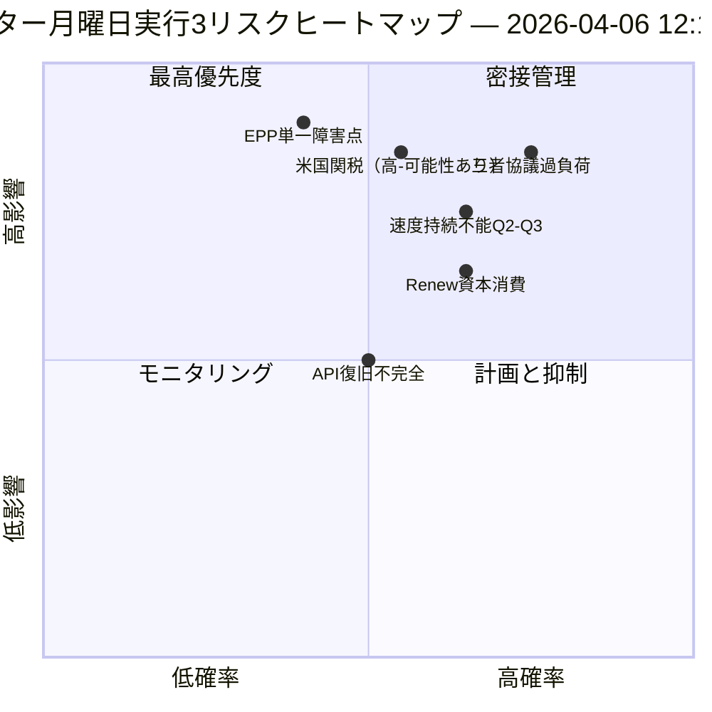

<!-- SPDX-FileCopyrightText: 2026 Hack23 AB -->
<!-- SPDX-License-Identifier: Apache-2.0 -->

# エグゼクティブ・インテリジェンス・ブリーフ — イースター月曜日 実行3：API復旧 + 収束ゾーン | 2026-04-06

**分類：** OSINT — 公開議会記録
**信頼度：** 🟡 中程度（休会中；APIエンドポイントの初回確認済み復旧；三者協議過負荷リスク 高）
**実行：** `analysis/daily/2026-04-06/breaking-3/`（12:15 UTC）
**対象範囲：** イースター休会日 11/18 正午；採択文書フィード初回確認済み復旧
**生成日：** 2026-05-16（回顧的サマリー、新規MCPコールなし）
**主要情報源：** 採択文書フィード（86件、復旧済み）；6つの新手法（結果ツリー、立法中断、速度リスク、資本リスク、投票パターン、エージェントリスク）。

---

## 🎯 BLUF（結論先出し）

**実行3は本日最も重要な運用上の発見をもたらします。11日間の休会期間における*欧州議会APIエンドポイントの初回確認済み復旧*です。採択文書フィードがモードB（06:45 UTC時点でのJSON解析エラー）からクリーンな成功（12:15 UTC時点で86件を返却）に移行し、実行2の「バックエンド再起動」仮説を裏付けました。** 監視シグナルに加え、この実行では以前の実行でカバーされなかった残り6つの分析手法を完了させ、3つの構造的貢献をもたらします：**(a) 結果ツリー**は3つの連鎖効果チェーンをマッピングします——立法スプリント → 実装カスケード、API復旧 → データ透明性カスケード、EPP二重トラック → 政治資本カスケード——これらが4月14〜23日に収束し、委員会週、ECB金利決定、休会後の最初の本会議票決が重なる**「収束ゾーン」**を形成します；**(b) 立法速度リスク**はEP10第2年を**2.11法律/会議、前年比+44%、EP7ユーロ圏危機対応（2012年）以来最高**として記録し、第2〜3四半期の持続可能性懸念として注記されます；**(c) 政治資本リスク**はグループレベルの資本動態を特定します——**EPP蓄積中、Greens/EFA減少中、Renewが最速で消費中**——システム耐久性6/10、EPPに単一障害点あり。実行のリスク登録は15件（重大0件、高4件、中7件、低4件）を数え、三者協議過負荷（高、蓋然的）と米国関税（高、可能性あり）がトップ2となっています。耐久性スコア5.8/10は測定可能だが重大ではない緊張を示します。

---

## 🧭 このブリーフが支援する3つの意思決定

| # | 意思決定 | 決定者 | 期限 | 根拠 |
|:-:|---------|--------|:----:|------|
| 1 | **収束ゾーンの強化監視** — 4月14〜23日にはT+0/+1/+2トリガーが必要 | EP情報オペレーション；プレスサービス | 4月12日前 | §結果ツリー（収束ゾーン） |
| 2 | **速度持続可能性レビュー** — 2.11法律/会議は第2四半期超では維持不能 | 議長会議 | 第2四半期継続中 | §速度リスク（前年比+44%） |
| 3 | **Renew資本消費モニタリング** — 最速消費グループ；任期中盤安定懸念 | Renewリーダーシップ；EPP調整 | 継続中 | §政治資本リスク（Renew） |

---

## 📰 60秒リーディング

- 🔴 **APIエンドポイント初回確認済み復旧** — 採択文書フィード：モードB → 成功（86件）。
- 🟠 **収束ゾーン4月14〜23日** — 委員会週 + ECB + 本会議が重なる。
- 🟢 **速度異常：2.11法律/会議（前年比+44%）** — EP7ユーロ圏対応（2012年）以来最高。
- 🟡 **政治資本：** EPP蓄積中 · Greens減少中 · Renewが最速で消費中。
- 🔵 **システム耐久性6/10** — EPPに単一障害点あり。
- 🟣 **15件のリスク登録：** 重大0 · 高4 · 中7 · 低4；耐久性5.8/10。
- 🩷 **上位2リスク：** 三者協議過負荷（高、蓋然的）· 米国関税（高、可能性あり）。
- ⚪ **信頼度：中程度** — 主要復旧観測；構造的読み取りは高。

---

## 🌳 3つの連鎖効果チェーン（実行3の特徴的貢献）

| チェーン | トリガー | カスケード | 収束点 |
|---------|---------|-----------|--------|
| **立法スプリント → 実装カスケード** | 3月26日の休会前バースト | EP10-2026の42文書が第2四半期実装に入る | 4月14〜17日 委員会週 |
| **API復旧 → データ透明性カスケード** | 採択文書：モードB → クリーン復旧 | 他のエンドポイントも追随；完全透明性が回復 | 4月8〜10日予定 |
| **EPP二重トラック → 政治資本カスケード** | 3月26日の二重トラック採択 | EPPで資本蓄積；Renewで消費 | 4月20〜23日 第1回本会議 |

**収束ゾーン：** 4月14〜23日 — 3つのチェーンが同じ10日間の窓に着地。

---

## ⚠️ リスクスナップショット

---

## 🔮 主要な将来のトリガー（今後14日間）

1. **4月8〜10日 — 完全API復旧見込み**（実行3モデルで55%確率）。
2. **4月14日 — 委員会週開幕** — 収束ゾーン第1日。
3. **4月17日 — ECB金利決定** — 経済コンテキスト変数。
4. **4月20〜23日 — 休会後第1回本会議** — 二重トラック検証。
5. **第2四半期末 — 速度持続可能性レビュー** — 2.11法律/会議テスト。

---

## 🛡️ 情報源品質評価

- **API復旧（A1）：** 実行3での直接観測；エンドポイント初回確認済み再起動。
- **速度2.11法律/会議（A1）：** 事前計算済み統計；歴史的比較は検証可能。
- **資本消費ランキング（A2）：** グループレベル資本手法；中程度信頼度の順序付け。
- **15件のリスク登録（A2）：** 体系的手法；耐久性スコア5.8/10は検証可能。
- **総合信頼度：** 🟢 API復旧は高；🟡 資本消費予測は中程度。

---

## 📎 実行アーティファクト

| レイヤー | アーティファクト | 理由 |
|---------|--------------|------|
| 記事 | `article.md` | 実行3公開ナラティブ |
| 総合 | `synthesis-summary.md` | API復旧 + 6つの新手法 |
| 手法 | 結果ツリー · 立法中断 · 速度リスク · 政治資本リスク · 投票パターン · エージェントリスクフロー | 6つの新手法（この実行） |
| 並走 | breaking (00:33) · breaking-2 (06:45) · 委員会報告書 (05:03) · 提案 (05:47) | イースター月曜日クラスター |

---

**文書管理**
- **テンプレート参照：** `analysis/templates/executive-brief.md`
- **アーティファクトパス：** `analysis/daily/2026-04-06/breaking-3/executive-brief.md`
- **分類：** 公開
- **回顧的：** サマリーはアーカイブ済みの実行アーティファクトから2026-05-16に作成；**新規MCPコールは実行されていません**。
