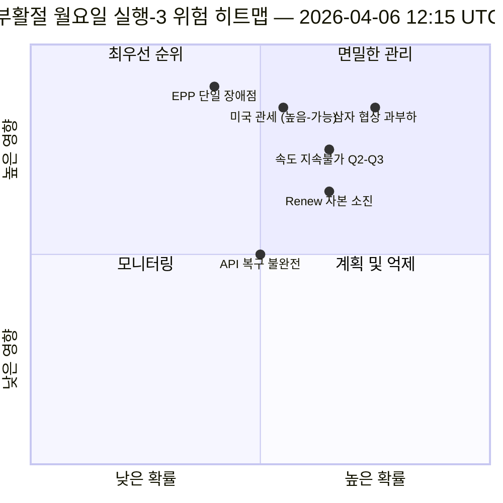

<!-- SPDX-FileCopyrightText: 2026 Hack23 AB -->
<!-- SPDX-License-Identifier: Apache-2.0 -->

# 임원 정보 브리핑 — 부활절 월요일 실행 3: API 복구 + 수렴 구역 | 2026-04-06

**분류:** OSINT — 공개 의회 기록
**신뢰도:** 🟡 중간 (휴회 중; 첫 번째 확인된 API 엔드포인트 복구; 삼자 협상 과부하 위험 높음)
**실행:** `analysis/daily/2026-04-06/breaking-3/` (12:15 UTC)
**범위:** 부활절 휴회일 11/18 정오; 채택 텍스트 피드 최초 확인 복구
**생성일:** 2026-05-16 (소급 요약, 새 MCP 호출 없음)
**주요 출처:** 채택 텍스트 피드 (86건, 복구됨); 6가지 신규 방법론 (결과 트리, 입법 중단, 속도 위험, 자본 위험, 투표 패턴, 에이전트 위험).

---

## 🎯 핵심 요약 (BLUF)

**실행-3은 당일의 가장 중요한 운영상 발견을 도출합니다 — 11일간 휴회 기간 중 *유럽의회 API 엔드포인트의 최초 확인된 복구*: 채택 텍스트 피드가 모드-B(06:45 UTC 기준 JSON 파싱 오류)에서 성공적인 응답(12:15 UTC 기준 86건 반환)으로 전환되어, 실행-2의 "백엔드 재활성화" 가설을 검증했습니다.** 모니터링 신호 외에도 이번 실행은 이전 실행에서 다루지 못한 나머지 6가지 분석 방법론을 완료하고 세 가지 구조적 기여를 제공합니다: **(가) 결과 트리**는 세 개의 연쇄 효과 체인을 매핑합니다 — 입법 스프린트 → 실행 캐스케이드, API 복구 → 데이터 투명성 캐스케이드, EPP 이중 트랙 → 정치 자본 캐스케이드 — 이것들이 4월 14~23일을 향해 수렴하며 위원회 주간, ECB 금리 결정, 휴회 후 첫 본회의 투표가 겹치는 **"수렴 구역"**을 형성합니다; **(나) 입법 속도 위험**은 EP10 2년차를 **회기당 2.11건, 전년 대비 +44%, 2012년 EP7 유로존 위기 대응 이후 최고치**로 기록하며 2~3분기의 지속가능성 우려로 표시됩니다; **(다) 정치 자본 위험**은 그룹 수준의 자본 역학을 식별합니다 — **EPP 축적 중, Greens/EFA 하락 중, Renew가 가장 빠르게 소진 중** — 시스템 회복력 6/10, EPP에 단일 장애점 존재. 실행 위험 등록부는 15건(치명적 0건, 높음 4건, 중간 7건, 낮음 4건)을 기록하며, 삼자 협상 과부하(높음, 개연적)와 미국 관세(높음, 가능)가 상위 2위를 차지합니다. 회복력 점수 5.8/10은 측정 가능하지만 치명적이지 않은 긴장을 나타냅니다.

---

## 🧭 이 브리핑이 지원하는 의사결정 3가지

| # | 의사결정 | 결정권자 | 기한 | 근거 |
|:-:|---------|---------|:----:|------|
| 1 | **수렴 구역 모니터링 강화** — 4월 14~23일에는 T+0/+1/+2 트리거 필요 | EP 정보 운영부; 언론 서비스 | 4월 12일 이전 | §결과 트리 (수렴 구역) |
| 2 | **속도 지속가능성 검토** — 2.11건/회기는 2분기 이후 유지 불가 | 의장단 회의 | 2분기 지속 | §속도 위험 (전년 대비 +44%) |
| 3 | **Renew 자본 소진 모니터링** — 가장 빠른 소진 그룹; 임기 중반 안정성 우려 | Renew 지도부; EPP 조정 | 지속 | §정치 자본 위험 (Renew) |

---

## 📰 60초 브리핑

- 🔴 **API 엔드포인트 최초 확인 복구** — 채택 텍스트 피드: 모드-B → 성공 (86건).
- 🟠 **수렴 구역 4월 14~23일** — 위원회 주간 + ECB + 본회의 겹침.
- 🟢 **속도 이상: 2.11건/회기 (전년 대비 +44%)** — EP7 유로존 대응 (2012년) 이후 최고.
- 🟡 **정치 자본:** EPP 축적 중 · Greens 하락 중 · Renew 가장 빠른 소진.
- 🔵 **시스템 회복력 6/10** — EPP에 단일 장애점.
- 🟣 **위험 등록부 15건:** 치명적 0 · 높음 4 · 중간 7 · 낮음 4; 회복력 5.8/10.
- 🩷 **상위 2위험:** 삼자 협상 과부하 (높음, 개연적) · 미국 관세 (높음, 가능).
- ⚪ **신뢰도: 중간** — 주요 복구 관찰; 구조적 판독값 높음.

---

## 🌳 세 개의 연쇄 효과 체인 (실행-3의 특징적 기여)

| 체인 | 트리거 | 캐스케이드 | 수렴 지점 |
|------|--------|----------|---------|
| **입법 스프린트 → 실행 캐스케이드** | 3월 26일 휴회 전 집중 처리 | EP10-2026의 42개 텍스트가 2분기 실행 단계 진입 | 4월 14~17일 위원회 주간 |
| **API 복구 → 데이터 투명성 캐스케이드** | 채택 텍스트: 모드-B → 성공 복구 | 다른 엔드포인트 후속; 완전 투명성 회복 | 4월 8~10일 예정 |
| **EPP 이중 트랙 → 정치 자본 캐스케이드** | 3월 26일 이중 트랙 채택 | EPP에서 자본 축적; Renew에서 소진 | 4월 20~23일 첫 본회의 |

**수렴 구역:** 4월 14~23일 — 세 체인이 동일한 10일 창에 수렴.

---

## ⚠️ 위험 스냅샷

---

## 🔮 주요 미래 트리거 (향후 14일)

1. **4월 8~10일 — 완전 API 복구 예상** (실행-3 모델 기준 55% 확률).
2. **4월 14일 — 위원회 주간 개막** — 수렴 구역 1일차.
3. **4월 17일 — ECB 금리 결정** — 경제적 맥락 변수.
4. **4월 20~23일 — 휴회 후 첫 번째 본회의** — 이중 트랙 검증.
5. **2분기 말 — 속도 지속가능성 검토** — 2.11건/회기 테스트.

---

## 🛡️ 정보 출처 품질 평가

- **API 복구 (A1):** 실행-3 직접 관찰; 최초 확인된 엔드포인트 재활성화.
- **속도 2.11건/회기 (A1):** 사전 계산된 통계; 역사적 비교 검증 가능.
- **자본 소진 순위 (A2):** 그룹 수준 자본 방법론; 중간 신뢰도 정렬.
- **15건 위험 등록부 (A2):** 체계적 방법론; 회복력 점수 5.8/10 검증 가능.
- **순 신뢰도:** 🟢 API 복구에 높음; 🟡 자본 소진 예측에 중간.

---

## 📎 실행 아티팩트

| 레이어 | 아티팩트 | 이유 |
|--------|---------|------|
| 기사 | `article.md` | 실행-3 공개 내러티브 |
| 종합 | `synthesis-summary.md` | API 복구 + 6개 신규 방법론 |
| 방법론 | 결과 트리 · 입법 중단 · 속도 위험 · 정치 자본 위험 · 투표 패턴 · 에이전트 위험 흐름 | 6개 신규 방법론 (이번 실행) |
| 동반 | breaking (00:33) · breaking-2 (06:45) · 위원회 보고서 (05:03) · 제안 (05:47) | 부활절 월요일 클러스터 |

---

**문서 관리**
- **템플릿 참조:** `analysis/templates/executive-brief.md`
- **아티팩트 경로:** `analysis/daily/2026-04-06/breaking-3/executive-brief.md`
- **분류:** 공개
- **소급:** 보관된 실행 아티팩트에서 2026-05-16에 작성된 요약; **새 MCP 호출은 수행되지 않았습니다**.
