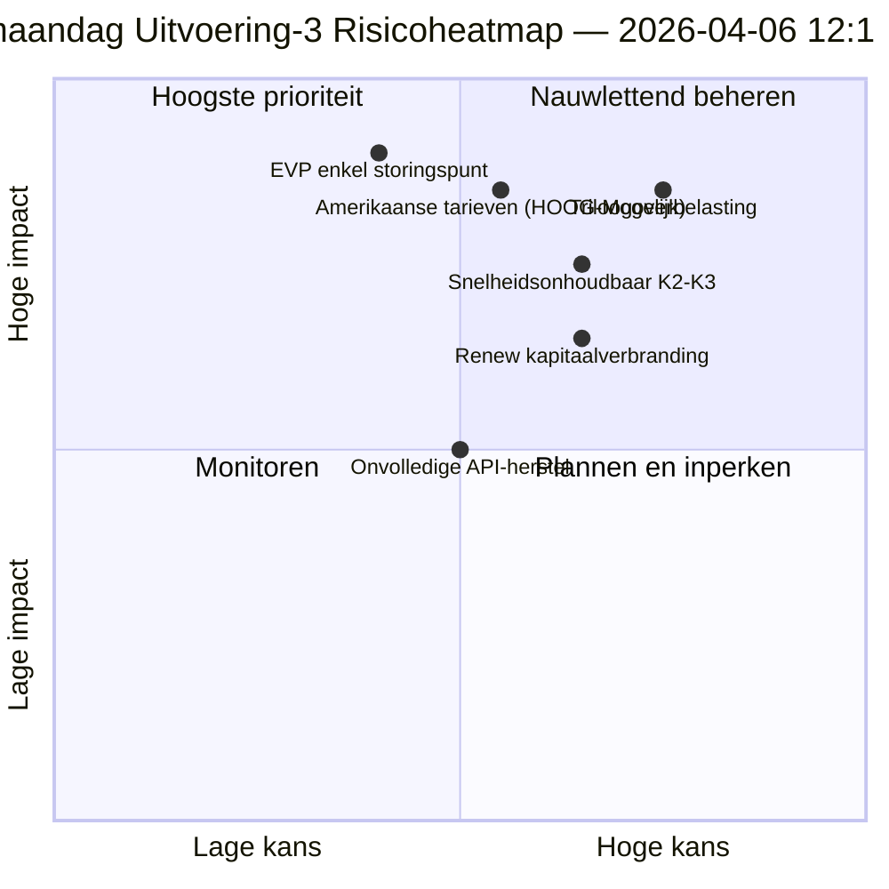

<!-- SPDX-FileCopyrightText: 2026 Hack23 AB -->
<!-- SPDX-License-Identifier: Apache-2.0 -->

# Uitvoerende Inlichtingenbrief — Paasmaandag Uitvoering 3: API-herstel + Convergentiezone | 2026-04-06

**Classificatie:** OSINT — Openbaar parlementair register
**Vertrouwen:** 🟡 GEMIDDELD (reces; eerste bevestigde API-eindpuntherstel; risico triloogoverbelasting HOOG)
**Uitvoering:** `analysis/daily/2026-04-06/breaking-3/` (12:15 UTC)
**Dekking:** Paasrecesdag 11/18 middag; eerste bevestigde herstel aangenomen-teksten-feed
**Gegenereerd:** 2026-05-16 (retrospectief overzicht, geen nieuwe MCP-aanroepen)
**Primaire bronnen:** Aangenomen-teksten-feed (86 items, hersteld); 6 nieuwe methoden (consequentiebomen, wetgevingsonderbreking, snelheidsrisico, kapitaalrisico, stempatronen, agentrisico).

---

## 🎯 BLUF

**Uitvoering-3 produceert de meest consequente operationele bevinding van de dag — de *eerste bevestigde API-eindpuntherstel van het EP* gedurende de 11 reces­dagen: de aangenomen-teksten-feed ging van Modus-B (JSON-analysefouten om 06:45 UTC) naar schone succes (86 items geretourneerd om 12:15 UTC), waarmee de "backend-reactivering"-hypothese van Uitvoering-2 werd bevestigd.** Naast het monitoringsignaal voltooit de uitvoering de zes resterende analysemethoden die niet gedekt zijn in eerdere uitvoeringen en produceert drie structurele bijdragen: **(a) Consequentiebomen** brengen drie cascaderende effectketens in kaart — wetgevende sprint → implementatiecascade, API-herstel → datatransparantiecascade, EVP dubbel spoor → politiek-kapitaalcascade — die convergeren naar 14–23 april als de **"convergentiezone"** waar de Commissieweek, de ECB-rentebeslissing en de eerste post-reces plenaire stemmen samenvallen; **(b) Wetgevingssnelheidsrisico** documenteert EP10 Jaar 2 als **2,11 handelingen/sessie, +44% jaar-op-jaar, het hoogste sedert de eurozone-crisisrespons van EP7 in 2012** — een duurzaamheidszorg aangestipt voor K2–K3; **(c) Politiek Kapitaalrisico** identificeert groepsniveau kapitaaldynamiek — **EVP opbouwend, Groenen/VEA dalend, Vernieuw sneller verbrandend** — met systeemveerkracht 6/10 en één enkel storingspunt bij EVP. Het risicoregister van de uitvoering telt 15 risico's (0 kritiek, 4 hoog, 7 gemiddeld, 4 laag), waarbij triloogoverbelasting (HOOG, Waarschijnlijk) en Amerikaanse tarieven (HOOG, Mogelijk) de top twee zijn. Veerkrachtscore 5,8/10 wijst op meetbare maar niet kritieke spanning.

---

## 🧭 3 Beslissingen die dit Overzicht Ondersteunt

| # | Beslissing | Beslisser | Deadline | Bewijs |
|:-:|------------|-----------|:--------:|--------|
| 1 | **Verhoogde convergentiezone-monitoring** — 14–23 april heeft T+0/+1/+2 triggers nodig | EP inlichtingenoperaties; persdienst | vóór 12 april | §Consequentiebomen (convergentiezone) |
| 2 | **Snelheidsduurzaamheidsreview** — 2,11 handelingen/sessie onhoudbaar voorbij K2 | Conferentie van Voorzitters | doorlopend K2 | §Snelheidsrisico (+44% j-o-j) |
| 3 | **Monitoring Renew-kapitaalverbranding** — snelst verbrandende groep; halverwege-mandaat stabiliteitszorg | Renew-leiderschap; EVP-coördinatie | doorlopend | §Politiek Kapitaalrisico (Renew) |

---

## 📰 60-Seconden Lezing

- 🔴 **Eerste bevestigde API-eindpuntherstel** — aangenomen-teksten-feed Modus-B → succes (86 items).
- 🟠 **Convergentiezone 14–23 april** — Commissieweek + ECB + plenaire vergadering vallen samen.
- 🟢 **Snelheidsanomalie: 2,11 handelingen/sessie (+44% j-o-j)** — hoogste sedert EP7-eurozone-respons 2012.
- 🟡 **Politiek kapitaal:** EVP opbouwend · Groenen dalend · Renew sneller verbrandend.
- 🔵 **Systeemveerkracht 6/10** — één enkel storingspunt bij EVP.
- 🟣 **Register van 15 risico's:** 0 kritiek · 4 hoog · 7 gemiddeld · 4 laag; veerkracht 5,8/10.
- 🩷 **Top 2 risico's:** Triloogoverbelasting (HOOG, Waarschijnlijk) · Amerikaanse tarieven (HOOG, Mogelijk).
- ⚪ **Vertrouwen GEMIDDELD** — primaire herstelwaarneming; structurele lezingen hoog.

---

## 🌳 Drie Cascaderende Effectketens (Kenmerkende Bijdrage Uitvoering-3)

| Keten | Trigger | Cascade | Convergentiepunt |
|-------|---------|---------|-----------------|
| **Wetgevende sprint → Implementatiecascade** | Pre-reces uitbarsting 26 maart | 42 EP10-2026 teksten gaan K2-implementatie in | 14–17 april Commissieweek |
| **API-herstel → Datatransparantiecascade** | Aangenomen-teksten Modus-B → schone herstel | Andere eindpunten volgen; volledige transparantie hersteld | 8–10 april verwacht |
| **EVP dubbel spoor → Politiek-kapitaalcascade** | Dubbel spoor-aanneming 26 maart | Kapitaalopbouw in EVP; verbranding in Renew | 20–23 april eerste plenaire |

**Convergentiezone:** 14–23 april — alle drie ketens landen in hetzelfde 10-daagse venster.

---

## ⚠️ Risico-Snapshot

---

## 🔮 Top Toekomstige Triggers (komende 14 dagen)

1. **8–10 april — Volledig API-herstel verwacht** (55% kans per Uitvoering-3-model).
2. **14 april — Opening Commissieweek** — Convergentiezone Dag 1.
3. **17 april — ECB-rentebeslissing** — economische contextsvariabele.
4. **20–23 april — eerste plenaire post-reces** — dubbel spoor-validatie.
5. **Eind-K2 — snelheidsduurzaamheidsreview** — 2,11 handelingen/sessie-test.

---

## 🛡️ Bronnenkwaliteitsbeoordeling

- **API-herstel (A1):** Directe observatie Uitvoering-3; eerste bevestigde eindpuntreactivering.
- **Snelheid 2,11 handelingen/sessie (A1):** Voorberekende statistieken; historische vergelijking verifieerbaar.
- **Rangschikking kapitaalverbranding (A2):** Groepsniveau kapitaalmethodologie; gemiddelde vertrouwensordening.
- **Register van 15 risico's (A2):** Systematische methodologie; veerkrachtscore 5,8/10 verifieerbaar.
- **Nettovertrouwen:** 🟢 HOOG voor API-herstel; 🟡 GEMIDDELD voor kapitaalverbranding-prognose.

---

## 📎 Uitvoeringsartefacten

| Laag | Artefact | Waarom |
|------|---------|--------|
| Artikel | `article.md` | Uitvoering-3 openbaar verhaal |
| Synthese | `synthesis-summary.md` | API-herstel + 6 nieuwe methoden |
| Methoden | consequentiebomen · wetgevingsonderbreking · snelheidsrisico · politiek-kapitaalrisico · stempatronen · agentrisicostroom | Zes nieuwe methoden (deze uitvoering) |
| Gezelschap | breaking (00:33) · breaking-2 (06:45) · commissierapporten (05:03) · proposities (05:47) | Paasmaandag-cluster |

---

**Documentbeheer**
- **Sjabloonaanduiding:** `analysis/templates/executive-brief.md`
- **Artefactpad:** `analysis/daily/2026-04-06/breaking-3/executive-brief.md`
- **Classificatie:** Openbaar
- **Retrospectief:** Overzicht geschreven op 2026-05-16 vanuit gearchiveerde uitvoeringsartefacten; **geen nieuwe MCP-aanroepen gedaan**.
