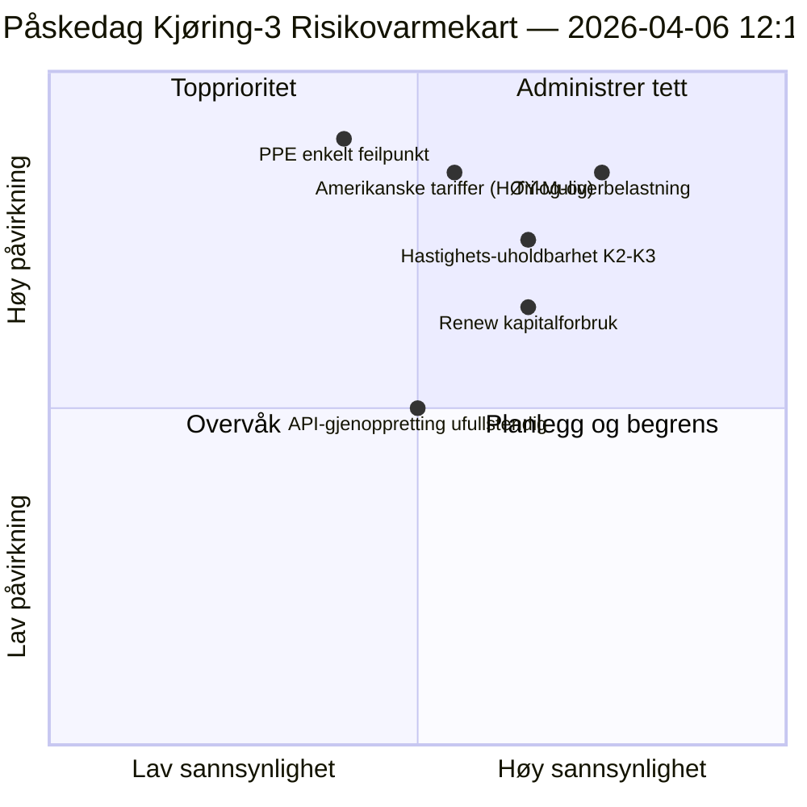

<!-- SPDX-FileCopyrightText: 2026 Hack23 AB -->
<!-- SPDX-License-Identifier: Apache-2.0 -->

# Utøvende Etterretningssammendrag — Første Påskedag Kjøring 3: API-gjenoppretting + Konvergenssone | 2026-04-06

**Klassifisering:** OSINT — Offentlig parlamentarisk protokoll
**Tillit:** 🟡 MIDDELS (recess; første bekreftede API-endepunktsgjenoppretting; trilog-overbelastningsrisiko HØY)
**Kjøring:** `analysis/daily/2026-04-06/breaking-3/` (12:15 UTC)
**Dekning:** Påskerecess dag 11/18 middag; første bekreftede adopted-texts-strøm-gjenoppretting
**Generert:** 2026-05-16 (retrospektivt sammendrag, ingen nye MCP-anrop)
**Primære kilder:** Adopted-texts-strøm (86 elementer, gjenopprettet); 6 nye metoder (consequence-trees, legislative-disruption, velocity-risk, capital-risk, voting-patterns, agent-risk).

---

## 🎯 BLUF

**Kjøring-3 produserer dagens mest konsekvente operative funn — den *første bekreftede EP API-endepunktsgjenopprettingen* under den 11-dagers recessens: adopted-texts-strømmen gikk fra Mode-B (JSON-parsefeil kl. 06:45 UTC) til ren suksess (86 elementer returnert kl. 12:15 UTC), noe som validerer Kjøring-2s «backend-reaktivering»-hypotese.** Utover overvåkningssignalet fullfører kjøringen de gjenværende seks analysemetodene som ikke ble dekket i tidligere breaking-kjøringer og produserer tre strukturelle bidrag: **(a) Konsekvenstrær** kartlegger tre kaskaderende effektkjeder — lovgivningssprint → implementeringskaskade, API-gjenoppretting → datatransparenskaskade, PPE dual-track → politisk-kapital-kaskade — som konvergerer mot april 14–23 som **«konvergenssonen»** der Komitéuken, ECB-rentebeslutning og de første plenumvoteringe etter recessens sammenfaller; **(b) Lovgivningshastighetrisiko** dokumenterer EP10 År 2 som **2,11 akter/sesjon, +44 % ÅtÅ, den høyeste siden EP7s eurosonekrisereaksjon i 2012** — et bærekraftsproblem som flagges for K2–K3; **(c) Politisk kapitalrisiko** identifiserer gruppenivåkapitaldynamikk — **PPE akkumulerer, Greens/EFA synkende, Renew brenner raskest** — med systemrobusthet 6/10 og et enkelt feilpunkt ved PPE. Kjøringens risikoregister summerer 15 risikoer (0 kritiske, 4 høye, 7 medium, 4 lave), med trilog-overbelastning (HØY, Sannsynlig) og amerikanske tariffer (HØY, Mulig) som de to øverste. Robusthetsscore 5,8/10 indikerer målbar men ikke-kritisk belastning.

---

## 🧭 3 Beslutninger dette sammendraget støtter

| # | Beslutning | Hvem bestemmer | Frist | Bevis |
|:-:|----------|-------------|:--------:|----------|
| 1 | **Konvergenssone forhøyet overvåking** — april 14–23 trenger T+0/+1/+2 tripwires | EP etterretningsoperasjoner; pressetjenesten | innen 12. april | §Konsekvenstrær (konvergenssone) |
| 2 | **Hastighetsbærekraftgjennomgang** — 2,11 akter/sesjon uholdbart utover K2 | Konferanse av presidentene | løpende K2 | §Hastighetsrisiko (+44 % ÅtÅ) |
| 3 | **Renew kapitalforbrukningsovervåking** — raskest forbrennende gruppe; mellomterm-stabilitetsbekymring | Renew-ledelse; EPP-koordinasjon | løpende | §Politisk kapitalrisiko (Renew) |

---

## 📰 60-Sekunders Lesing

- 🔴 **Første bekreftede API-endepunktsgjenoppretting** — adopted-texts-strøm Mode-B → suksess (86 elementer).
- 🟠 **Konvergenssone 14.–23. april** — Komitéuke + ECB + plenum sammenfaller.
- 🟢 **Hastighetsavvik: 2,11 akter/sesjon (+44 % ÅtÅ)** — den høyeste siden EP7s eurosonereaksjon 2012.
- 🟡 **Politisk kapital:** PPE akkumulerer · Greens synkende · Renew brenner raskest.
- 🔵 **Systemrobusthet 6/10** — enkelt feilpunkt ved PPE.
- 🟣 **15-risikoregister:** 0 kritiske · 4 høye · 7 medium · 4 lave; robusthet 5,8/10.
- 🩷 **Topp 2-risikoer:** Trilog-overbelastning (HØY, Sannsynlig) · Amerikanske tariffer (HØY, Mulig).
- ⚪ **Tillit MIDDELS** — primær gjenopprettingsobservasjon; strukturelle avlesninger høye.

---

## 🌳 Tre Kaskaderende Effektkjeder (Kjøring-3s særskilte bidrag)

| Kjede | Utløser | Kaskade | Konvergenspunkt |
|-------|---------|---------|-------------------|
| **Lovgivningssprint → Implementeringskaskade** | Pre-recess-burst 26. mars | 42 EP10-2026-tekster trer inn i implementering K2 | 14.–17. april Komitéuke |
| **API-gjenoppretting → Datatransparenskaskade** | Adopted-texts Mode-B→ren gjenoppretting | Andre endepunkter følger; full transparens gjenopprettet | 8.–10. april forventet |
| **PPE dual-track → Politisk kapital-kaskade** | Dual-track-vedtakelse 26. mars | Kapitalakkumulering ved PPE; forbruk ved Renew | 20.–23. april første plenum |

**Konvergenssone:** 14.–23. april — alle tre kjeder lander i det samme 10-dagers-vinduet.

---

## ⚠️ Risikomomentbilde

---

## 🔮 Topp Fremtidige Utløsere (neste 14 dager)

1. **8.–10. april — Full API-gjenoppretting forventet** (55 % sannsynlighet per Kjøring-3-modell).
2. **14. april — Komitéuke åpner** — konvergenssone Dag 1.
3. **17. april — ECB-rentebeslutning** — økonomi-kontekstvariabel.
4. **20.–23. april — første post-recess plenum** — dual-track-validering.
5. **Slutt-K2 — hastighetsbærekraftgjennomgang** — 2,11 akter/sesjon-test.

---

## 🛡️ Kildekvali tetsvurdering

- **API-gjenoppretting (A1):** Kjøring-3 direkte observasjon; første bekreftede endepunktsreaktivering.
- **Hastighet 2,11 akter/sesjon (A1):** forhåndsberegnede statistikker; historisk sammenligning verifiserbar.
- **Kapitalforbruksrangering (A2):** gruppekapi tal-metodologi; mellom-konfidensordering.
- **15-risikoregister (A2):** systematisk metodologi; robusthetsscore 5,8/10 verifiserbar.
- **Nettokonfidans:** 🟢 HØY på API-gjenoppretting; 🟡 MIDDELS på kapitalforbruksprognose.

---

## 📎 Kjøringsartefakter

| Lag | Artefakt | Hvorfor |
|-------|----------|-----|
| Artikkel | `article.md` | Offentlig Kjøring-3-narrativ |
| Syntese | `synthesis-summary.md` | API-gjenoppretting + 6 nye metoder |
| Metoder | consequence-trees · legislative-disruption · velocity-risk · political-capital-risk · voting-patterns · agent-risk-workflow | Seks nye metoder (denne kjøring) |
| Ledsager | breaking (00:33) · breaking-2 (06:45) · committee-reports (05:03) · propositions (05:47) | Første Påskedag-klynge |

---

**Dokumentkontroll**
- **Malereferanse:** `analysis/templates/executive-brief.md`
- **Artefaktsti:** `analysis/daily/2026-04-06/breaking-3/executive-brief.md`
- **Klassifisering:** Offentlig
- **Retrospektiv:** Sammendrag skrevet 2026-05-16 fra kjøringens arkiverte artefakter; **ingen nye MCP-anrop ble gjort**.
