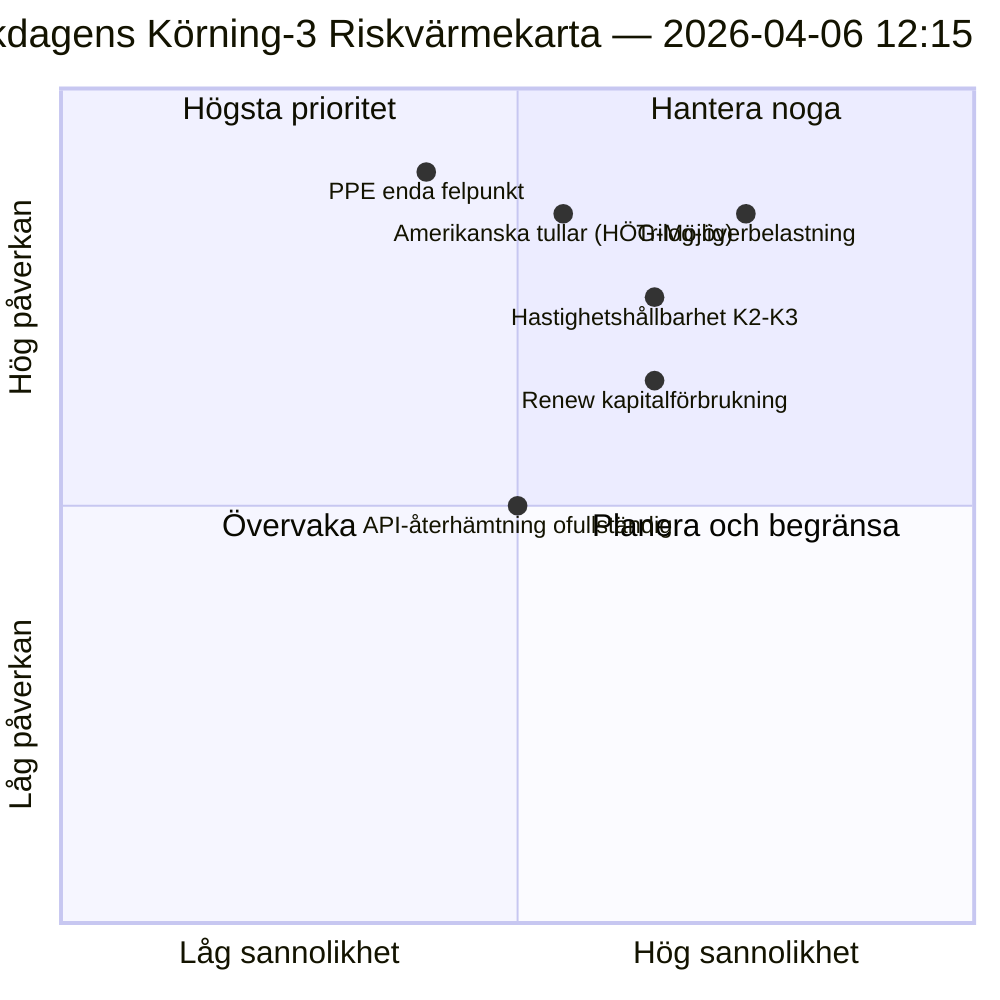

<!-- SPDX-FileCopyrightText: 2026 Hack23 AB -->
<!-- SPDX-License-Identifier: Apache-2.0 -->

# Exekutiv Underrättelsesammanfattning — Påskdagens Körning 3: API-återhämtning + Konvergenszon | 2026-04-06

**Klassificering:** OSINT — Offentlig parlamentarisk handling
**Förtroende:** 🟡 MEDEL (recessen; första bekräftade API-slutpunktsåterhämtningen; trilog-överbelastningsrisk HÖG)
**Körning:** `analysis/daily/2026-04-06/breaking-3/` (12:15 UTC)
**Täckning:** Påskrecessdag 11/18 mitt på dagen; första bekräftade adopted-texts-flödesåterhämtningen
**Genererad:** 2026-05-16 (retroaktiv sammanfattning, inga nya MCP-anrop)
**Primära källor:** Adopted-texts-flöde (86 poster, återhämtat); 6 nya metoder (consequence-trees, legislative-disruption, velocity-risk, capital-risk, voting-patterns, agent-risk).

---

## 🎯 BLUF

**Körning-3 producerar dagens mest konsekventa operativa fynd — den *första bekräftade EP API-slutpunktsåterhämtningen* under den 11-dagars recessens: adopted-texts-flödet övergick från Mode-B (JSON-parsningsfel kl. 06:45 UTC) till rent framgång (86 poster returnerades kl. 12:15 UTC), vilket validerar Körning-2:s "backend-återaktivering"-hypotes.** Utöver övervakningssignalen slutför körningen de återstående sex analysmetoderna som inte täcktes i tidigare brytande körningar och producerar tre strukturella bidrag: **(a) Konsekvensträd** kartlägger tre kaskaderande effektkedjor — legislativ-sprint → implementeringskaskad, API-återhämtning → datatransparenskaskad, PPE dual-track → politiskt-kapital-kaskad — som konvergerar mot april 14–23 som **"konvergenszonen"** där Kommittéveckan, ECB-räntebeslut och de första post-recesses plenarröstningarna inträffar simultaneously; **(b) Lagstiftningshastighetsrisk** dokumenterar EP10 År 2 som **2,11 akter/session, +44 % YoY, den högsta sedan EP7:s eurozonkrisrespons 2012** — en hållbarhetsfråga som flaggas för K2–K3; **(c) Politisk kapitalrisk** identifierar gruppnivåkapitaldynamik — **PPE ackumulerar, Greens/EFA minskar, Renew förbrukar snabbast** — med systemresiliens 6/10 och en enda felpunkt vid PPE. Körningens riskregister summerar 15 risker (0 kritiska, 4 höga, 7 medium, 4 låga), med trilog-överbelastning (HÖG, Trolig) och amerikanska tullar (HÖG, Möjlig) som de två högsta. Resilienspoäng 5,8/10 indikerar mätbar men icke-kritisk belastning.

---

## 🧭 3 Beslut som denna sammanfattning stödjer

| # | Beslut | Vem beslutar | Deadline | Bevis |
|:-:|----------|-------------|:--------:|----------|
| 1 | **Konvergenszon förhöjd övervakning** — April 14–23 behöver T+0/+1/+2 trippeltrådar | EP underrättelseoperationer; presstjänsten | senast 12 april | §Konsekvensträd (konvergenszon) |
| 2 | **Hastighetshållbarhetsgranskning** — 2,11 akter/session ohållbart bortom K2 | Konferens med ordförandena | löpande K2 | §Hastighetsrisk (+44 % YoY) |
| 3 | **Renew kapitalförbrukningsövervakning** — snabbast förbrukande grupp; mellantermsstabilitetsfråga | Renew-ledning; EPP-koordination | löpande | §Politisk kapitalrisk (Renew) |

---

## 📰 60-Sekunders Läsning

- 🔴 **Första bekräftade API-slutpunktsåterhämtning** — adopted-texts-flöde Mode-B → framgång (86 poster).
- 🟠 **Konvergenszon 14–23 april** — Kommittéveckan + ECB + plenum sammanfaller.
- 🟢 **Hastighetsanomal: 2,11 akter/session (+44 % YoY)** — den högsta sedan EP7:s eurozonrespons 2012.
- 🟡 **Politiskt kapital:** PPE ackumulerar · Greens minskar · Renew förbrukar snabbast.
- 🔵 **Systemresiliens 6/10** — enda felpunkt vid PPE.
- 🟣 **15-riskregister:** 0 kritiska · 4 höga · 7 medium · 4 låga; resiliens 5,8/10.
- 🩷 **Topp 2-risker:** Trilog-överbelastning (HÖG, Trolig) · Amerikanska tullar (HÖG, Möjlig).
- ⚪ **Förtroende MEDEL** — primär återhämtningsobservation; strukturella avläsningar höga.

---

## 🌳 Tre Kaskaderande Effektkedjor (Körning-3:s särskiljer bidrag)

| Kedja | Utlösare | Kaskad | Konvergenspunkt |
|-------|---------|---------|-------------------|
| **Legislativ-sprint → Implementeringskaskad** | Förrecessions-burst 26 mars | 42 EP10-2026-texter inträder implementering K2 | 14–17 april Kommittéveckan |
| **API-återhämtning → Datatransparenskaskad** | Adopted-texts Mode-B→ren återhämtning | Andra slutpunkter följer; full transparens återställs | 8–10 april förväntat |
| **PPE dual-track → Politisk kapital-kaskad** | Dual-track-antagande 26 mars | Kapitalackumulering vid PPE; förbrukning vid Renew | 20–23 april första plenum |

**Konvergenszon:** 14–23 april — alla tre kedjorna landar i samma 10-dagarsfönster.

---

## ⚠️ Riskmomentsavläsning

---

## 🔮 Topp Framtida Utlösare (nästa 14 dagar)

1. **8–10 april — Full API-återhämtning förväntad** (55 % sannolikhet per Körning-3-modell).
2. **14 april — Kommittéveckan öppnar** — konvergenszon Dag 1.
3. **17 april — ECB-räntebeslut** — ekonomisk-kontextvariabel.
4. **20–23 april — första post-recesses plenum** — dual-track-validering.
5. **Slut-K2 — hastighetshållbarhetsgranskning** — 2,11 akter/session-test.

---

## 🛡️ Källkvalitetsbedömning

- **API-återhämtning (A1):** Körning-3 direkt observation; första bekräftade slutpunktsåteraktivering.
- **Hastighet 2,11 akter/session (A1):** förberäknade statistik; historisk jämförelse verifierbar.
- **Kapitalförbrukningsrankning (A2):** gruppokapital-metodologi; medelhögt konfidenssortering.
- **15-riskregister (A2):** systematisk metodologi; resilienspoäng 5,8/10 verifierbar.
- **Nettokonfidans:** 🟢 HÖG på API-återhämtning; 🟡 MEDEL på kapitalförbrukningsprognos.

---

## 📎 Körningsartefakter

| Lager | Artefakt | Varför |
|-------|----------|-----|
| Artikel | `article.md` | Offentlig-vänd Körning-3-narrativ |
| Syntes | `synthesis-summary.md` | API-återhämtning + 6 nya metoder |
| Metoder | consequence-trees · legislative-disruption · velocity-risk · political-capital-risk · voting-patterns · agent-risk-workflow | Sex nya metoder (denna körning) |
| Sällskapsanalys | breaking (00:33) · breaking-2 (06:45) · committee-reports (05:03) · propositions (05:47) | Påskdagskluster |

---

**Dokumentkontroll**
- **Mallreferens:** `analysis/templates/executive-brief.md`
- **Artefaktsökväg:** `analysis/daily/2026-04-06/breaking-3/executive-brief.md`
- **Klassificering:** Offentlig
- **Retroaktiv:** Sammanfattning skriven 2026-05-16 från körningens arkiverade artefakter; **inga nya MCP-anrop gjordes**.
